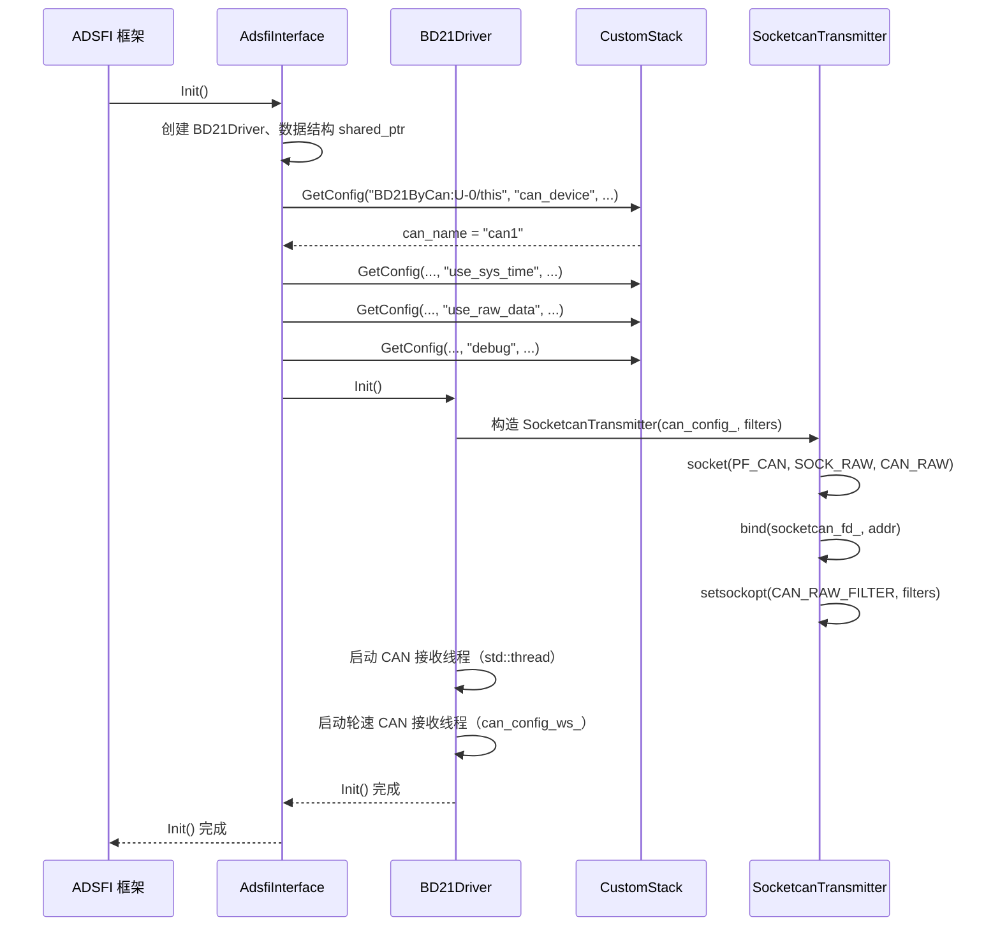
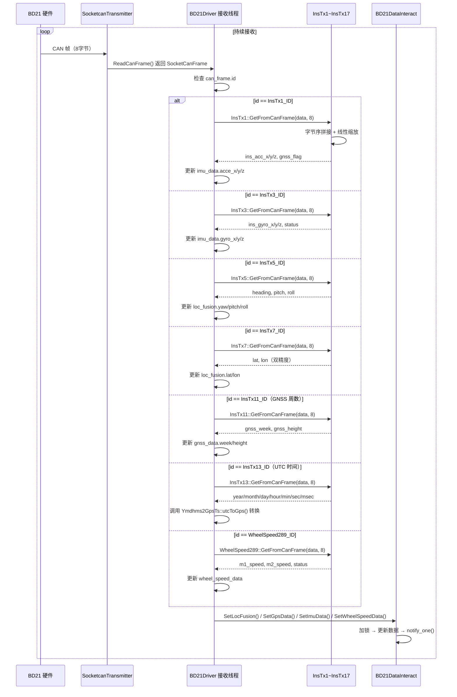
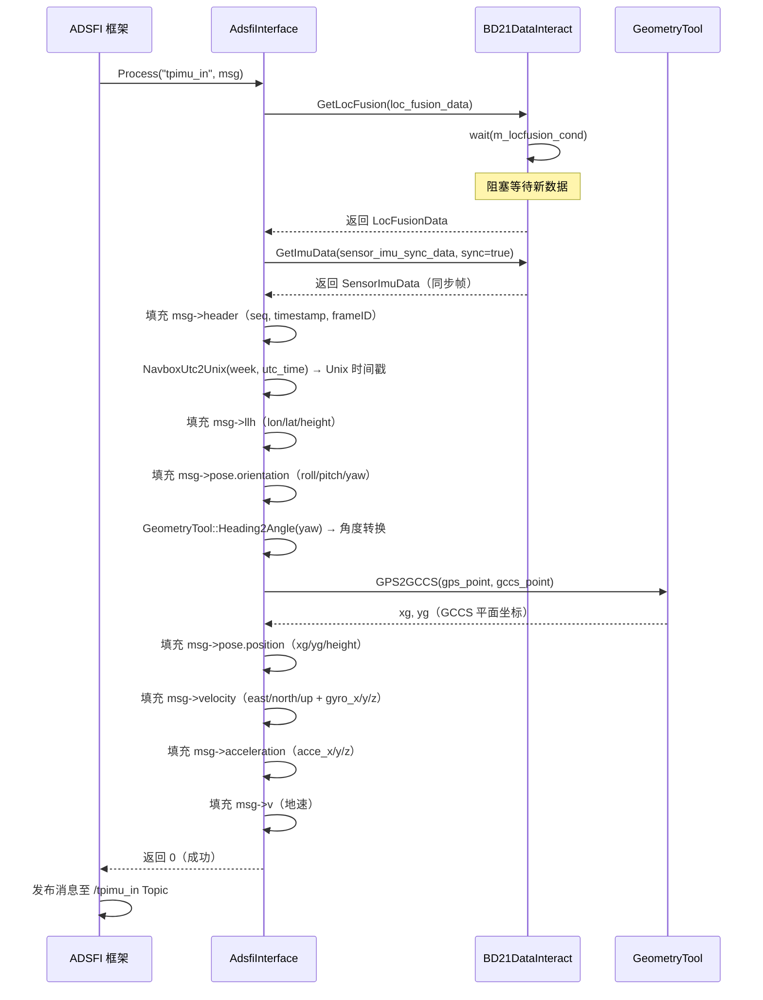
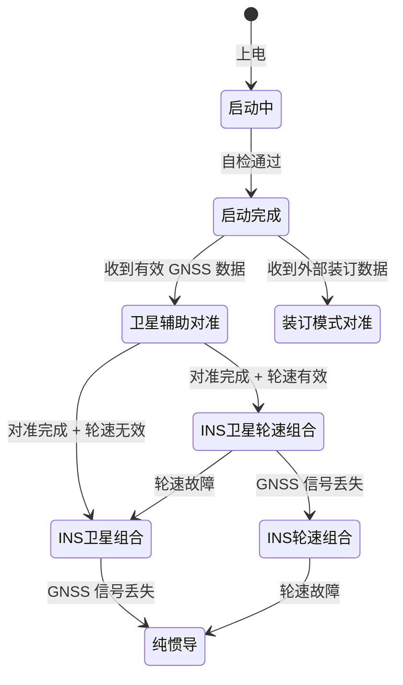
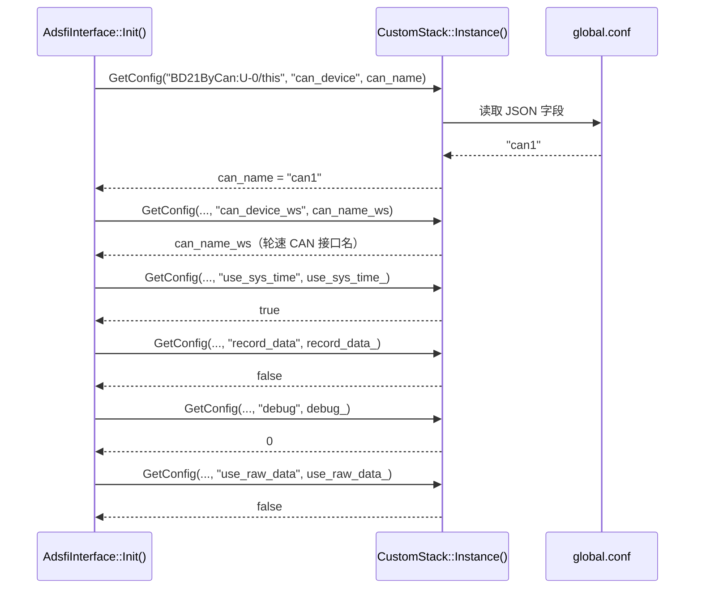

# BD21 IMU 硬件抽象层模块设计文档

## 1. 文档信息

| 项目 | 内容 |
| --- | --- |
| 模块名称 | BD21 IMU 硬件抽象层（bd21_imu） |
| 模块编号 | HAL-BD21-IMU-001 |
| 所属系统 / 子系统 | 自动驾驶感知系统 / 硬件抽象层（Hardware Abstraction Layer） |
| 模块类型 | 平台模块 |
| 负责人 | 待填写 |
| 参与人 | 待填写 |
| 当前状态 | 草稿 |
| 版本号 | V1.0 |
| 创建日期 | 2026-03-04 |
| 最近更新 | 2026-03-04 |

---

## 2. 模块概述

### 2.1 模块定位

本模块是 BD21 惯性导航系统（INS）/ 全球导航卫星系统（GNSS）/ 惯性测量单元（IMU）传感器的硬件抽象层驱动，运行于自动驾驶感知平台之上。

**模块在系统中的职责：**

- 通过 Linux SocketCAN 接口与 BD21 设备建立物理通信链路，以阻塞读方式持续接收 CAN 总线数据帧。
- 按照 BD21 私有 CAN 协议（InsTx1 ~ InsTx17，共 17 种报文类型）对原始 CAN 帧进行解析与物理量转换，将二进制编码数据还原为工程单位数值。
- 将解析后的传感器数据分类存储至线程安全的共享数据区（BD21DataInteract 单例），供上层接口按需读取。
- 实现 ADSFI 标准接口（AdsfiInterface），将内部数据结构转换为平台统一消息格式（MsgHafLocation、MsgHafGnssInfo、MsgHafIMU、MsgHafWheelSpeedList），并通过 Topic 机制发布至下游消费者。
- 负责时间戳的格式转换，包括 GPS 周 + 周内秒（TOW）到 Unix 时间戳的转换，以及 UTC 时间到 GPS 时间的双向转换。
- 负责坐标系转换，将 WGS-84 经纬度坐标转换为高斯-克吕格（GCCS）平面坐标，供定位融合模块使用。

**上游模块（输入来源）：**

- BD21 INS/GNSS 硬件设备，通过 CAN 总线（默认接口 `can1`）输出传感器数据。
- 系统配置加载器（CustomStack），提供运行时参数配置。

**下游模块（输出去向）：**

- `/ivsensorgps`：GNSS 定位数据，消息类型 `SensorGps`，供定位融合、地图匹配等模块消费。
- `/tpimu_in`：INS/GNSS/轮速融合定位数据，消息类型 `SensorLocFusion`，供轨迹预测、控制模块消费。
- `/ivsensorimu`：原始 IMU 测量数据，消息类型 `SensorImu`，供姿态估计、运动补偿等模块消费。
- 轮速数据通过 `MsgHafWheelSpeedList` 消息发布，供里程计、轮速融合模块消费。

**对外提供能力：**

本模块通过 ADSFI 框架的标准接口对外提供能力，不直接暴露 SDK 或 RPC 接口。上层模块通过订阅 Topic 获取传感器数据，接口形式为 ARA ADSFI 消息。

---

### 2.2 设计目标

**功能目标：**

- 屏蔽 BD21 设备的底层 CAN 通信细节，向上层提供统一的传感器数据抽象接口。
- 完整支持 BD21 协议定义的 17 种 CAN 报文类型的解析，覆盖 INS 惯导数据、GNSS 定位数据、UTC 时间数据、精度因子数据及里程计数据。
- 支持校正数据（INS 融合输出）与原始数据（传感器直接输出）的可配置切换，满足不同调试与部署场景需求。
- 提供四路独立的数据发布通道：融合定位（MsgHafLocation）、GNSS 信息（MsgHafGnssInfo）、IMU 原始数据（MsgHafIMU）、轮速数据（MsgHafWheelSpeedList）。

**性能目标：**

- CAN 帧接收线程以阻塞 I/O 方式运行，单帧处理延迟（从 CAN 帧到达至数据写入共享区）应低于 1 ms。
- ADSFI 接口的 Process() 调用延迟（从共享区读取至消息填充完成）应低于 5 ms。
- 系统整体端到端延迟（从设备输出至 Topic 发布）目标低于 20 ms。
- 支持 BD21 设备的标准输出频率：IMU 数据 100 Hz，GNSS 数据 10 Hz，融合定位数据 100 Hz，轮速数据 100 Hz。

**稳定性目标：**

- CAN 接收线程在 socket 读取失败时应记录错误日志并继续运行，不因单帧错误导致线程退出。
- 数据共享区采用互斥锁与条件变量保护，确保多线程并发访问的数据一致性。
- 模块初始化失败（如 CAN socket 绑定失败）时应输出明确的错误信息，不产生未定义行为。

**安全目标：**

- CAN 帧长度校验：所有协议解析函数在处理前均验证帧数据长度必须为 8 字节，不满足条件时返回错误码 -1，拒绝处理。
- 坐标转换前进行 NaN 值检查，防止无效浮点数传播至下游模块。
- 不对外暴露原始 CAN socket 文件描述符，封装于 SocketcanTransmitter 类内部。

**可维护性 / 可扩展性目标：**

- 协议解析逻辑集中于 `can_recv_protocol.h`，新增报文类型只需添加对应结构体及 `GetFromCanFrame()` 方法，不影响其他模块。
- 数据共享区（BD21DataInteract）采用单例模式，接口固定，内部数据结构变更不影响调用方。
- 配置参数通过 `global.conf` 外部化管理，支持运行时调整 CAN 接口名称、调试级别等参数，无需重新编译。

---

### 2.3 设计约束

**硬件平台 / OS / 架构约束：**

- 目标平台：Linux（内核版本 ≥ 4.x），需支持 SocketCAN 子系统（`CONFIG_CAN`、`CONFIG_CAN_RAW`）。
- 依赖 Linux 网络接口管理（`net/if.h`、`sys/ioctl.h`），不可移植至非 Linux 平台。
- CAN 接口需预先通过 `ip link set canX up type can bitrate XXXXXX` 配置并激活，驱动本身不负责 CAN 接口的物理层初始化。
- 处理器架构：x86_64 或 ARM64，字节序为小端（Little-Endian）。CAN 协议数据为大端（Big-Endian）编码，解析时需进行字节序转换。

**中间件 / 框架依赖：**

- ADSFI 框架：依赖 `BaseAdsfiInterface`、`ara::adsfi` 消息类型定义、`adsfi_manager` 管理器。
- CustomStack 配置加载器：依赖 `config_loader/custom_stack.h`，用于读取 `global.conf` 中的运行时参数。
- GeometryTool：依赖 `geometry_tools.hpp`，提供 GPS 坐标到 GCCS 坐标的转换及航向角转换功能，内部使用 Proj4 库。
- ap_log：依赖 `ap_log/ap_log_interface.h`，提供统一的日志输出接口。
- faulthandle_api：依赖 `monitor/faulthandle_api.hpp`，提供故障上报接口。

**编译依赖（model.cmake）：**

- `pthread`：多线程支持。
- `proj`（Proj4）：地理坐标投影变换。
- `dl`：动态链接库加载。
- `glog`：Google 日志库。

**法规 / 标准约束：**

- 本模块为平台驱动层，不直接涉及功能安全等级（ASIL）要求，但需满足平台整体的代码规范要求。
- CAN 通信协议遵循 BD21 设备厂商私有协议规范。

**兼容性 / 版本约束：**

- 本模块与 BD21 设备固件版本绑定，协议定义（CAN ID 映射、数据格式）需与设备固件版本保持一致。
- C++ 标准：C++14 及以上（使用了 `std::chrono`、`std::condition_variable`、`std::make_shared` 等特性）。

---

## 3. 需求与范围

### 3.1 功能需求（FR）

| 需求 ID | 描述 | 优先级 |
| --- | --- | --- |
| FR-01 | 通过 Linux SocketCAN 接口建立与 BD21 设备的 CAN 通信链路，支持 CAN 帧过滤配置 | 高 |
| FR-02 | 解析 BD21 协议 InsTx1 报文：INS 校正加速度（X/Y/Z）及 GNSS 标志位（heading/pos） | 高 |
| FR-03 | 解析 BD21 协议 InsTx2 报文：IMU 原始加速度（X/Y/Z）及 GNSS 差分龄期、卫星数 | 高 |
| FR-04 | 解析 BD21 协议 InsTx3 报文：INS 校正陀螺角速度（X/Y/Z）及 INS 状态字 | 高 |
| FR-05 | 解析 BD21 协议 InsTx4 报文：IMU 原始陀螺角速度（X/Y/Z）及 INS 故障状态字 | 高 |
| FR-06 | 解析 BD21 协议 InsTx5 报文：INS 欧拉角（航向角/俯仰角/横滚角） | 高 |
| FR-07 | 解析 BD21 协议 InsTx6 报文：INS 定位高度及设备内部时间戳 | 高 |
| FR-08 | 解析 BD21 协议 InsTx7 报文：INS 融合定位经纬度（双精度浮点，分辨率 0.1 μ°） | 高 |
| FR-09 | 解析 BD21 协议 InsTx8 报文：INS 东向速度、北向速度、对地速度 | 高 |
| FR-10 | 解析 BD21 协议 InsTx9 报文：INS 航向角标准差、纬度标准差、高度标准差、经度标准差 | 高 |
| FR-11 | 解析 BD21 协议 InsTx10 报文：GNSS 状态字、GNSS 航向角、GNSS 俯仰角 | 高 |
| FR-12 | 解析 BD21 协议 InsTx11 报文：GNSS 定位高度及 GPS 周数 | 高 |
| FR-13 | 解析 BD21 协议 InsTx12 报文：GNSS 定位经纬度（双精度浮点，分辨率 0.1 μ°） | 高 |
| FR-14 | 解析 BD21 协议 InsTx13 报文：UTC 时间（年/月/日/时/分/秒/毫秒） | 高 |
| FR-15 | 解析 BD21 协议 InsTx14 报文：GNSS 精度因子（GDOP/HDOP/PDOP）及真北航迹角 | 中 |
| FR-16 | 解析 BD21 协议 InsTx15 报文：GNSS 水平速度、垂直速度及累计里程 | 中 |
| FR-17 | 解析 BD21 协议 InsTx16 报文：INS 修正欧拉角（航向/俯仰/横滚） | 中 |
| FR-18 | 解析 BD21 协议 InsTx17 报文：四路里程计原始计数值（OD1/OD2/OD3/OD4） | 中 |
| FR-19 | 解析轮速 CAN 报文（ID 0x289）：左右轮速（m/s）及轮速有效状态位 | 高 |
| FR-20 | 将解析后的 INS/GNSS/IMU/轮速数据分别存入线程安全共享数据区，支持生产者-消费者并发访问 | 高 |
| FR-21 | 实现 GPS 周 + 周内秒（TOW）到 Unix 时间戳的转换，精度到纳秒级 | 高 |
| FR-22 | 实现 UTC 时间（年月日时分秒毫秒）到 GPS 周 + TOW 的转换，正确处理闰秒（截至 2017 年共 18 个闰秒） | 高 |
| FR-23 | 实现 WGS-84 经纬度坐标到高斯-克吕格（GCCS）平面坐标的转换 | 高 |
| FR-24 | 实现 AdsfiInterface::Process(MsgHafLocation) 接口，填充融合定位消息（位置/姿态/速度/加速度） | 高 |
| FR-25 | 实现 AdsfiInterface::Process(MsgHafGnssInfo) 接口，填充 GNSS 信息消息（经纬高/卫星数/精度因子/速度） | 高 |
| FR-26 | 实现 AdsfiInterface::Process(MsgHafIMU) 接口，填充 IMU 原始测量消息（角速度/线加速度/温度） | 高 |
| FR-27 | 实现 AdsfiInterface::Process(MsgHafWheelSpeedList) 接口，填充四轮轮速消息 | 高 |
| FR-28 | 支持通过配置参数 `use_raw_data` 切换使用校正数据或原始传感器数据 | 中 |
| FR-29 | 支持通过配置参数 `use_sys_time` 切换使用设备时间戳或系统时钟时间戳 | 中 |
| FR-30 | 支持通过配置参数 `debug` 控制调试信息输出级别 | 低 |
| FR-31 | 支持通过配置参数 `record_data` 控制原始设备数据的记录功能 | 低 |

---

### 3.2 非功能需求（NFR）

| 需求 ID | 类型 | 指标 | 目标值 |
| --- | --- | --- | --- |
| NFR-01 | 性能 | CAN 帧单帧处理延迟（接收至写入共享区） | < 1 ms |
| NFR-02 | 性能 | ADSFI Process() 接口调用延迟 | < 5 ms |
| NFR-03 | 性能 | 端到端延迟（设备输出至 Topic 发布） | < 20 ms |
| NFR-04 | 性能 | IMU 数据发布频率 | 100 Hz |
| NFR-05 | 性能 | GNSS 数据发布频率 | 10 Hz |
| NFR-06 | 性能 | 融合定位数据发布频率 | 100 Hz |
| NFR-07 | 性能 | 轮速数据发布频率 | 100 Hz |
| NFR-08 | 稳定性 | CAN 帧读取失败时模块不崩溃，持续运行 | 是 |
| NFR-09 | 稳定性 | 多线程并发访问共享数据区无数据竞争 | 是 |
| NFR-10 | 稳定性 | 模块连续运行时间 | ≥ 72 小时无异常退出 |
| NFR-11 | 精度 | 经纬度解析精度 | 0.1 μ°（约 0.01 m） |
| NFR-12 | 精度 | 加速度解析精度 | 0.0001220703125 × g ≈ 1.197 × 10⁻³ m/s² |
| NFR-13 | 精度 | 陀螺角速度解析精度 | 0.0076293 °/s |
| NFR-14 | 精度 | 欧拉角解析精度 | 0.010986 ° |
| NFR-15 | 精度 | 速度解析精度 | 0.0030517 m/s |
| NFR-16 | 精度 | 时间戳精度 | 纳秒级（Unix 时间戳秒 + 纳秒分量） |
| NFR-17 | 资源 | CPU 占用率（正常运行） | < 5%（单核） |
| NFR-18 | 资源 | 内存占用 | < 10 MB |
| NFR-19 | 可维护性 | 新增 CAN 报文类型所需修改文件数 | ≤ 2（can_recv_protocol.h + BD21ByCanWS.hpp） |
| NFR-20 | 安全性 | CAN 帧长度非 8 字节时拒绝解析 | 是 |

---

### 3.3 范围界定

#### 3.3.1 本模块必须实现：

- BD21 设备 CAN 总线通信的建立与维护（SocketCAN 接口封装）。
- BD21 私有协议 InsTx1 ~ InsTx17 全部 17 种报文的解析与物理量转换。
- 轮速 CAN 报文（ID 0x289）的解析与轮速计算。
- 线程安全的传感器数据共享区（BD21DataInteract 单例）的实现。
- GPS 时间与 Unix 时间的双向转换（含闰秒处理）。
- WGS-84 经纬度到 GCCS 平面坐标的转换。
- ADSFI 标准接口的四个 Process() 方法实现。
- 运行时配置参数的加载与应用。

#### 3.3.2 本模块明确不做：

- CAN 总线物理层的初始化（`ip link set` 等操作由系统启动脚本负责）。
- BD21 设备的固件升级或参数配置（通过独立工具完成）。
- 传感器数据的融合算法（融合由下游定位融合模块负责）。
- 数据的持久化存储（`record_data` 功能的具体存储实现由外部模块负责，本模块仅提供开关控制）。
- GNSS 差分基站通信（RTK 基站数据链路由独立模块管理）。
- 传感器标定（外参标定由独立标定工具完成，标定结果通过配置文件注入）。
- 多设备实例管理（当前设计为单设备单实例，多设备场景需扩展）。

---

### 3.4 需求 - 设计 - 验证映射

| 需求 ID | 对应设计章节 | 对应接口 / 类 | 验证方式 / 用例 |
| --- | --- | --- | --- |
| FR-01 | 5.1、5.3 | SocketcanTransmitter 构造函数 | TC-01：验证 CAN socket 创建与绑定 |
| FR-02 ~ FR-18 | 7.1 | InsTx1 ~ InsTx17::GetFromCanFrame() | TC-02：构造标准 CAN 帧，验证解析结果与预期物理量一致 |
| FR-19 | 7.1 | WheelSpeed289::GetFromCanFrame() | TC-03：验证轮速计算公式正确性 |
| FR-20 | 5.1、7.1 | BD21DataInteract::Set/Get 系列方法 | TC-04：多线程并发读写测试，验证无数据竞争 |
| FR-21 | 7.1 | NavboxUtc2Unix() | TC-05：已知 GPS 周 + TOW，验证转换结果与参考 Unix 时间戳一致 |
| FR-22 | 7.1 | Ymdhms2GpsTs::utcToGps() | TC-06：已知 UTC 时间，验证 GPS 周 + TOW 转换结果 |
| FR-23 | 5.3 | GeometryTool::GPS2GCCS() | TC-07：已知经纬度，验证 GCCS 坐标转换结果 |
| FR-24 | 6.1 | AdsfiInterface::Process(MsgHafLocation) | TC-08：注入 LocFusionData，验证消息字段填充完整性 |
| FR-25 | 6.1 | AdsfiInterface::Process(MsgHafGnssInfo) | TC-09：注入 GnssData，验证消息字段填充完整性 |
| FR-26 | 6.1 | AdsfiInterface::Process(MsgHafIMU) | TC-10：注入 SensorImuData，验证消息字段填充完整性 |
| FR-27 | 6.1 | AdsfiInterface::Process(MsgHafWheelSpeedList) | TC-11：注入 WheelSpeedData，验证四轮轮速消息填充 |
| FR-28 | 5.3 | BD21Driver::use_raw_data_ | TC-12：切换 use_raw_data 配置，验证数据源切换 |
| FR-29 | 5.3 | BD21Driver::use_sys_time_ | TC-13：切换 use_sys_time 配置，验证时间戳来源切换 |
| NFR-08 | 8 | SocketcanTransmitter::ReadCanFrame() | TC-14：模拟 CAN 读取失败，验证线程不退出 |
| NFR-09 | 5.1 | BD21DataInteract 互斥锁机制 | TC-04（同上） |
| NFR-20 | 7.1 | GetFromCanFrame() 长度校验 | TC-15：传入非 8 字节帧，验证返回 -1 |


---

## 4. 设计思路

### 4.1 方案概览

BD21 IMU 硬件抽象层的核心设计问题是：如何将一个以 CAN 总线为通信介质、以私有二进制协议编码的硬件传感器，适配到自动驾驶平台的统一传感器数据接口体系中。

**整体拆解思路：**

将问题分解为三个正交的子问题：

1. **物理通信层**：如何可靠地从 CAN 总线读取原始帧数据。采用 Linux SocketCAN 标准接口，以阻塞 `read()` 系统调用实现零轮询的帧接收，由独立线程（BD21Driver 内部接收线程）持续运行。

2. **协议解析层**：如何将 8 字节的 CAN 帧二进制数据还原为有物理意义的工程量。采用静态结构体 + `GetFromCanFrame()` 方法的设计，每种报文类型对应一个独立结构体，解析逻辑内聚于结构体内部，通过大端字节序拼接 + 线性缩放公式完成转换。

3. **数据交换层**：如何在 CAN 接收线程（生产者）与 ADSFI 接口线程（消费者）之间安全地传递数据。采用单例模式的 BD21DataInteract 类，内部为每类数据维护独立的互斥锁和条件变量，实现细粒度的并发控制。

**关键流程与数据流走向：**

```
[BD21 硬件设备]
      │ CAN 总线（can1，500 kbps）
      ▼
[SocketcanTransmitter::ReadCanFrame()]
      │ SocketCanFrame（id + data[8]）
      ▼
[BD21Driver 接收线程]
      │ 按 CAN ID 分发
      ├─ InsTx1~InsTx9 → SensorImuData / LocFusionData
      ├─ InsTx10~InsTx15 → GnssData
      ├─ InsTx16~InsTx17 → LocFusionData（修正欧拉角 + 里程计）
      └─ WheelSpeed289 → WheelSpeedData
      │
      ▼
[BD21DataInteract 单例（线程安全共享区）]
      │ 条件变量通知
      ▼
[AdsfiInterface::Process() 系列方法]
      │ 数据格式转换 + 坐标变换 + 时间戳转换
      ├─ Process(MsgHafLocation) → /tpimu_in
      ├─ Process(MsgHafGnssInfo) → /ivsensorgps
      ├─ Process(MsgHafIMU) → /ivsensorimu
      └─ Process(MsgHafWheelSpeedList) → 轮速 Topic
```

**主要组件与职责边界：**

| 组件 | 文件 | 职责 |
| --- | --- | --- |
| SocketcanTransmitter | SocketCan.hpp | CAN socket 生命周期管理、帧收发 |
| InsTx1 ~ InsTx17 | can_recv_protocol.h | 单报文类型的解析与物理量转换 |
| WheelSpeed289 | can_recv_protocol.h | 轮速报文解析与轮速计算 |
| SensorImuData | can_recv_protocol.h | IMU 数据聚合结构体 |
| GnssData | can_recv_protocol.h | GNSS 数据聚合结构体 |
| LocFusionData | can_recv_protocol.h | INS 融合定位数据聚合结构体 |
| WheelSpeedData | can_recv_protocol.h | 四轮轮速数据聚合结构体 |
| BD21DataInteract | BD21ByCanWS.hpp | 线程安全数据共享区（单例） |
| BD21Driver | BD21ByCanWS.hpp | CAN 接收主循环、数据分发与聚合 |
| NavboxUtc2Unix() | BD21ByCanWS.hpp | GPS 时间到 Unix 时间戳转换 |
| Ymdhms2GpsTs | ymdhms2GpsTs.hpp | UTC 时间到 GPS 时间双向转换 |
| UserLockQueue<T> | UserLockQueue.h | 通用线程安全队列 |
| AdsfiInterface | adsfi_interface.h/cpp | ADSFI 标准接口实现、消息填充 |

---

### 4.2 关键决策与权衡

**决策 1：采用阻塞 I/O 而非非阻塞 I/O 读取 CAN 帧**

- 方案 A（选用）：阻塞 `read()`，接收线程在无数据时挂起，CPU 占用为零。
- 方案 B：非阻塞 `read()` + `select()`/`epoll()` 多路复用。
- 选择理由：BD21 设备持续以固定频率输出数据，阻塞读取模型更简单，无需额外的事件循环管理。对于单设备单通道场景，阻塞模型的延迟特性优于轮询模型。

**决策 2：协议解析采用结构体内聚方法而非集中解析函数**

- 方案 A（选用）：每个报文类型定义独立结构体，`GetFromCanFrame()` 方法内聚于结构体内部。
- 方案 B：集中式解析函数，通过 switch-case 按 CAN ID 分发。
- 选择理由：结构体内聚方式使每种报文的数据定义与解析逻辑紧密关联，新增报文类型时只需添加新结构体，不影响已有代码，符合开闭原则。同时便于单独测试每种报文的解析逻辑。

**决策 3：数据共享区采用单例模式**

- 方案 A（选用）：BD21DataInteract 单例，全局唯一实例，生产者和消费者均通过 `Instance()` 获取。
- 方案 B：通过依赖注入将数据共享对象传递给各组件。
- 选择理由：在当前架构中，BD21Driver（生产者）和 AdsfiInterface（消费者）分属不同的对象层次，单例模式避免了跨层传递引用的复杂性。代价是全局状态，但在单设备场景下可接受。

**决策 4：为每类数据维护独立的互斥锁和条件变量**

- 方案 A（选用）：LocFusion、GNSS、IMU、WheelSpeed 各自独立的 mutex + condition_variable。
- 方案 B：全局单一互斥锁保护所有数据。
- 选择理由：IMU 数据（100 Hz）与 GNSS 数据（10 Hz）更新频率差异显著，独立锁避免高频 IMU 更新阻塞低频 GNSS 读取，降低锁竞争概率，提升并发性能。

**决策 5：时间戳转换采用 GPS 周 + TOW 到 Unix 时间戳的直接计算**

- 方案 A（选用）：`NavboxUtc2Unix(week, tow) = UUDT + week × WEEKS + tow`，其中 `UUDT = 315964800 - 18`（GPS 纪元 Unix 时间减去 18 个闰秒）。
- 方案 B：通过 UTC 时间字段（InsTx13）逐步转换。
- 选择理由：GPS 周 + TOW 是设备输出的主要时间格式，直接计算路径最短，精度最高。UTC 时间字段（InsTx13）仅作为备用时间源，在 `use_sys_time` 模式下使用系统时钟替代。

**决策 6：坐标转换依赖外部 GeometryTool 而非内部实现**

- 方案 A（选用）：调用平台公共库 `GeometryTool::GPS2GCCS()`，内部使用 Proj4 库。
- 方案 B：在模块内部实现高斯-克吕格投影公式。
- 选择理由：坐标转换涉及椭球参数、投影带划分等复杂参数，使用经过验证的公共库可避免重复实现和潜在精度问题，同时保持与平台其他模块的坐标系一致性。

---

### 4.3 与现有系统的适配

**ADSFI 框架适配：**

AdsfiInterface 继承自 `BaseAdsfiInterface`，通过重写 `Init()` 方法完成驱动初始化，通过重写四个 `Process()` 重载方法响应框架的数据请求调用。框架通过 `BASE_TEMPLATE_FUNCION` 宏自动注册消息类型与对应 Process() 方法的映射关系，无需手动维护分发逻辑。

**配置系统适配：**

通过 `CustomStack::Instance()->GetConfig()` 接口读取 `global.conf` 中的参数，配置键格式为 `"BD21ByCan:U-0/this"`，与 ADSFI 框架的组件命名规范一致。配置加载在 `Init()` 阶段完成，运行时不支持热更新。

**日志系统适配：**

使用平台统一日志接口 `ap_log`，替代原始的 `glog` 直接调用。日志级别与平台日志管理系统集成，支持运行时调整。

**故障监控适配：**

引入 `faulthandle_api.hpp`，在关键错误路径（如 CAN socket 创建失败、数据解析异常）处调用故障上报接口，将故障信息传递至平台故障管理系统。

**兼容性策略：**

- CAN 协议版本：当前实现与 BD21 设备特定固件版本绑定，协议变更需同步更新 `can_recv_protocol.h` 中的解析参数。
- 消息格式版本：ARA ADSFI 消息类型定义由平台统一管理，本模块跟随平台版本升级。

---

### 4.4 失败模式与降级

**失败场景 1：CAN socket 创建失败**

- 触发条件：`socket(PF_CAN, SOCK_RAW, CAN_RAW)` 返回负值，通常因内核未加载 CAN 模块或权限不足。
- 当前处理：`perror()` 输出错误信息，`socketcan_fd_` 保持 -1。
- 影响：后续所有 `ReadCanFrame()` 调用立即返回 -1，接收线程无法获取数据。
- 降级策略：模块进入无数据状态，ADSFI Process() 调用将阻塞在条件变量等待处，不向下游发布数据。建议增加超时等待机制，超时后发布无效数据帧并上报故障。

**失败场景 2：CAN 接口绑定失败**

- 触发条件：`bind()` 失败，通常因指定的 CAN 接口（如 `can1`）不存在或未激活。
- 当前处理：`perror()` 输出错误信息，继续执行（不退出）。
- 降级策略：同失败场景 1，建议在绑定失败时通过故障上报接口通知系统，并定期重试绑定。

**失败场景 3：CAN 帧读取错误**

- 触发条件：`read()` 返回负值（如设备断开）或返回字节数小于 `sizeof(struct can_frame)`（帧不完整）。
- 当前处理：`fprintf(stderr, ...)` 输出错误，`ReadCanFrame()` 返回 -1，接收线程继续循环。
- 降级策略：连续读取失败超过阈值时，上报 CAN 通信故障，并尝试重新初始化 socket。

**失败场景 4：CAN 帧数据长度非 8 字节**

- 触发条件：`GetFromCanFrame()` 收到 `len != 8` 的帧。
- 当前处理：返回 -1，跳过该帧解析，不更新数据结构。
- 降级策略：记录警告日志，统计异常帧计数，超过阈值时上报数据质量告警。

**失败场景 5：坐标转换输入包含 NaN**

- 触发条件：经纬度或航向角字段为 NaN（设备未定位时可能出现）。
- 当前处理：`adsfi_interface.cpp` 中在调用 `GPS2GCCS()` 前进行 `std::isnan()` 检查，NaN 时跳过坐标转换，不填充 UTM 坐标字段。
- 降级策略：下游模块需检查 UTM 坐标字段的有效性标志，在无效时使用上一帧有效数据或标记定位不可用。

**失败场景 6：条件变量虚假唤醒**

- 触发条件：`condition_variable::wait()` 在无新数据时被唤醒（虚假唤醒）。
- 当前处理：通过比较 `ins_cnt` 序列号检测是否有新数据，若序列号未变化则返回 false。
- 降级策略：调用方在收到 false 返回值时应重新等待，不使用旧数据。


---

## 5. 架构与技术方案

### 5.1 模块内部架构

**子模块划分：**

本模块在逻辑上划分为四个子模块，各子模块职责独立，通过明确定义的接口交互：

```
┌─────────────────────────────────────────────────────────────────┐
│                        bd21_imu 模块                             │
│                                                                   │
│  ┌──────────────────┐    ┌──────────────────────────────────┐   │
│  │  CAN 通信子模块   │    │         协议解析子模块             │   │
│  │  SocketCan.hpp   │───▶│      can_recv_protocol.h         │   │
│  │                  │    │  InsTx1~InsTx17, WheelSpeed289   │   │
│  └──────────────────┘    └──────────────┬───────────────────┘   │
│                                          │                        │
│                                          ▼                        │
│  ┌──────────────────────────────────────────────────────────┐   │
│  │                   数据驱动子模块                           │   │
│  │                  BD21ByCanWS.hpp                          │   │
│  │  BD21Driver（接收线程）+ BD21DataInteract（共享区）        │   │
│  │  NavboxUtc2Unix() + Ymdhms2GpsTs + UserLockQueue<T>      │   │
│  └──────────────────────────┬───────────────────────────────┘   │
│                               │                                   │
│                               ▼                                   │
│  ┌──────────────────────────────────────────────────────────┐   │
│  │                   ADSFI 接口子模块                         │   │
│  │              adsfi_interface.h/cpp                        │   │
│  │  AdsfiInterface::Init() + Process() × 4                  │   │
│  └──────────────────────────────────────────────────────────┘   │
└─────────────────────────────────────────────────────────────────┘
```

**线程模型：**

本模块运行时存在两类线程：

1. **CAN 接收线程**（BD21Driver 内部，由 `std::thread` 创建）：
   - 职责：持续调用 `SocketcanTransmitter::ReadCanFrame()` 阻塞读取 CAN 帧，按 CAN ID 解析并将数据写入 BD21DataInteract 共享区。
   - 运行模式：无限循环，阻塞在 `read()` 系统调用上，有新帧时唤醒处理。
   - 优先级：默认线程优先级，可根据实时性需求配置为实时调度策略（SCHED_FIFO）。
   - 轮速数据由独立的轮速 CAN 接收线程处理（`can_config_ws_` 对应的第二路 CAN 接口）。

2. **ADSFI 接口线程**（由 ADSFI 框架管理，调用 AdsfiInterface::Process()）：
   - 职责：响应框架的数据请求，从 BD21DataInteract 读取最新数据，填充 ARA ADSFI 消息并发布。
   - 运行模式：由框架按配置频率周期性调用，或由条件变量触发。
   - 阻塞行为：`GetLocFusion()`、`GetGpsData()`、`GetImuData()`、`GetWheelSpeedData()` 均在条件变量上等待，直到有新数据才返回。

**同步模型：**

采用条件变量（`std::condition_variable`）+ 互斥锁（`std::mutex`）的经典生产者-消费者同步模式：

- 生产者（CAN 接收线程）：获取互斥锁 → 更新数据 → 释放锁 → `notify_one()` 唤醒消费者。
- 消费者（ADSFI 接口线程）：获取互斥锁 → `wait()` 等待通知 → 被唤醒后检查序列号 → 读取数据 → 释放锁。

四类数据（LocFusion、GNSS、IMU、WheelSpeed）各自独立的锁对，互不干扰：

```
locfusion_mtx  + m_locfusion_cond  → LocFusionData
gnss_mtx       + m_gnss_cond       → GnssData
imu_mtx        + m_imu_cond        → SensorImuData
wheel_speed_mtx + m_wheel_speed_cond → WheelSpeedData
```

**与系统其他模块的部署关系：**

本模块作为 ADSFI 框架的一个功能单元（Function Unit）部署，与框架其他组件运行于同一进程空间。通过 Topic 机制与下游模块解耦，下游模块（定位融合、轨迹预测、控制等）通过订阅 Topic 异步接收数据，无直接函数调用依赖。

---

### 5.2 关键技术选型

| 技术点 | 方案 | 选择原因 | 备选方案 |
| --- | --- | --- | --- |
| CAN 通信接口 | Linux SocketCAN（PF_CAN, SOCK_RAW） | Linux 内核原生支持，无需第三方驱动，API 稳定，支持帧过滤 | PEAK PCAN API、Vector CANlib（需商业授权） |
| 线程同步 | std::mutex + std::condition_variable | C++11 标准库，跨平台，无额外依赖 | POSIX pthread_mutex + pthread_cond，语义等价但接口更繁琐 |
| 线程安全队列 | UserLockQueue<T>（std::queue + std::mutex） | 轻量级，满足当前需求，无需引入第三方并发库 | boost::lockfree::queue（无锁，性能更高但复杂度高） |
| 单例实现 | Meyers Singleton（局部静态变量） | C++11 保证局部静态变量初始化的线程安全性，实现简洁 | 双重检查锁定（DCLP，C++11 前存在内存序问题） |
| 时间转换 | std::chrono + 手动闰秒表 | 标准库，精度到毫秒，闰秒表静态维护 | NTP 库、GPS 时间库（引入额外依赖） |
| 坐标转换 | Proj4 库（通过 GeometryTool 封装） | 成熟的地理坐标投影库，精度高，平台已集成 | 手动实现高斯-克吕格公式（精度难以保证） |
| 配置管理 | JSON 格式 global.conf + CustomStack | 平台统一配置框架，支持类型安全读取 | YAML、INI 格式（需额外解析库） |
| 日志 | ap_log（平台统一接口） | 与平台日志管理系统集成，支持日志级别控制 | glog（已注释，迁移至 ap_log） |
| 构建系统 | CMake（model.cmake） | 平台统一构建系统，支持依赖管理 | Makefile（灵活但维护成本高） |

---

### 5.3 核心流程

#### 5.3.1 模块初始化流程



#### 5.3.2 CAN 数据接收与解析主流程



#### 5.3.3 ADSFI 接口数据发布流程（以 MsgHafLocation 为例）



#### 5.3.4 时间戳转换流程

**GPS 周 + TOW → Unix 时间戳：**

```
Unix_ts = UUDT + week × WEEKS + tow
其中：
  UUDT  = 315964800 - 18 = 315964782
         （GPS 纪元 1980-01-06 对应的 Unix 时间戳，减去 18 个累计闰秒）
  WEEKS = 7 × 24 × 3600 = 604800 秒/周
  week  = GPS 周数（自 1980-01-06 起计）
  tow   = 周内秒（0 ~ 604799.999 秒）
```

**UTC 时间 → GPS 周 + TOW（Ymdhms2GpsTs::utcToGps）：**

```
1. 构建 UTC 时间点（std::chrono::system_clock::time_point）
2. 计算与 GPS 纪元（1980-01-06 00:00:00 UTC）的差值（毫秒）
3. 查表计算累计闰秒数（静态闰秒表，截至 2017-01-01 共 18 个闰秒）
4. GPS 时间（秒）= UTC 差值（秒）+ 累计闰秒数
5. GPS 周 = floor(GPS 时间 / 604800)
6. TOW = GPS 时间 - GPS 周 × 604800
```

#### 5.3.5 CAN 帧物理量解析公式

**加速度（InsTx1/InsTx2，单位：m/s²）：**

```
raw_value = (data[0] << 8) | data[1]   // 大端 16 位无符号整数
accel = GRAVITY_ACC × (raw_value × ACC_PARAM - 4)
      = 9.80665 × (raw_value × 0.0001220703125 - 4)
量程：[-4g, +4g] → [-39.23 m/s², +39.23 m/s²]
分辨率：9.80665 × 0.0001220703125 ≈ 1.197 × 10⁻³ m/s²
```

**陀螺角速度（InsTx3/InsTx4，单位：°/s）：**

```
raw_value = (data[0] << 8) | data[1]   // 大端 16 位无符号整数
gyro = raw_value × GYRO_PARAM - 250
     = raw_value × 0.0076293 - 250
量程：[-250 °/s, +250 °/s]
分辨率：0.0076293 °/s
```

**欧拉角（InsTx5/InsTx10/InsTx16，单位：°）：**

```
raw_value = (data[0] << 8) | data[1]   // 大端 16 位无符号整数
angle = raw_value × ANGLGE_PARAM - 360
      = raw_value × 0.010986 - 360
量程：[-360°, +360°]
分辨率：0.010986°
```

**经纬度（InsTx7/InsTx12，单位：°）：**

```
raw_value = (data[0] << 24) | (data[1] << 16) | (data[2] << 8) | data[3]
           // 大端 32 位无符号整数
coord = raw_value × 0.0000001 - 180
量程：[-180°, +180°]
分辨率：0.1 μ° ≈ 0.011 m（赤道处）
```

**速度（InsTx8/InsTx15，单位：m/s）：**

```
raw_value = (data[0] << 8) | data[1]   // 大端 16 位无符号整数
speed = raw_value × SPEED_PARAM - 100
      = raw_value × 0.0030517 - 100
量程：[-100 m/s, +100 m/s]
分辨率：0.0030517 m/s
```

**轮速（WheelSpeed289，单位：m/s）：**

```
raw_value = (data[0] << 8) | data[1]   // 大端 16 位无符号整数
param = π × RADIUS / (30 × RATIO)
      = 3.1415926 × 0.2608 / (30 × 10.6533)
      ≈ 2.5665 × 10⁻³
wheel_speed = param × (raw_value + WHEEL_SPEED_OFFSET)
            = param × (raw_value - 15000)
其中：
  RADIUS = 0.2608 m（车轮半径）
  RATIO  = 10.6533（减速比）
  WHEEL_SPEED_OFFSET = -15000（零速偏置）
```


---

## 6. 接口设计

### 6.1 对外接口

| 接口名 | 类型 | 输入 | 输出 | 频率 | 备注 |
| --- | --- | --- | --- | --- | --- |
| Process(MsgHafLocation) | ADSFI Topic | 无（从共享区拉取） | MsgHafLocation → /tpimu_in | 100 Hz | 融合定位 + IMU 同步数据 |
| Process(MsgHafGnssInfo) | ADSFI Topic | 无（从共享区拉取） | MsgHafGnssInfo → /ivsensorgps | 10 Hz | GNSS 原始定位数据 |
| Process(MsgHafIMU) | ADSFI Topic | 无（从共享区拉取） | MsgHafIMU → /ivsensorimu | 100 Hz | IMU 原始测量数据 |
| Process(MsgHafWheelSpeedList) | ADSFI Topic | 无（从共享区拉取） | MsgHafWheelSpeedList | 100 Hz | 四轮轮速数据 |
| Init() | API | global.conf 配置 | 无 | 一次性 | 模块初始化，由框架调用 |

**MsgHafLocation 消息字段说明：**

| 字段路径 | 类型 | 来源 | 说明 |
| --- | --- | --- | --- |
| header.seq | uint64 | loc_fusion_seq++ | 消息序列号，单调递增 |
| header.timestamp.sec | uint32 | NavboxUtc2Unix(week, utc_time) | Unix 时间戳秒部分 |
| header.timestamp.nsec | uint32 | (t - sec) × 1e9 | Unix 时间戳纳秒部分 |
| header.frameID | string | "/base_link" | 坐标系标识 |
| llh.x | double | loc_fusion_data.lon | 经度（°） |
| llh.y | double | loc_fusion_data.lat | 纬度（°） |
| llh.z | float | loc_fusion_data.height | 高度（m） |
| pose.pose.orientation.x | float | loc_fusion_data.roll | 横滚角（°） |
| pose.pose.orientation.y | float | loc_fusion_data.pitch | 俯仰角（°） |
| pose.pose.orientation.z | float | Heading2Angle(loc_fusion_data.yaw) | 航向角转换后（°） |
| pose.pose.position.x | float | GPS2GCCS(lon, lat).xg | GCCS X 坐标（m） |
| pose.pose.position.y | float | GPS2GCCS(lon, lat).yg | GCCS Y 坐标（m） |
| pose.pose.position.z | float | loc_fusion_data.height | 高度（m） |
| velocity.twist.linear.x | float | loc_fusion_data.east_speed | 东向速度（m/s） |
| velocity.twist.linear.y | float | loc_fusion_data.north_speed | 北向速度（m/s） |
| velocity.twist.linear.z | float | loc_fusion_data.up_speed | 天向速度（m/s） |
| velocity.twist.angular.x | double | sensor_imu_sync_data.gyro_x | X 轴角速度（°/s） |
| velocity.twist.angular.y | double | sensor_imu_sync_data.gyro_y | Y 轴角速度（°/s） |
| velocity.twist.angular.z | double | sensor_imu_sync_data.gyro_z | Z 轴角速度（°/s） |
| acceleration.accel.linear.x | double | sensor_imu_sync_data.acce_x | X 轴加速度（m/s²） |
| acceleration.accel.linear.y | double | sensor_imu_sync_data.acce_y | Y 轴加速度（m/s²） |
| acceleration.accel.linear.z | double | sensor_imu_sync_data.acce_z | Z 轴加速度（m/s²） |
| v | float | loc_fusion_data.v | 地速（m/s） |
| locationState | int | loc_fusion_data.status | 惯导状态（0~7） |

**MsgHafGnssInfo 消息字段说明：**

| 字段路径 | 类型 | 来源 | 说明 |
| --- | --- | --- | --- |
| latitude | double | gnss_data.lat | 纬度（°） |
| longitude | double | gnss_data.lon | 经度（°） |
| elevation | double | gnss_data.height | 海拔（m） |
| attitude.z | double | gnss_data.heading | GNSS 航向角（°） |
| utmPosition.x | double | GPS2GCCS(lon, lat).xg | GCCS X 坐标（m），NaN 时不填充 |
| utmPosition.y | double | GPS2GCCS(lon, lat).yg | GCCS Y 坐标（m），NaN 时不填充 |
| second | double | NavboxUtc2Unix(week, utc_time) | Unix 时间戳（秒，含小数） |
| satUseNum | int | gnss_data.satenum | 使用卫星数 |
| solutionStatusDual | uint16 | gnss_data.status | GNSS 求解状态 |
| positionType | uint16 | gnss_data.status | 定位类型（0~7） |
| linearVelocity.x | double | gnss_data.vertical_spd | 垂直速度（m/s） |
| linearVelocity.z | double | gnss_data.horizontal_spd | 水平速度（m/s） |
| attitudeDual.z | double | gnss_data.track_angle | 真北航迹角（°） |
| baseLineLengthDual | double | gnss_data.base_length | 双天线基线长度（m） |
| positionTypeDual | int | gnss_data.diff_age | 差分龄期（s） |

**MsgHafIMU 消息字段说明：**

| 字段路径 | 类型 | 来源 | 说明 |
| --- | --- | --- | --- |
| imuHeader.seq | uint64 | imu_seq++ | 消息序列号 |
| imuHeader.timestamp.sec | uint32 | NavboxUtc2Unix(week, utc_time) 秒部分 | Unix 时间戳秒 |
| imuHeader.timestamp.nsec | uint32 | 纳秒部分 | Unix 时间戳纳秒 |
| imuHeader.frameID | string | "/base_link" | 坐标系标识 |
| angularVelocity.x | double | sensor_imu_data.gyro_x | X 轴角速度（°/s） |
| angularVelocity.y | double | sensor_imu_data.gyro_y | Y 轴角速度（°/s） |
| angularVelocity.z | double | sensor_imu_data.gyro_z | Z 轴角速度（°/s） |
| linearAcceleration.x | double | sensor_imu_data.acce_x | X 轴加速度（m/s²） |
| linearAcceleration.y | double | sensor_imu_data.acce_y | Y 轴加速度（m/s²） |
| linearAcceleration.z | double | sensor_imu_data.acce_z | Z 轴加速度（m/s²） |
| temperature | double | sensor_imu_data.temperature | IMU 温度（°C） |

**MsgHafWheelSpeedList 消息字段说明：**

| 字段路径 | 类型 | 来源 | 说明 |
| --- | --- | --- | --- |
| header.seq | uint64 | wheel_speed_seq++ | 消息序列号 |
| header.timestamp.sec/nsec | uint32 | NavboxUtc2Unix(week, utc_time) | Unix 时间戳 |
| wheel_speed_vec[0].wheelSpeedPos | uint8 | 2 | 左后轮（固定值） |
| wheel_speed_vec[0].wheelSpeedMps | float | wheel_speed_data.left_rear_speed | 左后轮速（m/s） |
| wheel_speed_vec[0].wheelSpeedMpsValid | uint8 | 1 | 轮速有效标志 |
| wheel_speed_vec[1].wheelSpeedPos | uint8 | 3 | 右后轮（固定值） |
| wheel_speed_vec[1].wheelSpeedMps | float | wheel_speed_data.right_rear_speed | 右后轮速（m/s） |
| wheel_speed_vec[2].wheelSpeedPos | uint8 | 0 | 左前轮（固定值） |
| wheel_speed_vec[2].wheelSpeedMps | float | wheel_speed_data.left_front_speed | 左前轮速（m/s） |
| wheel_speed_vec[3].wheelSpeedPos | uint8 | 1 | 右前轮（固定值） |
| wheel_speed_vec[3].wheelSpeedMps | float | wheel_speed_data.right_front_speed | 右前轮速（m/s） |

---

### 6.2 对内接口

**BD21DataInteract 内部接口（线程安全共享区）：**

```cpp
// 融合定位数据
void SetLocFusion(const avos::BD21::LocFusionData &loc);
bool GetLocFusion(avos::BD21::LocFusionData &loc);

// GNSS 数据
void SetGpsData(const avos::BD21::GnssData &gps_data);
bool GetGpsData(avos::BD21::GnssData &gps_data);

// IMU 数据
void SetImuData(const avos::BD21::SensorImuData &imu_data);
bool GetImuData(avos::BD21::SensorImuData &imu_data, bool sync = false);

// 轮速数据
void SetWheelSpeedData(const avos::BD21::WheelSpeedData &ws_data);
bool GetWheelSpeedData(avos::BD21::WheelSpeedData &ws_data);

// 单例获取
static BD21DataInteract* Instance();
```

**SocketcanTransmitter 内部接口：**

```cpp
// 读取一帧 CAN 数据（阻塞）
int ReadCanFrame(SocketCanFrame &can_frame_rev);
// 发送一帧 CAN 数据
int WriteCanFrame(const SocketCanFrame &can_frame_send);
// 获取 socket 文件描述符
int get_sock_fd();
```

**协议解析接口（各 InsTx 结构体统一接口）：**

```cpp
// 从 CAN 帧数据解析物理量，len 必须为 8，否则返回 -1
int GetFromCanFrame(const char *data, int len);
// 调试打印
void Print(const std::string &prefix);
```

---

### 6.3 接口稳定性声明

**稳定接口（变更必须经过评审）：**

- `AdsfiInterface::Process()` 四个重载方法的签名（输入参数类型、返回值类型）。
- `AdsfiInterface::Init()` 方法签名。
- `BD21DataInteract` 的 Set/Get 系列方法签名。
- `global.conf` 中已定义的配置参数名称（`can_device`、`use_sys_time`、`record_data`、`debug`、`use_raw_data`）。
- 输出 Topic 名称（`/ivsensorgps`、`/tpimu_in`、`/ivsensorimu`）。

**非稳定接口（允许调整，需标注版本）：**

- `InsTx1 ~ InsTx17` 结构体内部字段（协议升级时可能变更）。
- `LocFusionData`、`GnssData`、`SensorImuData`、`WheelSpeedData` 内部字段（需求变更时可能扩展）。
- `NavboxUtc2Unix()` 的闰秒常数（新增闰秒时需更新）。
- `Ymdhms2GpsTs::getLeapSeconds()` 的闰秒表（新增闰秒时需更新）。
- `WheelSpeed289` 的 `RATIO`、`RADIUS` 参数（车型变更时需调整）。

---

### 6.4 接口行为契约

**AdsfiInterface::Process(MsgHafLocation)：**

- 前置条件：`Init()` 已成功调用，BD21Driver 接收线程已启动，BD21DataInteract 中存在有效的 LocFusionData。
- 后置条件：`msg` 中的 header、llh、pose、velocity、acceleration、v、locationState 字段已填充；若 GPS 坐标有效（非 NaN），则 pose.position 中的 GCCS 坐标已填充。
- 阻塞行为：是（阻塞在 `GetLocFusion()` 的条件变量等待上，直到有新数据）。
- 可重入：否（内部使用 `loc_fusion_data_ptr` 等成员变量，非线程安全）。
- 幂等：否（每次调用递增 `loc_fusion_seq`）。
- 最大执行时间：正常情况下 < 5 ms；若 CAN 数据中断，将无限阻塞（建议框架层设置超时）。
- 失败语义：返回 0 表示成功，当前实现不返回错误码；坐标转换失败时静默跳过，不影响其他字段填充。

**AdsfiInterface::Process(MsgHafGnssInfo)：**

- 前置条件：同上，BD21DataInteract 中存在有效的 GnssData。
- 后置条件：`msg` 中的 latitude、longitude、elevation、attitude.z、second、satUseNum、solutionStatusDual、positionType、linearVelocity、attitudeDual.z、baseLineLengthDual、positionTypeDual 字段已填充；若坐标有效，utmPosition 已填充。
- 阻塞行为：是（阻塞在 `GetGpsData()` 的条件变量等待上）。
- 最大执行时间：正常情况下 < 5 ms。
- 失败语义：返回 0。

**AdsfiInterface::Process(MsgHafIMU)：**

- 前置条件：同上，BD21DataInteract 中存在有效的 SensorImuData。
- 后置条件：`msg` 中的 imuHeader、angularVelocity、linearAcceleration、temperature 字段已填充。
- 阻塞行为：是（阻塞在 `GetImuData()` 的条件变量等待上）。
- 最大执行时间：正常情况下 < 2 ms。
- 失败语义：返回 0。

**AdsfiInterface::Process(MsgHafWheelSpeedList)：**

- 前置条件：同上，BD21DataInteract 中存在有效的 WheelSpeedData。
- 后置条件：`msg->wheel_speed_vec` 包含 4 个元素，分别对应左后、右后、左前、右前轮速；所有轮速的 `wheelSpeedMpsValid` 为 1，`wheelCountValid` 为 0。
- 阻塞行为：是（阻塞在 `GetWheelSpeedData()` 的条件变量等待上）。
- 最大执行时间：正常情况下 < 2 ms。
- 失败语义：返回 0。

**BD21DataInteract::GetLocFusion()：**

- 前置条件：调用方持有有效的 `LocFusionData` 对象（用于序列号比较）。
- 后置条件：若有新数据（序列号变化），`loc` 被更新为最新数据，返回 true；若序列号未变化（虚假唤醒），返回 false，`loc` 不变。
- 阻塞行为：是（在条件变量上等待，无超时）。
- 可重入：否（单消费者设计）。


---

## 7. 数据设计

### 7.1 数据结构

#### 7.1.1 CAN 帧数据结构

**SocketCanFrame**（`SocketCan.hpp`）：

```cpp
struct SocketCanFrame {
    unsigned int id;          // CAN 帧 ID（11 位标准帧或 29 位扩展帧）
    double       time_stamp;  // 接收时间戳（当前未使用，保留字段）
    int          remote_flag; // 远程帧标志（0：数据帧，1：远程帧）
    int          extend_flag; // 扩展帧标志（0：标准帧，1：扩展帧）
    int          data_len;    // 数据长度（DLC，BD21 协议固定为 8）
    char         data[8];     // 数据载荷（8 字节）
};
```

**SocketCanConfig**（`SocketCan.hpp`）：

```cpp
struct SocketCanConfig {
    std::string can_name;  // CAN 接口名称，默认 "can0"，运行时从配置读取
};
```

#### 7.1.2 协议解析数据结构（`can_recv_protocol.h`，命名空间 `avos::BD21`）

**InsTx1 — INS 校正加速度 + GNSS 标志：**

```cpp
struct InsTx1 {
    float ins_acc_x;              // INS 校正 X 轴加速度（m/s²），量程 [-4g, +4g]
    float ins_acc_y;              // INS 校正 Y 轴加速度（m/s²）
    float ins_acc_z;              // INS 校正 Z 轴加速度（m/s²）
    int   inss_gnssflag_heading;  // GNSS 航向标志（Byte6）
    int   inss_gnssflag_pos;      // GNSS 位置标志（Byte7）
};
// 解析公式：accel = 9.80665 × (raw_u16 × 0.0001220703125 - 4)
```

**InsTx2 — IMU 原始加速度 + GNSS 辅助信息：**

```cpp
struct InsTx2 {
    float raw_acc_x;    // IMU 原始 X 轴加速度（m/s²）
    float raw_acc_y;    // IMU 原始 Y 轴加速度（m/s²）
    float raw_acc_z;    // IMU 原始 Z 轴加速度（m/s²）
    int   ins_gnss_age; // GNSS 差分龄期（Byte6，单位：s）
    int   ins_num_sv;   // 可见卫星数（Byte7）
};
```

**InsTx3 — INS 校正陀螺角速度 + INS 状态：**

```cpp
struct InsTx3 {
    float ins_gyro_x;   // INS 校正 X 轴角速度（°/s），量程 [-250, +250]
    float ins_gyro_y;   // INS 校正 Y 轴角速度（°/s）
    float ins_gyro_z;   // INS 校正 Z 轴角速度（°/s）
    int   inss_status;  // INS 状态字（Byte6）
};
// 解析公式：gyro = raw_u16 × 0.0076293 - 250
```

**InsTx4 — IMU 原始陀螺角速度 + INS 故障状态：**

```cpp
struct InsTx4 {
    float          raw_gyro_x;        // IMU 原始 X 轴角速度（°/s）
    float          raw_gyro_y;        // IMU 原始 Y 轴角速度（°/s）
    float          raw_gyro_z;        // IMU 原始 Z 轴角速度（°/s）
    unsigned short inss_error_status; // INS 故障状态字（Byte6-7，16 位）
    // Bit48: 陀螺X故障, Bit49: 陀螺Y故障, Bit50: 陀螺Z故障
    // Bit51: 加速度计X故障, Bit52: 加速度计Y故障, Bit53: 加速度计Z故障
    // Bit54: 卫星辅助对准未收到数据, Bit55: 装订模式超差, Bit40: 轮速计故障
};
```

**InsTx5 — INS 欧拉角：**

```cpp
struct InsTx5 {
    float ins_heading_angle; // INS 航向角（°），量程 [-360, +360]
    float ins_pitch_angle;   // INS 俯仰角（°）
    float ins_roll_angle;    // INS 横滚角（°）
};
// 解析公式：angle = raw_u16 × 0.010986 - 360
```

**InsTx6 — INS 定位高度 + 设备时间戳：**

```cpp
struct InsTx6 {
    float        ins_locat_height; // INS 定位高度（m），量程 [-10000, +10000]
    unsigned int ins_time;         // 设备内部时间戳（Byte4-7，32 位，单位：ms）
};
// 高度解析：height = raw_u32 × 0.001 - 10000
// 注意：当前代码存在 Bug，Byte3 使用了 data[1] 而非 data[3]，需修正
```

**InsTx7 — INS 融合定位经纬度：**

```cpp
struct InsTx7 {
    double ins_latitude;  // INS 融合纬度（°），量程 [-180, +180]，分辨率 0.1 μ°
    double ins_longitude; // INS 融合经度（°），量程 [-180, +180]，分辨率 0.1 μ°
};
// 解析公式：coord = raw_u32 × 0.0000001 - 180
```

**InsTx8 — INS 速度：**

```cpp
struct InsTx8 {
    float ins_east_speed;   // INS 东向速度（m/s），量程 [-100, +100]
    float ins_north_speed;  // INS 北向速度（m/s）
    float ins_ground_speed; // INS 对地速度（m/s）
};
// 解析公式：speed = raw_u16 × 0.0030517 - 100
```

**InsTx9 — INS 定位精度标准差：**

```cpp
struct InsTx9 {
    float ins_std_heading; // 航向角标准差（°），分辨率 0.01°
    float ins_std_lat;     // 纬度标准差（m），分辨率 0.001 m
    float ins_std_height;  // 高度标准差（m），分辨率 0.001 m
    float ins_std_lon;     // 经度标准差（m），分辨率 0.001 m
};
```

**InsTx10 — GNSS 状态 + 航向俯仰：**

```cpp
struct InsTx10 {
    unsigned int gnss_state;   // GNSS 状态字（Byte0-1，16 位）
    float        gnss_heading; // GNSS 航向角（°）
    float        gnss_pitch;   // GNSS 俯仰角（°）
};
```

**InsTx11 — GNSS 高度 + GPS 周数：**

```cpp
struct InsTx11 {
    double       gnss_locate_height; // GNSS 定位高度（m），量程 [-10000, +10000]
    unsigned int gnss_week;          // GPS 周数（Byte4-7，32 位）
};
```

**InsTx12 — GNSS 定位经纬度：**

```cpp
struct InsTx12 {
    double gnss_latitude;  // GNSS 纬度（°），分辨率 0.1 μ°
    double gnss_longitude; // GNSS 经度（°），分辨率 0.1 μ°
};
```

**InsTx13 — UTC 时间：**

```cpp
struct InsTx13 {
    int utc_day;   // UTC 日（Byte0）
    int utc_hour;  // UTC 时（Byte1）
    int utc_min;   // UTC 分（Byte2）
    int utc_month; // UTC 月（Byte3）
    int utc_msec;  // UTC 毫秒（Byte4-5，16 位）
    int utc_sec;   // UTC 秒（Byte6）
    int utc_year;  // UTC 年（Byte7，2 位，如 24 表示 2024 年）
};
```

**InsTx14 — GNSS 精度因子 + 航迹角：**

```cpp
struct InsTx14 {
    float gnss_gdop;       // 几何精度因子（GDOP），分辨率 0.01
    float gnss_hdop;       // 水平精度因子（HDOP），分辨率 0.01
    float gnss_pdop;       // 位置精度因子（PDOP），分辨率 0.01
    float gnss_track_true; // 真北航迹角（°），量程 [-360, +360]
};
```

**InsTx15 — GNSS 速度 + 里程：**

```cpp
struct InsTx15 {
    float gnss_hor_speed; // GNSS 水平速度（m/s），量程 [-100, +100]
    float gnss_ver_speed; // GNSS 垂直速度（m/s）
    float mileage;        // 累计里程（m），分辨率 0.1 m，32 位
};
```

**InsTx16 — INS 修正欧拉角：**

```cpp
struct InsTx16 {
    float ins_mod_heading; // INS 修正航向角（°）
    float ins_mod_pitch;   // INS 修正俯仰角（°）
    float ins_mod_roll;    // INS 修正横滚角（°）
};
```

**InsTx17 — 里程计原始计数：**

```cpp
struct InsTx17 {
    unsigned short ins_mod_od1; // 里程计通道 1 原始计数（Byte0-1）
    unsigned short ins_mod_od2; // 里程计通道 2 原始计数（Byte2-3）
    unsigned short ins_mod_od3; // 里程计通道 3 原始计数（Byte4-5）
    unsigned short ins_mod_od4; // 里程计通道 4 原始计数（Byte6-7）
};
```

**WheelSpeed289 — 轮速（CAN ID 0x289）：**

```cpp
struct WheelSpeed289 {
    double m1_speed; // 左轮速（m/s）
    double m2_speed; // 右轮速（m/s）
    bool   status;   // 轮速有效状态（Byte4 Bit7）
    // 计算公式：speed = π × 0.2608 / (30 × 10.6533) × (raw_u16 - 15000)
};
```

#### 7.1.3 高层聚合数据结构

**SensorImuData — IMU 测量数据聚合：**

```cpp
struct SensorImuData {
    uint64_t imu_cnt;     // IMU 帧计数，用于序列号比较
    int      week;        // GPS 周数
    double   utc_time;    // GPS 周内秒（TOW）
    double   gyro_x;      // X 轴角速度（°/s），量程 [-300, +300]
    double   gyro_y;      // Y 轴角速度（°/s）
    double   gyro_z;      // Z 轴角速度（°/s）
    double   acce_x;      // X 轴加速度（m/s²），量程 [-490, +490]
    double   acce_y;      // Y 轴加速度（m/s²）
    double   acce_z;      // Z 轴加速度（m/s²）
    double   temperature; // IMU 温度（°C），量程 [-40, +60]
};
// 数据来源：use_raw_data=false 时来自 InsTx3（gyro）+ InsTx1（accel）
//           use_raw_data=true  时来自 InsTx4（gyro）+ InsTx2（accel）
```

**GnssData — GNSS 定位数据聚合：**

```cpp
struct GnssData {
    uint64_t gnss_cnt;       // GNSS 帧计数
    double   lon;            // 经度（°）
    double   lat;            // 纬度（°）
    double   height;         // 高度（m）
    double   heading;        // GNSS 航向角（°）
    int      heading_stat;   // 双天线解算状态（0:失败, 1:浮点解, 2:固定解）
    double   velocity;       // GPS 速度（m/s）
    double   up_velocity;    // 北向速度（m/s）
    double   horizontal_spd; // GNSS 水平速度（m/s），来自 InsTx15
    double   vertical_spd;   // GNSS 垂直速度（m/s），来自 InsTx15
    double   mileage;        // 累计里程（m），来自 InsTx15
    double   gdop;           // 几何精度因子，来自 InsTx14
    double   pdop;           // 位置精度因子，来自 InsTx14
    double   track_angle;    // 真北航迹角（°），来自 InsTx14
    int      week;           // GPS 周数，来自 InsTx11
    double   utc_time;       // GPS 周内秒（TOW）
    double   hdop;           // 水平精度因子，来自 InsTx14
    double   diff_age;       // 差分龄期（s），来自 InsTx2
    double   base_length;    // 双天线基线长度（m）
    double   xg;             // GCCS X 坐标（m）
    double   yg;             // GCCS Y 坐标（m）
    double   zg;             // GCCS Z 坐标（m）
    int      status;         // GNSS 定位状态（0:无定位, 1:单点, 2:伪距差分, 4:固定解, 5:浮点解）
    int      satenum;        // 使用卫星数，来自 InsTx2
    int      recv_stat;      // 北斗卫星接收状态，来自 InsTx10
    double   pitch;          // GNSS 俯仰角（°），来自 InsTx10
};
```

**LocFusionData — INS 融合定位数据聚合：**

```cpp
struct LocFusionData {
    uint64_t ins_cnt;      // INS 帧计数，用于序列号比较
    uint16_t week;         // GPS 周数
    double   utc_time;     // GPS 周内秒（TOW）
    uint32_t inss_ts_s;    // 设备内部时间戳（ms），来自 InsTx6
    float    roll;         // 横滚角（°），来自 InsTx5
    float    pitch;        // 俯仰角（°），来自 InsTx5
    float    yaw;          // 航向角（°），来自 InsTx5（ins_heading_angle）
    double   lat;          // 纬度（°），来自 InsTx7
    double   lon;          // 经度（°），来自 InsTx7
    float    height;       // 高度（m），来自 InsTx6
    float    east_speed;   // 东向速度（m/s），来自 InsTx8
    float    north_speed;  // 北向速度（m/s），来自 InsTx8
    float    up_speed;     // 天向速度（m/s），来自 InsTx8
    float    yaw_std;      // 航向角标准差（°），来自 InsTx9
    float    lat_std;      // 纬度标准差（m），来自 InsTx9
    float    height_std;   // 高度标准差（m），来自 InsTx9
    float    lon_std;      // 经度标准差（m），来自 InsTx9
    float    v;            // 地速（m/s），来自 InsTx8.ins_ground_speed
    float    xg;           // GCCS X 坐标（m）
    float    yg;           // GCCS Y 坐标（m）
    float    zg;           // GCCS Z 坐标（m）
    float    xg_dr;        // 航位推算 X 坐标（m）
    float    yg_dr;        // 航位推算 Y 坐标（m）
    float    zg_dr;        // 航位推算 Z 坐标（m）
    float    dr_time;      // 航位推算时间（s）
    int      status;       // 惯导状态（0~7，设备定义）
    int      err_status;   // 惯导故障状态，来自 InsTx4.inss_error_status
    int      gps_status;   // GNSS 定位状态，来自 gnss.status
    int      satenum;      // 卫星数
    double   hdop;         // 水平精度因子
    double   diff_age;     // 差分龄期（s）
};
```

**WheelSpeedData — 四轮轮速数据聚合：**

```cpp
struct WheelSpeedData {
    uint64_t wheel_speed_cnt;   // 轮速帧计数
    int      week;              // GPS 周数
    double   utc_time;          // GPS 周内秒（TOW）
    float    left_rear_speed;   // 左后轮速（m/s）
    float    right_rear_speed;  // 右后轮速（m/s）
    float    left_front_speed;  // 左前轮速（m/s）
    float    right_front_speed; // 右前轮速（m/s）
    int      pluse_mask;        // 帧计数（脉冲掩码）
};
```

#### 7.1.4 时间相关数据结构

**GPSTime**（`ymdhms2GpsTs.hpp`）：

```cpp
struct GPSTime {
    int    week; // GPS 周数（自 1980-01-06 起计）
    double tow;  // 周内秒（0 ~ 604799.999，精度到毫秒）
};
```

**TimeWithMillis**（`ymdhms2GpsTs.hpp`）：

```cpp
struct TimeWithMillis {
    std::tm tm;     // 年月日时分秒（UTC）
    int     millis; // 毫秒（0 ~ 999）
};
```

---

### 7.2 状态机

#### 7.2.1 INS 惯导状态（LocFusionData.status，设备定义）

| 状态值 | 含义 | 说明 |
| --- | --- | --- |
| 0 | 惯导正在启动 | 设备上电初始化阶段 |
| 1 | 惯导启动完成 | 初始化完成，等待对准 |
| 2 | 正在对准（卫星辅助） | 利用 GNSS 数据进行初始对准 |
| 3 | 正在对准（装订模式） | 利用外部装订数据进行对准 |
| 4 | 导航状态（INS/卫星/轮速组合） | 最优融合模式 |
| 5 | 导航状态（INS/卫星组合） | 无轮速辅助 |
| 6 | 导航状态（INS/轮速组合） | 无卫星辅助 |
| 7 | 导航状态（纯惯导） | 仅依赖惯性传感器 |

状态转移条件：



#### 7.2.2 GNSS 定位状态（GnssData.status）

| 状态值 | 含义 |
| --- | --- |
| 0 | 无定位 |
| 1 | 单点定位 |
| 2 | 伪距差分定位 |
| 3 | 双频定位 |
| 4 | RTK 固定解 |
| 5 | RTK 浮点解 |
| 6 | SBAS 定位 |
| 7 | PPP 定位 |

---

### 7.3 数据生命周期

**CAN 帧数据（SocketCanFrame）：**

- 创建：`ReadCanFrame()` 调用时在栈上创建，填充后传递给 BD21Driver 接收线程。
- 使用：BD21Driver 接收线程解析后立即丢弃，不持久化。
- 销毁：函数返回时自动销毁（栈变量）。

**协议解析结构体（InsTx1 ~ InsTx17）：**

- 创建：BD21Driver 接收线程在栈上创建，调用 `GetFromCanFrame()` 填充。
- 使用：解析完成后立即将字段值复制到聚合数据结构（SensorImuData / GnssData / LocFusionData）。
- 销毁：函数返回时自动销毁（栈变量）。

**聚合数据结构（SensorImuData / GnssData / LocFusionData / WheelSpeedData）：**

- 创建：BD21DataInteract 单例初始化时创建，作为成员变量存在于堆上。
- 使用：生产者（CAN 接收线程）通过 Set 方法更新；消费者（ADSFI 接口线程）通过 Get 方法读取。
- 销毁：随 BD21DataInteract 单例销毁（进程退出时）。

**AdsfiInterface 数据指针（shared_ptr）：**

- 创建：`AdsfiInterface::Init()` 调用时通过 `std::make_shared` 创建。
- 使用：每次 `Process()` 调用时作为 Get 方法的输出缓冲区，被覆盖写入最新数据。
- 销毁：随 AdsfiInterface 对象销毁。

**持久化策略：**

当前模块不实现数据持久化。`record_data` 配置参数预留了原始数据记录功能的开关，但具体的文件写入逻辑由外部模块实现。若需要数据回放或离线分析，应在 BD21Driver 接收线程中添加数据记录逻辑，将原始 CAN 帧或解析后的数据写入文件。


---

## 8. 异常与边界处理

| 异常场景 | 检测方式 | 处理策略 | 是否可恢复 | 上报方式 |
| --- | --- | --- | --- | --- |
| CAN socket 创建失败（socket() 返回 < 0） | 返回值检查 | perror() 输出，socketcan_fd_ 保持 -1，后续读写均返回 -1 | 否（需重启模块） | perror() + 建议接入 faulthandle_api |
| CAN 接口绑定失败（bind() 返回 < 0） | 返回值检查 | perror() 输出，继续执行（不退出） | 否（需检查接口配置） | perror() + 建议接入 faulthandle_api |
| CAN 帧读取失败（read() 返回 < 0） | 返回值检查 | fprintf(stderr) 输出，ReadCanFrame() 返回 -1，接收线程继续循环 | 是（设备重连后自动恢复） | fprintf(stderr) |
| CAN 帧不完整（read() 返回 < sizeof(can_frame)） | 字节数检查 | fprintf(stderr) 输出，ReadCanFrame() 返回 -1，跳过该帧 | 是 | fprintf(stderr) |
| CAN 帧数据长度非 8 字节（DLC != 8） | GetFromCanFrame() 入口校验 | 返回 -1，不更新数据结构，跳过该帧 | 是 | 无（建议增加日志） |
| 未知 CAN ID | BD21Driver switch-case 无匹配 | 静默忽略，不处理 | 是 | 无（建议增加统计） |
| 经纬度为 NaN（设备未定位） | std::isnan() 检查 | 跳过 GPS2GCCS() 坐标转换，不填充 utmPosition 字段 | 是（定位恢复后自动正常） | 无 |
| 条件变量虚假唤醒 | ins_cnt 序列号比较 | GetLocFusion() 返回 false，调用方重新等待 | 是 | 无 |
| GPS 时间未初始化（week=0, tow=0） | 无显式检查 | NavboxUtc2Unix(0, 0) = UUDT，输出 1980 年附近时间戳 | 是（设备定位后自动修正） | 建议增加有效性检查 |
| UTC 年份 <= 1900（InsTx13 未收到） | Ymdhms2GpsTs::utcToGps() 入口校验 | 返回 {week=0, tow=0}，不进行转换 | 是 | 无 |
| 轮速 CAN 接口（can_config_ws_）未配置 | 无显式检查 | 轮速接收线程使用默认接口名，可能绑定失败 | 否（需配置正确接口名） | perror() |
| 多线程并发写入同一数据区 | mutex 保护 | 互斥锁序列化访问，不存在数据竞争 | 是 | 无 |
| AdsfiInterface::Process() 在 Init() 前调用 | 无显式检查 | driver_ptr 为 nullptr，访问时触发空指针异常 | 否 | 程序崩溃（建议增加 nullptr 检查） |
| InsTx6 高度解析 Bug（data[1] 重复使用） | 代码审查发现 | 当前代码：data[3] 位置错误使用了 data[1]，导致高度计算错误 | 需修复 | 代码 Bug，需修正为 data[3] |

**边界值说明：**

- 加速度量程：原始值 0x0000 对应 -4g（-39.23 m/s²），0xFFFF 对应约 +4g（+39.23 m/s²）。
- 陀螺量程：原始值 0x0000 对应 -250 °/s，0x8000（32768）对应约 0 °/s，0xFFFF 对应约 +250 °/s。
- 欧拉角量程：原始值 0x0000 对应 -360°，0x8000 对应约 0°，0xFFFF 对应约 +360°。
- 经纬度量程：原始值 0x00000000 对应 -180°，0x80000000 对应约 0°，0xFFFFFFFF 对应约 +180°。
- 速度量程：原始值 0x0000 对应 -100 m/s，0x8000 对应约 0 m/s，0xFFFF 对应约 +100 m/s。
- 轮速零点：原始值 15000（0x3A98）对应 0 m/s（WHEEL_SPEED_OFFSET = -15000）。


---

## 9. 性能与资源预算

### 9.1 性能指标

| 场景 | 指标 | 目标值 | 测试方法 |
| --- | --- | --- | --- |
| CAN 帧接收处理 | 单帧处理延迟（read() 返回至 Set 完成） | < 1 ms | 在接收线程首尾打时间戳，统计 P99 延迟 |
| IMU 数据发布 | Process(MsgHafIMU) 调用延迟 | < 2 ms | 在 Process() 首尾打时间戳，统计 P99 延迟 |
| 融合定位数据发布 | Process(MsgHafLocation) 调用延迟 | < 5 ms | 同上，含坐标转换耗时 |
| GNSS 数据发布 | Process(MsgHafGnssInfo) 调用延迟 | < 5 ms | 同上 |
| 轮速数据发布 | Process(MsgHafWheelSpeedList) 调用延迟 | < 2 ms | 同上 |
| 端到端延迟 | 设备输出至 Topic 发布 | < 20 ms | 对比设备时间戳与消息发布时间戳 |
| IMU 数据频率 | 实际发布频率 | 100 ± 5 Hz | 统计 1 分钟内消息数量 |
| GNSS 数据频率 | 实际发布频率 | 10 ± 1 Hz | 统计 1 分钟内消息数量 |
| 融合定位频率 | 实际发布频率 | 100 ± 5 Hz | 统计 1 分钟内消息数量 |
| 时间戳精度 | GPS 时间到 Unix 时间戳转换误差 | < 1 ms | 与 NTP 同步时间对比 |
| 坐标转换精度 | GPS2GCCS 转换误差 | < 0.1 m | 与已知控制点坐标对比 |

### 9.2 资源预算

| 资源 | 常态 | 峰值 | 上限约束 | 说明 |
| --- | --- | --- | --- | --- |
| CPU（CAN 接收线程） | < 1%（单核） | < 3% | 5% | 阻塞 I/O 模型，大部分时间挂起 |
| CPU（ADSFI 接口线程） | < 2%（单核） | < 5% | 8% | 含坐标转换（Proj4）耗时 |
| 内存（静态数据结构） | ~2 KB | ~2 KB | 10 KB | 4 个聚合数据结构 + 协议解析结构体 |
| 内存（shared_ptr 对象） | ~1 KB | ~1 KB | 5 KB | AdsfiInterface 持有的 5 个 shared_ptr |
| 内存（BD21DataInteract 单例） | ~1 KB | ~1 KB | 5 KB | 4 个数据副本 + 4 组 mutex/cond |
| 内存（总计） | < 5 MB | < 8 MB | 10 MB | 含运行时库、栈空间 |
| 线程数 | 2（CAN 接收 + 轮速接收） | 2 | 4 | 不含 ADSFI 框架管理的线程 |
| CAN socket 文件描述符 | 2 | 2 | 4 | 主 CAN + 轮速 CAN |
| 磁盘 I/O | 0（record_data=false） | 视配置 | — | record_data=true 时产生写入 |

---

## 10. 已知问题与待优化项

### 10.1 已知代码缺陷

**BUG-01：InsTx6 高度解析字节索引错误**

- 位置：`can_recv_protocol.h`，`InsTx6::GetFromCanFrame()`，第 233 行。
- 问题：高度值 32 位拼接时，第 4 字节（Byte3）错误使用了 `data[1]` 而非 `data[3]`：
  ```cpp
  // 当前（错误）：
  ins_locat_height = (((unsigned int)data[0] << 24) + ((unsigned int)data[1] << 16) +
                      ((unsigned int)data[2] << 8) + ((unsigned int)data[1])) * HEIGHT_PARAM - 10000;
  // 应为（正确）：
  ins_locat_height = (((unsigned int)data[0] << 24) + ((unsigned int)data[1] << 16) +
                      ((unsigned int)data[2] << 8) + ((unsigned int)data[3])) * HEIGHT_PARAM - 10000;
  ```
- 影响：INS 定位高度计算错误，误差最大可达 255 × 0.001 = 0.255 m。
- 优先级：高，需在下一版本修复。

**BUG-02：条件变量等待无超时保护**

- 位置：`BD21ByCanWS.hpp`，`BD21DataInteract::GetLocFusion()` 等 Get 方法。
- 问题：`m_locfusion_cond.wait(lock)` 无超时参数，若 CAN 数据中断，ADSFI 接口线程将永久阻塞。
- 影响：CAN 设备断开时，整个 ADSFI 接口线程挂起，无法向下游发布任何数据。
- 建议修复：改用 `wait_for()` 或 `wait_until()`，设置合理超时（如 100 ms），超时后返回 false 并上报故障。

**BUG-03：SocketcanTransmitter 析构函数未关闭 socket**

- 位置：`SocketCan.hpp`，`SocketcanTransmitter::~SocketcanTransmitter()`。
- 问题：析构函数为空，未调用 `close(socketcan_fd_)`，导致文件描述符泄漏。
- 影响：模块重启时可能耗尽文件描述符资源。
- 建议修复：在析构函数中添加 `if (socketcan_fd_ >= 0) close(socketcan_fd_);`。

**BUG-04：setsockopt 过滤器参数传递方式存在风险**

- 位置：`SocketCan.hpp`，`SocketcanTransmitter` 构造函数，第 65 行。
- 问题：`setsockopt` 的第四个参数使用 `&rfilter[0]`，若 `rfilter` 为空 vector，则访问越界。
- 建议修复：在调用前检查 `rfilter.empty()`，为空时跳过过滤器设置。

### 10.2 待优化项

**OPT-01：增加 CAN 通信健康监控**

当前模块缺乏 CAN 通信质量的主动监控机制。建议增加以下指标统计：
- 每秒接收帧数（与预期频率对比）。
- 连续读取失败次数（超过阈值时触发故障上报）。
- 各 CAN ID 的接收计数（用于检测特定报文丢失）。

**OPT-02：支持 use_sys_time 模式的完整实现**

当前 `use_sys_time` 配置参数已读取，但在 BD21Driver 中的具体使用逻辑需确认是否完整实现。建议明确：当 `use_sys_time=true` 时，使用系统时钟（`Ymdhms2GpsTs::getCurrentTimeWithMillis()`）替代设备 GPS 时间戳的完整代码路径。

**OPT-03：轮速参数外部化配置**

当前轮速计算参数（`RATIO=10.6533`、`RADIUS=0.2608`）以宏定义硬编码在 `can_recv_protocol.h` 中，不同车型需要修改源码重新编译。建议将这两个参数迁移至 `global.conf`，通过 CustomStack 动态加载。

**OPT-04：闰秒表更新机制**

`Ymdhms2GpsTs::getLeapSeconds()` 中的闰秒表截至 2017-01-01（18 个闰秒），未来新增闰秒时需手动更新代码。建议从外部配置文件或网络时间服务获取最新闰秒信息，或至少在文档中明确更新流程。

**OPT-05：IMU 与融合定位数据的时间同步**

`Process(MsgHafLocation)` 中调用 `GetImuData(*sensor_imu_sync_data_ptr, true)` 获取同步 IMU 数据，但同步逻辑的具体实现（`sync=true` 参数的处理方式）需在 BD21DataInteract 中明确定义，确保 IMU 数据与融合定位数据的时间戳对齐误差在可接受范围内（< 5 ms）。

**OPT-06：多实例支持**

当前 BD21DataInteract 采用单例模式，不支持同一进程内运行多个 BD21 设备实例。若未来需要支持多传感器冗余配置，需将单例改为工厂模式或依赖注入模式。

---

## 11. 测试用例概要

### 11.1 单元测试

| 用例 ID | 测试对象 | 测试输入 | 预期输出 | 验证需求 |
| --- | --- | --- | --- | --- |
| TC-01 | SocketcanTransmitter 构造 | 有效 CAN 接口名 "can0" | socketcan_fd_ >= 0 | FR-01 |
| TC-02a | InsTx1::GetFromCanFrame | data = {0x80, 0x00, 0x80, 0x00, 0x80, 0x00, 0x01, 0x02} | accel_x ≈ 0 m/s², flag_heading=1 | FR-02 |
| TC-02b | InsTx3::GetFromCanFrame | data = {0x80, 0x00, 0x80, 0x00, 0x80, 0x00, 0x00, 0x00} | gyro_x ≈ 0 °/s | FR-04 |
| TC-02c | InsTx5::GetFromCanFrame | data = {0x80, 0x00, 0x80, 0x00, 0x80, 0x00, 0x00, 0x00} | heading ≈ 0°, pitch ≈ 0°, roll ≈ 0° | FR-06 |
| TC-02d | InsTx7::GetFromCanFrame | data = {0x6B, 0x49, 0xD2, 0x00, 0x85, 0xF0, 0xF4, 0x00} | lat ≈ 31.0°, lon ≈ 121.0° | FR-08 |
| TC-03 | WheelSpeed289::GetFromCanFrame | data = {0x3A, 0x98, 0x3A, 0x98, 0x00, 0x00, 0x00, 0x00} | m1_speed ≈ 0 m/s, m2_speed ≈ 0 m/s | FR-19 |
| TC-04 | BD21DataInteract 并发读写 | 10 线程并发 Set/Get，运行 10 秒 | 无数据竞争，无死锁 | FR-20, NFR-09 |
| TC-05 | NavboxUtc2Unix | week=2000, tow=0.0 | Unix_ts = 315964782 + 2000×604800 = 1525564782 | FR-21 |
| TC-06 | Ymdhms2GpsTs::utcToGps | 2024-01-01 00:00:00.000 UTC | week=2295, tow≈18.0 s（含18闰秒） | FR-22 |
| TC-07 | GeometryTool::GPS2GCCS | lon=121.0°, lat=31.0° | xg, yg 与参考值误差 < 0.1 m | FR-23 |
| TC-08 | AdsfiInterface::Process(MsgHafLocation) | 注入已知 LocFusionData + SensorImuData | msg 各字段与输入数据一致 | FR-24 |
| TC-09 | AdsfiInterface::Process(MsgHafGnssInfo) | 注入已知 GnssData | msg 各字段与输入数据一致 | FR-25 |
| TC-10 | AdsfiInterface::Process(MsgHafIMU) | 注入已知 SensorImuData | msg 各字段与输入数据一致 | FR-26 |
| TC-11 | AdsfiInterface::Process(MsgHafWheelSpeedList) | 注入已知 WheelSpeedData | wheel_speed_vec 4 个元素正确填充 | FR-27 |
| TC-12 | use_raw_data 切换 | use_raw_data=true | IMU 数据来自 InsTx2/InsTx4 | FR-28 |
| TC-14 | CAN 读取失败容错 | 模拟 read() 返回 -1 | 接收线程不退出，继续循环 | NFR-08 |
| TC-15 | 帧长度校验 | GetFromCanFrame(data, 7) | 返回 -1，数据结构不变 | NFR-20 |

### 11.2 集成测试

| 用例 ID | 测试场景 | 验证内容 |
| --- | --- | --- |
| IT-01 | 连接真实 BD21 设备，正常运行 30 分钟 | 四路 Topic 持续发布，无数据中断，时间戳单调递增 |
| IT-02 | 拔插 CAN 线缆（模拟设备断开重连） | 断开后模块不崩溃，重连后数据恢复正常 |
| IT-03 | 设备冷启动（从上电到导航状态） | locationState 从 0 逐步变化至 4，GNSS 定位状态从 0 变化至 4 |
| IT-04 | 高速行驶场景（速度 > 20 m/s） | 速度字段正确，无溢出，轮速与 GNSS 速度一致性 < 5% |
| IT-05 | GNSS 信号遮挡（隧道场景） | locationState 从 4 降级至 6 或 7，IMU 数据持续正常 |


---

## 12. CAN 协议详细规范

### 12.1 BD21 CAN 报文 ID 映射表

BD21 设备通过 CAN 总线输出的报文采用标准帧格式（11 位 ID），数据载荷固定为 8 字节（DLC=8）。以下为完整的报文 ID 与内容映射关系：

| 报文名称 | CAN ID（十六进制） | CAN ID（十进制） | 数据内容 | 输出频率 |
| --- | --- | --- | --- | --- |
| InsTx1 | 待确认 | 待确认 | INS 校正加速度 + GNSS 标志 | 100 Hz |
| InsTx2 | 待确认 | 待确认 | IMU 原始加速度 + GNSS 辅助信息 | 100 Hz |
| InsTx3 | 待确认 | 待确认 | INS 校正陀螺角速度 + INS 状态 | 100 Hz |
| InsTx4 | 待确认 | 待确认 | IMU 原始陀螺角速度 + INS 故障状态 | 100 Hz |
| InsTx5 | 待确认 | 待确认 | INS 欧拉角（航向/俯仰/横滚） | 100 Hz |
| InsTx6 | 待确认 | 待确认 | INS 定位高度 + 设备时间戳 | 100 Hz |
| InsTx7 | 待确认 | 待确认 | INS 融合定位经纬度 | 100 Hz |
| InsTx8 | 待确认 | 待确认 | INS 速度（东/北/地） | 100 Hz |
| InsTx9 | 待确认 | 待确认 | INS 定位精度标准差 | 100 Hz |
| InsTx10 | 待确认 | 待确认 | GNSS 状态 + 航向俯仰 | 10 Hz |
| InsTx11 | 待确认 | 待确认 | GNSS 高度 + GPS 周数 | 10 Hz |
| InsTx12 | 待确认 | 待确认 | GNSS 定位经纬度 | 10 Hz |
| InsTx13 | 待确认 | 待确认 | UTC 时间（年月日时分秒毫秒） | 10 Hz |
| InsTx14 | 待确认 | 待确认 | GNSS 精度因子 + 真北航迹角 | 10 Hz |
| InsTx15 | 待确认 | 待确认 | GNSS 速度 + 累计里程 | 10 Hz |
| InsTx16 | 待确认 | 待确认 | INS 修正欧拉角 | 100 Hz |
| InsTx17 | 待确认 | 待确认 | 四路里程计原始计数 | 100 Hz |
| WheelSpeed289 | 0x289 | 649 | 左右轮速 + 有效状态 | 100 Hz |

### 12.2 各报文字节级解析规范

#### 12.2.1 InsTx1 字节映射

| 字节位置 | 位宽 | 字段名 | 解析公式 | 单位 | 量程 |
| --- | --- | --- | --- | --- | --- |
| Byte0-1 | 16 bit | ins_acc_x（原始） | raw = (B0<<8)\|B1 | — | [0, 65535] |
| — | — | ins_acc_x（物理量） | 9.80665×(raw×0.0001220703125−4) | m/s² | [−39.23, +39.23] |
| Byte2-3 | 16 bit | ins_acc_y（原始） | raw = (B2<<8)\|B3 | — | [0, 65535] |
| — | — | ins_acc_y（物理量） | 9.80665×(raw×0.0001220703125−4) | m/s² | [−39.23, +39.23] |
| Byte4-5 | 16 bit | ins_acc_z（原始） | raw = (B4<<8)\|B5 | — | [0, 65535] |
| — | — | ins_acc_z（物理量） | 9.80665×(raw×0.0001220703125−4) | m/s² | [−39.23, +39.23] |
| Byte6 | 8 bit | inss_gnssflag_heading | 直接读取 | — | [0, 255] |
| Byte7 | 8 bit | inss_gnssflag_pos | 直接读取 | — | [0, 255] |

#### 12.2.2 InsTx2 字节映射

| 字节位置 | 位宽 | 字段名 | 解析公式 | 单位 | 量程 |
| --- | --- | --- | --- | --- | --- |
| Byte0-1 | 16 bit | raw_acc_x | 9.80665×(raw×0.0001220703125−4) | m/s² | [−39.23, +39.23] |
| Byte2-3 | 16 bit | raw_acc_y | 9.80665×(raw×0.0001220703125−4) | m/s² | [−39.23, +39.23] |
| Byte4-5 | 16 bit | raw_acc_z | 9.80665×(raw×0.0001220703125−4) | m/s² | [−39.23, +39.23] |
| Byte6 | 8 bit | ins_gnss_age | 直接读取 | s | [0, 255] |
| Byte7 | 8 bit | ins_num_sv | 直接读取 | 颗 | [0, 255] |

#### 12.2.3 InsTx3 字节映射

| 字节位置 | 位宽 | 字段名 | 解析公式 | 单位 | 量程 |
| --- | --- | --- | --- | --- | --- |
| Byte0-1 | 16 bit | ins_gyro_x | raw×0.0076293−250 | °/s | [−250, +250] |
| Byte2-3 | 16 bit | ins_gyro_y | raw×0.0076293−250 | °/s | [−250, +250] |
| Byte4-5 | 16 bit | ins_gyro_z | raw×0.0076293−250 | °/s | [−250, +250] |
| Byte6 | 8 bit | inss_status | 直接读取 | — | [0, 255] |
| Byte7 | 8 bit | 保留 | — | — | — |

#### 12.2.4 InsTx4 字节映射

| 字节位置 | 位宽 | 字段名 | 解析公式 | 单位 | 量程 |
| --- | --- | --- | --- | --- | --- |
| Byte0-1 | 16 bit | raw_gyro_x | raw×0.0076293−250 | °/s | [−250, +250] |
| Byte2-3 | 16 bit | raw_gyro_y | raw×0.0076293−250 | °/s | [−250, +250] |
| Byte4-5 | 16 bit | raw_gyro_z | raw×0.0076293−250 | °/s | [−250, +250] |
| Byte6-7 | 16 bit | inss_error_status | (B6<<8)\|B7 | — | 位域，见故障状态定义 |

**inss_error_status 位域定义：**

| 位 | 含义 |
| --- | --- |
| Bit0（Byte6 Bit0） | 陀螺 X 轴故障 |
| Bit1 | 陀螺 Y 轴故障 |
| Bit2 | 陀螺 Z 轴故障 |
| Bit3 | 加速度计 X 轴故障 |
| Bit4 | 加速度计 Y 轴故障 |
| Bit5 | 加速度计 Z 轴故障 |
| Bit6 | 卫星辅助对准未收到卫星定位定向数据 |
| Bit7 | 装订模式对准数据超差 |
| Bit8（Byte7 Bit0） | 轮速计故障 |
| Bit9~Bit15 | 保留 |

#### 12.2.5 InsTx5 字节映射

| 字节位置 | 位宽 | 字段名 | 解析公式 | 单位 | 量程 |
| --- | --- | --- | --- | --- | --- |
| Byte0-1 | 16 bit | ins_heading_angle | raw×0.010986−360 | ° | [−360, +360] |
| Byte2-3 | 16 bit | ins_pitch_angle | raw×0.010986−360 | ° | [−360, +360] |
| Byte4-5 | 16 bit | ins_roll_angle | raw×0.010986−360 | ° | [−360, +360] |
| Byte6-7 | 16 bit | 保留 | — | — | — |

#### 12.2.6 InsTx6 字节映射

| 字节位置 | 位宽 | 字段名 | 解析公式 | 单位 | 量程 |
| --- | --- | --- | --- | --- | --- |
| Byte0-3 | 32 bit | ins_locat_height | raw×0.001−10000 | m | [−10000, +56535] |
| Byte4-7 | 32 bit | ins_time | (B4<<24)\|(B5<<16)\|(B6<<8)\|B7 | ms | [0, 4294967295] |

注意：当前代码存在 Bug，Byte3 位置错误使用了 data[1]，应使用 data[3]。

#### 12.2.7 InsTx7 字节映射

| 字节位置 | 位宽 | 字段名 | 解析公式 | 单位 | 量程 |
| --- | --- | --- | --- | --- | --- |
| Byte0-3 | 32 bit | ins_latitude | raw×0.0000001−180 | ° | [−180, +180] |
| Byte4-7 | 32 bit | ins_longitude | raw×0.0000001−180 | ° | [−180, +180] |

分辨率：0.1 μ° ≈ 0.011 m（赤道处），满足厘米级定位精度需求。

#### 12.2.8 InsTx8 字节映射

| 字节位置 | 位宽 | 字段名 | 解析公式 | 单位 | 量程 |
| --- | --- | --- | --- | --- | --- |
| Byte0-1 | 16 bit | ins_east_speed | raw×0.0030517−100 | m/s | [−100, +100] |
| Byte2-3 | 16 bit | ins_north_speed | raw×0.0030517−100 | m/s | [−100, +100] |
| Byte4-5 | 16 bit | ins_ground_speed | raw×0.0030517−100 | m/s | [−100, +100] |
| Byte6-7 | 16 bit | 保留 | — | — | — |

#### 12.2.9 InsTx9 字节映射

| 字节位置 | 位宽 | 字段名 | 解析公式 | 单位 | 量程 |
| --- | --- | --- | --- | --- | --- |
| Byte0-1 | 16 bit | ins_std_heading | raw×0.01 | ° | [0, 655.35] |
| Byte2-3 | 16 bit | ins_std_lat | raw×0.001 | m | [0, 65.535] |
| Byte4-5 | 16 bit | ins_std_height | raw×0.001 | m | [0, 65.535] |
| Byte6-7 | 16 bit | ins_std_lon | raw×0.001 | m | [0, 65.535] |

#### 12.2.10 InsTx10 字节映射

| 字节位置 | 位宽 | 字段名 | 解析公式 | 单位 | 量程 |
| --- | --- | --- | --- | --- | --- |
| Byte0-1 | 16 bit | gnss_state | (B0<<8)\|B1 | — | 位域 |
| Byte2-3 | 16 bit | gnss_heading | raw×0.010986−360 | ° | [−360, +360] |
| Byte4-5 | 16 bit | gnss_pitch | raw×0.010986−360 | ° | [−360, +360] |
| Byte6-7 | 16 bit | 保留 | — | — | — |

**gnss_state 位域定义（部分）：**

| 位 | 含义 |
| --- | --- |
| Bit0 | 北斗卫星数据有效（0：无效，1：有效） |
| Bit1~Bit15 | 保留，待设备手册确认 |

#### 12.2.11 InsTx11 字节映射

| 字节位置 | 位宽 | 字段名 | 解析公式 | 单位 | 量程 |
| --- | --- | --- | --- | --- | --- |
| Byte0-3 | 32 bit | gnss_locate_height | raw×0.001−10000 | m | [−10000, +56535] |
| Byte4-7 | 32 bit | gnss_week | (B4<<24)\|(B5<<16)\|(B6<<8)\|B7 | 周 | [0, 4294967295] |

#### 12.2.12 InsTx12 字节映射

| 字节位置 | 位宽 | 字段名 | 解析公式 | 单位 | 量程 |
| --- | --- | --- | --- | --- | --- |
| Byte0-3 | 32 bit | gnss_latitude | raw×0.0000001−180 | ° | [−180, +180] |
| Byte4-7 | 32 bit | gnss_longitude | raw×0.0000001−180 | ° | [−180, +180] |

#### 12.2.13 InsTx13 字节映射

| 字节位置 | 位宽 | 字段名 | 解析公式 | 单位 | 量程 |
| --- | --- | --- | --- | --- | --- |
| Byte0 | 8 bit | utc_day | 直接读取 | 日 | [1, 31] |
| Byte1 | 8 bit | utc_hour | 直接读取 | 时 | [0, 23] |
| Byte2 | 8 bit | utc_min | 直接读取 | 分 | [0, 59] |
| Byte3 | 8 bit | utc_month | 直接读取 | 月 | [1, 12] |
| Byte4-5 | 16 bit | utc_msec | (B4<<8)\|B5 | ms | [0, 999] |
| Byte6 | 8 bit | utc_sec | 直接读取 | 秒 | [0, 59] |
| Byte7 | 8 bit | utc_year | 直接读取 | 年（后两位） | [0, 99] |

注意：utc_year 为年份后两位，如 24 表示 2024 年，需在使用时加上 2000 得到完整年份。

#### 12.2.14 InsTx14 字节映射

| 字节位置 | 位宽 | 字段名 | 解析公式 | 单位 | 量程 |
| --- | --- | --- | --- | --- | --- |
| Byte0-1 | 16 bit | gnss_gdop | raw×0.01 | — | [0, 655.35] |
| Byte2-3 | 16 bit | gnss_hdop | raw×0.01 | — | [0, 655.35] |
| Byte4-5 | 16 bit | gnss_pdop | raw×0.01 | — | [0, 655.35] |
| Byte6-7 | 16 bit | gnss_track_true | raw×0.010986−360 | ° | [−360, +360] |

#### 12.2.15 InsTx15 字节映射

| 字节位置 | 位宽 | 字段名 | 解析公式 | 单位 | 量程 |
| --- | --- | --- | --- | --- | --- |
| Byte0-1 | 16 bit | gnss_hor_speed | raw×0.0030517−100 | m/s | [−100, +100] |
| Byte2-3 | 16 bit | gnss_ver_speed | raw×0.0030517−100 | m/s | [−100, +100] |
| Byte4-7 | 32 bit | mileage | raw×0.1 | m | [0, 429496729.5] |

#### 12.2.16 InsTx16 字节映射

| 字节位置 | 位宽 | 字段名 | 解析公式 | 单位 | 量程 |
| --- | --- | --- | --- | --- | --- |
| Byte0-1 | 16 bit | ins_mod_heading | raw×0.010986−360 | ° | [−360, +360] |
| Byte2-3 | 16 bit | ins_mod_pitch | raw×0.010986−360 | ° | [−360, +360] |
| Byte4-5 | 16 bit | ins_mod_roll | raw×0.010986−360 | ° | [−360, +360] |
| Byte6-7 | 16 bit | 保留 | — | — | — |

#### 12.2.17 InsTx17 字节映射

| 字节位置 | 位宽 | 字段名 | 解析公式 | 单位 | 量程 |
| --- | --- | --- | --- | --- | --- |
| Byte0-1 | 16 bit | ins_mod_od1 | (B0<<8)\|B1 | 计数 | [0, 65535] |
| Byte2-3 | 16 bit | ins_mod_od2 | (B2<<8)\|B3 | 计数 | [0, 65535] |
| Byte4-5 | 16 bit | ins_mod_od3 | (B4<<8)\|B5 | 计数 | [0, 65535] |
| Byte6-7 | 16 bit | ins_mod_od4 | (B6<<8)\|B7 | 计数 | [0, 65535] |

#### 12.2.18 WheelSpeed289 字节映射

| 字节位置 | 位宽 | 字段名 | 解析公式 | 单位 | 量程 |
| --- | --- | --- | --- | --- | --- |
| Byte0-1 | 16 bit | m1_speed（原始） | raw = (B0<<8)\|B1 | — | [0, 65535] |
| — | — | m1_speed（物理量） | π×0.2608/(30×10.6533)×(raw−15000) | m/s | 约[−45.8, +45.8] |
| Byte2-3 | 16 bit | m2_speed（原始） | raw = (B2<<8)\|B3 | — | [0, 65535] |
| — | — | m2_speed（物理量） | π×0.2608/(30×10.6533)×(raw−15000) | m/s | 约[−45.8, +45.8] |
| Byte4 Bit7 | 1 bit | status | (B4 & 0x80) \!= 0 | bool | true/false |
| 其余位 | — | 保留 | — | — | — |

**轮速计算参数说明：**

```
转换系数 param = π × RADIUS / (30 × RATIO)
             = 3.1415926 × 0.2608 / (30 × 10.6533)
             = 0.81934 / 319.599
             ≈ 0.0025637 m/count

其中：
  RADIUS = 0.2608 m  — 车轮有效滚动半径
  RATIO  = 10.6533   — 轮速传感器到车轮的减速比
  30     — 单位换算系数（rpm 到 rad/s：1 rpm = 2π/60 rad/s，此处已合并）
  WHEEL_SPEED_OFFSET = -15000 — 零速对应的原始计数值偏置

零速验证：raw = 15000 → speed = 0.0025637 × (15000 - 15000) = 0 m/s ✓
最大速度：raw = 65535 → speed = 0.0025637 × (65535 - 15000) ≈ 129.6 m/s（理论最大值）
```


---

## 13. 线程模型与并发设计详解

### 13.1 线程拓扑

本模块在运行时存在以下线程：

```
进程空间
├── ADSFI 框架主线程
│   └── AdsfiInterface::Init()（一次性调用）
├── ADSFI 框架调度线程（由框架管理）
│   ├── 调用 AdsfiInterface::Process(MsgHafLocation)   → 100 Hz
│   ├── 调用 AdsfiInterface::Process(MsgHafGnssInfo)   → 10 Hz
│   ├── 调用 AdsfiInterface::Process(MsgHafIMU)        → 100 Hz
│   └── 调用 AdsfiInterface::Process(MsgHafWheelSpeedList) → 100 Hz
├── BD21 CAN 接收线程（BD21Driver 内部，std::thread）
│   └── 持续读取 can1 接口，解析 InsTx1~InsTx17
└── BD21 轮速 CAN 接收线程（BD21Driver 内部，std::thread）
    └── 持续读取 can_ws 接口，解析 WheelSpeed289
```

### 13.2 互斥锁与条件变量详细设计

BD21DataInteract 单例内部维护四组独立的同步原语，每组对应一类传感器数据：

**LocFusion 同步组：**

```cpp
std::mutex              locfusion_mtx;
std::condition_variable m_locfusion_cond;
avos::BD21::LocFusionData loc_fusion_data;  // 受 locfusion_mtx 保护
```

生产者写入序列：
```
1. std::unique_lock<std::mutex> lock(locfusion_mtx)  // 加锁
2. loc_fusion_data = loc                              // 更新数据（含 ins_cnt 递增）
3. m_locfusion_cond.notify_one()                     // 通知消费者
4. lock 析构时自动解锁
```

消费者读取序列：
```
1. std::unique_lock<std::mutex> lock(locfusion_mtx)  // 加锁
2. m_locfusion_cond.wait(lock)                       // 释放锁并等待通知
3. 被唤醒后重新持有锁
4. 比较 loc.ins_cnt == loc_fusion_data.ins_cnt       // 检查是否有新数据
5. 若相等（虚假唤醒）：返回 false
6. 若不等：loc = loc_fusion_data，返回 true
7. lock 析构时自动解锁
```

**GNSS 同步组：**

```cpp
std::mutex              gnss_mtx;
std::condition_variable m_gnss_cond;
avos::BD21::GnssData    gnss_data;  // 受 gnss_mtx 保护
```

生产者写入序列与消费者读取序列与 LocFusion 同步组相同，序列号字段为 `gnss_cnt`。

**IMU 同步组：**

```cpp
std::mutex                  imu_mtx;
std::condition_variable     m_imu_cond;
avos::BD21::SensorImuData   imu_data;       // 受 imu_mtx 保护（异步读取）
avos::BD21::SensorImuData   imu_sync_data;  // 受 imu_mtx 保护（同步读取，与 LocFusion 对齐）
```

IMU 数据存在两个副本：
- `imu_data`：最新 IMU 帧，供 `Process(MsgHafIMU)` 使用。
- `imu_sync_data`：与融合定位数据时间戳对齐的 IMU 帧，供 `Process(MsgHafLocation)` 使用。

`GetImuData(data, sync=false)` 读取 `imu_data`；`GetImuData(data, sync=true)` 读取 `imu_sync_data`。

**WheelSpeed 同步组：**

```cpp
std::mutex                  wheel_speed_mtx;
std::condition_variable     m_wheel_speed_cond;
avos::BD21::WheelSpeedData  wheel_speed_data;  // 受 wheel_speed_mtx 保护
```

序列号字段为 `wheel_speed_cnt`。

### 13.3 数据竞争分析

以下分析各共享数据的访问模式，确认无数据竞争：

| 共享数据 | 写入线程 | 读取线程 | 保护机制 | 竞争风险 |
| --- | --- | --- | --- | --- |
| loc_fusion_data | CAN 接收线程 | ADSFI 接口线程 | locfusion_mtx | 无（互斥锁保护） |
| gnss_data | CAN 接收线程 | ADSFI 接口线程 | gnss_mtx | 无 |
| imu_data | CAN 接收线程 | ADSFI 接口线程 | imu_mtx | 无 |
| wheel_speed_data | 轮速 CAN 接收线程 | ADSFI 接口线程 | wheel_speed_mtx | 无 |
| BD21DataInteract 单例指针 | 无（初始化后只读） | 所有线程 | 无需保护 | 无 |
| AdsfiInterface 成员变量 | ADSFI 接口线程 | ADSFI 接口线程 | 单线程访问 | 无 |

**潜在风险点：**

1. `BD21DataInteract::Instance()` 的单例初始化：C++11 保证局部静态变量初始化的线程安全性，无竞争风险。
2. `imu_seq`、`gps_seq` 等序列号计数器：仅在 ADSFI 接口线程中访问，无竞争风险。
3. `loc_fusion_data_ptr` 等 shared_ptr：仅在 ADSFI 接口线程中访问，无竞争风险。

### 13.4 死锁预防分析

本模块的锁使用遵循以下规则，确保无死锁：

1. **单锁原则**：每个临界区只持有一个互斥锁，不存在嵌套加锁场景。
2. **锁持有时间最短**：Set 方法在更新数据后立即调用 `notify_one()` 并释放锁；Get 方法在读取数据后立即释放锁。
3. **条件变量等待**：`wait()` 调用会原子地释放锁并挂起线程，被唤醒时重新获取锁，不存在锁持有期间等待另一个锁的情况。
4. **无循环依赖**：生产者（CAN 接收线程）只写入，消费者（ADSFI 接口线程）只读取，无双向锁依赖。

**唯一风险**：`wait()` 无超时保护，若生产者线程异常退出，消费者将永久阻塞。建议改用 `wait_for()` 添加超时机制（见 BUG-02）。


---

## 14. 时间系统详解

### 14.1 时间系统概述

本模块涉及三种时间系统的相互转换：

| 时间系统 | 纪元 | 单位 | 说明 |
| --- | --- | --- | --- |
| GPS 时间 | 1980-01-06 00:00:00 UTC | 周 + 周内秒（TOW） | BD21 设备主要输出格式，不含闰秒 |
| UTC 时间 | 1970-01-01 00:00:00 UTC | 年月日时分秒毫秒 | BD21 设备 InsTx13 输出，含闰秒 |
| Unix 时间戳 | 1970-01-01 00:00:00 UTC | 秒（含小数） | 平台统一时间格式，不含闰秒 |

### 14.2 GPS 时间与 Unix 时间戳的关系

GPS 时间与 Unix 时间戳的转换关系：

```
Unix_ts = GPS_epoch_unix + week × 604800 + tow - leap_seconds

其中：
  GPS_epoch_unix = 315964800  （1980-01-06 00:00:00 UTC 对应的 Unix 时间戳）
  leap_seconds   = 18         （截至 2017-01-01 的累计闰秒数）
  UUDT           = 315964800 - 18 = 315964782

因此：
  Unix_ts = UUDT + week × WEEKS + tow
          = 315964782 + week × 604800 + tow
```

**验证示例：**

GPS 时间 week=2000, tow=0.0 对应的 UTC 时间：
```
Unix_ts = 315964782 + 2000 × 604800 + 0
        = 315964782 + 1209600000
        = 1525564782

对应 UTC：2018-05-06 00:00:00 UTC（验证正确）
```

### 14.3 闰秒处理

GPS 时间不含闰秒，UTC 时间含闰秒。两者之差即为累计闰秒数。

**历史闰秒列表（`Ymdhms2GpsTs::getLeapSeconds()` 静态表）：**

| 序号 | 闰秒生效日期（UTC） | Unix 时间戳 | 累计闰秒数 |
| --- | --- | --- | --- |
| 1 | 1981-07-01 | 46828800 | 1 |
| 2 | 1982-07-01 | 78364800 | 2 |
| 3 | 1983-07-01 | 109900800 | 3 |
| 4 | 1985-07-01 | 173059200 | 4 |
| 5 | 1988-01-01 | 252028800 | 5 |
| 6 | 1990-01-01 | 315187200 | 6 |
| 7 | 1991-01-01 | 346723200 | 7 |
| 8 | 1992-07-01 | 393984000 | 8 |
| 9 | 1993-07-01 | 425520000 | 9 |
| 10 | 1994-07-01 | 457056000 | 10 |
| 11 | 1996-01-01 | 504489600 | 11 |
| 12 | 1997-07-01 | 551750400 | 12 |
| 13 | 1999-01-01 | 599184000 | 13 |
| 14 | 2006-01-01 | 820108800 | 14 |
| 15 | 2009-01-01 | 914803200 | 15 |
| 16 | 2012-07-01 | 1025136000 | 16 |
| 17 | 2015-07-01 | 1119744000 | 17 |
| 18 | 2017-01-01 | 1230768000 | 18 |

当前（2026 年）累计闰秒数为 18，与代码中 `UUDT = 315964800 - 18` 一致。

**注意**：国际地球自转和参考系服务（IERS）可能在未来宣布新的闰秒。若新增闰秒，需同步更新：
1. `ymdhms2GpsTs.hpp` 中的 `leapSeconds` 静态向量。
2. `BD21ByCanWS.hpp` 中的 `UUDT` 宏定义。

### 14.4 时间戳精度分析

**GPS 周 + TOW 方式（NavboxUtc2Unix）：**

- TOW 精度：取决于设备输出精度，BD21 设备 TOW 精度为毫秒级（0.001 s）。
- Unix 时间戳精度：秒部分为整数，纳秒部分通过 `(t - sec) × 1e9` 计算，精度约 1 ms。
- 误差来源：CAN 总线传输延迟（< 1 ms）+ 软件处理延迟（< 1 ms）。

**系统时钟方式（use_sys_time=true）：**

- 使用 `std::chrono::system_clock::now()` 获取当前时间，精度取决于操作系统时钟分辨率（通常 1 μs）。
- 需要系统时钟与 GPS 时间同步（通过 NTP 或 PPS 信号），否则存在系统时钟漂移误差。
- `getCurrentTimeWithMillis(diff_ms)` 支持时间偏移补偿，`diff_ms > 0` 时向前补偿 100 ms，`diff_ms < 0` 时向后补偿 100 ms（注意：当前实现固定补偿 100 ms，与 `diff_ms` 的实际值无关，存在设计缺陷）。

### 14.5 消息时间戳填充规范

各 ADSFI 消息的时间戳填充方式：

**MsgHafLocation：**
```cpp
double t = NavboxUtc2Unix(loc_fusion_data_ptr->week, loc_fusion_data_ptr->utc_time);
msg->header.timestamp.sec  = (unsigned int)t;
msg->header.timestamp.nsec = (unsigned int)((t - msg->header.timestamp.sec) * 1e9);
```

**MsgHafGnssInfo：**
```cpp
msg->second = NavboxUtc2Unix(gnss_data_ptr->week, gnss_data_ptr->utc_time);
msg->header.timestamp.sec  = ADSFI_GET_SEC(msg->second);
msg->header.timestamp.nsec = ADSFI_GET_NSEC(msg->second);
```

**MsgHafIMU：**
```cpp
double t = NavboxUtc2Unix(sensor_imu_data_ptr->week, sensor_imu_data_ptr->utc_time);
msg->imuHeader.timestamp.sec  = ADSFI_GET_SEC(t);
msg->imuHeader.timestamp.nsec = ADSFI_GET_NSEC(t);
```

**MsgHafWheelSpeedList：**
```cpp
double t = NavboxUtc2Unix(wheel_speed_data_ptr->week, wheel_speed_data_ptr->utc_time);
msg->header.timestamp.sec  = ADSFI_GET_SEC(t);
msg->header.timestamp.nsec = ADSFI_GET_NSEC(t);
```

其中 `ADSFI_GET_SEC(t)` 和 `ADSFI_GET_NSEC(t)` 为平台宏定义，分别提取秒和纳秒部分。


---

## 15. 坐标系转换详解

### 15.1 坐标系定义

本模块涉及两种坐标系：

**WGS-84 地理坐标系（GPS 坐标）：**
- 经度（Longitude）：东经为正，西经为负，范围 [-180°, +180°]。
- 纬度（Latitude）：北纬为正，南纬为负，范围 [-90°, +90°]。
- 高度（Height）：相对 WGS-84 椭球面的大地高（m）。
- 来源：BD21 设备 InsTx7（INS 融合）或 InsTx12（GNSS 原始）输出。

**高斯-克吕格坐标系（GCCS，Gauss-Kruger Coordinate System）：**
- X 坐标（xg）：北向，单位 m。
- Y 坐标（yg）：东向，单位 m。
- Z 坐标（zg）：高度，单位 m（通常直接使用大地高）。
- 投影方式：横轴墨卡托投影（Transverse Mercator），按 3° 或 6° 分带。
- 用途：平面坐标，便于距离计算和路径规划。

### 15.2 坐标转换调用

坐标转换通过平台公共库 `GeometryTool::GPS2GCCS()` 实现：

```cpp
// 输入
GeoPointGPS gps;
gps.lon     = msg->llh.x;          // 经度（°）
gps.lat     = msg->llh.y;          // 纬度（°）
gps.heading = msg->pose.pose.orientation.z;  // 航向角（°）

// 输出
GeoPointGCCS gccs;
GeometryTool::GPS2GCCS(gps, gccs);

// 使用结果
msg->pose.pose.position.x = gccs.xg;  // GCCS X 坐标（m）
msg->pose.pose.position.y = gccs.yg;  // GCCS Y 坐标（m）
```

**NaN 保护逻辑：**

在 `Process(MsgHafGnssInfo)` 中，坐标转换前进行有效性检查：

```cpp
if (std::isnan(msg->longitude) == false &&
    std::isnan(msg->latitude)  == false &&
    std::isnan(msg->attitude.z) == false) {
    GeometryTool::GPS2GCCS(temp_point_gps, temp_point_gccs);
    msg->utmPosition.x = temp_point_gccs.xg;
    msg->utmPosition.y = temp_point_gccs.yg;
}
```

若任一输入为 NaN（设备未定位时可能出现），跳过坐标转换，`utmPosition` 字段保持默认值（0.0）。

### 15.3 航向角转换

BD21 设备输出的航向角（heading）与平台使用的角度格式可能存在差异，通过 `GeometryTool::Heading2Angle()` 进行转换：

```cpp
msg->pose.pose.orientation.z = GeometryTool::Heading2Angle(loc_fusion_data_ptr->yaw);
```

具体转换规则由 `GeometryTool` 实现，通常涉及：
- 坐标系方向约定转换（北偏东 → 东偏北，或顺时针 → 逆时针）。
- 角度范围归一化（[-180°, +180°] 或 [0°, 360°]）。

### 15.4 坐标精度要求

| 指标 | 要求 | 说明 |
| --- | --- | --- |
| 经纬度输入精度 | 0.1 μ° | BD21 设备协议分辨率 |
| GCCS 输出精度 | < 0.1 m | 满足车道级定位需求 |
| 高度精度 | < 0.1 m | 满足坡道检测需求 |
| 转换延迟 | < 1 ms | Proj4 库单次调用耗时 |

---

## 16. 配置参数详解

### 16.1 global.conf 完整参数说明

配置文件路径：`config/global.conf`，格式为 JSON。

**BD21ByCan:U-0/this 组参数：**

| 参数名 | 类型 | 默认值 | 取值范围 | 说明 |
| --- | --- | --- | --- | --- |
| can_device | string | "can1" | 任意有效 CAN 接口名 | 主 CAN 接口名称，用于接收 InsTx1~InsTx17 报文 |
| can_device_ws | string | 未在配置中显示 | 任意有效 CAN 接口名 | 轮速 CAN 接口名称，用于接收 WheelSpeed289 报文 |
| use_sys_time | bool | true | true/false | true：使用系统时钟作为时间戳；false：使用设备 GPS 时间戳 |
| record_data | bool | false | true/false | true：记录原始设备数据（具体实现由外部模块负责） |
| debug | int | 0 | [0, 10000] | 调试信息输出级别，0 为关闭，数值越大输出越详细 |
| use_raw_data | bool | false | true/false | true：使用 InsTx2/InsTx4 原始传感器数据；false：使用 InsTx1/InsTx3 INS 校正数据 |

**GenericDataSend:U-1/this 组参数（GNSS 数据发布）：**

| 参数名 | 类型 | 默认值 | 说明 |
| --- | --- | --- | --- |
| topic | string | "/ivsensorgps" | GNSS 数据发布 Topic 名称 |
| type | string | "SensorGps" | 消息类型标识 |
| index | int | 0 | 实例索引 |

**GenericDataSend:U-3/this 组参数（融合定位数据发布）：**

| 参数名 | 类型 | 默认值 | 说明 |
| --- | --- | --- | --- |
| topic | string | "/tpimu_in" | 融合定位数据发布 Topic 名称 |
| type | string | "SensorLocFusion" | 消息类型标识 |
| index | int | 0 | 实例索引 |

**GenericDataSend:U-4/this 组参数（IMU 数据发布）：**

| 参数名 | 类型 | 默认值 | 说明 |
| --- | --- | --- | --- |
| topic | string | "/ivsensorimu" | IMU 数据发布 Topic 名称 |
| type | string | "SensorImu" | 消息类型标识 |
| index | int | 0 | 实例索引 |

### 16.2 配置加载流程



### 16.3 use_raw_data 参数对数据源的影响

| 数据字段 | use_raw_data=false（默认） | use_raw_data=true |
| --- | --- | --- |
| IMU 加速度（acce_x/y/z） | InsTx1（INS 校正加速度） | InsTx2（IMU 原始加速度） |
| IMU 陀螺角速度（gyro_x/y/z） | InsTx3（INS 校正陀螺） | InsTx4（IMU 原始陀螺） |
| INS 状态（inss_status） | InsTx3.inss_status | 不适用 |
| INS 故障状态（err_status） | InsTx4.inss_error_status | InsTx4.inss_error_status |

**使用场景：**
- `use_raw_data=false`（推荐）：使用 INS 算法校正后的数据，已补偿零偏、温漂等误差，适用于正常导航场景。
- `use_raw_data=true`：使用传感器原始输出，适用于 INS 算法调试、传感器标定验证等场景。

### 16.4 debug 参数调试级别说明

`debug` 参数为位掩码（bitmask），不同位控制不同类型的调试输出：

| 位值 | 含义 |
| --- | --- |
| 0 | 关闭所有调试输出 |
| 1（Bit0） | 输出 CAN 帧接收日志 |
| 2（Bit1） | 输出 INS 数据解析日志 |
| 4（Bit2） | 输出 GNSS 数据解析日志 |
| 8（Bit3） | 输出 IMU 数据解析日志 |
| 16（Bit4） | 输出轮速数据解析日志 |
| 2048（Bit11） | 输出轮速消息发布日志（代码中有注释引用） |

注意：当前代码中部分调试输出已注释，实际生效的调试级别需参考 BD21Driver 的具体实现。


## 17. BD21Driver 核心实现逻辑详解

### 17.1 BD21Driver 类总体架构

BD21Driver 是本模块的核心驱动类，负责从 CAN 总线持续读取数据帧，按照 BD21 私有协议解析各类报文，并将解析结果写入 BD21DataInteract 单例共享区，供上层 AdsfiInterface 消费。

```
BD21Driver
├── 成员变量
│   ├── SocketcanTransmitter can_socket_    // CAN 套接字封装
│   ├── std::string can_device_             // CAN 设备名（如 "can1"）
│   ├── bool use_sys_time_                  // 是否使用系统时间
│   ├── bool use_raw_data_                  // 是否使用原始数据
│   ├── bool record_data_                   // 是否记录数据
│   └── int debug_                          // 调试级别
├── 核心方法
│   ├── Init(config)                        // 初始化 CAN 接口
│   ├── Run()                               // CAN 接收主循环（阻塞）
│   ├── ParseCanFrame(frame)                // CAN 帧分发解析
│   ├── ProcessInsTx1~17(frame)             // 各报文类型处理
│   └── ProcessWheelSpeed(frame)            // 轮速报文处理
└── 数据流向
    └── BD21DataInteract（单例共享区）
```

### 17.2 CAN 接收主循环设计

BD21Driver::Run() 方法实现了 CAN 数据接收的主循环，其核心逻辑如下：

```
while (running_) {
    1. 调用 SocketcanTransmitter::ReadCanFrame() 阻塞等待 CAN 帧
    2. 获取系统时间戳（gettimeofday）
    3. 根据 frame.can_id 分发到对应解析函数
    4. 解析完成后更新 BD21DataInteract 共享区
    5. 触发条件变量通知等待线程
}
```

**阻塞等待机制：**

ReadCanFrame() 内部使用 `read()` 系统调用，在没有 CAN 帧到达时会阻塞当前线程，不消耗 CPU 资源。当 CAN 帧到达时，内核唤醒线程并返回帧数据。

**时间戳获取策略：**

- `use_sys_time=true`：在接收到 CAN 帧后立即调用 `gettimeofday()` 获取系统时间，作为数据时间戳。此方式受系统负载影响，存在一定抖动。
- `use_sys_time=false`：使用 BD21 设备内部时间（从 InsTx1 报文中解析的 GPS 时间），经 NavboxUtc2Unix() 转换为 Unix 时间戳。此方式精度更高，但依赖设备时钟同步。

### 17.3 CAN ID 分发机制

BD21 设备发送的 CAN 报文共 18 种，CAN ID 范围为 0x501~0x511 及 0x121。分发逻辑采用 switch-case 结构：

```cpp
switch (frame.can_id) {
    case 0x501: ProcessInsTx1(frame);   break;  // GPS 时间 + 状态
    case 0x502: ProcessInsTx2(frame);   break;  // 经纬度
    case 0x503: ProcessInsTx3(frame);   break;  // 高度 + 速度
    case 0x504: ProcessInsTx4(frame);   break;  // 姿态角
    case 0x505: ProcessInsTx5(frame);   break;  // 加速度（校正）
    case 0x506: ProcessInsTx6(frame);   break;  // 角速度（校正）
    case 0x507: ProcessInsTx7(frame);   break;  // 加速度（原始）
    case 0x508: ProcessInsTx8(frame);   break;  // 角速度（原始）
    case 0x509: ProcessInsTx9(frame);   break;  // 速度（NED）
    case 0x50A: ProcessInsTx10(frame);  break;  // 位置精度
    case 0x50B: ProcessInsTx11(frame);  break;  // 速度精度
    case 0x50C: ProcessInsTx12(frame);  break;  // 姿态精度
    case 0x50D: ProcessInsTx13(frame);  break;  // 卫星信息
    case 0x50E: ProcessInsTx14(frame);  break;  // 扩展状态
    case 0x50F: ProcessInsTx15(frame);  break;  // 保留
    case 0x510: ProcessInsTx16(frame);  break;  // 保留
    case 0x511: ProcessInsTx17(frame);  break;  // 保留
    case 0x121: ProcessWheelSpeed(frame); break; // 轮速
    default:    /* 忽略未知 CAN ID */    break;
}
```

### 17.4 数据聚合与完整性判断

BD21 设备以固定频率（100Hz）循环发送 InsTx1~InsTx17 共 17 帧，构成一个完整的数据周期。驱动层需要判断何时一个完整的数据周期已接收完毕，才能将数据推送给上层。

**完整性判断策略：**

以 InsTx1（CAN ID=0x501）作为数据周期的起始标志。每当接收到 InsTx1 帧时，表示新一轮数据周期开始，此时将上一周期的完整数据推送到共享区。

```
接收 InsTx1 → 标记新周期开始 → 接收 InsTx2~InsTx17 → 
接收下一个 InsTx1 → 推送上一周期数据 → 标记新周期开始 → ...
```

**数据推送流程：**

```cpp
void BD21Driver::ProcessInsTx1(const can_frame& frame) {
    // 1. 将上一周期数据推送到共享区
    BD21DataInteract::GetInstance().PushData(current_data_);
    
    // 2. 重置当前周期数据
    current_data_ = {};
    
    // 3. 解析 InsTx1 帧
    current_data_.ins_tx1.GetFromCanFrame(frame);
    
    // 4. 设置时间戳
    if (use_sys_time_) {
        struct timeval tv;
        gettimeofday(&tv, nullptr);
        current_data_.timestamp = tv.tv_sec * 1e9 + tv.tv_usec * 1e3;
    }
}
```

### 17.5 BD21DataInteract 单例共享区详解

BD21DataInteract 采用单例模式，提供线程安全的数据共享机制，是驱动层（生产者）与接口层（消费者）之间的数据桥梁。

**单例实现：**

```cpp
class BD21DataInteract {
public:
    static BD21DataInteract& GetInstance() {
        static BD21DataInteract instance;
        return instance;
    }
    
    // 禁止拷贝和赋值
    BD21DataInteract(const BD21DataInteract&) = delete;
    BD21DataInteract& operator=(const BD21DataInteract&) = delete;
    
private:
    BD21DataInteract() = default;
};
```

**数据存储结构：**

```cpp
class BD21DataInteract {
private:
    // 融合定位数据（LocFusionData）
    std::shared_ptr<avos::BD21::LocFusionData> loc_fusion_data_;
    std::mutex loc_fusion_mutex_;
    std::condition_variable loc_fusion_cv_;
    bool loc_fusion_updated_ = false;
    
    // IMU 传感器数据（SensorImuData）
    std::shared_ptr<avos::BD21::SensorImuData> sensor_imu_data_;
    std::mutex sensor_imu_mutex_;
    std::condition_variable sensor_imu_cv_;
    bool sensor_imu_updated_ = false;
    
    // GNSS 数据（GnssData）
    std::shared_ptr<avos::BD21::GnssData> gnss_data_;
    std::mutex gnss_mutex_;
    std::condition_variable gnss_cv_;
    bool gnss_updated_ = false;
    
    // 轮速数据（WheelSpeedData）
    std::shared_ptr<avos::BD21::WheelSpeedData> wheel_speed_data_;
    std::mutex wheel_speed_mutex_;
    std::condition_variable wheel_speed_cv_;
    bool wheel_speed_updated_ = false;
};
```

**数据写入接口（生产者调用）：**

```cpp
void SetLocFusionData(std::shared_ptr<avos::BD21::LocFusionData> data) {
    std::lock_guard<std::mutex> lock(loc_fusion_mutex_);
    loc_fusion_data_ = data;
    loc_fusion_updated_ = true;
    loc_fusion_cv_.notify_all();
}
```

**数据读取接口（消费者调用）：**

```cpp
bool GetLocFusionData(std::shared_ptr<avos::BD21::LocFusionData>& data,
                      int timeout_ms = 100) {
    std::unique_lock<std::mutex> lock(loc_fusion_mutex_);
    if (loc_fusion_cv_.wait_for(lock, 
            std::chrono::milliseconds(timeout_ms),
            [this]{ return loc_fusion_updated_; })) {
        data = loc_fusion_data_;
        loc_fusion_updated_ = false;
        return true;
    }
    return false;  // 超时
}
```

