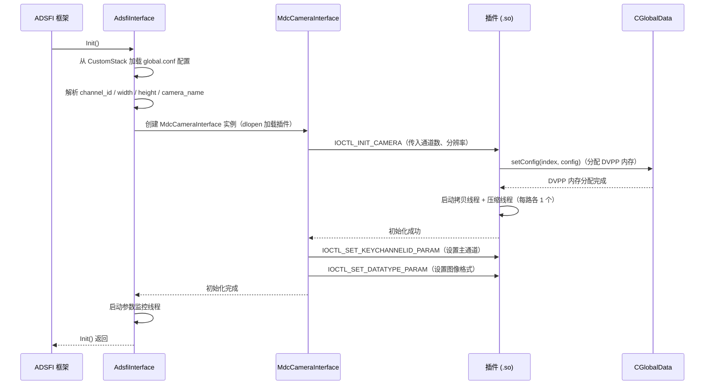
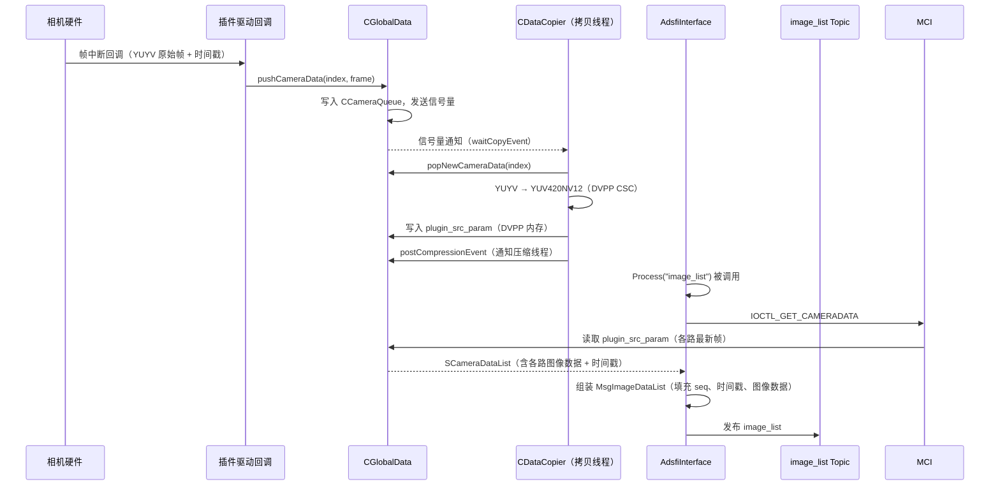
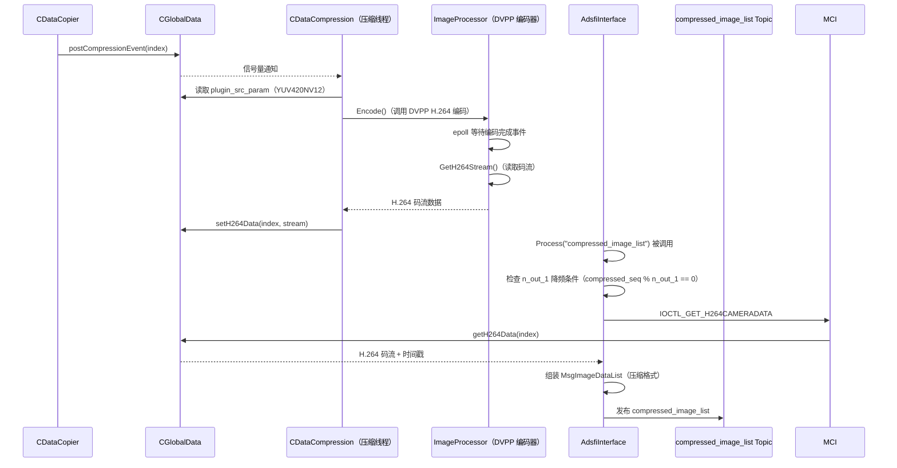
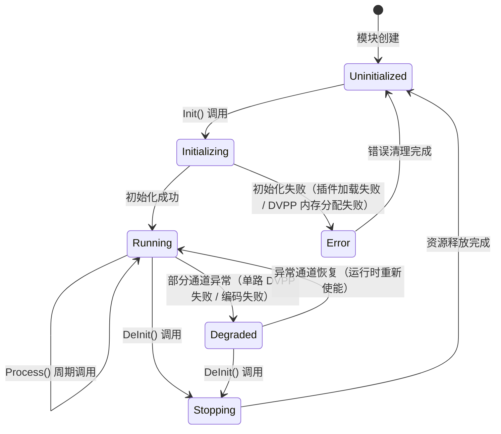

## 1. 文档信息

| 项目 | 内容 |
| --- | --- |
| 模块名称 | HwCameraListGsds — 多路相机硬件抽象层 |
| 模块编号 | HA-CAM-001 |
| 所属系统 / 子系统 | 感知系统 / 硬件抽象层（Hardware Abstraction） |
| 模块类型 | 平台模块 |
| 负责人 |  |
| 参与人 |  |
| 当前状态 | 草稿 |
| 版本号 | V1.0 |
| 创建日期 | 2026-03-04 |
| 最近更新 | 2026-03-04 |

---

## 2. 模块概述

### 2.1 模块定位

本模块（`hw_camera_list_gsds`）是自动驾驶感知系统中多路相机数据的硬件抽象层，负责将底层相机硬件驱动产生的原始图像数据，经格式转换与可选压缩后，以标准化接口向上层感知算法模块输出。

- **职责**：屏蔽相机硬件差异，统一多路相机数据的采集、格式转换、压缩及发布流程。
- **上游模块（输入来源）**：相机硬件驱动插件（`libcamera_recv_v20_x.so`），通过 IOCTL 协议提供原始 YUYV 格式图像帧及时间戳信息。
- **下游模块（输出去向）**：
  - 感知检测模块（`MultiCameraDetection`）：消费原始图像列表 `image_list`。
  - 可视化 / 录制模块：消费压缩图像列表 `compressed_image_list`。
- **对外能力**：通过 `ara::adsfi` 标准接口对外提供 Topic 数据发布能力，不对外暴露 SDK 或 RPC 接口。

### 2.2 设计目标

- **功能目标**：支持最多 16 路相机同步采集，输出原始图像列表与 H.264 压缩图像列表，满足感知算法与可视化的双路数据需求。
- **性能目标**：在 30 FPS 硬件帧率下，单帧端到端处理延迟（从驱动回调到 Topic 发布）不超过 33 ms；H.264 编码延迟不超过 10 ms/帧。
- **稳定性目标**：插件动态加载失败时可降级运行；相机通道异常时支持按位掩码屏蔽单路，不影响其余通道正常工作；支持运行时动态参数更新（帧率、通道使能等）。
- **安全目标**：DVPP 内存通过专用接口（`hi_mpi_dvpp_malloc`）分配，避免与用户态堆内存混用；插件以动态库形式隔离，防止驱动异常扩散至上层。
- **可维护性 / 可扩展性目标**：插件通过 `so_name` 配置项动态切换，支持不同硬件平台（v20_1 / v20_2 / v20_3）无需重新编译上层代码；相机数量、分辨率、名称均通过 JSON 配置文件管理，具备良好的可配置性。

### 2.3 设计约束

- **硬件平台约束**：目标平台为华为 MDC（Mobile Data Center）系列计算平台，依赖华为 DVPP（Digital Video Pre-Processing）硬件编解码单元，不可移植至通用 x86 平台。
- **OS / 架构约束**：运行于 Linux 环境，采用 POSIX 线程模型（pthread），使用 epoll 进行异步 I/O 事件监听。
- **中间件 / 框架依赖**：
  - `ara::adsfi`：AUTOSAR Adaptive 标准感知接口框架。
  - `mdc::visual::Publisher`：MDC 平台可视化发布库。
  - `glog`：日志库。
  - `yaml-cpp`：配置解析库（辅助）。
  - `CustomStack`：参数管理中间件，用于运行时动态参数读取。
- **标准约束**：接口层遵循 AUTOSAR Adaptive Platform 规范；图像数据结构遵循内部 `ara::adsfi::MsgImageDataList` 协议定义。
- **兼容性约束**：插件协议版本（`libcamera_recv_v20_x`）需与底层驱动版本匹配，上层代码通过配置项 `so_name` 解耦，支持多版本共存部署。

---

## 3. 需求与范围

### 3.1 功能需求（FR）

| 需求 ID | 描述 | 优先级 |
| --- | --- | --- |
| FR-01 | 支持最多 16 路相机通道的并发数据采集，各通道独立配置分辨率与名称 | 高 |
| FR-02 | 将相机原始 YUYV 格式图像转换为 YUV420NV12 格式，并通过 `image_list` Topic 发布 | 高 |
| FR-03 | 对 YUV420NV12 图像进行 H.264 硬件编码，通过 `compressed_image_list` Topic 发布 | 高 |
| FR-04 | 支持压缩帧率降频输出（`n_out_1` 参数），即每 N 帧输出 1 帧压缩图像 | 中 |
| FR-05 | 支持运行时动态更新相机通道使能状态（按位掩码控制） | 中 |
| FR-06 | 支持热成像相机（NV Camera）的主从切换（`nv_cam_pos` 参数） | 中 |
| FR-07 | 支持图像 180° 旋转（针对安装方向倒置的相机） | 低 |
| FR-08 | 通过 JSON 配置文件（`global.conf`）管理所有运行时参数，支持热更新 | 高 |
| FR-09 | 插件以动态库（`.so`）形式加载，支持通过配置项切换不同版本驱动插件 | 高 |

### 3.2 非功能需求（NFR）

| 需求 ID | 类型 | 指标 | 目标值 |
| --- | --- | --- | --- |
| NFR-01 | 性能 | 单帧端到端处理延迟（驱动回调 → Topic 发布） | ≤ 33 ms（@30 FPS） |
| NFR-02 | 性能 | H.264 单帧编码延迟 | ≤ 10 ms |
| NFR-03 | 性能 | 压缩图像帧率（`n_out_1=1` 时） | 与硬件帧率一致（30 FPS） |
| NFR-04 | 稳定性 | 单路相机异常不影响其余通道 | 通道级隔离，故障通道自动屏蔽 |
| NFR-05 | 稳定性 | 插件加载失败时系统可降级运行 | 上层模块不崩溃，输出空数据并告警 |
| NFR-06 | 资源 | 每路相机 DVPP 内存占用（1920×1080 YUV420NV12） | ≤ 3 MB/路 |
| NFR-07 | 资源 | 线程数量 | 每路相机 2 个工作线程（拷贝线程 + 压缩线程）+ 1 个参数监控线程 |
| NFR-08 | 可维护性 | 插件版本切换无需重新编译上层代码 | 通过 `so_name` 配置项动态切换 |

### 3.3 范围界定

#### 3.3.1 本模块必须实现：

- 多路相机数据采集与格式转换（YUYV → YUV420NV12）。
- H.264 硬件编码及压缩图像发布。
- 基于 JSON 配置的多相机参数管理。
- 插件动态加载与 IOCTL 协议通信。
- 运行时参数动态更新（帧率、通道使能、主从切换）。
- 图像时间戳透传（fsync、GNSS、SOF、EOF、ISP 等多类型时间戳）。

#### 3.3.2 本模块明确不做：

- 相机标定参数管理（由标定模块负责）。
- 图像畸变矫正（由感知预处理模块负责）。
- 相机自动曝光 / 白平衡控制（由驱动层负责）。
- H.265 编码输出（当前仅支持 H.264，H.265 结构预留但未启用）。
- 多传感器时间同步（由时间同步模块负责，本模块仅透传时间戳）。

### 3.4 需求 - 设计 - 验证映射

| 需求 ID | 对应设计章节 | 对应接口 | 验证方式 / 用例 |
| --- | --- | --- | --- |
| FR-01 | 5.1、5.3 | `Init()` / `CGlobalData::setConfig()` | TC-01：16 路相机并发采集功能验证 |
| FR-02 | 5.3、6.1 | `Process("image_list")` | TC-02：原始图像格式与内容正确性验证 |
| FR-03 | 5.3、6.1 | `Process("compressed_image_list")` | TC-03：H.264 压缩图像解码验证 |
| FR-04 | 5.3、6.4 | `Process("compressed_image_list")` + `n_out_1` | TC-04：降频输出帧率统计验证 |
| FR-05 | 5.3、6.2 | `IOCTL_SET_CAMERA_ENABLE` | TC-05：运行时通道使能/禁用功能验证 |
| FR-08 | 4.3、5.1 | `Init()` 配置加载 | TC-06：配置文件热更新参数生效验证 |
| FR-09 | 4.2、5.1 | `dlopen` / `MdcCameraInterface` | TC-07：不同版本插件切换功能验证 |


---

## 4. 设计思路

### 4.1 方案概览

本模块采用**两层解耦架构**：上层为标准化的 ADSFI 接口层，负责配置管理、数据组装与 Topic 发布；下层为硬件相关的插件层，负责与相机驱动通信、图像格式转换及 H.264 编码。两层之间通过 IOCTL 协议和共享内存缓冲区交互，实现硬件无关性。

**整体数据流向**：

```
相机硬件驱动
    │  YUYV 原始帧（via 插件 .so）
    ▼
插件层（CGlobalData 全局缓冲）
    │  pushCameraData → CCameraQueue（环形队列，容量 10 帧）
    ▼
CDataCopier（拷贝线程，每路 1 个）
    │  YUYV → YUV420NV12（DVPP 格式转换）
    ▼
CGlobalData::plugin_src_param（DVPP 内存）
    │
    ├──────────────────────────────────────────┐
    ▼                                          ▼
ADSFI 接口层                           CDataCompression（压缩线程，每路 1 个）
Process("image_list")                      │  YUV420NV12 → H.264（DVPP 编码）
    │                                      ▼
    │                              CGlobalData::plugin_h264_param
    │                                      │
    │                              ADSFI 接口层
    │                              Process("compressed_image_list")
    ▼                                      ▼
MsgImageDataList（原始）          MsgImageDataList（压缩）
    │                                      │
    ▼                                      ▼
image_list Topic                  compressed_image_list Topic
```

**主要组件职责边界**：

| 组件 | 所在层 | 职责 |
| --- | --- | --- |
| `AdsfiInterface` | 上层 | 配置加载、插件初始化、数据组装、Topic 发布 |
| `MdcCameraInterface` | 上层/插件边界 | IOCTL 命令封装，上层与插件的通信代理 |
| `CGlobalData` | 插件层 | 全局单例，管理多路相机缓冲区、信号量、DVPP 内存 |
| `CDataCopier` | 插件层 | 每路相机独立拷贝线程，负责格式转换与数据搬运 |
| `CDataCompression` | 插件层 | 每路相机独立压缩线程，负责 H.264 编码 |
| `ImageProcessor` | 插件层 | DVPP 编码器封装，管理编码通道生命周期 |

### 4.2 关键决策与权衡

**决策一：插件动态库隔离**

选择将硬件驱动封装为独立 `.so` 插件（`libcamera_recv_v20_x.so`），通过 `dlopen` 动态加载，而非静态链接。原因：不同硬件平台（MDC v20_1/v20_2/v20_3）驱动接口存在差异，动态加载可在不重新编译上层代码的前提下切换驱动版本，降低平台适配成本。代价是增加了运行时加载开销和接口版本管理复杂度。

**决策二：每路相机独立线程模型**

为每路相机分配独立的拷贝线程和压缩线程，而非使用线程池统一调度。原因：相机帧到达时间不完全同步，独立线程可避免单路阻塞影响其他通道，且信号量机制可精确控制每路的处理节奏。代价是线程数量随相机路数线性增长（最多 16 路 × 2 = 32 个工作线程）。

**决策三：DVPP 硬件编码替代软件编码**

H.264 编码采用华为 DVPP 硬件加速单元，而非 FFmpeg 等软件编码方案。原因：MDC 平台 CPU 资源有限，软件编码多路 1080P@30FPS 会造成显著 CPU 占用；DVPP 硬件编码可将编码延迟控制在 10 ms 以内，且不占用 CPU 算力。代价是强依赖华为 MDC 平台，不可移植。

**决策四：共享内存 + 信号量同步**

拷贝线程与压缩线程之间通过 `CGlobalData` 中的共享内存缓冲区和信号量进行同步，而非消息队列传递数据。原因：避免大尺寸图像数据（单帧 1080P YUV420NV12 约 3 MB）的内存拷贝开销，信号量通知机制延迟更低。代价是需要严格管理内存访问顺序，防止数据竞争。

### 4.3 与现有系统的适配

- **ADSFI 框架适配**：继承 `BaseAdsfiInterface`，实现标准的 `Init()`、`DeInit()`、`Process()` 接口，与 ADSFI 调度框架无缝集成，无需修改框架代码。
- **配置系统适配**：通过 `CustomStack` 参数管理中间件读取 `global.conf` 中的 JSON 配置，同时启动后台参数监控线程，支持运行时参数热更新，与平台参数管理机制保持一致。
- **可视化系统适配**：通过 `mdc::visual::Publisher` 发布 H.265 可视化图像，与平台统一的可视化框架对接，无需额外适配。
- **版本兼容策略**：插件协议头文件（`cameraplatform2usrprotocol.h`）在上层和插件层各维护一份，通过版本号字段标识协议版本，确保上下层协议一致性。

### 4.4 失败模式与降级

- **插件加载失败**：`dlopen` 失败时记录 ERROR 日志，`mdc_camera_interface_ptr` 置空，后续 `Process()` 调用直接返回空数据，不触发崩溃。
- **DVPP 内存分配失败**：`hi_mpi_dvpp_malloc` 失败时，对应通道标记为不可用，跳过该通道的格式转换与编码，其余通道继续正常工作。
- **相机通道数据超时**：拷贝线程通过信号量等待，若超时（由信号量超时参数控制）则跳过当前帧，记录 WARN 日志，不阻塞后续帧处理。
- **H.264 编码失败**：编码异常时压缩线程记录错误，跳过当前帧的压缩输出，原始图像通道不受影响。
- **配置文件缺失或格式错误**：使用默认参数值（`hw_fps=30`、`format=YUYV`）继续运行，并输出 WARN 日志提示配置异常。

---

## 5. 架构与技术方案

### 5.1 模块内部架构

**子模块划分**：

```
hw_camera_list_gsds
├── adsfi_interface/          # 上层：ADSFI 标准接口层
│   ├── AdsfiInterface        # 主控类，负责初始化、配置、数据发布
│   └── MdcCameraInterface    # 插件通信代理（IOCTL 封装）
├── plugin/                   # 下层：硬件插件层
│   ├── src/
│   │   ├── CGlobalData       # 全局单例，多路缓冲区与同步原语管理
│   │   ├── CDataCopier       # 格式转换线程（YUYV → YUV420NV12）
│   │   ├── CDataCompression  # H.264 压缩线程
│   │   └── ImageProcessor    # DVPP 编码器封装
│   └── imagedvpp/
│       └── CameraApp         # DVPP 应用层封装，色彩空间转换
├── protocol/                 # 协议定义层
│   └── cameraplatform2usrprotocol.h  # IOCTL 命令与数据结构定义
└── config/
    └── global.conf           # JSON 运行时配置
```

**线程模型**：

| 线程名称 | 数量 | 触发方式 | 职责 |
| --- | --- | --- | --- |
| 驱动回调线程 | 由插件管理 | 硬件中断驱动 | 接收原始帧，写入 `CCameraQueue` |
| 拷贝线程（CDataCopier） | 每路 1 个，最多 16 个 | 信号量等待 | 从队列取帧，执行格式转换，写入 DVPP 内存 |
| 压缩线程（CDataCompression） | 每路 1 个，最多 16 个 | 信号量等待 | 读取 DVPP 内存，调用 ImageProcessor 编码 |
| H.264 流处理线程 | 每路 1 个 | epoll 事件 | 从 DVPP 编码器读取 H.264 码流，写入输出缓冲 |
| 参数监控线程 | 1 个 | 定时轮询 | 监听 CustomStack 参数变更，下发 IOCTL 更新 |

**同步模型**：

- 驱动回调 → 拷贝线程：`CCameraQueue`（互斥锁保护的环形队列）+ `CSem` 信号量通知。
- 拷贝线程 → 压缩线程：`waitCopyEvent` / `postCompressionEvent` 信号量对。
- 压缩线程 → ADSFI 接口层：`getH264Data` 直接读取共享缓冲区（内部互斥锁保护）。
- ADSFI 接口层读取原始数据：`IOCTL_GET_CAMERADATA` 同步调用，内部通过 `popNewCameraData` 获取最新帧。

### 5.2 关键技术选型

| 技术点 | 方案 | 选择原因 | 备选方案 |
| --- | --- | --- | --- |
| 图像编码 | 华为 DVPP 硬件 H.264 编码 | 低延迟、低 CPU 占用，与 MDC 平台深度集成 | FFmpeg 软件编码（CPU 占用高，不适合嵌入式平台） |
| 格式转换 | DVPP CSC（色彩空间转换）+ 软件 UYVY→YUV422SP | DVPP 硬件加速，转换延迟低 | OpenCV 软件转换（CPU 占用高） |
| 线程同步 | POSIX 信号量（`sem_t`）+ 互斥锁 | 轻量、低延迟，适合实时系统 | 条件变量（语义相近，信号量更直观） |
| 帧缓冲队列 | 固定容量环形队列（容量 10 帧） | 防止内存无限增长，自动丢弃过旧帧 | 无界队列（存在内存溢出风险） |
| 配置管理 | JSON（`global.conf`）+ CustomStack 热更新 | 与平台参数管理框架统一，支持运行时修改 | 静态编译配置（不支持热更新） |
| 插件加载 | `dlopen` 动态库加载 | 支持多版本驱动切换，上层代码无需重编 | 静态链接（版本切换需重新编译） |
| 异步 I/O | epoll（H.264 码流读取） | 高效处理多路编码器事件，避免忙等 | select / poll（性能较低） |

### 5.3 核心流程

#### 5.3.1 初始化流程



#### 5.3.2 原始图像发布流程



#### 5.3.3 压缩图像发布流程



#### 5.3.4 启动 / 退出流程

- **启动**：`Init()` 按序执行配置加载 → 插件初始化 → DVPP 内存分配 → 工作线程启动 → 参数监控线程启动，任一步骤失败均记录 ERROR 并返回错误码。
- **退出**：`DeInit()` 按逆序执行：停止参数监控线程 → 发送停止信号给各工作线程 → 等待线程退出 → 释放 DVPP 内存（`hi_mpi_dvpp_free`）→ 关闭编码通道 → 卸载插件（`dlclose`）。


---

## 6. 接口设计

### 6.1 对外接口

| 接口名 | 类型 | 输入 | 输出 | 频率 | 备注 |
| --- | --- | --- | --- | --- | --- |
| `Process("image_list")` | API | topic 字符串、`MsgImageDataList` 指针 | 填充后的 `MsgImageDataList` | 30 Hz | 原始 YUV420NV12 图像列表 |
| `Process("compressed_image_list")` | API | topic 字符串、`MsgImageDataList` 指针 | 填充后的 `MsgImageDataList` | ≤30 Hz（受 `n_out_1` 控制） | H.264 压缩图像列表 |
| `Init()` | API | 无 | 无（内部初始化） | 一次性 | 模块启动时由框架调用 |
| `DeInit()` | API | 无 | 无（内部清理） | 一次性 | 模块退出时由框架调用 |
| `image_list` | Topic | — | `ara::adsfi::MsgImageDataList` | 30 Hz | 下游感知算法订阅 |
| `compressed_image_list` | Topic | — | `ara::adsfi::MsgImageDataList` | ≤30 Hz | 下游可视化 / 录制模块订阅 |

### 6.2 对内接口

**AdsfiInterface ↔ MdcCameraInterface（IOCTL 协议）**：

| IOCTL 命令 | 方向 | 参数 | 说明 |
| --- | --- | --- | --- |
| `IOCTL_INIT_CAMERA` | 上层 → 插件 | 通道数、分辨率列表 | 初始化相机通道，分配 DVPP 内存 |
| `IOCTL_SET_DATATYPE_PARAM` | 上层 → 插件 | 图像格式枚举（`EIdpImgType`） | 设置输出图像格式 |
| `IOCTL_SET_KEYCHANNELID_PARAM` | 上层 → 插件 | 主通道索引 | 设置帧同步主通道 |
| `IOCTL_GET_CAMERADATA` | 上层 → 插件 | 无 | 获取最新一帧原始图像列表（`SCameraDataList`） |
| `IOCTL_GET_H264CAMERADATA` | 上层 → 插件 | 无 | 获取最新一帧 H.264 压缩数据 |
| `IOCTL_SET_H264CAMERADATA_FREQ` | 上层 → 插件 | 降频系数 N | 设置压缩输出帧率（每 N 帧输出 1 帧） |
| `IOCTL_SET_CAMERA_ENABLE` | 上层 → 插件 | 通道使能位掩码 | 运行时启用 / 禁用指定相机通道 |
| `IOCTL_SET_TOGGLE_LLC_MASTER` | 上层 → 插件 | 热成像相机位置标志 | 切换热成像相机主从角色 |

**插件层内部接口（CGlobalData 提供）**：

- `pushCameraData(index, data)`：驱动回调线程调用，将原始帧写入对应通道的 `CCameraQueue`，并通过信号量通知拷贝线程。
- `popNewCameraData(index)`：拷贝线程调用，从队列取出最新帧（若队列为空则返回空指针）。
- `waitCopyEvent(index)` / `postCopyEvent(index)`：拷贝线程与驱动回调之间的同步信号量操作。
- `waitCompressionEvent(index)` / `postCompressionEvent(index)`：拷贝线程与压缩线程之间的同步信号量操作。
- `setH264Data(index, stream)` / `getH264Data(index)`：压缩线程写入、ADSFI 接口层读取 H.264 码流的互斥保护接口。

### 6.3 接口稳定性声明

- **稳定接口**（变更必须经过评审）：
  - `AdsfiInterface::Init()` / `DeInit()` / `Process()` — 与 ADSFI 框架约定的标准接口，不可随意变更签名。
  - `cameraplatform2usrprotocol.h` 中的 IOCTL 命令枚举与核心数据结构（`SCameraData`、`SCameraDataList`）— 上下层协议边界，变更需同步更新插件与上层。
  - `ara::adsfi::MsgImageDataList` — 对外 Topic 数据结构，下游模块依赖，变更需全链路评审。

- **非稳定接口**（允许在模块内部调整，需标注版本）：
  - `CGlobalData` 内部方法签名 — 插件层内部实现细节，可随优化调整。
  - `ImageProcessor` 编码参数配置接口 — 随 DVPP 版本升级可能调整。
  - `global.conf` 配置项扩展 — 新增配置项向后兼容，删除或重命名需评审。

### 6.4 接口行为契约

**`Process("image_list")`**：
- 前置条件：`Init()` 已成功调用，插件已完成初始化，至少一路相机通道处于使能状态。
- 后置条件：`ptr` 指向的 `MsgImageDataList` 已填充当前帧各路相机的 YUV420NV12 图像数据及时间戳；若某路通道数据不可用，对应图像数据长度为 0。
- 阻塞性：非阻塞，直接读取最新缓冲帧，不等待新帧到达。
- 可重入性：不可重入（内部使用互斥锁保护共享缓冲区）。
- 最大执行时间：≤ 5 ms（不含数据拷贝到用户缓冲区的时间）。
- 失败语义：返回 -1 并记录 ERROR 日志；`ptr` 内容保持调用前状态，不做部分填充。

**`Process("compressed_image_list")`**：
- 前置条件：`Init()` 已成功调用，DVPP 编码通道已初始化，压缩线程正在运行。
- 后置条件：若当前帧满足 `n_out_1` 降频条件，`ptr` 填充 H.264 码流数据；否则 `ptr` 中图像数据长度为 0（跳帧）。
- 阻塞性：非阻塞，读取最新已编码帧，不等待编码完成。
- 可重入性：不可重入。
- 最大执行时间：≤ 5 ms。
- 失败语义：返回 -1，`ptr` 内容不变。

**`Init()`**：
- 前置条件：`global.conf` 配置文件存在且格式合法；目标插件 `.so` 文件存在于 `config/` 目录。
- 后置条件：所有配置参数已加载，插件已初始化，各路 DVPP 内存已分配，工作线程已启动。
- 阻塞性：阻塞，直至初始化完成或失败。
- 幂等性：非幂等，重复调用行为未定义，应在 `DeInit()` 后方可再次调用。
- 最大执行时间：≤ 2000 ms（含 DVPP 初始化时间）。
- 失败语义：返回非零错误码，已分配资源在函数内部回滚释放。

---

## 7. 数据设计

### 7.1 数据结构

**`SCameraData`（单路相机帧数据）**：

```cpp
struct SCameraData {
    uint8_t*  data;           // 图像数据指针（YUV420NV12 或 H.264 码流）
    uint32_t  dataSize;       // 数据字节长度
    uint32_t  width;          // 图像宽度（像素）
    uint32_t  height;         // 图像高度（像素）
    uint64_t  fsyncTimestamp; // 帧同步时间戳（硬件 fsync 信号，纳秒）
    uint64_t  gnssTimestamp;  // GNSS 授时时间戳（纳秒）
    uint64_t  pubTimestamp;   // 数据发布时间戳（纳秒）
    uint64_t  sofTimestamp;   // 曝光开始时间戳 Start of Frame（纳秒）
    uint64_t  eofTimestamp;   // 曝光结束时间戳 End of Frame（纳秒）
    uint64_t  ispTimestamp;   // ISP 处理完成时间戳（纳秒）
    EIdpImgType imgType;      // 图像格式枚举
};
```

**`SCameraDataList`（多路相机帧列表）**：

```cpp
struct SCameraDataList {
    SCameraData cameras[MAX_CAMERA_NUM]; // 最多 16 路相机数据
    uint16_t    enableMask;              // 通道使能位掩码（bit i 对应第 i 路）
    uint32_t    frameCount;              // 当前帧计数
};
```

**`CGlobalData::SPluginSrcParam`（DVPP 内存描述符）**：

```cpp
struct SPluginSrcParam {
    void*    dvppMemPtr;   // DVPP 内存指针（hi_mpi_dvpp_malloc 分配）
    uint32_t dvppMemSize;  // DVPP 内存大小（字节）
    uint32_t width;        // 图像宽度
    uint32_t height;       // 图像高度
    bool     isValid;      // 内存是否有效
};
```

**`ara::adsfi::MsgImageDataList`（对外发布数据结构）**：

上层对外发布的标准消息结构，包含：
- `header`：消息头（序列号、时间戳、坐标系 ID）。
- `images`：图像数组，每个元素包含图像数据、格式、分辨率、相机名称及多类型时间戳。
- `camera_names`：相机名称列表（与 `channel_id` 顺序对应）。

序列化方式：由 `ara::adsfi` 框架负责，采用平台内部二进制序列化协议，不对外暴露序列化细节。

### 7.2 状态机

**模块生命周期状态机**：



**相机通道状态**：

| 状态 | 说明 | 转移条件 |
| --- | --- | --- |
| `DISABLED` | 通道已禁用 | `IOCTL_SET_CAMERA_ENABLE` 清除对应 bit |
| `ENABLED` | 通道已使能，等待数据 | `IOCTL_SET_CAMERA_ENABLE` 设置对应 bit |
| `ACTIVE` | 通道正常接收并处理数据 | 驱动回调成功推送帧数据 |
| `FAULT` | 通道异常（超时 / 编码失败） | 连续 N 帧处理失败 |

非法状态处理：若 `enableMask` 中某 bit 对应的通道未完成初始化（`isValid=false`），该通道的数据请求直接返回空，不触发 DVPP 操作。

### 7.3 数据生命周期

**原始帧数据**：
- 创建：驱动回调线程在 `pushCameraData` 时将帧数据写入 `CCameraQueue`（队列内部持有数据副本）。
- 使用：拷贝线程从队列取出后执行格式转换，转换结果写入 DVPP 内存（`plugin_src_param`）。
- 销毁：队列满时自动丢弃最旧帧；`DeInit()` 时队列清空，DVPP 内存通过 `hi_mpi_dvpp_free` 释放。

**H.264 码流数据**：
- 创建：压缩线程调用 `ImageProcessor::GetH264Stream()` 后，通过 `setH264Data` 写入 `plugin_h264_param`（普通堆内存，`malloc` 分配）。
- 使用：ADSFI 接口层在 `Process("compressed_image_list")` 中通过 `getH264Data` 读取，拷贝至 `MsgImageDataList`。
- 销毁：每次新帧编码完成后覆盖旧数据；`DeInit()` 时通过 `free` 释放。

**持久化策略**：本模块不持久化任何图像数据，所有数据均为内存中的实时流式数据，无磁盘 I/O。

---

## 8. 异常与边界处理

| 异常场景 | 检测方式 | 处理策略 | 是否可恢复 | 上报方式 |
| --- | --- | --- | --- | --- |
| 插件 `.so` 文件不存在或加载失败 | `dlopen` 返回 NULL | 记录 ERROR，`mdc_camera_interface_ptr` 置空，模块进入 Error 状态 | 否（需重启） | ERROR 日志 |
| DVPP 内存分配失败（`hi_mpi_dvpp_malloc`） | 返回值为 NULL | 对应通道标记 `isValid=false`，跳过该通道处理 | 部分可恢复（重新初始化通道） | ERROR 日志 |
| 相机帧数据超时（信号量等待超时） | 信号量超时返回 | 跳过当前帧，`compressed_seq` 不递增，记录 WARN | 是（下一帧自动恢复） | WARN 日志 |
| H.264 编码失败（DVPP 编码器异常） | `Encode()` 返回非零 | 跳过当前帧压缩输出，原始图像通道不受影响 | 是（下一帧重试） | WARN 日志 |
| 配置文件缺失或 JSON 解析失败 | 文件打开失败 / 解析异常 | 使用默认参数值继续运行 | 是（降级运行） | WARN 日志 |
| 相机通道数超过 MAX_CAMERA_NUM（16） | 配置解析时检查 | 截断至 16 路，忽略多余配置，记录 WARN | 是（截断处理） | WARN 日志 |
| `Process()` 在 `Init()` 前调用 | `mdc_camera_interface_ptr` 为空 | 直接返回 -1，不做任何操作 | 是（等待 Init 完成后正常） | ERROR 日志 |
| 图像数据指针为空（驱动异常帧） | `SCameraData::data == nullptr` | 跳过该路数据，对应图像长度置 0 | 是（下一帧自动恢复） | WARN 日志 |
| `n_out_1` 配置为 0（除零风险） | 配置加载时校验 | 强制修正为 1（不降频），记录 WARN | 是 | WARN 日志 |
| epoll 等待 H.264 码流超时 | epoll_wait 超时返回 | 跳过当前帧码流读取，记录 WARN | 是 | WARN 日志 |

---

## 9. 性能与资源预算

### 9.1 性能指标

| 场景 | 指标 | 目标值 | 测试方法 |
| --- | --- | --- | --- |
| 单路相机原始图像端到端延迟 | 驱动回调 → `image_list` Topic 发布 | ≤ 33 ms（@30 FPS） | 在驱动回调与 Topic 发布处打时间戳，统计 P99 延迟 |
| 单路 H.264 编码延迟 | `Encode()` 调用 → `GetH264Stream()` 返回 | ≤ 10 ms | 在编码前后打时间戳，统计 P99 延迟 |
| 16 路并发采集 CPU 占用 | 所有工作线程总 CPU 占用 | ≤ 15%（单核等效） | `top` / `perf` 统计稳态 CPU 占用 |
| 格式转换延迟（YUYV → YUV420NV12） | 单帧转换耗时 | ≤ 5 ms（1920×1080） | 转换前后打时间戳，统计 P99 |
| 压缩图像降频输出帧率精度 | 实际输出帧率与 `hw_fps / n_out_1` 的偏差 | ≤ ±1 FPS | 统计 1 分钟内实际输出帧数 |
| 参数热更新生效延迟 | 参数写入 CustomStack → IOCTL 下发完成 | ≤ 500 ms | 参数写入后计时，监测 IOCTL 执行完成时间 |

### 9.2 资源预算

| 资源 | 常态 | 峰值 | 上限约束 |
| --- | --- | --- | --- |
| DVPP 内存（YUV420NV12，每路 1920×1080） | 约 3 MB/路 × N 路 | 3 MB × 16 = 48 MB | MDC 平台 DVPP 内存池上限（平台相关） |
| 堆内存（H.264 码流缓冲，每路） | 约 200 KB/路（典型码率） | 约 500 KB/路（I 帧） | 16 路 × 500 KB = 8 MB |
| 帧队列内存（CCameraQueue，每路 10 帧） | 约 30 MB/路（1080P YUYV） | 30 MB × 16 = 480 MB | 建议限制相机路数或降低队列深度 |
| 线程数量 | 16 路 × 3 线程 + 1 监控线程 = 49 个 | 同常态 | 系统线程上限（通常 ≥ 1024，不构成瓶颈） |
| CPU 占用（格式转换 + 数据搬运） | ≤ 10%（单核等效） | ≤ 20%（16 路满载） | 不超过平台 CPU 预算的 20% |
| DVPP 编码通道数 | N 路（与相机路数相同） | 16 路 | MDC 平台 DVPP 编码通道上限（平台相关，通常 ≥ 16） |

> **注**：帧队列内存为理论峰值，实际中驱动回调与拷贝线程处理速度接近，队列通常不会积压至满容量。若内存受限，可将队列深度从 10 降至 3，以牺牲抖动容忍度换取内存节省。
