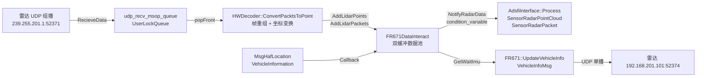
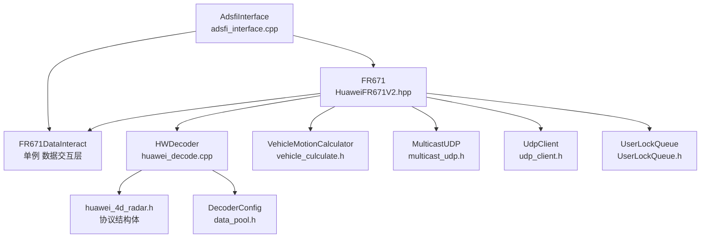
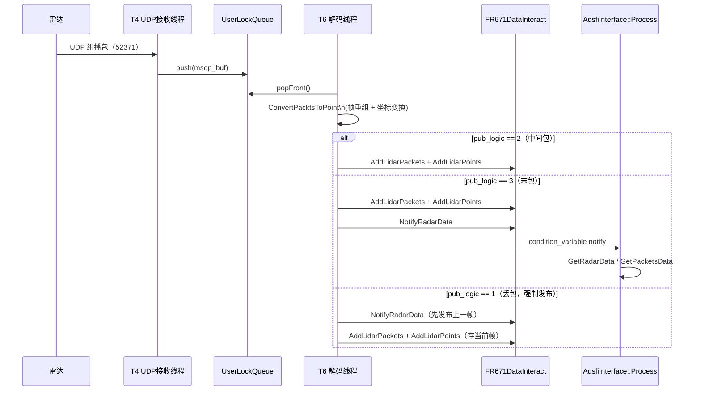
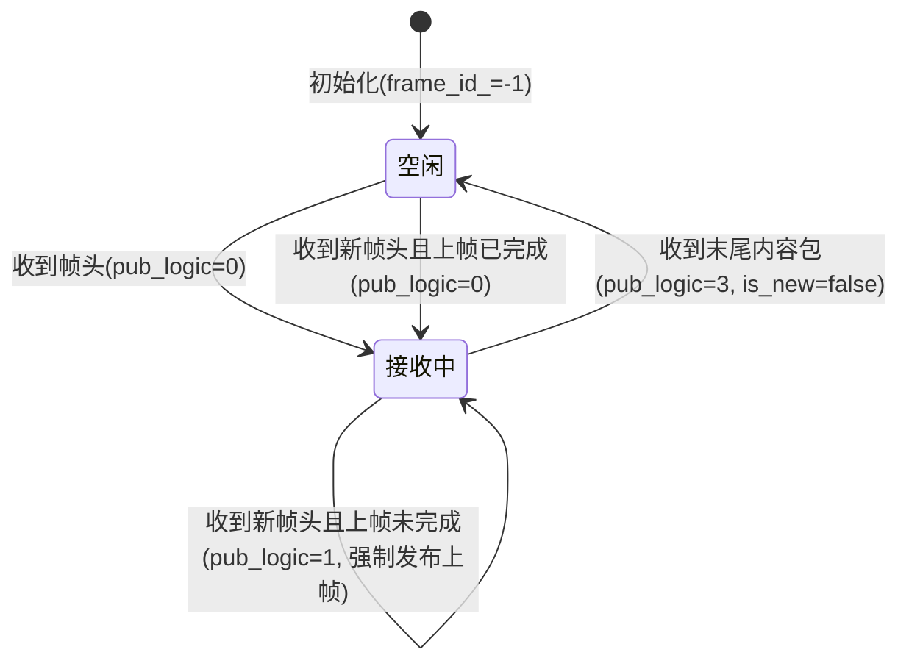

## 1. 文档信息

| 项目 | 内容 |
| --- | --- |
| 模块名称 | 华为 FR671 4D 毫米波雷达驱动模块 |
| 模块编号 | hw_fr671_radar |
| 所属系统 / 子系统 | 自动驾驶感知系统 / 硬件抽象层（Hardware Abstraction） |
| 模块类型 | 平台模块 |
| 负责人 |  XiaoTong Zhang|
| 参与人 |  Yang Xia|
| 当前状态 | 草稿 |
| 版本号 | V1.0 |
| 创建日期 | 2026-03-04 |
| 最近更新 | 2026-03-04 |

## 2. 模块概述

### 2.1 模块定位

- 本模块负责华为 FR671 4D 毫米波雷达的数据接收、解析、坐标变换及状态监控，向上层感知算法提供标准化的雷达点云数据与原始 UDP 数据包。
- 上游模块（输入来源）：
  - 车辆底盘信息模块（`ara::adsfi::VehicleInformation`）：提供档位信息
  - 定位融合模块（`ara::adsfi::MsgHafLocation`）：提供车速、横摆角速度、位置等运动状态
- 下游模块（输出去向）：
  - 感知融合模块：消费 `SensorRadarPointCloud`（雷达点云）
  - 数据录制 / 回放模块：消费 `SensorRadarPacket`（原始 UDP 数据包）
- 对外提供能力：通过 ADSFI 框架以 API 形式对外输出，不直接暴露 SDK。

### 2.2 设计目标

- 功能目标：实现对华为 FR671 雷达 UDP 组播数据的接收、帧重组、球坐标到笛卡尔坐标的转换、外参标定变换，以及向雷达周期性发送心跳包与车辆运动信息。
- 性能目标：雷达数据帧率默认 20 Hz（interval_ms = 50 ms），驱动层端到端处理延迟不超过 10 ms；UDP 接收缓冲区设置为 640 KB，保障高频数据不丢包。
- 稳定性目标：网络中断、UDP 丢包、帧序号跳变等异常场景均可检测并上报故障码，驱动持续运行不退出；雷达 IP 不可达时阻塞等待直至恢复。
- 安全目标：所有对外消息均携带 E2E CRC32 校验（poly=0xF4ACFB13），防止数据篡改；故障码通过 `FaultHandle::FaultApi` 统一上报，不直接暴露内部状态。
- 可维护性 / 可扩展性目标：解码器（`HWDecoder`）、驱动主体（`FR671`）、数据交互层（`FR671DataInteract`）、ADSFI 接口（`AdsfiInterface`）四层解耦，各层职责清晰，便于独立替换或扩展。

### 2.3 设计约束

- 硬件平台 / OS：Linux，依赖 POSIX socket API（`AF_INET`、`SO_RCVBUF`、组播 `IP_ADD_MEMBERSHIP`）。
- 中间件 / 框架依赖：
  - ADSFI 框架（`adsfi_manager/base_adsfi_interface.h`）
  - CustomStack 配置加载器（`config_loader/custom_stack.h`）
  - Eigen 3（坐标变换矩阵计算）
  - ap_log 日志库（`ap_log/ap_log_interface.h`）
  - FaultHandle 故障管理库（`monitor/faulthandle_api.hpp`）
- 协议约束：雷达通信协议为华为私有 UDP 协议，大端字节序，消息体采用 `#pragma pack(1)` 紧凑布局；E2E 校验采用 CRC32/AUTOSAR 变体（poly=0xF4ACFB13，refIn=true，refOut=true，xorOut=0xFFFFFFFF）。
- 兼容性约束：接口版本号固定为 3，每帧最多 50 个点 / UDP 包，最大 UDP 包大小 1500 字节。

## 3. 需求与范围

### 3.1 功能需求（FR）

| 需求 ID | 描述 | 优先级 |
| --- | --- | --- |
| FR-01 | 通过 UDP 组播（239.255.201.1:52371）接收雷达点云数据包 | 高 |
| FR-02 | 解析帧头（message_id=0x0001）与帧内容（message_id=0x0002），完成多 UDP 包到单帧点云的重组 | 高 |
| FR-03 | 将球坐标（距离、方位角、俯仰角）转换为笛卡尔坐标（x, y, z），并应用外参变换矩阵 | 高 |
| FR-04 | 周期性（900 ms）向雷达发送心跳包（message_id=0x0107），维持连接 | 高 |
| FR-05 | 周期性（20 ms）向雷达发送车辆运动信息（message_id=0x0104），包含车速、横摆角速度、方向盘转角、加速度、档位等 | 高 |
| FR-06 | 通过 UDP 组播（239.255.201.1:52373）接收雷达故障码，解析并上报至故障管理系统 | 高 |
| FR-07 | 初始化时阻塞等待雷达 IP（192.168.201.101）可达，运行期间周期性（1 s）检测网络连通性 | 中 |
| FR-08 | 从 CustomStack 加载雷达名称、IP、端口、帧率、外参标定参数、车辆参数等配置 | 高 |
| FR-09 | 向 ADSFI 框架输出 `SensorRadarPointCloud`（点云）与 `SensorRadarPacket`（原始包）两路数据 | 高 |
| FR-10 | 订阅 `VehicleInformation` 获取档位，订阅 `MsgHafLocation` 获取运动状态，实时更新车辆信息 | 中 |

### 3.2 非功能需求（NFR）

| 需求 ID | 类型 | 指标 | 目标值 |
| --- | --- | --- | --- |
| NFR-01 | 性能 | 驱动层处理延迟（UDP 入队到点云发布） | < 10 ms |
| NFR-02 | 性能 | 雷达数据帧率 | 20 Hz（可配置） |
| NFR-03 | 可靠性 | UDP 丢包检测 | 连续 10 包丢失触发故障码 1072006 |
| NFR-04 | 可靠性 | 帧丢失检测 | 帧序号不连续触发故障码 1072007 |
| NFR-05 | 可靠性 | 网络中断恢复 | 连续 3 次 ping 失败触发故障码 1072024，恢复后自动清除 |
| NFR-06 | 资源 | UDP 接收缓冲区 | 640 KB（可配置） |
| NFR-07 | 资源 | 点云对象预分配容量 | 50000 个点 |
| NFR-08 | 安全 | 消息完整性 | 所有发送消息携带 CRC32/AUTOSAR E2E 校验 |

### 3.3 范围界定

#### 3.3.1 本模块必须实现：
- 雷达 UDP 数据接收与帧重组
- 球坐标到笛卡尔坐标转换及外参变换
- 心跳包与车辆信息的周期性发送
- 雷达故障码接收与上报
- 网络连通性监控
- 配置加载与外参初始化
- ADSFI 接口适配（点云输出、原始包输出、车辆信息订阅）

#### 3.3.2 本模块明确不做：
- 雷达目标级融合（目标检测、跟踪）
- 多雷达时间同步与空间融合
- 雷达固件升级
- 雷达配置参数下发（`ConfigRadarMsg` 结构已定义但未启用）
- 点云滤波、聚类等感知算法

### 3.4 需求 - 设计 - 验证映射

| 需求 ID | 对应设计章节 | 对应接口 / 类 | 验证方式 |
| --- | --- | --- | --- |
| FR-01 | 5.1、5.3 | `FR671::Init` → 组播接收线程 | 抓包验证 UDP 数据到达 |
| FR-02 | 5.3、7.1 | `HWDecoder::ConvertPacktsToPoint` | 单元测试：构造多包帧验证重组正确性 |
| FR-03 | 5.3、7.1 | `HWDecoder::ConvertPoint`、`DecoderConfig::Init` | 单元测试：已知坐标验证变换结果 |
| FR-04 | 5.3 | `FR671::Init` → 心跳线程 | 抓包验证心跳周期 |
| FR-05 | 5.3、6.1 | `FR671::UpdateVehicleInfo`、`VehicleInfoMsg::SetData` | 注入车辆信息验证发送内容 |
| FR-06 | 5.3、8 | 故障码接收线程 → `ec_add` / `ec_remove` | 模拟故障码报文验证上报 |
| FR-07 | 5.3 | `HWDecoder::isIpReachable` | 断网场景验证故障码触发与恢复 |
| FR-08 | 5.3、6.4 | `AdsfiInterface::Init`、`ReadLidarConfig` | 配置文件覆盖测试 |
| FR-09 | 6.1 | `AdsfiInterface::Process` | 集成测试：验证下游收到数据 |
| FR-10 | 5.3、6.1 | `AdsfiInterface::Callback` | 注入消息验证车辆信息更新 |

## 4. 设计思路

### 4.1 方案概览

本模块的核心问题是：将雷达通过 UDP 组播分散发送的多包点云数据，可靠地重组为完整帧，并以标准化格式输出给上层模块，同时维持与雷达的双向通信（心跳、车辆信息）。

整体拆解为三条并行数据流：

1. **点云接收流**：组播 UDP 接收 → 入队（`UserLockQueue`）→ 解码线程出队 → 帧重组 → 坐标变换 → 写入 `FR671DataInteract` → ADSFI 输出
2. **控制发送流**：心跳线程（900 ms）+ 车辆信息线程（20 ms）→ UDP 单播发送至雷达
3. **故障监控流**：组播 UDP 接收故障码（52373）→ 解析各状态位 → `ec_add` / `ec_remove` → `FaultHandle::FaultApi` 上报

关键数据流走向：



### 4.2 关键决策与权衡

**决策 1：UDP 接收与解码解耦（生产者-消费者队列）**

采用 `UserLockQueue<ara::adsfi::CommonUdpPacket>` 将 UDP 接收线程与解码线程解耦。接收线程专注于高频 UDP 收包，解码线程负责帧重组与坐标变换。备选方案为在接收线程内直接解码，但会导致接收线程阻塞，增加丢包风险。

**决策 2：双缓冲数据池（`FR671DataInteract`）**

`FR671DataInteract` 维护两组缓冲（`radar_packets` / `bak_radar_packets`，`radar_points` / `bak_radar_points`），写入完成后通过 `condition_variable` 通知消费方，消费方读取备份缓冲，避免读写竞争。备选方案为单缓冲加读写锁，但会增加消费方等待时间。

**决策 3：帧重组状态机（pub_logic）**

解码器通过 `pub_logic` 枚举（0=仅存头包、1=先发布再存、2=仅存内容包、3=存内容包后发布）驱动帧重组逻辑，处理正常帧、丢包帧、帧序号跳变三种场景，无需额外状态机框架。

**决策 4：外参变换预计算**

`DecoderConfig::Init` 在初始化时将欧拉角（roll/pitch/yaw）与平移量（x/y/z）预计算为 4×4 变换矩阵，运行期直接矩阵乘法，避免每点实时三角函数计算。

### 4.3 与现有系统的适配

- 依赖 ADSFI 框架的 `BaseAdsfiInterface`，通过重写 `Init`、`Process`、`Callback` 方法接入框架调度。
- 配置通过 `CustomStack::GetConfig` / `GetProjectConfigArray` / `GetProjectConfigValue` 读取，键名为 `HuaweiFR671V2`，外参键名可通过 `calibration_key` 配置项重定向，支持多雷达实例复用同一驱动代码。
- 故障码通过 `FaultHandle::FaultApi::Instance()->SetFaultCode` / `ResetFaultCode` 上报，与平台故障管理系统解耦。
- 日志通过 `ApInfo` / `ApError` 宏输出，与平台日志系统适配。

### 4.4 失败模式与降级

| 失败场景 | 检测方式 | 处理策略 |
| --- | --- | --- |
| 雷达 IP 不可达（初始化） | `isIpReachable` ping 检测 | 阻塞重试（500 ms 间隔），上报故障码 1072024（阈值 20 次） |
| 雷达 IP 不可达（运行期） | 周期 ping（1 s） | 上报故障码 1072024（阈值 3 次），驱动继续运行 |
| UDP Socket 初始化失败 | `Init` 返回值 | 上报故障码 1072003，线程退出（不 exit，驱动继续） |
| UDP 数据接收失败 | `RecieveData` 返回值 ≤ 0 | 上报故障码 1072004（阈值 5 次），继续循环 |
| 帧序号不连续（丢帧） | `frame_id` 比较 | 上报故障码 1072007，强制开始新帧（pub_logic=1） |
| UDP 包序号不连续（丢包） | `package_id` 比较 | 上报故障码 1072006（阈值 10 次），继续处理当前包 |
| 时间戳回退 | `frame_ts_ms` 比较 | 上报故障码 1072008，继续处理 |
| 雷达遮挡 | `block_flag` 字段 | 上报故障码 1072005（阈值 3 次） |
| 配置参数读取失败 | `GetProjectConfigArray` 返回值 | 上报故障码 1072001，使用硬编码默认值继续运行 |

## 5. 架构与技术方案

### 5.1 模块内部架构

**子模块划分：**



| 子模块 | 文件 | 职责 |
| --- | --- | --- |
| `AdsfiInterface` | `adsfi_interface.cpp/.h` | ADSFI 框架适配层，负责初始化、数据输出回调、车辆信息订阅 |
| `FR671` | `HuaweiFR671V2.hpp` | 驱动主体，管理所有工作线程，协调各子模块 |
| `FR671DataInteract` | `HuaweiFR671V2.hpp` | 单例双缓冲数据池，线程间数据交换中枢 |
| `HWDecoder` | `huawei_decode.cpp/.h` | UDP 包解析、帧重组、坐标变换、故障码管理 |
| `VehicleMotionCalculator` | `vehicle_culculate.h` | 由车速、横摆角速度推算方向盘转角、纵横向加速度 |
| `MulticastUDP` | `multicast_udp.h` | UDP 组播 Socket 封装（接收） |
| `UdpClient` | `udp_client.h` | UDP 单播 Socket 封装（发送） |
| `UserLockQueue` | `UserLockQueue.h` | 互斥锁保护的线程安全队列模板 |

**线程模型：**

`FR671::Init` 启动 6 个 detach 线程，均为无限循环：

| 线程编号 | 功能 | 周期 / 触发 |
| --- | --- | --- |
| T1 | 网络连通性监控（ping） | 1 s |
| T2 | 心跳包发送 | 900 ms |
| T3 | 车辆信息发送 | 20 ms |
| T4 | 点云 UDP 组播接收（52371） | 阻塞 I/O |
| T5 | 故障码 UDP 组播接收（52373） | 阻塞 I/O |
| T6 | UDP 包解码与帧重组 | 10 ms 轮询队列 |
| T7 | 车辆信息更新（等待 IMU 通知） | condition_variable 触发 |

**同步模型：**

- T4 → T6：`UserLockQueue`（mutex + push/popFront）
- T6 → ADSFI 消费方：`FR671DataInteract` 内 `condition_variable cv_`（点云）、`packets_cv_`（原始包）
- ADSFI Callback → T7：`FR671DataInteract` 内 `condition_variable cv_imu_`
- T3 读取车辆信息：`can_send_mutex_` 互斥锁

### 5.2 关键技术选型

| 技术点 | 方案 | 选择原因 | 备选方案 |
| --- | --- | --- | --- |
| 网络通信 | POSIX UDP Socket（组播 + 单播） | 雷达协议固定为 UDP，组播支持一对多接收 | TCP（不适用，雷达不支持） |
| 坐标变换 | Eigen 4×4 矩阵预计算 | 初始化一次，运行期零三角函数开销 | 每点实时计算（CPU 开销高） |
| 线程间通信 | `std::condition_variable` + `std::mutex` | C++ 标准库，无额外依赖 | 消息队列中间件（引入依赖） |
| 故障管理 | `FaultHandle::FaultApi` | 平台统一故障管理接口 | 自定义故障上报（破坏平台一致性） |
| E2E 校验 | CRC32/AUTOSAR（poly=0xF4ACFB13） | 华为雷达协议规范要求 | 无校验（安全风险） |
| 配置加载 | `CustomStack` | 平台统一配置管理 | 硬编码 / 独立配置文件 |

### 5.3 核心流程

**主流程（点云接收与发布）：**



**启动流程：**

1. `AdsfiInterface::Init` 调用 `CustomStack` 加载配置
2. 调用 `ReadLidarConfig` 读取外参（`radar_t`、`radar_R`）与车辆参数（`wheel_base_length`、`left_reduce_ratio`），调用 `DecoderConfig::Init` 预计算变换矩阵
3. 调用 `FR671::Init`：阻塞等待雷达 IP 可达 → 启动 T1～T7 线程
4. 调用 `SetScheduleInfo("message")` 注册 ADSFI 调度

**退出流程：**

所有工作线程均为 detach 模式，随进程退出自动终止，无显式清理逻辑。

## 6. 接口设计

### 6.1 对外接口

| 接口名 | 类型 | 输入 | 输出 | 频率 | 备注 |
| --- | --- | --- | --- | --- | --- |
| `AdsfiInterface::Process` (点云) | API | `std::string name` | `SensorRadarPointCloud` | 20 Hz | 阻塞等待新帧，frame_id 为 `/base_link` |
| `AdsfiInterface::Process` (原始包) | API | `std::string name` | `SensorRadarPacket` | 20 Hz | 与点云同步发布，包含原始 UDP 数据 |
| `AdsfiInterface::Callback` (档位) | API | `VehicleInformation` | 无 | 事件驱动 | 更新 `shift_position_` 原子变量 |
| `AdsfiInterface::Callback` (定位) | API | `MsgHafLocation` | 无 | 事件驱动 | 触发 `cv_imu_` 通知，更新车辆运动状态 |

### 6.2 对内接口

**`FR671DataInteract`（单例）核心方法：**

| 方法 | 调用方 | 被调用方 | 说明 |
| --- | --- | --- | --- |
| `AddLidarPoints` | T6 解码线程 | — | 追加当前 UDP 包解析出的点，持有 `mutex_` |
| `AddLidarPackets` | T6 解码线程 | — | 追加原始 UDP 包，持有 `mutex_` |
| `NotifyRadarData` | T6 解码线程 | — | 拷贝双缓冲，通知 `cv_` 和 `packets_cv_` |
| `GetRadarData` | ADSFI Process | — | 阻塞等待 `cv_`，返回点云 |
| `GetPacketsData` | ADSFI Process | — | 阻塞等待 `packets_cv_`，返回原始包 |
| `SetNotifyImu` | ADSFI Callback | — | 写入 IMU 数据，通知 `cv_imu_` |
| `GetWaitImu` | T7 车辆信息线程 | — | 阻塞等待 `cv_imu_`，获取 IMU 数据 |
| `SetShiftPosition` | ADSFI Callback | — | 原子写入档位 |

### 6.3 接口稳定性声明

- 稳定接口（变更须评审）：`AdsfiInterface::Init`、`AdsfiInterface::Process`、`AdsfiInterface::Callback`
- 非稳定接口（允许调整）：`FR671DataInteract` 内部方法、`HWDecoder` 内部方法、`FR671::UpdateVehicleInfo`

### 6.4 接口行为契约

**`AdsfiInterface::Process`（点云）**

- 前置条件：`Init` 已完成，雷达 IP 可达，至少收到一帧完整点云
- 后置条件：`msg` 填充有效点云数据，`header.frame_id = "/base_link"`，`header.module_name = "radar_driver"`
- 阻塞：是（内部 `condition_variable::wait`，无超时）
- 可重入：否（单消费者模型）
- 幂等：否（每次调用消费一帧新数据）
- 最大执行时间：取决于雷达帧率，正常 ≤ 55 ms（20 Hz + 10% 余量）
- 失败语义：返回 0 表示成功；雷达停止发送时永久阻塞

**`AdsfiInterface::Callback`（定位）**

- 前置条件：无
- 后置条件：`FR671DataInteract` 内 IMU 数据已更新，T7 线程被唤醒
- 阻塞：否（持锁写入后立即返回）
- 可重入：否（内部持 `cv_mutex_imu_`）
- 幂等：否（每次调用覆盖最新 IMU 数据）
- 最大执行时间：< 1 ms
- 失败语义：无返回值，不抛异常

## 7. 数据设计

### 7.1 数据结构

**协议层结构体（`huawei_4d_radar.h`，`#pragma pack(1)`）：**

| 结构体 | 大小 | 说明 |
| --- | --- | --- |
| `MsgHeader` | 8 B | 消息头：message_id（4B）、message_type（2B）、length（2B），大端字节序 |
| `E2ECheck` | 12 B | E2E 校验尾：e2e_length（2B）、counter（2B）、data_id（4B）、checksum（4B，CRC32） |
| `RadarPointHeader` | 36 B | 帧头包（message_id=0x0001）：包含帧 ID、UDP 包数量、点云总数、时间戳、遮挡标志 |
| `RadarClusterInfo` | 20 B | 单点数据：cluster_id、motion_state、range_rate、azimuth、elevation、range 及各标准差、SNR 等 |
| `RadarPointContent` | 8 + 50×20 + 12 = 1020 B | 帧内容包（message_id=0x0002）：package_id、cluster_num、最多 50 个 `RadarClusterInfo` |
| `VehicleInfoMsg` | 约 56 B | 车辆信息上行消息（message_id=0x0104）：车速、横摆角速度、加速度、方向盘转角、档位等 |
| `HeartBeatMsg` | 28 B | 心跳消息（message_id=0x0107） |
| `ErrCodeMsg` | 约 36 B | 雷达故障码下行消息（52373 端口接收） |

**坐标解算（`RadarClusterInfo::GetObjectData`）：**

球坐标到笛卡尔坐标转换公式：

```
x = range × cos(elevation) × cos(azimuth)
y = range × cos(elevation) × sin(azimuth)
z = range × sin(elevation)
vx = range_rate × cos(elevation) × cos(azimuth)
vy = range_rate × cos(elevation) × sin(azimuth)
vz = range_rate × sin(elevation)
```

量化精度：range × 0.05 m，azimuth × 0.025° - 90°，elevation × 0.025° - 90°，range_rate × 0.02 m/s - 128 m/s。

**外参变换（`DecoderConfig`）：**

变换矩阵 `transform[16]`（行主序 4×4）由以下步骤预计算：
1. 预旋转矩阵（`pre_rot_axis_*` / `pre_rot_degree_*`，三轴依次旋转）
2. 主变换矩阵（欧拉角 ZYX 顺序：yaw→pitch→roll，平移 tf_x/tf_y/tf_z）
3. `transform_matrix = 主变换 × 预旋转`

运行期点变换（`HWDecoder::ConvertPoint`）：

```
[x', y', z'] = transform[0..11] × [x, y, z, 1]^T
[vx', vy'] = transform[0..5] × [vx, vy]^T（仅旋转，不含平移）
```

**标准差查表（`HWDecoder`）：**

- `angle_std[32]`：方位角 / 俯仰角标准差，索引来自 `azimuth_std_dev` / `elevation_std_dev` 字段（0~31，-1 表示无效）
- `other_std[32]`：距离 / 速率标准差，索引来自 `range_std_dev` / `range_rate_std_dev` 字段

### 7.2 状态机

**帧重组状态（`HWDecoder::ConvertPacktsToPoint` 内隐式状态机）：**



**故障码状态（`ErrCodeState`，每个故障码独立维护）：**

- `abnormal_cnt` 累计异常次数，达到阈值且当前非异常态时调用 `SetFaultCode`
- `normal_cnt` 累计正常次数，达到阈值且当前非正常态时调用 `ResetFaultCode`
- 状态转换由 `ec_add` / `ec_remove` 驱动，互斥锁 `_mtx` 保护

### 7.3 数据生命周期

- **UDP 原始包**：T4 线程接收后入 `UserLockQueue`，T6 线程出队解析后丢弃原始字节，解析结果写入 `FR671DataInteract`
- **点云数据**：写入 `radar_points.objs`（追加），`NotifyRadarData` 时拷贝至 `bak_radar_points`，同时清空 `radar_points.objs`；消费方 `GetRadarData` 读取 `bak_radar_points` 后不清空（下次 `NotifyRadarData` 覆盖）
- **车辆信息**：T7 线程每次 IMU 通知后更新 `vehicle_info_`，T3 线程每 20 ms 读取并发送，持 `can_send_mutex_` 保护
- **持久化**：无，所有数据均为内存中间态

## 8. 异常与边界处理

| 异常场景 | 检测方式 | 处理策略 | 是否可恢复 | 上报方式 |
| --- | --- | --- | --- | --- |
| 雷达 IP 不可达（初始化） | ping 检测 | 阻塞重试（500 ms），阈值 20 次上报 | 是 | 故障码 1072024 |
| 雷达 IP 不可达（运行期） | 周期 ping（1 s） | 继续运行，阈值 3 次上报 | 是 | 故障码 1072024 |
| Socket 初始化失败 | `Init` 返回值 < 0 | 上报后线程退出，驱动不退出 | 否 | 故障码 1072003 |
| UDP 接收失败 | `RecieveData` ≤ 0 | 继续循环，阈值 5 次上报 | 是 | 故障码 1072004 |
| 帧序号跳变（丢帧） | `frame_id` 不连续 | 强制发布上帧（pub_logic=1），开始新帧 | 是 | 故障码 1072007 |
| UDP 包序号跳变（丢包） | `package_id` 不连续 | 继续处理，阈值 10 次上报 | 是 | 故障码 1072006 |
| 雷达时间戳回退 | `frame_ts_ms < frame_ts_` | 打印警告，继续处理 | 是 | 故障码 1072008 |
| 雷达遮挡 | `block_flag == 1` | 上报，雷达继续工作 | 是 | 故障码 1072005 |
| 配置参数缺失 | `GetProjectConfigArray` 返回 false | 使用硬编码默认值，上报 | 是（降级） | 故障码 1072001 |
| 雷达 NVM 错误 | `nvmErrorSt != 0` | 上报，阈值 3 次 | 否 | 故障码 1072012 |
| 雷达致命错误 | `fatalErrorSt != 0` | 上报，阈值 3 次 | 否 | 故障码 1072013 |
| 雷达温度告警 | `tempAlarmSt != 0` | 上报（Minor/Major 分级），阈值 3 次 | 视级别 | 故障码 1072015 |
| 雷达电压告警 | `voltageAlarmSt != 0` | 上报（Minor/Major 分级），阈值 3 次 | 视级别 | 故障码 1072016 |
| 雷达干扰 | `interferenceSt != 0` | 上报，阈值 3 次 | 是 | 故障码 1072017 |
| 车速信息超时（500 ms） | `velInfoSt != 0` | 上报，阈值 3 次 | 是 | 故障码 1072019 |
| 雷达轴线偏移 | `eleAxisErrSt != 0` | 上报（Minor/Major 分级），阈值 3 次 | 视级别 | 故障码 1072020 |
| 雷达未标定 | `unCalAlarm != 0` | 上报，阈值 3 次 | 否 | 故障码 1072022 |
| 时钟同步异常 | `TsnSynSt != 0` | 上报，阈值 3 次 | 是 | 故障码 1072023 |

## 9. 性能与资源预算

### 9.1 性能指标

| 场景 | 指标 | 目标值 | 测试方法 |
| --- | --- | --- | --- |
| 正常接收 | 点云发布帧率 | 20 Hz（interval_ms=50 ms） | 统计 `NotifyRadarData` 调用间隔 |
| 正常接收 | 驱动处理延迟（UDP 入队到 notify） | < 10 ms | 打点计时（T4 入队时间 vs T6 notify 时间） |
| 车辆信息发送 | 发送周期 | 20 ms | 抓包统计 |
| 心跳发送 | 发送周期 | 900 ms | 抓包统计 |
| 帧率异常检测 | 帧间隔超过 1.5 × interval_ms 时打印告警 | 75 ms（默认） | 注入延迟帧验证 |

### 9.2 资源预算

| 资源 | 常态 | 峰值 | 上限约束 |
| --- | --- | --- | --- |
| UDP 接收缓冲区 | 640 KB（固定） | 640 KB | 由 `SO_RCVBUF` 设置，内核实际值为设置值 × 2 |
| 点云对象预分配 | 50000 × `SensorRadarPoint4D` | 50000 个点 | 双缓冲各预分配 50000 |
| UDP 包预分配 | 250 × `CommonUdpPacket` | 250 包/帧 | 双缓冲各预分配 250 |
| 工作线程数 | 7 | 7 | `DRIVER_MAX_NUM_THREAD = 7` |
| 三角函数查找表 | 2 × 36000 × 8 B ≈ 562 KB | 562 KB | 初始化时一次性分配，`sin_table` + `cos_table` |
| CPU（解码线程） | 低（10 ms 轮询，每帧约数百点） | 中（丢包场景频繁重组） | 无硬性约束 |
