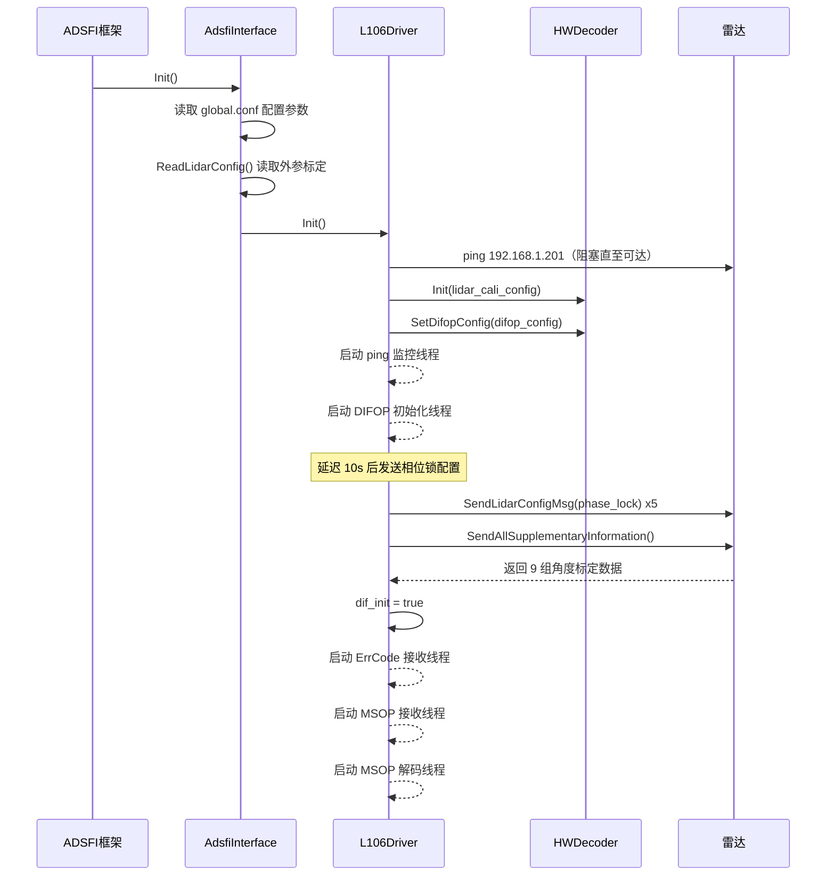
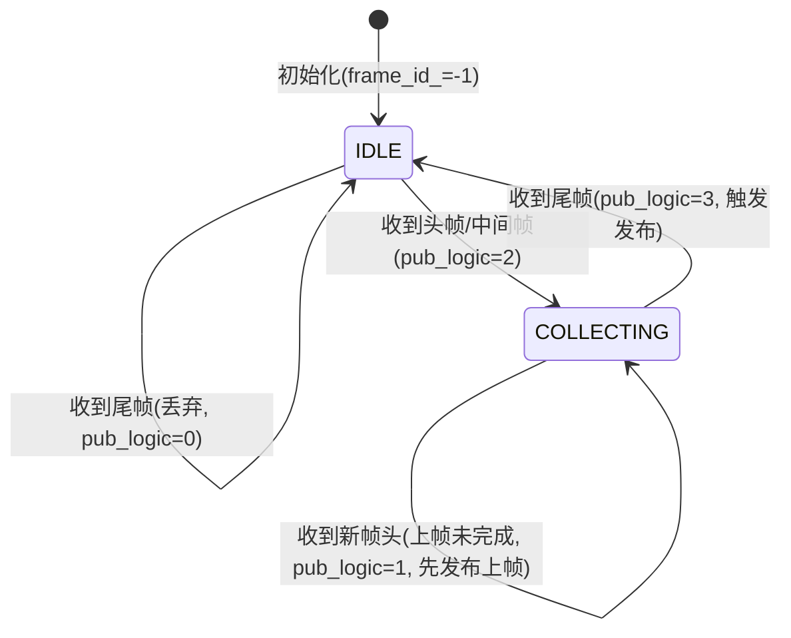

# HwL106Lidar 激光雷达驱动模块设计文档

## 1. 文档信息

| 项目 | 内容 |
| --- | --- |
| 模块名称 | HwL106Lidar（华为 L106 激光雷达驱动） |
| 模块编号 | HW-HAL-LIDAR-L106 |
| 所属系统 / 子系统 | 硬件抽象层 / 传感器驱动子系统 |
| 模块类型 | 平台模块 |
| 负责人 | 待填写 |
| 参与人 | 待填写 |
| 当前状态 | 草稿 |
| 版本号 | V1.0 |
| 创建日期 | 2026-03-04 |
| 最近更新 | 2026-03-04 |

---

## 2. 模块概述

### 2.1 模块定位

本模块属于硬件抽象层（Hardware Abstraction Layer），负责对华为 L106 型 96 线激光雷达进行驱动适配，将硬件原始 UDP 数据包解析为标准化点云帧，供上层感知模块消费。

- **模块职责**：通过组播 UDP 接收激光雷达 MSOP（主数据流）与 DIFOP（设备信息流）数据包，完成角度标定信息获取、原始数据解码、坐标系变换、车身遮挡点过滤，最终输出结构化点云帧及原始数据包。
- **上游模块（输入来源）**：华为 L106 激光雷达硬件（通过以太网组播 UDP 协议传输）。
- **下游模块（输出去向）**：
  - 激光雷达感知模块（LidarDetection）：消费 `MsgLidarFrame`（点云帧）。
  - 激光雷达 SLAM / 定位模块（LidarSlam）：消费 `SensorLidarPacket`（原始数据包）。
- **对外能力**：通过 ADSFI 框架的 Topic 机制对外发布，不直接暴露 SDK 接口。

### 2.2 设计目标

- **功能目标**：实现对华为 L106 激光雷达的完整驱动，包括设备连通性检测、补充信息（角度标定表）获取、MSOP 数据包实时接收与解码、点云坐标变换及发布。
- **性能目标**：点云帧端到端延迟（从雷达出包到 Topic 发布）不超过 50ms；支持 10Hz 帧率（interval_ms=100ms）。
- **稳定性目标**：驱动进程具备设备掉线检测与重连等待能力；关键异常通过故障码上报机制（FaultApi）通知系统监控，不因单次异常导致进程崩溃。
- **安全目标**：数据访问通过互斥锁与条件变量保护，避免多线程竞争导致数据损坏；不对外暴露原始内存指针。
- **可维护性目标**：驱动参数（IP、端口、相位锁、标定参数等）全部通过配置文件注入，无硬编码业务参数；故障码体系完整，便于现场排查。

### 2.3 设计约束

- **硬件平台**：华为 MDC 2501 计算平台，运行于 Linux 环境，网络接口需与雷达处于同一子网（192.168.1.x）。
- **中间件 / 框架依赖**：
  - ADSFI 框架（`BaseAdsfiInterface`、`CustomStack`、`FaultHandle::FaultApi`）
  - Eigen 线性代数库（用于坐标变换矩阵计算）
  - POSIX 套接字 / 组播 UDP
- **协议约束**：雷达数据协议为华为私有协议，MSOP 端口默认 2368（组播地址 239.255.0.1），DIFOP 端口默认 58000，错误码端口默认 2369。
- **兼容性约束**：支持前、左、右三路雷达实例（HwL106LidarFront / Left / Right），各实例通过独立配置文件区分 IP 与端口，代码逻辑共用。

---

## 3. 需求与范围

### 3.1 功能需求（FR）

| 需求 ID | 描述 | 优先级 |
| --- | --- | --- |
| FR-01 | 通过组播 UDP 接收华为 L106 激光雷达 MSOP 数据包 | 高 |
| FR-02 | 通过 DIFOP 通道获取雷达补充信息（垂直角度表、水平/垂直角度偏移表） | 高 |
| FR-03 | 将原始 UDP 数据包解码为三维点云（x/y/z/intensity/ring/angle/latency） | 高 |
| FR-04 | 对点云进行外参坐标变换（平移 + 旋转），将点云转换至车体坐标系 | 高 |
| FR-05 | 过滤车身遮挡区域内的噪声点（基于车模型包围盒） | 中 |
| FR-06 | 向下游发布点云帧（MsgLidarFrame）及原始数据包（SensorLidarPacket） | 高 |
| FR-07 | 启动时检测雷达网络连通性，未连通时阻塞等待并上报故障码 | 高 |
| FR-08 | 运行时周期性检测雷达网络连通性，断连时上报故障码 | 中 |
| FR-09 | 接收并解析雷达错误码（LidarErrCode），将各状态位映射为系统故障码 | 中 |
| FR-10 | 支持相位锁配置，初始化时向雷达发送相位锁参数 | 中 |
| FR-11 | 支持帧时间戳过滤（ten_ms_filter），丢弃时间戳落在指定窗口内的帧 | 中 |
| FR-12 | 从标定配置文件读取激光雷达外参（lidar_t / lidar_R），读取失败时使用默认值并上报故障码 | 高 |

### 3.2 非功能需求（NFR）

| 需求 ID | 类型 | 指标 | 目标值 |
| --- | --- | --- | --- |
| NFR-01 | 性能 | 点云帧端到端延迟 | < 50ms |
| NFR-02 | 性能 | 支持帧率 | 10Hz（interval_ms=100ms） |
| NFR-03 | 稳定性 | 单帧丢包容忍 | 支持帧内丢包检测，不因丢包崩溃 |
| NFR-04 | 稳定性 | 设备掉线恢复 | 掉线后持续检测，恢复后自动继续工作 |
| NFR-05 | 资源 | UDP 接收缓冲区 | 640KB（655360 字节） |
| NFR-06 | 资源 | 点云预分配容量 | 50000 点/帧 |
| NFR-07 | 可观测性 | 故障码覆盖 | 覆盖雷达所有错误状态位（1022002~1022036） |

### 3.3 范围界定

#### 3.3.1 本模块必须实现：
- 华为 L106 激光雷达 MSOP/DIFOP 协议解析
- 点云坐标变换与车身遮挡过滤
- 点云帧及原始数据包的 Topic 发布
- 雷达连通性检测与故障码上报
- 外参标定参数加载

#### 3.3.2 本模块明确不做：
- 点云目标检测、分割、跟踪等感知算法
- 离线回放模式下的数据重放（由 HwL106LidarFrontOffline 等独立模块承担）
- 多雷达时间同步与点云融合
- 雷达固件升级与参数持久化写入

### 3.4 需求 - 设计 - 验证映射

| 需求 ID | 对应设计章节 | 对应接口 / 类 | 验证方式 |
| --- | --- | --- | --- |
| FR-01 | 5.3 UDP 接收线程 | `MulticastUDP::RecieveData` | 实车联调，抓包验证 |
| FR-02 | 5.3 补充信息获取流程 | `HWDecoder::SendAllSupplementaryInformation` | 日志确认 9 组数据 ID 全部接收 |
| FR-03 | 5.3 解码流程 | `HWDecoder::ConvertPacktsToPoint` | 点云可视化验证 |
| FR-04 | 7.1 DecoderConfig::Init | `HWDecoder::ConvertPoint` | 与标定工具输出对比 |
| FR-05 | 5.3 解码流程 | 车模型包围盒过滤逻辑 | 静态场景点云验证无车身点 |
| FR-06 | 6.1 对外接口 | `AdsfiInterface::Process` | Topic 订阅验证数据完整性 |
| FR-07 | 5.3 启动流程 | `L106Driver::Init` ping 检测 | 断网启动验证阻塞行为 |
| FR-09 | 5.3 错误码线程 | `LidarErrCode` 解析逻辑 | 模拟雷达错误状态验证故障码上报 |
| FR-12 | 5.3 初始化流程 | `AdsfiInterface::ReadLidarConfig` | 删除标定文件验证默认值生效及故障码上报 |

---

## 4. 设计思路

### 4.1 方案概览

本模块的核心问题是：将华为 L106 激光雷达的私有 UDP 协议数据流，实时转换为标准化点云帧，并以低延迟发布给上层模块。

整体拆解为三条并行数据流：

1. **DIFOP 补充信息流**：驱动初始化阶段，通过 DIFOP 通道向雷达请求 9 组角度标定数据（垂直角度表、垂直/水平角度偏移表），全部接收完成后置 `dif_init=true`，解锁 MSOP 解码流程。
2. **MSOP 主数据流**：UDP 接收线程持续接收 MSOP 数据包，推入无锁队列；解码线程从队列消费，逐包解析为点云点，按帧边界（PkgPosition 标志位）聚合，帧完成后通过条件变量通知发布线程。
3. **错误码流**：独立线程订阅雷达错误码组播，实时解析各状态位并映射为系统故障码。

关键数据流向：

```
雷达硬件
  ├─ MSOP (239.255.0.1:2368) ──→ MulticastUDP ──→ UserLockQueue ──→ HWDecoder::ConvertPacktsToPoint
  │                                                                        │
  │                                                                        ▼
  │                                                               L106DataInteract (双缓冲)
  │                                                                        │
  │                                                                        ▼
  │                                                          AdsfiInterface::Process
  │                                                          ├─ MsgLidarFrame  → Topic: *_lidar_points
  │                                                          └─ SensorLidarPacket → Topic: *_lidar_packets
  │
  ├─ DIFOP (192.168.1.201:58000) ──→ UdpClient ──→ HWDecoder 角度标定表
  └─ ErrCode (239.255.0.1:2369) ──→ MulticastUDP ──→ LidarErrCode ──→ FaultApi
```

### 4.2 关键决策与权衡

**决策 1：补充信息获取采用请求-应答模式**

雷达角度标定数据（垂直角度、水平/垂直偏移）不随 MSOP 数据包下发，需主动向雷达发送请求帧（SuppleInfo），雷达返回对应数据。驱动在初始化阶段循环请求直至 9 组数据全部就绪，期间 MSOP 数据包被丢弃，避免使用错误角度表解码出错误点云。

**决策 2：双缓冲 + 条件变量解耦生产与消费**

`L106DataInteract` 采用双缓冲设计（`lidar_points` / `bak_lidar_points`），解码线程写入工作缓冲区，帧完成时原子交换至备份缓冲区并通过条件变量通知。发布线程阻塞等待条件变量，唤醒后直接读取备份缓冲区，无需等待下一帧数据写入，降低发布延迟。

**决策 3：帧时间戳过滤（ten_ms_filter）**

雷达以固定相位出帧，帧时间戳的纳秒部分存在规律性分布。通过配置 `ten_ms_filter_l` / `ten_ms_filter_r` 窗口，可过滤掉时间戳落在特定 10ms 区间内的帧，用于多雷达相位对齐场景，避免多路雷达同时触发下游处理造成计算峰值。

**决策 4：故障码采用计数阈值机制**

`ec_add` / `ec_remove` 均带有 `threshold` 参数，只有连续触发次数达到阈值才真正上报/清除故障码，避免偶发性抖动导致频繁告警。

### 4.3 与现有系统的适配

- 本模块继承 `BaseAdsfiInterface`，遵循 ADSFI 框架的生命周期管理（`Init` / `Process`），由框架调度器统一管理启动与调度。
- 配置参数通过 `CustomStack::GetConfig` 从 `global.conf` 读取，外参通过 `GetProjectConfigArray` 从项目级标定文件读取，与系统配置管理机制完全兼容。
- 故障码通过 `FaultHandle::FaultApi::SetFaultCode` / `ResetFaultCode` 上报，与系统监控平台对接。

### 4.4 失败模式与降级

| 失败场景 | 当前处理策略 | 降级能力 |
| --- | --- | --- |
| 雷达网络不可达（启动时） | 阻塞循环 ping，上报 1022036，直至连通 | 无降级，强依赖 |
| 雷达网络中断（运行时） | 周期 ping 检测，上报 1022036，MSOP 接收线程阻塞 | 上层模块超时感知 |
| 补充信息获取失败 | 循环重试，MSOP 数据丢弃直至成功 | 无降级 |
| 标定文件读取失败 | 使用硬编码默认值，上报 1022002 | 使用默认外参继续工作 |
| 帧内丢包 | 上报 1022006，继续处理后续包 | 当帧点云不完整但继续发布 |
| 帧间丢帧 | 上报 1022007，继续处理新帧 | 跳帧继续工作 |
| 时间同步失败（偏差 > 0.5s） | 上报 1022011，继续处理 | 时间戳异常但点云继续发布 |


---

## 5. 架构与技术方案

### 5.1 模块内部架构

模块由以下子组件构成：

```
AdsfiInterface          （ADSFI 框架适配层）
  └─ L106Driver         （驱动主控，管理所有线程与资源）
       ├─ HWDecoder     （协议解码器，角度标定表管理，点云转换）
       ├─ MulticastUDP  （MSOP 组播 UDP 接收）
       ├─ MulticastUDP  （ErrCode 组播 UDP 接收）
       ├─ UdpClient     （DIFOP 单播 UDP 收发）
       └─ UserLockQueue （MSOP 数据包无锁队列）
L106DataInteract        （单例，双缓冲数据交换中心）
```

**线程模型**（共 5 个 detach 线程）：

| 线程名 | 职责 | 阻塞点 |
| --- | --- | --- |
| ping 监控线程 | 周期性检测雷达 IP 可达性（1s 间隔） | `usleep` |
| DIFOP 初始化线程 | 发送相位锁配置，循环请求 9 组补充信息 | `RecieveData` |
| ErrCode 接收线程 | 接收雷达错误码组播，解析并上报故障码 | `RecieveData` |
| MSOP 接收线程 | 接收 MSOP 组播数据包，推入队列 | `RecieveData` |
| MSOP 解码线程 | 从队列取包，解码点云，按帧聚合，通知发布 | `sleep_for(10ms)` |

发布线程由 ADSFI 框架调度，阻塞在 `L106DataInteract::GetLidarData` / `GetPacketsData` 的条件变量上。

**同步模型**：
- `UserLockQueue`：内部带互斥锁，生产者（MSOP 接收线程）与消费者（解码线程）安全并发。
- `L106DataInteract`：双 mutex（`mutex_` 保护数据写入，`cv_mutex_` 保护条件变量），避免死锁。
- `HWDecoder::ec_add/ec_remove`：内部 `_mtx` 保护故障码状态 map，支持多线程并发调用。
- `dif_init`：`std::atomic<bool>`，无锁标志位，解码线程轮询等待 DIFOP 初始化完成。

### 5.2 关键技术选型

| 技术点 | 方案 | 选择原因 | 备选方案 |
| --- | --- | --- | --- |
| UDP 接收 | 组播 UDP（MulticastUDP） | 雷达采用组播协议广播数据，支持多进程同时接收 | 单播 UDP |
| 角度查表 | 预计算 sin/cos 查找表（36000 项） | 避免实时三角函数计算，降低解码 CPU 开销 | 实时 sin/cos 计算 |
| 帧聚合 | PkgPosition 标志位（0=头/1=中/2=尾） | 雷达协议原生支持帧边界标记，无需自行检测 | 基于时间戳分帧 |
| 数据交换 | 双缓冲 + 条件变量 | 解耦解码与发布，避免发布线程阻塞解码 | 单缓冲加锁 |
| 坐标变换 | Eigen 4x4 变换矩阵 | 支持任意旋转+平移组合，计算高效 | 手写欧拉角变换 |
| 故障上报 | FaultApi（计数阈值机制） | 防抖，避免偶发异常频繁告警 | 直接上报 |
| 设备检测 | ping 命令（system 调用） | 简单可靠，无需额外依赖 | ICMP raw socket |

### 5.3 核心流程

#### 启动流程



#### MSOP 解码与发布流程

解码线程对每个 UDP 包调用 `HWDecoder::ConvertPacktsToPoint`，根据返回的 `pub_logic` 决定行为：

- `pub_logic=0`：丢弃（尾帧作为第一个包，数据不完整）
- `pub_logic=2`：累积点云与数据包，不发布
- `pub_logic=3`：累积最后一包后，调用 `NotifyLidarData` 触发发布
- `pub_logic=1`：上一帧未收到尾包即收到新帧，先发布上一帧，再开始新帧累积

每帧包含 240 个 MSOP 数据包（PackageSeqNum 0~478，步长 2），每包含 2 个 DataBlock，每 DataBlock 含 96 个通道数据，单帧理论点数：240 × 2 × 96 = 46080 点。

#### 异常流程

- **帧内丢包**：`PackageSeqNum` 不连续时上报 1022006，继续处理后续包，当帧点云不完整。
- **帧间丢帧**：`FrameID` 不连续时上报 1022007，重置帧状态，开始新帧。
- **时间戳异常**：雷达时间戳与系统时间偏差超过 0.5s 时上报 1022011。
- **时间回退**：新帧时间戳小于上一帧时上报 1022008。


---

## 6. 接口设计

### 6.1 对外接口

| 接口名 | 类型 | 输入 | 输出 | 频率 | 备注 |
| --- | --- | --- | --- | --- | --- |
| `AdsfiInterface::Process(MsgLidarFrame)` | Topic 发布 | 无（内部从 L106DataInteract 获取） | `MsgLidarFrame`（点云帧） | 10Hz | topic: `*_lidar_points` |
| `AdsfiInterface::Process(SensorLidarPacket)` | Topic 发布 | 无（内部从 L106DataInteract 获取） | `SensorLidarPacket`（原始包） | 10Hz | topic: `*_lidar_packets` |

Topic 命名由 `global.conf` 中 `GenericDataSend` 配置决定，前缀与雷达位置对应：
- 前雷达：`front_middle_lidar_points` / `front_middle_lidar_packets`
- 左雷达：`left_lidar_points` / `left_lidar_packets`
- 右雷达：`right_lidar_points` / `right_lidar_packets`

### 6.2 对内接口

**L106DataInteract（单例数据交换中心）**

| 方法 | 调用方 | 说明 |
| --- | --- | --- |
| `AddLidarPackets(CommonUdpPacket)` | 解码线程 | 向当前帧追加一个 MSOP 数据包 |
| `AddLidarPoints(MsgLidarFrame)` | 解码线程 | 向当前帧追加解码后的点云点 |
| `SetLidarDfiop(CommonUdpPacket)` | 解码线程 | 设置当前帧的 DIFOP 补充信息 |
| `NotifyLidarData(double ts)` | 解码线程 | 帧完成，交换双缓冲，通知发布线程 |
| `GetLidarData(MsgLidarFrame&)` | 发布线程 | 阻塞等待新帧，返回点云帧 |
| `GetPacketsData(SensorLidarPacket&)` | 发布线程 | 阻塞等待新帧，返回原始数据包 |

**HWDecoder 核心方法**

| 方法 | 说明 |
| --- | --- |
| `Init(DecoderConfig, sensor_id)` | 初始化解码器，加载标定配置 |
| `SetDifopConfig(SocketConfig)` | 初始化 DIFOP UDP 客户端 |
| `SendAllSupplementaryInformation()` | 循环请求 9 组角度标定数据 |
| `ConvertPacktsToPoint(packet, cloud, ts, pub_logic)` | 解析单个 MSOP 包，输出点云及帧控制逻辑 |
| `ConvertPoint(point, config)` | 对单点执行坐标变换（4x4 矩阵乘法） |
| `isIpReachable(ip)` | 通过 ping 检测 IP 可达性 |

### 6.3 接口稳定性声明

- **稳定接口**：`AdsfiInterface::Init()`、`AdsfiInterface::Process()` — 变更须评审，影响 ADSFI 框架调度。
- **稳定接口**：`L106DataInteract::GetLidarData()` / `GetPacketsData()` — 变更影响发布线程行为。
- **非稳定接口**：`HWDecoder` 内部方法 — 允许随协议版本调整。

### 6.4 接口行为契约

**`AdsfiInterface::Process(MsgLidarFrame&)`**
- 前置条件：`Init()` 已完成，`dif_init=true`，雷达正常出帧。
- 后置条件：`msg` 填充当前帧点云数据，`seq` 单调递增，`frameID="/base_link"`。
- 阻塞行为：**阻塞**，内部等待条件变量，直至新帧就绪（最长等待约 100ms）。
- 可重入：否（单线程调用）。
- 失败语义：返回 0 表示成功；若雷达停止出帧，调用将持续阻塞。

**`AdsfiInterface::Process(SensorLidarPacket&)`**
- 前置条件：同上。
- 后置条件：`packets` 包含当前帧所有 MSOP 原始包及 DIFOP 补充信息，header 填充时间戳与序列号。
- 阻塞行为：**阻塞**，与点云帧共享同一条件变量通知。
- 失败语义：返回 0 表示成功。


---

## 7. 数据设计

### 7.1 数据结构

**DecoderConfig**（`data_pool.h`）：解码器标定配置，包含外参平移量（tf_x/y/z）、旋转欧拉角（tf_roll/pitch/yaw）、预旋转参数、车模型包围盒参数及调试开关。`Init()` 方法将欧拉角与平移量合成为 4×4 齐次变换矩阵 `transform[16]`，供点云变换使用。

**SupplementaryData**（`data_pool.h`）：雷达角度标定表，包含：
- `vertical_angle[192]`：96 线垂直角度，单位 0.00390625°
- `vertical_angle_offset[480][4]`：垂直角度偏移，按列 ID（0~479）和 LUT 索引（0~3）索引
- `horizontal_angle_offset[192][4]`：水平角度偏移，按通道和 LUT 索引

**HWPointCloudProtocol**（`pointcloud_data.h`）：MSOP UDP 包结构，包含数据头（帧 ID、包序号、帧位置标志、UTC 时间戳、LUT 索引、方位角索引）和 2 个 DataBlock（每块含 96 通道的距离与反射率数据）。

**LidarErrCode**（`pointcloud_ctrl.h`）：雷达错误码结构，包含以太网物理层、SOC 控制、收发模块、电机、温度、电压、时间同步、遮挡等 20+ 状态位。

**L106DataInteract**（`HuaweiL106.hpp`）：单例双缓冲数据交换类，内部维护工作缓冲区（`lidar_packets` / `lidar_points`）和备份缓冲区（`bak_lidar_packets` / `bak_lidar_points`），通过两个独立条件变量分别通知点云帧和原始数据包的消费者。

### 7.2 状态机

**帧聚合状态机**（`HWDecoder::ConvertPacktsToPoint` 内部）：



状态变量：`frame_id_`（当前帧 ID）、`is_new`（是否在收帧中）、`udp_pkg_id_`（上一包序号）、`udp_pkg_count_`（当前帧包计数）。

### 7.3 数据生命周期

- **MSOP 数据包**：由 MSOP 接收线程创建并推入 `UserLockQueue`，解码线程消费后转换为点云点，原始包同时存入 `L106DataInteract::lidar_packets`；帧发布后 `lidar_packets.msop_packet.clear()` 清空。
- **点云帧**：解码线程逐包累积至 `lidar_points.pointCloud`；帧完成时拷贝至 `bak_lidar_points`，工作缓冲区清空；发布线程读取 `bak_lidar_points` 后通过 Topic 发出，生命周期结束。
- **角度标定表**：DIFOP 初始化阶段写入 `HWDecoder` 内部数组，进程生命周期内不再变更。

---

## 8. 异常与边界处理

| 异常场景 | 检测方式 | 处理策略 | 是否可恢复 | 上报方式 |
| --- | --- | --- | --- | --- |
| 雷达 IP 不可达（启动） | ping 检测失败 | 阻塞循环重试（500ms 间隔） | 是（设备上电后自动恢复） | ec 1022036 |
| 雷达 IP 不可达（运行时） | ping 检测失败（1s 间隔） | 上报故障码，MSOP 接收线程阻塞 | 是 | ec 1022036 |
| DIFOP UDP 初始化失败 | `SetDifopConfig` 返回 -1 | 上报故障码，跳过补充信息获取 | 否（需重启） | ec 1022003 |
| MSOP 组播初始化失败 | `MulticastUDP::Init` 返回非 0 | 上报故障码，接收线程退出 | 否（需重启） | ec 1022003 |
| 标定文件读取失败 | `GetProjectConfigArray` 返回 false | 使用默认外参，上报故障码 | 是（功能降级） | ec 1022002 |
| Column_ID 或 LUTIndex 越界 | 解码时范围检查 | 丢弃当前包，上报故障码 | 是 | ec 1022005 |
| 帧内丢包 | PackageSeqNum 不连续 | 继续处理，上报故障码 | 是（当帧不完整） | ec 1022006 |
| 帧间丢帧 | FrameID 不连续 | 重置帧状态，上报故障码 | 是 | ec 1022007 |
| 时间戳回退 | 新帧 ts < 上帧 ts | 上报故障码，继续处理 | 是 | ec 1022008 |
| 时间同步失败 | 雷达 ts 与系统 ts 偏差 > 0.5s | 上报故障码，继续处理 | 是 | ec 1022011 |
| 雷达硬件错误（各状态位） | LidarErrCode 状态位解析 | 映射为对应故障码上报 | 视具体错误 | ec 1022012~1022035 |

---

## 9. 性能与资源预算

### 9.1 性能指标

| 场景 | 指标 | 目标值 | 测试方法 |
| --- | --- | --- | --- |
| 正常出帧 | 点云帧端到端延迟 | < 50ms | 对比雷达时间戳与 Topic 发布系统时间 |
| 正常出帧 | 帧率 | 10Hz（100ms 间隔） | 统计 Topic 发布频率 |
| 解码吞吐 | 单帧解码耗时 | < 10ms | 解码线程计时日志 |
| 启动时间 | 从进程启动到首帧发布 | < 15s | 含 DIFOP 初始化（10s 延迟 + 补充信息获取） |

### 9.2 资源预算

| 资源 | 常态 | 峰值 | 上限约束 |
| --- | --- | --- | --- |
| UDP 接收缓冲区 | 1025 字节/包 × 队列深度 | 约 250 包 × 1025B ≈ 256KB | 655360B（640KB）系统缓冲 |
| 点云内存 | 50000 点 × ~32B ≈ 1.6MB（双缓冲 × 2） | 约 6.4MB（含备份） | 无硬性限制 |
| 线程数 | 5 个 detach 线程 + 2 个发布线程 | 7 | DRIVER_MAX_NUM_THREAD=7 |
| CPU（解码） | 约 1~3%（查表法） | < 10% | 无硬性限制 |
| 角度查找表 | 36000 × 2 × 8B = 576KB | 576KB（固定） | 进程生命周期内常驻 |
| 角度标定表 | SupplementaryData ≈ 12KB | 12KB（固定） | 进程生命周期内常驻 |

