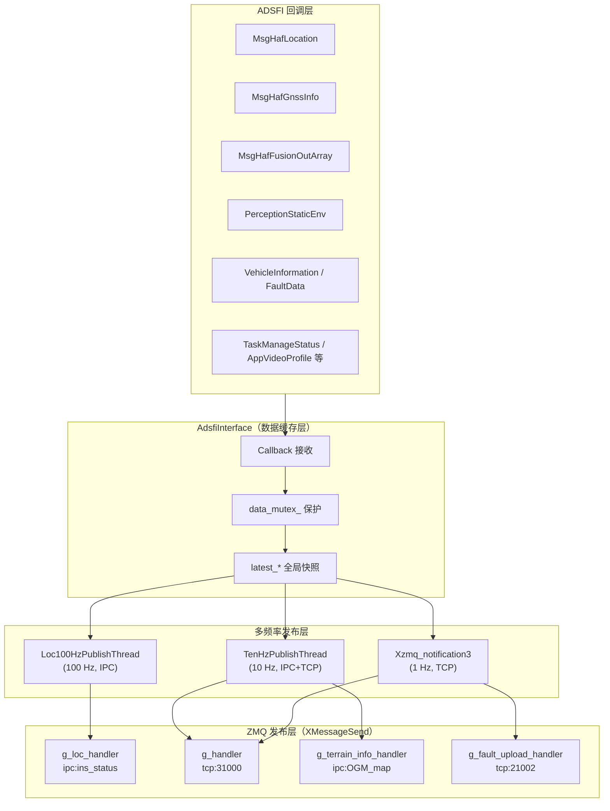
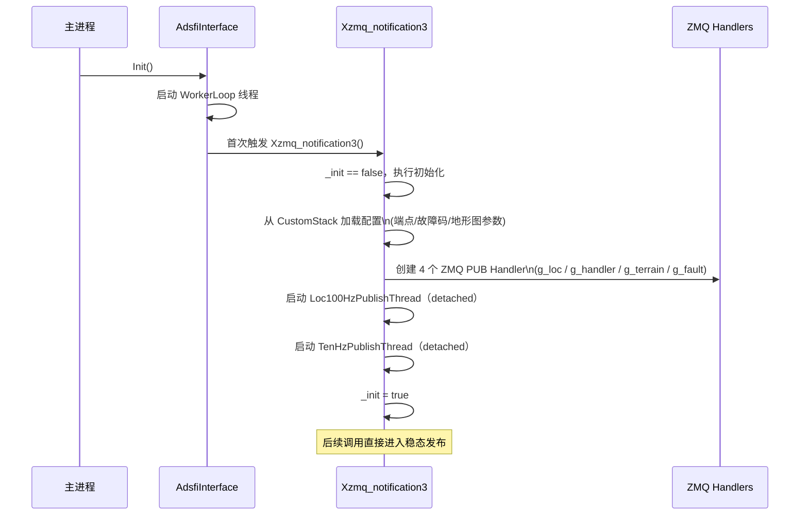
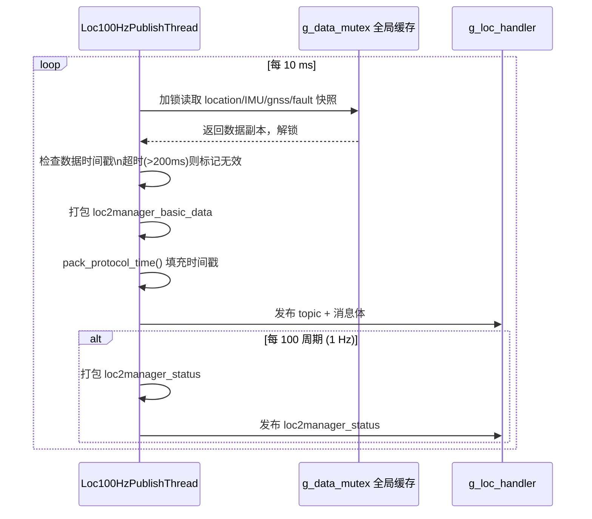
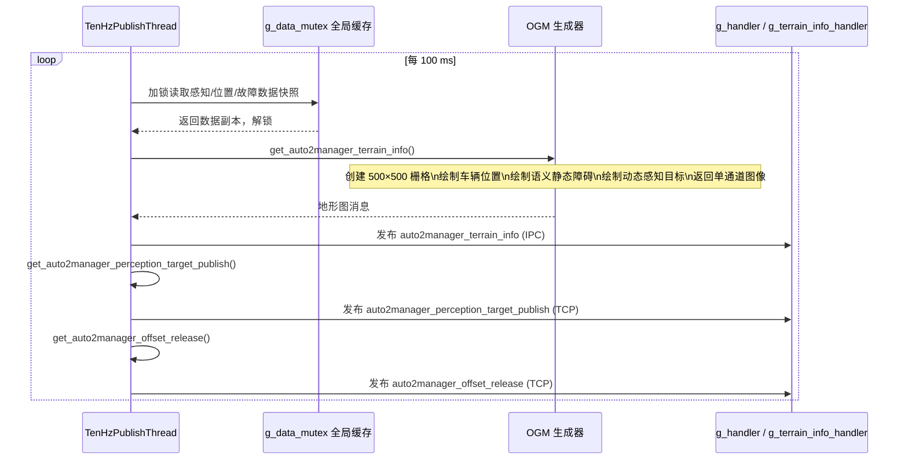
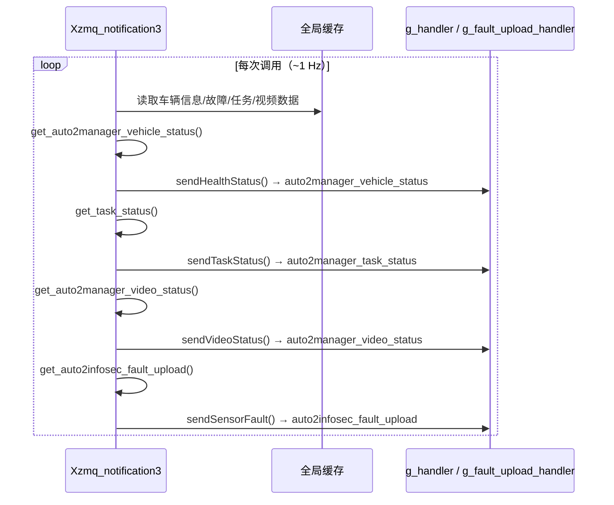
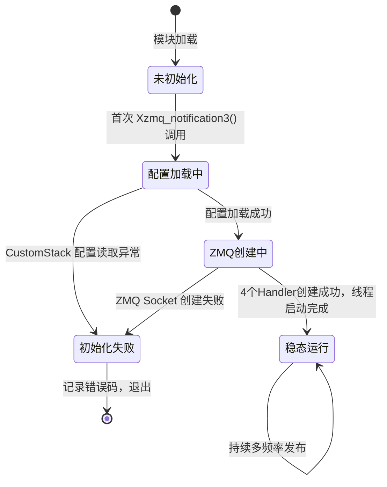
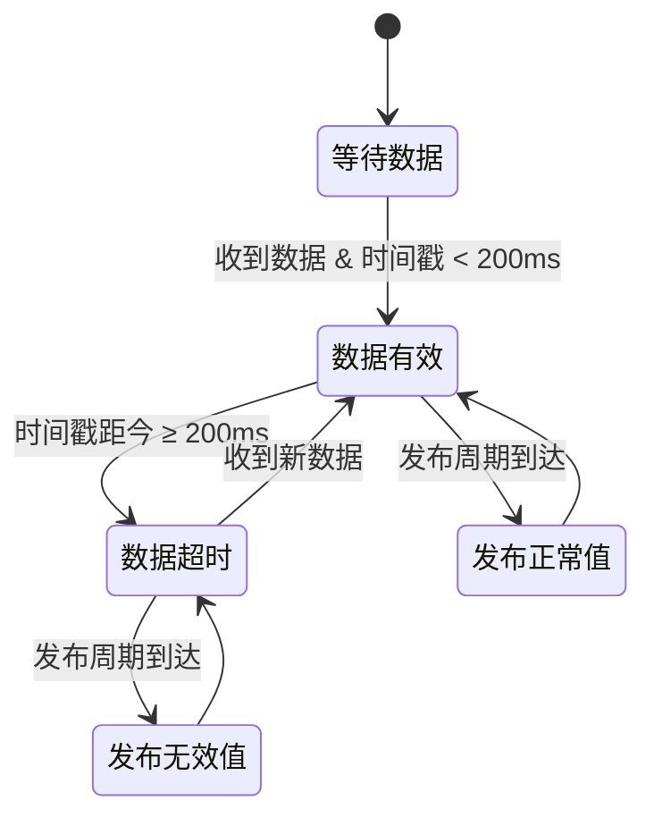

# 1. 文档信息

| 项目 | 内容 |
| :--- | :--- |
| **模块名称** | xzmq_notification |
| **模块编号** | HMI-001 |
| **所属系统 / 子系统** | HMI 模型 / ZMQ 通知子系统 |
| **模块类型** | 平台模块 |
| **负责人** |  |
| **参与人** |  |
| **当前状态** | 草稿 |
| **版本号** | V1.0 |
| **创建日期** | 2026-03-03 |
| **最近更新** | 2026-03-03 |

# 2. 模块概述

## 2.1 模块定位

xzmq_notification 是自动驾驶平台与 HMI（人机界面）/远程管理系统之间的 **数据桥接模块**，负责将系统内部各传感器、感知、定位、任务等数据经过标准化转换后，通过 ZMQ PUB/SUB 模式对外发布。

- **上游模块（输入来源）**：
  - 定位模块（`MsgHafLocation`、`MsgHafGnssInfo`）
  - 感知融合模块（`MsgHafFusionOutArray`）
  - 语义地图模块（`PerceptionStaticEnv`）
  - 车辆控制模块（`VehicleActControl`、`VehicleInformation`）
  - 故障管理模块（`FaultData`）
  - 业务逻辑模块（`BusinessCommand`、`TaskManageStatus`）
  - 视频系统（`AppVideoProfile`、`VideoEncodingPerf`）
  - 遥控模块（`AppRemoteControl`）

- **下游模块（输出去向）**：
  - HMI 任务管理器（TCP `tcp://*:31000`）
  - 信息安全模块（TCP `tcp://*:21002`）
  - 定位状态消费方（IPC `ipc:///opt/usr/FD_task_manager/paramsfile/ins_status`）
  - OGM（栅格地图）消费方（IPC `ipc:///opt/usr/FD_task_manager/paramsfile/OGM_map`）

- **对外提供能力**：ZMQ PUB Socket，供订阅方按 Topic 过滤接收消息

## 2.2 设计目标

- **功能目标**：将系统多源数据聚合、格式化后实时推送给 HMI 和远程管理系统
- **性能目标**：
  - 定位数据：100 Hz 低延迟发布（< 10 ms 抖动）
  - 感知/地形数据：10 Hz 稳定发布
  - 健康/故障状态：1 Hz 推送
- **稳定性目标**：数据超时自动上报无效值；ZMQ 发送失败自动下次重试
- **安全目标**：各线程通过互斥锁隔离共享数据，防止数据竞争
- **可扩展性目标**：通过 CustomStack 配置化端点、故障码映射、地形图参数，无需改代码即可适配新项目

## 2.3 设计约束

- 目标平台：MDC（嵌入式 ARM/x86 自动驾驶计算平台），Linux
- 中间件依赖：ZMQ（libzmq）、ADSFI 回调框架
- 第三方依赖：`zmq`、`pthread`、`glog`、`fmt`、`yaml-cpp`、`pcl`、`opencv`、`proj`
- 所有 ZMQ Socket 使用 PUB/SUB 模式，单向发布，不做 REQ/REP
- 协议格式须遵循 `protocol_common` 命名空间定义的结构体

# 3. 需求与范围

## 3.1 功能需求（FR）

| 需求ID | 描述 | 优先级 |
| :--- | :--- | :--- |
| FR-01 | 以 100 Hz 频率发布定位/IMU 融合数据（`loc2manager_basic_data`） | 高 |
| FR-02 | 以 10 Hz 频率发布感知目标列表（`auto2manager_perception_target_publish`） | 高 |
| FR-03 | 以 10 Hz 频率生成并发布占据栅格地图（OGM，`auto2manager_terrain_info`） | 高 |
| FR-04 | 以 10 Hz 频率发布偏移量与可通行率（`auto2manager_offset_release`） | 中 |
| FR-05 | 以 1 Hz 频率发布车辆健康状态（`auto2manager_vehicle_status`） | 高 |
| FR-06 | 以 1 Hz 频率发布任务状态（`auto2manager_task_status`） | 高 |
| FR-07 | 以 1 Hz 频率发布视频编码状态（`auto2manager_video_status`） | 中 |
| FR-08 | 以 1 Hz 频率发布传感器故障上报（`auto2infosec_fault_upload`） | 高 |
| FR-09 | 以 1 Hz 频率（每 100 周期）发布定位模块状态（`loc2manager_status`） | 中 |
| FR-10 | 数据超时（> 200 ms）时，在发布消息中使用协议定义的无效值 | 高 |
| FR-11 | 支持编队相关消息发布（路径、轨迹、位置） | 低 |
| FR-12 | 从 CustomStack 加载所有端点地址、故障码映射、地形图参数 | 高 |

## 3.2 非功能需求（NFR）

| 需求ID | 类型 | 指标 | 目标值 |
| :--- | :--- | :--- | :--- |
| NFR-01 | 性能 | 定位消息发布延迟 | < 10 ms（100 Hz） |
| NFR-02 | 性能 | 感知消息发布延迟 | < 100 ms（10 Hz） |
| NFR-03 | 性能 | OGM 地图生成耗时 | < 80 ms（单帧，500×500） |
| NFR-04 | 稳定性 | 数据超时容忍 | 200 ms 阈值，超时后使用无效值继续发布 |
| NFR-05 | 可靠性 | ZMQ 发送失败处理 | 记录错误码，下次周期自动重试，不崩溃 |
| NFR-06 | 资源 | 线程数 | 不超过 4 个（含回调线程） |
| NFR-07 | 资源 | 地形图内存 | width × height × channel 字节（默认 500×500×3 = 750 KB） |

## 3.3 范围界定

### 3.3.1 本模块必须实现：

- 多频率（1 Hz / 10 Hz / 100 Hz）独立线程发布
- ADSFI 回调数据的缓存与快照读取
- ZMQ PUB Socket 的初始化、发布和异常处理
- 占据栅格地图（OGM）的实时生成
- 协议时间戳打包（64 bit 格式）
- 坐标系转换（VCS ↔ GCCS ↔ GPS）
- 故障码到 INS 错误位的映射
- 传感器故障信息格式化
- 软件版本读取（`version.json`）

### 3.3.2 本模块明确不做：

> （防止范围膨胀）

- 不负责接收/解析来自 HMI 的指令（REQ/REP 属其他模块）
- 不做消息持久化或录制
- 不做 ZMQ 订阅方的身份鉴权
- 不负责故障的诊断判定（只负责格式化上报）

## 3.4 需求-设计-验证映射

| 需求ID | 对应设计章节 | 对应接口/函数 | 验证方式 |
| :--- | :--- | :--- | :--- |
| FR-01 | 5.3 | `Loc100HzPublishThread()` → `sendTpImu()` | TC-01 |
| FR-02 | 5.3 | `TenHzPublishThread()` → `sendPerceptionTarget()` | TC-02 |
| FR-03 | 5.3 | `TenHzPublishThread()` → `sendTerrainInfo()` | TC-03 |
| FR-04 | 5.3 | `TenHzPublishThread()` → `sendOffSetRelease()` | TC-04 |
| FR-05 | 5.3 | `Xzmq_notification3()` → `sendHealthStatus()` | TC-05 |
| FR-08 | 5.3 | `Xzmq_notification3()` → `sendSensorFault()` | TC-06 |
| FR-10 | 5.3 | 超时判断逻辑（200 ms） | TC-07 |
| FR-12 | 5.2 | `load_terrain_map_config_from_config()` 等 | TC-08 |

# 4. 设计思路

## 4.1 方案概览

模块核心思路是**多频率分层发布**：将数据按实时性要求分为三个发布层，每层运行独立线程，互不阻塞：

- **100 Hz 层**：定位/IMU 数据，实时性最高，独立线程保障
- **10 Hz 层**：感知目标、地形图、偏移量，计算量较大（OGM 生成），独立线程
- **1 Hz 层**：健康状态、任务状态、故障数据，数据变化慢，由主回调触发

数据采集由 ADSFI 回调驱动，缓存在全局快照（加互斥锁保护），发布线程按需读取快照并独立调度发布。

## 4.2 关键决策与权衡

| 决策点 | 选择 | 理由 |
| :--- | :--- | :--- |
| ZMQ 模式 | PUB/SUB 单向 | 推送型架构，发布方无需关心订阅方数量和连接状态 |
| 线程模型 | 独立频率线程 | 各频率解耦，高频不阻塞低频；OGM CPU 密集操作不影响定位发布 |
| 数据同步 | 全局互斥锁 + 局部快照 | 简单可靠；临界区仅做数据拷贝，持锁时间极短 |
| OGM 缓存 | timestamp 变化才重新生成 | OGM 生成 CPU 密集，避免无效重复计算 |
| 配置化 | CustomStack 全量参数化 | 端点、故障码、地图参数均可不改代码适配不同项目 |

## 4.3 与现有系统的适配

- 依赖 ADSFI 回调框架，与 `AdsfiInterface` 绑定
- ZMQ 端点地址通过 CustomStack 配置，适配不同部署环境
- 协议消息格式遵循 `protocol_common` 命名空间，与 HMI/任务管理器侧约定一致

## 4.4 失败模式与降级

| 失败场景 | 处理策略 |
| :--- | :--- |
| ZMQ Socket 创建失败 | 设置错误码 `_ERRORCODE_ZMQ_LISTEN`，模块不启动 |
| ZMQ 发送失败 | 设置错误码 `_ERRORCODE_ZMQ_SEND`，下次周期重试 |
| 定位数据超时（> 200 ms） | 消息中填充协议无效值，继续发布 |
| 配置读取失败 | 记录日志，使用默认值或跳过初始化 |
| OGM 生成异常 | 捕获异常，跳过本次发布，不崩溃 |

# 5. 架构与技术方案

## 5.1 模块内部架构



### 线程 / 进程模型

| 线程 | 频率 | 职责 | 使用的 ZMQ Handler |
| :--- | :--- | :--- | :--- |
| AdsfiInterface::WorkerLoop | ~10 Hz 驱动 | 接收回调数据、触发主函数 | - |
| Loc100HzPublishThread | 100 Hz | 发布定位/IMU 数据，每 100 周期发布 loc_status | g_loc_handler |
| TenHzPublishThread | 10 Hz | 发布感知目标、OGM 地形图、偏移量 | g_handler、g_terrain_info_handler |
| Xzmq_notification3 | 1 Hz | 发布健康/任务/视频/故障状态 | g_handler、g_fault_upload_handler |

### 同步模型

- `g_data_mutex`：保护所有共享感知/定位数据的读写
- `g_mutex_handler`：保护 ZMQ handler 对象在 10 Hz 发送时的访问
- 临界区原则：仅做数据拷贝，持锁时间极短（微秒级）

## 5.2 关键技术选型

| 技术点 | 方案 | 选择原因 | 备选方案 |
| :--- | :--- | :--- | :--- |
| 消息总线 | ZMQ PUB/SUB | 低延迟、解耦订阅方、支持多 Topic 过滤 | ROS Topic、SOME/IP |
| 传输协议 | IPC（高速本地）+ TCP（网络） | IPC 延迟低用于高频；TCP 用于跨机通信 | 全 TCP |
| 地图生成 | OpenCV + PCL | 已有依赖，图像处理能力强 | 纯手写 |
| 坐标转换 | GeometryTool + Proj | 项目统一工具库 | 自研 |
| 配置管理 | CustomStack | 项目统一配置中心 | YAML 文件直读 |

## 5.3 核心流程

### 初始化流程



### 100 Hz 定位发布流程



### 10 Hz 感知/地形发布流程



### 1 Hz 状态发布流程



# 7. 接口设计

## 7.1 对外接口（ZMQ Topic 列表）

| Topic 名称 | 类型 | 频率 | 端点 | 描述 |
| :--- | :--- | :--- | :--- | :--- |
| `loc2manager_basic_data` | ZMQ PUB | 100 Hz | IPC:ins_status | 融合定位/IMU/GNSS 数据 |
| `loc2manager_status` | ZMQ PUB | 1 Hz | IPC:ins_status | 定位模块软件版本与故障状态 |
| `auto2manager_vehicle_status` | ZMQ PUB | 1 Hz | TCP:31000 | 车辆健康/降级/策略/故障 |
| `auto2manager_task_status` | ZMQ PUB | 1 Hz | TCP:31000 | 任务类型/进度/状态 |
| `auto2manager_video_status` | ZMQ PUB | 1 Hz | TCP:31000 | 视频分辨率/码率/帧率 |
| `auto2manager_terrain_info` | ZMQ PUB | 10 Hz | IPC:OGM_map | 占据栅格地图（OGM） |
| `auto2manager_perception_target_publish` | ZMQ PUB | 10 Hz | TCP:31000 | 感知目标列表 |
| `auto2manager_offset_release` | ZMQ PUB | 10 Hz | TCP:31000 | 偏移量与可通行率 |
| `auto2infosec_fault_upload` | ZMQ PUB | 1 Hz | TCP:21002 | 传感器故障上报 |
| `auto2manager_formation_path` | ZMQ PUB | 按需 | TCP:31000 | 编队路径 |
| `manager2auto_formation_trajectory` | ZMQ PUB | 按需 | TCP:31000 | 编队轨迹 |
| `manager2auto_formation_position` | ZMQ PUB | 按需 | TCP:31000 | 编队位置 |
| `auto2manager_control_data_upload` | ZMQ PUB | 按需 | TCP:31000 | 车辆控制数据 |
| `auto2manager_faultdata` | ZMQ PUB | 按需 | TCP:31000 | 故障数据 |

## 7.2 对内接口

- **AdsfiInterface::Callback(...)** — 多重载，接收各 ADSFI 数据回调，加锁更新 `latest_*` 缓存
- **AdsfiInterface::GetCurrentDataSnapshotUnsafe()** — 无锁读取当前快照（调用方自行加锁）
- **XMessageSend::send\*()** — 各消息类型的发布封装，内部处理 ZMQ 多帧发送

## 7.3 接口稳定性声明

- **稳定接口**：所有 ZMQ Topic 名称、消息结构体字段（变更须评审）
- **非稳定接口**：`XMessageSend` 内部函数、`AdsfiInterface` 内部缓存结构（允许调整）

## 7.4 接口行为契约

| 接口 | 前置条件 | 后置条件 | 阻塞 | 最大执行时间 | 失败语义 |
| :--- | :--- | :--- | :--- | :--- | :--- |
| `sendTpImu()` | ZMQ handler 已初始化 | 消息已发送至 IPC | 否（ZMQ NOBLOCK） | < 1 ms | 设置错误码，返回 |
| `sendTerrainInfo()` | handler 已初始化，数据不为空 | OGM 已发布 | 否 | < 100 ms | 捕获异常，跳过 |
| `sendHealthStatus()` | handler 已初始化 | 状态消息已发布 | 否 | < 1 ms | 设置错误码，返回 |
| `sendSensorFault()` | handler 已初始化 | 故障消息已发布至 TCP:21002 | 否 | < 1 ms | 设置错误码，返回 |

# 8. 数据设计

## 8.1 核心数据结构

### 协议时间戳格式（64 bit）

```
Bits [63:56] = 年（offset from 1970）
Bits [55:48] = 月 (1-12)
Bits [47:40] = 日 (1-31)
Bits [39:32] = 时 (0-23)
Bits [31:24] = 分 (0-59)
Bits [23:16] = 秒 (0-59)
Bits [15: 0] = 毫秒 (0-999)
```

### OGM 地形图像素值定义

| 像素值 | 含义 |
| :--- | :--- |
| 0 | 未知 / 空 |
| 1 | 可通行区域 |
| 2 | 障碍物（语义静态） |
| 3 | 动态感知目标（可配置类型映射） |
| 4 | 车辆自身位置 |

### 故障等级定义

| 等级值 | 含义 |
| :--- | :--- |
| 3 | Info（提示） |
| 2 | Warning（警告） |
| 1 | Serious（严重） |

## 8.2 状态机

### 模块初始化状态机



### 数据健康状态机（per 线程）



## 8.3 数据生命周期

- **创建**：ADSFI 回调到达时由 `AdsfiInterface::Callback()` 更新全局缓存
- **使用**：各发布线程周期性加锁读取快照
- **销毁**：新数据到来时覆盖旧缓存，无显式销毁
- **持久化**：无（纯内存模型）

# 9. 异常与边界处理

| 异常场景 | 检测方式 | 处理策略 | 是否可恢复 | 上报方式 |
| :--- | :--- | :--- | :--- | :--- |
| ZMQ Socket 创建失败 | 捕获 zmq::error_t | 设置错误码，模块不启动 | 否 | Ec409 错误码 |
| ZMQ 消息发送失败 | 捕获 zmq::error_t | 设置错误码，下周期重试 | 是 | Ec409 错误码 |
| 定位数据超时（> 200 ms） | 时间戳差值比较 | 消息中填充协议无效值 | 是 | 发布消息中标记 |
| CustomStack 配置缺失 | 读取返回值检查 | 使用默认值或跳过初始化 | 部分可 | ApError 日志 |
| OGM 生成异常 | try-catch | 跳过本次发布，不崩溃 | 是 | 日志 |
| 故障列表超出协议限制 | 大小检查 | resize 截断到协议最大值 | 是 | 无 |
| 数据并发读写冲突 | mutex 保护 | 加锁串行化 | 是 | 无 |

# 10. 性能与资源预算

## 10.1 性能指标

| 场景 | 指标 | 目标值 | 测试方法 |
| :--- | :--- | :--- | :--- |
| loc2manager_basic_data 发布 | 周期 | 10 ms ± 1 ms | 统计 100 次发布时间间隔 |
| OGM 地形图生成（500×500） | 单帧耗时 | < 80 ms | 多次采样取平均值 |
| 感知目标发布 | 周期 | 100 ms ± 5 ms | 统计发布时间戳间隔 |
| 数据超时检测 | 延迟容忍 | 200 ms 阈值 | 断开数据源后观察消息变化 |

## 10.2 资源预算

| 资源 | 常态 | 峰值 | 上限约束 |
| :--- | :--- | :--- | :--- |
| 内存（OGM 图像） | 750 KB（500×500×3） | 750 KB | 由配置决定 |
| 内存（全局缓存） | < 10 MB | < 20 MB | 随感知目标数量浮动 |
| CPU（OGM 生成） | 20-40% 单核 | 60% | < 80%（不抢占其他任务） |
| 线程数 | 3 | 3 | 固定（不动态增加） |
| ZMQ Socket 数 | 4 | 4 | 固定 |

# 11. 构建与部署

## 11.1 环境依赖

| 依赖项 | 版本要求 | 说明 |
| :--- | :--- | :--- |
| 操作系统 | Linux（嵌入式 ARM/x86） | MDC 平台 |
| 编译器 | LLVM Clang（MDC SDK） | MDC 交叉编译工具链 |
| libzmq | ≥ 4.x | ZMQ 消息通信 |
| pthread | 系统自带 | 多线程支持 |
| glog | 项目版本 | 日志系统 |
| fmt | 项目版本 | 格式化输出 |
| yaml-cpp | 项目版本 | YAML 配置解析 |
| pcl | 1.11 | 点云处理（OGM 生成） |
| opencv | 4.x | 图像处理（OGM 生成） |
| proj / Proj4 | 项目版本 | 坐标系投影转换 |

## 11.2 构建步骤

### 构建命令

本模块通过 CMake 集成，由顶层 CMakeLists.txt 的 `include(model.cmake)` 引入：

```bash
mkdir build && cd build
cmake .. -DCMAKE_TOOLCHAIN_FILE=<mdc_toolchain.cmake>
make -j$(nproc)
```

### 构建产物

- 集成进主可执行文件（不单独生成 .so）
- 产物路径：由顶层 CMake 决定

## 11.3 配置项

| 配置项 | 说明 | 默认值 | 是否必须 | 来源 |
| :--- | :--- | :--- | :--- | :--- |
| `hmi/zmq/normal_status_endpoint` | 普通状态 ZMQ 端点 | `tcp://*:31000` | 是 | CustomStack |
| `hmi/zmq/loc_status_endpoint` | 定位状态 ZMQ 端点 | IPC 路径 | 是 | CustomStack |
| `hmi/zmq/terrain_endpoint` | OGM 地形图端点 | IPC 路径 | 是 | CustomStack |
| `hmi/zmq/sensor_fault_endpoint` | 传感器故障端点 | `tcp://*:21002` | 是 | CustomStack |
| `hmi/ins_fault_codes/gyro_x/y/z` | 陀螺仪故障码 | - | 否 | CustomStack |
| `hmi/ins_fault_codes/accel_x/y/z` | 加速度计故障码 | - | 否 | CustomStack |
| `hmi/ins_fault_codes/sat_loss` | 卫星丢失故障码 | - | 否 | CustomStack |
| `hmi/ins_fault_codes/bind_error` | 绑定错误故障码 | - | 否 | CustomStack |
| `hmi/ins_fault_codes/odom_fault` | 里程计故障码 | - | 否 | CustomStack |
| `hmi/module_name/*` | 传感器设备名映射（20+ 项） | - | 否 | CustomStack |
| `hmi/zmq/terrain_map/width` | OGM 地图宽度（像素） | 500 | 否 | CustomStack |
| `hmi/zmq/terrain_map/height` | OGM 地图高度（像素） | 500 | 否 | CustomStack |
| `hmi/zmq/terrain_map/channel` | OGM 图像通道数 | 3 | 否 | CustomStack |
| `hmi/zmq/terrain_map/resolution` | OGM 分辨率（cm/pixel） | 20 | 否 | CustomStack |
| `hmi/zmq/terrain_map/dynamic_type_map` | 感知类型 → 像素值映射 | - | 否 | CustomStack |
| `hmi/zmq/terrain_map/semantic_positive_types` | 语义正例类型列表 | - | 否 | CustomStack |
| `hmi/zmq/terrain_map/semantic_negative_types` | 语义负例类型列表 | - | 否 | CustomStack |
| `hmi/zmq/terrain_map/protect_types` | 不可被覆盖的像素类型 | - | 否 | CustomStack |
| `hmi/zmq/unpassable_fault_codes` | 不可通行故障码列表 | - | 否 | CustomStack |

## 11.4 部署结构

```text
/opt/usr/
└── FD_task_manager/
    └── paramsfile/
        ├── ins_status          # IPC 端点文件（定位数据）
        └── OGM_map             # IPC 端点文件（地形图）
```

### 启动方式

随主进程启动，`AdsfiInterface::Init()` 调用后自动拉起工作线程：

```bash
# 主进程启动命令（由外部 launch 脚本驱动）
/opt/usr/bin/ap_adsfi_main
```

## 11.5 健康检查

- 启动成功判断：ZMQ PUB Socket 创建成功，3 个线程启动（日志关键词：`xzmq_notification3 init success`）
- 数据健康：订阅方可监测 `loc2manager_basic_data` 消息频率（应为 100 Hz）

# 12. 可测试性与验证

## 12.1 单元测试

- **数据转换函数**：`get_auto2manager_vehicle_status()`、`get_auto2manager_terrain_info()` 等可独立测试
- **故障码映射**：`GetInsErrorReportValue()`、`has_road_blocked_fault()` 可用 Mock FaultData 测试
- **坐标转换**：`isPointInRotatedRectangle()` 可用已知坐标验证
- **Mock 策略**：Mock `ZmqConstruct`，捕获发送的消息内容验证格式

## 12.2 集成测试

- 上游联调：注入各类 ADSFI 数据，验证对应 ZMQ Topic 消息内容正确
- 下游联调：HMI/任务管理器侧订阅，验证消息频率和内容

## 12.3 可观测性

- **日志**：使用 `ApLogInterface`，关键节点（初始化成功/失败、ZMQ 错误、数据超时）均有日志
- **错误码**：通过 `Ec409` 系统上报，可由监控模块采集
- **调试接口**：ZMQ 订阅方可直接订阅任意 Topic 观测数据流

# 13. 测试用例清单

| ID | 对应需求 | 测试项目 | 测试步骤 | 预期结果 | 测试结果 |
| :--- | :--- | :--- | :--- | :--- | :--- |
| TC-01 | FR-01 | 100Hz 定位发布频率 | 订阅 `loc2manager_basic_data`，统计 1s 内消息数 | 100 ± 5 条 | |
| TC-02 | FR-02 | 10Hz 感知目标发布 | 订阅 `auto2manager_perception_target_publish`，统计频率 | 10 ± 1 条/s | |
| TC-03 | FR-03 | OGM 地形图内容验证 | 注入已知位置障碍物，检查 OGM 对应像素值 | 障碍像素值 = 配置值 | |
| TC-04 | FR-04 | 可通行率计算 | 注入包含不可通行故障码的 FaultData | passable_rate = 0 | |
| TC-05 | FR-05 | 车辆状态消息格式 | 订阅 `auto2manager_vehicle_status`，解析软件版本 | 版本号与 version.json 一致 | |
| TC-06 | FR-08 | 传感器故障上报 | 注入前雷达故障，检查 `auto2infosec_fault_upload` | front_radar 故障位 = 1 | |
| TC-07 | FR-10 | 数据超时降级 | 停止注入定位数据 > 200ms，检查消息 | 消息使用协议无效值 | |
| TC-08 | FR-12 | 配置化端点 | 修改 CustomStack 端点配置，重启模块 | ZMQ 绑定新端点 | |
| TC-09 | NFR-01 | 定位发布时延 | 测量 ADSFI 回调到 ZMQ 发送的时延 | < 10 ms | |
| TC-10 | NFR-03 | OGM 生成耗时 | 注入满载感知目标，测量单帧耗时 | < 80 ms | |

# 14. 风险分析

| 风险 | 影响 | 可能性 | 应对措施 |
| :--- | :--- | :--- | :--- |
| OGM 生成 CPU 占用过高 | 阻塞 10 Hz 线程，感知数据发布延迟 | 中 | 独立线程隔离；限制地图尺寸；timestamp 去重跳过无变化帧 |
| ZMQ 订阅方未连接时发布堆积 | ZMQ 发送队列满，内存增长 | 低 | 设置 ZMQ SNDHWM（高水位）限制队列深度 |
| 多线程数据竞争 | 发布数据不一致或崩溃 | 低 | 严格 mutex 保护，临界区只做拷贝 |
| INS 故障码配置缺失 | 故障位不能正确上报 | 中 | 配置检查日志告警；默认值保底 |
| IPC 端点文件目录不存在 | ZMQ 绑定失败，模块不启动 | 低 | 启动脚本预先创建目录 |
| CustomStack 返回格式变更 | 配置解析错误 | 低 | 版本锁定；解析异常捕获 |

# 15. 设计评审

## 15.1 评审 Checklist

- [ ] 需求是否完整覆盖
- [ ] 接口（ZMQ Topic 及消息格式）是否清晰稳定
- [ ] 多线程数据同步方案是否完整
- [ ] 异常路径是否完整（ZMQ 失败、数据超时、配置缺失）
- [ ] 性能 / 资源是否有上限（OGM 内存、CPU）
- [ ] 构建与部署步骤是否完整可执行
- [ ] 是否存在过度设计
- [ ] 测试用例是否覆盖所有功能需求和非功能需求

## 15.2 评审记录

| 日期 | 评审人 | 问题 | 结论 | 备注 |
| :--- | :--- | :--- | :--- | :--- |
| | | | | |

# 16. 变更管理

## 16.1 变更原则

- 不允许口头变更
- ZMQ Topic 名称 / 消息结构变更必须记录并与下游对齐

## 16.2 变更分级

| 级别 | 示例 | 是否需要评审 |
| :--- | :--- | :--- |
| L1 | 注释 / 日志 / 默认值微调 | 否 |
| L2 | OGM 生成算法调整、故障映射逻辑 | 是 |
| L3 | ZMQ Topic 名称 / 消息字段 / 端点变更 | 是（系统级） |

## 16.3 变更记录

| 版本 | 变更内容 | 影响分析 | 评审人 |
| :--- | :--- | :--- | :--- |
| V1.0 | 初始设计文档 | - | |

# 17. 交付与冻结

## 17.1 设计冻结条件

- [ ] 所有 ZMQ Topic 接口已评审通过
- [ ] 所有 NFR 有验证方案
- [ ] 异常路径已覆盖（ZMQ 失败 / 数据超时 / 配置缺失）
- [ ] 构建文档可执行验证通过
- [ ] 变更影响分析完成

## 17.2 设计与交付物映射

- 设计文档 ↔ `src/Xzmq_notification3.cpp`、`src/XMessageSend.cpp`、`adsfi_interface/adsfi_interface.cpp`
- 接口文档（ZMQ Topic）↔ `protocol_common` 消息结构定义
- 测试用例 ↔ 测试报告

# 18. 附录

## 术语表

| 术语 | 说明 |
| :--- | :--- |
| OGM | Occupancy Grid Map，占据栅格地图 |
| ZMQ | ZeroMQ，高性能异步消息库 |
| PUB/SUB | ZMQ 发布-订阅模式 |
| IPC | Inter-Process Communication，本地进程间通信 |
| ADSFI | 自动驾驶软件框架接口（回调驱动） |
| VCS | Vehicle Coordinate System，车辆坐标系 |
| GCCS | Global Cartesian Coordinate System，全局笛卡尔坐标系 |
| INS | Inertial Navigation System，惯性导航系统 |
| CustomStack | 项目统一配置中心（键值对形式） |
| Ec409 | 项目错误码管理系统 |
| HMI | Human Machine Interface，人机界面 |

## 参考文档

- `protocol_common` 消息结构定义
- CustomStack 配置文档
- ZeroMQ 官方文档
- ADSFI 回调接口说明

## 历史版本记录

| 版本 | 日期 | 说明 |
| :--- | :--- | :--- |
| V1.0 | 2026-03-03 | 初始版本，基于代码分析生成 |
