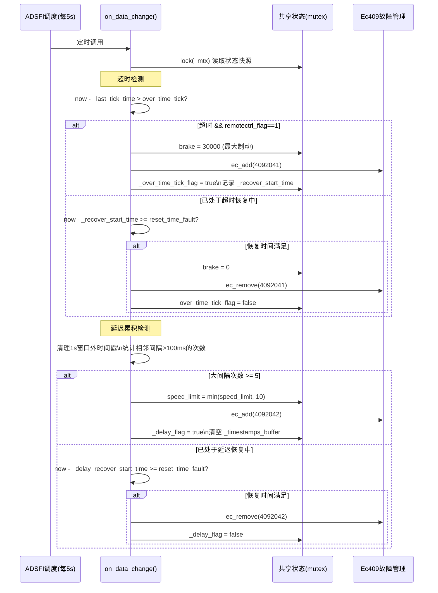
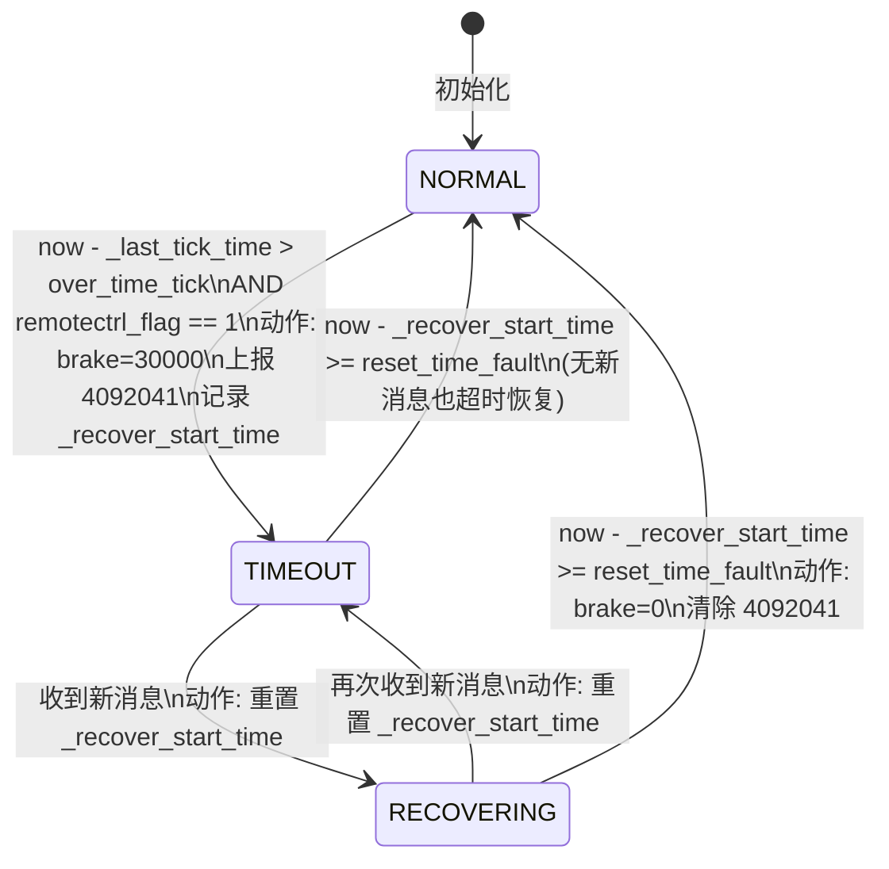
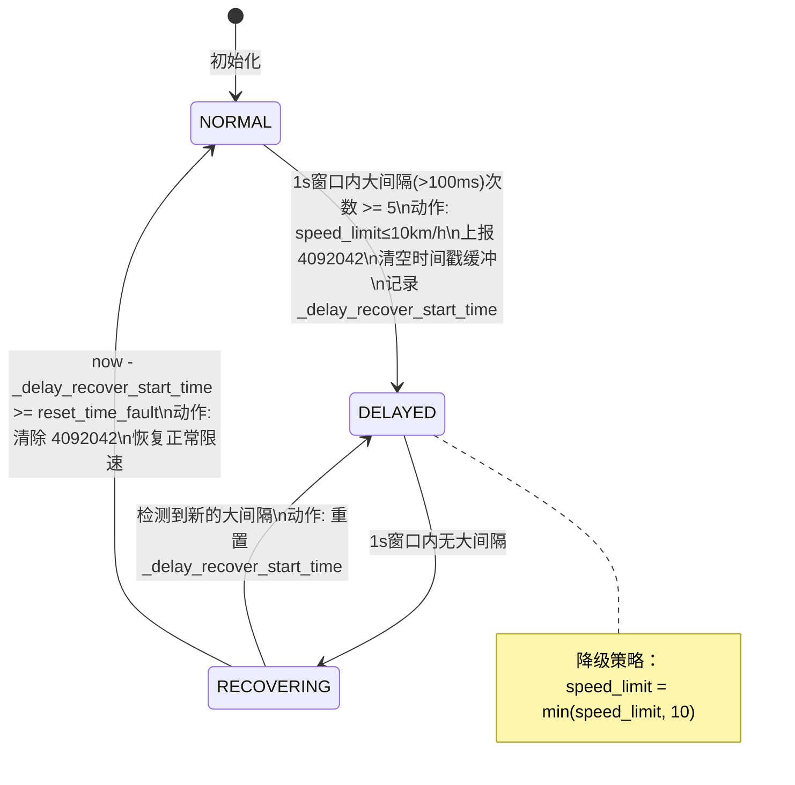

# xzmq_rc 模块设计文档

---

# 1. 文档信息

| 项目 | 内容 |
| :--- | :--- |
| **模块名称** | xzmq_rc |
| **模块编号** | HMI-XZMQ-002 |
| **所属系统 / 子系统** | HMI Model / 遥控接收子系统 |
| **模块类型** | 平台模块 |
| **负责人** |  |
| **参与人** |  |
| **当前状态** | 草稿 |
| **版本号** | V1.0 |
| **创建日期** | 2026-03-03 |
| **最近更新** | 2026-03-03 |

---

# 2. 模块概述

## 2.1 模块定位

xzmq_rc 是 HMI 层的 ZMQ 遥控接收模块，负责通过 ZMQ SUB 套接字订阅并接收远端管理器（Manager）发布的底盘控制协议消息，将其转换为应用层遥控数据结构，并提供超时检测、通信延迟监控及状态持久化能力。

- **在系统中的职责**：作为遥控指令的网络接收端，将底层 `manager2chassis_control` 二进制协议消息转换为 `AppRemoteControl` 应用数据，并向上层提供实时遥控状态及故障告警。
- **上游模块（输入来源）**：
  - Manager 端 ZMQ 发布者（`manager2chassis_control` 话题，TCP 网络）
- **下游模块（输出去向）**：
  - ADSFI 框架定时调度（`Process()` 输出 `AppRemoteControl`）
  - 底盘控制模块（消费 `AppRemoteControl`：转向、油门、制动、档位、急停等）
  - 平台故障管理（`Ec409` 故障码 4092041、4092042）
- **对外提供能力**：通过 ADSFI 框架 Process 接口，每 5 秒向下游输出最新遥控状态

## 2.2 设计目标

- **功能目标**：可靠接收并解析遥控指令；检测遥控使能状态；监控心跳超时和通信延迟；持久化关键状态以支持重启恢复。
- **性能目标**：ZMQ 轮询超时 ≤ 500ms；消息解析延迟 < 5ms；故障检测响应 ≤ 1 帧周期。
- **稳定性目标**：ZMQ 套接字断连后自动重建；超时和延迟故障自动降级（强制制动 / 限速）并在恢复后自动清除。
- **安全目标**：遥控超时时自动施加制动（brake=30000）；通信延迟时自动限速（≤10 km/h）；所有速度请求不超过配置的最大速度限制。
- **可维护性 / 可扩展性目标**：超时阈值、故障恢复时间、速度限制均通过配置文件调整，无需修改代码。

## 2.3 设计约束

- **硬件平台 / OS**：Linux
- **中间件 / 框架依赖**：ZeroMQ（zmq）、ADSFI 框架（ara::adsfi 消息体）、CustomStack 配置加载器
- **标准**：遵循 ap_adsfi 平台接口规范；底盘协议 `manager2chassis_control` 由平台统一定义
- **兼容性约束**：ZMQ PUB/SUB 协议须与 Manager 侧发布者版本匹配；`manager2chassis_control` 协议字段变更需同步更新

---

# 3. 需求与范围

## 3.1 功能需求（FR）

| 需求ID | 描述 | 优先级 |
| :--- | :--- | :--- |
| FR-01 | 通过 ZMQ SUB 套接字订阅并接收 `manager2chassis_control` 消息 | 高 |
| FR-02 | 将二进制协议消息解析并映射为 `AppRemoteControl` 应用数据结构 | 高 |
| FR-03 | 根据 `control_mode_req` 和控制量位置计算遥控使能标志（`remotectrl_flag`） | 高 |
| FR-04 | 根据 `control_mode_req` 计算安全辅助使能标志（`security_assist_enabled`） | 高 |
| FR-05 | 检测心跳超时（无消息超过阈值时间），超时后强制施加制动并上报故障码 4092041 | 高 |
| FR-06 | 检测通信延迟累积（1 秒内超过阈值次数的大间隔消息），触发后限速并上报故障码 4092042 | 高 |
| FR-07 | 超时/延迟故障条件消失后，经配置的恢复时间自动清除故障并恢复正常状态 | 高 |
| FR-08 | 将关键遥控状态（档位、使能标志、急停、限速等）持久化到磁盘 JSON 文件 | 中 |
| FR-09 | 启动时从持久化文件恢复遥控状态（10 秒内有效的状态） | 中 |
| FR-10 | ZMQ 套接字异常断连时自动重建并重新订阅 | 高 |
| FR-11 | 所有速度请求不超过配置的最大速度限制 | 高 |

## 3.2 非功能需求（NFR）

| 需求ID | 类型 | 指标 | 目标值 |
| :--- | :--- | :--- | :--- |
| NFR-01 | 性能 | ZMQ 消息接收轮询超时 | ≤ 500ms |
| NFR-02 | 性能 | 消息解析到状态更新延迟 | < 5ms |
| NFR-03 | 稳定性 | ZMQ 套接字故障自动恢复 | ≤ 1s 重连间隔 |
| NFR-04 | 安全性 | 超时故障响应速度 | ≤ over_time_tick 配置值 |
| NFR-05 | 安全性 | 持久化写入原子性 | 先写 .tmp 再 rename，防止文件损坏 |
| NFR-06 | 稳定性 | 持久化失败不影响主逻辑 | 持久化线程捕获所有异常并继续运行 |

## 3.3 范围界定（必须明确）

### 3.3.1 本模块必须实现：

- ZMQ SUB 套接字订阅与消息接收
- `manager2chassis_control` 协议到 `AppRemoteControl` 的字段映射
- 遥控使能状态判断逻辑
- 心跳超时检测与制动降级
- 通信延迟累积检测与限速降级
- 故障自动恢复逻辑
- 关键状态 JSON 持久化与恢复

### 3.3.2 本模块明确不做：

> （防止范围膨胀）

- 不执行底盘直接控制（输出数据由底盘模块消费）
- 不负责 Manager 侧的发布者实现
- 不进行路径规划或任务管理
- 不处理其他 ZMQ 话题（仅订阅 `manager2chassis_control`）

## 3.4 需求-设计-验证映射（评审必查）

| 需求ID | 对应设计章节 | 对应接口 | 验证方式 / 用例 |
| :--- | :--- | :--- | :--- |
| FR-01 | 5.3 主流程 | ZmqRC3::remote_loop() | TC-01 |
| FR-02 | 5.3 主流程 | ZmqRC3::parseRemoteControlData() | TC-02 |
| FR-03 | 8.2 状态机 | parseRemoteControlData() remotectrl_flag | TC-03 |
| FR-04 | 8.2 状态机 | parseRemoteControlData() security_assist_enabled | TC-04 |
| FR-05 | 8.2 状态机 | ZmqRC3::on_data_change() 超时检测 | TC-05 |
| FR-06 | 8.2 状态机 | ZmqRC3::on_data_change() 延迟检测 | TC-06 |
| FR-07 | 8.2 状态机 | 故障自动恢复逻辑 | TC-07 |
| FR-08 | 8.3 数据生命周期 | ZmqRC3::state_write() | TC-08 |
| FR-09 | 8.3 数据生命周期 | ZmqRC3::state_read() | TC-09 |
| FR-10 | 4.4 失败模式 | remote_loop() 套接字重建 | TC-10 |
| FR-11 | 5.3 主流程 | parseRemoteControlData() 速度限幅 | TC-11 |

---

# 4. 设计思路

## 4.1 方案概览

xzmq_rc 采用 **"SUB 接收 + 双故障检测 + 异步持久化"** 的整体架构：

- **ZmqRC3** 包含全部核心逻辑，分三个并发角色：持续轮询的接收线程（`remote_loop`）、条件变量驱动的持久化线程（`persistence_loop`）和 ADSFI 定时调度触发的状态检查（`on_data_change`）。
- **协议适配**：`parseRemoteControlData()` 将 `manager2chassis_control` 的原始值（0-200 分段映射）线性转换为应用层标准值（-32767~32767），并通过 `control_mode_req` 推导语义化的使能标志。
- **双故障检测**：超时检测（心跳间隔）和延迟检测（滑动窗口内的大间隔计数）互相独立，分别触发不同的安全降级策略。
- **ADSFI 适配层**：`AdsfiInterface` 按 5 秒周期调用 `on_data_change()` 执行故障检测，并通过 `values()` 取出最新状态提供给下游。

## 4.2 关键决策与权衡

- **PUB/SUB 而非 ROUTER/DEALER**：遥控指令为单向推送，不需要请求-应答确认，PUB/SUB 延迟更低，架构更简单。
- **超时检测在 `on_data_change()` 而非 `remote_loop()`**：将故障检测与接收逻辑解耦，方便 ADSFI 框架统一调度；代价是故障检测粒度受 ADSFI 调度周期（5 秒）限制，实际场景中需评估是否足够精细。
- **滑动窗口延迟检测**：通过维护 1 秒内的时间戳缓冲区统计"大间隔"次数，比简单阈值更能区分偶发抖动与持续性网络劣化。
- **分离持久化线程**：持久化写 JSON 有一定耗时，分离为独立线程避免阻塞接收主路径；仅在关键状态变化时触发（条件变量），减少不必要 I/O。

## 4.3 与现有系统的适配

- 遵循 ADSFI 框架 `BaseAdsfiInterface` 接口规范，通过 `AdsfiInterface` 适配层接入框架消息总线。
- 使用 `CustomStack` 统一读取配置，兼容平台配置管理体系。
- 使用 `Ec409` 统一故障码管理，兼容平台健康监控体系。

## 4.4 失败模式与降级

- **ZMQ 连接失败**：重置套接字为 nullptr，1 秒后重试；上报故障码 4092022。
- **消息解析失败**：记录错误日志（含帧内容十六进制），丢弃当前消息，继续轮询。
- **心跳超时**：强制将 `brake=30000`（最大制动力），上报故障码 4092041；待恢复时间满足后自动清除。
- **通信延迟**：将 `speed_limit` 限制为 10 km/h，上报故障码 4092042；待延迟消失且恢复时间满足后自动清除。
- **持久化失败**：捕获异常、记录日志，不重试，不影响主业务逻辑。

---

# 5. 架构与技术方案

## 5.1 模块内部架构

```mermaid
graph TB
    subgraph xzmq_rc["xzmq_rc 模块"]
        AI["AdsfiInterface\n(ADSFI适配层)\n每5秒调度"]
        ZRC3["ZmqRC3\n(核心处理器)"]

        subgraph Threads["线程模型"]
            T1["remote_loop()\n接收线程\n(ZMQ SUB 持续轮询)"]
            T2["persistence_loop()\n持久化线程\n(CV + 1s超时)"]
            T3["ADSFI调度线程\non_data_change()\n(每5秒)"]
        end

        subgraph State["共享状态 (mutex保护)"]
            RC["AppRemoteControl\n遥控状态"]
            TM["时序状态\n_last_tick_time\n_timestamps_buffer"]
            FF["故障标志\n_over_time_tick_flag\n_delay_flag"]
        end

        subgraph Persist["持久化存储 (磁盘)"]
            PJ["remote_control.json\n{gear, remotectrl_flag,\nestop_flag, speed_limit,\nsecurity_assist_enabled}"]
        end

        subgraph Fault["故障管理"]
            EC["Ec409\n4092001 配置失败\n4092022 连接失败\n4092041 超时故障\n4092042 延迟故障"]
        end
    end

    subgraph External["外部"]
        MGR["Manager ZMQ Publisher\ntcp://[endpoint]\ntopic: manager2chassis_control"]
        CHASSIS["底盘控制模块\n消费 AppRemoteControl"]
        FH["平台故障管理"]
    end

    MGR -->|ZMQ PUB/SUB| T1
    T1 -->|parseRemoteControlData\nlock _mtx| State
    T3 -->|超时/延迟检测\nlock _mtx| State
    T2 -->|snapshot read\nlock _mtx| State
    T2 -->|原子写| Persist
    Persist -->|启动恢复| ZRC3
    State -->|values()| AI
    AI -->|Process| CHASSIS
    EC -->|故障上报| FH
```

**线程 / 进程模型：**
- 主进程单实例，两个 `std::thread` 后台线程（`remote_loop`、`persistence_loop`，均为 detached）
- `remote_loop` 独占 ZMQ SUB 套接字（ZMQ 套接字不跨线程共享）
- ADSFI 调度线程每 5 秒调用 `on_data_change()` + `values()`

**同步模型：**
- `std::mutex _mtx`：保护 `_remote_control`、时序状态、故障标志的读写
- `std::mutex _mtx_persistence` + `std::condition_variable _cv_persistence`：持久化触发信号
- `std::atomic<bool> _data_changed`：无锁检测关键状态变化，触发持久化

## 5.2 关键技术选型

| 技术点 | 方案 | 选择原因 | 备选方案 |
| :--- | :--- | :--- | :--- |
| 消息订阅 | ZMQ PUB/SUB | 单向推送，低延迟，自动重连 | UDP 广播、gRPC 流 |
| 协议序列化 | 自定义二进制（protocol_common） | 平台统一底盘协议，带宽效率高 | Protobuf、JSON |
| 延迟检测 | 滑动时间窗口（1s / 5次） | 区分偶发抖动与持续劣化 | 简单均值/方差 |
| 状态持久化 | JSON + fsync + rename | 可读性好、原子安全 | SQLite、protobuf binary |
| 故障管理 | Ec409 故障码 | 平台统一健康监控接入 | 自定义 errno |
| 配置读取 | CustomStack | 平台统一配置中心 | 直读 yaml/json 文件 |

## 5.3 核心流程

### 消息接收与解析流程

```mermaid
sequenceDiagram
    participant PUB as Manager ZMQ Publisher
    participant LOOP as remote_loop()线程
    participant PARSE as parseRemoteControlData()
    participant STATE as 共享状态(mutex)
    participant PERSIST as persistence_loop()线程

    loop 持续轮询(500ms超时)
        PUB->>LOOP: ZMQ: [topic][binary payload]
        LOOP->>LOOP: zmq::poll(500ms)
        alt 无消息超时
            LOOP->>LOOP: 继续下次轮询
        else 收到消息
            LOOP->>LOOP: 校验帧数(需=2) + topic合法性
            alt 格式非法
                LOOP->>LOOP: 丢弃消息，记录错误
            else 格式合法
                LOOP->>PARSE: 传入 manager2chassis_control
                PARSE->>PARSE: 协议字段→AppRemoteControl映射
                PARSE->>PARSE: 计算 remotectrl_flag\n计算 security_assist_enabled\n速度限幅
                PARSE->>STATE: lock(_mtx) → 更新 _remote_control\n更新 _last_tick_time\n追加 _timestamps_buffer
                STATE-->>PERSIST: check_and_notify_change()\n检测关键字段变化
                alt 关键字段变化
                    PERSIST->>PERSIST: _data_changed=true\n_cv_persistence.notify_one()
                end
            end
        end
    end
```

### 故障检测与降级流程



### 启动 / 退出流程

```mermaid
flowchart TD
    A[AdsfiInterface::Init] --> B[设置调度间隔 5s\n初始化日志]
    B --> C[创建 ZmqRC3]
    C --> D[读取配置参数\nover_time_tick / reset_time_fault\nspeed_limit / endpoint / persist_path]
    D --> E{必选配置缺失?}
    E -- 是 --> F[设置 ERRORCODE_CONFIG\n抛出 runtime_error]
    E -- 否 --> G[state_read() 恢复持久化状态\n仅加载10s内有效快照]
    G --> H[启动 remote_loop 线程\nZMQ SUB 订阅]
    H --> I[启动 persistence_loop 线程]
    I --> J[模块就绪\n等待 ADSFI 调度]

    K[进程退出] --> L[线程为 detached\n随进程自然退出]
```

---

# 6. 界面设计

> 本模块为纯后端遥控接收模块，不含用户界面，跳过本节。

---

# 7. 接口设计（评审重点）

## 7.1 对外接口

### AdsfiInterface 输出接口（Process）

| 接口名 | 类型 | 输入 | 输出 | 频率 | 备注 |
| :--- | :--- | :--- | :--- | :--- | :--- |
| Process(name, AppRemoteControl) | Topic | ADSFI 调度名 | 当前遥控状态 | 5s周期 | 包含完整 AppRemoteControl 字段 |

### ZMQ 订阅接口（输入）

| 话题 | Socket类型 | Payload | 频率 | 备注 |
| :--- | :--- | :--- | :--- | :--- |
| manager2chassis_control | SUB | `manager2chassis_control` 二进制结构体 | 实时推送（~20-50Hz） | 帧0=topic，帧1=binary payload |

## 7.2 对内接口

- `ZmqRC3::on_data_change()`：ADSFI 调度调用，执行超时/延迟检测，更新 `_remote_control` 降级字段
- `ZmqRC3::values(AppRemoteControl&)`：ADSFI 调度调用，mutex 保护拷贝当前状态
- `ZmqRC3::check_and_notify_change()`：`remote_loop` 调用，检测关键字段变化并触发持久化

## 7.3 接口稳定性声明

- **稳定接口**：`AdsfiInterface::Process()` 签名；`AppRemoteControl` 字段语义；ZMQ 话题名 `manager2chassis_control` → 变更必须评审
- **非稳定接口**：`CriticalState` 结构（内部变化检测用，可扩展字段）；持久化 JSON 字段（内部格式）

## 7.4 接口行为契约（必须填写）

**AdsfiInterface::Process(name, msg)**
- 前置条件：`msg` 非空；ZmqRC3 已初始化
- 后置条件：`msg` 包含最新 `AppRemoteControl` 状态；header 已更新为当前时间戳；超时/延迟故障已检测并降级
- 非阻塞；不可重入（ADSFI 单线程调度）
- 最大执行时间：< 10ms（`on_data_change` 锁持有时间短）
- 失败语义：msg 为空时返回 -1；正常返回 0

**manager2chassis_control（ZMQ 输入）**
- 前置条件：Publisher 端已启动并发布消息
- 后置条件：`_remote_control` 状态更新；`_last_tick_time` 刷新；关键状态变化触发持久化
- 非阻塞（500ms 轮询）；接收线程独占 SUB 套接字
- 失败语义：解析失败时丢弃消息，记录错误日志，不影响已有状态

---

# 8. 数据设计

## 8.1 数据结构

**AppRemoteControl（应用层遥控数据，核心输出）**

| 字段 | 类型 | 范围/含义 |
| :--- | :--- | :--- |
| `steering_wheel` | double | [-32767, 32767]，左正右负 |
| `gear` | int | 0=P, 1=R, 2=N, 3=D |
| `brake` | double | [0, 32767]，超时时强制=30000 |
| `accelerator` | double | [0, 32767] |
| `remotectrl_flag` | int | 1=遥控使能, 0=未使能 |
| `estop_flag` | int | 1=急停, 0=正常 |
| `tick` | int | 心跳计数 [0, 99] |
| `speed_limit` | int | 速度限制 [5, 60] km/h，延迟时强制≤10 |
| `set_speed` | int | 遥控目标速度 |
| `security_assist_enabled` | int | 1=安全辅助使能, 0=未使能 |

**协议映射规则（`parseRemoteControlData()`）**

| 协议原始字段 | 原始范围 | 映射逻辑 | 应用层字段 |
| :--- | :--- | :--- | :--- |
| `throttle_braking` | [0, 200] | <100→brake=(100-val)/100×32767; >100→accel=(val-100)/100×32767 | `brake`, `accelerator` |
| `steering` | [0, 200] | <100→steer=(100-val)/100×32767(右); >100→steer=(val-100)/100×32767(左) | `steering_wheel` |
| `gear` | uint8_t | 直接映射 | `gear` |
| `heart` | [0, 255] | 对100取模 | `tick` |
| `speed_limit` | uint8_t km/h | 与配置 `_speed_limit` 取最小值 | `speed_limit` |
| `control_mode_req` | uint8_t | 见下方使能判断逻辑 | `remotectrl_flag`, `security_assist_enabled` |

**遥控使能判断逻辑：**

```
remotectrl_flag = 1 当且仅当：
  (control_mode_req == 4 [远程干预] OR control_mode_req == 2 [紧急规避])
  AND (throttle_braking != 100 OR steering != 100)  // 非中立位置

security_assist_enabled = 1 当且仅当：
  control_mode_req == 2 [紧急规避]
  AND (throttle_braking != 100 OR steering != 100)
```

## 8.2 状态机（如适用）

### 遥控超时状态机



### 通信延迟状态机



### ZMQ 套接字状态机

```mermaid
stateDiagram-v2
    [*] --> UNINITIALIZED

    UNINITIALIZED --> CONNECTING : remote_loop 尝试创建 SUB 套接字

    CONNECTING --> CONNECTED : createSubscriber() 成功\n等待 150ms 稳定\n清除 4092022

    CONNECTING --> UNINITIALIZED : 创建失败\n上报 4092022\n等待 1s 重试

    CONNECTED --> ERROR : zmq::error_t 或 std::exception\n上报 4092022\n重置套接字为 nullptr

    ERROR --> UNINITIALIZED : 隐式转换

    note right of CONNECTED
        500ms 轮询周期
        正常接收消息
    end note
```

## 8.3 数据生命周期

**AppRemoteControl 状态：**
- **创建**：ZmqRC3 构造时初始化默认值，`state_read()` 尝试从磁盘恢复
- **更新**：每次接收到 `manager2chassis_control` 消息时（`remote_loop`），及超时/延迟检测时（`on_data_change`）
- **消费**：ADSFI 调度每 5 秒通过 `values()` 拷贝输出
- **持久化**：关键字段（5 项）发生变化时触发写盘；1 秒心跳写盘兜底

**持久化策略：**
- 写入路径：`[persistence_path]/remote_control.json`（→先写 `.tmp` 再 fsync + rename）
- 恢复策略：启动时检查文件时间戳，10 秒内有效则恢复，否则忽略
- 持久化字段：`gear`、`remotectrl_flag`、`estop_flag`、`speed_limit`、`security_assist_enabled`（不包含实时控制量）

---

# 9. 异常与边界处理（评审必查）

| 异常场景 | 检测方式 | 处理策略 | 是否可恢复 | 上报方式 |
| :--- | :--- | :--- | :--- | :--- |
| 必选配置项缺失 | Init 阶段 key 读取失败 | 上报 4092001，抛出 runtime_error 中止初始化 | 否（需修配置重启） | Ec409 故障码 |
| ZMQ SUB 套接字创建失败 | createSubscriber() 异常 | 上报 4092022，等待 1s 后重试 | 是（自动重连） | Ec409 + 日志 |
| ZMQ 消息接收异常 | zmq::error_t 捕获 | 上报 4092022，重置套接字，重建连接 | 是 | Ec409 + 日志 |
| 消息帧数不合法（≠2帧） | 帧计数校验 | 丢弃消息，记录错误日志 | 是 | 日志 |
| topic 包含非打印字符 | ASCII 范围校验 | 丢弃消息，记录错误日志 | 是 | 日志 |
| 消息反序列化失败 | msg_parse<>() 异常 | 捕获 std::exception，丢弃消息，记录帧内容十六进制 | 是 | 日志 |
| 心跳超时 | now - _last_tick_time > over_time_tick | brake=30000，上报 4092041；reset_time_fault 后自动恢复 | 是（自动） | Ec409 故障码 |
| 通信延迟累积 | 1s窗口大间隔次数≥5 | speed_limit≤10，上报 4092042；reset_time_fault 后自动恢复 | 是（自动） | Ec409 故障码 |
| 持久化写入失败 | 文件 I/O 异常 | 捕获异常，记录日志，.tmp 文件删除，不重试 | 是（下次触发重写） | 日志 |
| 启动恢复文件超时（>10s） | 时间戳校验 | 丢弃过期持久化数据，以默认值初始化 | 是 | 日志 |
| 速度超过配置上限 | 与 _speed_limit 比较 | 取最小值（`min(speed_limit, _speed_limit)`） | 是 | 无 |

---

# 10. 性能与资源预算（必须可验收）

## 10.1 性能指标

| 场景 | 指标 | 目标值 | 测试方法 |
| :--- | :--- | :--- | :--- |
| ZMQ 消息接收到状态更新 | 端到端延迟 | < 5ms | 消息时间戳对比 |
| 超时检测响应时间 | 从超时到制动指令输出 | ≤ over_time_tick + 5s调度周期 | 注入停发场景 |
| 延迟故障触发时间 | 从延迟出现到限速生效 | ≤ 1s（滑动窗口） + 5s调度 | 注入延迟场景 |
| 持久化写入单次耗时 | JSON + fsync + rename | < 100ms | 文件写入计时 |
| 锁持有时间（_mtx） | parseRemoteControlData 内 | < 5ms | perf 锁分析 |

## 10.2 资源预算

| 资源 | 常态 | 峰值 | 上限约束 |
| :--- | :--- | :--- | :--- |
| CPU（接收线程） | < 1% | < 3%（高频消息） | < 5% |
| 内存 | ~3MB（含ZMQ缓冲） | ~5MB | < 10MB |
| 磁盘（持久化文件） | ~1KB（1个JSON） | ~2KB | < 10MB |
| 线程数 | 2（background detached） | 2 | 固定 |
| ZMQ 时间戳缓冲（_timestamps_buffer） | ≤ 消息频率 × 1s 条数 | ~50条（50Hz × 1s） | < 1000条 |

---

# 11. 构建与部署

## 11.1 环境依赖

| 依赖项 | 版本要求 | 说明 |
| :--- | :--- | :--- |
| 操作系统 | Linux（Ubuntu 20.04+） | POSIX 文件系统（fsync/rename） |
| 编译器 | GCC 9+ / Clang 10+ | C++14 或更高（std::thread、atomic） |
| libzmq | 4.x | ZMQ 通信库 |
| libpthread | 系统 | POSIX 线程 |
| fmt | 7+ | 字符串格式化 |
| glog | 0.5+ | 日志（通过 ApLog） |
| yaml-cpp | 0.7+ | 配置解析（通过 CustomStack） |
| dl | 系统 | 动态链接 |

## 11.2 构建步骤

### 构建命令

```bash
# 通过平台统一构建系统编译
cmake -B build -DMODULE=xzmq_rc
cmake --build build
```

### 构建产物

- 产物：集成到 HMI Model 共享库或可执行文件
- model.cmake 中的 `MODULE1_SOURCES`、`MODULE1_LIBS` 由平台构建框架消费

## 11.3 配置项

| 配置项 | 说明 | 默认值 | 是否必须 | 来源 |
| :--- | :--- | :--- | :--- | :--- |
| `hmi/zmq/remote_control_endpoint` | ZMQ 订阅端点（如 `tcp://192.168.1.100:5050`） | 无 | 是 | CustomStack |
| `hmi/zmq/persistence_path` | 持久化文件目录 | 无 | 是 | CustomStack |
| `hmi/common/default/speed_limit` | 最大允许速度（km/h），遥控速度上限 | 无 | 是 | CustomStack |
| `hmi/common/default/over_time_tick` | 心跳超时阈值（ms），超过后触发超时故障 | 无 | 是 | CustomStack |
| `hmi/common/default/reset_time_fault` | 故障恢复时间（ms），超时/延迟故障消失后需持续正常此时长才清除 | 无 | 是 | CustomStack |

> 所有可配置项必须在此列出，禁止在代码中散落硬编码。
> 注意：延迟检测参数（MAX_COUNT=5、TIME_WINDOW=1000ms、INTERVAL_THRESHOLD=100ms）当前为代码内硬编码常量，如需可配置化应作为 L2 变更提交评审。

## 11.4 部署结构与启动

### 部署目录结构

```text
/
├── config/
│   └── （CustomStack 统一配置，含 hmi/zmq/* 和 hmi/common/default/* 键值）
└── persistence/             # 持久化文件目录（由 persistence_path 配置）
    └── remote_control.json  # 遥控关键状态快照
```

### 启动 / 停止命令

- **启动**：随 ADSFI 框架进程启动，由框架调用 `AdsfiInterface::Init()` 完成初始化，后台线程自动启动
- **停止**：随框架进程停止，后台线程均为 detached，随进程退出
- **进程管理**：由平台进程管理器（systemd / 自定义守护进程）负责

## 11.5 健康检查与启动验证

- **启动成功判断**：Init 完成后 Ec409 中无 `ERRORCODE_CONFIG` 故障码；日志中出现 ZMQ 连接成功信息（清除 4092022）
- **健康检查**：通过 Ec409 故障码查询，无 4092041 / 4092042 表示遥控链路正常
- **启动超时**：Init 无阻塞操作，ZMQ 连接在 `remote_loop` 线程中异步建立

## 11.6 升级与回滚

- **升级步骤**：替换共享库/可执行文件，重启进程；持久化 JSON 格式向前兼容（字段增量添加）
- **回滚步骤**：替换回旧版文件，重启进程；如 JSON 格式不兼容则删除 `remote_control.json`
- **版本兼容性**：ZMQ 话题名和 `manager2chassis_control` 协议结构不变则协议层兼容

---

# 12. 可测试性与验证

## 12.1 单元测试

- **覆盖范围**：
  - `parseRemoteControlData()` 的全协议字段映射（包括边界值 0、100、200）
  - `remotectrl_flag` / `security_assist_enabled` 的所有 `control_mode_req` 组合
  - 超时状态机的触发、恢复中重置、恢复完成路径
  - 延迟状态机的触发（恰好 5 次）、未触发（4 次）、恢复路径
  - 速度限幅逻辑（遥控速度 > 配置上限时的裁剪）
  - 持久化 JSON 的序列化/反序列化正确性
  - 持久化时间戳过期判断（10 秒边界）
- **Mock / Stub 策略**：
  - MockZmqConstruct 替代真实 ZMQ 套接字，注入消息数据
  - MockCustomStack 提供配置注入
  - 时间戳注入（替代 `std::chrono::now()`）便于超时/延迟测试

## 12.2 集成测试

- **上下游联调点**：
  - Manager ZMQ Publisher 发布消息 → 模块接收 → `AppRemoteControl` 输出验证
  - Manager 停发消息 → 超时故障触发 → brake=30000 验证
  - Manager 制造延迟 → 延迟故障触发 → speed_limit≤10 验证
  - 持久化文件内容验证 → 重启后恢复状态一致性验证

## 12.3 可观测性

- **日志（关键点）**：
  - ApInfo：ZMQ 连接成功、故障恢复、状态持久化写入成功
  - ApError：配置读取失败、ZMQ 连接失败（含端点）、消息解析失败（含帧十六进制）、超时故障触发/恢复、延迟故障触发/恢复
- **监控指标**：Ec409 故障码集合（4092022 / 4092041 / 4092042）
- **Trace / Debug 接口**：`AppRemoteControl.tick` 可用于验证消息连续性；`_timestamps_buffer` 大小反映消息频率

---

# 13. 测试用例清单

| ID | 对应需求 | 测试项目 | 测试步骤 | 预期结果 | 测试结果 |
| :--- | :--- | :--- | :--- | :--- | :--- |
| TC-01 | FR-01 | ZMQ 消息订阅接收 | 启动模块，Manager 发布 manager2chassis_control 消息 | 消息被正确接收，_last_tick_time 更新 | |
| TC-02 | FR-02 | 协议字段映射 | 发送 throttle_braking=150, steering=80 | accelerator=(50/100)×32767, steering=(20/100)×32767（右） | |
| TC-03 | FR-03 | 遥控使能标志计算 | 发送 control_mode_req=4, steering=120 | remotectrl_flag=1 | |
| TC-03b | FR-03 | 遥控使能标志-中立位置 | 发送 control_mode_req=4, steering=100, throttle=100 | remotectrl_flag=0 | |
| TC-04 | FR-04 | 安全辅助使能计算 | 发送 control_mode_req=2, throttle_braking=150 | security_assist_enabled=1 | |
| TC-05 | FR-05 | 超时故障触发 | 停止 Manager 发布消息，等待 over_time_tick 毫秒后调用 on_data_change | brake=30000, Ec409 含 4092041 | |
| TC-06 | FR-06 | 延迟故障触发 | 1 秒内发送 5 次间隔>100ms 的消息，调用 on_data_change | speed_limit≤10, Ec409 含 4092042 | |
| TC-07 | FR-07 | 超时故障自动恢复 | 触发超时后，恢复正常发送并等待 reset_time_fault | brake=0, 4092041 清除 | |
| TC-08 | FR-08 | 持久化写入 | 更改 remotectrl_flag，等待持久化线程写盘 | remote_control.json 内容正确，含新时间戳 | |
| TC-09 | FR-09 | 持久化恢复 | 写入有效持久化文件后重启模块 | 状态与文件一致；超时 10s 的文件被丢弃 | |
| TC-10 | FR-10 | ZMQ 自动重连 | 模块运行中断开 ZMQ 连接 | 1s 内自动重连，4092022 上报后清除 | |
| TC-11 | FR-11 | 速度限幅 | 发送 speed_limit=80，配置 _speed_limit=60 | 输出 speed_limit=60 | |

---

# 14. 风险分析（设计评审核心）

| 风险 | 影响 | 可能性 | 应对措施 |
| :--- | :--- | :--- | :--- |
| 超时检测粒度受 ADSFI 5s 调度周期影响，无法精确到毫秒 | 超时响应滞后最多 5s | 中 | 评估是否将超时检测移入 remote_loop 线程（需 L2 变更） |
| 延迟检测参数（MAX_COUNT/TIME_WINDOW/INTERVAL_THRESHOLD）硬编码，不同网络环境适配困难 | 误报或漏报延迟故障 | 中 | 将三个参数提升为 CustomStack 配置项（L2 变更） |
| _timestamps_buffer 在高频消息场景下可能无限增长 | 内存异常增长 | 低 | 滑动窗口清理已移除 1s 外时间戳，但建议增加上限保护（如最多 200 条） |
| ZMQ PUB/SUB 无消息确认，网络丢包不可感知 | 控制命令静默丢失 | 中 | 超时检测作为兜底；如需零丢包可考虑升级为 PUSH/PULL + 心跳确认（L3 变更） |
| persistent JSON 10s 过期阈值固定，快速重启（<10s）可能恢复到过时状态 | 遥控状态短暂不一致 | 低 | 当前设计可接受；如需更严格可加版本号或序列号校验 |
| 故障恢复中新消息会重置 _recover_start_time，若消息持续不稳定则永不恢复 | 超时/延迟故障永久存在 | 低 | 属于设计预期（不稳定时不应清除故障）；运营层面关注持续报警 |

---

# 15. 设计评审

## 15.1 评审 Checklist

- [ ] 需求是否完整覆盖
- [ ] 接口是否清晰稳定
- [ ] 界面设计是否完整（本模块无 UI，跳过）
- [ ] 异常路径是否完整
- [ ] 性能 / 资源是否有上限
- [ ] 构建与部署步骤是否完整可执行
- [ ] 是否存在过度设计
- [ ] 测试用例是否覆盖所有功能需求和非功能需求

## 15.2 评审记录

| 日期 | 评审人 | 问题 | 结论 | 备注 |
| :--- | :--- | :--- | :--- | :--- |
| | | | | |

---

# 16. 变更管理（重点）

## 16.1 变更原则

- 不允许口头变更
- 接口 / 行为变更必须记录

## 16.2 变更分级

| 级别 | 示例 | 是否需要评审 |
| :--- | :--- | :--- |
| L1 | 注释 / 日志 / 日志级别调整 | 否 |
| L2 | 延迟检测参数提升为配置项；新增持久化字段；调整故障恢复逻辑 | 是 |
| L3 | ZMQ 话题名变更；AppRemoteControl 字段语义变更；超时检测移入 remote_loop | 是（系统级） |

## 16.3 变更记录

| 版本 | 变更内容 | 影响分析 | 评审人 |
| :--- | :--- | :--- | :--- |
| V1.0 | 初始设计文档 | 无 | |

---

# 17. 交付与冻结

## 17.1 设计冻结条件

- [ ] 界面设计已评审通过（本模块无 UI）
- [ ] 所有接口有对应测试用例
- [ ] 所有 NFR 有验证方案
- [ ] 异常路径已覆盖
- [ ] 构建与部署文档可执行验证通过
- [ ] 变更影响分析完成

## 17.2 设计与交付物映射

- 设计文档 ↔ `src/ZmqRC3.cpp` / `adsfi_interface/adsfi_interface.cpp`
- 接口文档 ↔ `src/ZmqRC3.hpp` / `adsfi_interface/adsfi_interface.h`
- 测试用例 ↔ 集成测试套件（待建立）

---

# 18. 附录

## 术语表

| 术语 | 说明 |
| :--- | :--- |
| SUB | ZMQ 订阅套接字类型，被动接收 PUB 发布的消息 |
| PUB | ZMQ 发布套接字类型，主动向所有订阅者推送消息 |
| AppRemoteControl | ADSFI 框架定义的应用层遥控数据消息体 |
| manager2chassis_control | 平台定义的 Manager→底盘控制二进制协议消息体 |
| Ec409 | 平台故障码管理类，负责故障码上报与清除 |
| CustomStack | 平台统一配置读取接口 |
| control_mode_req | 控制模式请求字段：0=待机, 1=纯遥控, 2=紧急规避, 3=自主, 4=遥控干预, 5=静默观察 |
| over_time_tick | 心跳超时阈值（ms），超过此时间无消息则触发超时故障 |
| reset_time_fault | 故障恢复持续时间（ms），故障条件消失后需保持正常此时长才清除故障码 |
| ADSFI | Advanced Driver Support Functions Interface，平台消息调度框架 |
| fsync | Linux 系统调用，强制将文件缓冲数据刷入磁盘，确保持久化安全 |

## 参考文档

- ADSFI 框架接口规范
- ZeroMQ 官方文档（PUB/SUB 模式）
- ap_adsfi 平台 Ec409 故障码规范
- `manager2chassis_control` 协议字段定义文档
- `AppRemoteControl` 消息体定义（`common/gsds_adapter/`）

## 历史版本记录

| 版本 | 日期 | 说明 |
| :--- | :--- | :--- |
| V1.0 | 2026-03-03 | 初始版本，基于代码逆向分析生成 |
