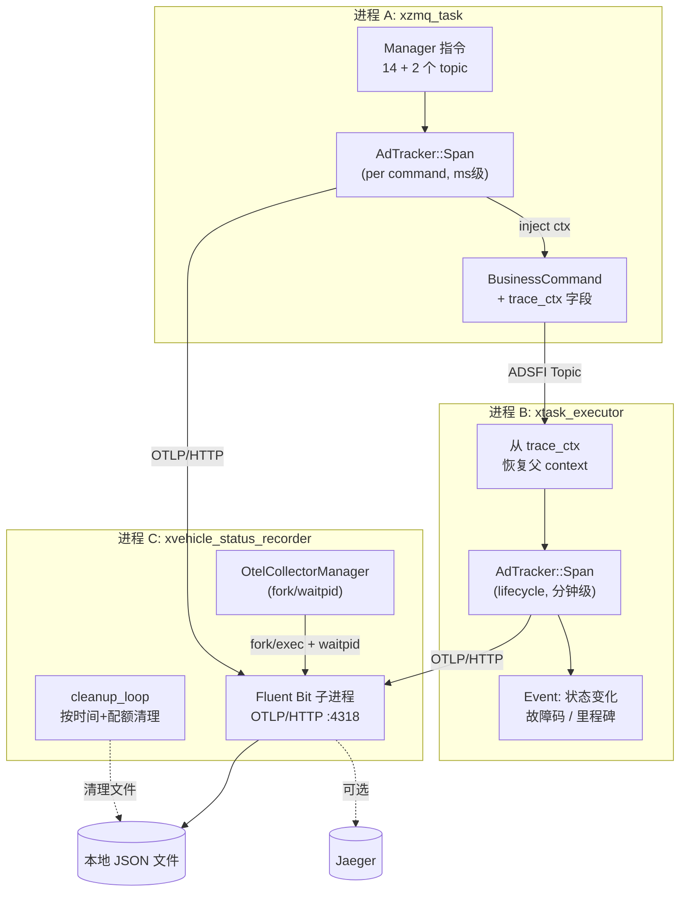
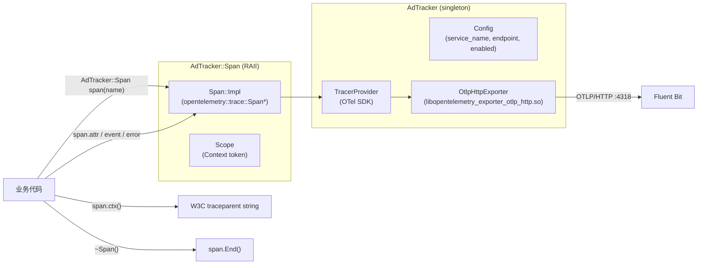
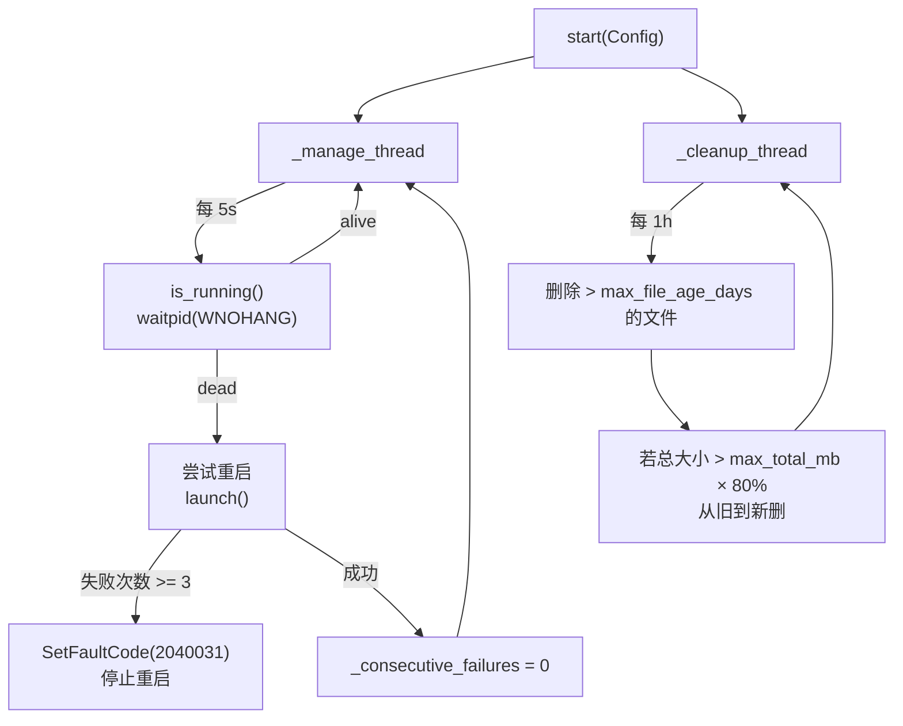
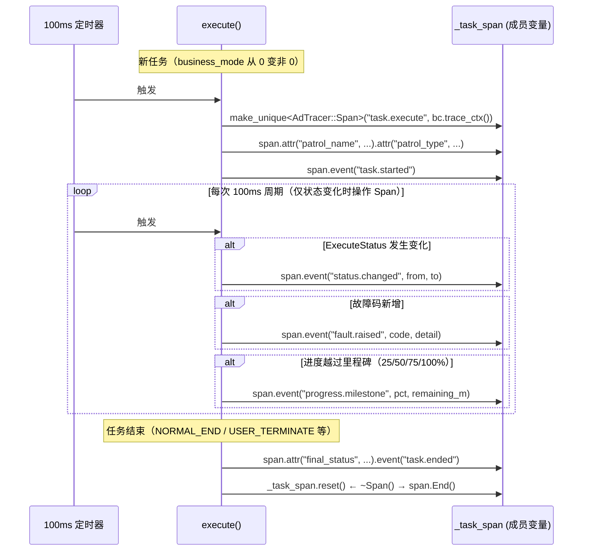
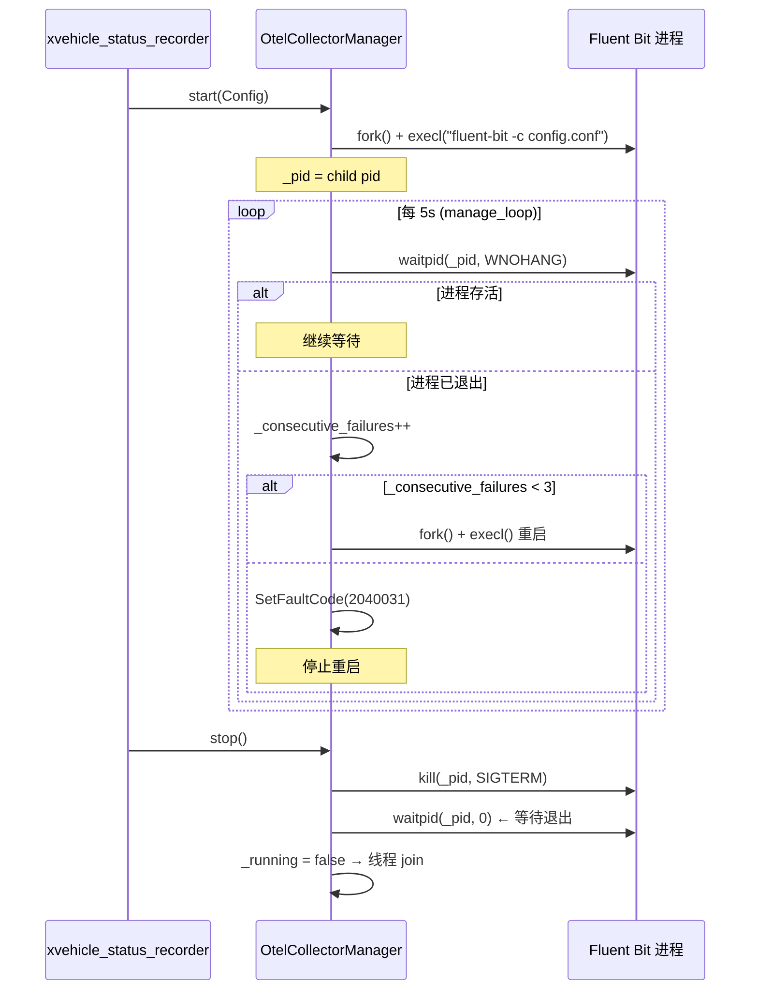

# OTel 分布式链路追踪系统设计

---

# 1. 文档信息

| 项目 | 内容 |
| :--- | :--- |
| **模块名称** | OTel 分布式链路追踪系统（跨模块特性） |
| **模块编号** | INFRA-TRACE-001 |
| **所属系统 / 子系统** | 基础设施 / 可观测性 |
| **模块类型** | 公共模块（xad_tracker）+ 各模块集成 |
| **负责人** |  |
| **参与人** |  |
| **当前状态** | 草稿 |
| **版本号** | V1.0 |
| **创建日期** | 2026-03-04 |
| **最近更新** | 2026-03-04 |

---

# 2. 模块概述

## 2.1 模块定位

本文档描述跨进程分布式链路追踪（Distributed Tracing）特性的总体设计，覆盖以下四个组成部分：

| 组件 | 角色 | 位置 |
| :--- | :--- | :--- |
| **xad_tracker** | OTel C++ SDK 封装库，提供 `AdTracker::Span` RAII 接口 | `common/xad_tracker/` |
| **xzmq_task 集成** | 每条 Manager 指令生成 Span，将 trace_ctx 注入 BusinessCommand | `meta_model/hmi_model/xzmq_task/` |
| **xtask_executor 集成** | 从 BusinessCommand 恢复父 context，创建任务 lifecycle Span | `meta_model/task_schedule_model/xtask_executor/` |
| **OtelCollectorManager** | 管理 Fluent Bit 子进程、定时清理导出文件 | `meta_model/system_model/xvehicle_status_recorder/` |

**数据流向**：

```
Manager 客户端
    │ ZMQ 指令
    ▼
xzmq_task ──[BusinessCommand.trace_ctx]──▶ xtask_executor
    │ OTLP/HTTP :4318                          │ OTLP/HTTP :4318
    └──────────────┬────────────────────────────┘
                   ▼
             Fluent Bit（子进程，xvehicle_status_recorder 管理）
                   │
         ┌─────────┴─────────┐
         ▼                   ▼
   本地 JSON 文件         Jaeger（可选，在线查看）
   /opt/otel/traces/
```

**目标受众**：应用工程师（快速定位跨进程延迟瓶颈）、售后工程师（离线分析 trace 文件）、研发工程师（异常排查）。

- **上游**：无（基础设施）
- **下游**：Fluent Bit → 本地文件 / Jaeger
- **对外提供能力**：`AdTracker::Span` RAII 接口（供其它节点快速集成）

## 2.2 设计目标

- **功能目标**：对 xzmq_task → xtask_executor 链路实现端到端 Span 追踪，并向其它节点提供可复用的极简封装接口。
- **性能目标**：Span 构造/析构对业务主线程延迟影响 < 1ms；disabled 时接口退化为 no-op，零开销；Fluent Bit 内存占用 < 50 MB。
- **稳定性目标**：Fluent Bit 进程异常退出时自动重启（连续 3 次失败后停止重启并上报故障码，不无限循环）；tracing 不可用时业务逻辑不受影响。
- **安全目标**：Span 仅写入非敏感的结构化属性（命令类型、响应码、状态码），不采集 ZMQ 消息体原始内容。
- **可维护性**：其它节点接入只需引入 `xad_tracker`，3–5 行代码完成埋点；接口变化不影响业务逻辑。

## 2.3 设计约束

- **OTel SDK 版本**：`third_party_arm/opentelemetry/` 中已有 opentelemetry-cpp 1.14.2，仅有 `otlp_http` exporter（无 gRPC）。
- **Collector**：使用 Fluent Bit（C 语言，ARM64 预编译，无 Go 依赖），不使用 otelcol。
- **传输协议**：OTLP/HTTP（SDK → Fluent Bit），端口 `127.0.0.1:4318`。
- **部署约束**：嵌入式 ARM Linux，无持续网络连接假设；Jaeger 为可选，仅在有网络时使用。
- **配置约束**：Fluent Bit 二进制路径和配置文件路径通过 `CustomStack::GetProjectConfigValue()` 读取；Jaeger 地址写入 Fluent Bit 配置文件中。

---

# 3. 需求与范围

## 3.1 功能需求（FR）

| 需求ID | 描述 | 优先级 |
| :--- | :--- | :--- |
| FR-01 | xad_tracker 封装 OTel C++ SDK，提供 `AdTracker::Span` RAII 接口，支持 attr / event / error / ctx 操作 | P0 |
| FR-02 | xad_tracker 支持 W3C TraceContext（traceparent 格式）序列化与反序列化，用于跨进程父子 Span 关联 | P0 |
| FR-03 | xad_tracker `enabled=false` 时所有接口退化为 no-op，不产生任何 OTel 对象 | P1 |
| FR-04 | xzmq_task 对每条 Manager 指令（14 个 manager2auto 话题 + 2 个 manager2loc 话题）各创建一个 Span | P0 |
| FR-05 | xzmq_task 将活跃 Span 的 trace_ctx（W3C traceparent）注入 `BusinessCommand.trace_ctx` 字段 | P0 |
| FR-06 | xtask_executor 在新任务开始时，从 `BusinessCommand.trace_ctx` 恢复父 context，创建 task lifecycle Span | P0 |
| FR-07 | xtask_executor lifecycle Span 采用事件驱动模式：仅在状态变化（ExecuteStatus 转换）、故障码出现、进度里程碑（25/50/75/100%）时添加 Event，不按 100ms 周期记录 | P0 |
| FR-08 | Fluent Bit 作为本地 OTLP Collector，监听 `127.0.0.1:4318`（HTTP），接收来自两个进程的 trace 数据 | P0 |
| FR-09 | Fluent Bit 将 trace 数据输出到本地 JSON 文件（目录可配置）；可选同时转发到 Jaeger OTLP 端点（地址写在 Fluent Bit 配置文件中） | P0 |
| FR-10 | xvehicle_status_recorder 通过 `OtelCollectorManager` 类管理 Fluent Bit 子进程（fork/exec 启动、waitpid 检测、异常重启） | P0 |
| FR-11 | Fluent Bit 连续启动失败达 3 次后，上报故障码 `2040031`，停止重启；后续不再尝试（除非进程重启） | P0 |
| FR-12 | xvehicle_status_recorder 定期（每 1h）清理 OTel 导出目录：先删超过 `max_file_age_days` 天的文件，再按总大小配额从旧到新删 | P1 |
| FR-13 | Fluent Bit 二进制路径和配置文件路径通过 `CustomStack::GetProjectConfigValue()` 从 `system/recorder/otel/` 命名空间读取 | P0 |

## 3.2 非功能需求（NFR）

| 需求ID | 类型 | 指标 | 目标值 |
| :--- | :--- | :--- | :--- |
| NFR-01 | 性能 | `AdTracker::Span` 构造 + 析构对业务主线程的延迟增量 | < 1 ms（p99） |
| NFR-02 | 性能 | Fluent Bit 内存占用（稳态） | < 50 MB |
| NFR-03 | 稳定性 | Tracing 不可用时（Fluent Bit 未运行）业务逻辑受影响 | 不受影响（SDK 异步发送，不阻塞） |
| NFR-04 | 稳定性 | `enabled=false` 时 AdTracker 性能开销 | 零开销（no-op） |
| NFR-05 | 可维护性 | 其它节点新增 OTel 接入所需代码行数 | ≤ 5 行（`AdTracker::init` + 若干 `AdTracer::Span`） |
| NFR-06 | 资源 | OTel 导出文件磁盘占用上限 | 通过 `max_total_mb` 配置控制 |

## 3.3 范围界定

### 3.3.1 本系统必须实现

- xad_tracker 封装库（OTel C++ SDK + OTLP HTTP exporter）
- xzmq_task 和 xtask_executor 的 Span 埋点
- BusinessCommand proto 新增 `trace_ctx` 字段（跨进程传播）
- OtelCollectorManager（Fluent Bit 进程管理 + 文件清理）
- Fluent Bit 配置文件模板（本地文件输出 + 可选 Jaeger）

### 3.3.2 本系统明确不做

> （防止范围膨胀）

- 不采集 ZMQ 消息体原文内容（隐私和性能考虑）
- 不实现 Metrics（仅做 Tracing）
- 不实现 Logs（使用现有 ap_log 体系）
- 不实现采样（sampling）策略（全量采集，依赖磁盘配额管理数据量）
- 不部署远端 Jaeger 服务（Jaeger 由运维团队或调试人员按需部署）

## 3.4 需求-设计-验证映射

| 需求ID | 对应设计章节 | 对应接口 | 验证方式 |
| :--- | :--- | :--- | :--- |
| FR-01 | 5.2, 7.1 | `AdTracker::Span` | TC-01 |
| FR-02 | 5.2, 8.1 | `Span::ctx()` / `Span(name, parent_ctx)` | TC-02 |
| FR-03 | 5.2 | `AdTracker::Config::enabled` | TC-03 |
| FR-04 | 5.3（xzmq_task 流程）| `handleXxx()` 内 `AdTracer::Span` | TC-04 |
| FR-05 | 5.3, 8.1 | `BusinessCommand.trace_ctx` | TC-05 |
| FR-06 | 5.3（xtask_executor 流程）| `AdsfiInterface::_task_span` | TC-06 |
| FR-07 | 5.3, 8.2 | 事件驱动 Event 逻辑 | TC-07 |
| FR-08 | 5.4 | Fluent Bit opentelemetry input | TC-08 |
| FR-09 | 5.4, 11.4 | Fluent Bit file/opentelemetry output | TC-09 |
| FR-10 | 5.4, 7.3 | `OtelCollectorManager` | TC-10 |
| FR-11 | 5.4, 9 | 连续失败计数 + 故障码 `2040031` | TC-11 |
| FR-12 | 5.4 | `OtelCollectorManager::cleanup_loop()` | TC-12 |
| FR-13 | 11.3 | `CustomStack::GetProjectConfigValue()` | TC-13 |

---

# 4. 设计思路

## 4.1 方案概览



## 4.2 关键决策与权衡

| 决策点 | 选择 | 理由 | 放弃的方案 |
| :--- | :--- | :--- | :--- |
| Collector 选型 | Fluent Bit（C 语言） | 无 Go 依赖，ARM64 二进制 ~4 MB，资源占用低 | otelcol（需 Go 运行时，镜像大）|
| 传输协议 | OTLP/HTTP（`libopentelemetry_exporter_otlp_http.so`）| SDK 已有的唯一 exporter | OTLP/gRPC（SDK 未提供）|
| 跨进程传播 | W3C traceparent 写入 `BusinessCommand.trace_ctx` 字段 | 走已有消息通道，无额外基础设施 | 独立 sidecar 注入（过重）|
| xtask_executor Span 粒度 | 一个任务一个 lifecycle Span + 若干 Event | 一个任务可能持续数分钟，细粒度按需 Event 更有价值 | 每 100ms 创建子 Span（过噪）|
| Fluent Bit 重启策略 | 连续失败 3 次 → 上报故障码，停止重启 | 避免持续性故障导致日志刷屏；故障码通知人工介入 | 无限重试 + 退避（过度设计）|
| Jaeger 地址管理 | 写在 Fluent Bit 配置文件中 | 运维按需编辑，不经过 CustomStack | CustomStack 动态配置（频繁变更 Jaeger 地址场景不存在）|

## 4.3 与现有系统的适配

- **SDK 复用**：使用已有的 `third_party_arm/opentelemetry/`（v1.14.2），不引入新的第三方版本。
- **日志并存**：OTel Tracing 不替代 ap_log，两者并行工作；Span 属性和日志内容互相补充。
- **故障码体系**：`OtelCollectorManager` 的故障码（`2040031`）纳入 xvehicle_status_recorder 的 EC204 体系，与现有 30 个故障码连续编号。
- **配置体系**：所有 OtelCollectorManager 配置项放在 `system/recorder/otel/` 命名空间，与现有 `system/recorder/status/` 和 `system/recorder/trigger/` 隔离。

## 4.4 失败模式与降级

| 失败场景 | 业务影响 | 降级策略 |
| :--- | :--- | :--- |
| Fluent Bit 未运行 | 无（SDK 后台异步发送，超时后静默丢弃） | OTel 数据不落地，业务完全不受影响 |
| Fluent Bit 连续启动失败 | 无 | 上报故障码 `2040031`，停止重启；等待人工介入 |
| AdTracker::init 失败 | 无 | `enabled=false`，所有 Span 接口为 no-op |
| OTel 导出目录磁盘满 | 可能丢失最新 trace 数据 | cleanup_loop 按配额清理；Fluent Bit 自身有缓冲上限 |
| Jaeger 不可达 | 本地文件正常记录，Jaeger 数据缺失 | Fluent Bit 静默重试，不影响文件输出 |

---

# 5. 架构与技术方案

## 5.1 模块内部架构

### xad_tracker 内部



**线程模型**：OTel SDK 内部有 BatchSpanProcessor 使用后台线程异步导出，业务线程不等待网络 I/O。

### OtelCollectorManager 内部



## 5.2 关键技术选型

| 技术点 | 方案 | 选择原因 | 备选方案 |
| :--- | :--- | :--- | :--- |
| OTel C++ SDK | opentelemetry-cpp 1.14.2（已有） | 标准实现，已预置在 third_party_arm | 自研轻量 tracer（需实现 W3C 上下文传播、span ID 生成） |
| Span 导出 | OTLP/HTTP exporter（`libopentelemetry_exporter_otlp_http.so`） | 项目中唯一可用的 exporter | OTLP/gRPC（SDK 未提供）|
| Collector | Fluent Bit 2.x（ARM64 预编译）| C 语言，无 Go 依赖，轻量（~4 MB binary）| otelcol（Go 依赖，较重）|
| 子进程管理 | `fork()` + `execl("/bin/sh", ...)` + `waitpid(WNOHANG)` | 与 EventTriggeredRecorder 的 rtfbag 管理模式一致 | `posix_spawn`（功能等价，无优势）|
| 跨进程传播 | W3C traceparent（55 字节 ASCII 字符串）注入 proto 字段 | 标准格式，OTel SDK 原生支持 | 自定义 span ID 传递（非标准）|
| 本地存储格式 | Fluent Bit file output（JSON per line）| 人类可读，grep 友好，离线分析方便 | Protobuf binary（紧凑但不可直读）|

## 5.3 核心流程

### xzmq_task 指令 Span 流程

```mermaid
sequenceDiagram
    participant MGR as Manager 客户端
    participant LOOP as loop() 线程
    participant HANDLER as handleXxx()
    participant STATE as 共享状态
    participant BC as BusinessCommand

    MGR->>LOOP: ZMQ: [Identity][topic][Payload]
    LOOP->>HANDLER: 调用处理器
    HANDLER->>HANDLER: AdTracer::Span span("zmq.cmd.<topic>")
    HANDLER->>HANDLER: span.attr("client_id", ...).event("recv")
    HANDLER->>HANDLER: 参数合法性校验
    alt 校验失败
        HANDLER->>HANDLER: span.error("GPS invalid").attr("err_code", N)
        HANDLER->>MGR: 返回 0/800/801
        Note over HANDLER: ~Span() → span.End()
    else 校验通过
        HANDLER->>STATE: lock(_mtx) → 更新共享状态
        HANDLER->>BC: BusinessCommand.trace_ctx = span.ctx()
        HANDLER->>MGR: 返回 1
        HANDLER->>HANDLER: span.attr("response_code", 1).event("sent")
        Note over HANDLER: ~Span() → span.End()
    end
```

### xtask_executor 任务 Lifecycle Span 流程



### Fluent Bit 子进程管理流程



## 5.4 Fluent Bit 配置文件

```ini
# /opt/fluent-bit/conf/otel.conf

[SERVICE]
    flush         5
    log_level     warn

# 接收来自 C++ SDK 的 OTLP/HTTP
[INPUT]
    name          opentelemetry
    listen        127.0.0.1
    port          4318

# 输出到本地文件（始终开启）
[OUTPUT]
    name          file
    match         *
    path          /opt/otel/traces/
    file          traces.json

# 转发到 Jaeger（按需在此填写地址，不用时注释掉）
# [OUTPUT]
#     name          opentelemetry
#     match         *
#     host          192.168.1.100
#     port          4318
#     traces_uri    /v1/traces
```

---

# 6. 界面设计

> 本系统为纯后端基础设施，不含用户界面。Jaeger UI 由 Jaeger 本身提供，不在本文档范围内。跳过本节。

---

# 7. 接口设计（评审重点）

## 7.1 AdTracker 公开接口（`common/xad_tracker/src/AdTracker.h`）

```cpp
class AdTracker {
public:
    struct Config {
        std::string service_name;     // e.g. "xzmq_task"
        std::string service_version;  // e.g. "1.0.0"
        std::string endpoint;         // e.g. "http://127.0.0.1:4318"
        bool        enabled = true;   // false → 所有接口 no-op
    };

    static AdTracker* Instance();
    bool init(const Config& cfg);   // 进程内调用一次；失败时自动 enabled=false
    void shutdown();                // 进程退出前调用，刷写残余 Span

    class Span {
    public:
        // parent_ctx: W3C traceparent 字符串；空 → 创建根 Span
        explicit Span(std::string_view name,
                      std::string_view parent_ctx = {});
        ~Span();  // 自动调用 End()

        Span& attr(std::string_view key, std::string_view value);
        Span& attr(std::string_view key, int64_t value);
        Span& attr(std::string_view key, bool value);
        Span& event(std::string_view name);
        Span& event(std::string_view name,
                    std::initializer_list<
                        std::pair<std::string_view, std::string_view>> attrs);
        Span& error(std::string_view message);  // 设置 Span status = ERROR

        // 序列化为 W3C "traceparent" 字符串，用于跨进程传播
        std::string ctx() const;

        Span(const Span&) = delete;
        Span(Span&&) noexcept;
    private:
        struct Impl;
        std::unique_ptr<Impl> _impl;  // 不暴露 OTel SDK 头文件
    };
};
```

**接口行为契约**：
- `Span` 构造：非阻塞，< 0.5ms；`enabled=false` 时 Impl 为 nullptr，所有方法直接 return *this
- `Span::ctx()`：返回 55 字节 ASCII 字符串（`00-{traceId}-{spanId}-01`）；`enabled=false` 返回空字符串
- `~Span()`：调用 OTel SDK `End()`，不阻塞（BatchSpanProcessor 异步导出）
- `init()`：进程级单次调用，非线程安全；若多次调用则幂等（忽略重复调用）

## 7.2 BusinessCommand 跨进程传播字段

`BusinessCommand.proto` 新增字段：

```protobuf
message BusinessCommand {
    // ... 现有字段 ...

    // OTel W3C traceparent，用于跨进程 Span 关联
    // 格式: "00-{32位hex traceId}-{16位hex spanId}-{8位hex flags}"
    // 示例: "00-4bf92f3577b34da6a3ce929d0e0e4736-00f067aa0ba902b7-01"
    // 当前指令未开启 tracing 时为空字符串
    string trace_ctx = XX;  // 字段编号待 proto 维护者分配
}
```

## 7.3 OtelCollectorManager 接口

```cpp
// xvehicle_status_recorder/src/OtelCollectorManager.hpp

class OtelCollectorManager {
public:
    struct Config {
        std::string bin_path;           // Fluent Bit 二进制路径
        std::string config_path;        // Fluent Bit 配置文件路径
        std::string export_dir;         // 导出目录，用于文件清理
        uint32_t    max_file_age_days;  // 文件最大保留天数
        uint64_t    max_total_mb;       // 导出目录最大总大小（MB）
        uint32_t    check_interval_s = 5;  // 存活检查间隔（s）
        uint32_t    max_consecutive_failures = 3;  // 触发故障码的连续失败次数
    };

    void start(const Config& cfg);
    void stop();  // 发 SIGTERM → waitpid → 线程 join

    static void load_config(Config& cfg);  // 从 CustomStack 读取

private:
    void launch();          // fork + execl
    bool is_running();      // waitpid(WNOHANG)
    void manage_loop();     // 存活检查 + 重启逻辑
    void cleanup_loop();    // 文件清理逻辑

    pid_t              _pid{-1};
    Config             _cfg;
    std::thread        _manage_thread;
    std::thread        _cleanup_thread;
    std::atomic<bool>  _running{false};
    int                _consecutive_failures{0};
};
```

## 7.4 接口稳定性声明

- **稳定接口**（变更必须评审）：`AdTracker::Span` 所有 public 方法签名；`BusinessCommand.trace_ctx` 字段编号与格式；故障码 `2040031` 含义
- **非稳定接口**（允许调整）：`OtelCollectorManager::Config` 字段（扩展配置项）；Fluent Bit 配置文件格式（可按需调整 output 插件）

---

# 8. 数据设计

## 8.1 Span 分类表（Span Taxonomy）

| Span 名称 | 所在进程 | 生命周期 | 关键 attr | 关键 event |
| :--- | :--- | :--- | :--- | :--- |
| `zmq.cmd.target_points_action` | xzmq_task | 毫秒级（一次 ZMQ 交互）| `client_id`, `response_code`, `err_code`（如有）| recv, validated, state_updated, sent |
| `zmq.cmd.command_control` | xzmq_task | 毫秒级 | `client_id`, `command`, `response_code` | recv, validated, sent |
| `zmq.cmd.<其它 topic>` | xzmq_task | 毫秒级 | 同上（topic 决定 Span 名称）| 同上 |
| `task.path.load` | xtask_executor | 百毫秒级（GPX 文件加载）| `file_path`, `point_count`, `patrol_type` | — |
| `task.alignment` | xtask_executor | 百毫秒级（首次 start()）| `nearest_point_idx`, `distance_m` | — |
| `task.execute` | xtask_executor | 分钟级（整个任务周期）| `patrol_name`, `patrol_type`, `final_status` | status.changed, fault.raised, progress.milestone, task.started, task.ended |

**父子关系**：
```
zmq.cmd.<topic>
    └── task.execute  (通过 trace_ctx 传播，跨进程)
            ├── task.path.load   (子 Span)
            ├── task.alignment   (子 Span)
            └── [Events]         (status.changed / fault.raised / progress.milestone)
```

## 8.2 W3C TraceContext 格式

`BusinessCommand.trace_ctx` 字段遵循 W3C TraceContext 规范（traceparent 头）：

```
格式：00-{traceId}-{spanId}-{flags}
示例：00-4bf92f3577b34da6a3ce929d0e0e4736-00f067aa0ba902b7-01
长度：55 字节（固定）
空值：空字符串（"")，表示无父 Span
```

- **traceId**：32 位十六进制（16 字节），全局唯一，在整条链路中不变
- **spanId**：16 位十六进制（8 字节），标识当前 Span
- **flags**：`01` = 采样（sampled），本系统固定为 `01`

## 8.3 本地文件格式

Fluent Bit file output 以每行一个 JSON 对象写入：

```json
{"timestamp":"2026-03-04T10:23:45.123Z","traceId":"4bf92f3577b34da6a3ce929d0e0e4736","spanId":"00f067aa0ba902b7","parentSpanId":"","name":"zmq.cmd.target_points_action","service":"xzmq_task","duration_ms":12,"status":"OK","attrs":{"client_id":"AAAA","response_code":1},"events":[{"name":"recv","time":"..."},{"name":"sent","time":"..."}]}
```

---

# 9. 异常与边界处理

| 异常场景 | 检测方式 | 处理策略 | 是否可恢复 | 上报方式 |
| :--- | :--- | :--- | :--- | :--- |
| AdTracker::init 失败（endpoint 无效）| init() 返回 false | enabled 自动置 false，所有 Span 为 no-op | 是（进程重启后重试）| AERROR + ap_log |
| Fluent Bit 二进制不存在 | launch() 中 execl 失败 | 记录 AERROR，_consecutive_failures++ | 否（需人工部署）| AERROR |
| Fluent Bit 配置文件无效 | Fluent Bit 启动后立即退出 | 同上 | 否（需修复配置）| AERROR |
| Fluent Bit 连续失败 3 次 | _consecutive_failures >= max | SetFaultCode(2040031)，停止重启 | 否（需人工干预）| 故障码 2040031 |
| Fluent Bit 正常运行但磁盘满 | Fluent Bit 写失败（自身处理）| 新数据丢失，历史数据保留；cleanup_loop 将清理 | 是（清理后恢复）| — |
| BusinessCommand.trace_ctx 无效（非 W3C 格式）| OTel SDK 解析失败 | 创建新根 Span（不关联父 Span），不中止业务 | 是 | AWARN + ap_log |
| xtask_executor 任务结束时 _task_span 为 nullptr | 检查 `if (_task_span)` | 跳过 span 操作，不影响任务逻辑 | 是 | — |

---

# 10. 性能与资源预算

## 10.1 性能指标

| 场景 | 指标 | 目标值 | 测试方法 |
| :--- | :--- | :--- | :--- |
| `AdTracker::Span` 构造（enabled=true）| 主线程延迟增量 | < 0.5 ms | 单测计时（10000 次取均值）|
| `AdTracker::Span` 析构（End + 入队）| 主线程延迟增量 | < 0.5 ms | 同上 |
| `AdTracker::Span` 所有操作（enabled=false）| 延迟增量 | ≈ 0（no-op）| 编译器内联验证 |
| Fluent Bit OTLP 接收吞吐 | Span/s | > 1000 Span/s | Fluent Bit 压测 |
| OTel 导出文件写入速率（稳态）| MB/h | < 50 MB/h（按 10 Span/s 估算）| 实测 |

## 10.2 资源预算

| 资源 | 常态 | 峰值 | 上限约束 |
| :--- | :--- | :--- | :--- |
| xzmq_task 额外 CPU | < 0.2% | < 0.5%（高频指令）| 1% |
| xtask_executor 额外 CPU | < 0.1%（事件驱动，不频繁）| < 0.3% | 1% |
| Fluent Bit CPU | < 1% | < 3%（突发）| 5% |
| Fluent Bit 内存 | ~ 30 MB | < 50 MB | 50 MB |
| OTel 导出文件磁盘 | 取决于 Span 频率 | — | `max_total_mb`（默认 512 MB）|

---

# 11. 构建与部署

## 11.1 环境依赖

| 依赖项 | 版本要求 | 说明 |
| :--- | :--- | :--- |
| opentelemetry-cpp | 1.14.2（已有）| `third_party_arm/opentelemetry/`，提供 libopentelemetry_trace.so、libopentelemetry_exporter_otlp_http.so 等 |
| Fluent Bit | 2.x | ARM64 预编译二进制，需部署到 `/opt/fluent-bit/bin/fluent-bit`（路径可配置）|
| protobuf | 项目现有版本 | BusinessCommand proto 新增 trace_ctx 字段 |

## 11.2 构建步骤

### xad_tracker 库

```bash
# 通过平台统一构建系统
cmake -B build -DMODULE=xad_tracker
cmake --build build
# 产物：libxad_tracker.so，安装到 common/ 库目录
```

### xzmq_task / xtask_executor 集成

在各自 `model.cmake` 中增加 xad_tracker 依赖：

```cmake
target_link_libraries(${TARGET} xad_tracker opentelemetry_trace opentelemetry_exporter_otlp_http)
```

### BusinessCommand proto 变更

在 proto 定义中新增 `string trace_ctx = XX;`，重新生成 proto 代码（影响所有使用 BusinessCommand 的模块，需评审后同步更新）。

## 11.3 配置项

| 配置项 | 说明 | 默认值 | 是否必须 | 来源 |
| :--- | :--- | :--- | :--- | :--- |
| `system/recorder/otel/bin_path` | Fluent Bit 二进制完整路径 | 无 | 是 | CustomStack |
| `system/recorder/otel/config_path` | Fluent Bit 配置文件路径 | 无 | 是 | CustomStack |
| `system/recorder/otel/export_dir` | OTel 导出文件目录 | `/opt/otel/traces/` | 否 | CustomStack |
| `system/recorder/otel/max_file_age_days` | 文件最大保留天数 | `7` | 否 | CustomStack |
| `system/recorder/otel/max_total_mb` | 导出目录最大总大小（MB）| `512` | 否 | CustomStack |

**xad_tracker 初始化配置**（在各集成模块的 Init 中硬编码或从 CustomStack 读取）：

| 参数 | xzmq_task 典型值 | xtask_executor 典型值 |
| :--- | :--- | :--- |
| `service_name` | `"xzmq_task"` | `"xtask_executor"` |
| `service_version` | `"1.0.0"` | `"1.0.0"` |
| `endpoint` | `"http://127.0.0.1:4318"` | `"http://127.0.0.1:4318"` |
| `enabled` | `true` | `true` |

## 11.4 部署结构

```text
/opt/
├── fluent-bit/
│   ├── bin/
│   │   └── fluent-bit            # Fluent Bit ARM64 二进制
│   └── conf/
│       └── otel.conf             # Fluent Bit 配置文件（含输出目标）
└── otel/
    └── traces/                   # OTel 导出目录（cleanup_loop 管理）
        ├── traces.json           # 当前写入文件（Fluent Bit 轮转）
        └── traces.json.1         # 历史文件
```

## 11.5 健康检查与启动验证

| 检查项 | 正常标志 |
| :--- | :--- |
| Fluent Bit 进程存活 | `kill(_pid, 0)` 无错误；`/opt/otel/traces/` 目录下有文件持续更新 |
| xzmq_task tracing 就绪 | Init 日志中出现 `AdTracker init ok, endpoint=http://127.0.0.1:4318` |
| xtask_executor tracing 就绪 | 同上 |
| 无故障码 `2040031` | EC204 中 `2040031` 未激活 |

## 11.6 升级与回滚

- **升级**：可独立升级 Fluent Bit 二进制（停 OtelCollectorManager 管理的进程，替换文件，重启即可）；xad_tracker 升级需重新编译 xzmq_task 和 xtask_executor
- **回滚**：停用 tracing 只需将 `AdTracker::Config::enabled=false`，或从配置中删除 `system/recorder/otel/bin_path`（OtelCollectorManager 将静默跳过启动）
- **兼容性**：`BusinessCommand.trace_ctx` 为可选字段，空字符串不影响现有模块行为

---

# 12. 可测试性与验证

## 12.1 单元测试

- **AdTracker::Span（enabled=true）**：Mock OTel SDK（in-memory exporter），验证 attr/event/error/ctx 操作和析构触发 End()
- **AdTracker::Span（enabled=false）**：验证所有方法均为 no-op，不创建 OTel 对象
- **W3C TraceContext 传播**：`Span A.ctx()` 注入字符串 → `Span B(name, ctx)` → 验证 B 的 traceId 与 A 相同、parentSpanId 为 A 的 spanId
- **OtelCollectorManager：launch/is_running/restart**：Mock `fork/execl/waitpid`，验证连续失败 3 次后 SetFaultCode

## 12.2 集成测试

- xzmq_task 发送指令后，Fluent Bit 导出文件中出现对应 Span
- xtask_executor 从 BusinessCommand.trace_ctx 恢复父 Span 后，导出文件中 task.execute Span 的 traceId 与 zmq.cmd.* 相同
- Jaeger 在线时可通过 traceId 查询到完整链路

## 12.3 可观测性

- **日志关键点**：
  - `AdTracker init ok`：AdTracker::init 成功
  - `OtelCollectorManager: Fluent Bit started (pid=xxx)`：子进程启动
  - `OtelCollectorManager: Fluent Bit exited, restart attempt N`：重启尝试
  - `OtelCollectorManager: max failures reached, fault code set`：停止重启
- **监控**：通过故障码 `2040031` 可知 Fluent Bit 持续不可用

---

# 13. 测试用例清单

| ID | 对应需求 | 测试项目 | 测试步骤 | 预期结果 | 测试结果 |
| :--- | :--- | :--- | :--- | :--- | :--- |
| TC-01 | FR-01 | Span 基本操作 | `Span("test").attr("k","v").event("e1").error("err")` 后析构 | in-memory exporter 中有 1 个 Span，含正确 attr 和 event | |
| TC-02 | FR-02 | W3C 上下文传播 | Span A 创建后 `ctx()` 注入字符串；Span B 以该字符串为 parent_ctx 创建 | B 的 traceId == A 的 traceId，B 的 parentSpanId == A 的 spanId | |
| TC-03 | FR-03 | enabled=false no-op | `Config.enabled=false` 下创建 100 个 Span | 无 OTel 对象创建，耗时 < 10μs | |
| TC-04 | FR-04 | xzmq_task 指令 Span | 发送 target_points_action 指令 | 导出文件中有 `zmq.cmd.target_points_action` Span，含 client_id 和 response_code attr | |
| TC-05 | FR-05 | trace_ctx 注入 BusinessCommand | 发送成功指令后检查 BusinessCommand | `trace_ctx` 字段为 55 字节 W3C traceparent | |
| TC-06 | FR-06 | xtask_executor lifecycle Span | 触发任务开始，从 BusinessCommand 读取 trace_ctx | task.execute Span 与 zmq.cmd.* 有相同 traceId | |
| TC-07 | FR-07 | 事件驱动 Event | 运行任务期间，10 个周期内 ExecuteStatus 变化 1 次 | task.execute Span 中 status.changed Event 仅出现 1 次 | |
| TC-08 | FR-08 | Fluent Bit OTLP 接收 | xzmq_task 发送指令后等待 10s | `/opt/otel/traces/traces.json` 中有对应 Span 记录 | |
| TC-09 | FR-09 | Jaeger 转发（可选）| 启动 Jaeger，配置 Fluent Bit output | Jaeger UI 中可通过 traceId 查询到 Span | |
| TC-10 | FR-10 | Fluent Bit 子进程管理 | 手动 kill Fluent Bit 进程 | 5s 内自动重启，日志出现 restart 提示 | |
| TC-11 | FR-11 | 连续失败上报故障码 | 设置错误 bin_path，使 Fluent Bit 无法启动 | 3 次失败后故障码 2040031 上报，不再尝试重启 | |
| TC-12 | FR-12 | 文件清理 | 手动创建超龄文件（`max_file_age_days+1` 天前修改时间），等待下次 cleanup | 超龄文件被删除，配额内文件保留 | |
| TC-13 | FR-13 | CustomStack 配置读取 | 在 project config 中设置 `system/recorder/otel/bin_path` | OtelCollectorManager 以正确路径启动 Fluent Bit | |

---

# 14. 风险分析

| 风险 | 影响 | 可能性 | 应对措施 |
| :--- | :--- | :--- | :--- |
| BusinessCommand proto 新增字段引起其它模块编译失败 | 编译失败，阻塞开发 | 中 | proto 字段标为 optional，空值不影响现有逻辑；提前协调 proto 维护者分配字段编号 |
| OTel SDK 与项目编译器（ARM clang）存在兼容性问题 | xad_tracker 编译失败 | 低 | 已有 third_party_arm/opentelemetry/ 预编译库，验证链接；若编译失败可先用 ostream exporter 替代 |
| Fluent Bit ARM64 预编译包与目标 Linux 版本不兼容 | Fluent Bit 无法启动 | 低 | 测试环境先行验证；备选方案：从源码交叉编译 |
| task.execute Span 生命周期过长（几十分钟）导致内存中 Span 数据过大 | 内存压力 | 低 | OTel SDK BatchSpanProcessor 只在 End() 时导出，长 Span 在内存中仅占几 KB；event 数量有上限（< 100 个）|
| Fluent Bit 配置文件错误导致持续崩溃 | 故障码 2040031 上报，tracing 不可用 | 中 | 部署时校验 Fluent Bit 配置（`fluent-bit -c config.conf --dry-run`）；提供配置文件模板 |

---

# 15. 设计评审

## 15.1 评审 Checklist

- [ ] xad_tracker 接口是否足够简洁，其它节点能在 5 行内完成接入
- [ ] BusinessCommand proto 字段编号是否已与 proto 维护者确认
- [ ] Fluent Bit ARM64 预编译包是否已在目标平台验证可运行
- [ ] OtelCollectorManager 连续失败判断逻辑是否正确（3 次而非每次都重试）
- [ ] enabled=false 时接口是否真正零开销（编译器生成代码验证）
- [ ] 故障码 2040031 是否与 xvehicle_status_recorder EC204 现有编号（最大 2040030）连续
- [ ] task.execute lifecycle Span 的内存占用上限是否可接受

## 15.2 评审记录

| 日期 | 评审人 | 问题 | 结论 | 备注 |
| :--- | :--- | :--- | :--- | :--- |
| | | | | |

---

# 16. 变更管理

## 16.1 变更原则

- 不允许口头变更
- `AdTracker::Span` 公开接口变更、BusinessCommand.trace_ctx 字段变更、故障码变更必须评审

## 16.2 变更分级

| 级别 | 示例 | 是否需要评审 |
| :--- | :--- | :--- |
| L1 | Fluent Bit 配置文件内容调整（如 Jaeger 地址）| 否 |
| L2 | 新增 Span 埋点位置、Event 名称调整 | 是 |
| L3 | AdTracker::Span 接口签名变更、BusinessCommand.trace_ctx 字段编号变更 | 是（系统级）|

## 16.3 变更记录

| 版本 | 变更内容 | 影响分析 | 评审人 |
| :--- | :--- | :--- | :--- |
| V1.0 | 初始设计文档 | — | |

---

# 17. 交付与冻结

## 17.1 设计冻结条件

- [ ] xad_tracker 接口已评审通过
- [ ] BusinessCommand.trace_ctx 字段编号已分配
- [ ] Fluent Bit 在目标平台可运行已验证
- [ ] 所有 FR 有对应测试用例
- [ ] 故障码 2040031 已在 EC204 注册
- [ ] 风险 1（proto 字段）已解决

## 17.2 设计与交付物映射

| 设计文档章节 | 交付物 |
| :--- | :--- |
| §7.1 AdTracker 接口 | `common/xad_tracker/src/AdTracker.h` / `AdTracker.cpp` |
| §7.2 BusinessCommand 字段 | `protocol_common/BusinessCommand.proto`（字段新增）|
| §7.3 OtelCollectorManager | `xvehicle_status_recorder/src/OtelCollectorManager.hpp` |
| §5.4 Fluent Bit 配置 | `/opt/fluent-bit/conf/otel.conf`（部署模板）|
| §11.3 配置项 | `xvehicle_status_recorder/config/*.yaml`（新增 `system/recorder/otel/` 段）|

---

# 18. 附录

## 术语表

| 术语 | 说明 |
| :--- | :--- |
| Span | 分布式链路中一个工作单元，包含名称、开始/结束时间、属性（attr）、事件（event）|
| Trace | 一次完整请求链路，由多个 Span 组成，通过 traceId 关联 |
| TraceContext | 跨进程传播 trace 信息的规范（W3C TraceContext，traceparent 字段）|
| Lifecycle Span | 覆盖整个任务执行周期（分钟级）的单一 Span |
| OTLP | OpenTelemetry Protocol，OTel 的标准传输协议 |
| Fluent Bit | C 语言实现的轻量级遥测数据处理器（日志/指标/链路）|
| BatchSpanProcessor | OTel SDK 内置的批量异步导出器，收集 Span 后统一发送 |
| no-op | 空操作（No Operation），接口调用不执行任何实质逻辑 |
| W3C traceparent | W3C 标准的跨进程 context 传播格式：`00-{traceId}-{spanId}-{flags}` |

## 参考文档

- OpenTelemetry C++ SDK 文档（v1.14.2）
- W3C TraceContext Specification（https://www.w3.org/TR/trace-context/）
- Fluent Bit 官方文档（opentelemetry input/output plugin）
- `meta_model/hmi_model/xzmq_task/design_xzmq_task.md` — xzmq_task 模块设计
- `meta_model/task_schedule_model/xtask_executor/design.md` — xtask_executor 模块设计
- `meta_model/system_model/xvehicle_status_recorder/design.md` — xvehicle_status_recorder 模块设计

## 历史版本记录

| 版本 | 日期 | 说明 |
| :--- | :--- | :--- |
| V1.0 | 2026-03-04 | 初始版本 |
