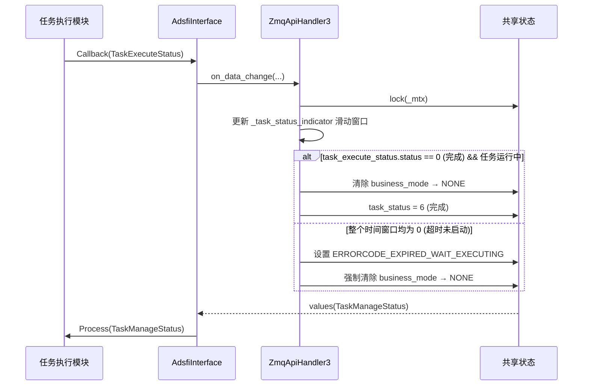
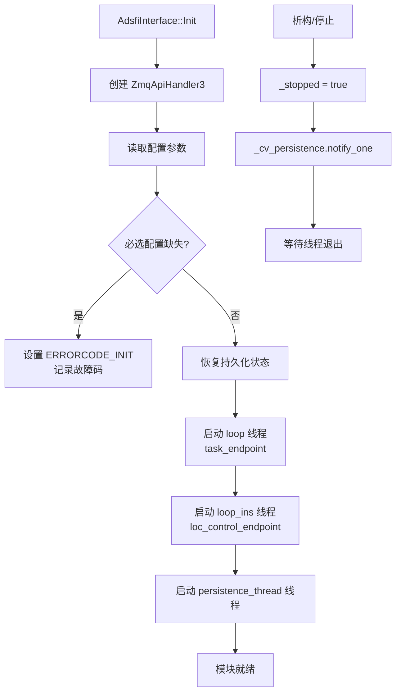
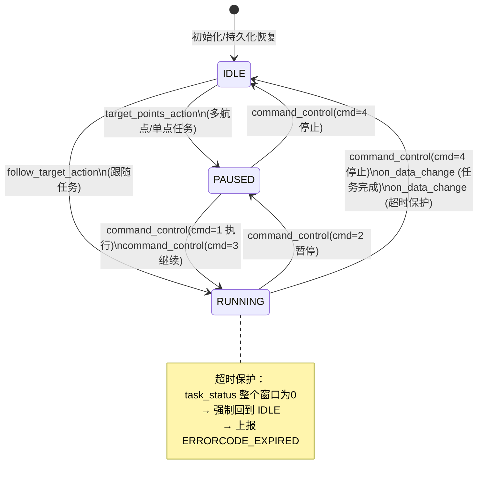
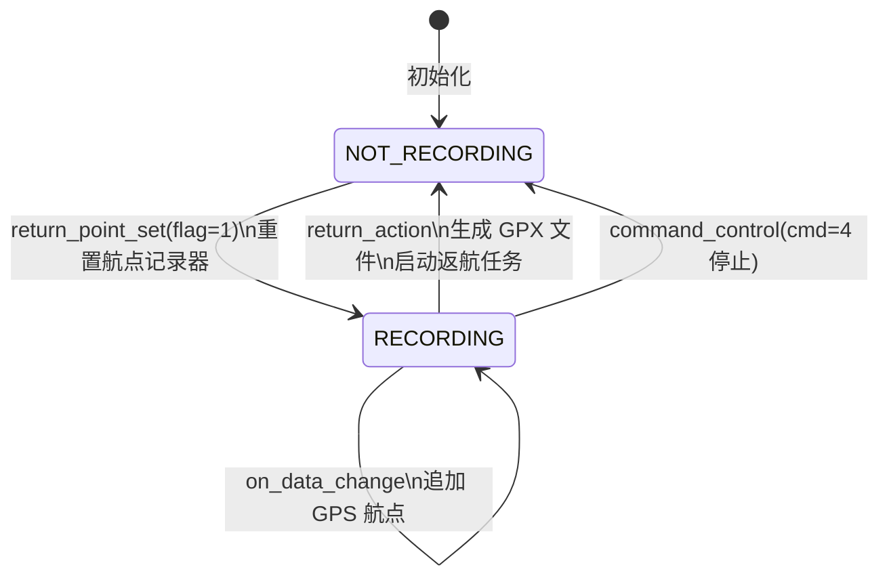

# xzmq_task 模块设计文档

---

# 1. 文档信息

| 项目 | 内容 |
| :--- | :--- |
| **模块名称** | xzmq_task |
| **模块编号** | HMI-XZMQ-001 |
| **所属系统 / 子系统** | HMI Model / 任务控制子系统 |
| **模块类型** | 平台模块 |
| **负责人** |  |
| **参与人** |  |
| **当前状态** | 草稿 |
| **版本号** | V1.1 |
| **创建日期** | 2026-03-03 |
| **最近更新** | 2026-03-04 |

---

# 2. 模块概述

## 2.1 模块定位

xzmq_task 是 HMI 层的 ZMQ 任务通信模块，负责接收来自管理端（Manager）的任务指令并将其转化为自动驾驶系统内部的业务命令，同时向管理端回传执行状态与数据。

- **在系统中的职责**：作为管理端（Manager/HMI）与自动驾驶执行层、定位模块之间的命令适配与路由桥梁；管理视频流配置、任务状态持久化及定位模式控制。
- **上游模块（输入来源）**：
  - Manager 客户端（通过 ZMQ DEALER/REQ 发送命令）
  - 定位模块（`MsgHafLocation` GPS 数据）
  - 感知模块（`MsgHafFusionOutArray` 目标检测数据）
  - 车辆状态模块（`VehicleInformation` 车辆信息）
  - 任务执行模块（`TaskExecuteStatus` 执行状态反馈）
- **下游模块（输出去向）**：
  - 自动驾驶规划模块（`BusinessCommand` 业务命令）
  - 传感器控制模块（`VehicleSensorControl`）
  - 视频编码模块（`AppVideoProfile`、`VideoRTPParameter`）
  - 任务管理模块（`TaskManageStatus`）
- **对外提供能力**：通过 ZMQ ROUTER 协议提供 RPC 风格的命令接入服务

## 2.2 设计目标

- **功能目标**：统一接收并分发所有 Manager 下发的自动驾驶任务指令（巡逻、返航、跟随、姿态调整）、视频配置及定位控制命令；对每条命令进行合法性校验并同步返回执行结果。
- **性能目标**：命令响应延迟 < 50ms；状态持久化周期 ≤ 1s；ZMQ 消息处理单次耗时 < 10ms。
- **稳定性目标**：ZMQ 套接字异常后自动重建；任务超时自动清除并上报故障码；持久化失败不影响主逻辑。
- **安全目标**：对所有输入参数进行范围/合法性校验；任务状态互斥保护，防止并发任务干扰；关键状态变更写入磁盘防止异常重启数据丢失。
- **可维护性 / 可扩展性目标**：话题处理器独立函数化，新增话题无需修改主循环；持久化项通过模板扩展。

## 2.3 设计约束

- **硬件平台 / OS**：Linux（含 CAN 总线接口预留）
- **中间件 / 框架依赖**：ZeroMQ（zmq）、ADSFI 框架（ara::adsfi 消息体）、CustomStack 配置加载器
- **标准**：遵循 ap_adsfi 平台接口规范
- **兼容性约束**：ZMQ 协议版本兼容 Manager 侧客户端；持久化文件格式向前兼容

---

# 3. 需求与范围

## 3.1 功能需求（FR）

| 需求ID | 描述 | 优先级 |
| :--- | :--- | :--- |
| FR-01 | 接收并处理多路径巡逻任务命令（含航点列表、速度限制、避障模式） | 高 |
| FR-02 | 接收并处理视觉目标跟随任务命令 | 高 |
| FR-03 | 接收并处理返航点录制与返航执行命令 | 高 |
| FR-04 | 接收并处理运行/暂停/继续/停止/重置等任务控制命令 | 高 |
| FR-05 | 接收并处理速度限制、紧急制动等安全命令 | 高 |
| FR-06 | 接收并处理视频流开关、分辨率/码率/多摄像头拼接配置命令 | 中 |
| FR-07 | 接收并处理 INS 航向对齐与定位模式切换命令 | 中 |
| FR-08 | 对所有命令进行参数合法性校验，返回执行结果码 | 高 |
| FR-09 | 监控任务执行状态，超时或完成后自动清除并上报 | 高 |
| FR-10 | 将关键业务状态持久化到磁盘，支持重启恢复 | 中 |
| FR-11 | 感知数据、GPS 数据、车辆状态数据实时同步给任务执行层 | 高 |
| FR-12 | 集成 OTel 分布式追踪，对每条 ZMQ 命令创建短生命周期 Span，并将 W3C traceparent 注入 BusinessCommand.trace_ctx 字段，实现跨进程 Trace 传播 | 中 |

## 3.2 非功能需求（NFR）

| 需求ID | 类型 | 指标 | 目标值 |
| :--- | :--- | :--- | :--- |
| NFR-01 | 性能 | 命令响应延迟 | < 50ms |
| NFR-02 | 性能 | 状态持久化周期 | ≤ 1s |
| NFR-03 | 稳定性 | ZMQ 套接字故障恢复 | 自动重连，无需人工干预 |
| NFR-04 | 稳定性 | 任务超时保护窗口 | 可配置（task_timeout_guard > 0） |
| NFR-05 | 安全性 | 并发任务保护 | 同一时刻只允许一个任务运行 |
| NFR-06 | 可靠性 | 持久化写入原子性 | 先写 .tmp 再 rename，防止写入损坏 |

## 3.3 范围界定（必须明确）

### 3.3.1 本模块必须实现：

- ZMQ ROUTER 服务端监听（两个独立端点）
- 全部 Manager→Auto 话题的处理器
- 全部 Manager→Loc 话题的处理器
- 任务状态机管理及超时保护
- 业务状态持久化（写/读/恢复）
- 向下游模块输出 BusinessCommand、VideoProfile 等数据

### 3.3.2 本模块明确不做：

> （防止范围膨胀）

- 不执行路径规划算法（由规划模块负责）
- 不直接控制视频编解码（由 xh265_encoder 等模块负责）
- 不直接执行 INS 校准（通过 CAN 消息转发，INS 模块负责实际校准）
- 不负责 ZMQ 客户端（Manager）侧的实现

## 3.4 需求-设计-验证映射（评审必查）

| 需求ID | 对应设计章节 | 对应接口 | 验证方式 / 用例 |
| :--- | :--- | :--- | :--- |
| FR-01 | 5.3 主流程 | handleTargetPointsAction() | TC-01 |
| FR-02 | 5.3 主流程 | handleTargetFollowAction() | TC-02 |
| FR-03 | 8.2 状态机 | handlemanager2auto_return_*() | TC-03 |
| FR-04 | 8.2 状态机 | handlemanager2auto_command_control() | TC-04 |
| FR-05 | 5.3 主流程 | handlemanager2auto_emergency_brake() | TC-05 |
| FR-06 | 5.3 主流程 | handlemanager2auto_video_*() | TC-06 |
| FR-07 | 5.3 主流程 | handlemanager2loc_*() | TC-07 |
| FR-08 | 9. 异常处理 | sendRouterTopicBuffer() 返回码 | TC-08 |
| FR-09 | 8.2 状态机 | on_data_change() 超时监控 | TC-09 |
| FR-10 | 5.1 内部架构 | persistence_thread_func() | TC-10 |
| FR-11 | 7.1 对外接口 | AdsfiInterface::Callback() | TC-11 |
| FR-12 | 5.3 核心流程 | AdTracker::Span, BusinessCommand.trace_ctx | TC-12 |

---

# 4. 设计思路

## 4.1 方案概览

xzmq_task 采用 **"适配器 + 双 ROUTER 端点 + 异步持久化"** 的整体架构。

- **AdsfiInterface** 作为 ADSFI 框架的适配器层，将平台标准消息 Callback/Process 接口与内部 ZmqApiHandler3 解耦，实现框架无关性。
- **ZmqApiHandler3** 包含所有核心业务逻辑，通过三个独立线程分别处理：任务命令（loop）、定位控制（loop_ins）、状态持久化（persistence_thread_func）。
- **话题分发**：ROUTER 套接字接收消息后通过 `topic` 字段映射到具体 handler 函数，每个 handler 独立处理一类命令，互不干扰。
- **数据流**：传感器数据通过 `on_data_change()` 注入，任务状态通过 `values()` 输出，两个方向均由同一互斥锁保护。

## 4.2 关键决策与权衡

- **ROUTER 而非 PUB/SUB**：Manager 需要同步得到命令执行结果，使用 ROUTER 实现请求-应答模式，比 PUB/SUB 更适合命令-确认场景。
- **线程隔离**：两个 ZMQ 套接字各自独立线程，避免跨线程共享 ZMQ context 导致的竞争问题。
- **持久化异步化**：持久化写磁盘操作放在独立线程，避免阻塞任务处理主线程；通过 condition_variable 触发，兼顾实时性与 CPU 效率。
- **原子写入**：持久化先写 `.tmp` 再 `rename`，防止断电/崩溃造成文件损坏。

## 4.3 与现有系统的适配

- 遵循 ADSFI 框架的 BaseAdsfiInterface 接口规范，通过 AdsfiInterface 适配层接入框架消息总线。
- 使用 CustomStack 统一读取配置，兼容平台配置管理体系。
- 使用 Ec409 统一故障码管理，兼容平台健康监控体系。

## 4.4 失败模式与降级

- **ZMQ 套接字异常**：循环内捕获异常，记录故障码后重建套接字（loop_ins 有 800ms 退避）。
- **任务超时未启动**：滑动窗口监控 task_execute_status；整个时间窗口均为 0 则上报超时故障码并强制清除任务状态。
- **持久化失败**：记录日志，1 秒后重试，不影响主业务逻辑。
- **配置缺失**：必选配置（ZMQ 端点、持久化路径）缺失时设置初始化故障码并退出初始化。

---

# 5. 架构与技术方案

## 5.1 模块内部架构

```mermaid
graph TB
    subgraph xzmq_task["xzmq_task 模块"]
        AI["AdsfiInterface\n(ADSFI适配层)"]
        ZMQ3["ZmqApiHandler3\n(核心处理器)"]

        subgraph Threads["线程模型"]
            T1["loop()\n任务命令线程"]
            T2["loop_ins()\n定位控制线程"]
            T3["persistence_thread_func()\n状态持久化线程"]
        end

        subgraph State["共享状态 (mutex保护)"]
            BC["BusinessCommand\n业务命令"]
            VP["AppVideoProfile\n视频配置"]
            RTP["VideoRTPParameter\nRTP参数"]
            TMS["TaskManageStatus\n任务状态"]
            RPS["ReturnPointStatus\n返航点状态"]
            GPS_C["GPS / Vehicle / Fusion\n传感器缓存"]
        end

        subgraph Persist["持久化存储 (磁盘)"]
            P1["business_command.json"]
            P2["video_profile.json"]
            P3["video_rtp.json"]
            P4["return_point_status.json"]
            P5["task_manage_status.json"]
        end
    end

    subgraph External["外部模块"]
        MGR["Manager 客户端\n(ZMQ DEALER)"]
        LOC["定位模块\nMsgHafLocation"]
        PERC["感知模块\nMsgHafFusionOutArray"]
        VEH["车辆状态模块\nVehicleInformation"]
        EXEC["任务执行模块\nTaskExecuteStatus"]
        PLAN["规划模块\nBusinessCommand"]
        VIDEO["视频模块\nAppVideoProfile"]
        INS["INS模块\nLocControl"]
    end

    MGR -->|ZMQ task_endpoint| T1
    MGR -->|ZMQ loc_control_endpoint| T2
    T1 -->|write| State
    T2 -->|write| State
    T3 -->|read snapshot| State
    T3 -->|write| Persist
    AI -->|on_data_change| ZMQ3
    LOC -->|Callback| AI
    PERC -->|Callback| AI
    VEH -->|Callback| AI
    EXEC -->|Callback| AI
    ZMQ3 -->|values()| AI
    AI -->|Process| PLAN
    AI -->|Process| VIDEO
    AI -->|Process| INS
    Persist -->|startup restore| ZMQ3
```

**线程 / 进程模型：**
- 主进程单实例，三个 `std::thread` 后台线程（detached 或 joinable）
- `loop()` 和 `loop_ins()` 为 ZMQ 套接字独占线程（ZMQ 套接字不跨线程共享）
- `persistence_thread_func()` 以 `condition_variable` + 1 秒超时唤醒

**同步模型：**
- `std::mutex _mtx`：保护所有业务状态的读写
- `std::condition_variable _cv_persistence`：持久化触发信号
- `std::atomic_bool _stopped`：优雅停止标志

## 5.2 关键技术选型

| 技术点 | 方案 | 选择原因 | 备选方案 |
| :--- | :--- | :--- | :--- |
| 进程间通信 | ZMQ ROUTER | 支持多客户端并发、异步请求-应答、身份路由 | Unix Socket、gRPC |
| 消息序列化 | Protocol Buffers（protocol_common） | 平台统一标准、二进制紧凑 | JSON、FlatBuffers |
| 状态持久化 | nlohmann::json + rename原子写 | 可读性好、崩溃安全 | SQLite、protobuf binary |
| 错误管理 | Ec409 故障码 | 平台统一健康监控接入 | 自定义 errno |
| 配置读取 | CustomStack | 平台统一配置中心 | 直读 yaml/json 文件 |
| 日志 | ap_log（ApInfo/ApError） | 平台统一日志体系 | glog 直接使用 |
| 分布式追踪 | xad_tracker（OTel C++ SDK 1.14.2 OTLP/HTTP） | 平台统一追踪库，接口简洁，BatchSpanProcessor 异步导出零阻塞业务线程 | 直接使用 OTel SDK |

## 5.3 核心流程

### 主流程（任务命令处理）

```mermaid
sequenceDiagram
    participant MGR as Manager客户端
    participant LOOP as loop()线程
    participant HANDLER as handle*()处理器
    participant STATE as 共享状态(mutex)
    participant ADSFI as AdsfiInterface
    participant PLAN as 规划模块

    MGR->>LOOP: ZMQ: [Identity][Topic][Payload]
    LOOP->>LOOP: 解析 identity + topic
    LOOP->>HANDLER: 调用对应 handle*()
    HANDLER->>HANDLER: 反序列化 Payload
    HANDLER->>HANDLER: 参数合法性校验
    alt 校验失败
        HANDLER->>MGR: sendRouterTopicBuffer(0/800/801)
    else 校验通过
        HANDLER->>STATE: lock(_mtx) → 更新状态
        HANDLER->>MGR: sendRouterTopicBuffer(1)
        STATE-->>ADSFI: values() 读取
        ADSFI->>PLAN: Process(BusinessCommand)
    end
```

### 任务状态监控流程



### 启动 / 退出流程



---

# 6. 界面设计

> 本模块为纯后端命令处理模块，不含用户界面，跳过本节。

---

# 7. 接口设计（评审重点）

## 7.1 对外接口

### AdsfiInterface 输入接口（Callback）

| 接口名 | 类型 | 输入 | 输出 | 频率 | 备注 |
| :--- | :--- | :--- | :--- | :--- | :--- |
| Callback(MsgHafLocation) | Topic | GPS 位置数据 | 无 | ~10Hz | 缓存 GPS，返航录制时写入航点 |
| Callback(VehicleInformation) | Topic | 车辆状态（驾驶模式等） | 无 | ~10Hz | 缓存车辆模式，用于任务前置校验 |
| Callback(MsgHafFusionOutArray) | Topic | 感知目标数组 | 无 | ~10Hz | 缓存检测目标，跟随任务使用 |
| Callback(TaskExecuteStatus) | Topic | 任务执行状态 | 无 | ~10Hz | 触发任务完成/超时逻辑 |

### AdsfiInterface 输出接口（Process）

| 接口名 | 类型 | 输入 | 输出 | 频率 | 备注 |
| :--- | :--- | :--- | :--- | :--- | :--- |
| Process(BusinessCommand) | Topic | 无 | 当前业务命令 | 按需 | 规划模块读取 |
| Process(VehicleSensorControl) | Topic | 无 | 传感器控制 | 按需 | |
| Process(AppVideoProfile) | Topic | 无 | 视频配置 | 按需 | 编码模块读取 |
| Process(VideoRTPParameter) | Topic | 无 | RTP 参数 | 按需 | 推流模块读取 |
| Process(TaskManageStatus) | Topic | 无 | 任务管理状态 | 按需 | 状态上报 |

### ZMQ 命令接口（Manager→Auto）

| 话题 | 响应码 | 描述 |
| :--- | :--- | :--- |
| manager2auto_target_points_action | 1/0/800/801 | 多航点巡逻任务 |
| manager2auto_follow_target_action | 1/0/800 | 视觉目标跟随任务 |
| manager2auto_action_config | 1/0 | 降级/避障模式配置 |
| manager2auto_maneuvering_strategy | 1/0 | 轨迹/到达点策略 |
| manager2auto_perception_strategy | 1/0 | 感知算法选择 |
| manager2auto_positioning_usage | 1/0 | 定位策略配置 |
| manager2auto_return_point_set | 1/0 | 开始录制返航点 |
| manager2auto_return_action | 1/0/801 | 执行返航 |
| manager2auto_command_control | 1/0 | 运行/暂停/继续/停止 |
| manager2auto_speed_limit_config | 1/0 | 速度限制配置 |
| manager2auto_emergency_brake | 1/0 | 紧急制动 |
| manager2auto_video_enable | 1/0 | 视频流开关+RTP参数 |
| manager2auto_video_set | 1/0/3 | 视频分辨率/码率/拼接配置 |
| manager2auto_video_assist | 1/0 | 辅助叠加图层配置 |
| manager2auto_data_logger | 1/0 | 录制触发控制 |

### ZMQ 命令接口（Manager→Loc）

| 话题 | 响应码 | 描述 |
| :--- | :--- | :--- |
| manager2loc_ins_control | 1/0 | INS 航向对齐命令 |
| manager2loc_loc_mode | 1/0 | 定位模式位掩码配置 |

**响应码说明：**
- `1` = 成功
- `0` = 参数错误 / 校验失败
- `3` = 视频参数无效
- `800` = 任务冲突（已有任务运行）
- `801` = 状态不满足（如返航点未设置）

## 7.2 对内接口

- `ZmqApiHandler3::on_data_change()`：AdsfiInterface 调用，将传感器数据同步到处理器内部缓存（mutex 保护）
- `ZmqApiHandler3::values(T&)`：AdsfiInterface 调用，读取当前各类输出数据（mutex 保护）

## 7.3 接口稳定性声明

- **稳定接口**：所有 ZMQ 话题名称、响应码定义；AdsfiInterface Callback/Process 签名 → 变更必须评审
- **非稳定接口**：持久化文件内部 JSON 字段（内部使用，可扩展）

## 7.4 接口行为契约（必须填写）

**manager2auto_target_points_action**
- 前置条件：GPS 有效（is_location_ok）；若不允许非自动驾驶模式任务则 drive_mode 须为自动驾驶
- 后置条件：BusinessCommand 更新，task_status 置为执行中
- 非阻塞；不可重入（互斥锁保护）
- 最大执行时间：< 10ms
- 失败语义：返回 0/800/801 并记录故障码

**on_data_change()**
- 前置条件：无
- 后置条件：内部传感器缓存刷新；若满足超时条件则清除任务状态
- 非阻塞；不可重入（互斥锁保护）
- 最大执行时间：< 5ms

---

# 8. 数据设计

## 8.1 数据结构

**BusinessCommand（业务命令，核心输出）**

| 字段 | 类型 | 说明 |
| :--- | :--- | :--- |
| business_mode | int | 任务类型（TRACK_DR/FOLLOW_DR/POSE_ADJUST 等） |
| command | int | 执行命令（IDLE=0/RUNNING=1/PAUSED=2） |
| patrol_name | string | 巡逻轨迹文件名 |
| patrol_dest | string | 巡逻目标点 |
| pose | geometry | 目标姿态（姿态调整任务） |
| max_speed / min_speed | float | 速度限制（m/s） |
| avoid_mode | int | 避障模式 |
| degrade_mode | int | 降级模式 |

**AppVideoProfile（视频配置）**

| 字段 | 类型 | 说明 |
| :--- | :--- | :--- |
| manual_width / manual_height | int | 视频分辨率 |
| manual_bps | int | 码率（kbps） |
| split_area_parames | array | 多摄像头拼接配置（摄像头ID、裁剪区域、显示区域） |
| video_third_person | int | 夜视摄像头标志 |

**ReturnPointStatus（返航点状态，持久化）**

| 字段 | 类型 | 说明 |
| :--- | :--- | :--- |
| return_point_flag | bool | 是否正在录制返航路径 |

## 8.2 状态机（如适用）

### 任务执行状态机



### 返航点录制状态机



## 8.3 数据生命周期

- **BusinessCommand**：随任务命令创建，持久化到磁盘，重启后恢复；任务完成/停止后部分字段清零
- **VideoProfile**：随视频配置命令更新，持久化到磁盘，重启后恢复
- **ReturnPointStatus**：随返航点录制命令更新，持久化到磁盘；执行返航后清除
- **传感器缓存（GPS/Vehicle/Fusion）**：每次 Callback 刷新，不持久化，重启后需等待新数据到来

---

# 9. 异常与边界处理（评审必查）

| 异常场景 | 检测方式 | 处理策略 | 是否可恢复 | 上报方式 |
| :--- | :--- | :--- | :--- | :--- |
| 必选配置项缺失 | Init 阶段 key 读取失败 | 设置 ERRORCODE_CONFIG，拒绝后续初始化 | 否（需修复配置重启） | Ec409 故障码 |
| ZMQ 套接字绑定失败 | zmq_bind 返回错误 | 记录 ERRORCODE_ZMQ_LISTEN，循环重试 | 是 | Ec409 故障码 |
| ZMQ 消息反序列化失败 | ParseFromString 抛出异常 | 捕获 ExceptionZmqDeserialize，丢弃消息，回复 result=0 | 是 | Ec409 + 日志 |
| ZMQ 发送失败 | zmq_send 返回错误 | 捕获 ExceptionZmqSend，记录故障码 | 是 | Ec409 + 日志 |
| GPS 无效 | is_location_ok 检查 | 拒绝任务，回复 result=0，task_status=6 | 是（等待有效GPS） | Ec409 故障码 |
| 非自动驾驶模式下发任务 | drive_mode 校验 | 拒绝任务（根据 enable_pre_autonomy_tasking 配置） | 是 | Ec409 + 日志 |
| 并发任务冲突 | business_mode != NONE 检查 | 拒绝新任务，回复 result=800 | 是（停止当前任务后可重试） | result=800 |
| 航点数量不足 | points_num <= min_waypoints | 拒绝任务，回复 result=801 | 是 | 日志 |
| 任务超时未启动 | 滑动窗口整窗为0 | 强制清除任务，上报 ERRORCODE_EXPIRED_WAIT_EXECUTING | 是 | Ec409 故障码 |
| 持久化写入失败 | 文件写入异常 | 日志记录，1 秒后重试，不影响主逻辑 | 是 | 日志 |
| INS CAN 发送失败 | CAN socket 写入失败 | 记录 ERRORCODE_CAN_SEND，回复 result=0 | 是 | Ec409 故障码 |
| 速度超出范围 | speed > 300 × 0.1 m/s | 拒绝命令，回复 result=0 | 是 | 日志 |
| 定位模式保留位被设置 | loc_mode & 0x40 != 0 | 拒绝命令，回复 result=0 | 是 | 日志 |

---

# 10. 性能与资源预算（必须可验收）

## 10.1 性能指标

| 场景 | 指标 | 目标值 | 测试方法 |
| :--- | :--- | :--- | :--- |
| ZMQ 命令处理（正常路径） | 端到端延迟 | < 50ms | ZMQ 客户端发送后计时 |
| 任务状态同步（on_data_change） | 锁持有时间 | < 5ms | perf/gprof 锁分析 |
| 持久化写入单次 | 耗时 | < 100ms | 文件写入计时 |
| 任务超时保护触发 | 时间窗口精度 | ≤ task_timeout_guard + 1帧 | 注入超时场景测试 |

## 10.2 资源预算

| 资源 | 常态 | 峰值 | 上限约束 |
| :--- | :--- | :--- | :--- |
| CPU（主进程占比） | < 1% | < 5%（大量ZMQ消息） | < 10% |
| 内存 | ~5MB（含ZMQ缓冲） | ~10MB | < 20MB |
| 磁盘（持久化文件） | ~10KB（5个JSON） | ~1MB（含GPX轨迹） | < 10MB |
| 线程数 | 3（background） | 3 | 固定 |

---

# 11. 构建与部署

## 11.1 环境依赖

| 依赖项 | 版本要求 | 说明 |
| :--- | :--- | :--- |
| 操作系统 | Linux（Ubuntu 20.04+） | 需 CAN 总线内核模块（预留） |
| 编译器 | GCC 9+ / Clang 10+ | C++17 |
| libzmq | 4.x | ZMQ 通信库 |
| libprotobuf | 3.x | protocol_common 序列化 |
| glog | 0.5+ | 日志 |
| fmt | 7+ | 格式化字符串 |
| proj / libProj4 | 自定义 | 地理坐标转换 |
| nlohmann/json | 3.x | JSON 序列化（持久化） |
| yaml-cpp | 0.7+ | 配置文件解析 |
| ssl / crypto | OpenSSL 1.1+ | 加密工具（依赖链） |
| tinyxml2 | 8+ | GPX XML 生成 |
| xad_tracker | common/xad_tracker（项目内部） | OTel 追踪封装库 |
| opentelemetry C++ SDK | 1.14.2（third_party_arm） | OTLP/HTTP 追踪导出（由 xad_tracker 内部依赖） |

## 11.2 构建步骤

### 依赖安装

```bash
# 由平台 CMake 统一管理，第三方库通过 third_party 目录提供
```

### 构建命令

```bash
# 通过平台统一构建系统编译
cmake -B build -DMODULE=xzmq_task
cmake --build build
```

### 构建产物

- 产物：集成到 HMI Model 共享库或可执行文件中
- model.cmake 中的 MODULE_SOURCES、MODULE_LIBS 由平台构建框架消费

## 11.3 配置项

| 配置项 | 说明 | 默认值 | 是否必须 | 来源 |
| :--- | :--- | :--- | :--- | :--- |
| hmi/zmq/task_endpoint | 任务命令 ROUTER 端点 | 无 | 是 | CustomStack |
| hmi/zmq/loc_control_endpoint | 定位控制 ROUTER 端点 | 无 | 是 | CustomStack |
| hmi/zmq/persistence_path | 持久化文件目录 | 无 | 是 | CustomStack |
| keyfile_storage_path | 航点/轨迹文件存储路径 | 无 | 是 | CustomStack |
| hmi/common/default/manual_bps | 默认视频码率(kbps) | 配置文件值 | 否 | CustomStack |
| hmi/common/default/manual_width | 默认视频宽度(px) | 配置文件值 | 否 | CustomStack |
| hmi/common/default/manual_height | 默认视频高度(px) | 配置文件值 | 否 | CustomStack |
| hmi/common/default/task_timeout_guard | 任务超时保护窗口(s) | 须>0 | 否 | CustomStack |
| hmi/common/default/min_waypoints | 轨迹任务最少航点数 | 配置文件值 | 否 | CustomStack |
| enable_pre_autonomy_tasking | 允许非自驾模式下发任务 | false | 否 | CustomStack |
| zmq_api.config_path_prefix | 配置路径前缀 | "hmi/common/default/" | 否 | global.conf |

> 所有可配置项必须在此列出，禁止在代码中散落硬编码。

## 11.4 部署结构与启动

### 部署目录结构

```text
/
├── config/
│   └── global.conf                 # ZMQ API 配置
├── persistence/                    # 持久化文件目录（由 persistence_path 配置）
│   ├── business_command.json
│   ├── video_profile.json
│   ├── video_rtp.json
│   ├── return_point_status.json
│   └── task_manage_status.json
└── keyfile/                        # 航点/轨迹文件目录（由 keyfile_storage_path 配置）
    └── *.gpx / *.wpt
```

### 启动 / 停止命令

- **启动**：随 ADSFI 框架进程启动，由框架调用 `AdsfiInterface::Init()` 完成初始化
- **停止**：随框架进程停止，析构函数中设置 `_stopped=true`，等待线程退出
- **进程管理**：由平台进程管理器（systemd / 自定义守护进程）负责

## 11.5 健康检查与启动验证

- **启动成功判断**：Init 完成后 Ec409 中无 `ERRORCODE_INIT` 和 `ERRORCODE_CONFIG` 故障码
- **健康检查**：通过 Ec409 故障码查询接口，或查看 ap_log 中无 ERROR 级别日志
- **启动超时**：无阻塞操作，Init 完成即就绪（ZMQ 线程异步启动）

## 11.6 升级与回滚

- **升级步骤**：替换共享库/可执行文件，重启进程；持久化文件向前兼容（JSON 增量字段）
- **回滚步骤**：替换回旧版本文件，重启进程；若持久化格式不兼容则清空 persistence 目录
- **版本兼容性**：ZMQ 话题名称和响应码不变则协议兼容；新增话题旧客户端忽略（ROUTER 独立处理）

---

# 12. 可测试性与验证

## 12.1 单元测试

- **覆盖范围**：
  - 每个 `handle*()` 函数的参数合法性校验分支
  - `on_data_change()` 的任务完成/超时逻辑
  - `parseVideoProfileData()` 的拼接配置解析
  - 持久化读写的序列化/反序列化正确性
- **Mock / Stub 策略**：
  - 用 MockZmqConstruct 替代真实 ZMQ 套接字
  - 用 MockCustomStack 提供配置注入
  - 用 Mock AdsfiInterface 验证输出调用

## 12.2 集成测试

- **上下游联调点**：
  - Manager 客户端 → ZMQ 端点 → BusinessCommand 输出验证
  - GPS/Vehicle 数据注入 → 任务前置校验行为验证
  - 任务执行状态回注 → 任务完成清除验证
  - 持久化文件 → 重启恢复后状态一致性验证

## 12.3 可观测性

- **日志（关键点）**：
  - ApInfo：命令接收、任务启动/完成/清除、视频配置变更、持久化写入成功
  - ApError：校验失败、ZMQ 异常、任务超时、持久化失败
- **监控指标**：Ec409 故障码集合（可通过平台健康监控查询）
- **Trace / Debug 接口**：支持 `command_control(cmd=99/100)` 调试命令

---

# 13. 测试用例清单

| ID | 对应需求 | 测试项目 | 测试步骤 | 预期结果 | 测试结果 |
| :--- | :--- | :--- | :--- | :--- | :--- |
| TC-01 | FR-01 | 多航点任务下发 | 发送含有效航点列表的 target_points_action | 返回1，BusinessCommand 更新 | |
| TC-02 | FR-02 | 目标跟随任务下发 | 发送 follow_target_action | 返回1，business_mode=FOLLOW | |
| TC-03 | FR-03 | 返航点录制+返航执行 | 先发 return_point_set，注入 GPS 数据，再发 return_action | GPX 生成，返回1，任务启动 | |
| TC-04 | FR-04 | 任务控制命令序列 | 依次发送 run/pause/resume/stop | 状态机按预期转换 | |
| TC-05 | FR-05 | 紧急制动 | 发送 emergency_brake | 返回1，VehicleSensorControl 更新 | |
| TC-06 | FR-06 | 视频分辨率切换 | 发送 video_set(resolution=1) | 返回1，VideoProfile.width=1280 | |
| TC-07 | FR-07 | INS 控制命令 | 发送 ins_control(value=1) | 返回1，CAN 消息发送 | |
| TC-08 | FR-08 | GPS 无效时下发任务 | GPS 置无效后发 target_points_action | 返回0，task_status=6 | |
| TC-09 | FR-09 | 任务超时保护 | 任务启动后持续注入 status=0 超过超时窗口 | business_mode 清除，ERRORCODE_EXPIRED 上报 | |
| TC-10 | FR-10 | 持久化恢复 | 更新视频配置后重启，读取持久化文件 | 配置与重启前一致 | |
| TC-11 | FR-11 | 并发任务拒绝 | 任务运行中再发新任务 | 返回800 | |

---

# 14. 风险分析（设计评审核心）

| 风险 | 影响 | 可能性 | 应对措施 |
| :--- | :--- | :--- | :--- |
| ZMQ 消息乱序（DEALER 多帧顺序） | 命令执行错误 | 低 | ROUTER 绑定Identity确保响应路由正确；handler 无状态依赖顺序 |
| 持久化文件损坏（断电写到一半） | 重启后状态不一致 | 低 | 原子 rename 写入策略；损坏文件反序列化异常后以默认值初始化 |
| 任务超时窗口配置错误（=0） | 超时保护失效 | 中 | Init 阶段校验 task_timeout_guard > 0，否则不启用超时保护并告警 |
| ZMQ 套接字线程泄漏 | 内存/文件描述符耗尽 | 低 | 循环内创建，异常后关闭重建；_stopped 标志确保退出 |
| 大量 GPS 航点写入返航文件过大 | 存储超限 | 中 | 建议在返航录制时限制最大航点数量（当前未限制，需评估） |
| Manager 客户端身份路由混乱 | 响应发错目标 | 低 | ZMQ ROUTER 自动管理 Identity；topic_maps 按 topic 存储Identity |

---

# 15. 设计评审

## 15.1 评审 Checklist

- [ ] 需求是否完整覆盖
- [ ] 接口是否清晰稳定
- [ ] 界面设计是否完整（本模块无 UI，跳过）
- [ ] 异常路径是否完整
- [ ] 性能 / 资源是否有上限
- [ ] 构建与部署步骤是否完整可执行
- [ ] 是否存在过度设计
- [ ] 测试用例是否覆盖所有功能需求和非功能需求

## 15.2 评审记录

| 日期 | 评审人 | 问题 | 结论 | 备注 |
| :--- | :--- | :--- | :--- | :--- |
| | | | | |

---

# 16. 变更管理（重点）

## 16.1 变更原则

- 不允许口头变更
- 接口 / 行为变更必须记录

## 16.2 变更分级

| 级别 | 示例 | 是否需要评审 |
| :--- | :--- | :--- |
| L1 | 注释 / 日志 | 否 |
| L2 | 内部逻辑（新增话题处理器、持久化字段） | 是 |
| L3 | ZMQ 话题名称变更 / 响应码变更 / AdsfiInterface 接口变更 | 是（系统级） |

## 16.3 变更记录

| 版本 | 变更内容 | 影响分析 | 评审人 |
| :--- | :--- | :--- | :--- |
| V1.0 | 初始设计文档 | 无 | |
| V1.1 | 2026-03-04 | 新增 FR-12（OTel 分布式追踪集成）；更新 §5.2 技术选型、§11.1 依赖；新增 BusinessCommand.trace_ctx W3C traceparent 注入说明 | — |

---

# 17. 交付与冻结

## 17.1 设计冻结条件

- [ ] 界面设计已评审通过（本模块无 UI）
- [ ] 所有接口有对应测试用例
- [ ] 所有 NFR 有验证方案
- [ ] 异常路径已覆盖
- [ ] 构建与部署文档可执行验证通过
- [ ] 变更影响分析完成

## 17.2 设计与交付物映射

- 设计文档 ↔ `src/ZmqApiHandler3.cpp` / `adsfi_interface/adsfi_interface.cpp`
- 接口文档 ↔ `src/ZmqApiHandler3.hpp` / `adsfi_interface/adsfi_interface.h`
- 测试用例 ↔ 集成测试套件（待建立）

---

# 18. 附录

## 术语表

| 术语 | 说明 |
| :--- | :--- |
| ROUTER | ZMQ 套接字类型，服务端多路复用，自动路由客户端 Identity |
| DEALER | ZMQ 套接字类型，客户端异步发送 |
| BusinessCommand | ADSFI 框架定义的任务指令消息体 |
| Ec409 | 平台故障码管理类 |
| CustomStack | 平台统一配置读取接口 |
| INS | 惯性导航系统（Inertial Navigation System） |
| GPX | GPS Exchange Format，航点/轨迹标准 XML 格式 |
| tmpfs | Linux 内存文件系统 |
| TRACK_DR | 轨迹跟随驾驶模式（Drive with track Recording） |
| FOLLOW_DR | 目标跟随驾驶模式 |
| POSE_ADJUST | 姿态调整模式（单目标点） |

## 参考文档

- ADSFI 框架接口规范
- ZeroMQ 官方文档
- ap_adsfi 平台 Ec409 故障码规范
- protocol_common 消息定义文档

## 历史版本记录

| 版本 | 日期 | 说明 |
| :--- | :--- | :--- |
| V1.0 | 2026-03-03 | 初始版本，基于代码逆向分析生成 |
| V1.1 | 2026-03-04 | 新增 FR-12：OTel 分布式追踪，每条 ZMQ 命令创建短生命周期 Span，W3C traceparent 注入 BusinessCommand.trace_ctx；新增 xad_tracker / opentelemetry SDK 依赖 |
