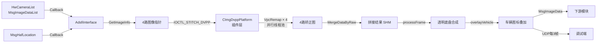

## 1. 文档信息

| 项目 | 内容 |
| --- | --- |
| 模块名称 | MdcCameraStitch（多路鱼眼相机图像拼接） |
| 模块编号 | — |
| 所属系统 / 子系统 | 多媒体感知 / 环视图像处理 |
| 模块类型 | 平台模块 |
| 负责人 | — |
| 参与人 | — |
| 当前状态 | 草稿 |
| 版本号 | V1.2 |
| 创建日期 | 2026-03-04 |
| 最近更新 | 2026-03-13 |

---

## 2. 模块概述

### 2.1 模块定位

MdcCameraStitch 负责将车辆前、后、左、右四路鱼眼摄像头采集的原始图像，经过畸变矫正与空间拼接，合成一帧 360° 环视俯视图，并在其上叠加透明底盘效果与车辆图标，供下游感知、融合及显示模块使用。

- **上游模块**：`HwCameraList`（硬件相机驱动，输出 `MsgImageDataList`，包含四路鱼眼图像）；`MsgHafLocation`（定位模块，提供车辆位姿）
- **下游模块**：感知检测模块、环视显示模块（消费 `MsgImageData`，frameID = `camera_stitch_info`）；调试端（通过 UDP 接收 YUV 流）
- **对外能力**：以 ADSFI Topic 形式发布拼接后的单帧 YUV420SP 图像；插件层以动态库（`.so`）形式对外提供，通过 `ioctl` 接口调用

### 2.2 设计目标

- **功能目标**：对四路 1920×1280 NV12 鱼眼图像执行硬件加速畸变矫正（VPC Remap），将矫正结果合并为 1280×1920 的环视拼接图，并叠加透明底盘效果与车辆图标
- **性能目标**：单帧拼接端到端延迟 < 50 ms；四路 Remap 并行执行，充分利用 Ascend DVPP 硬件算力
- **稳定性目标**：任意单路图像缺失时，模块记录错误日志并跳过当帧处理，不影响进程存活；插件初始化失败时返回错误码，由应用层决策降级策略
- **安全目标**：输出图像写入用户态共享内存（Zero-Copy SHM），避免跨进程数据拷贝带来的越界风险；DVPP 内存由 `HafMallocDvpp` / `HafImageMallocAligned` 管理，生命周期明确
- **可维护性 / 可扩展性**：插件以动态库形式加载，支持在不重新编译应用层的前提下替换算法实现（v1 / v2 版本切换）；标定数据路径通过配置文件注入，无需修改代码

### 2.3 设计约束

- **硬件平台**：华为 MDC（Mobile Data Center）计算平台，搭载昇腾（Ascend）NPU/DVPP，ARM 架构
- **OS / 工具链**：Linux，clang/clang++ 交叉编译，`-std=c++14 -O3 -fPIC -fPIE -fstack-protector-all`
- **中间件 / 框架**：
  - ADSFI 框架（`BaseAdsfiInterface`、`CustomStack`、`ZeroCopyShmMem`）
  - ARA（AUTOSAR Adaptive Runtime for Applications）
  - Ascend HAF（Hardware Abstraction Framework）：`HafInitialize`、`HafCreateChannel`、`HafImageRemap`、`HafMallocDvpp`
  - DVPP（Digital Video Pre-Processing）：VPC Remap 硬件加速
  - OpenCV（`opencv_core`、`opencv_imgproc`、`opencv_imgcodecs`）：用于 PNG 图标加载与双线性插值
- **对齐约束**：DVPP 要求输出图像宽高均为 16 的整数倍；ROI 左边界偏移 4 像素以满足对齐要求
- **标定数据**：每路相机对应一个二进制 `.bin` 文件（`data_front/back/left/right_fish_eye.bin`），存储 ROI 参数及 vx/vy 浮点映射表，路径由车辆配置目录注入

---

## 3. 需求与范围

### 3.1 功能需求（FR）

| 需求 ID | 描述 | 优先级 |
| --- | --- | --- |
| FR-01 | 接收四路鱼眼相机图像（前/后/左/右），格式为 YUV420SP NV12，分辨率 1920×1280 | 高 |
| FR-02 | 加载各路相机对应的畸变矫正标定文件（`.bin`），初始化 DVPP Remap 通道 | 高 |
| FR-03 | 对四路图像并行执行 VPC Remap 畸变矫正，输出分辨率 1280×1920 | 高 |
| FR-04 | 将四路矫正图像按 ROI 区域合并为单帧 1280×1920 环视拼接图 | 高 |
| FR-05 | 将拼接结果写入用户态共享内存，并以 `MsgImageData` 格式发布至下游 | 高 |
| FR-06 | 支持通过配置文件动态指定各路图像的 frameID 名称及插件 `.so` 文件名 | 中 |
| FR-07 | 订阅车辆位姿（`MsgHafLocation`），利用历史帧实现透明底盘效果（车体区域替换为历史地面像素） | 中 |
| FR-08 | 在拼接图车体区域叠加半透明军绿色底色及 `vehicle.png` 车辆图标（alpha 混合） | 中 |
| FR-09 | 每隔 3 帧通过 UDP 将拼接结果推送至调试端（目标地址 `26.28.1.22:10020`） | 低 |

### 3.2 非功能需求（NFR）

| 需求 ID | 类型 | 指标 | 目标值 |
| --- | --- | --- | --- |
| NFR-01 | 性能 | 单帧端到端拼接延迟 | < 50 ms |
| NFR-02 | 性能 | 四路 Remap 并行度 | 4 路同时执行，线程池大小 = STITCH_NUM（4） |
| NFR-03 | 内存 | 单帧输出图像大小 | 1280 × 1920 × 3/2 ≈ 3.5 MB |
| NFR-04 | 稳定性 | 单路图像缺失时的行为 | 记录错误日志，跳过当帧，不崩溃 |
| NFR-05 | 可维护性 | 插件热替换 | 支持不重编应用层替换 `.so` 插件 |
| NFR-06 | 安全性 | 内存访问 | DVPP 内存由 HAF 接口统一管理，禁止越界访问 |

### 3.3 范围界定

#### 3.3.1 本模块必须实现

- 四路鱼眼图像的 DVPP 硬件加速畸变矫正
- 矫正后图像的 ROI 区域合并拼接
- 拼接结果通过 Zero-Copy 共享内存发布
- 插件动态加载与生命周期管理
- 标定数据的二进制反序列化与 DVPP 内存映射
- 透明底盘效果合成（基于历史帧与车辆位姿）
- 车辆图标叠加（PNG alpha 混合）
- 调试 UDP 推流

#### 3.3.2 本模块明确不做

- 相机标定数据的生成与更新（由标定工具链负责）
- 图像时间戳同步与多路对齐（由上游 HwCameraList 保证）
- 拼接缝合线的视觉融合优化（当前为直接 ROI 拼接，无渐变融合）
- 环视图的坐标系变换与鸟瞰图投影（由下游模块处理）

### 3.4 需求 - 设计 - 验证映射

| 需求 ID | 对应设计章节 | 对应接口 | 验证方式 / 用例 |
| --- | --- | --- | --- |
| FR-01 | 5.3 主流程 | `AdsfiInterface::Callback()` | 注入四路模拟图像，验证 frameID 匹配 |
| FR-02 | 5.1、7.1 | `IOCTL_INIT_DVPP` | 检查 `.bin` 文件加载及通道创建返回值 |
| FR-03 | 5.1、5.3 | `IOCTL_STITCH_DVPP` → `VpcRemap` | 对比矫正前后图像，验证畸变消除效果 |
| FR-04 | 5.3 | `YUV420SP_Operator::MergeDataByRaw` | 验证输出图像尺寸及四路区域正确拼接 |
| FR-05 | 6.1 | `CMdcCmaeraStitchInterfaceV2::Process` | 验证共享内存写入及下游订阅接收 |
| FR-06 | 4.3 | `CustomStack::GetConfig` | 修改配置文件后重启，验证图像名称生效 |
| FR-07 | 5.4 | `TransparentChassis::processFrame` | 提供历史位姿序列，验证车体区域像素替换正确 |
| FR-08 | 5.4 | `AdsfiInterface::overlayVehicle` | 检查输出图中车体区域颜色及 PNG 叠加效果 |
| FR-09 | 5.3 | `YuvUdpSender::sendFrame` | 在调试端接收并解码 UDP 帧，验证图像完整性 |

---

## 4. 设计思路

### 4.1 方案概览

本模块采用**两层架构**：

- **应用层**（`adsfi_interface/adsfi_interface.h`）：负责与 ADSFI 框架集成，管理图像数据的接收、分发与发布，通过 `CIdpAbstractPlatformInterface` 动态加载插件并调用其 `ioctl` 接口；同时完成透明底盘合成、车辆图标叠加及 UDP 推流
- **插件层**（编译为 `libimgdvpp_stitch_plugin_v2.so`）：封装 Ascend DVPP 硬件操作，实现畸变矫正与图像合并的具体算法

两层之间通过 `ioctl` 协议（`IOCTL_INIT_DVPP` / `IOCTL_STITCH_DVPP`）及共享数据结构（`SImgDvppCfgList`、`SImgDvppStitch`）解耦，应用层无需感知底层硬件细节。

数据流向如下：



### 4.2 关键决策与权衡

| 决策点 | 选择方案 | 理由 |
| --- | --- | --- |
| 硬件加速 | Ascend DVPP VPC Remap | MDC 平台原生支持，延迟远低于 CPU 软件实现 |
| 插件化 | 动态 `.so` + `dlopen` | 支持算法版本热替换，应用层与算法层独立演进 |
| 并行处理 | 固定大小线程池（4 线程） | 四路相机数量固定，线程数与任务数一一对应，避免调度开销 |
| 内存传递 | Zero-Copy SHM | 避免大图像（3.5 MB/帧）的跨进程拷贝，降低延迟与 CPU 占用 |
| 输入内存 | 直接使用上游指针（无 memcpy） | 上游 DVPP 内存可直接作为 VpcRemap 输入，减少一次数据拷贝 |
| 透明底盘 | 历史帧队列（最多 30 帧）+ 位姿插值 | 无需额外传感器，利用已有环视图与定位数据实现地面透视效果 |
| 车辆图标 | PNG 双线性插值 + alpha 混合 | 支持任意分辨率图标自适应缩放，视觉效果自然 |
| 调试推流 | UDP 分包（每包 ≤ 60000 字节） | 无连接、低延迟，适合局域网内实时调试预览 |

### 4.3 与现有系统的适配

- 通过 `CustomStack::GetConfig("MdcCameraStitchV2", ...)` 读取配置，图像 frameID 名称与 `.so` 文件名均可在 `global.conf` 中覆盖，无需重新编译
  - 注意：`global.conf` 中配置节名为 `MdcCameraStitch`，代码读取时使用 `MdcCameraStitchV2`，需保持一致
- 标定文件路径由 `ptr->GetVehicleConfigPath()` 注入，文件命名规则：`data_front_fish_eye.bin`、`data_back_fish_eye.bin`、`data_left_fish_eye.bin`、`data_right_fish_eye.bin`
- 插件版本通过 `so_file_name` 配置项区分（`v1` / `v2`），切换时仅需修改配置并重启进程
- 车辆图标文件 `vehicle.png` 放置于节点配置目录的 `config/` 子目录下，启动时自动加载

### 4.4 失败模式与降级

| 失败场景 | 当前处理策略 |
| --- | --- |
| 任意单路图像 frameID 未找到 | 记录 `ApError` 日志，释放数据，当帧返回 -1，跳过发布 |
| DVPP 通道创建失败 | `IOCTL_INIT_DVPP` 返回 -1，应用层初始化中止 |
| VpcRemap 执行失败 / 超时 | 线程内记录 `cerr`，继续执行后续合并（当前无中断机制，待完善） |
| 插件 `.so` 加载失败 | `dlopen` 返回错误，`CIdpAbstractPlatformInterface::open` 失败，进程启动异常 |
| 输出尺寸不满足 16 对齐 | `IOCTL_INIT_DVPP` 返回 -1，初始化中止 |
| `vehicle.png` 加载失败 | 记录 `cout` 错误，跳过图标叠加，继续正常拼接流程 |
| 透明底盘位姿数据不足 | `processFrame` 返回 false，车体区域保持拼接原样 |
| UDP 发送失败 | 静默忽略（不影响主流程） |

---
## 5. 详细设计

### 5.1 模块初始化流程

`AdsfiInterface::Init()` 按以下顺序执行：

1. 从 `CustomStack` 读取配置（配置节 `MdcCameraStitchV2`）：
   - `front/back/left/right_image_name`：各路图像的 frameID，默认值为 `front_fisheye`、`back_fisheye`、`left_fisheye`、`right_fisheye`
   - `so_file_name`：插件文件名，默认 `libimgdvpp_stitch_plugin_v2.so`

2. 构造 `CMdcCmaeraStitchInterfaceV2`，传入 `.so` 完整路径（`{NodeConfigPath}/config/{so_file_name}`）和车辆标定目录（`GetVehicleConfigPath()`）

3. 调用 `CMdcCmaeraStitchInterfaceV2::Init()`：
   - `dlopen` 加载插件 `.so`
   - 填充 `SImgDvppCfgList`：目标尺寸 1280×1920，4 路通道 ID 为 90~93，ROI 左偏移 4 像素（满足 DVPP 16 对齐），标定文件路径写入 `m_datapath`
   - 调用 `IOCTL_INIT_DVPP` 完成 DVPP 通道创建

4. 加载 `vehicle.png`（路径：`{NodeConfigPath}/config/vehicle.png`）

5. 从四路标定 `.bin` 文件各读取前 4 个 `int`（x, y, width, height），调用 `find_inner_rect()` 计算车体矩形 `chassis_rect`

6. 配置 `TransparentChassisConfig`：
   - `pixel_per_meter = 100`（1cm/pixel）
   - `vehicle_anchor`：图像中心 (640, 960)
   - `min_enqueue_distance = 0.5m`

7. 初始化 `YuvUdpSender`，目标地址 `26.28.1.22:10020`

### 5.2 标定文件格式（`.bin`）

每个标定文件开头存储 4 个连续 `int32`（小端序），含义为该路相机矫正后图像在拼接图中的 ROI 区域：

| 偏移 | 字段 | 说明 |
| --- | --- | --- |
| 0 | x | ROI 左上角 x 坐标（像素） |
| 4 | y | ROI 左上角 y 坐标（像素） |
| 8 | width | ROI 宽度（像素） |
| 12 | height | ROI 高度（像素） |

文件后续内容为 vx/vy 浮点映射表，由插件层（`IOCTL_INIT_DVPP`）直接读取，应用层不解析。

### 5.3 主处理流程（每帧）

`AdsfiInterface::Process()` 在每帧图像到来时执行：

```
GetImageList()          // 阻塞等待 Callback 通知，获取 MsgImageDataList
  └─ dvpp::sync()       // 同步 DVPP 内存到用户态可访问状态

GetImageInfo() × 4      // 按 frameID 查找四路图像指针（front/back/left/right）
  └─ 任一失败 → ApError + ReleaseData + return -1

CMdcCmaeraStitchInterfaceV2::Process()
  ├─ FillShmBuffer()    // 分配 Zero-Copy SHM，填写 frameID="camera_stitch_info"
  └─ IOCTL_STITCH_DVPP  // 插件层：VpcRemap×4 + MergeDataByRaw → 写入 SHM

GetBuffer()             // 获取 SHM 指针，构造 YuvFrame 视图

TransparentChassis::processFrame()   // 原地修改 SHM：透明底盘合成
overlayVehicle()                     // 原地修改 SHM：军绿色底色 + vehicle.png 叠加

if (seq_frame % 3 == 0)
  YuvUdpSender::sendFrame()          // UDP 推流（每 3 帧一次）

ReleaseData()           // safe_release + is_imagelist_use = false
```

**线程模型**：`Callback`（图像）与 `Callback`（位姿）运行在不同线程。图像线程通过 `condition_variable` 等待新帧，位姿线程通过 `pose_mutex_` 保护写入。`is_imagelist_use` 原子标志防止图像帧被覆盖。

### 5.4 透明底盘算法（TransparentChassis）

#### 5.4.1 整体流程

```
processFrame(timestamp, in_frame)
  ├─ 加锁拷贝 pose_history_ 快照，立即释放锁
  ├─ findNearestPose()     // 在快照中找时间戳最近的位姿作为 current_pose
  ├─ 判断入队条件：
  │    首帧必入队；后续帧：与上次入队位姿的位移 ≥ 0.5m 才入队
  ├─ 入队时：
  │    拷贝完整 YUV 帧到 FrameRecord.pixels
  │    将副本中 chassis_rect 区域填灰（Y=128, UV=128），避免空洞被采样
  │    push_back 到 history_，超过 kMaxHistory(30) 时 pop_front
  └─ history_.size() ≥ 2 时调用 blendChassisRegion()
```

#### 5.4.2 坐标变换

BEV（鸟瞰图）坐标系约定：
- 图像 +X（向右）= 世界坐标 -Y（向左）
- 图像 +Y（向下）= 世界坐标 -X（向后）
- 车辆锚点像素 `(vehicle_anchor_x, vehicle_anchor_y)` 对应车辆当前世界坐标 `(pose.x, pose.y)`

**像素 → 世界坐标**（`pixelToWorld`）：
```
dx_pix = px - anchor_x
dy_pix = py - anchor_y
dx_m(前向) = -dy_pix / pixel_per_meter
dy_m(左向) = -dx_pix / pixel_per_meter
wx = pose.x + cos(heading)*dx_m - sin(heading)*dy_m
wy = pose.y + sin(heading)*dx_m + cos(heading)*dy_m
```

**世界坐标 → 历史帧像素**（`worldToPixel`）：逆变换，结果落在历史帧 chassis_rect 内则跳过（该区域无有效地面像素）。

#### 5.4.3 混合算法（blendChassisRegion）

从最新历史帧向最旧历史帧逐帧遍历，对 `chassis_rect` 内每个尚未填充的像素：
1. 当前帧像素坐标 → 世界坐标（`pixelToWorld`）
2. 世界坐标 → 历史帧像素坐标（`worldToPixel`）
3. 双线性插值采样历史帧 Y 分量（`sampleY`）和 UV 分量（`sampleUV`）
4. 写入输出帧，标记为已填充

直到所有像素填充完毕或历史帧耗尽。

#### 5.4.4 双线性插值

Y 平面：标准 2D 双线性插值，4 邻域加权。

UV 平面（NV12 格式，UV 分辨率为 Y 的 1/2）：将像素坐标除以 2 后在 UV 平面做双线性插值，U/V 交织存储（每对 UV 占 2 字节）。

#### 5.4.5 像素读写接口

| 接口 | 说明 |
| --- | --- |
| `setPixYuv(frame, x, y, Y, U, V, alpha)` | alpha=1.0 直接赋值；否则 `dst = dst*(1-alpha) + new*alpha`，UV 仅在偶数坐标更新 |
| `setPixRgb(frame, x, y, R, G, B, alpha)` | RGB→YUV（BT.601 全范围）后调用 `setPixYuv` |
| `getPixYuv` / `getPixRgb` | 读取指定坐标像素，越界返回 false |

颜色转换公式（BT.601 全范围）：
```
Y =  0.299*R + 0.587*G + 0.114*B
U = -0.169*R - 0.331*G + 0.500*B + 128
V =  0.500*R - 0.419*G - 0.081*B + 128
```

### 5.5 车辆图标叠加（overlayVehicle）

对 `chassis_rect` 内每个像素依次执行两步叠加：

1. **军绿色底色**：`setPixYuv(Y=64, U=112, V=116, alpha=0.45)`，即 45% 透明度军绿色混合
2. **vehicle.png 图标**：调用 `PngImage::getpix()` 以 `chassis_rect.width × chassis_rect.height` 为虚拟尺寸查询像素，若 alpha > 0 则调用 `setPixRgb(R, G, B, alpha/255.0)`

`PngImage::getpix()` 内部通过双线性插值在原图上采样，等效于将图标缩放到目标尺寸，无需实际 resize 内存。

### 5.6 UDP 调试推流（YuvUdpSender）

每帧 YUV420SP 数据按最大 60000 字节分包，每包格式：

```
[PktHeader (28 bytes)][payload (≤60000 bytes)]
```

`PktHeader` 字段：

| 字段 | 类型 | 说明 |
| --- | --- | --- |
| `magic` | uint32 | `0x59555650`（"YUVP"） |
| `frame_id` | uint32 | 帧序号 |
| `pkt_index` | uint16 | 当前包索引（0-based） |
| `pkt_total` | uint16 | 本帧总包数 |
| `frame_width` | uint32 | 图像宽度 |
| `frame_height` | uint32 | 图像高度 |
| `payload_size` | uint32 | 本包 payload 字节数 |
| `frame_size` | uint32 | 整帧总字节数 |

发送端使用 `sendto`（非 connect），支持接收端后启动；`ECONNREFUSED` 静默忽略。

接收端（`YuvUdpReceiver`）最多缓存 4 帧应对乱序，全部分包到齐后触发 `FrameCallback`。

### 5.7 车体矩形自动计算（find_inner_rect）

四路标定文件各提供一个 ROI 矩形（前/后/左/右），四个矩形围成中间的车体空洞。`find_inner_rect` 算法：

1. 收集 8 个 x 坐标（各矩形左边 + 右边），排序后取 index 3、4 为内矩形左右边界
2. 收集 8 个 y 坐标（各矩形上边 + 下边），排序后取 index 3、4 为内矩形上下边界
3. 若 `inner_x1 >= inner_x2` 或 `inner_y1 >= inner_y2` 则抛出 `std::invalid_argument`

---

## 6. 接口说明

### 6.1 ioctl 协议接口

应用层与插件层通过 `CIdpAbstractPlatformInterface::ioctl()` 交互，命令码定义于 `protocol/imgdvppplatform2usrprotocol.h`：

| 命令码 | 方向 | 参数类型 | 说明 |
| --- | --- | --- | --- |
| `IOCTL_INIT_DVPP` | App → Plugin | `SImgDvppCfgList*` | 初始化 DVPP 通道，传入 4 路配置 |
| `IOCTL_STITCH_DVPP` | App → Plugin | `SImgDvppStitch*` | 执行一帧拼接，传入 4 路输入指针和输出指针 |

### 6.2 ADSFI Topic 接口

| Topic | 方向 | 消息类型 | 说明 |
| --- | --- | --- | --- |
| `MsgImageDataList` | 订阅（输入） | `ara::adsfi::MsgImageDataList` | 四路鱼眼图像，含 frameID 索引 |
| `MsgHafLocation` | 订阅（输入） | `ara::adsfi::MsgHafLocation` | 车辆位姿，取 `dr_pose.pose`（position.x/y + orientation.z） |
| `MsgImageData` | 发布（输出） | `ara::adsfi::MsgImageData` | 拼接结果，frameID=`camera_stitch_info`，bufferType=4（usr shm），imageType=8 |

### 6.3 TransparentChassis 公开接口

| 接口 | 线程安全 | 说明 |
| --- | --- | --- |
| `setConfig(config)` | 否（初始化阶段） | 设置配置参数 |
| `setVehiclePose(t, x, y, heading)` | 是（内部加锁） | 写入位姿缓存，最多保留 200 条 |
| `processFrame(timestamp, frame)` | 否（图像线程） | 原地合成透明底盘，返回 false 表示位姿不足 |
| `setPixYuv` / `setPixRgb` | 否 | 带 alpha 混合的像素写入 |
| `getPixYuv` / `getPixRgb` | 否 | 像素读取 |

### 6.4 PngImage 接口

| 接口 | 说明 |
| --- | --- |
| `load(path)` | 加载 PNG，支持灰度/BGR/BGRA，内部统一转 BGRA |
| `getpix(resize_w, resize_h, px, py, b, g, r, a)` | 虚拟 resize 后取像素，双线性插值，越界返回 false |
| `loaded()` | 是否已成功加载 |

---

## 7. 关键数据结构

### 7.1 ioctl 数据结构

```cpp
// 单路相机配置
struct SImgDvppCfg {
    uint8_t  m_pos;          // 位置：0=前, 1=后, 2=左, 3=右
    uint8_t  m_channelid;    // DVPP 通道 ID（90~93）
    uint8_t  m_inputtype;    // 输入图像类型（IMGTYPE_YUV420NV12=0）
    uint8_t  m_outputtype;   // 输出图像类型
    int      m_inwidth;      // 输入宽（1920）
    int      m_inheight;     // 输入高（1280）
    int      m_outwidth;     // 输出宽（1280）
    int      m_outheight;    // 输出高（1920）
    int      m_roileft;      // ROI 左偏移（固定 4，满足 16 对齐）
    int      m_roitop;       // ROI 上偏移（0）
    int      m_roiwidth;     // ROI 宽（0，由插件从 .bin 读取）
    int      m_roiheight;    // ROI 高（0，由插件从 .bin 读取）
    char     m_datapath[256];// 标定文件路径
    int      m_datapathlen;  // 路径长度
};

// 初始化参数（IOCTL_INIT_DVPP）
struct SImgDvppCfgList {
    SImgDvppCfg data[4];
    int m_dstwidth;   // 目标宽（1280）
    int m_dstheight;  // 目标高（1920）
};

// 拼接参数（IOCTL_STITCH_DVPP）
struct SImgDvppStitch {
    SImgDvppInData  m_inputdataary[4]; // 4 路输入：{ptr, ptr_len}
    SImgDvppOutData m_outputdata;      // 输出：{ptr, ptr_len, stamp, type}
};
```

### 7.2 透明底盘数据结构

```cpp
struct YuvFrame {
    int      width, height;
    uint8_t* data;   // Y平面(w*h) + UV交织平面(w*h/2)，不拥有内存
    size_t   size;   // == width * height * 3 / 2
};

struct VehiclePose {
    double timestamp; // 秒
    double x, y;      // 世界坐标（米）
    double heading;   // 车头朝向（弧度，相对世界坐标系 x 轴）
};

struct TransparentChassisConfig {
    float    pixel_per_meter;       // 像素/米，当前配置值 100（1cm/pixel）
    int      surround_width;        // 1280
    int      surround_height;       // 1920
    SelfRect chassis_rect;          // 车体矩形，由 find_inner_rect 从标定文件计算
    int      vehicle_anchor_x;      // 640（图像中心 x）
    int      vehicle_anchor_y;      // 960（图像中心 y）
    float    min_enqueue_distance;  // 入队位移阈值，当前 0.5m
    float    min_enqueue_heading;   // 入队转角阈值，当前 0.05rad（约 3°，暂未使用）
};
```

内部 `FrameRecord` 存储历史帧完整 YUV 数据（`std::vector<uint8_t>`，约 3.5 MB/帧），最多 30 帧，总内存约 105 MB。

### 7.3 UDP 包头结构

```cpp
#pragma pack(push, 1)
struct PktHeader {
    uint32_t magic;        // 0x59555650 ("YUVP")
    uint32_t frame_id;
    uint16_t pkt_index;    // 0-based
    uint16_t pkt_total;
    uint32_t frame_width;
    uint32_t frame_height;
    uint32_t payload_size;
    uint32_t frame_size;
};
#pragma pack(pop)
// sizeof(PktHeader) == 28 字节
```

---

## 8. 配置参数参考

`global.conf` 中配置节名为 `MdcCameraStitchV2`，可配置项：

| 配置项 | 默认值 | 说明 |
| --- | --- | --- |
| `front_image_name` | `front_fisheye` | 前置相机图像 frameID |
| `back_image_name` | `back_fisheye` | 后置相机图像 frameID |
| `left_image_name` | `left_fisheye` | 左置相机图像 frameID |
| `right_image_name` | `right_fisheye` | 右置相机图像 frameID |
| `so_file_name` | `libimgdvpp_stitch_plugin_v2.so` | 插件动态库文件名 |

文件路径约定：

| 文件 | 路径 |
| --- | --- |
| 插件 `.so` | `{NodeConfigPath}/config/{so_file_name}` |
| 车辆图标 | `{NodeConfigPath}/config/vehicle.png` |
| 前置标定 | `{VehicleConfigPath}/data_front_fish_eye.bin` |
| 后置标定 | `{VehicleConfigPath}/data_back_fish_eye.bin` |
| 左置标定 | `{VehicleConfigPath}/data_left_fish_eye.bin` |
| 右置标定 | `{VehicleConfigPath}/data_right_fish_eye.bin` |

---

## 9. 已知问题与待完善项

| 编号 | 问题描述 | 影响 | 建议 |
| --- | --- | --- | --- |
| I-01 | `pixel_per_meter` 硬编码为 100（1cm/pixel），与 `TransparentChassisConfig` 注释中"默认 20"不符 | 坐标变换精度依赖此值，修改需同步更新注释 | 从配置文件读取或统一注释 |
| I-02 | 历史帧入队仅判断位移阈值（≥0.5m），`min_enqueue_heading` 字段已定义但未参与判断 | 原地旋转时不会入队新帧，透明底盘可能出现空洞 | 补充转角判断逻辑 |
| I-03 | `blendChassisRegion` 在历史帧不足以覆盖全部车体像素时不回退到默认图（`copyDefaultChassis` 未被调用） | 车体区域可能残留拼接原图像素 | 在 `processFrame` 中补充回退逻辑 |
| I-04 | `VpcRemap` 执行失败时无中断机制，后续合并仍继续 | 可能输出含噪声的拼接图 | 增加返回值检查与跳帧逻辑 |
| I-05 | `SImgDvppCfg.m_roiwidth` / `m_roiheight` 固定为 0，实际 ROI 由插件从 `.bin` 文件读取 | 应用层无法感知实际 ROI 范围 | 文档说明此字段由插件层管理 |
| I-06 | `DeserializeBin` 打开文件失败时静默返回（不修改输出参数），调用方无法区分失败与全零值 | 标定文件缺失时 `chassis_rect` 可能为全零，导致 `find_inner_rect` 抛异常 | 增加返回值或异常处理 |
