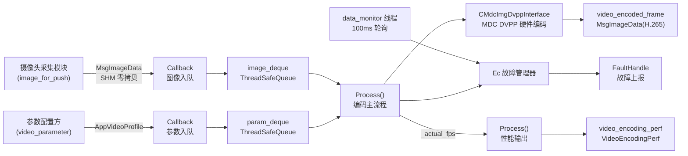
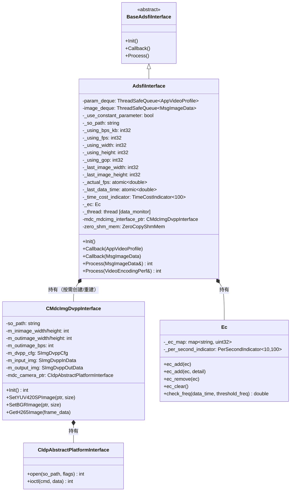
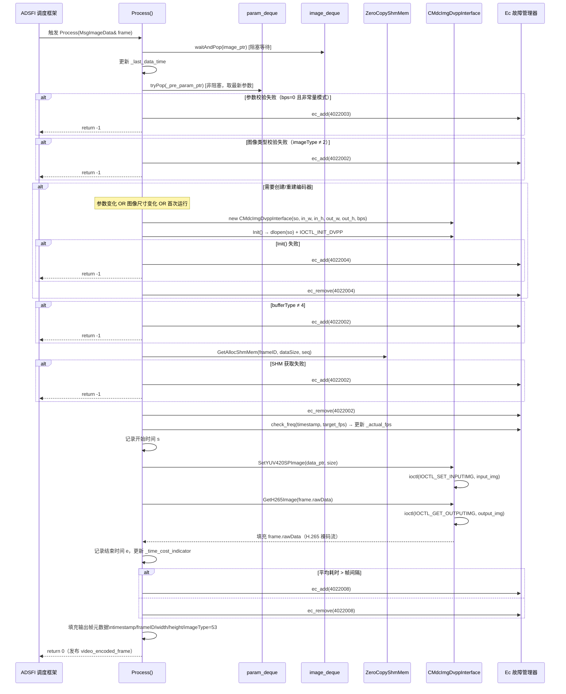
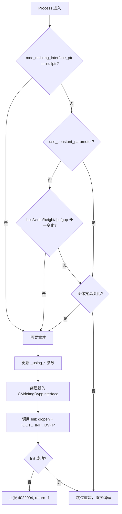
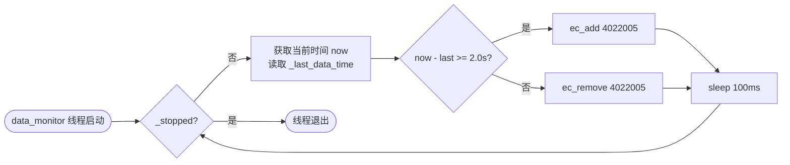
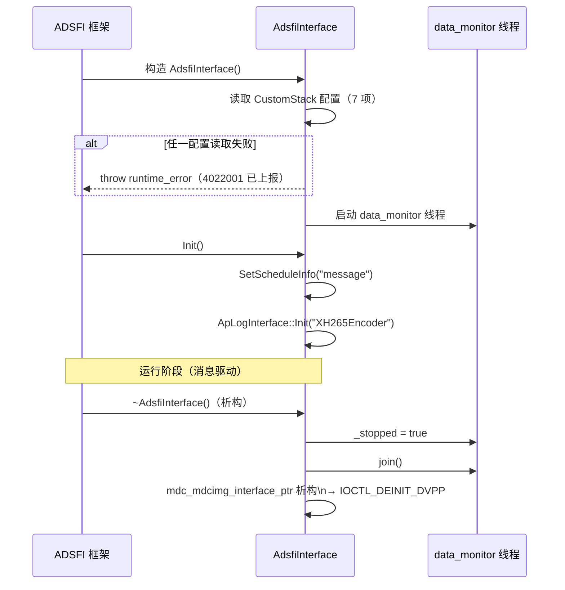
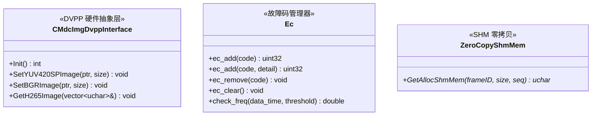
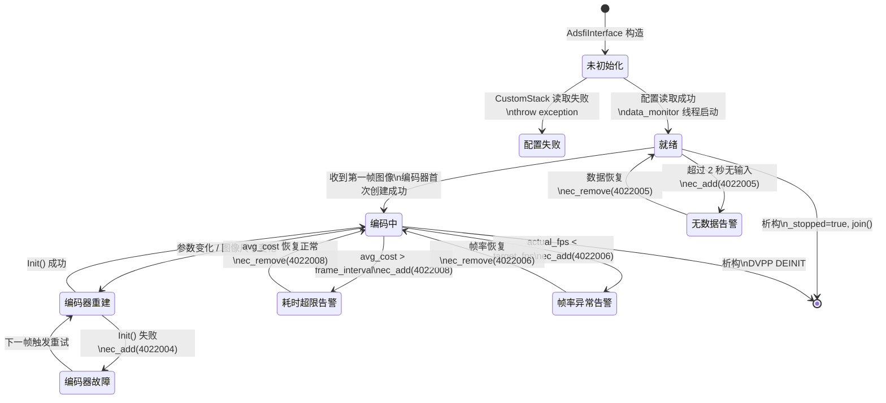

# xh265_encoder 设计文档

---

# 1. 文档信息

| 项目 | 内容 |
| :--- | :--- |
| **模块名称** | xh265_encoder |
| **模块编号** | MM-ENC-001 |
| **所属系统 / 子系统** | multimedia_model / 视频编码子系统 |
| **模块类型** | 平台模块 |
| **负责人** |  |
| **参与人** |  |
| **当前状态** | 草稿 |
| **版本号** | V1.0 |
| **创建日期** | 2026-03-03 |
| **最近更新** | 2026-03-03 |

---

# 2. 模块概述

## 2.1 模块定位

- **职责**：接收摄像头原始图像（YUV420SP 格式），通过 MDC 硬件 DVPP（Digital Video Pre-Processing）加速引擎编码为 H.265 裸码流，并将编码帧与性能指标向下游发布。
- **上游模块**：摄像头图像采集模块（通过 ADSFI 消息总线投递 `MsgImageData`，SHM 零拷贝）；编码参数配置方（通过 `video_parameter` 话题投递 `AppVideoProfile`）
- **下游模块**：xh265_recorder（消费 `video_encoded_frame`，写磁盘）；性能监控模块（消费 `video_encoding_perf`）
- **对外能力**：无 SDK/Service/API 对外暴露；仅通过 ADSFI 消息回调接收数据，通过配置文件控制行为

## 2.2 设计目标

- **功能目标**：将 YUV420SP 图像流实时硬件编码为 H.265 码流，支持动态编码参数热更新（码率、分辨率），输出带元数据的编码帧
- **性能目标**：编码平均耗时不超过帧间隔（默认 1000000/FPS µs）；通过滑动窗口（100 帧）监控平均耗时；实际帧率持续监控，低于目标帧率时上报故障
- **稳定性目标**：无数据超 2 秒、参数错误、编码器创建失败、编码超时等均有独立故障码上报；故障码限频防日志风暴
- **安全目标**：图像格式（imageType、bufferType）合法性在入口处校验，拒绝非法帧；所有 CustomStack 配置项读取失败时快速失败（throw 构造失败）
- **可维护性 / 可扩展性目标**：DVPP 硬件能力通过 SO 动态加载隔离，编码参数模式（常量/动态）可配置切换，新分辨率/码率无需修改代码

## 2.3 设计约束

- **硬件平台 / OS**：MDC（Mobile Data Center）平台，Linux；依赖 MDC DVPP 硬件编码加速单元
- **中间件 / 框架依赖**：ADSFI 框架（`BaseAdsfiInterface`、`MsgImageData`、`AppVideoProfile`）、CustomStack（配置读取）、FaultHandle（故障上报）、ApLog（日志）、ZeroCopyShmMem（SHM 零拷贝）
- **硬件驱动依赖**：`libimgdvpp_plugin_h265_v1_220.so`（DVPP H.265 编码插件，通过 `dlopen` 动态加载）；依赖 `CIdpAbstractPlatformInterface` ioctl 接口协议
- **兼容性约束**：输入仅接受 `imageType == 2`（YUV420SP）且 `bufferType == 4`（SHM 零拷贝缓冲区）；输出 `imageType == 53`（H.265）

---

# 3. 需求与范围

## 3.1 功能需求（FR）

| 需求ID | 描述 | 优先级 |
| :--- | :--- | :--- |
| FR-01 | 从 ADSFI `image_for_push` 话题接收 YUV420SP 图像，校验格式后入队 | 高 |
| FR-02 | 从 ADSFI `video_parameter` 话题接收编码参数（码率、宽、高），更新当前编码配置 | 高 |
| FR-03 | 支持"常量参数模式"：忽略动态参数，始终使用 CustomStack 中预配置的固定参数 | 高 |
| FR-04 | 支持"动态参数模式"：检测到参数变化（bps/width/height）或图像尺寸变化时热重建编码器 | 高 |
| FR-05 | 通过 MDC DVPP 硬件接口完成 YUV420SP → H.265 编码，输出裸码流 | 高 |
| FR-06 | 将编码结果（码流 + 元数据）通过 `video_encoded_frame` 话题发布 | 高 |
| FR-07 | 每 100ms 采样一次当前实际帧率，通过 `video_encoding_perf` 话题发布性能指标 | 中 |
| FR-08 | 后台数据监控线程：超过 2 秒无输入帧时上报无数据故障码 | 中 |
| FR-09 | 编码耗时滑动窗口均值超过帧间隔时上报耗时超限故障码 | 中 |
| FR-10 | 实际帧率低于目标帧率时上报频率异常故障码 | 中 |

## 3.2 非功能需求（NFR）

| 需求ID | 类型 | 指标 | 目标值 |
| :--- | :--- | :--- | :--- |
| NFR-01 | 性能 | 编码平均耗时 | ≤ 帧间隔（1,000,000 / FPS µs） |
| NFR-02 | 性能 | 耗时统计窗口 | 滑动窗口 100 帧 |
| NFR-03 | 稳定性 | 无数据超时告警阈值 | 2 秒 |
| NFR-04 | 稳定性 | 故障码上报频率限制 | 每触发 20 次上报 1 次（防日志风暴） |
| NFR-05 | 性能 | 帧率监控统计窗口 | 10 个统计桶，每桶 100ms |
| NFR-06 | 可靠性 | 图像数据获取方式 | SHM 零拷贝，避免大帧内存拷贝 |
| NFR-07 | 可靠性 | 编码器 SO 加载方式 | `dlopen` + `RTLD_LAZY` 动态加载，运行时隔离 |
| NFR-08 | 可靠性 | 构造失败处理 | 配置读取失败时抛出异常，快速失败，拒绝启动 |

## 3.3 范围界定（必须明确）

### 3.3.1 本模块必须实现：

- YUV420SP 格式图像的 H.265 硬件编码
- 编码参数（bps/fps/width/height/gop）的常量/动态两种模式管理
- 编码器按需热重建（参数变化 / 图像尺寸变化）
- 编码帧元数据填充与发布（timestamp、frameID、宽高、imageType=53 等）
- 后台数据监控与实际帧率统计
- 编码耗时超限与帧率异常的故障上报

### 3.3.2 本模块明确不做：

> （防止范围膨胀）

- 不做图像采集（由上游摄像头模块负责）
- 不做码流封装（MP4/TS 等容器格式，由下游录制模块负责）
- 不做软件编码（仅依赖 MDC DVPP 硬件加速）
- 不做多路并发编码（单实例、单路，多路需多实例部署）
- 不做编码质量评估（PSNR/SSIM 等）

## 3.4 需求-设计-验证映射（评审必查）

| 需求ID | 对应设计章节 | 对应接口 | 验证方式 / 用例 |
| :--- | :--- | :--- | :--- |
| FR-01 | 5.3 主流程 | `Callback(MsgImageData)` | TC-01 |
| FR-02 | 5.3 主流程 | `Callback(AppVideoProfile)` | TC-02 |
| FR-03 | 5.1 子模块 / 5.3 编码器重建 | `_use_constant_parameter` 配置分支 | TC-03 |
| FR-04 | 5.3 编码器重建流程 | `Process()` 参数比对逻辑 | TC-04 |
| FR-05 | 5.2 技术选型 | `CMdcImgDvppInterface` | TC-05 |
| FR-06 | 7.1 对外接口 | `Process(MsgImageData&)` | TC-06 |
| FR-07 | 7.1 对外接口 | `Process(VideoEncodingPerf&)` | TC-07 |
| FR-08 | 5.1 线程模型 | `data_monitor` 线程 | TC-08 |
| FR-09 | 5.3 耗时检测 | `_time_cost_indicator` | TC-09 |
| FR-10 | 5.3 帧率检测 | `Ec::check_freq()` | TC-10 |

---

# 4. 设计思路

## 4.1 方案概览

xh265_encoder 以 ADSFI 消息驱动模型为基础，核心链路为：

1. **图像入队**：回调函数 `Callback(MsgImageData)` 将帧指针入队（非阻塞），与编码处理完全解耦
2. **参数入队**：回调函数 `Callback(AppVideoProfile)` 将参数指针入队，Process 中 `tryPop`（不阻塞，用最新值）
3. **编码驱动**：`Process(MsgImageData&)` 由 ADSFI 调度框架以 `message` 模式触发，每帧调用一次，执行完整编码流程
4. **硬件封装**：MDC DVPP 能力被封装在 `CMdcImgDvppInterface` 中，通过 SO 动态加载隔离平台差异
5. **监控输出**：`Process(VideoEncodingPerf&)` 以 100ms 定时触发，读取原子变量 `_actual_fps` 输出性能快照



## 4.2 关键决策与权衡

| 决策点 | 选择 | 理由 |
| :--- | :--- | :--- |
| 编码参数模式 | 常量/动态可配置切换 | 开发调试期用常量参数，量产后由上层动态控制；一套代码两种场景 |
| 编码器热重建 | 参数或图像尺寸变化时重建 | DVPP 不支持运行时修改参数，重建是唯一可行路径；重建有短暂停顿，可接受 |
| SHM 零拷贝 | `ZeroCopyShmMem::GetAllocShmMem()` | 图像帧大（1280×720 YUV420 = 1.3MB），拷贝代价高；零拷贝直接映射硬件内存 |
| 图像/参数解耦队列 | 图像 `waitAndPop`，参数 `tryPop` | 图像帧是主驱动，必须等待；参数可能低频更新，`tryPop` 保留最新值即可 |
| SO 动态加载 | `dlopen(RTLD_LAZY)` | DVPP 插件与平台强绑定，动态加载允许不同版本 SO 热替换，不影响业务二进制 |
| 故障码限频 | 每 20 次触发上报 1 次 | 防止高频编码失败时产生日志风暴，同时保证故障可被感知 |

## 4.3 与现有系统的适配

- **ADSFI 框架**：继承 `BaseAdsfiInterface`，实现 `Init()`/`Callback()`/`Process()` 三类接口，由框架负责消息订阅、调度和发布
- **CustomStack 配置**：所有可调参数通过 `media/video/encoder/` 前缀统一管理，与平台配置中心解耦
- **FaultHandle**：通过 `Ec` 类统一封装故障码的增/减/清，调用 `FaultApi::Instance()->SetFaultCode()`，与系统诊断模块对接

## 4.4 失败模式与降级

- **配置读取失败**：构造函数抛出异常，进程启动失败，不进入运行态（快速失败，避免带病运行）
- **编码器初始化失败**：`Process()` 返回 `-1`，上报 4022004，跳过当前帧；下一帧到来时重试创建
- **SHM 数据获取失败**：上报 4022002，返回 `-1`，跳过当前帧
- **编码耗时超限**：仅上报 4022008 告警，**不丢帧**，允许短暂超限；若长期超限，由外部监控决策是否降帧率
- **无数据输入**：`data_monitor` 线程上报 4022005，系统可据此触发重启或告警
- **帧率偏低**：上报 4022006，继续编码，不主动丢帧

---

# 5. 架构与技术方案

## 5.1 模块内部架构



**线程模型：**

| 线程名 | 触发方式 | 职责 |
| :--- | :--- | :--- |
| `data_monitor` | 构造时创建，100ms 轮询 | 检测 `_last_data_time`，超 2 秒无更新则上报 4022005 |
| 编码主线程（ADSFI 调度）| `message` 模式，图像帧到达时触发 | 执行完整编码流程，驱动 DVPP，填充输出帧 |
| 性能输出线程（ADSFI 调度）| 100ms 定时触发 | 读取 `_actual_fps` 原子变量，发布 `VideoEncodingPerf` |

## 5.2 关键技术选型

| 技术点 | 方案 | 选择原因 | 备选方案 |
| :--- | :--- | :--- | :--- |
| 硬件编码 | MDC DVPP（`CIdpAbstractPlatformInterface` + SO 插件） | MDC 平台原生硬件加速，帧率/延迟性能远优于软件编码 | x264/x265 软件编码（CPU 占用高，不可接受） |
| SO 加载 | `dlopen(RTLD_LAZY)` | 运行时隔离，支持版本替换，不污染主进程符号表 | 静态链接（绑定版本，部署灵活性差） |
| 图像传递 | SHM 零拷贝（`ZeroCopyShmMem`） | 大帧数据（~1.3MB/帧@720P 30fps = ~40MB/s）零拷贝降低内存带宽压力 | 消息体内嵌（拷贝代价大，不可接受） |
| 耗时统计 | `TimeCostIndicator<100>` 滑动窗口均值 | 平滑瞬时抖动，反映编码器长期性能趋势 | 单帧瞬时值（抖动大，误报多） |
| 帧率统计 | `PerSecondIndicator<10, 100>` | 10 个 100ms 统计桶，覆盖 1 秒历史，计算实际 FPS | 简单计数器（无时间权重，精度差） |
| 参数模式切换 | `_use_constant_parameter` bool 配置 | 编译一套代码，运行时配置切换，兼顾调试和量产场景 | 条件编译（维护成本高） |

## 5.3 核心流程

### 主编码流程



### 编码器重建判断逻辑



### 数据监控线程流程



### 启动 / 退出流程



---

# 6. 界面设计

> 本模块为纯后端编码服务，无用户界面，跳过此节。

---

# 7. 接口设计（评审重点）

## 7.1 对外接口

| 接口名 | 类型 | 输入 | 输出 | 频率 | 备注 |
| :--- | :--- | :--- | :--- | :--- | :--- |
| `video_parameter` | Topic/Sub | `AppVideoProfile`（manual_bps、manual_width、manual_height） | — | 低频（参数变化时） | 动态模式下使用；常量模式下接收但忽略 |
| `image_for_push` | Topic/Sub | `MsgImageData`（YUV420SP，SHM 零拷贝） | — | 30fps（目标） | imageType=2，bufferType=4 |
| `video_encoded_frame` | Topic/Pub | — | `MsgImageData`（H.265 裸码流） | 与输入帧同频 | imageType=53，bufferType=0 |
| `video_encoding_perf` | Topic/Pub | — | `VideoEncodingPerf`（fps） | 10fps（100ms/次） | 实际编码帧率 |

## 7.2 对内接口



- `CMdcImgDvppInterface`：单路编码器实例，`Process()` 按需创建/重建；非线程安全，仅在编码主线程调用
- `Ec`：内部线程安全（自带 `_mtx`），`data_monitor` 线程与编码主线程均可调用
- `ZeroCopyShmMem`：帧数据零拷贝访问；每次 `Process()` 调用一次，持有 `AdsfiInterface` 生命周期

## 7.3 接口稳定性声明

- **稳定接口**：话题名 `image_for_push`、`video_parameter`、`video_encoded_frame`、`video_encoding_perf`；`AppVideoProfile` 中 `manual_bps`/`manual_width`/`manual_height` 字段；`MsgImageData` 中 `imageType=53` 输出约定 — **变更必须评审**
- **非稳定接口**：`CMdcImgDvppInterface` 内部实现（允许随 SO 版本升级调整）；`Ec` 类实现（内部统计逻辑）

## 7.4 接口行为契约（必须填写）

### `Process(MsgImageData& frame)` — 编码主接口

- **前置条件**：`image_deque` 非空（框架保证 message 模式下有数据才触发）；`_pre_param_ptr` 首次可为 nullptr（内部有默认值兜底）
- **后置条件**：`frame.rawData` 填充 H.265 裸码流；`frame.imageType == 53`；`frame.timestamp` 与输入帧一致
- **是否阻塞**：是（`waitAndPop` 阻塞等待图像帧，框架 message 模式下等同于同步调用）
- **可重入**：否（单线程调用，`mdc_mdcimg_interface_ptr` 非线程安全）
- **最大执行时间**：目标 ≤ 33,333µs（30fps 帧间隔）；超限上报 4022008 但不中断
- **失败语义**：返回 `-1` 表示跳过当前帧；对应故障码已通过 `Ec` 上报；框架不发布本次输出帧

### `Process(VideoEncodingPerf& frame)` — 性能输出接口

- **前置条件**：无（`_actual_fps` 原子变量始终有效）
- **后置条件**：`frame.fps` 填充最近 1 秒实际编码帧率
- **是否阻塞**：是（内含 `sleep_for(100ms)`，用于限制输出频率）
- **最大执行时间**：约 100ms
- **失败语义**：始终返回 0，不上报故障

---

# 8. 数据设计

## 8.1 数据结构

### 输入数据

| 字段 | 类型 | 说明 |
| :--- | :--- | :--- |
| `MsgImageData.imageType` | uint8 | 输入期望值 = 2（YUV420SP） |
| `MsgImageData.bufferType` | uint8 | 输入期望值 = 4（SHM 零拷贝） |
| `MsgImageData.width` | uint32 | 图像宽度（像素） |
| `MsgImageData.height` | uint32 | 图像高度（像素） |
| `MsgImageData.dataSize` | uint32 | SHM 数据大小（字节，YUV420SP = w×h×3/2） |
| `MsgImageData.frameID` | string | 帧唯一标识（用于 SHM 索引） |
| `MsgImageData.seq` | uint32 | 帧序号 |
| `MsgImageData.timestamp` | — | 帧采集时间戳（透传至输出） |
| `AppVideoProfile.manual_bps` | int32 | 目标码率（kbps） |
| `AppVideoProfile.manual_width` | int32 | 目标输出宽度（像素） |
| `AppVideoProfile.manual_height` | int32 | 目标输出高度（像素） |

### 输出数据

| 字段 | 类型 | 说明 |
| :--- | :--- | :--- |
| `MsgImageData.imageType` | uint8 | 输出固定值 = 53（H.265） |
| `MsgImageData.bufferType` | uint8 | 输出固定值 = 0（内存拷贝） |
| `MsgImageData.rawData` | vector\<uchar\> | H.265 裸码流（Annex B 格式，由 DVPP 产生） |
| `MsgImageData.frameID` | string | `"encoded_h265_" + seq` |
| `MsgImageData.width` | uint32 | 编码输出宽度 |
| `MsgImageData.height` | uint32 | 编码输出高度 |
| `MsgImageData.dataSize` | uint32 | `rawData.size()`（字节） |
| `MsgImageData.timestamp` | — | 透传自输入帧 |
| `MsgImageData.seq` | uint32 | 透传自输入帧 |
| `MsgImageData.mbufData` | uint64 | 固定 0（不使用 mbuf） |
| `VideoEncodingPerf.fps` | double | 最近 1 秒实际编码帧率 |

### DVPP 硬件配置（`SImgDvppCfg`）

| 字段 | 值 | 说明 |
| :--- | :--- | :--- |
| `m_inputtype` | `IMGTYPE_YUV420NV12` | 输入格式 |
| `m_outputtype` | `IMGTYPE_H265` | 输出格式 |
| `m_inwidth / m_inheight` | 图像实际宽高 | 来自 `image_ptr` |
| `m_outwidth / m_outheight` | 编码目标宽高 | 来自参数配置 |
| `m_outbps` | 目标码率（kbps） | 来自参数配置 |

### 编码器默认参数（`mdc_h265_usr_config.json`）

| 参数 | 值 | 说明 |
| :--- | :--- | :--- |
| `rc_mode` | CBR | 恒定码率模式 |
| `gop` | 30 | GOP 大小 |
| `dst_frame_rate` | 30 | 目标帧率 |
| `max_qp / min_qp` | 47 / 22 | QP 范围 |
| `max_i_qp / min_i_qp` | 47 / 36 | I 帧 QP 范围 |
| `max_bit_rate_ratio` | 0.8 | 最大码率比例 |
| `max_reencode_times` | 2 | 最大重编次数 |

## 8.2 状态机



## 8.3 数据生命周期

- **图像帧（SHM）**：上游采集模块分配 SHM，`MsgImageData` 携带引用信息（frameID/dataSize/seq）；`ZeroCopyShmMem::GetAllocShmMem()` 映射 SHM 指针；`SetYUV420SPImage()` 将指针传入 DVPP；`GetH265Image()` 调用返回后 SHM 数据即可释放
- **编码输出帧（rawData）**：`GetH265Image()` 内部 `memcpy` 从 DVPP 输出缓冲区拷贝至 `frame.rawData`（`vector<uchar>`），由 ADSFI 框架管理发布生命周期
- **编码器实例**：`shared_ptr<CMdcImgDvppInterface>` 管理，参数变化时原有实例析构（触发 `IOCTL_DEINIT_DVPP`），新实例创建

---

# 9. 异常与边界处理（评审必查）

| 异常场景 | 检测方式 | 处理策略 | 是否可恢复 | 上报方式 |
| :--- | :--- | :--- | :--- | :--- |
| CustomStack 配置项缺失或非法 | 构造时读取返回 false 或值为 0 | 抛出异常，进程拒绝启动 | 否（需修复配置重启） | ec_add(4022001) + throw |
| 图像 imageType 非 2 | `image_ptr->imageType != 2` | 丢帧 + 告警，返回 -1 | 是（等待正确帧） | ec_add(4022002) |
| 图像 bufferType 非 4 | `image_ptr->bufferType != 4` | 丢帧 + 告警，返回 -1 | 是（等待正确帧） | ec_add(4022002) |
| SHM 数据获取失败 | `GetAllocShmMem()` 返回 nullptr | 丢帧 + 告警，返回 -1 | 是（SHM 可能临时不可用） | ec_add(4022002) |
| 编码参数 bps=0（动态模式） | `_pre_param_ptr->manual_bps == 0` | 丢帧 + 告警，返回 -1 | 是（等待有效参数） | ec_add(4022003) |
| 编码参数值非法（≤0） | 重建阶段各参数校验 | 丢帧 + 告警，返回 -1 | 是（等待有效参数） | ec_add(4022003) |
| DVPP SO 加载失败 | `mdc_camera_ptr->open()` 返回 <0 | 丢帧 + 告警，返回 -1；下一帧重试 | 是（SO 路径修复后） | ec_add(4022004) |
| DVPP INIT ioctl 失败 | `IOCTL_INIT_DVPP` 返回 <0 | 丢帧 + 告警，返回 -1；下一帧重试 | 是（硬件临时故障） | ec_add(4022004) |
| 编码耗时超帧间隔 | `_time_cost_indicator.avg() > frame_interval` | 仅告警，不丢帧，继续编码 | 是（负载降低后自动恢复） | ec_add(4022008) |
| 超 2 秒无输入帧 | `data_monitor` 线程比对时间差 | 持续上报告警，等待数据恢复 | 是（数据恢复后自动清除） | ec_add(4022005) |
| 实际帧率低于目标 | `Ec::check_freq()` 均值比对 | 仅告警，不干预编码流程 | 是（帧率恢复后自动清除） | ec_add(4022006) |
| param_ptr 意外为 nullptr | `__glibc_unlikely` 检测 | 打印 error 日志，返回 -1 | 是（下一帧正常时恢复） | ApError 日志 |

---

# 10. 性能与资源预算（必须可验收）

## 10.1 性能指标

| 场景 | 指标 | 目标值 | 测试方法 |
| :--- | :--- | :--- | :--- |
| 1280×720 @30fps YUV420SP → H.265 | 单帧编码耗时（均值） | ≤ 33,333 µs | `_time_cost_indicator.avg()` 持续监控 |
| 1920×1080 @30fps YUV420SP → H.265 | 单帧编码耗时（均值） | ≤ 33,333 µs | 同上 |
| 编码帧率 | 实际 FPS | ≥ 28fps（目标 30fps ±2 容差） | `VideoEncodingPerf.fps` 观测 |
| 编码器首次创建耗时 | Init 时延 | 可接受（<500ms） | 日志时间戳差值 |
| 编码器热重建耗时 | 重建时延 | 可接受（<500ms，不影响后续帧） | 日志时间戳差值 |

## 10.2 资源预算

| 资源 | 常态 | 峰值 | 上限约束 |
| :--- | :--- | :--- | :--- |
| CPU（编码主线程） | < 5%（硬件编码，CPU 仅做调度） | < 15%（编码器重建时） | 30% |
| CPU（data_monitor 线程） | < 0.1%（100ms 轮询） | < 0.5% | 1% |
| 内存（rawData 输出缓冲） | ~200KB（典型 H.265 帧） | ~1MB（I 帧） | 5MB |
| 内存（image/param 队列） | < 10MB（SHM 引用，非数据拷贝） | < 20MB | 50MB |
| SO 动态库内存 | ~50MB（DVPP 硬件驱动） | ~50MB | 100MB |

---

# 11. 构建与部署

## 11.1 环境依赖

| 依赖项 | 版本要求 | 说明 |
| :--- | :--- | :--- |
| 操作系统 | Linux（MDC 平台） | 依赖 POSIX 线程、dlopen |
| C++ | C++17 | 使用 std::filesystem、std::atomic |
| pthread | 系统库 | data_monitor 线程 |
| dl | 系统库 | dlopen 动态加载 SO |
| fmt | 任意稳定版 | 格式化日志字符串 |
| yaml / yaml-cpp | 任意稳定版 | CustomStack 配置解析 |
| glog | 任意稳定版 | 日志输出 |
| MDC DVPP SDK | v1.220+ | `CIdpAbstractPlatformInterface`、`SImgDvppCfg` 等结构体 |
| libimgdvpp_plugin_h265_v1_220.so | v1.220 | H.265 硬件编码插件（运行时加载） |

## 11.2 构建步骤

### 依赖安装

- ADSFI 框架头文件、CustomStack、FaultHandle、ApLog、ZeroCopyShmMem 均通过工程统一管理
- MDC DVPP SDK 由平台 SDK 包提供

### 构建命令

```cmake
# model.cmake 定义
set(MODULE1_SOURCES adsfi_interface/adsfi_interface.cpp)
set(MODULE1_INCLUDE_DIRS adsfi_interface/ impl/ .)
set(MODULE1_LIBS pthread dl fmt yaml yaml-cpp glog)
```

```bash
# 由上层 CMakeLists.txt 包含
cmake -B build && cmake --build build
```

### 构建产物

- 产物：ADSFI 模块动态库（由框架决定产物路径）
- SO 插件（运行时依赖）：`config/libimgdvpp_plugin_h265_v1_220.so`

## 11.3 配置项

| 配置项（CustomStack Key） | 说明 | 默认值 | 是否必须 | 来源 |
| :--- | :--- | :--- | :--- | :--- |
| `media/video/encoder/so_path` | DVPP 插件 SO 路径（绝对路径或相对 config/ 目录） | 无 | **是** | 工程配置文件 |
| `media/video/encoder/use_constant_parameter` | true=使用固定参数，false=使用动态参数 | false | **是** | 工程配置文件 |
| `media/video/encoder/constant_bps` | 常量模式码率（kbps） | 1024 | **是** | 工程配置文件 |
| `media/video/encoder/constant_fps` | 常量模式帧率 | 30 | **是** | 工程配置文件 |
| `media/video/encoder/constant_width` | 常量模式输出宽度（像素） | 1280 | **是** | 工程配置文件 |
| `media/video/encoder/constant_height` | 常量模式输出高度（像素） | 720 | **是** | 工程配置文件 |
| `media/video/encoder/constant_gop` | 常量模式 GOP 大小 | 30 | **是** | 工程配置文件 |

> 所有配置项均为必须项，任一缺失或值非法（≤0）将导致构造失败，进程拒绝启动。

## 11.4 部署结构与启动

### 部署目录结构

```text
<node_config_path>/
├── config/
│   ├── mdc_h265_usr_config.json          # DVPP 编码器参数（QP/GOP/CBR 等）
│   └── libimgdvpp_plugin_h265_v1_220.so  # H.265 硬件编码 SO 插件
└── <module_binary>                        # ADSFI 模块主程序
```

### 启动 / 停止

- 启动：由 ADSFI 框架管理，读取 `mdc_h265_usr_config.json` 完成 DVPP 初始化
- 停止：框架析构 `AdsfiInterface`，`_stopped=true` 使 `data_monitor` 退出，`IOCTL_DEINIT_DVPP` 释放硬件资源
- 进程管理：由 ADSFI 平台进程管理器负责

## 11.5 健康检查与启动验证

- **启动成功标志**：日志输出 `h265_encoder so_path: ...`、`h265_encoder use_constant_parameter: ...` 等 7 条配置打印，且无 4022001 告警
- **运行健康标志**：`VideoEncodingPerf.fps` 接近目标帧率；故障码 4022004/4022005/4022006/4022008 均无持续告警
- **启动超时**：DVPP `Init()` 应在 500ms 内完成；超时视为硬件异常

## 11.6 升级与回滚

- **SO 插件升级**：替换 `config/libimgdvpp_plugin_h265_v1_220.so`，重启进程即生效（`dlopen` 在每次编码器重建时重新加载）
- **配置升级**：修改 `mdc_h265_usr_config.json`，重启进程生效
- **回滚**：保留旧版 SO 文件，替换后重启即可回滚
- **新旧版本兼容**：输出话题 `video_encoded_frame` 的 `imageType=53` 约定不变，下游 xh265_recorder 无需同步升级

---

# 12. 可测试性与验证

## 12.1 单元测试

- **覆盖范围**：
  - `Ec` 类：`ec_add` 计数、`ec_remove` 清除、`check_freq` 帧率计算
  - 编码参数校验逻辑：bps/fps/width/height/gop 非法值路径
  - 编码器重建触发条件：参数变化 / 图像尺寸变化 / 首次创建
  - 常量参数模式 vs 动态参数模式路径分支
- **Mock / Stub 策略**：
  - `CMdcImgDvppInterface` → Mock（返回固定大小 H.265 码流）
  - `CustomStack::Instance()` → Stub（返回预设配置）
  - `ZeroCopyShmMem::GetAllocShmMem()` → Stub（返回固定缓冲区）
  - `FaultHandle::FaultApi` → Mock（记录故障码调用）

## 12.2 集成测试

- **上游联调**：与摄像头采集模块联调，验证 `image_for_push` SHM 零拷贝帧正常接收与编码
- **下游联调**：与 `xh265_recorder` 联调，验证输出码流可被正确写入磁盘并可播放
- **参数更新联调**：动态模式下，修改 `video_parameter` 话题参数，验证编码器热重建后输出分辨率/码率变化

## 12.3 可观测性

- **日志**：
  - 构造时打印所有 7 个配置参数值（INFO 级）
  - 编码器创建/重建时打印新旧参数（INFO 级）
  - 每帧编码后打印 timestamp 和 dataSize（INFO 级）
  - 异常路径打印 ERROR 级日志（imageType 错误、bps 非法、SHM 失败等）
- **监控指标**：
  - `VideoEncodingPerf.fps`：实际编码帧率（10fps 周期输出）
  - 故障码：4022001~4022008（通过 FaultHandle 上报）
- **Debug 接口**：无独立 Debug 接口；可通过调整日志级别开启更详细的编码帧 Hex 输出（代码中已注释）

---

# 13. 测试用例清单

| ID | 对应需求 | 测试项目 | 测试步骤 | 预期结果 | 测试结果 |
| :--- | :--- | :--- | :--- | :--- | :--- |
| TC-01 | FR-01 | 正常图像帧入队 | 发布 imageType=2、bufferType=4 的 MsgImageData | 帧入队，`_last_data_time` 更新 | |
| TC-02 | FR-02 | 动态参数接收 | 发布 AppVideoProfile(bps=2048, w=1920, h=1080) | param_deque 有值，下次 Process 触发编码器重建 | |
| TC-03 | FR-03 | 常量参数模式 | 配置 use_constant_parameter=true，发布不同 AppVideoProfile | 编码参数不变，以 constant_* 配置为准 | |
| TC-04 | FR-04 | 动态参数触发重建 | 动态模式下，发布 bps 变化的 AppVideoProfile | 编码器重建，日志打印 "recreate encoder" | |
| TC-05 | FR-05 | H.265 编码输出 | 正常输入 720P YUV420SP 帧 | 输出 rawData 非空，imageType=53 | |
| TC-06 | FR-06 | 输出帧元数据 | 正常编码后检查输出帧字段 | timestamp 与输入一致；frameID="encoded_h265_N"；width/height 为编码输出尺寸 | |
| TC-07 | FR-07 | 性能输出 | 调用 Process(VideoEncodingPerf) | 约 100ms 返回，fps 接近实际帧率 | |
| TC-08 | FR-08 | 无数据超时告警 | 停止发布图像帧超过 2 秒 | 4022005 故障码上报 | |
| TC-09 | FR-09 | 编码耗时超限告警 | Mock DVPP 使 GetH265Image 耗时超过帧间隔 | 4022008 故障码上报 | |
| TC-10 | FR-10 | 帧率低于目标告警 | 以低于 target_fps 的频率发布图像帧 | 4022006 故障码上报 | |
| TC-11 | FR-01 | 非法图像类型拒绝 | 发布 imageType=1 的帧 | 返回 -1，4022002 上报，帧丢弃 | |
| TC-12 | FR-01 | 非法 bufferType 拒绝 | 发布 bufferType=0 的帧 | 返回 -1，4022002 上报，帧丢弃 | |
| TC-13 | FR-08 | 配置读取失败 | 删除 CustomStack 中 so_path 配置 | 构造抛出异常，4022001 上报，进程拒绝启动 | |
| TC-14 | FR-04 | 图像尺寸变化触发重建 | 先发送 720P 帧，再发送 1080P 帧 | 第二帧时编码器重建，输出尺寸变化 | |
| TC-15 | NFR-04 | 故障码限频 | 连续发送 100 帧非法格式 | FaultHandle 仅被调用 5 次（每 20 次触发 1 次） | |

---

# 14. 风险分析（设计评审核心）

| 风险 | 影响 | 可能性 | 应对措施 |
| :--- | :--- | :--- | :--- |
| MDC DVPP 硬件初始化失败 | 无法编码，服务中断 | 低 | ec_add(4022004) 上报；下一帧重试；监控持续触发时人工介入 |
| 编码参数频繁变化导致频繁重建 | 编码中断抖动，帧丢失 | 中 | 业务层应避免高频参数变化；重建日志可辅助排查 |
| SHM 零拷贝地址失效 | 当前帧丢失 | 低 | ec_add(4022002) 上报；下一帧正常时自动恢复 |
| 编码耗时长期超帧间隔 | 实际帧率下降，下游码流断续 | 中 | 4022008 持续告警；可降低分辨率/码率缓解；硬件性能瓶颈需平台层优化 |
| SO 动态加载路径错误 | 进程无法启动编码 | 低 | 构造时配置校验；Init() 失败时清晰日志定位路径问题 |
| data_monitor 线程与编码主线程 `_ec_mtx` 竞争 | 编码主线程短暂延迟 | 低 | `_ec_mtx` 持锁时间极短（仅 map 操作），影响可忽略 |
| FPS 固定为 30（代码中 `const FPS=30`，忽略参数） | 动态 FPS 参数无效 | 现有设计如此 | 当前代码注释 `/*_pre_param_ptr->encoding_parameter.fps*/`，如需支持动态 FPS 需评审变更 |

---

# 15. 设计评审

## 15.1 评审 Checklist

- [ ] 需求是否完整覆盖（FR-01 ~ FR-10 均有对应设计）
- [ ] 接口是否清晰稳定（话题名、imageType=53 等约定明确）
- [ ] 异常路径是否完整（9 类异常场景均有处理）
- [ ] 性能 / 资源是否有上限（编码耗时、CPU/内存均有预算）
- [ ] 构建与部署步骤是否完整可执行
- [ ] 是否存在过度设计
- [ ] 测试用例是否覆盖所有功能需求和非功能需求
- [ ] FPS 固定为 30 的设计约束是否已知悉并接受（FR-04 中 fps/gop 实际未从参数读取）

## 15.2 评审记录

| 日期 | 评审人 | 问题 | 结论 | 备注 |
| :--- | :--- | :--- | :--- | :--- |
| | | | | |
| | | | | |

---

# 16. 变更管理（重点）

## 16.1 变更原则

- 不允许口头变更
- 接口 / 行为变更必须记录

## 16.2 变更分级

| 级别 | 示例 | 是否需要评审 |
| :--- | :--- | :--- |
| L1 | 注释 / 日志 | 否 |
| L2 | Ec 故障码阈值调整、data_monitor 超时时间调整 | 是 |
| L3 | 话题名变更、输出 imageType 值变更、参数模式逻辑变更、DVPP ioctl 协议变更 | 是（系统级） |

## 16.3 变更记录

| 版本 | 变更内容 | 影响分析 | 评审人 |
| :--- | :--- | :--- | :--- |
| V1.0 | 初始设计文档创建 | — | |
| | | | |

---

# 17. 交付与冻结

## 17.1 设计冻结条件

- [ ] 所有接口有对应测试用例（TC-01 ~ TC-15）
- [ ] 所有 NFR 有验证方案（编码耗时通过日志 / `VideoEncodingPerf` 可验）
- [ ] 异常路径已覆盖（9 类异常场景）
- [ ] 构建与部署文档可执行验证通过
- [ ] FPS 固定为 30 的已知约束已评审确认（或完成动态 FPS 支持变更）
- [ ] 变更影响分析完成

## 17.2 设计与交付物映射

- 设计文档 ↔ `adsfi_interface/adsfi_interface.cpp` / `impl/XX264EncodingInMdc.hpp`
- 接口文档 ↔ `config/mdc_h265_usr_config.json`（DVPP 编码参数）
- 测试用例 ↔ TC-01 ~ TC-15

---

# 18. 附录

## 术语表

| 术语 | 说明 |
| :--- | :--- |
| DVPP | Digital Video Pre-Processing，MDC 平台的硬件视频处理加速单元 |
| YUV420SP / NV12 | 半平面 YUV 4:2:0 格式，UV 平面交错排列，数据量 = W×H×3/2 字节 |
| H.265 / HEVC | 高效视频编码标准（ITU-T H.265 / ISO/IEC 23008-2） |
| CBR | Constant Bit Rate，恒定码率模式 |
| GOP | Group of Pictures，关键帧组，决定 I 帧间隔 |
| SHM | Shared Memory，共享内存，用于零拷贝图像传递 |
| ADSFI | 自动驾驶软件框架接口，提供消息订阅/发布和模块调度能力 |
| imageType=2 | ADSFI 中 YUV420SP 格式标识 |
| imageType=53 | ADSFI 中 H.265 编码帧格式标识 |
| bufferType=4 | ADSFI 中 SHM 零拷贝缓冲区类型标识 |

## 参考文档

- MDC DVPP SDK 开发手册
- ADSFI 框架接口规范
- ITU-T H.265 标准文档
- `impl/XX264EncodingInMdc.hpp`：DVPP 接口封装实现
- `adsfi_interface/adsfi_interface.cpp`：编码主逻辑实现
- `config/mdc_h265_usr_config.json`：编码器默认参数配置

## 历史版本记录

| 版本 | 日期 | 说明 |
| :--- | :--- | :--- |
| V1.0 | 2026-03-03 | 初始版本，基于代码分析生成 |
