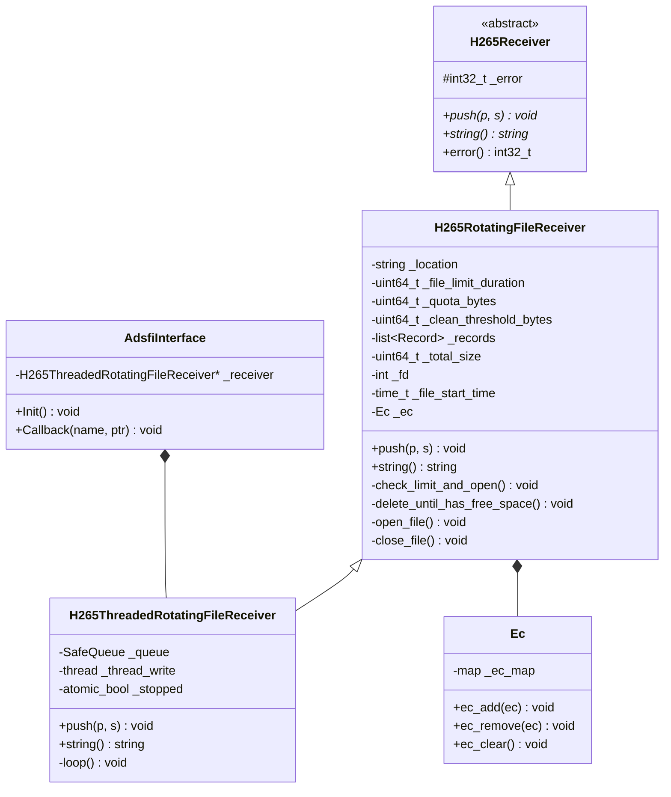
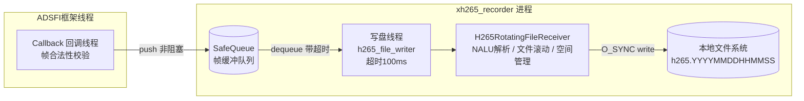
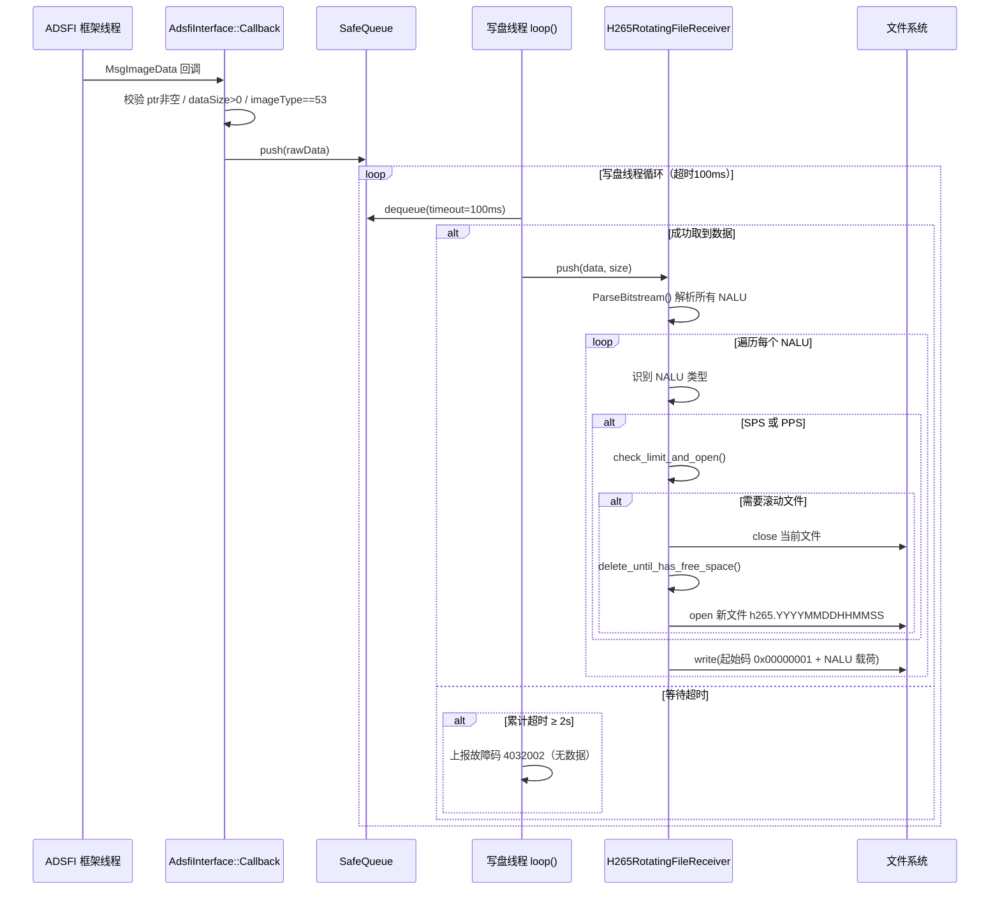
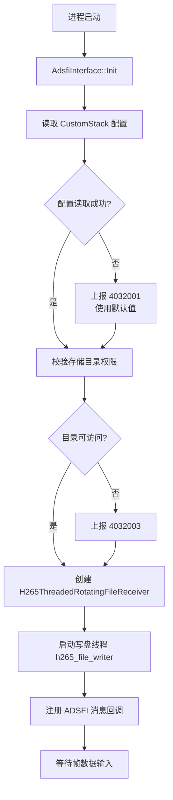
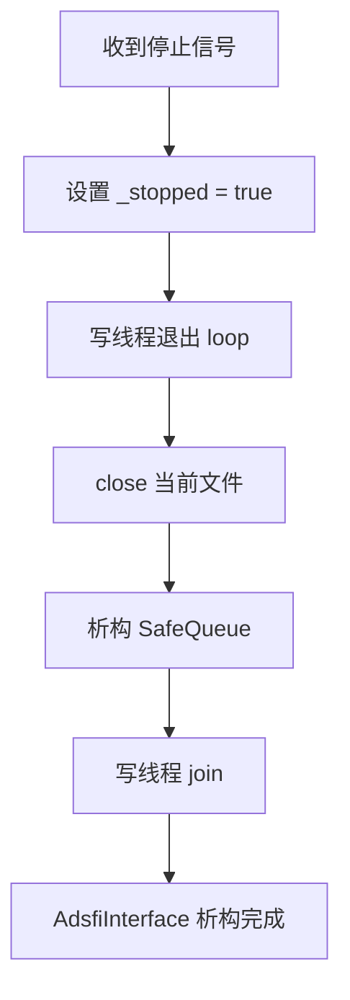
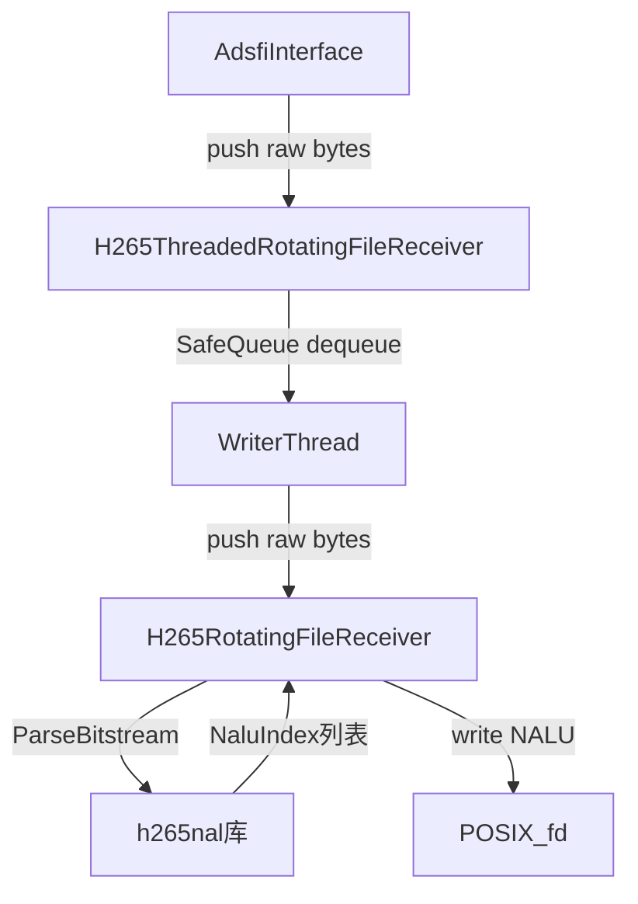
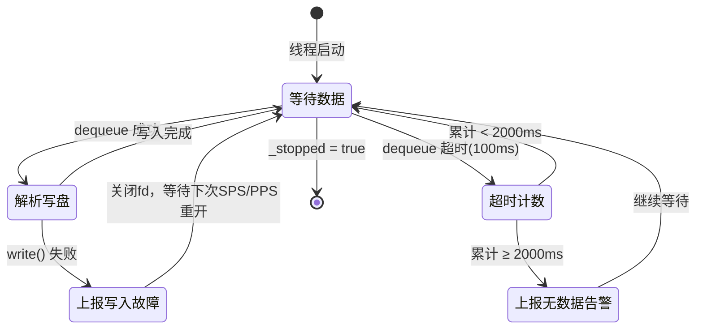
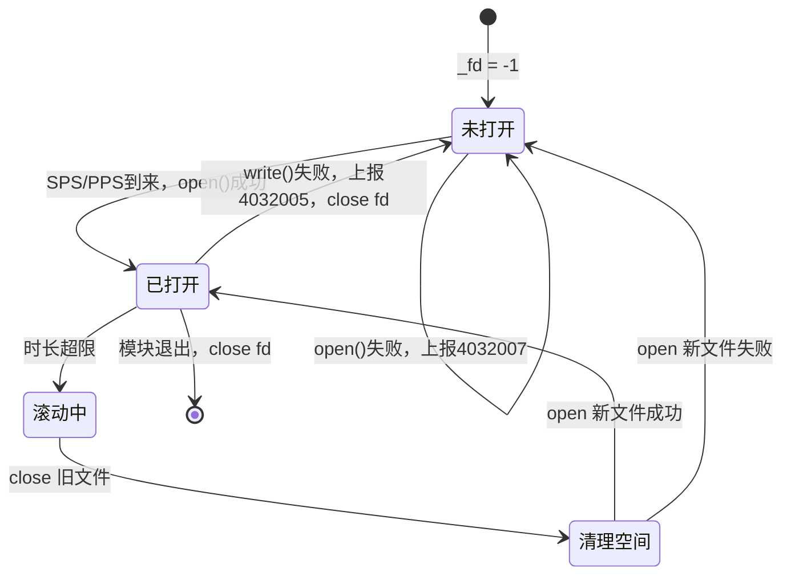

# xh265_recorder 设计文档

---

# 1. 文档信息

| 项目 | 内容 |
| :--- | :--- |
| **模块名称** | xh265_recorder |
| **模块编号** | MM-REC-001 |
| **所属系统 / 子系统** | multimedia_model / 视频录制子系统 |
| **模块类型** | 平台模块 |
| **负责人** |  |
| **参与人** |  |
| **当前状态** | 草稿 |
| **版本号** | V1.0 |
| **创建日期** | 2026-03-03 |
| **最近更新** | 2026-03-03 |

---

# 2. 模块概述

## 2.1 模块定位

- **职责**：接收 ADSFI 框架推送的 H.265 裸码流帧数据，解析 NAL Unit，按时长滚动写入本地磁盘文件，并对存储空间实施配额管控与自动清理。
- **上游模块**：摄像头图像采集 / H.265 编码器（通过 ADSFI 消息总线投递 `MsgImageData`）
- **下游模块**：无（直接落盘，文件由外部工具或触发录制模块消费）
- **对外能力**：无 SDK/Service/API 对外暴露；仅通过 ADSFI 消息回调接收数据，通过配置文件管理行为

## 2.2 设计目标

- **功能目标**：将连续的 H.265 码流按固定时长分段滚动存储为本地文件，支持磁盘配额管理与旧文件自动清理
- **性能目标**：回调写入非阻塞（SafeQueue 缓冲），写盘与帧采集解耦；写线程支持 100ms 超时等待，空闲 2 秒触发无数据告警
- **稳定性目标**：写入失败、开文件失败、权限异常、配额超限等均有独立故障码上报；写线程异常可被上层感知
- **安全目标**：写入使用 `O_SYNC` 保障数据落盘；帧数据合法性（空指针、空载荷、类型校验）在入口处过滤
- **可维护性 / 可扩展性目标**：三层继承结构（接口层 → 核心逻辑层 → 线程层）职责清晰；新增文件格式或存储策略只需扩展核心层

## 2.3 设计约束

- **硬件平台 / OS**：Linux（使用 POSIX 文件 I/O：`open/write/close`）
- **中间件 / 框架依赖**：ADSFI 框架（`BaseAdsfiInterface`、`MsgImageData`）、CustomStack（配置读取）、FaultHandle（故障上报）、ApLog（日志）
- **法规 / 标准**：H.265 / HEVC 标准（ITU-T H.265）；NAL Unit Annex B 字节流格式
- **兼容性约束**：仅处理 `imageType == 53`（H.265）类型帧；文件名格式固定为 `h265.YYYYMMDDHHMMSS`

---

# 3. 需求与范围

## 3.1 功能需求（FR）

| 需求ID | 描述 | 优先级 |
| :--- | :--- | :--- |
| FR-01 | 接收 ADSFI 推送的 H.265 帧，校验合法性后放入内部队列 | 高 |
| FR-02 | 后台写线程消费队列，解析 H.265 NAL Unit 并写入磁盘文件（Annex B 格式） | 高 |
| FR-03 | 检测 SPS/PPS 触发文件时长判断，超出配置时长后自动滚动新文件 | 高 |
| FR-04 | 按 FIFO 策略自动清理旧文件，确保总占用不超过清理阈值 | 高 |
| FR-05 | 总磁盘占用超过配额时上报过配额故障码 | 中 |
| FR-06 | 2 秒内无数据输入时上报无数据故障码 | 中 |
| FR-07 | 写入失败、文件打开失败、权限异常、删除失败时上报对应故障码 | 高 |
| FR-08 | 支持通过 CustomStack 配置存储目录、单文件时长、配额、清理阈值 | 高 |

## 3.2 非功能需求（NFR）

| 需求ID | 类型 | 指标 | 目标值 |
| :--- | :--- | :--- | :--- |
| NFR-01 | 性能 | 回调入队延迟 | < 1ms（仅 SafeQueue push） |
| NFR-02 | 性能 | 写线程队列等待超时 | 100,000 μs（100ms） |
| NFR-03 | 稳定性 | 无数据超时告警阈值 | 2 秒 |
| NFR-04 | 稳定性 | 故障码上报频率限制 | 每 20 次触发上报 1 次（防日志风暴） |
| NFR-05 | 可靠性 | 文件写入方式 | O_SYNC 同步写，保证落盘 |
| NFR-06 | 存储 | 磁盘配额上限 | 可配置（quota_mb），默认由外部决定 |

## 3.3 范围界定（必须明确）

### 3.3.1 本模块必须实现：

- H.265 Annex B 码流 NAL Unit 解析与落盘
- 按 SPS/PPS 帧边界触发的定时文件滚动
- 磁盘配额管理与 FIFO 自动清理
- 多类型故障码上报（配置/无数据/权限/配额/写入/删除/开文件）
- 回调与写盘解耦（SafeQueue + 独立写线程）

### 3.3.2 本模块明确不做：

> （防止范围膨胀）

- 不做 H.265 编码（只录制，不编码）
- 不做触发式录制（无事件触发逻辑，由独立模块 xevent_triggered_recorder 负责）
- 不做录制文件的索引、检索或回放
- 不做多路摄像头的合并录制（单 topic 单接收器）
- 不做文件加密或完整性校验（无哈希/签名）

## 3.4 需求-设计-验证映射（评审必查）

| 需求ID | 对应设计章节 | 对应接口 | 验证方式 / 用例 |
| :--- | :--- | :--- | :--- |
| FR-01 | 5.3 核心流程（入队） | `AdsfiInterface::Callback()` | TC-01 |
| FR-02 | 5.3 核心流程（写盘） | `H265RotatingFileReceiver::push()` | TC-02 |
| FR-03 | 5.3 文件滚动 | `check_limit_and_open()` | TC-03 |
| FR-04 | 5.3 存储清理 | `delete_until_has_free_space()` | TC-04 |
| FR-05 | 9. 异常与边界 | 故障码 4032004 | TC-05 |
| FR-06 | 9. 异常与边界 | 故障码 4032002 | TC-06 |
| FR-07 | 9. 异常与边界 | 故障码 4032005/4032006/4032007 | TC-07 |
| FR-08 | 11.3 配置项 | `CustomStack` 配置读取 | TC-08 |

---

# 4. 设计思路

## 4.1 方案概览

xh265_recorder 的核心问题是：将 ADSFI 回调中高频率投递的视频帧，稳定持续地写入到有限存储空间中。

整体设计拆解为三层：

1. **接入层**（AdsfiInterface）：负责与 ADSFI 框架对接，做帧合法性过滤，通过 SafeQueue 实现生产者解耦
2. **核心逻辑层**（H265RotatingFileReceiver）：负责 H.265 NALU 解析、文件滚动判断、空间管理、故障上报
3. **线程层**（H265ThreadedRotatingFileReceiver）：封装独立写线程，维护 SafeQueue，处理超时告警

数据流如下：回调线程仅压队列，写线程独占文件描述符，天然避免并发写冲突。

## 4.2 关键决策与权衡

| 决策点 | 选择 | 理由 |
| :--- | :--- | :--- |
| 写盘线程模型 | 单写线程 + SafeQueue | 单写线程无锁竞争；队列缓冲吸收突发帧 |
| 文件滚动触发点 | SPS/PPS NAL Unit 到来时判断时长 | 确保在 I 帧边界处切文件，保证播放可解码性 |
| 清理策略 | FIFO（最旧优先删除） | 实现简单，符合监控录像行业惯例 |
| 写入标志 | `O_SYNC` | 保证掉电后数据不丢失，代价是写入吞吐略降 |
| 故障上报节流 | 每 20 次才上报 1 次 | 防止连续故障导致日志/告警风暴 |
| NAL Unit 解析 | 引入 h265nal 第三方库 | 开源成熟方案，全面支持 HEVC 各 NAL 类型 |

## 4.3 与现有系统的适配

- 通过 `BaseAdsfiInterface` 接入 ADSFI 框架，遵循平台统一生命周期（Init / Callback）
- 通过 `CustomStack` 读取配置，与平台配置管理保持一致
- 通过 `FaultHandle::FaultApi` 上报故障，与平台故障管理体系集成
- 文件命名格式（`h265.YYYYMMDDHHMMSS`）与其他录制模块风格统一

## 4.4 失败模式与降级

- **配置读取失败**：上报 4032001，模块仍启动但无法正常录制
- **目录权限异常**：上报 4032003，无法开文件，停止录制
- **写入失败**：上报 4032005，关闭当前文件，下一帧时尝试开新文件
- **配额超限**：上报 4032004，触发清理后继续录制；清理不足则持续告警
- **删除失败**：上报 4032006，继续尝试写入，可能导致持续超配额
- **2 秒无数据**：上报 4032002，写线程继续等待，不停止进程
- **无降级路径**：本模块无二级存储或缓存备用方案；出现异常时以故障上报为主

---

# 5. 架构与技术方案

## 5.1 模块内部架构

### 类结构



### 线程模型



## 5.2 关键技术选型

| 技术点 | 方案 | 选择原因 | 备选方案 |
| :--- | :--- | :--- | :--- |
| H.265 NAL Unit 解析 | h265nal 开源库 | 覆盖全部 NAL 类型，支持 SPS/PPS/VPS/SEI/Slice/RTP | 自研解析器 |
| 线程间通信 | SafeQueue（无锁或细粒度锁） | 生产消费模式，回调不阻塞 | 共享内存、管道 |
| 文件写入 | POSIX `write()` + `O_SYNC` | 同步落盘，保证数据完整性 | fwrite（缓冲，掉电风险） |
| 文件清理 | FIFO 链表（`std::list<Record>`） | O(1) 头部删除，顺序插入尾部 | 优先队列（按大小删除） |
| 故障上报节流 | Ec 类（计数 % 20） | 防止日志风暴，同时不遗漏故障状态 | 固定间隔定时器 |
| 配置管理 | CustomStack | 平台统一配置方案 | 本地 YAML 文件 |

## 5.3 核心流程

### 主流程（正常录制）



### 文件滚动流程

```mermaid
flowchart TD
    A[检测到 SPS / PPS] --> B{当前是否有\n打开的文件?}
    B -- 否 --> E[需要创建文件]
    B -- 是 --> C{当前文件时长\n是否超限?}
    C -- 否 --> F[继续写入当前文件]
    C -- 是 --> D[关闭当前文件]
    D --> E
    E --> G[delete_until_has_free_space]
    G --> H{总占用 >\n quota_bytes?}
    H -- 是 --> I[上报 4032004 过配额]
    H -- 否 --> J[清除 4032004]
    I --> K{总占用 >\n clean_threshold?}
    J --> K
    K -- 是 --> L[删除最旧文件\n更新 _records]
    L --> K
    K -- 否 --> M[open 新文件\nO_CREAT|O_TRUNC|O_WRONLY|O_SYNC]
    M --> N[记录 _file_start_time\n加入 _records 列表]
    N --> F
```

### 启动流程



### 退出流程



---

# 6. 界面设计

> 本模块为纯后端录制服务，无用户界面，跳过此节。

---

# 7. 接口设计（评审重点）

## 7.1 对外接口

| 接口名 | 类型 | 输入 | 输出 | 频率 | 备注 |
| :--- | :--- | :--- | :--- | :--- | :--- |
| `AdsfiInterface::Callback` | ADSFI 回调 | `MsgImageData`（H.265裸帧） | 无 | 与摄像头帧率一致（典型30fps） | imageType 必须为 53 |
| `FaultHandle::FaultApi` | 故障上报 | 故障码 uint32_t | 无 | 按需（节流20次/报1次） | 见故障码表 |
| `CustomStack` | 配置读取 | 配置 key | 配置值 | 启动时一次性读取 | 见配置项表 |

## 7.2 对内接口



**子模块接口说明：**

| 接口 | 调用方 | 被调方 | 说明 |
| :--- | :--- | :--- | :--- |
| `H265Receiver::push(p, s)` | AdsfiInterface | H265ThreadedRotatingFileReceiver | 压入原始帧字节数组 |
| `H265RotatingFileReceiver::push(p, s)` | WriterThread | H265RotatingFileReceiver | 内部解析+写盘（单线程调用）|
| `H265BitstreamParser::ParseBitstream` | H265RotatingFileReceiver | h265nal | 解析完整帧内所有NALU |
| `check_limit_and_open()` | H265RotatingFileReceiver | 自身 | 检查文件是否需要滚动 |
| `delete_until_has_free_space()` | H265RotatingFileReceiver | 自身 | 按FIFO清理旧文件 |

## 7.3 接口稳定性声明

- **稳定接口**：`AdsfiInterface::Callback` 签名（由 ADSFI 框架约定），变更必须评审
- **稳定接口**：CustomStack 配置 Key 名称，变更必须评审（影响部署配置）
- **稳定接口**：故障码数值（4032001-4032007），变更必须评审（影响监控系统）
- **非稳定接口**：h265nal 内部 API，允许随库版本调整

## 7.4 接口行为契约（必须填写）

### `AdsfiInterface::Callback`

- **前置条件**：ADSFI 框架已初始化，写线程已启动
- **后置条件**：合法帧已入队，非法帧已丢弃并记录日志
- **是否阻塞**：否（仅 SafeQueue push，无磁盘 I/O）
- **是否可重入**：否（ADSFI 框架保证单线程回调）
- **最大执行时间**：< 1ms
- **失败语义**：帧无效时静默丢弃（log WARNING），不抛异常，不上报故障码

### `H265RotatingFileReceiver::push`

- **前置条件**：内部 `_fd >= 0`（文件已打开）或首次收到 SPS/PPS 时会自动打开
- **后置条件**：所有 NALU 已写入当前文件，或已触发滚动写入新文件
- **是否阻塞**：是（同步写盘，受 O_SYNC 影响）
- **是否可重入**：否（单写线程调用）
- **最大执行时间**：不确定（受磁盘 I/O 速度影响）
- **失败语义**：写盘失败上报 4032005，关闭当前 fd，下次 SPS/PPS 时尝试重开文件

---

# 8. 数据设计

## 8.1 数据结构

### Record（文件记录）

```cpp
struct Record {
    std::string _file;    // 文件绝对路径
    std::size_t _size;    // 文件大小（字节）
};
```

- 以 `std::list<Record>` 维护，尾部插入（最新），头部删除（最旧），FIFO 语义

### H265BitstreamParserState（解析器状态）

```cpp
struct H265BitstreamParserState {
    std::map<uint32_t, std::shared_ptr<SpsState>> sps;   // Sequence Parameter Set
    std::map<uint32_t, std::shared_ptr<PpsState>> pps;   // Picture Parameter Set
    std::map<uint32_t, std::shared_ptr<VpsState>> vps;   // Video Parameter Set
};
```

- 跨帧维护 SPS/PPS/VPS 状态，供后续 Slice 解析使用

### 关键成员变量（H265RotatingFileReceiver）

| 变量 | 类型 | 说明 |
| :--- | :--- | :--- |
| `_location` | string | 录制文件存储目录 |
| `_file_limit_duration` | uint64_t | 单文件最大时长（秒） |
| `_quota_bytes` | uint64_t | 总磁盘配额（字节） |
| `_clean_threshold_bytes` | uint64_t | 清理触发阈值（字节） |
| `_records` | list\<Record\> | 当前所有录制文件（FIFO顺序） |
| `_total_size` | uint64_t | 当前已用总字节数 |
| `_fd` | int | 当前写入文件描述符（-1 表示未打开） |
| `_file_start_time` | time_t | 当前文件创建时间（用于时长判断） |

## 8.2 状态机

### 写线程状态



### 文件描述符状态



## 8.3 数据生命周期

| 数据 | 创建时机 | 使用周期 | 销毁时机 |
| :--- | :--- | :--- | :--- |
| 帧字节数组 | ADSFI 回调传入 | SafeQueue 中暂存 | 写盘完成后释放 |
| Record 记录 | 新文件打开时 | 持续保留 | 文件被清理时从 list 头部移除 |
| H265BitstreamParserState | 写线程内静态 | 跨帧持续维护 | 写线程退出时销毁 |
| 录制文件（h265.*） | `open_file()` | 持续写入 | 清理策略触发时 `unlink()` |

---

# 9. 异常与边界处理（评审必查）

| 异常场景 | 检测方式 | 处理策略 | 是否可恢复 | 上报方式 |
| :--- | :--- | :--- | :--- | :--- |
| 配置读取失败 | CustomStack 返回错误 | 使用默认值继续启动 | 是（使用默认值） | 故障码 4032001 |
| 输入帧为 null | Callback 入口判断 | 丢弃 + 日志 | 是 | LOG WARN |
| 输入帧 dataSize = 0 | Callback 入口判断 | 丢弃 + 日志 | 是 | LOG WARN |
| 帧大小溢出（dataSize > rawData.size） | Callback 入口判断 | 丢弃 + 日志 | 是 | LOG WARN |
| 非 H.265 帧类型（imageType ≠ 53） | Callback 入口判断 | 丢弃 + 日志 | 是 | LOG WARN |
| 2 秒内无数据 | 写线程超时累计 | 继续等待 | 是（数据恢复后自动恢复） | 故障码 4032002 |
| 存储目录无访问权限 | access() 检查 | 上报故障，无法开文件 | 否（需人工修复权限） | 故障码 4032003 |
| 磁盘总占用超配额 | 每次 open 前检查 | 上报故障后触发清理 | 是（清理成功后恢复） | 故障码 4032004 |
| 文件写入失败 | write() 返回值检查 | 关闭当前 fd，等待下次 SPS/PPS 重开 | 是（磁盘恢复后） | 故障码 4032005 |
| 旧文件删除失败 | unlink() 返回值检查 | 继续，可能持续超配额 | 否（需人工处理） | 故障码 4032006 |
| 新文件打开失败 | open() 返回值检查 | 此次不录制，等待下次 SPS/PPS 重试 | 是（条件改善后） | 故障码 4032007 |
| NALU 解析异常 | h265nal 库返回错误状态 | 跳过该 NALU，继续后续 | 是 | LOG WARN |

---

# 10. 性能与资源预算（必须可验收）

## 10.1 性能指标

| 场景 | 指标 | 目标值 | 测试方法 |
| :--- | :--- | :--- | :--- |
| 回调入队延迟 | 单次 push 耗时 | < 1ms | 回调中打时间戳前后对比 |
| 写盘吞吐（1080p 30fps） | 持续写盘速率 | ≥ 10 MB/s | dd/fio 基准 + 实际录制对比 |
| 文件滚动耗时 | close + open 总耗时 | < 200ms | 在滚动点打时间戳 |
| 队列积压深度 | 正常态队列长度 | ≈ 0 | 运行期监控队列 size |
| 无数据告警响应 | 从无数据到告警上报延迟 | 2000ms ± 100ms | Mock 停止输入帧，计时 |

## 10.2 资源预算

| 资源 | 常态 | 峰值 | 上限约束 |
| :--- | :--- | :--- | :--- |
| CPU | < 5%（单核） | < 15%（文件滚动期间） | 不应影响同核其他实时任务 |
| 内存（SafeQueue） | 帧数 × 帧大小（约几 MB） | 取决于写盘速度与帧率差 | 建议队列上限 32 帧 |
| 磁盘空间 | `quota_mb` 配置值 | `quota_mb`（上限） | 超过 `clean_threshold` 触发清理 |
| 文件描述符 | 1（当前写入文件） | 1 | 无泄漏风险（单 fd 模式） |
| 线程数 | 1（写盘线程） | 1 | 固定单线程，无动态扩缩 |

---

# 11. 构建与部署

## 11.1 环境依赖

| 依赖项 | 版本要求 | 说明 |
| :--- | :--- | :--- |
| 操作系统 | Linux | 依赖 POSIX 文件 I/O |
| C++ 标准 | C++17 | 使用 `std::filesystem`、结构化绑定等 |
| pthread | 系统版本 | 写盘线程 |
| fmt | ≥ 7.0 | 字符串格式化 |
| yaml-cpp | ≥ 0.6 | 配置解析 |
| glog | Google Logging | 日志基础设施 |
| ADSFI 框架 | 平台版本 | BaseAdsfiInterface、MsgImageData |
| CustomStack | 平台版本 | 配置读取 |
| FaultHandle | 平台版本 | 故障码上报 |
| h265nal | 内置（源码） | H.265 NAL Unit 解析库（位于 h265nalu/） |

## 11.2 构建步骤

### 依赖安装

- 依赖由平台统一管理，通过 CMake 依赖链自动解析
- h265nal 库以源码形式内置于 `h265nalu/` 子目录，随模块一同编译

### 构建命令

```bash
# 在工程根目录执行
cmake -B build -DCMAKE_BUILD_TYPE=Release
cmake --build build --target xh265_recorder -j$(nproc)
```

### 构建产物

- 产物：`libxh265_recorder.so` 或对应可执行文件（根据平台集成方式）
- 产物路径：`build/meta_model/multimedia_model/xh265_recorder/`

## 11.3 配置项

| 配置项 | 说明 | 默认值 | 是否必须 | 来源 |
| :--- | :--- | :--- | :--- | :--- |
| `media/video/recorder/location` | 录制文件存储目录 | 无 | 是 | CustomStack |
| `media/video/recorder/single_file_duration` | 单文件最大录制时长（秒） | 无 | 是 | CustomStack |
| `media/video/recorder/quota` | 总磁盘配额（MB） | 无 | 是 | CustomStack |
| `media/video/recorder/clean_threshold` | 自动清理触发阈值（MB） | 无 | 是 | CustomStack |

> 所有可配置项必须在此列出，禁止在代码中散落硬编码。

## 11.4 部署结构与启动

### 部署目录结构

```text
/data/video/recorder/          # media/video/recorder/location 配置值示例
├── h265.20260303120000        # 已完成的录制文件
├── h265.20260303120500        # 已完成的录制文件
└── h265.20260303121000        # 当前正在写入的文件（可能不完整）
```

### 启动 / 停止命令

- 启动：由平台 ADSFI 框架统一拉起，无独立启动命令
- 停止：由平台统一停止信号触发析构，写线程 join 后退出
- 进程管理：由平台进程监控框架管理

## 11.5 健康检查与启动验证

- 启动成功判断：日志中出现「注册 ADSFI 回调成功」+ 写盘线程启动日志
- 健康状态：无 4032001 / 4032003 故障码持续上报
- 录制正常：日志中周期性出现文件滚动日志（`h265.YYYYMMDDHHMMSS` 创建）
- 启动超时：无明确超时设置（依赖平台框架）

## 11.6 升级与回滚

- 升级步骤：平台统一停服 → 替换二进制 → 重启，无数据迁移需求
- 回滚步骤：替换回旧版本二进制重启
- 兼容性：配置 Key 不变时完全兼容；文件格式（`h265.YYYYMMDDHHMMSS`）跨版本不变

---

# 12. 可测试性与验证

## 12.1 单元测试

- **覆盖范围**：
  - `H265RotatingFileReceiver`：文件滚动逻辑（时长判断）、FIFO 清理（配额超限场景）
  - `AdsfiInterface::Callback`：非法帧过滤（null / 空 / 类型不符 / 大小溢出）
  - `Ec` 类：计数节流逻辑（第 1、20、21、40 次上报）
- **Mock / Stub 策略**：
  - Mock `FaultHandle::FaultApi`（验证故障码触发次数）
  - Mock `CustomStack`（注入不同配置值）
  - Mock `::write()` 系统调用（注入写入失败场景）

## 12.2 集成测试

- 上游联调：模拟 ADSFI 框架以固定帧率推送合法 H.265 帧，验证文件按时长正确滚动
- 写盘验证：使用 `ffprobe` 检查录制文件可正常解析
- 空间清理验证：设置小配额，注入大量帧，验证旧文件按 FIFO 顺序被清理
- 故障恢复验证：写入中途手动删除目录权限，验证故障码上报并在权限恢复后自动恢复

## 12.3 可观测性

- **日志关键点**：
  - 配置读取成功/失败
  - 存储目录权限检查结果
  - 写线程启动
  - 每次文件滚动（旧文件关闭、新文件创建）
  - 每次 FIFO 删除（文件名、释放大小）
  - 每次 NALU 类型（DEBUG 级别：类型/偏移/载荷长度）
  - 写入失败、开文件失败详情
  - 2 秒无数据告警
- **监控指标**：
  - 故障码 4032001-4032007 是否持续上报
  - 录制目录文件数量与总大小
- **Debug 接口**：
  - `H265Receiver::string()` 返回当前状态描述字符串（可用于诊断）

---

# 13. 测试用例清单

| ID | 对应需求 | 测试项目 | 测试步骤 | 预期结果 | 测试结果 |
| :--- | :--- | :--- | :--- | :--- | :--- |
| TC-01 | FR-01 | 合法帧入队 | 推送 imageType=53、dataSize>0 的合法帧 | 帧入队，无日志告警 | |
| TC-02 | FR-01 | null 帧过滤 | 推送 null ptr | 丢弃，LOG WARN，无崩溃 | |
| TC-03 | FR-01 | 非 H265 帧过滤 | 推送 imageType=0 帧 | 丢弃，LOG WARN | |
| TC-04 | FR-01 | 帧大小溢出过滤 | dataSize > rawData.size() | 丢弃，LOG WARN | |
| TC-05 | FR-02 | 正常写盘 | 推送合法 H.265 帧序列 | 生成 `h265.YYYYMMDDHHMMSS` 文件 | |
| TC-06 | FR-02 | 写盘文件可解析 | 录制完成后 ffprobe 解析 | 无解析错误，视频流有效 | |
| TC-07 | FR-03 | 文件按时长滚动 | 持续录制超过 `single_file_duration` | 自动创建新文件，旧文件完整关闭 | |
| TC-08 | FR-03 | 首帧为 SPS 时创建文件 | 第一帧包含 SPS/PPS | 成功创建第一个录制文件 | |
| TC-09 | FR-04 | FIFO 自动清理 | 配置小 quota，持续录制 | 最旧文件被优先删除，总大小维持在 clean_threshold 以下 | |
| TC-10 | FR-05 | 超配额故障上报 | 录制到 quota 上限 | 上报故障码 4032004 | |
| TC-11 | FR-06 | 无数据告警 | 停止发送帧 2 秒以上 | 上报故障码 4032002 | |
| TC-12 | FR-06 | 无数据恢复 | 无数据告警后恢复推帧 | 4032002 清除，继续正常录制 | |
| TC-13 | FR-07 | 写入失败恢复 | Mock write() 返回 -1 | 上报 4032005，关闭 fd，下次 SPS/PPS 时重新打开文件 | |
| TC-14 | FR-07 | 目录权限拒绝 | 录制目录设置 000 权限 | 上报 4032003，无法创建文件 | |
| TC-15 | FR-07 | 文件打开失败 | 目录空间耗尽模拟 | 上报 4032007，跳过此次录制 | |
| TC-16 | FR-08 | 配置读取正常 | 设置正确配置后启动 | 使用配置值录制 | |
| TC-17 | FR-08 | 配置读取失败 | CustomStack 返回错误 | 上报 4032001，模块继续启动 | |

---

# 14. 风险分析（设计评审核心）

| 风险 | 影响 | 可能性 | 应对措施 |
| :--- | :--- | :--- | :--- |
| SafeQueue 无界积压 | 内存 OOM | 中 | 建议为 SafeQueue 添加最大深度限制，超限时丢帧并告警 |
| O_SYNC 写入导致写盘线程长时间阻塞 | 队列积压、录制延迟 | 中 | 评估是否改为 O_DSYNC 或异步 fsync；监控队列深度 |
| h265nal 解析崩溃（解析非法帧） | 写线程崩溃，模块不可用 | 低 | 在 push() 外层加 try-catch；对异常帧做长度预校验 |
| 磁盘 I/O 持续满负荷导致清理不及时 | 磁盘写满，录制中断 | 中 | `clean_threshold` 应显著低于 `quota`，留足清理余量 |
| 文件滚动时 close+open 期间丢帧 | 短暂录制断点 | 低 | 属于设计内已知行为，两个文件衔接处可能丢少量帧 |
| 首帧非 SPS/PPS 导致文件未创建 | 无法录制 | 低 | 依赖上游编码器在码流头部发送 SPS/PPS，需明确约束上游 |
| 故障码 4032002 虚报（系统启动期间） | 误告警 | 中 | 启动后 2 秒内不应判断无数据，增加启动冷却期 |

---

# 15. 设计评审

## 15.1 评审 Checklist

- [ ] 需求是否完整覆盖
- [ ] 接口是否清晰稳定
- [ ] 界面设计是否完整（本模块无 UI，跳过）
- [ ] 异常路径是否完整
- [ ] 性能 / 资源是否有上限
- [ ] 构建与部署步骤是否完整可执行
- [ ] 是否存在过度设计
- [ ] 测试用例是否覆盖所有功能需求和非功能需求
- [ ] SafeQueue 是否需要设置上限深度（风险 1）
- [ ] O_SYNC 性能影响是否可接受（风险 2）
- [ ] 首帧 SPS/PPS 约束是否与上游明确对齐（风险 5）

## 15.2 评审记录

| 日期 | 评审人 | 问题 | 结论 | 备注 |
| :--- | :--- | :--- | :--- | :--- |
| | | | | |
| | | | | |
| | | | | |

---

# 16. 变更管理（重点）

## 16.1 变更原则

- 不允许口头变更
- 接口 / 行为变更必须记录

## 16.2 变更分级

| 级别 | 示例 | 是否需要评审 |
| :--- | :--- | :--- |
| L1 | 注释 / 日志调整 | 否 |
| L2 | 内部逻辑修改（滚动判断、清理策略） | 是 |
| L3 | 配置 Key 名称、故障码数值、ADSFI 接口签名 | 是（系统级） |

## 16.3 变更记录

| 版本 | 变更内容 | 影响分析 | 评审人 |
| :--- | :--- | :--- | :--- |
| V1.0 | 初始设计文档 | 无 | |
| | | | |

---

# 17. 交付与冻结

## 17.1 设计冻结条件

- [ ] 所有接口有对应测试用例（TC-01 ~ TC-17 全覆盖）
- [ ] 所有 NFR 有验证方案
- [ ] 异常路径已覆盖（见第 9 节）
- [ ] 构建与部署文档可执行验证通过
- [ ] 变更影响分析完成
- [ ] 风险 1（SafeQueue 无界）已有明确处置决策

## 17.2 设计与交付物映射

- 设计文档 ↔ `src/H265Receiver.hpp` / `H265RotatingFileReceiver.hpp` / `H265ThreadedRotatingFileReceiver.hpp`
- 接口文档 ↔ `adsfi_interface/adsfi_interface.h`
- 测试用例 ↔ 测试报告

---

# 18. 附录

## 术语表

| 术语 | 说明 |
| :--- | :--- |
| NAL Unit (NALU) | H.265 网络抽象层单元，H.265 码流的基本组成单位 |
| Annex B | H.265 字节流格式，NALU 前添加起始码（0x00000001） |
| SPS | Sequence Parameter Set，序列参数集，包含分辨率等全局参数 |
| PPS | Picture Parameter Set，图像参数集，包含每帧编码参数 |
| VPS | Video Parameter Set，视频参数集，H.265 特有 |
| FIFO | First In First Out，先入先出，文件清理策略 |
| SafeQueue | 线程安全队列，用于回调线程与写盘线程之间的数据传递 |
| O_SYNC | Linux 文件打开标志，保证每次 write() 数据同步落盘 |
| ADSFI | 平台自动驾驶软件框架接口（Autonomous Driving Software Framework Interface） |
| CustomStack | 平台统一配置管理组件 |
| FaultHandle | 平台统一故障码上报组件 |
| imageType=53 | ADSFI MsgImageData 中 H.265 编码帧的类型标识值 |

## 参考文档

- ITU-T H.265 / ISO/IEC 23008-2 HEVC 标准
- h265nal 开源库：https://github.com/chemag/h265nal
- ADSFI 平台接口文档（内部）
- xevent_triggered_recorder 设计文档（触发式录制，与本模块互补）

## 历史版本记录

| 版本 | 日期 | 作者 | 说明 |
| :--- | :--- | :--- | :--- |
| V1.0 | 2026-03-03 | — | 初始版本，基于代码逆向分析生成 |
