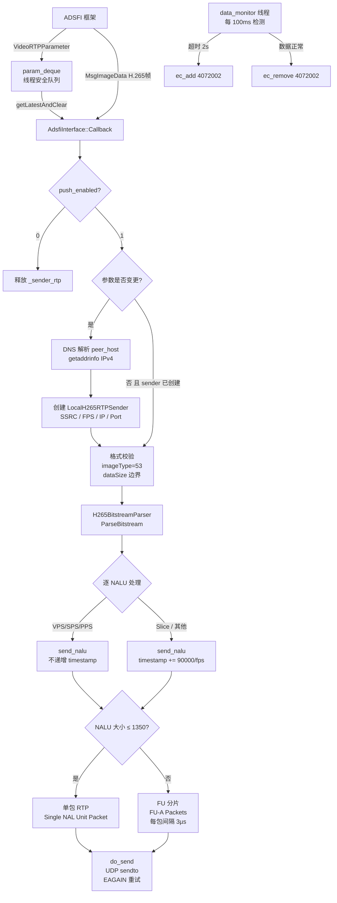
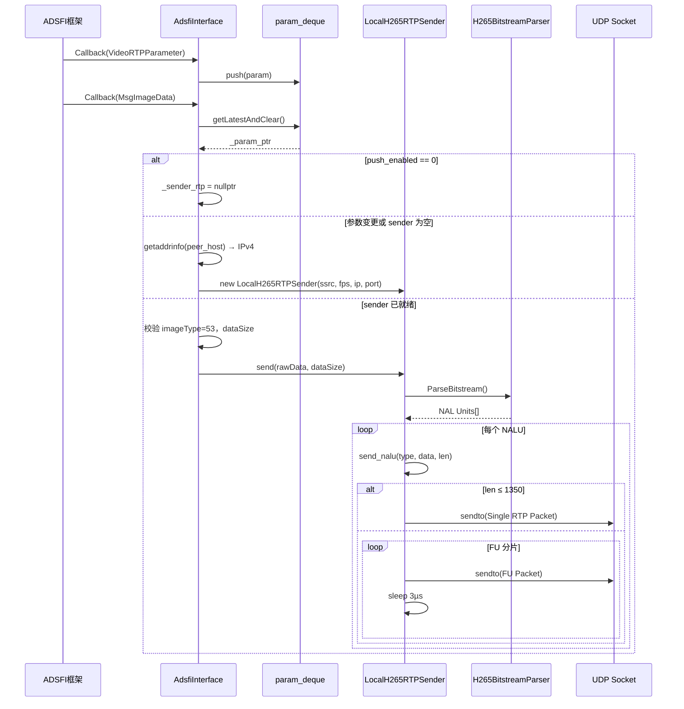
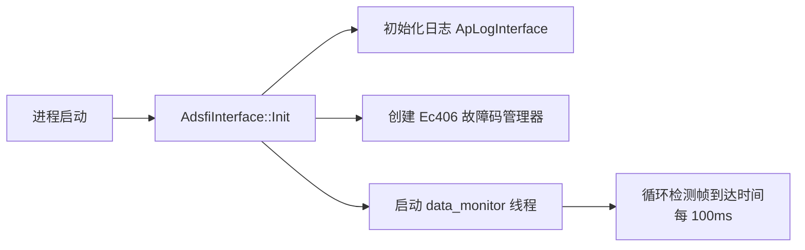
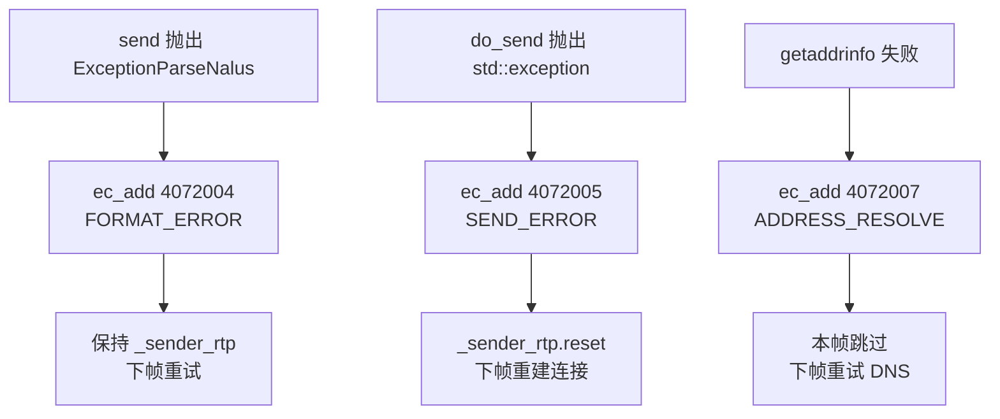
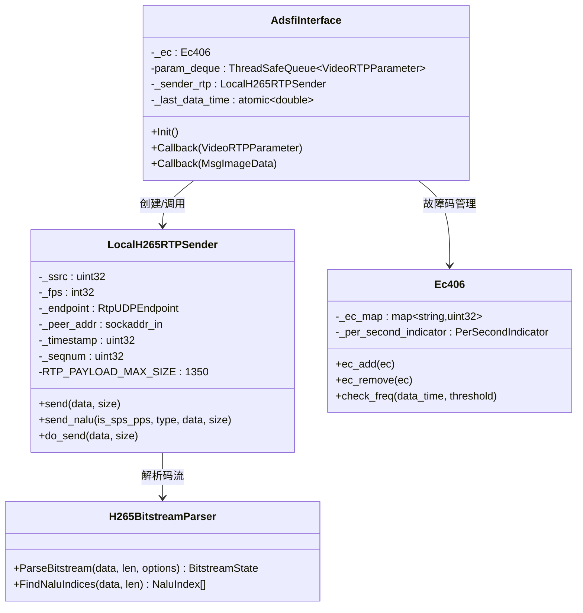
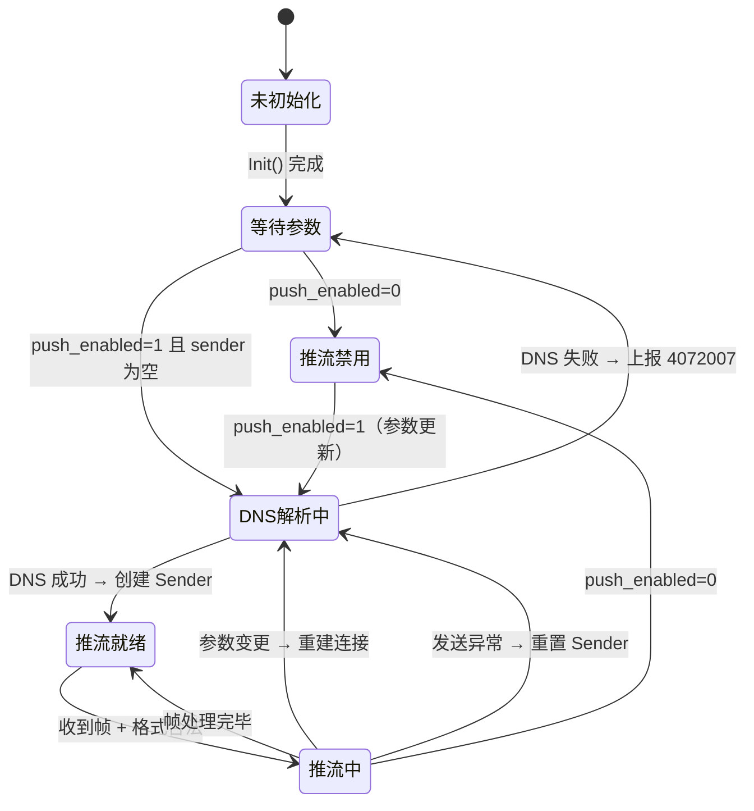

> 本文档依据统一 Markdown 设计模板编写，随代码提交至 Git 仓库进行版本管理与追溯。

---

# 1. 文档信息

| 项目 | 内容 |
| :--- | :--- |
| **模块名称** | xh265_rtp_pusher |
| **模块编号** | multimedia_model/xh265_rtp_pusher |
| **所属系统 / 子系统** | 多媒体子系统 |
| **模块类型** | 平台模块 |
| **负责人** |  |
| **参与人** |  |
| **当前状态** | 草稿 |
| **版本号** | V1.0 |
| **创建日期** | 2026-03-03 |
| **最近更新** | 2026-03-03 |

# 2. 模块概述

## 2.1 模块定位

- **职责**：接收 H.265 编码视频帧，解析 H.265 码流中的 NAL Unit，按 RFC 7798 规范封装为 RTP 数据包，通过 UDP 主动推送至指定远端对端（点对点推流）。
- **上游模块（输入来源）**：
  - 视频编码模块：通过消息总线发布 `video_encoded_frame` topic（类型 `VideoEncodedFrame`），携带 H.265 码流。
  - RTP 参数提供方：通过消息总线发布 `VideoRTPParameter`，提供目标地址、SSRC 等推流参数。
- **下游模块（输出去向）**：网络对端 RTP 接收端（如 ffplay、流媒体服务器等），通过 UDP 接收 RTP 包并解码播放。
- **对外能力**：主动推流（Push），不依赖 RTSP 信令协商，直接向指定 IP:Port 发送 RTP/UDP 数据包。

## 2.2 设计目标

- **功能目标**：将 H.265 编码帧实时封装为 RTP 包并推送至远端，支持动态切换推流目标（SSRC/IP/Port 变更时自动重建连接）。
- **性能目标**：支持 30 fps 视频流实时转发；FU 分片包间引入 3 µs 间隔防止因发送过快导致接收端丢包。
- **稳定性目标**：具备数据到达监控（2 秒超时检测）和故障码上报能力；`push_enabled=0` 时自动释放 UDP 连接节省资源。
- **安全目标**：数据格式强校验（`imageType` 必须为 53、`dataSize` 边界检查）；DNS 解析结果过滤，仅使用 IPv4 地址。
- **可维护性 / 可扩展性目标**：RTP 发送逻辑（`LocalH265RTPSender`）与 ADSFI 接入层（`AdsfiInterface`）解耦，易于替换或扩展传输策略。

## 2.3 设计约束

- 硬件平台：x86_64 / AArch64（Linux）
- 依赖：pthread、glog、fmt
- 上游帧格式：`ara::adsfi::MsgImageData`，`imageType` 固定为 53（H.265 编码帧）
- 网络协议：RTP over UDP（单播）；payload type 固定为 98，时钟频率 90000 Hz
- 帧率：固定 30 fps（`FPS = 30`，不从参数动态读取，代码中有 TODO 注释）
- RTP 最大包体：1350 字节（MTU 安全阈值，避免 IP 分片）
- DNS 解析：仅取第一个 IPv4 地址（`AF_INET`）

# 3. 需求与范围

## 3.1 功能需求（FR）

| 需求ID | 描述 | 优先级 |
| :--- | :--- | :--- |
| FR-01 | 订阅 `video_encoded_frame` topic，接收 H.265 编码帧 | 高 |
| FR-02 | 订阅 `VideoRTPParameter`，获取推流目标（SSRC、peer_host、peer_port、push_enabled） | 高 |
| FR-03 | 将 H.265 码流解析为 NAL Unit，识别 VPS/SPS/PPS/Slice 等类型 | 高 |
| FR-04 | 按 RFC 7798 规范封装 RTP 包：NALU ≤ 1350 字节使用单包模式，超出使用 FU 分片模式 | 高 |
| FR-05 | 通过 UDP 将 RTP 包发送至 DNS 解析后的对端 IPv4 地址 | 高 |
| FR-06 | 推流参数变更（SSRC/IP/Port）时，自动重建 UDP 连接 | 高 |
| FR-07 | `push_enabled=0` 时停止推流并释放 RTP Sender | 中 |
| FR-08 | 超过 2 秒无数据时上报故障码 4072002，恢复后自动撤销 | 中 |
| FR-09 | DNS 解析失败时上报故障码 4072007 | 中 |
| FR-10 | NALU 解析或格式错误时上报故障码 4072004 | 中 |
| FR-11 | UDP 发送失败时上报故障码 4072005，并重置 RTP Sender | 中 |

## 3.2 非功能需求（NFR）

| 需求ID | 类型 | 指标 | 目标值 |
| :--- | :--- | :--- | :--- |
| NFR-01 | 性能 | 视频推流帧率 | 30 fps |
| NFR-02 | 性能 | FU 分片包间间隔 | 3 µs（防止 UDP 丢包） |
| NFR-03 | 稳定性 | 无数据报警阈值 | 2 秒 |
| NFR-04 | 稳定性 | 故障码上报频率抑制 | 每 20 次才上报一次（防抖） |
| NFR-05 | 可靠性 | UDP 发送阻塞重试 | EAGAIN/EWOULDBLOCK 时 10 µs 后重试 |
| NFR-06 | 安全 | 帧格式校验 | imageType != 53 或 dataSize 越界时拒绝处理 |

## 3.3 范围界定（必须明确）

### 3.3.1 本模块必须实现：

- H.265 码流的 NALU 边界检测与类型解析
- RTP 包构造（头部组装、序列号、时间戳管理）
- FU（Fragmentation Unit）分片与重组（仅发送侧）
- UDP 单播发送及 EAGAIN 重试
- 推流参数动态监听与连接重建
- 数据到达监控线程与故障码管理

### 3.3.2 本模块明确不做：

> （防止范围膨胀）

- **不实现 RTSP 信令**：无 OPTIONS/DESCRIBE/SETUP/PLAY 等 RTSP 交互，推流参数由上游模块通过消息总线传入
- **不实现 SRTP/DTLS 加密**：当前仅支持明文 RTP（故障码 4072006 预留但未使用）
- **不实现多播或组播**：仅支持单播 UDP
- **不实现 RTP 接收侧**：模块为纯发送端
- **不实现 FEC/重传机制**：丢包由接收端容忍

## 3.4 需求-设计-验证映射（评审必查）

| 需求ID | 对应设计章节 | 对应接口 | 验证方式 / 用例 |
| :--- | :--- | :--- | :--- |
| FR-01 | 5.3 | `Callback(MsgImageData)` | TC-01 |
| FR-02 | 5.3 | `Callback(VideoRTPParameter)` | TC-02 |
| FR-03 | 5.1 | `H265BitstreamParser::ParseBitstream()` | TC-03 |
| FR-04 | 5.1 | `LocalH265RTPSender::send_nalu()` | TC-04、TC-05 |
| FR-05 | 5.1 | `LocalH265RTPSender::do_send()` | TC-06 |
| FR-06 | 5.3 | `AdsfiInterface::Callback()` 参数对比逻辑 | TC-07 |
| FR-08 | 5.1 | `Ec406::ec_add/ec_remove` + `data_monitor` 线程 | TC-08 |
| FR-11 | 5.3 | `_sender_rtp.reset()` in catch | TC-09 |

# 4. 设计思路

## 4.1 方案概览

模块采用**被动订阅 + 主动推流**的设计思路：

- **数据面**：由 ADSFI 框架回调驱动，不主动拉取；每帧到来时同步完成 NALU 解析与 RTP 发送。
- **控制面**：推流参数（目标 IP/Port/SSRC）通过独立 topic 发布，使用线程安全队列缓存，每帧处理时取最新值；参数变更时重建 UDP 连接，实现动态切换。
- **监控面**：独立 `data_monitor` 后台线程，定期检测帧到达时间戳，超时则上报故障，恢复则撤销故障。

## 4.2 关键决策与权衡

| 决策点 | 选择 | 理由 |
| :--- | :--- | :--- |
| 推流参数更新策略 | 每帧取最新参数，变更时重建连接 | 参数变更频率远低于帧率，重建开销可接受；简化并发控制 |
| RTP 时间戳管理 | VPS/SPS/PPS 不递增时间戳，Slice 递增 | 符合 RFC 7798 语义：参数集无解码时刻，不占用显示时间 |
| NALU 分片边界 | 固定 1350 字节（低于以太网 MTU 1500） | 预留 RTP/UDP/IP 头部空间，防止网络层 IP 分片，降低丢包率 |
| FU 包间 Sleep | 3 µs | 实测防止因发送过快导致接收端 UDP 缓冲溢出；不影响实时性 |
| DNS 解析 | `getaddrinfo()` 仅取第一个 IPv4 | 简化实现，车端网络环境为纯 IPv4 |
| 故障码上报抑制 | 每 20 次才调用 FaultApi | 防止高频故障导致日志/监控系统过载 |

## 4.3 与现有系统的适配

- **ADSFI 框架**：继承 `BaseAdsfiInterface`，通过宏 `BASE_TEMPLATE_FUNCION` 自动注册回调，无需手动连接信号槽。
- **消息类型**：使用 ADSFI 自动生成的 `ara::adsfi::MsgImageData` 和 `ara::adsfi::VideoRTPParameter`，无自定义序列化。
- **网络层**：复用平台 `RtpUDPEndpoint`（管理 UDP socket 生命周期）和 `Ipv4Address`（地址转换）。

## 4.4 失败模式与降级

| 失败场景 | 检测方式 | 降级策略 |
| :--- | :--- | :--- |
| DNS 解析失败 | `getaddrinfo()` 返回错误或无 IPv4 结果 | 本帧跳过，上报 4072007，下帧重试 |
| `push_enabled=0` | 参数字段判断 | 释放 Sender，停止发送，无故障码 |
| NALU 解析异常 | 捕获 `ExceptionParseNalus` | 丢弃本帧，上报 4072004，保持连接 |
| UDP 发送异常 | 捕获 `std::exception` | 丢弃本帧，上报 4072005，重置 Sender（下帧重建） |
| 2 秒无数据 | 后台线程轮询 | 上报 4072002，数据恢复后自动撤销 |

# 5. 架构与技术方案

## 5.1 模块内部架构



### 线程模型

| 线程 | 名称 | 职责 | 生命周期 |
| :--- | :--- | :--- | :--- |
| ADSFI 回调线程 | ADSFI 框架管理 | 接收帧数据和参数、驱动 RTP 发送 | 随进程运行 |
| 数据监控线程 | `data_monitor` | 检测帧到达超时，管理故障码 4072002 | `Init()` 启动，随进程退出 |

> **注意**：RTP 发送（`do_send`）在 ADSFI 回调线程中同步执行，不引入额外线程。

## 5.2 关键技术选型

| 技术点 | 方案 | 选择原因 | 备选方案 |
| :--- | :--- | :--- | :--- |
| H.265 NALU 解析 | `h265nal` 库（内嵌，40+ 源文件）| 完整支持 H.265 所有 NALU 类型；无外部依赖 | FFmpeg libavcodec（体积大，引入复杂度高）|
| RTP 封装 | 手写 `LocalH265RTPSender`（RFC 7798）| 轻量，直接控制包边界和时间戳逻辑 | live555、ortp（依赖复杂）|
| UDP 传输 | POSIX `sendto()` + `RtpUDPEndpoint` | 平台已有封装，socket 管理简洁 | 原始 socket（无封装）|
| 故障码管理 | `Ec406` + `FaultHandle::FaultApi` | 平台统一故障上报机制，防抖计数 | 直接调用 FaultApi（无防抖）|
| 参数队列 | `ThreadSafeQueue`（取最新并清空）| 帧处理时只关心最新参数；无堆积 | 环形缓冲区（实现复杂）|

## 5.3 核心流程

### 主流程（帧处理）



### 启动流程



### 异常流程



# 6. 界面设计

> 本模块为纯后端数据处理模块，无用户界面，跳过此节。

# 7. 接口设计（评审重点）

## 7.1 对外接口

| 接口名 | 类型 | 输入 | 输出 | 频率 | 备注 |
| :--- | :--- | :--- | :--- | :--- | :--- |
| `Callback(VideoRTPParameter)` | ADSFI Topic 订阅 | SSRC、peer_host、peer_port、push_enabled | 无（内部入队） | 按需（参数变更时）| 入队后由帧回调消费 |
| `Callback(MsgImageData)` | ADSFI Topic 订阅 | H.265 裸码流、imageType、dataSize、timestamp | 无（通过 UDP 发出）| 30 fps | 触发实际推流逻辑 |
| UDP RTP 输出 | UDP 单播 | 无（内部生成）| RTP Packet 流 | 30 fps | 发往 peer_host:peer_port |

**输入 Topic 配置（`global.conf`）：**

| Topic | 类型 | 方向 |
| :--- | :--- | :--- |
| `video_encoded_frame` | `VideoEncodedFrame` | 订阅（输入）|
| `rtsp_server_status` | `RtspServerStatus` | 发布（预留）|

## 7.2 对内接口



## 7.3 接口稳定性声明

- **稳定接口**：`Callback(VideoRTPParameter)`、`Callback(MsgImageData)` 的输入数据类型字段含义，变更必须评审。
- **非稳定接口**：`LocalH265RTPSender` 内部实现（RTP_PAYLOAD_MAX_SIZE、FU 包间延迟），允许调整。

## 7.4 接口行为契约

### `Callback(MsgImageData)`

- **前置条件**：`VideoRTPParameter` 已至少发布一次（否则跳过处理）；`imageType == 53`；`dataSize <= rawData.size()`
- **后置条件**：RTP 包已通过 UDP 发送至对端，或故障码已上报
- **是否阻塞**：是（同步发送；FU 分片时包含 µs 级 sleep）
- **最大执行时间**：受 NALU 数量和大小影响；正常帧约 1~5 ms
- **失败语义**：格式异常 → 丢帧 + 故障码 4072004；发送异常 → 丢帧 + 故障码 4072005 + 重置连接

### `Callback(VideoRTPParameter)`

- **前置条件**：ptr 非空
- **后置条件**：参数入队（不立即生效，下帧处理时消费）
- **是否阻塞**：否（仅队列 push）
- **最大执行时间**：< 1 µs

# 8. 数据设计

## 8.1 数据结构

### RTP 头部（`rtp_header_t`，12 字节）

| 字段 | 大小 | 说明 |
| :--- | :--- | :--- |
| version | 2 bit | 固定为 2 |
| padding | 1 bit | 固定为 0 |
| extension | 1 bit | 固定为 0 |
| csrc_len | 4 bit | 固定为 0 |
| marker | 1 bit | FU 最后一包置 1；Single 包置 0 |
| payload_type | 7 bit | 固定为 98（H.265 动态类型）|
| seq_no | 16 bit | 每包自增，网络字节序 |
| timestamp | 32 bit | 90000 Hz 时钟，VPS/SPS/PPS 不递增 |
| ssrc | 32 bit | 来自 `VideoRTPParameter.ssrc` |

### H.265 NALU 头部（2 字节）

| 字段 | 大小 | 说明 |
| :--- | :--- | :--- |
| forbidden_zero_bit | 1 bit | 必须为 0 |
| nal_unit_type | 6 bit | NALU 类型（VPS=32, SPS=33, PPS=34, FU=49 等）|
| nuh_layer_id | 6 bit | 可伸缩层 ID |
| nuh_temporal_id_plus1 | 3 bit | 时间层 ID |

### FU Header（1 字节）

| 字段 | 大小 | 说明 |
| :--- | :--- | :--- |
| fu_type | 6 bit | 原始 NALU 类型 |
| e | 1 bit | End flag（最后分片置 1）|
| s | 1 bit | Start flag（首分片置 1）|

### RTP 包格式对比

```
单包模式（NALU ≤ 1350 字节）:
┌─────────────────┬─────────────────────────────┐
│  RTP Header(12B) │  NAL Header(2B) + Payload   │
└─────────────────┴─────────────────────────────┘

FU 分片模式（NALU > 1350 字节）:
首包: ┌──────────┬────────────────┬──────────────┬───────────────┐
      │ RTP Hdr  │ FU Indicator   │ FU Hdr       │ Payload 1350B │
      │          │ PT=49,nuh_lid  │ S=1,E=0,type │               │
      └──────────┴────────────────┴──────────────┴───────────────┘
中间: ┌──────────┬────────────────┬──────────────┬───────────────┐
      │ RTP Hdr  │ FU Indicator   │ FU Hdr       │ Payload 1350B │
      │          │                │ S=0,E=0,type │               │
      └──────────┴────────────────┴──────────────┴───────────────┘
末包: ┌──────────┬────────────────┬──────────────┬─────────────────┐
      │ RTP Hdr  │ FU Indicator   │ FU Hdr       │ 剩余 Payload    │
      │ Marker=1 │                │ S=0,E=1,type │                 │
      └──────────┴────────────────┴──────────────┴─────────────────┘
```

## 8.2 状态机



## 8.3 数据生命周期

- **VideoRTPParameter**：入队后由帧回调消费（`getLatestAndClear`），旧值覆盖，无堆积。
- **LocalH265RTPSender**：在参数变更或发送异常时销毁并重建；`push_enabled=0` 时显式 `reset()`。
- **RTP 发送缓冲区**（`_rtp_header_buff[12+1500]`）：栈/对象内存，生命周期跟随 Sender 对象。

# 9. 异常与边界处理（评审必查）

| 异常场景 | 检测方式 | 处理策略 | 是否可恢复 | 上报方式 |
| :--- | :--- | :--- | :--- | :--- |
| 参数 ptr 为空 | nullptr 判断 | 直接返回，打印 Error 日志 | 是（下帧） | 无故障码 |
| `_param_ptr` 为空（未收到参数）| nullptr 判断 | 跳过本帧，打印 Error 日志 | 是 | 无故障码 |
| `push_enabled=0` | 字段判断 | 释放 Sender，停止推流 | 是（参数恢复后重建）| 无故障码 |
| DNS 解析失败 | `getaddrinfo()` 返回错误 | 跳过本帧，上报 4072007 | 是（下帧重试）| WARN + FaultApi |
| 无 IPv4 地址 | 结果列表为空 | 跳过本帧，上报 4072007 | 是 | WARN + FaultApi |
| `imageType != 53` | 字段比对 | 抛出 ExceptionParseNalus | 是（下帧）| ERROR + 4072004 |
| `dataSize > rawData.size()` | 大小比较 | 抛出 ExceptionParseNalus | 是（下帧）| ERROR + 4072004 |
| ParseBitstream 返回 nullptr | 返回值判断 | 抛出 ExceptionParseNalus | 是 | ERROR + 4072004 |
| UDP sendto 返回错误（非 EAGAIN）| errno 判断 | 抛出 std::exception → 重置 Sender | 是（下帧重建）| ERROR + 4072005 |
| 2 秒无数据输入 | 后台线程轮询 | 上报 4072002，数据到来后自动撤销 | 是 | WARN + FaultApi |

# 10. 性能与资源预算（必须可验收）

## 10.1 性能指标

| 场景 | 指标 | 目标值 | 测试方法 |
| :--- | :--- | :--- | :--- |
| 正常推流 | 帧率 | 30 fps | 接收端统计 RTP 包时间戳差 |
| 大帧（I 帧，约 100KB）| 单帧处理耗时 | < 10 ms | 日志打点统计 |
| FU 分片包间延迟 | 包间隔 | 3 µs（sleep）| 抓包工具（Wireshark）验证 |
| EAGAIN 重试延迟 | 单次重试间隔 | 10 µs | 代码审查 |

## 10.2 资源预算

| 资源 | 常态 | 峰值 | 上限约束 |
| :--- | :--- | :--- | :--- |
| CPU | < 5%（单核）| < 15%（I 帧大量分片）| 不得影响同进程其他模块 |
| 内存 | < 2 MB | < 5 MB（h265nal 解析状态）| RTP 缓冲区固定 1512 字节 |
| 网络带宽 | 约 4~8 Mbps（H.265 30fps 1080P）| 视编码码率 | 受网络链路限制 |
| 线程数 | 2（ADSFI 回调线程 + data_monitor）| 2 | 无动态创建线程 |

# 11. 构建与部署

## 11.1 环境依赖

| 依赖项 | 版本要求 | 说明 |
| :--- | :--- | :--- |
| 操作系统 | Linux（x86_64 / AArch64）| |
| 编译器 | GCC 8+ / Clang 8+ | 需要 C++17 |
| pthread | 系统自带 | 后台监控线程 |
| glog | 平台内置 | 日志框架 |
| fmt | 平台内置 | 字符串格式化 |
| ADSFI 框架 | 平台版本 | 消息总线、接口基类 |
| h265nal | 内嵌（`src/XH265Nalu/`）| 无独立安装要求 |

## 11.2 构建步骤

### 构建命令

通过平台统一 CMake 构建体系：

```bash
# 在项目根目录执行
cmake -B build -DCMAKE_BUILD_TYPE=Release
cmake --build build --target xh265_rtp_pusher -j$(nproc)
```

### 构建产物

- 动态库或可执行文件（具体形式由平台 CMake 配置决定）
- `config/global.conf`：部署时随产物一起拷贝

## 11.3 配置项

| 配置项 | 说明 | 默认值 | 是否必须 | 来源 |
| :--- | :--- | :--- | :--- | :--- |
| `video_encoded_frame` topic | 订阅的编码帧 topic 名称 | `video_encoded_frame` | 是 | `global.conf` |
| `VideoRTPParameter` | 推流参数来源 topic | 由 ADSFI 框架注入 | 是 | ADSFI 配置 |
| `peer_host` | 对端主机名或 IP | 无 | 是 | `VideoRTPParameter` 字段 |
| `peer_port` | 对端 RTP UDP 端口 | 无 | 是 | `VideoRTPParameter` 字段 |
| `ssrc` | RTP SSRC 标识 | 无 | 是 | `VideoRTPParameter` 字段 |
| `push_enabled` | 是否启用推流（0/1）| 无 | 是 | `VideoRTPParameter` 字段 |
| `FPS` | 发送帧率（固定编译期常量）| 30 | 否 | 代码常量 `#define FPS 30` |
| `config_path_prefix` | CustomStack 配置路径前缀 | `""` | 否 | `global.conf` |

> 所有运行时可变参数（peer_host、peer_port、ssrc、push_enabled）均通过 `VideoRTPParameter` 消息动态注入，禁止硬编码。

## 11.4 部署结构与启动

### 部署目录结构

```text
xh265_rtp_pusher/
├── xh265_rtp_pusher           # 可执行文件 / 动态库
└── config/
    └── global.conf            # ADSFI 模块配置
```

### 启动 / 停止命令

- 由 ADSFI 平台进程管理器统一启动/停止
- 模块本身不提供独立启动入口

## 11.5 健康检查与启动验证

- 启动成功：日志出现 `"XH265RtpPusher"` 模块初始化日志，`data_monitor` 线程启动
- 运行正常：`4072002`（无数据）故障码在数据到来后撤销
- 推流正常：日志出现 `"sent N bytes"` 且对端可收到 RTP 包

## 11.6 升级与回滚

- 升级：替换可执行文件 / 动态库，更新 `global.conf`，重启进程
- 回滚：恢复旧版本文件，重启进程
- 接口兼容：`VideoRTPParameter` 字段增删需与上游模块协调，否则可能导致参数异常

# 12. 可测试性与验证

## 12.1 单元测试

- **H265BitstreamParser**：可独立构造 H.265 码流字节数组，验证 NALU 边界检测和类型识别
- **LocalH265RTPSender::send_nalu**：mock UDP socket，验证 FU 分片逻辑（边界值：1350、1351、大帧）
- **Ec406**：验证计数阈值（第 1、21 次调用 FaultApi）、ec_remove 后计数清零

## 12.2 集成测试

- 上游：使用录制的 H.265 `.bag` 文件重放 `video_encoded_frame` topic
- 对端：ffplay 或自定义 RTP 接收程序监听目标端口，验证视频可正常解码播放

## 12.3 可观测性

- **日志**：
  - `ApInfo`: 每个 NALU 类型、offset、payload_length、前 200 字节 HEX；每帧发送字节数
  - `ApError`: DNS 失败、格式错误、发送失败
- **故障码**：通过平台 FaultApi 上报（4072002~4072008），监控平台可订阅
- **Debug**：可通过日志级别调整查看详细 NALU 解析信息

# 13. 测试用例清单

| ID | 对应需求 | 测试项目 | 测试步骤 | 预期结果 | 测试结果 |
| :--- | :--- | :--- | :--- | :--- | :--- |
| TC-01 | FR-01 | 正常帧接收 | 发布合法 H.265 帧 + 合法参数 | 日志出现 "sent N bytes"，对端收到 RTP 包 | |
| TC-02 | FR-02 | 参数变更重建连接 | 先推流，再修改 peer_port，继续发帧 | 连接重建，推流继续，无报错 | |
| TC-03 | FR-03 | NALU 解析：I 帧 | 发送含 VPS+SPS+PPS+IDR 的帧 | 正确识别 4 种 NALU 类型，timestamp 仅 IDR 递增 | |
| TC-04 | FR-04 | 单包发送（小帧）| 发送 NALU ≤ 1350 字节的帧 | 每 NALU 对应一个 RTP 包，Marker 未置位（非最后包）| |
| TC-05 | FR-04 | FU 分片（大帧）| 发送 NALU > 1350 字节的 I 帧 | 拆分为多个 FU 包，首包 S=1，末包 E=1 Marker=1 | |
| TC-06 | FR-05 | UDP 发送验证 | 使用 Wireshark 抓包 | RTP 包目标 IP/Port 正确，payload type=98 | |
| TC-07 | FR-06 | push_enabled=0 | 发送 push_enabled=0 参数后继续发帧 | 停止推流，对端无新 RTP 包 | |
| TC-08 | FR-08 | 无数据超时告警 | 停止发布帧超过 2 秒 | 故障码 4072002 上报；恢复后自动撤销 | |
| TC-09 | FR-11 | UDP 发送失败恢复 | 断开网络后发帧，恢复网络再发帧 | 上报 4072005；网络恢复后自动重建连接并继续推流 | |
| TC-10 | FR-10 | 格式错误帧 | 发送 imageType != 53 的帧 | 上报 4072004，不崩溃，下帧正常处理 | |
| TC-11 | FR-09 | DNS 解析失败 | 设置 peer_host 为不可解析域名 | 上报 4072007，跳过本帧，不崩溃 | |

# 14. 风险分析（设计评审核心）

| 风险 | 影响 | 可能性 | 应对措施 |
| :--- | :--- | :--- | :--- |
| FPS 为编译期常量（30），参数中的 fps 字段被忽略 | 非 30fps 上游导致时间戳漂移，接收端花屏 | 中 | 修复为从 `VideoRTPParameter` 读取 fps（代码中已有 TODO 注释）|
| FU 包间 3µs sleep 在 ADSFI 回调线程执行 | 阻塞回调线程，可能导致后续帧积压 | 中 | 评估 I 帧分片数量；大帧（>100KB）约需 < 1ms，可接受 |
| 发送端 `_sender_rtp` 无锁保护（回调线程与 Ec406 线程并发）| 数据竞争（UB）| 低 | `_sender_rtp` 仅在 ADSFI 回调线程访问；`Ec406` 内部已有 mutex；无实际竞争 |
| 无 RTP 接收确认机制（UDP 无可靠性）| 丢包无法感知 | 高 | 接收端需自行处理 NALU 序列不完整；或引入 FEC/RTCP |
| DNS 解析每次参数变更时阻塞调用 | 若 DNS 慢（>100ms），阻塞当前帧 | 低 | 车端 DNS 通常为本地解析，延迟 < 1ms；如果使用域名则有风险 |
| `ExceptionParseNalus` 异常路径没有 `ec_remove(FORMAT)`（仅 ec_add）| 格式错误恢复后故障码未撤销 | 中 | 在发送成功分支已有 `ec_remove(_ERRORCODE_FORMAT)`，逻辑正确 |

# 15. 设计评审

## 15.1 评审 Checklist

- [ ] 需求是否完整覆盖（FR-01 ~ FR-11 均有对应设计）
- [ ] 接口是否清晰稳定（VideoRTPParameter 字段语义是否与上游对齐）
- [ ] FPS 固定值风险是否已知晓并有处理计划
- [ ] 异常路径是否完整（DNS/格式/发送/超时）
- [ ] 性能 / 资源是否有上限（CPU < 15%，内存 < 5MB）
- [ ] 构建与部署步骤是否完整可执行
- [ ] 测试用例是否覆盖所有功能需求和非功能需求

## 15.2 评审记录

| 日期 | 评审人 | 问题 | 结论 | 备注 |
| :--- | :--- | :--- | :--- | :--- |
| | | | | |

# 16. 变更管理（重点）

## 16.1 变更原则

- 不允许口头变更
- 接口 / 行为变更必须记录

## 16.2 变更分级

| 级别 | 示例 | 是否需要评审 |
| :--- | :--- | :--- |
| L1 | 日志级别调整、注释修改 | 否 |
| L2 | FU 分片阈值（1350）调整、Sleep 时长调整 | 是 |
| L3 | 订阅 topic 名称变更、`VideoRTPParameter` 字段增删 | 是（系统级）|

## 16.3 变更记录

| 版本 | 变更内容 | 影响分析 | 评审人 |
| :--- | :--- | :--- | :--- |
| V1.0 | 初始版本 | — | |

# 17. 交付与冻结

## 17.1 设计冻结条件

- [ ] 所有接口有对应测试用例
- [ ] FPS 固定值问题已确认处理方案
- [ ] 所有 NFR 有验证方案
- [ ] 异常路径已覆盖（DNS/格式/发送/超时）
- [ ] 构建与部署文档可执行验证通过
- [ ] 变更影响分析完成

## 17.2 设计与交付物映射

- 设计文档 ↔ `meta_model/multimedia_model/xh265_rtp_pusher/`
- 接口文档 ↔ `adsfi_interface/adsfi_interface.h`、`ara/adsfi/impl_type_videortpparameter.h`
- 测试用例 ↔ 集成测试脚本（待补充）

# 18. 附录

## 术语表

| 术语 | 说明 |
| :--- | :--- |
| NALU | Network Abstraction Layer Unit，H.265 码流基本单元 |
| VPS | Video Parameter Set，视频参数集 |
| SPS | Sequence Parameter Set，序列参数集 |
| PPS | Picture Parameter Set，图像参数集 |
| IDR | Instantaneous Decoding Refresh，即时解码刷新帧（关键帧）|
| FU | Fragmentation Unit，RTP 分片单元（RFC 7798）|
| SSRC | Synchronization Source Identifier，RTP 同步源标识 |
| MTU | Maximum Transmission Unit，最大传输单元 |
| RTSP | Real Time Streaming Protocol，实时流传输协议 |
| RTP | Real-time Transport Protocol，实时传输协议 |
| ADSFI | 自动驾驶软件框架接口（Autonomous Driving Software Framework Interface）|

## 参考文档

- RFC 7798：RTP Payload Format for High Efficiency Video Coding (HEVC)
- ITU-T H.265 / ISO/IEC 23008-2：High Efficiency Video Coding 标准
- `design_template.md`：统一设计文档模板
