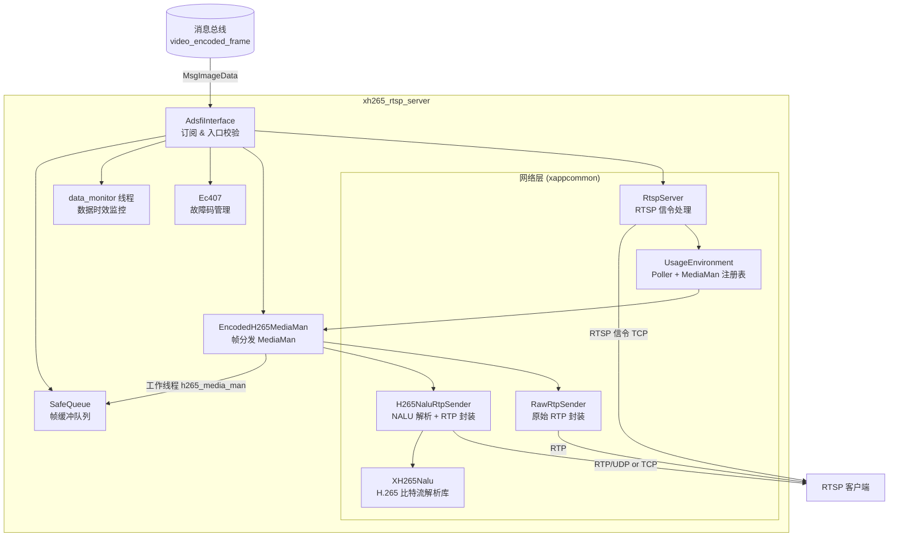
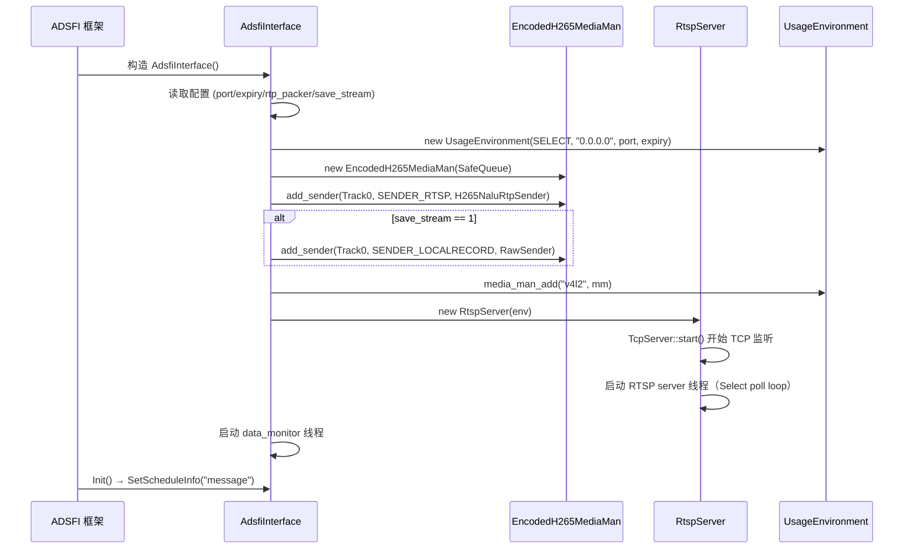
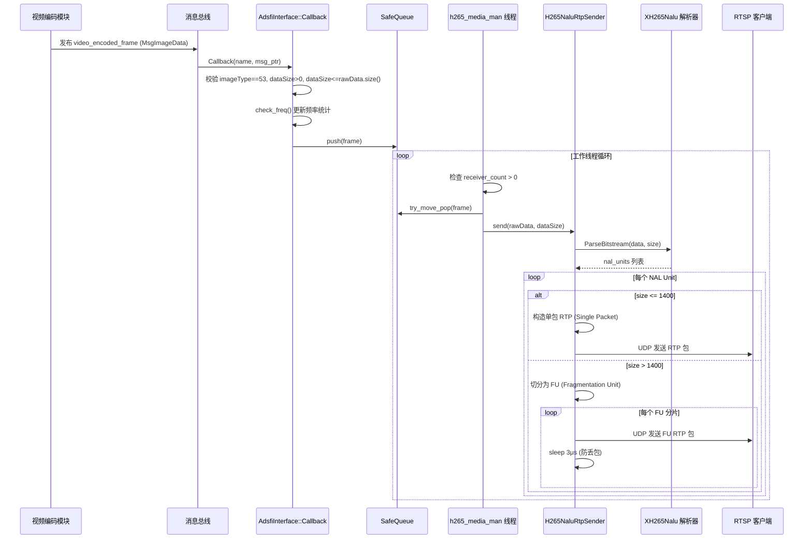
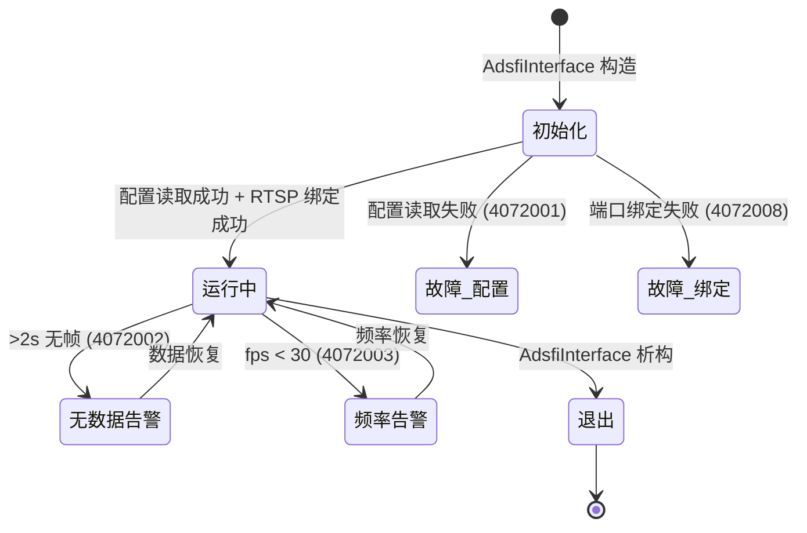
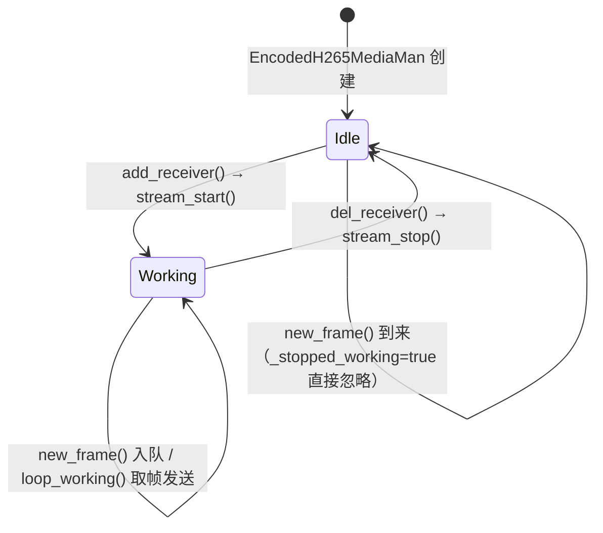

> 本文档依据统一 Markdown 设计模板编写，随代码提交至 Git 仓库进行版本管理与追溯。

---

# 1. 文档信息

| 项目 | 内容 |
| :--- | :--- |
| **模块名称** | xh265_rtsp_server |
| **模块编号** | multimedia_model/xh265_rtsp_server |
| **所属系统 / 子系统** | 多媒体子系统 |
| **模块类型** | 平台模块 |
| **负责人** |  |
| **参与人** |  |
| **当前状态** | 草稿 |
| **版本号** | V1.0 |
| **创建日期** | 2026-03-03 |
| **最近更新** | 2026-03-03 |

# 2. 模块概述

## 2.1 模块定位

- **职责**：接收已编码的 H.265 视频帧数据，通过 RTSP/RTP 协议向网络客户端提供实时视频流服务。
- **上游模块（输入来源）**：视频编码模块（通过消息总线发布 `video_encoded_frame` topic）
- **下游模块（输出去向）**：网络 RTSP 播放客户端（如 VLC、ffplay 等），可选本地落盘存储
- **对外能力**：提供 RTSP 服务端能力（SDK/Service），供客户端通过标准 RTSP 协议拉流

## 2.2 设计目标

- **功能目标**：将车端 H.265 编码视频帧经由 RTSP/RTP 协议实时转发给远端观察者
- **性能目标**：支持 30 fps 的视频流转发，单帧端到端延迟满足实时视频监控需求
- **稳定性目标**：具备数据频率监控与故障码上报能力；无接收方时停止处理，节省资源
- **安全目标**：数据格式校验（imageType 类型检查、dataSize 边界检查）
- **可维护性 / 可扩展性目标**：RTP 打包器通过配置选择（H265NaluRtpSender / RawRtpSender），支持未来扩展

## 2.3 设计约束

- 硬件平台：x86_64 / AArch64（支持 AARCH64_93、AARCH64_75 变体）
- OS：Linux
- 依赖：pthread、glog、fmt、boost_system、boost_filesystem
- 上游数据格式：`ara::adsfi::MsgImageData`，`imageType` 字段固定为 53（表示 H.265 编码帧）
- 兼容性：RTSP 1.0，RTP payload type 98，H.265/90000 时钟率
- 网络层：SELECT poller（当前固定使用 POLLER_SELECT）

# 3. 需求与范围

## 3.1 功能需求（FR）

| 需求ID | 描述 | 优先级 |
| :--- | :--- | :--- |
| FR-01 | 订阅消息总线上的 `video_encoded_frame` topic，接收 H.265 编码帧 | 高 |
| FR-02 | 提供 RTSP 服务端，支持标准 OPTIONS / DESCRIBE / SETUP / PLAY / TEARDOWN 交互 | 高 |
| FR-03 | 将 H.265 比特流解析为 NAL Unit，按 RFC 7798 规范封装成 RTP 包发送 | 高 |
| FR-04 | 支持 RTP/UDP（单播）和 RTP/TCP（Interleaved）两种传输模式 | 高 |
| FR-05 | 无接收方时停止帧处理，避免资源浪费 | 中 |
| FR-06 | 支持可选的本地流文件落盘保存（save_stream=1） | 低 |
| FR-07 | 数据频率监控：低于 30 fps 时上报故障码 4072003 | 中 |
| FR-08 | 超过 2 秒无数据时上报故障码 4072002 | 中 |

## 3.2 非功能需求（NFR）

| 需求ID | 类型 | 指标 | 目标值 |
| :--- | :--- | :--- | :--- |
| NFR-01 | 性能 | 视频转发帧率 | 30 fps |
| NFR-02 | 性能 | 单帧处理延迟 | 满足实时视频监控要求 |
| NFR-03 | 稳定性 | 无数据报警阈值 | 2 秒 |
| NFR-04 | 稳定性 | 故障码上报频率抑制 | 每 20 次才上报一次（防抖） |
| NFR-05 | 资源 | 无接收方时 CPU 占用 | 接近零（停止工作线程） |

## 3.3 范围界定（必须明确）

### 3.3.1 本模块必须实现：

- H.265 帧从消息总线的订阅与接收
- RTSP 信令服务端（TCP 监听）
- RTP 数据包封装与发送（H265NaluRtpSender 或 RawRtpSender）
- 连接超时检测与清理
- 故障码管理（上报与恢复）

### 3.3.2 本模块明确不做：

> （防止范围膨胀）

- 视频编码（上游负责）
- 视频解码（客户端负责）
- 认证鉴权（当前不做 RTSP 鉴权）
- 组播（代码中有框架但配置为单播）
- RTCP 反馈控制（当前忽略接收到的 RTCP 数据）

## 3.4 需求-设计-验证映射（评审必查）

| 需求ID | 对应设计章节 | 对应接口 | 验证方式 / 用例 |
| :--- | :--- | :--- | :--- |
| FR-01 | 5.3 | `AdsfiInterface::Callback()` | TC-01 |
| FR-02 | 5.1 | `RtspServer`（OPTIONS/DESCRIBE/SETUP/PLAY/TEARDOWN） | TC-02 |
| FR-03 | 5.3 | `H265NaluRtpSender::send()` | TC-03 |
| FR-04 | 5.1 | `RtspConnOfServerSide::on_cmd_setup()` | TC-04 |
| FR-05 | 5.3 | `EncodedH265MediaMan::loop_working()` | TC-05 |
| FR-07 | 7.1 | `Ec407::check_freq()` | TC-06 |
| FR-08 | 7.1 | `data_monitor` 线程 | TC-07 |

# 4. 设计思路

## 4.1 方案概览

模块整体为**流转发管道**模式：

1. **数据接入层**：`AdsfiInterface` 订阅消息总线，在回调中做基本校验后将帧放入 `SafeQueue`
2. **媒体分发层**：`EncodedH265MediaMan` 独立线程从队列取帧，分发给所有已注册的 Sender
3. **网络传输层**：`H265NaluRtpSender` 解析 H.265 NAL Unit 并封装 RTP 发送；`RtspServer` 独立线程处理 RTSP 信令，维护 Client Session
4. **监控层**：`Ec407` 做故障码防抖管理；`data_monitor` 线程周期检查数据时效

## 4.2 关键决策与权衡

| 决策点 | 选择 | 理由 |
| :--- | :--- | :--- |
| RTP 打包器 | 可配置（H265NaluRtpSender / RawRtpSender） | H265NaluRtpSender 可解析 NALU 做 FU 分片，兼容性好；RawRtpSender 适合对端已能处理原始数据的场景 |
| 帧队列 | SafeQueue（无界） | 解耦数据接收回调与网络发送，防止回调阻塞；无接收方时主动清空队列避免内存增长 |
| RTSP 网络 I/O | SELECT poller | 兼容性好；当前连接数少，性能满足要求 |
| 故障码防抖 | 每 20 次触发上报一次 | 避免瞬时错误造成告警风暴 |

## 4.3 与现有系统的适配

- 遵循 ADSFI 框架的 `BaseAdsfiInterface` 接口规范
- 使用 `CustomStack` 读取项目配置，配置路径格式为 `video/rtsp/*`
- 使用 `FaultHandle::FaultApi` 进行故障码管理，兼容平台故障管理体系
- 使用平台 `ap_log` 日志系统，日志标签为 `h265_rtsp_server`

## 4.4 失败模式与降级

| 失败场景 | 处理策略 |
| :--- | :--- |
| 配置读取失败 | 上报 4072001，`_port` 为 0，RTSP 服务不启动 |
| RTSP 端口绑定失败 | 上报 4072008，服务不可用 |
| 上游无数据 > 2s | 上报 4072002，服务继续运行等待数据恢复 |
| 数据帧频率 < 30fps | 上报 4072003，自动恢复（频率正常后清除） |
| NALU 解析失败 | 上报 4072004，丢弃当前帧，继续处理下一帧 |
| 无接收方时收到帧 | 丢弃帧（不入队或清空队列），不上报故障 |

# 5. 架构与技术方案

## 5.1 模块内部架构



**线程模型**：

| 线程名 | 归属 | 职责 |
| :--- | :--- | :--- |
| ADSFI 框架线程 | AdsfiInterface | 消息回调 `Callback()`，帧入队 |
| `h265_media_man` | EncodedH265MediaMan | 从队列取帧，分发给所有 RTP Sender |
| `data_monitor` | AdsfiInterface | 每 100ms 检查最近数据时间，>2s 无数据则上报 |
| RTSP server 线程 | RtspServer | Select 轮询 + 连接超时检测 |

## 5.2 关键技术选型

| 技术点 | 方案 | 选择原因 | 备选方案 |
| :--- | :--- | :--- | :--- |
| H.265 比特流解析 | XH265Nalu（基于 Facebook h265nal） | 支持完整 NAL Unit 类型解析、Annex B 格式 | 无 |
| RTP 打包（默认） | H265NaluRtpSender（rtp_packer=0） | 符合 RFC 7798，支持 FU 分片（>1400 字节 NALU） | RawRtpSender（rtp_packer=1） |
| RTSP 网络 I/O | SELECT Poller | 连接数少，兼容性好 | EPOLL Poller |
| 帧传递 | SafeQueue（生产-消费队列） | 解耦回调与发送线程 | 直接在回调中发送 |
| 故障码上报 | FaultHandle::FaultApi + Ec407 防抖 | 平台统一故障管理 | 无 |

## 5.3 核心流程

### 初始化流程



### 主数据流程



### RTSP 会话建立流程

```mermaid
sequenceDiagram
    participant CLI as RTSP 客户端
    participant RS as RtspServer / RtspConnOfServerSide
    participant MM as EncodedH265MediaMan

    CLI->>RS: TCP 连接
    RS->>RS: 创建 RtspConnOfServerSide

    CLI->>RS: OPTIONS rtsp://host:port/v4l2
    RS-->>CLI: 200 OK (OPTIONS, DESCRIBE, SETUP, TEARDOWN, PLAY)

    CLI->>RS: DESCRIBE rtsp://host:port/v4l2
    RS->>MM: sdp(Track0, SENDER_RTSP)
    RS-->>CLI: 200 OK + SDP 内容

    CLI->>RS: SETUP (Transport: RTP/AVP;unicast 或 RTP/AVP/TCP)
    RS->>RS: 创建 UdpRtpReceiver 或 TcpRtpReceiver
    RS-->>CLI: 200 OK + Session ID + 端口信息

    CLI->>RS: PLAY
    RS->>MM: add_receiver(Track0, SENDER_RTSP, sessionId, receiver)
    MM->>MM: stream_start() → 启动 h265_media_man 线程
    RS-->>CLI: 200 OK

    loop 视频流
        MM->>CLI: RTP 数据包
    end

    CLI->>RS: TEARDOWN
    RS->>MM: del_receiver(SENDER_RTSP, sessionId)
    RS-->>CLI: 200 OK
    RS->>RS: 释放连接
```

### 启动 / 退出流程



# 6. 界面设计

> 本模块为纯后端网络服务模块，无用户界面，跳过此节。

# 7. 接口设计（评审重点）

## 7.1 对外接口

| 接口名 | 类型 | 输入 | 输出 | 频率 | 备注 |
| :--- | :--- | :--- | :--- | :--- | :--- |
| `video_encoded_frame` (订阅) | Topic/SHM | `MsgImageData`（H.265 编码帧） | - | ~30fps | imageType 必须为 53 |
| `rtsp_server_status` (发布) | Topic | - | `RtspServerStatus` | 按需 | 状态发布（框架层） |
| RTSP 服务端口 | TCP | RTSP 请求 | RTSP 响应 + RTP 流 | 按需 | 端口由配置 `video/rtsp/port` 指定 |

## 7.2 对内接口

| 接口 | 调用方 | 被调方 | 说明 |
| :--- | :--- | :--- | :--- |
| `EncodedH265MediaMan::new_frame()` | AdsfiInterface | EncodedH265MediaMan | 帧入队 |
| `H265NaluRtpSender::send()` | EncodedH265MediaMan | H265NaluRtpSender | 解析并发送 |
| `MediaMan::add_receiver()` | RtspServer | EncodedH265MediaMan | 注册 RTP 接收端（触发 stream_start） |
| `MediaMan::del_receiver()` | RtspServer | EncodedH265MediaMan | 注销 RTP 接收端（触发 stream_stop） |

## 7.3 接口稳定性声明

- **稳定接口**：`video_encoded_frame` Topic 格式（`MsgImageData`）；RTSP 标准信令
- **非稳定接口**：`rtsp_server_status` 内容格式（允许调整）；本地落盘文件格式

## 7.4 接口行为契约（必须填写）

### `AdsfiInterface::Callback()`

- **前置条件**：`msg_ptr != nullptr`，`imageType == 53`，`dataSize > 0 && dataSize <= rawData.size()`
- **后置条件**：帧数据压入 `SafeQueue`；若 `_stopped_working == true` 则直接丢弃
- **是否阻塞**：否（SafeQueue push 为非阻塞）
- **最大执行时间**：< 1ms
- **失败语义**：校验不通过时直接返回，记录 ERROR 日志，不上报故障

### `H265NaluRtpSender::send()`

- **前置条件**：输入为合法 H.265 Annex B 比特流（含起始码）
- **后置条件**：所有 NAL Unit 已封装为 RTP 包并发送给所有注册的 RtpReceiver
- **是否阻塞**：是（发送每个 FU 包后 sleep 3μs）
- **最大执行时间**：取决于 NALU 数量和大小，单帧通常 < 10ms
- **失败语义**：NALU 解析失败抛出 `ExceptionParseNalus`，上层捕获后上报故障码 4072004

# 8. 数据设计

## 8.1 数据结构

### `MsgImageData`（输入帧）

| 字段 | 类型 | 说明 |
| :--- | :--- | :--- |
| `imageType` | uint8 | 必须为 53（H.265 编码帧标识） |
| `dataSize` | uint32 | 有效数据字节数 |
| `rawData` | vector\<uint8\> | 原始 H.265 Annex B 比特流数据 |
| `timestamp` | `{sec, nsec}` | 帧时间戳 |

### H.265 NAL Unit 类型（关键类型）

| 类型值 | 名称 | 说明 |
| :--- | :--- | :--- |
| 32 | VPS_NUT | 视频参数集，不更新 RTP 时间戳 |
| 33 | SPS_NUT | 序列参数集，不更新 RTP 时间戳 |
| 34 | PPS_NUT | 图像参数集，不更新 RTP 时间戳 |
| 19/20 | IDR_W_RADL/IDR_N_LP | 关键帧 |
| 0-21 | VCL | 视频编码层，更新 RTP 时间戳 |
| 49 | FU | RTP 分片单元（大 NALU 分包） |

### RTP 包格式（H.265）

```
Single Packet（NALU ≤ 1400 字节）:
┌─────────────┬──────────────────────────────────────┐
│  RTP Header │  NALU Header (2B) + NALU Data        │
│   (12 B)    │                                      │
└─────────────┴──────────────────────────────────────┘

FU Packet（NALU > 1400 字节）:
┌─────────────┬──────────────┬────────────┬──────────┐
│  RTP Header │  FU Header   │  FU Header │ NALU 分片│
│   (12 B)    │  type=49 (2B)│  (1B S/E/R)│  数据    │
└─────────────┴──────────────┴────────────┴──────────┘
```

### SDP 描述（媒体协商）

```
m=video 0 RTP/AVP 98
c=IN IP4 0.0.0.0
b=AS:5000
a=rtpmap:98 H265/90000
a=fmtp:98 profile-id=1;level-id=93;
```

## 8.2 状态机



## 8.3 数据生命周期

- `MsgImageData` 由消息总线分配，以 `shared_ptr` 传递，入队后由工作线程持有，发送完成后引用计数归零自动释放
- `SafeQueue` 无界，无接收方时工作线程主动清空队列，防止内存无限增长
- `RtspConnOfServerSide` 在连接断开或超时后析构，析构时调用 `del_receiver()` 注销 RTP 接收端

# 9. 异常与边界处理（评审必查）

| 异常场景 | 检测方式 | 处理策略 | 是否可恢复 | 上报方式 |
| :--- | :--- | :--- | :--- | :--- |
| 配置项缺失或非法 | `GetProjectConfigValue` 返回 false | 上报故障码 + 返回，服务不启动 | 否（需重新配置） | 4072001 |
| RTSP 端口绑定失败 | 捕获 `std::exception` | 上报故障码 | 否（端口占用需外部解决） | 4072008 |
| imageType 非法 | `msg_ptr->imageType != 53` | 丢弃 + ERROR 日志 | 是（等待正确帧） | 无 |
| dataSize 溢出 | `dataSize > rawData.size()` | 丢弃 + ERROR 日志 | 是 | 无 |
| 上游无数据 > 2s | data_monitor 线程定时检查 | 上报故障码 | 是（数据恢复后自动清除） | 4072002 |
| 帧频率 < 30fps | Ec407::check_freq() | 上报故障码 | 是（频率恢复后自动清除） | 4072003 |
| NALU 解析失败 | `ParseBitstream` 返回 nullptr | 上报故障码，丢弃当前帧 | 是 | 4072004 |
| RTP 发送失败 | 捕获 `std::runtime_error` | 日志记录，继续下一帧 | 是 | 日志 |
| RTSP 连接超时 | `connection_expired()` | 主动断连，清理接收端 | 是（自动清理） | 无 |

# 10. 性能与资源预算（必须可验收）

## 10.1 性能指标

| 场景 | 指标 | 目标值 | 测试方法 |
| :--- | :--- | :--- | :--- |
| 正常 30fps 转发 | 帧率 | ≥ 30fps | VLC/ffplay 观察帧率统计 |
| FU 分包延迟（>1400B NALU） | FU 包间间隔 | 3μs（硬编码） | 抓包分析 |
| 无接收方时资源占用 | CPU | 接近 0 | htop 观察工作线程状态 |

## 10.2 资源预算

| 资源 | 常态 | 峰值 | 上限约束 |
| :--- | :--- | :--- | :--- |
| 线程数 | 3（media_man + data_monitor + rtsp_server） | 3 | 固定 |
| SafeQueue 内存 | 1~3 帧（shared_ptr 复制，实际数据在消息总线内存区） | 按连接延迟增大 | 无硬限制，需关注 |
| 网络带宽（单客户端） | ≤ 5 Mbps（SDP b=AS:5000） | 取决于视频码率 | 由编码模块控制 |

# 11. 构建与部署

## 11.1 环境依赖

| 依赖项 | 版本要求 | 说明 |
| :--- | :--- | :--- |
| 操作系统 | Linux | x86_64 / AArch64 |
| 编译器 | GCC / Clang，支持 C++17 | |
| pthread | 系统库 | 多线程支持 |
| glog | 系统或项目提供 | 日志 |
| fmt | 项目提供 | 格式化字符串 |
| boost_system / boost_filesystem | 项目提供 | 文件操作（落盘功能） |

## 11.2 构建步骤

### 构建命令

通过 CMake 集成，模块通过 `model.cmake` 提供：

```cmake
include(meta_model/multimedia_model/xh265_rtsp_server/model.cmake)
# MODULE1_SOURCES    — 所有源文件
# MODULE1_INCLUDE_DIRS — 头文件搜索路径
# MODULE1_LIBS       — 链接库
```

### 构建产物

集成到平台可执行文件中，不单独产生 .so 文件。

## 11.3 配置项

| 配置项 | 说明 | 默认值 | 是否必须 | 来源 |
| :--- | :--- | :--- | :--- | :--- |
| `video/rtsp/port` | RTSP 服务监听端口 | 无 | 是 | CustomStack 项目配置 |
| `video/rtsp/expiry` | RTSP 连接超时时长（毫秒） | 无 | 是 | CustomStack 项目配置 |
| `video/rtsp/rtp_packer` | RTP 打包器选择：0=H265NaluRtpSender，1=RawRtpSender | 无 | 是 | CustomStack 项目配置 |
| `video/rtsp/save_stream` | 是否本地落盘：1=开启 | 无 | 是 | CustomStack 项目配置 |

> 所有可配置项必须在此列出，禁止在代码中散落硬编码。
> **注意**：代码中 FPS 硬编码为 30（`#define FPS 30`），当前不从配置读取。

## 11.4 部署结构与启动

### RTSP 访问 URL

```
rtsp://<设备IP>:<port>/v4l2
```

### 启动 / 停止

- 随平台进程启动，无独立启动命令
- `AdsfiInterface` 析构时 `_stopped = true`，`data_monitor` 线程退出，RTSP server 线程退出

## 11.5 健康检查与启动验证

- 日志关键词：`port: <N>` — 表示 RTSP 服务端口加载成功
- 使用 VLC/ffplay 连接 `rtsp://host:port/v4l2` 验证视频流
- 无故障码 4072001 / 4072008 表示初始化成功

# 12. 可测试性与验证

## 12.1 单元测试

- **XH265Nalu 解析库**：可独立测试，输入合法/非法 Annex B 比特流，验证 NAL Unit 提取正确性
- **Ec407 防抖逻辑**：验证每 20 次才上报一次故障码

## 12.2 集成测试

- 上游：使用 mock 数据发布 `video_encoded_frame` Topic
- 下游：使用 ffplay/VLC 拉取 RTSP 流，验证视频可正常播放
- 故障注入：停止上游发送，验证 2 秒后 4072002 告警触发

## 12.3 可观测性

- **日志**（标签 `h265_rtsp_server`）：
  - `new frame of time: <timestamp>` — 收到帧
  - `send frame of time: <timestamp>` — 发送帧
  - `ignore frame of time: <timestamp>` — 丢弃帧（无接收方或服务未启动）
  - `<N> frames in que after new frame` — 队列长度
  - RTSP 连接/断连信息
- **故障码**：通过 FaultHandle 平台接口查询

# 13. 测试用例清单

| ID | 对应需求 | 测试项目 | 测试步骤 | 预期结果 | 测试结果 |
| :--- | :--- | :--- | :--- | :--- | :--- |
| TC-01 | FR-01 | 帧接收校验 | 发送 imageType=53 的合法帧 | 帧入队，日志打印 "new frame" | |
| TC-02 | FR-02 | RTSP 信令 | VLC 连接 rtsp://host:port/v4l2 | OPTIONS/DESCRIBE/SETUP/PLAY 全部 200 OK | |
| TC-03 | FR-03 | RTP 发送（单包） | 发送 ≤1400B 的 H.265 帧 | 抓包观察单个 RTP 包，payload type=98 | |
| TC-04 | FR-03 | RTP 发送（FU 分片） | 发送 >1400B 的 H.265 帧 | 抓包观察多个 FU 包，S/E 标志正确 | |
| TC-05 | FR-05 | 无接收方时丢帧 | 无客户端连接时发帧 | 日志 "ignore frame"，无 RTP 包发出 | |
| TC-06 | FR-07 | 频率告警 | 以低于 30fps 发送帧 | 4072003 故障码触发 | |
| TC-07 | FR-08 | 无数据告警 | 停止发帧超过 2 秒 | 4072002 故障码触发 | |
| TC-08 | FR-01 | 非法 imageType 拒绝 | 发送 imageType≠53 的帧 | ERROR 日志，帧被丢弃，不入队 | |
| TC-09 | FR-04 | TCP 传输 | SETUP 指定 RTP/AVP/TCP | 视频流通过 TCP Interleaved 传输 | |

# 14. 风险分析（设计评审核心）

| 风险 | 影响 | 可能性 | 应对措施 |
| :--- | :--- | :--- | :--- |
| SafeQueue 无界增长 | 内存泄漏，进程 OOM | 低（无接收方时主动清空） | 可考虑增加队列长度上限 |
| FPS 硬编码为 30 | 频率检测不适配其他帧率 | 中 | 将 FPS 改为配置项 |
| SELECT poller 性能上限 | 高并发连接时性能下降 | 低（场景下连接数少） | 可切换为 EPOLL |
| TEARDOWN 处理后 on_disconn 重复调用 | 接收端可能被重复释放 | 中（代码中有注释掉的清理逻辑） | 补充幂等保护 |
| 无 RTSP 鉴权 | 任意客户端均可拉流 | 高（内网环境） | 视安全需求评估是否增加鉴权 |

# 15. 设计评审

## 15.1 评审 Checklist

- [ ] 需求是否完整覆盖
- [ ] 接口是否清晰稳定
- [ ] 界面设计是否完整（本模块无 UI，N/A）
- [ ] 异常路径是否完整
- [ ] 性能 / 资源是否有上限
- [ ] 构建与部署步骤是否完整可执行
- [ ] 是否存在过度设计
- [ ] 测试用例是否覆盖所有功能需求和非功能需求

## 15.2 评审记录

| 日期 | 评审人 | 问题 | 结论 | 备注 |
| :--- | :--- | :--- | :--- | :--- |
| | | | | |

# 16. 变更管理（重点）

## 16.1 变更原则

- 不允许口头变更
- 接口 / 行为变更必须记录

## 16.2 变更分级

| 级别 | 示例 | 是否需要评审 |
| :--- | :--- | :--- |
| L1 | 注释 / 日志 | 否 |
| L2 | 内部逻辑（队列策略、FU 间隔调整） | 是 |
| L3 | 接口变更（Topic 格式、RTSP URL、故障码） | 是（系统级） |

## 16.3 变更记录

| 版本 | 变更内容 | 影响分析 | 评审人 |
| :--- | :--- | :--- | :--- |
| V1.0 | 初始设计文档 | — | |

# 17. 交付与冻结

## 17.1 设计冻结条件

- [ ] 所有接口有对应测试用例
- [ ] 所有 NFR 有验证方案
- [ ] 异常路径已覆盖
- [ ] 构建与部署文档可执行验证通过
- [ ] 变更影响分析完成

## 17.2 设计与交付物映射

- 设计文档 ↔ `xh265_rtsp_server/` 代码目录
- 接口定义 ↔ `adsfi_interface/adsfi_interface.h`、`src/EncodedH265MediaMan.hpp`
- 测试用例 ↔ 集成测试报告

# 18. 附录

## 术语表

| 术语 | 说明 |
| :--- | :--- |
| RTSP | Real Time Streaming Protocol，实时流协议（RFC 2326） |
| RTP | Real-time Transport Protocol，实时传输协议（RFC 3550） |
| NAL Unit | Network Abstraction Layer Unit，H.265 比特流最小传输单元 |
| FU | Fragmentation Unit，RTP 分片单元（用于拆分超过 MTU 的 NALU） |
| SDP | Session Description Protocol，会话描述协议 |
| Annex B | H.265 字节流格式，NAL Unit 以 0x00000001 起始码分隔 |
| DSCP AF41 | 差分服务代码点，用于 QoS 优先级标记（0x2E） |
| SafeQueue | 线程安全的 FIFO 队列，用于生产-消费解耦 |
| imageType | MsgImageData 中的图像类型标识，53 表示 H.265 编码帧 |

## 参考文档

- RFC 7798：RTP Payload Format for High Efficiency Video Coding (HEVC)
- ITU-T H.265 / ISO/IEC 23008-2：High Efficiency Video Coding 标准
- RFC 2326：RTSP 协议标准
- Facebook h265nal 开源库（XH265Nalu 基础）
