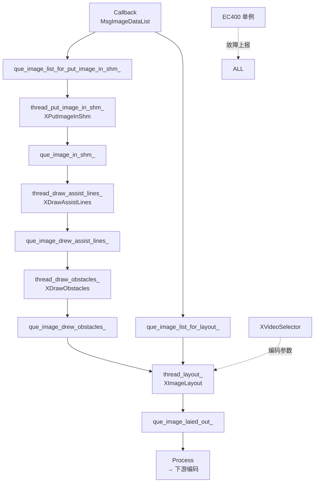
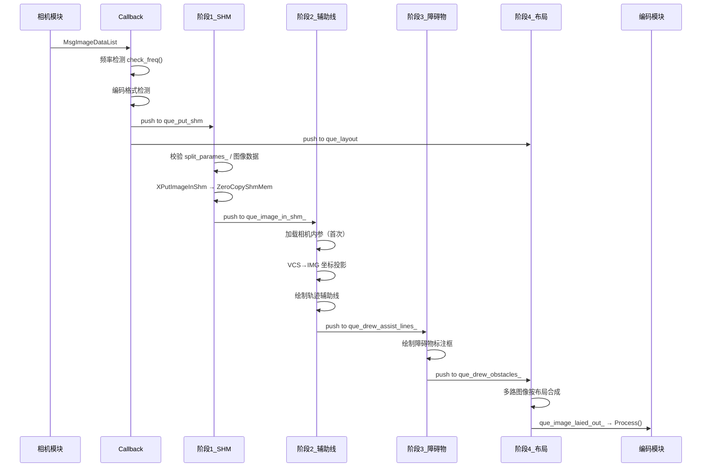

> 为规范需求分析与设计流程，统一设计文档的表达与管理方式，特制定本设计文档。
> 所有设计（包括流程图、架构说明等）以文本化描述为主，绘图使用 mermaid。

---

# 1. 文档信息

| 项目 | 内容 |
| :--- | :--- |
| **模块名称** | xvideo_editor2 |
| **模块编号** | MM-VE-002 |
| **所属系统 / 子系统** | multimedia_model / 视频编辑子系统 |
| **模块类型** | 项目定制模块 |
| **负责人** |  |
| **参与人** |  |
| **当前状态** | 草稿 |
| **版本号** | V1.0 |
| **创建日期** | 2026-03-07 |
| **最近更新** | 2026-03-07 |

---

# 2. 模块概述

## 2.1 模块定位

xvideo_editor2 是车载多相机实时视频合成与编辑模块，负责将多路原始相机图像与感知结果融合为可供录制或下行传输的视频帧。

- **职责**：接收多路相机图像数据及感知结果，完成图像拼接、辅助线绘制、障碍物标注、自适应编码参数选择，最终输出合成后的视频帧。
- **上游模块（输入来源）**：
  - 相机图像列表（`MsgImageDataList`）
  - 视觉感知结果（`MsgCameraVPResult`）
  - 语义地图（`PerceptionStaticEnv`）
  - 规划轨迹（`MsgHafEgoTrajectory`，自动/遥控两路）
  - 车辆状态（`VehicleInformation`）
  - 定位信息（`MsgHafLocation`）
  - 视频配置（`AppVideoProfile`）
  - 遥控指令（`AppRemoteControl`）
  - 业务指令（`BusinessCommand`）、规划状态（`PlanningStatus`）
  - 拼接图像（`MsgImageData`）
- **下游模块（输出去向）**：
  - 视频编码模块（通过 `Process()` 输出 `MsgImageData`）
  - 编码性能反馈（`VideoEncodingPerf`）
- **对外能力**：不直接提供 SDK/Service，通过 ADSFI 框架接口与其他模块交互。

## 2.2 设计目标

- **功能目标**：将多路相机原始图像与感知/规划数据实时合成为带辅助信息叠加的视频帧，支持多种输出模式（RGB/灰度/二值/特征图）。
- **性能目标**：单帧处理延迟 ≤ 50ms，支持 25fps 输出；编码自适应响应时间 ≤ 2000ms。
- **稳定性目标**：任意子阶段异常不影响其他线程；上报故障码辅助快速定位。
- **安全目标**：共享内存使用零拷贝接口，避免内存越界；多线程通过无锁队列或互斥量隔离。
- **可维护性目标**：故障码统一由 `EC400` 单例管理，模块内各子组件独立可替换。

## 2.3 设计约束

- **硬件平台**：MDC（自动驾驶计算平台），使用 DVPP 图像处理加速单元。
- **OS / 架构**：AOS（基于 Linux），AArch64。
- **中间件依赖**：ADSFI 框架、CustomStack 配置服务、ZeroCopyShmMem 共享内存、FaultHandle 故障上报。
- **第三方库**：OpenCV 4（imgproc/core/freetype）、Eigen、yaml-cpp、fmt、FreeType/HarfBuzz。
- **法规 / 标准**：符合项目内部 C++ 编码规范；故障码接入整车故障管理体系。

---

# 3. 需求与范围

## 3.1 功能需求（FR）

| 需求ID | 描述 | 优先级 |
| :--- | :--- | :--- |
| FR-01 | 接收多路相机图像，写入共享内存，选定主相机 | 高 |
| FR-02 | 在图像上叠加规划轨迹辅助线（自动/遥控），支持速度分段着色 | 高 |
| FR-03 | 在图像上叠加检测到的障碍物标注框 | 高 |
| FR-04 | 将多路图像按布局参数合成为单帧输出图像 | 高 |
| FR-05 | 根据网络/编码状态自适应调整编码分辨率与码率 | 中 |
| FR-06 | 检测数据接收频率，低于阈值时上报故障 | 中 |
| FR-07 | 检测图像编码格式，异常时上报故障 | 中 |
| FR-08 | 支持多种输出模式：RGB / 灰度 / 二值 / 特征图 | 中 |
| FR-09 | 支持自适应视角切换（根据转向角切换前/后视相机） | 低 |
| FR-10 | 所有可配置参数从 CustomStack 配置服务读取 | 高 |

## 3.2 非功能需求（NFR）

| 需求ID | 类型 | 指标 | 目标值 |
| :--- | :--- | :--- | :--- |
| NFR-01 | 性能 | 单帧端到端延迟 | ≤ 50ms |
| NFR-02 | 性能 | 输出帧率 | ≥ 25fps |
| NFR-03 | 性能 | 编码参数切换响应 | ≤ 2000ms |
| NFR-04 | 稳定性 | 单子线程异常不崩溃主进程 | 是 |
| NFR-05 | 可观测性 | 关键路径有日志输出 | 是 |
| NFR-06 | 资源 | 共享内存使用零拷贝 | 是 |
| NFR-07 | 可靠性 | 故障码及时上报（≤20次累计上报一次） | 是 |

## 3.3 范围界定

### 3.3.1 本模块必须实现：
- 四阶段视频处理流水线（共享内存写入 → 辅助线 → 障碍物 → 布局合成）
- 故障码统一管理与上报
- 编码参数自适应选择
- 所有配置从 CustomStack 读取，禁止硬编码

### 3.3.2 本模块明确不做：
- 图像编码压缩（由下游编码模块完成）
- 相机驱动/采集（由上游相机模块完成）
- 感知/规划算法（仅消费感知/规划结果）
- 视频文件录制/存储（由录制模块完成）

## 3.4 需求-设计-验证映射

| 需求ID | 对应设计章节 | 对应实现 | 验证方式 |
| :--- | :--- | :--- | :--- |
| FR-01 | 5.3 阶段1 | `XPutImageInShm()` | TC-01 |
| FR-02 | 5.3 阶段2 | `XDrawAssistLines()` | TC-02 |
| FR-03 | 5.3 阶段3 | `XDrawObstacles()` | TC-03 |
| FR-04 | 5.3 阶段4 | `XImageLayout()` | TC-04 |
| FR-05 | 5.2 编码自适应 | `XVideoSelector()` | TC-05 |
| FR-06 | 9. 异常处理 | `EC400::check_freq()` | TC-06 |
| FR-07 | 9. 异常处理 | `Callback` 编码格式检查 | TC-07 |
| FR-10 | 11.3 配置项 | 构造函数 + 各子模块 init | TC-08 |

---

# 4. 设计思路

## 4.1 方案概览

模块采用**四阶段串行流水线**设计，每阶段由独立线程驱动，阶段间通过无锁 SafeQueue 传递数据：

```
相机图像输入
    │
    ▼
[阶段1] put_image_in_shm 线程
    XPutImageInShm()
    · 校验布局参数与图像数据
    · 写入 ZeroCopyShmMem
    · 选定主相机区域
    │
    ▼（via que_image_in_shm_）
[阶段2] draw_assist_lines 线程
    XDrawAssistLines()
    · 加载相机内参/外参
    · VCS→IMG 坐标投影
    · 绘制规划轨迹辅助线
    │
    ▼（via que_image_drew_assist_lines_）
[阶段3] draw_obstacles 线程
    XDrawObstacles()
    · 绘制障碍物标注框
    │
    ▼（via que_image_drew_obstacles_）
[阶段4] layout 线程
    XImageLayout()
    · 按布局参数合成多路图像
    · 输出到 que_image_laied_out_
    │
    ▼
Process() → 下游编码模块
```

同时，`Callback(MsgImageDataList)` 并行向阶段1和阶段4各推一份图像列表，阶段4独立完成图像布局（不依赖阶段1~3的绘制结果，使用原始图像数据做布局）。

## 4.2 关键决策与权衡

| 决策点 | 选择 | 理由 |
| :--- | :--- | :--- |
| 多线程 vs 单线程 | 四线程流水线 | 各阶段处理时间独立，流水线提升整体吞吐 |
| SafeQueue 容量 | 无界队列 + 取最新帧 | 实时性优先，丢弃积压帧 |
| 共享内存 | ZeroCopyShmMem 零拷贝 | 避免大图像内存拷贝开销 |
| 故障上报 | EC400 单例，每20次上报一次 | 防止故障洪泛，降低系统负载 |
| 配置读取 | 构造函数一次性读取 | 避免运行时重复读取配置，提升热路径性能 |

## 4.3 与现有系统的适配

- 通过 ADSFI 框架 `BaseAdsfiInterface` 接入消息订阅/发布体系。
- 故障码接入整车 `FaultHandle::FaultApi` 故障管理系统。
- 编码参数通过 `VideoEncodingPerf` 反馈接口闭环。

## 4.4 失败模式与降级

| 失败场景 | 降级策略 |
| :--- | :--- |
| 布局参数为空 | 上报 `SPLIT_INVALID`，当帧丢弃，等待下帧 |
| 相机图像数据为空 | 上报 `DATA_EMPTY`，当帧丢弃 |
| 相机内参未加载 | 上报 `CAM_INTRINSICS_NOT_FOUND`，跳过辅助线绘制 |
| 共享内存申请失败 | 上报 `SHM_FAILED`，当帧丢弃 |
| 数据接收频率过低 | 上报 `FREQ_ERROR`，继续处理已到数据 |
| 编码格式异常 | 上报 `ENCODING_ERROR`，丢弃该帧 |

---

# 5. 架构与技术方案

## 5.1 模块内部架构



### 子模块说明

| 子模块 | 文件 | 职责 |
| :--- | :--- | :--- |
| AdsfiInterface | `adsfi_interface.cpp` | 消息路由、线程编排、生命周期管理 |
| XVideoSelector | `src/XVideoSelector/XVideoSelector.cpp` | 编码参数选择与自适应控制 |
| XPutImageInShm | `src/XPutImageInShm/XPutImageInShm.cpp` | 图像写入共享内存、主相机选定 |
| XDrawAssistLines | `src/XDrawAssistLines/XDrawAssistLines.cpp` | 轨迹辅助线绘制 |
| XImagePathPlan | `src/XDrawAssistLines/XImagePathPlan.cpp` | 相机标定、坐标系转换 |
| XDrawObstacles | `src/XDrawObstacles/XDrawObstacles.cpp` | 障碍物标注框绘制 |
| XImageLayout | `src/XImageLayout/XImageLayout.cpp` | 多路图像布局合成 |
| XVisWariningBox | `src/XVisWariningBox/XVisWariningBox.cpp` | 视觉预警框融合 |
| EC400 | `src/EC400.hpp` | 统一故障码管理 |

## 5.2 关键技术选型

| 技术点 | 方案 | 选择原因 | 备选方案 |
| :--- | :--- | :--- | :--- |
| 线程间通信 | SafeQueue（无锁队列） | 实时场景下避免锁竞争，支持超时 pop | std::queue + mutex |
| 图像处理 | DVPP（idpware） + OpenCV | MDC 平台硬件加速，OpenCV 兼容通用算法 | 纯 CPU 软件处理 |
| 共享内存 | ZeroCopyShmMem | 零拷贝，适合大图像高频传输 | POSIX shm_open |
| 坐标变换 | Eigen | 矩阵运算高效，与标定数据兼容 | OpenCV Mat |
| 配置加载 | yaml-cpp + CustomStack | 统一配置管理，支持热更新 | 硬编码 |
| 故障管理 | EC400 单例 + FaultHandle API | 集中管理，避免分散上报；频率限流防洪泛 | 各模块独立上报 |

## 5.3 核心流程

### 主处理流程



### 启动流程

1. 构造函数：初始化所有消息对象、读取 `freq_threshold_` 配置。
2. `Init()` 调用：注册 ADSFI 订阅/发布关系。
3. 四个 worker 线程在构造函数中启动，循环 `timeout_pop_latest(10ms)`。
4. 收到第一帧数据后进入正常处理流程。

### 退出流程

1. `_stopped.store(true)` 触发所有线程退出循环。
2. 各线程 `join()`。

---

# 6. 界面设计

> 本模块为纯后端处理模块，无用户交互界面，跳过本节。

---

# 7. 接口设计（评审重点）

## 7.1 对外接口

| 接口名 | 类型 | 输入 | 输出 | 频率 | 备注 |
| :--- | :--- | :--- | :--- | :--- | :--- |
| `Callback(MsgImageDataList)` | Topic订阅 | 多路相机图像列表 | 推入内部队列 | ~25Hz | 触发主处理流水线 |
| `Callback(MsgHafEgoTrajectory)` | Topic订阅 | 自动/遥控轨迹 | 更新内部状态 | 按需 | 两路独立回调 |
| `Callback(MsgHafFusionOutArray)` | Topic订阅 | 障碍物列表 | 更新 obstacles_ | 按需 | — |
| `Callback(AppVideoProfile)` | Topic订阅 | 视频配置参数 | 更新 video_parameter_ | 按需 | 影响编码策略 |
| `Process(MsgImageData)` | Pull | 无 | 合成后的单帧图像 | ~25Hz | 阻塞 10s 超时 |
| `Process(VideoEncodingPerf)` | Pull | 无 | 编码性能反馈 | 按需 | — |

## 7.2 对内接口

各阶段通过 `SafeQueue<shared_ptr<MsgImageData>>` 传递数据：

| 队列 | 生产者 | 消费者 |
| :--- | :--- | :--- |
| `que_image_list_for_put_image_in_shm_` | Callback | 阶段1线程 |
| `que_image_list_for_layout_` | Callback | 阶段4线程 |
| `que_image_in_shm_` | 阶段1 | 阶段2 |
| `que_image_drew_assist_lines_` | 阶段2 | 阶段3 |
| `que_image_drew_obstacles_` | 阶段3 | 阶段4 |
| `que_image_laied_out_` | 阶段4 | Process() |

## 7.3 接口稳定性声明

- **稳定接口**：`Callback(MsgImageDataList)`、`Process(MsgImageData)` — 变更必须评审。
- **非稳定接口**：内部各阶段队列接口 — 允许调整。

## 7.4 接口行为契约

### `Callback(MsgImageDataList)`
- **前置条件**：`image_list != nullptr`，`images` 非空。
- **后置条件**：图像数据已推入对应队列。
- **行为**：非阻塞；频率检测与编码格式检测在回调中同步执行。
- **最大执行时间**：< 1ms（仅入队，不做处理）。
- **失败语义**：`image_list == nullptr` 时直接返回，上报 `DATA_INVALID`。

### `Process(MsgImageData)`
- **前置条件**：模块已启动，处理流水线正常运行。
- **后置条件**：`image` 指向一帧合成后的图像数据。
- **行为**：阻塞等待，超时 10s 返回 -1。
- **失败语义**：超时返回 -1，image 指针不变。

---

# 8. 数据设计

## 8.1 数据结构

### VideoParameter（核心参数结构）

```
VideoParameter
├── VideoEditorParameter
│   ├── output_mode          // 1=RGB, 2=Gray, 3=Binary, 4=Feature
│   ├── remote_control_alarm // 是否开启遥控警报障碍物绘制
│   ├── remote_control_assist// 是否开启遥控轨迹绘制
│   ├── front_source         // 前视相机源选择
│   ├── split_adaptive       // 自适应视角切换开关
│   ├── video_left_/main_/right_/third_person  // 相机选择
│   ├── objects              // MsgHafFusionOutArray 障碍物
│   ├── path                 // MsgHafEgoTrajectory 自动规划路径
│   ├── remote_control       // MsgHafEgoTrajectory 遥控路径
│   └── split_parames_       // vector<AppVideoSplitParam> 布局参数
└── VideoEncodingParameter
    ├── adaptive_mode        // 自适应编码开关
    ├── rate_control_mode    // 0=码率控制, 1=质量控制
    ├── quality              // 1-51
    ├── bps/fps/encoding_gop
    └── width/height
```

### CameraIntrinsics（相机标定数据）

```
CameraIntrinsics
├── camera_type_     // 相机类型字符串
├── camera_width_/height_
├── intr_K_          // Eigen 3x3 内参矩阵
├── intr_D_          // DistortionParams（model + 系数）
├── extr_R_/R_init_  // Eigen 3x3 外参旋转矩阵
└── extr_t_          // Eigen 3x1 外参平移向量
```

## 8.2 状态机

```mermaid
stateDiagram-v2
    [*] --> 初始化 : 构造函数
    初始化 --> 运行中 : Init() 完成 + 收到第一帧
    运行中 --> 运行中 : 正常帧处理
    运行中 --> 故障告警 : EC400::ec_add()
    故障告警 --> 运行中 : EC400::ec_remove()（条件恢复后）
    运行中 --> 停止 : _stopped = true
    停止 --> [*]
```

## 8.3 数据生命周期

- **相机图像**：回调入队 → 各阶段处理 → 最终队列输出 → `Process()` 消费后释放。
- **VideoParameter**：外部 Callback 更新（加锁），内部线程读取（加锁拷贝）。
- **共享内存图像**：由 ZeroCopyShmMem 管理，模块退出时自动释放。
- **相机标定数据**：在首次调用 `setCameraDistortion()` 时从 YAML 加载，存入 `cameras_intrinsics_`，生命周期与模块一致。

---

# 9. 异常与边界处理（评审必查）

| 异常场景 | 检测方式 | 处理策略 | 是否可恢复 | 上报方式 |
| :--- | :--- | :--- | :--- | :--- |
| 配置读取失败 | `GetProjectConfigValue()` 返回 false | 使用默认值继续运行 | 是 | `EC400::CONFIG` |
| 图像列表为空（无输入） | `fusionOut/path/remote` 均空 | 丢弃当帧 | 是 | `EC400::DATA_EMPTY` |
| 图像/数据无效 | 尺寸 ≤ 0、index==0、NaN 点 | 丢弃当帧 | 是 | `EC400::DATA_INVALID` |
| 编码格式异常 | `imageType < 0` | 丢弃该帧 | 是 | `EC400::ENCODING_ERROR` |
| 数据接收频率低 | `check_freq()` < 阈值 | 继续处理，上报 | 是（频率恢复后自动清除） | `EC400::FREQ_ERROR` |
| 共享内存申请失败 | `GetAllocShmMem() == nullptr` | 丢弃当帧 | 是 | `EC400::SHM_FAILED` |
| 图像处理结果为空 | 结果指针为 null | 丢弃当帧 | 是 | `EC400::DATA_RESULT_NULL` |
| 布局参数为空 | `split_parames_.size() <= 0` | 丢弃当帧 | 是 | `EC400::SPLIT_INVALID` |
| 规划点无效 | 点数不匹配 / `point_camera[2] <= 0` | 跳过该点/段 | 是 | `EC400::PLAN_INVALID` |
| 相机类型字符串为空 | `type == ""` | 跳过辅助线绘制 | 是 | `EC400::CAM_TYPE_INVALID` |
| 相机内参未找到 | `cameras_intrinsics_.end()` / ptr==null | 跳过坐标投影 | 是（重新加载后恢复） | `EC400::CAM_INTRINSICS_NOT_FOUND` |

---

# 10. 故障码设计（评审必查）

| 故障码 | 模块类型 | 故障类型 | 故障描述 | 额外描述 | 判断标准描述 | 验证方法 | 恢复条件描述 |
| :--- | :--- | :--- | :--- | :--- | :--- | :--- | :--- |
| **4002001** | 项目定制模块 | 配置异常 | 配置参数读取失败 | 附带读取失败的配置路径字符串 | `CustomStack::GetProjectConfigValue()` 返回 false | 删除或修改配置项后重启，检查故障码是否触发 | 配置正确后重启模块 |
| **4002002** | 项目定制模块 | 数据异常 | 相机数据无输入 | fusionOut、自动轨迹、遥控轨迹三者均为空 | 三路输入数据长度均为 0 | 断开所有上游数据源，检查故障码是否触发 | 任意一路数据恢复后，故障自动消除 |
| **4002003** | 项目定制模块 | 数据异常 | 接收数据无效 | 包含图像尺寸非法、index==0 标记无效、图像指针为空、轨迹含 NaN 等场景 | 图像 width/height ≤ 0；或 index==0（硬件初始化未完成标志）；或坐标含 NaN | 构造非法数据帧注入模块，检查故障码触发 | 数据恢复正常后自动消除 |
| **4002004** | 项目定制模块 | 数据异常 | 相机编码格式错误 | 当前期望格式为 YUV420SP（NV12），imageType 应 ≥ 0 | `img.imageType < 0` | 注入 imageType = -1 的图像帧 | 编码格式恢复为合法值后自动消除 |
| **4002005** | 项目定制模块 | 频率异常 | 数据接收频率异常 | 频率阈值从配置 `video/edit/freq_threshold/image_list` 读取，默认 5Hz | 滑动窗口统计平均频率低于阈值且频率 > 0 | 降低数据发送频率至阈值以下，检查故障码触发 | 接收频率恢复超过阈值后自动消除 |
| **4002006** | 项目定制模块 | 系统异常 | 共享内存申请失败 | DVPP/ZeroCopyShmMem 分配返回 nullptr | `GetAllocShmMem()` 返回 nullptr | 模拟内存不足场景 | 内存资源释放后下帧自动恢复 |
| **4002008** | 项目定制模块 | 数据异常 | 图像处理结果为空 | 经布局合成后图像结果指针为空 | 合成结果指针 == nullptr | 构造导致合成失败的异常输入 | 合成正常后自动消除 |
| **4002009** | 项目定制模块 | 配置异常 | 拼接参数无效 | `split_parames_` 为空，说明布局配置未正确下发 | `split_parames_.size() <= 0` | 不下发布局参数，检查故障码触发 | 布局参数正常下发后，有 ec_remove 清除 |
| **4002010** | 项目定制模块 | 数据异常 | 规划点无效 | 包含左右轨迹点数不匹配、相机坐标系 Z 轴分量 ≤ 0（点在相机后方）两种场景 | `point_vec_l.size() != point_vec_r.size()`；或 `point_camera[2] <= 0` | 注入非法轨迹点数据 | 轨迹数据恢复正常后（点数匹配且 Z > 0）自动消除 |
| **4002011** | 项目定制模块 | 配置异常 | 相机类型无效 | 传入的相机类型字符串为空（""），无法匹配任何相机 | `type == ""` | 传入空字符串相机类型 | 调用方传入有效相机类型后自动消除 |
| **4002012** | 项目定制模块 | 配置异常 | 相机内参未找到 | 在已加载的内参列表中找不到指定相机类型，或对应 shared_ptr 为空，说明相机标定文件未加载或类型配置错误 | `cameras_intrinsics_` 中无匹配 type；或匹配到的 ptr == nullptr | 使用未注册的相机类型名称请求投影 | 正确加载相机标定文件并注册对应类型后自动消除 |

---

# 11. 构建与部署

## 11.1 环境依赖

| 依赖项 | 版本要求 | 说明 |
| :--- | :--- | :--- |
| 操作系统 | AOS（Linux AArch64） | MDC 计算平台 |
| 编译器 | AArch64 GCC 交叉编译工具链 | — |
| OpenCV | 4.x（MDC_SDK） | imgproc、core、freetype |
| Eigen | 3.x | 矩阵运算 |
| yaml-cpp | — | 相机标定 YAML 解析 |
| fmt | — | 格式化日志 |
| FreeType / HarfBuzz | — | 图像文字渲染 |
| ADSFI 框架 | 项目版本 | 消息订阅/发布 |
| CustomStack | 项目版本 | 配置服务 |
| ZeroCopyShmMem | 项目版本 | 共享内存 |
| FaultHandle API | 项目版本 | 故障上报 |

## 11.2 构建步骤

- 由项目统一 CMake 构建系统编译，入口配置：`model.cmake`
- 编译命令：由 MDS 工作空间一键构建，产物为动态库或可执行文件（由顶层 CMakeLists 决定）

## 11.3 配置项

> 所有可配置项必须在此列出，禁止在代码中散落硬编码。

### AdsfiInterface（adsfi_interface.cpp）

| 配置键 | 说明 | 默认值 | 是否必须 | 读取时机 |
| :--- | :--- | :--- | :--- | :--- |
| `video/edit/freq_threshold/image_list` | 图像数据接收频率下限（Hz），低于此值上报 FREQ_ERROR | 5.0 | 否 | 构造函数 |

### XVideoSelector（src/XVideoSelector/XVideoSelector.cpp）

| 配置键 | 说明 | 默认值 | 是否必须 | 读取时机 |
| :--- | :--- | :--- | :--- | :--- |
| `video/select/out_width` | 默认输出图像宽度（px） | — | 是 | 首次调用 |
| `video/select/out_height` | 默认输出图像高度（px） | — | 是 | 首次调用 |
| `video/select/out_fps` | 默认输出帧率（fps） | — | 是 | 首次调用 |
| `video/select/out_bps` | 默认输出码率（bps） | — | 是 | 首次调用 |
| `video/select/out_gop` | 默认 GOP 大小 | — | 是 | 首次调用 |
| `video/select/threshold_bps` | 自适应码率切换触发阈值（接收 FPS 阈值） | — | 是 | 首次调用 |
| `video/select/switchover_interval` | 编码参数切换最小间隔（ms） | — | 是 | 首次调用 |
| `video/select/rate_control_mode` | 码率控制模式（0=码率控制，1=质量控制） | — | 是 | 首次调用 |
| `video/select/qualities` | 各输出模式质量参数（CSV，4个值，对应 RGB/灰度/二值/特征） | — | 是 | 首次调用 |
| `video/select/point_length` | 规划轨迹点显示最大长度（m） | — | 是 | 首次调用 |
| `video/select/point_interval` | 规划轨迹点显示间隔（m） | — | 是 | 首次调用 |
| `video/select/car_length` | 车身长度（m），用于轨迹起点过滤 | — | 是 | 首次调用 |

### XDrawAssistLines（src/XDrawAssistLines/XDrawAssistLines.cpp）

| 配置键 | 说明 | 默认值 | 是否必须 | 读取时机 |
| :--- | :--- | :--- | :--- | :--- |
| `video/edit/front_ktdx_type` | 前视相机畸变模型类型（白天），如 `front_120` | `front_120` | 是 | 首次调用 |
| `video/edit/back_ktdx_type` | 后视相机畸变模型类型（白天），如 `back_120` | `back_120` | 是 | 首次调用 |
| `video/edit/front_night_ktdx_type` | 前视相机畸变模型类型（夜间） | `front_night_120` | 是 | 首次调用 |
| `video/edit/back_night_ktdx_type` | 后视相机畸变模型类型（夜间） | `back_night_120` | 是 | 首次调用 |
| `video/edit/camera_front_x` | 前视相机前方可视距离（m） | — | 是 | 首次调用 |
| `video/edit/camera_back_x` | 后视相机后方可视距离（m） | — | 是 | 首次调用 |
| `video/edit/camera_front_left_length` | 前视相机左侧边界宽度（m） | — | 是 | 首次调用 |
| `video/edit/camera_back_left_length` | 后视相机左侧边界宽度（m） | — | 是 | 首次调用 |
| `video/edit/camera_front_right_length` | 前视相机右侧边界宽度（m） | — | 是 | 首次调用 |
| `video/edit/camera_back_right_length` | 后视相机右侧边界宽度（m） | — | 是 | 首次调用 |
| `video/edit/camera_front_height` | 前视相机安装高度（m） | — | 是 | 首次调用 |
| `video/edit/camera_back_height` | 后视相机安装高度（m） | — | 是 | 首次调用 |
| `video/edit/path_type` | 路径类型标识（决定辅助线绘制风格） | — | 是 | 首次调用 |
| `video/edit/plan_path_length` | 规划路径最大显示长度（m） | — | 是 | 首次调用 |

### XImagePathPlan（src/XDrawAssistLines/XImagePathPlan.h，单例构造函数）

| 配置键 | 说明 | 默认值 | 是否必须 | 读取时机 |
| :--- | :--- | :--- | :--- | :--- |
| `video/edit/front_ktdx_type` | 前视相机畸变模型类型（与 XDrawAssistLines 共享同一键） | — | 是 | 单例初始化 |
| `video/edit/back_ktdx_type` | 后视相机畸变模型类型（与 XDrawAssistLines 共享同一键） | — | 是 | 单例初始化 |
| `video/edit/path_plan_alpha` | 轨迹曲线平滑系数（0~1，越大越平滑） | 0.2 | 是 | 单例初始化 |
| `{vehicle_cfg_path}/cameras_distortion.proj_cfg` | 相机畸变标定参数文件，路径由 `GetVehicleConfigPath()` 拼接 | — | 是 | 单例初始化 |

### XDrawObstacles（src/XDrawObstacles/XDrawObstacles.cpp）

| 配置键 | 说明 | 默认值 | 是否必须 | 读取时机 |
| :--- | :--- | :--- | :--- | :--- |
| `video/edit/target_info_color` | 障碍物标注框颜色（格式待确认） | — | 是 | 首次调用 |
| `video/edit/target_text_size` | 障碍物标注文字大小（px） | — | 是 | 首次调用 |
| `{proj_cfg_path}/wqy-microhei.ttc` | 字体文件路径，由 `GetProjectConfigPath()` 拼接 | — | 是 | 首次调用 |

### XVisWariningBox（src/XVisWariningBox/XVisWariningBox.cpp）

| 配置键 | 说明 | 默认值 | 是否必须 | 读取时机 |
| :--- | :--- | :--- | :--- | :--- |
| `Xvis_obj/filter_obj` | 视觉目标过滤对象配置 | — | 否 | 首次调用 |

## 11.4 部署结构与启动

### 部署目录结构

```text
/opt/usr/
├── lib/
│   └── libxvideo_editor2.so   （模块动态库）
└── cfg/
    └── system.proj_cfg        （配置文件）
```

### 启动 / 停止

- 随 ADSFI 进程统一启动，由框架调用 `Init()` 初始化。
- 随进程退出，析构函数设置 `_stopped=true` 后 join 各线程。

## 11.5 健康检查与启动验证

- 启动成功标志：日志出现 `"put image in shm get image list"` 表明数据流通。
- 无故障码触发（4002001~4002012）表明配置和数据均正常。
- `Process()` 能在 10s 内返回有效帧。

---

# 12. 可测试性与验证

## 12.1 单元测试

- **EC400**：验证 ec_add 频率限制（每20次上报一次）、ec_remove 清除逻辑。
- **XImagePathPlan**：验证 VCS→IMG 坐标投影精度，使用已知标定数据构造测试向量。
- **XVideoSelector**：验证编码参数在不同 FPS 下的选择逻辑。

## 12.2 集成测试

- 使用 Rosbag/录包数据重放，验证完整流水线输出图像内容正确性。
- 与下游编码模块联调，验证 `Process()` 接口数据格式兼容性。

## 12.3 可观测性

- **日志**：关键节点使用 `ApInfo("video_editor")` / `ApError("video_editor")` 输出。
- **故障码**：通过整车故障管理系统查询 4002001~4002012 的触发状态。
- **队列深度**：各 SafeQueue `size()` 日志输出用于检测积压。

---

# 13. 测试用例清单

| ID | 对应需求 | 测试项目 | 测试步骤 | 预期结果 | 测试结果 |
| :--- | :--- | :--- | :--- | :--- | :--- |
| TC-01 | FR-01 | 图像写入共享内存 | 发送有效相机图像列表 | 图像成功写入 SHM，无故障码 | — |
| TC-02 | FR-02 | 辅助线绘制 | 发送有效规划轨迹 + 相机图像 | 输出帧包含辅助线叠加 | — |
| TC-03 | FR-03 | 障碍物标注 | 发送检测障碍物数据 | 输出帧包含障碍物框 | — |
| TC-04 | FR-04 | 图像布局合成 | 发送多路图像 + 布局参数 | 合成输出帧与预期布局一致 | — |
| TC-05 | FR-05 | 自适应编码切换 | 模拟 FPS 下降至阈值以下 | 编码参数切换为低码率档位 | — |
| TC-06 | FR-06 | 频率故障检测 | 降低发送频率至 < 阈值 | 4002005 故障码触发 | — |
| TC-07 | FR-07 | 编码格式故障检测 | 发送 imageType=-1 的图像帧 | 4002004 故障码触发 | — |
| TC-08 | FR-10 | 配置读取 | 删除配置项后重启 | 4002001 故障码触发，使用默认值继续运行 | — |
| TC-09 | — | 布局参数为空 | 不下发 split_parames_ | 4002009 故障码触发，当帧丢弃 | — |
| TC-10 | — | 相机内参未加载 | 使用未注册的相机类型名 | 4002012 故障码触发，辅助线绘制跳过 | — |
| TC-11 | — | 规划轨迹含 NaN | 注入含 NaN 的轨迹点 | 4002003 故障码触发，该帧丢弃 | — |
| TC-12 | — | 相机类型字符串为空 | 传入 type="" | 4002011 故障码触发 | — |

---

# 14. 风险分析（设计评审核心）

| 风险 | 影响 | 可能性 | 应对措施 |
| :--- | :--- | :--- | :--- |
| SafeQueue 积压导致延迟增大 | 视频输出延迟 > 50ms | 中 | 设置队列容量上限，超限时丢弃最旧帧 |
| 相机标定文件不匹配 | 辅助线位置偏移 | 中 | 上报 `CAM_INTRINSICS_NOT_FOUND`，部署时校验标定文件 |
| 多线程竞争 video_parameter_ | 数据撕裂 | 低 | 已使用 `parameter_mtx` 互斥锁保护 |
| 编码参数频繁切换 | 编码器不稳定 | 中 | `switchover_interval`（2000ms）限制切换频率 |
| DVPP 硬件异常 | 图像处理失败 | 低 | 上报 `DATA_RESULT_NULL`，当帧丢弃 |
| 故障码洪泛 | FaultHandle 系统过载 | 低 | `ec_add` 每 20 次才实际上报一次 |

---

# 15. 设计评审

## 15.1 评审 Checklist

- [ ] 需求是否完整覆盖（FR-01 ~ FR-10）
- [ ] 四阶段流水线接口是否清晰稳定
- [ ] 故障码是否覆盖所有异常路径
- [ ] 所有故障码是否有对应的恢复（ec_remove）逻辑
- [ ] 性能/资源是否有可验收的指标
- [ ] 配置项是否完整列出，无硬编码
- [ ] 测试用例是否覆盖所有功能需求和非功能需求
- [ ] 共享内存生命周期是否明确

## 15.2 评审记录

| 日期 | 评审人 | 问题 | 结论 | 备注 |
| :--- | :--- | :--- | :--- | :--- |
| | | | | |

---

# 16. 变更管理

## 16.1 变更原则

- 不允许口头变更；接口 / 行为变更必须更新本文档并重新评审。

## 16.2 变更分级

| 级别 | 示例 | 是否需要评审 |
| :--- | :--- | :--- |
| L1 | 注释 / 日志 / 故障码描述文字调整 | 否 |
| L2 | 内部处理逻辑、故障码阈值 | 是 |
| L3 | 接口定义、故障码编号、队列结构 | 是（系统级） |

## 16.3 变更记录

| 版本 | 变更内容 | 影响分析 | 评审人 |
| :--- | :--- | :--- | :--- |
| V1.0 | 初始设计文档 | — | — |

---

# 17. 交付与冻结

## 17.1 设计冻结条件

- [ ] 所有接口有对应测试用例（TC-01 ~ TC-12）
- [ ] 所有故障码（4002001~4002012）有验证方案
- [ ] 所有 NFR 有可验收指标
- [ ] 异常路径全部覆盖（见第9、10节）
- [ ] 配置项列表完整可验证

## 17.2 设计与交付物映射

- 设计文档 `design_xvideo_editor2.md` ↔ `meta_model/multimedia_model/xvideo_editor2/`
- 故障码定义 ↔ `src/EC400.hpp`
- 接口定义 ↔ `adsfi_interface/adsfi_interface.h`

---

# 18. 附录

## 术语表

| 术语 | 说明 |
| :--- | :--- |
| VCS | Vehicle Coordinate System，车辆坐标系 |
| IMG | Image Coordinate System，图像坐标系 |
| DVPP | Deep Vision Pre-Processing，MDC 硬件图像处理单元 |
| SHM | Shared Memory，共享内存 |
| NV12 / YUV420SP | 相机原始图像格式（Y 分量 + UV 交错） |
| SafeQueue | 项目内部线程安全无锁队列 |
| EC400 | xvideo_editor2 统一故障码管理单例 |
| FaultHandle | 整车故障管理 API |
| CustomStack | 项目配置服务，提供 key-value 配置读取 |

## 参考文档

- `design_template.md`：设计文档模板
- `src/EC400.hpp`：故障码定义
- `adsfi_interface/adsfi_interface.h`：模块接口声明
- `src/VideoParameter.h`：核心数据结构定义
- `model.cmake`：构建配置
