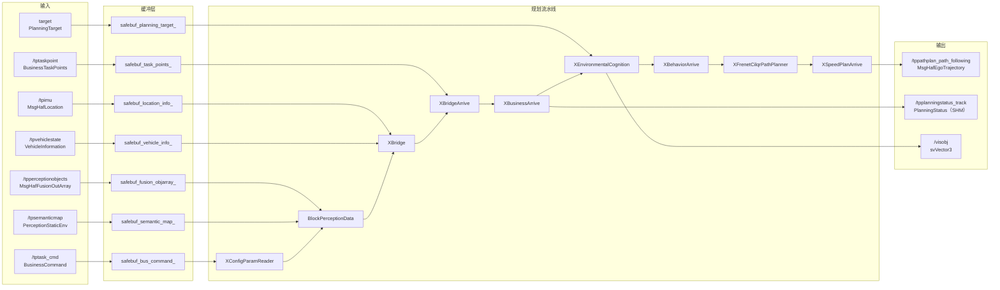
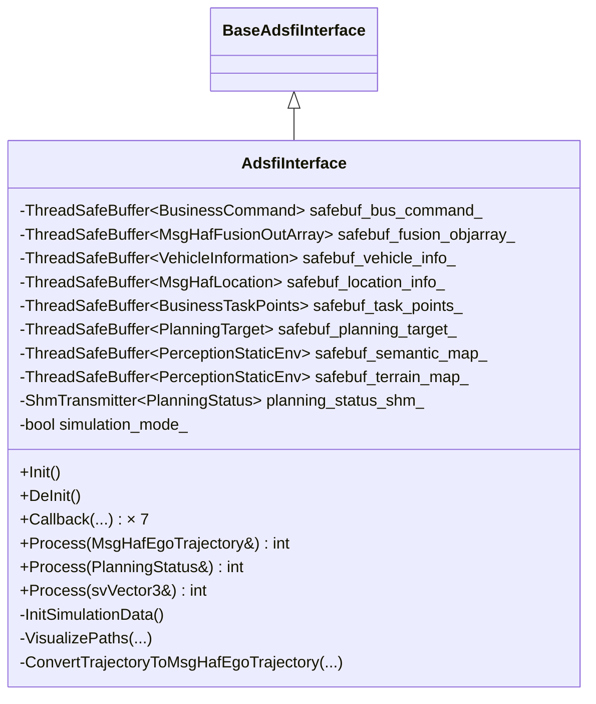
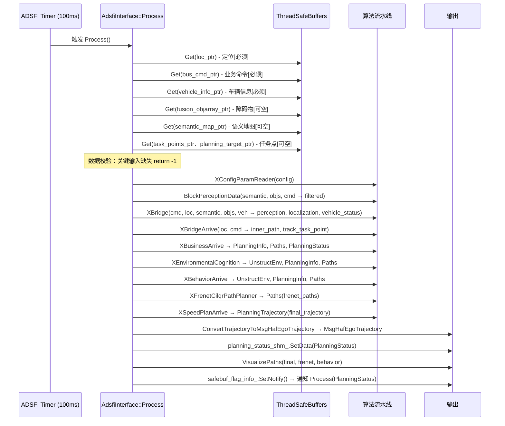
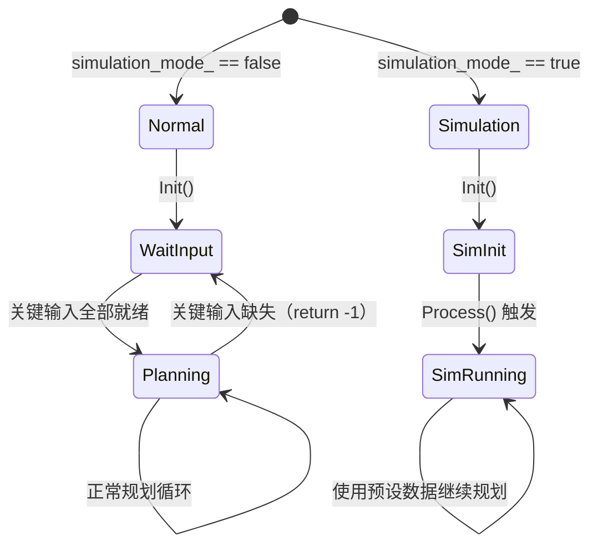

# planning_arrive_open 模块设计文档

# 1. 文档信息

| 项目 | 内容 |
| :--- | :--- |
| **模块名称** | planning_arrive_open |
| **模块编号** | — |
| **所属系统 / 子系统** | PNC / 规划（Planning） |
| **模块类型** | 项目定制模块 |
| **负责人** | [待补充] |
| **参与人** | [待补充] |
| **当前状态** | 草稿 |
| **版本号** | V1.0 |
| **创建日期** | 2026-03-05 |
| **最近更新** | 2026-03-05 |

---

# 2. 模块概述

## 2.1 模块定位

`planning_arrive_open` 是自动驾驶 PNC 系统中负责 **开放场景到达（Arrive-Open）** 模式的轨迹规划模块。其核心职责是：根据上游任务调度下发的业务路径和任务命令，融合感知、定位、车辆状态等输入，输出供底层控制执行的自车轨迹（`MsgHafEgoTrajectory`）和规划状态（`PlanningStatus`）。

- **上游模块（输入来源）**：
  - 定位模块（`/tpimu` SensorLocFusion → `MsgHafLocation`）
  - 任务调度（`/tptask_cmd` BusinessCommand、`/tptaskpoint` BusinessTaskPoints）
  - 感知融合（`/tpperceptionobjects` MsgHafFusionOutArray）
  - 语义地图（`/tpsemanticmap` PerceptionStaticEnv）
  - 地形地图（`/tpterrainmap` PerceptionStaticEnv，当前接收但未使用）
  - 车辆状态（`/tpvehiclestate` VehicleInformation）
  - 规划目标（`target` PlanningTarget）

- **下游模块（输出去向）**：
  - 控制模块（`/tppathplan_path_following` MsgHafEgoTrajectory，主轨迹输出）
  - 规划状态消费方（`/tpplanningstatus_track` PlanningStatus，经共享内存 `IdpPlanningStatus_arrive_shm` 传递）
  - 可视化工具（`/visobj` svVector3）
  - 内部调试（`casadi_path` PlanningTrajectory）

- 本模块不直接对外提供 SDK/Service/API，作为 AOS/ADSFI 框架下的可调度原子节点运行。

## 2.2 设计目标

- **功能目标**：在开放非结构化场景下，沿上游业务路径安全、平滑地规划自车行驶轨迹，支持障碍物避让和速度规划，实现"到达"任务的全程规划闭环。
- **性能目标**：定时器周期 100ms（10Hz），单帧处理须在 100ms 内完成（[推断]，基于 `SetScheduleInfo("timmer", 100)`）。
- **稳定性目标**：关键输入（定位、车辆信息、业务命令）缺失时通过明确的错误返回（`return -1`）或仿真模式降级，防止系统崩溃。
- **安全目标**：挡位输出根据轨迹方向严格映射（前进 D/倒车 R/原地转向 C/驻车 P），无轨迹时驻车兜底。
- **可维护性目标**：算法核心封装于 `planning_arrive_open_basic` 库，接口层（`AdsfiInterface`）专注数据适配，便于独立迭代。

## 2.3 设计约束

- **硬件平台**：MDC 2501（Huawei MDC，ARM 架构，LLVM 交叉编译）。MDC SDK 路径：`/usr/local/mdc_sdk_llvm/dp_gea/mdc_cross_compiler`。
- **中间件 / 框架**：ADSFI Manager（`BaseAdsfiInterface`），基于 `ThreadSafeBuffer` / `LockQueue` 进行线程安全数据传递。
- **语言标准**：C++17（`CMAKE_CXX_STANDARD 17`）。
- **依赖库**：casadi-3.6.7、PCL 1.11、OpenCV 4、yaml-cpp、Proj4、glog（见 `model.cmake`）。
- **兼容性**：核心算法以预编译 `.so`（`libplanning_arrive_open_basic.so`）或源码（`planning_arrive_open_basic_src`）两种方式集成，优先使用 `third_party`。

---

# 3. 需求与范围

## 3.1 功能需求（FR）

| 需求ID | 描述 | 优先级 |
| :--- | :--- | :--- |
| FR-01 | 接收并缓存定位、车辆状态、业务命令、感知目标、语义地图等多路输入 | 高 |
| FR-02 | 以 10Hz 定时触发，执行完整规划流水线，输出自车轨迹 | 高 |
| FR-03 | 轨迹挡位根据行驶方向（前进/倒车/原地转向）自动映射 | 高 |
| FR-04 | 规划状态（PlanningStatus）通过共享内存跨进程发布 | 高 |
| FR-05 | 支持仿真模式：无外部输入时使用预设定位/车辆信息，自动生成 100m 直线轨迹 | 中 |
| FR-06 | 语义地图（/tpsemanticmap）与地形地图（/tpterrainmap）按 topic 名称路由到不同缓冲区 | 中 |
| FR-07 | 对最终轨迹、Frenet 路径、行为路径进行速度着色可视化输出 | 低 |

## 3.2 非功能需求（NFR）

| 需求ID | 类型 | 指标 | 目标值 |
| :--- | :--- | :--- | :--- |
| NFR-01 | 性能 | 单帧规划延迟 | ≤ 100ms |
| NFR-02 | 实时性 | 输出频率 | 10Hz（定时器 100ms） |
| NFR-03 | 可靠性 | 关键输入缺失时安全退出 | 返回 -1，不崩溃 |
| NFR-04 | 稳定性 | 无轨迹时挡位兜底 | 输出 P 档（gear=0） |

## 3.3 范围界定

### 3.3.1 本模块必须实现：
- 多路 ADSFI Topic 的订阅、线程安全缓冲与分发
- planning_arrive_open_basic 流水线的编排调用
- 内部数据类型到 ADSFI 标准消息的双向转换
- PlanningStatus 的共享内存写入
- 可视化路径发布

### 3.3.2 本模块明确不做：
- 底层控制执行（横向 / 纵向控制）
- 感知融合算法
- 路由规划（业务路径由 `/tptask_cmd` 上游提供）
- 高精地图解析（使用上游语义地图数据）
- 地形地图的实际使用（当前仅接收，不传入算法流水线）

## 3.4 需求-设计-验证映射

| 需求ID | 对应设计章节 | 对应接口 | 验证方式 / 用例 |
| :--- | :--- | :--- | :--- |
| FR-01 | 5.1 / 7.1 | Callback() × 7 | TC-01 输入缺失测试 |
| FR-02 | 5.3 | Process(MsgHafEgoTrajectory) | TC-02 完整流水线正常通路 |
| FR-03 | 8.1 | ConvertTrajectoryToMsgHafEgoTrajectory() | TC-03 挡位映射验证 |
| FR-04 | 5.1 | Process(PlanningStatus) + ShmTransmitter | TC-04 共享内存读写验证 |
| FR-05 | 5.3 / 8.2 | InitSimulationData() | TC-05 仿真模式回归测试 |
| FR-06 | 7.1 | Callback(PerceptionStaticEnv) | TC-06 双路 StaticEnv 路由 |

---

# 4. 设计思路

## 4.1 方案概览

模块采用 **输入缓冲 → 定时触发 → 顺序流水线** 的设计模式：

1. 多个 `Callback` 函数异步接收各路 topic 数据，写入对应的 `ThreadSafeBuffer`（无锁/有锁缓冲队列）。
2. ADSFI 定时器以 100ms 周期触发 `Process(MsgHafEgoTrajectory)`。
3. Process 从各缓冲中 Get 最新数据，按固定顺序依次调用 10 个算法子模块（流水线）。
4. 最终轨迹经类型转换后输出；PlanningStatus 写入共享内存；路径可视化发布。



## 4.2 关键决策与权衡

| 决策点 | 选择方案 | 权衡说明 |
| :--- | :--- | :--- |
| 算法封装 | 核心算法以 `libplanning_arrive_open_basic.so` 预编译库提供 | 保护算法实现，接口层专注适配；代价是调试时无法直接查看算法源码 |
| 数据传递 | `ThreadSafeBuffer`（最新值覆盖语义） | 规划以最新数据为准，避免队列积压；代价是可能丢帧 |
| PlanningStatus 发布 | 共享内存（`ShmTransmitter`）+ Topic 双路 | 共享内存低延迟，Topic 兼容订阅方解耦；Process(PlanningStatus) 等待 flag 通知确保同步 |
| 仿真模式 | 预设北京坐标 + 自动生成 100m 直线轨迹 | 便于无实车环境下验证流水线完整性 |
| 挡位映射 | 轨迹点 `type==1` → C（原地转向），`direction` 决定 D/R | 在前向/倒车/原地三类运动模式全覆盖 |

## 4.3 与现有系统的适配

- 通过 `BaseAdsfiInterface` 接口与 ADSFI 框架解耦，节点生命周期（Init/DeInit/Callback/Process）由框架统一管理。
- 类型适配：使用 `Vector3 = ara::adsfi::MsgPoint3D`、`svVector3 = ara::adsfi::MsgPoint3DVec` 类型别名避免与本地类型冲突（见 `adsfi_interface.h:5-31`）。
- 坐标系适配：通过 `GeoTool::GPS2GCCS` 将 WGS84 经纬度转换为 UTM 坐标系。

## 4.4 失败模式与降级

| 失败场景 | 降级策略 |
| :--- | :--- |
| 定位数据缺失（`bGet_loc_inf == false`） | 非仿真模式：直接 `return -1`，本帧不输出轨迹 |
| 业务命令缺失（`bGet_bus_cmd == false`） | 非仿真模式：`return -1`；仿真模式：自动生成 100m 直线轨迹 |
| 车辆信息缺失 | 非仿真模式：`return -1`；仿真模式：使用默认零速状态 |
| 融合障碍物缺失 | 使用空的 FusionObjectArray，非仿真模式发出 WARN 但继续执行 |
| 语义地图缺失 | 使用空 PerceptionStaticEnv，发出 WARN 继续执行 |
| 轨迹为空 | `ConvertTrajectory` 输出 gear=0（P档），控制层收到空轨迹驻车 |
| 共享内存写入失败 | Init 阶段记录 WARN，不影响 Topic 发布路径 |

---

# 5. 架构与技术方案

## 5.1 模块内部架构



**线程模型：**
- `Callback` 系列函数由 ADSFI 框架在数据接收线程中调用，写入 `ThreadSafeBuffer`（线程安全）。
- `Process` 函数由 ADSFI 定时器线程以 100ms 周期调用，读取缓冲区并顺序执行流水线。
- `Process(PlanningStatus)` 通过 `safebuf_flag_info_.WaitForGet()` 阻塞等待主 Process 完成通知后再读取共享内存。

**子模块划分：**

| 子模块 | 来源 | 职责 |
| :--- | :--- | :--- |
| `XConfigParamReader` | planning_arrive_open_basic | 读取配置参数，填充 `ConfigInfo` |
| `BlockPerceptionData` | planning_arrive_open_basic | 感知数据预处理，过滤/清理语义地图和目标 |
| `XBridge` | planning_arrive_open_basic | 数据桥接，将 ADSFI 原始消息转换为内部规划数据结构 |
| `XBridgeArrive` | planning_arrive_open_basic | Arrive 模式路径桥接，业务路径转内部 InnerPath |
| `XBusinessArrive` | planning_arrive_open_basic | 业务逻辑规划（任务跟踪、状态机、参考线生成）|
| `XEnvironmentalCognition` | planning_arrive_open_basic | 环境认知（非结构化环境建模、可行驶区域分析）|
| `XBehaviorArrive` | planning_arrive_open_basic | 行为规划（超车、避障决策）|
| `XFrenetCilqrPathPlanner` | planning_arrive_open_basic | Frenet 坐标系 + CILQR / Hybrid A* 路径规划 |
| `XSpeedPlanArrive` | planning_arrive_open_basic | Arrive 模式速度规划，生成最终带速度的轨迹 |
| `AdsfiInterface` (本模块) | 本仓库 | ADSFI 框架适配、数据转换、流水线编排 |

## 5.2 关键技术选型

| 技术点 | 方案 | 选择原因 | 备选方案 |
| :--- | :--- | :--- | :--- |
| 路径规划 | Frenet-CILQR + Hybrid A* | 非结构化场景通用性强，CasADi 提供高效数值优化 | RRT, Lattice Planner |
| 轨迹优化 | CasADi 3.6.7 | 支持自动微分和 NLP 求解，适合约束优化 | OSQP, IPOPT |
| 感知数据处理 | PCL 1.11 | 点云处理标准库，硬件 SDK 原生支持 | — |
| 坐标转换 | Proj4 + 自研 GeoTool | WGS84↔UTM 转换可靠，自研工具封装业务坐标变换 | GeographicLib |
| 配置读取 | yaml-cpp | 简单灵活，适合参数文件 | 硬编码、ini |
| 日志 | ApLogInterface + glog | 兼容平台 AP 日志体系 | spdlog |
| 共享内存 | `avos::common::ShmTransmitter` | 自研封装，进程间低延迟数据共享 | DDS |

## 5.3 核心流程

### 主流程（`Process(MsgHafEgoTrajectory)`）



### 异常流程

- 定位缺失 → 非仿真：`return -1`，本帧跳过
- 仿真模式下缺失业务命令 → 生成当前位置前方 100m 直线轨迹（1m 间隔，101 个点）
- 融合障碍物缺失 → 构造空数组，继续规划（日志 WARN）

### 启动 / 退出流程

- **Init**：设置 100ms 定时器、初始化 ApLog、初始化共享内存写入器（`InitWriter("IdpPlanningStatus_arrive_shm", 10)`）、可选初始化仿真数据。
- **DeInit**：记录日志，资源由 RAII 自动释放。

---

# 6. 界面设计

本模块为纯算法/后端节点，无用户界面。本节不适用。

---

# 7. 接口设计

## 7.1 对外接口

### 订阅 Topic（输入）

| 接口名 | Topic | 消息类型 | 频率 | 备注 |
| :--- | :--- | :--- | :--- | :--- |
| Callback (BusinessCommand) | `/tptask_cmd` | `ara::adsfi::BusinessCommand` | 任务变更时 | 包含业务路径和任务命令 |
| Callback (MsgHafFusionOutArray) | `/tpperceptionobjects` | `ara::adsfi::MsgHafFusionOutArray` | ~10Hz | 融合障碍物目标 |
| Callback (MsgHafLocation) | `/tpimu` | `ara::adsfi::MsgHafLocation` | ~10Hz | 定位信息（必须） |
| Callback (VehicleInformation) | `/tpvehiclestate` | `ara::adsfi::VehicleInformation` | ~10Hz | 底盘车辆状态（必须） |
| Callback (BusinessTaskPoints) | `/tptaskpoint` | `ara::adsfi::BusinessTaskPoints` | 任务变更时 | 任务点列表 |
| Callback (PlanningTarget) | `target` | `PlanningTarget` | 按需 | 跟随目标（可选） |
| Callback (PerceptionStaticEnv) | `/tpsemanticmap` | `ara::adsfi::PerceptionStaticEnv` | ~10Hz | 语义地图，按 name 路由 |
| Callback (PerceptionStaticEnv) | `/tpterrainmap` | `ara::adsfi::PerceptionStaticEnv` | ~10Hz | 地形地图（接收缓存，暂不使用）|

### 发布 Topic（输出）

| 接口名 | Topic | 消息类型 | 频率 | 备注 |
| :--- | :--- | :--- | :--- | :--- |
| Process (MsgHafEgoTrajectory) | `/tppathplan_path_following` | `ara::adsfi::MsgHafEgoTrajectory` | 10Hz | 主规划轨迹，含速度/加速度/挡位 |
| Process (PlanningStatus) | `/tpplanningstatus_track` | `ara::adsfi::PlanningStatus` | 10Hz（等待通知）| 同时写共享内存 `IdpPlanningStatus_arrive_shm` |
| Process (svVector3) | `/visobj` | `svVector3` | 10Hz | 可视化对象（当前空实现）|

## 7.2 对内接口

各子模块通过 C 函数接口调用（均为同步调用，在 Process 中顺序执行）：

| 子模块函数 | 关键输入 | 关键输出 |
| :--- | :--- | :--- |
| `XConfigParamReader(config)` | — | `ConfigInfo` |
| `BlockPerceptionData(semantic, objs, cmd, →semantic_out, objs_out)` | 语义地图、感知目标、业务命令 | 过滤后的语义地图和目标 |
| `XBridge(cmd, loc, semantic, objs, veh, →perception, localization, vehicle)` | 原始 ADSFI 消息 | 内部规划数据结构 |
| `XBridgeArrive(loc, cmd, →inner_path, track_task_point)` | 定位、业务命令 | 内部路径、跟踪任务点 |
| `XBusinessArrive(loc, path, veh, task, cfg, last_paths, →info, paths, status)` | 内部路径、任务点、配置 | PlanningInfo、Paths、PlanningStatus |
| `XEnvironmentalCognition(loc, perception, veh, cfg, info, paths, target, →unstruct, info_out, paths_out, vis)` | 感知、定位、规划信息 | 非结构化环境、更新后路径 |
| `XBehaviorArrive(loc, veh, cfg, unstruct, info, paths, →unstruct_out, info_out, paths_out)` | 非结构化环境、行为输入 | 行为决策后路径 |
| `XFrenetCilqrPathPlanner(loc, perception, veh, cfg, unstruct, paths, info, →out_paths)` | 行为路径、感知 | CILQR 优化路径 |
| `XSpeedPlanArrive(loc, perception, veh, cfg, info, paths1, paths2, →out_paths, trajectory)` | Frenet 路径 | 最终带速度轨迹 `PlanningTrajectory` |

## 7.3 接口稳定性声明

- **稳定接口**：`/tppathplan_path_following`（MsgHafEgoTrajectory）、`/tpplanningstatus_track`（PlanningStatus）——变更须系统评审。
- **非稳定接口**：`/visobj`、`casadi_path`（调试/可视化用途，允许调整）。

## 7.4 接口行为契约

### `Process(MsgHafEgoTrajectory)`

| 属性 | 说明 |
| :--- | :--- |
| **前置条件** | 定位（`MsgHafLocation`）、业务命令（`BusinessCommand`）、车辆信息（`VehicleInformation`）至少各到达过一帧 |
| **后置条件** | `planning_result_ptr` 填充有效轨迹（可为空轨迹但结构完整），`PlanningStatus` 已写入共享内存 |
| **阻塞** | 否（定时器回调，不阻塞） |
| **可重入** | 否（含大量 `static` 局部变量，不可重入）|
| **最大执行时间** | [推断] ≤ 100ms |
| **失败语义** | 返回 -1 表示本帧跳过，框架不发布轨迹 |

### `Process(PlanningStatus)`

| 属性 | 说明 |
| :--- | :--- |
| **前置条件** | 等待 `safebuf_flag_info_` 通知（由主 Process 触发） |
| **阻塞** | **是**（`WaitForGet` 阻塞等待，直到主 Process 完成）|
| **失败语义** | 共享内存读取失败返回 -1 |

---

# 8. 数据设计

## 8.1 核心数据结构

| 数据结构 | 类型 / 来源 | 职责 |
| :--- | :--- | :--- |
| `ara::adsfi::BusinessCommand` | ADSFI msg | 任务命令：业务路径点（UTM坐标）、最大速度、任务模式 |
| `ara::adsfi::MsgHafLocation` | ADSFI msg | 定位：LLH（经纬高）、UTM 位姿（pose/dr_pose）、速度、定位状态 |
| `ara::adsfi::VehicleInformation` | ADSFI msg | 车辆状态：速度、转角、加速度、驾驶模式、挡位 |
| `ara::adsfi::MsgHafFusionOutArray` | ADSFI msg | 融合目标数组：相对/绝对坐标、速度、尺寸、类别 |
| `ara::adsfi::PerceptionStaticEnv` | ADSFI msg | 语义地图 / 地形地图 |
| `PerceptionFinalObjects` | 内部结构 | 规划内部使用的感知目标格式 |
| `avos::planning::LocalizationData` | 内部结构 | 规划内部定位数据 |
| `avos::planning::VehicleStatus` | 内部结构 | 规划内部车辆状态 |
| `avos::planning::Perception` | 内部结构 | 规划内部感知数据 |
| `avos::planning::ConfigInfo` | 内部结构 | 规划配置参数 |
| `avos::planning::InnerPath` | 内部结构 | 内部业务路径（XBridgeArrive 输出）|
| `avos::planning::PlanningInfo` | 内部结构 | 规划状态信息（各阶段流转）|
| `avos::planning::UnstructEnv` | 内部结构 | 非结构化环境建模（栅格/自由空间）|
| `avos::planning::Paths` | 内部结构 | 路径集合（各阶段候选路径）|
| `PlanningTrajectory` | 内部结构 | 最终轨迹：含 x/y/xg/yg/angle/velocity/a/t/curvature/direction/type |
| `ara::adsfi::MsgHafEgoTrajectory` | ADSFI msg | 对外输出轨迹：含 trajectoryPoints、wayPoints、gear |
| `ara::adsfi::PlanningStatus` | ADSFI msg | 规划任务状态 |

### 轨迹转换关键字段映射

| PlanningTrajectory 字段 | MsgHafEgoTrajectory 字段 | 说明 |
| :--- | :--- | :--- |
| `header.time` | `egoTrajectoryHeader.timestamp` | 通过 `DoubleToHafTime()` 转换 |
| `trajectory[i].velocity` | `trajectoryPoints[i].speed` | 速度（m/s）|
| `trajectory[i].a` | `trajectoryPoints[i].acc` | 加速度 |
| `trajectory[i].t` | `trajectoryPoints[i].timeRelative` | 相对时间 |
| `trajectory[i].x/y` | `wayPoint.x/y` | 车体坐标系位置 |
| `trajectory[i].xg/yg` | `wayPoint.xg/yg` | UTM 全局坐标 |
| `trajectory[i].angleglobal` | `wayPoint.theta` | 全局航向角 |
| `trajectory[i].curvature` | `wayPoint.curvature` | 曲率 |
| `trajectory[i].length` | `wayPoint.s` | 弧长 |

### 挡位映射

| 条件 | gear 值 | 含义 |
| :--- | :--- | :--- |
| 轨迹为空 | 0 | P（驻车）|
| `trajectory.front().type == 1` | 4 | C（原地中心转向）|
| `trajectory.back().direction == 0` | 3 | D（前进）|
| `trajectory.back().direction == 1` | 1 | R（倒车）|
| 其他 direction | 0 | P（兜底）|

## 8.2 状态机（仿真模式）



## 8.3 数据生命周期

- `ThreadSafeBuffer` 中的数据：Callback 写入，Process 读取，覆盖语义（仅保存最新一帧）。
- 算法流水线中的 `static` 变量：跨帧持久，模拟状态保持（无显式清理，进程级生命周期）。
- `PlanningStatus` 共享内存：每帧 Process 后 `SetData` 更新，持久存活至进程退出。

---

# 9. 异常与边界处理

| 异常场景 | 检测方式 | 处理策略 | 是否可恢复 | 上报方式 |
| :--- | :--- | :--- | :--- | :--- |
| 定位数据未到达 | `bGet_loc_inf == false` | 非仿真：`return -1` 跳帧；仿真：使用预设 | 是（等待下帧） | ApInfo |
| 业务命令未到达 | `bGet_bus_cmd == false` | 非仿真：`return -1`；仿真：生成默认轨迹 | 是 | ApInfo |
| 车辆信息未到达 | `bGet_veh_inf == false` | 非仿真：`return -1`；仿真：使用默认零速 | 是 | ApInfo |
| 融合目标未到达 | `bGet_fus_obj == false` | 使用空数组继续执行 | 是 | ApWarn（非仿真）|
| 语义地图未到达 | `bGet_semantic_map == false` | 使用空 PerceptionStaticEnv 继续执行 | 是 | ApWarn |
| PerceptionStaticEnv topic 名称未知 | `name` 不含 semantic/terrain | 默认路由到 semantic 缓冲 | 是 | ApWarn |
| 共享内存初始化失败 | `InitWriter` 返回非零 | 记录日志，不影响 Topic 发布 | 是（降级发布）| ApInfo |
| 轨迹点为空 | `in.trajectory.empty()` | `gear = 0`（P档），输出空轨迹 | 是 | ApInfo (gear 值) |
| `planning_result_ptr` 为空指针 | 无显式检查（[推断]由框架保证非空）| — | — | — |

---

# 10. 性能与资源预算

## 10.1 性能指标

| 场景 | 指标 | 目标值 | 测试方法 |
| :--- | :--- | :--- | :--- |
| 正常规划帧 | 端到端延迟（Callback→轨迹输出）| ≤ 100ms | 日志时间戳 / Trace |
| 流水线各子模块 | 单阶段耗时 | [待补充] | perf 打点 |
| 仿真模式启动 | 初始化耗时 | < 1s | [待补充] |

## 10.2 资源预算

| 资源 | 常态 | 峰值 | 上限约束 |
| :--- | :--- | :--- | :--- |
| CPU | [待补充] | [待补充] | MDC 平台限制 |
| 内存 | [待补充] | [待补充] | [待补充] |
| 共享内存（SHM）| 1 × PlanningStatus（~几十字节）| 同左 | 10 个 slot（`InitWriter("...", 10)`）|

---

# 11. 构建与部署

## 11.1 环境依赖

| 依赖项 | 版本要求 | 说明 |
| :--- | :--- | :--- |
| 操作系统 | MDC OS（ARM）| 目标平台 |
| 编译器 | LLVM / Clang（MDC SDK）| 交叉编译 |
| C++ 标准 | C++17 | `CMAKE_CXX_STANDARD 17` |
| CMake | ≥ 3.12 | `CONFIGURE_DEPENDS` 特性要求 |
| casadi | 3.6.7 | 数值优化，位于 `third_party/casadi-3.6.7` |
| PCL | 1.11 | 点云处理，来自 MDC SDK sysroot |
| OpenCV | 4.x | 来自 MDC SDK sysroot |
| yaml-cpp | — | 配置解析 |
| Proj4 | — | 坐标转换，位于 `third_party/proj4` |
| planning_arrive_open_basic | — | 核心算法库（`.so` 或源码）|

## 11.2 构建步骤

### 依赖来源

- MDC SDK：`/usr/local/mdc_sdk_llvm/dp_gea/mdc_cross_compiler`
- 第三方库：`workspace/third_party/`
- 核心算法库（二选一）：
  - 预编译：`third_party/planning_arrive_open_basic/lib/libplanning_arrive_open_basic.so`
  - 源码：`meta_model/pnc_model/planning_arrive_open_basic_src/`

### 构建命令

通过上层 CMake 工程统一构建，`model.cmake` 作为模块描述文件被上层引用：

```cmake
include(${CMAKE_CURRENT_LIST_DIR}/planning_arrive_open/model.cmake)
```

核心编译单元：
```
adsfi_interface/adsfi_interface.cpp
common/common_base/util/geotool.cc
```

链接产物：集成至上层可执行文件 / 共享库中（作为 ADSFI 节点部署）。

## 11.3 配置项

配置文件：`config/global.conf`（JSON 格式，ADSFI 框架加载）

| 配置项（Topic）| 说明 | 默认值 |
| :--- | :--- | :--- |
| `/tpimu` | 定位输入 topic | `SensorLocFusion` 类型 |
| `/tpsemanticmap` | 语义地图 topic | `PerceptionStaticEnv` 类型 |
| `/tpvehiclestate` | 车辆状态 topic | `VehicleInformation` 类型 |
| `/tptask_cmd` | 任务命令 topic | `BusinessCommand` 类型 |
| `/tptaskpoint` | 任务点 topic | `BusinessTaskPoints` 类型 |
| `target` | 规划目标 topic | `PlanningTarget` 类型 |
| `/tpperceptionobjects` | 感知融合目标 topic | `PerceptionFinalObjects`（实际为 MsgHafFusionOutArray）|
| `/tpplanningstatus_track` | 规划状态输出 topic | `PlanningStatus` 类型 |
| `/tppathplan_path_following` | 轨迹输出 topic | `PlanningTrajectory`（实际转为 MsgHafEgoTrajectory）|
| `/visobj` | 可视化输出 topic | `svVector3` 类型 |

算法参数通过 `XConfigParamReader` 读取（具体参数文件路径 [待补充]）。

## 11.4 部署结构与启动

```text
planning_arrive_open/
├── adsfi_interface/
│   ├── adsfi_interface.h
│   └── adsfi_interface.cpp
├── config/
│   └── global.conf          ← ADSFI 框架加载
└── model.cmake              ← 构建描述
```

- 启动：由 ADSFI 框架统一管理节点生命周期，调用 `Init()` 后自动启用定时器。
- 停止：ADSFI 框架调用 `DeInit()`。

---

# 12. 可测试性与验证

## 12.1 单元测试

- 可独立测试 `ConvertTrajectoryToMsgHafEgoTrajectory`（纯数据转换，无副作用）。
- 可 Mock `ThreadSafeBuffer` 注入测试数据，验证 `Process` 的输入缺失降级逻辑。
- `XConfigParamReader`、各算法子模块可通过 `planning_arrive_open_basic_src` 源码独立测试。

## 12.2 集成测试

- 上下游联调：与定位模块、感知融合模块、控制模块的 topic 接口联调。
- 仿真模式：开启 `simulation_mode_` 验证完整流水线通路（无需硬件）。
- 共享内存验证：同时启动 `Process(PlanningStatus)` 消费方，验证 flag 通知机制。

## 12.3 可观测性

- **日志**：每个 Callback/Process 入口、关键分支均有 `ApInfo`/`ApWarn` 打点（log tag: `"planning_arrive_open"`）。
- **可视化**：
  - `/visobj`：环境认知可视化对象
  - `planning/arrive_final_trajectory`：最终轨迹（速度着色，40km/h 为上限）
  - `planning/arrive_frenet_path`：Frenet 路径
  - `planning/arrive_behavior_path`：行为路径
- **共享内存**：`IdpPlanningStatus_arrive_shm`，可通过 SHM 读接口独立监控规划状态。
- **CODETAG**：`AVOS_CODETAG_ADV1` 在 BusinessCommand 回调中记录路径点数（用于性能追踪）。

---

# 13. 测试用例清单

| ID | 对应需求 | 测试项目 | 测试步骤 | 预期结果 | 测试结果 |
| :--- | :--- | :--- | :--- | :--- | :--- |
| TC-01 | FR-01/FR-02 | 定位缺失时跳帧 | 不发布 `/tpimu`，触发 Process | 返回 -1，无轨迹输出 | |
| TC-02 | FR-02 | 完整输入正常规划 | 发布所有必须 topic，触发 Process | 返回 0，输出有效 MsgHafEgoTrajectory | |
| TC-03 | FR-03 | 挡位前进映射 | 输入 direction=0 轨迹 | gear=3（D档）| |
| TC-04 | FR-03 | 挡位倒车映射 | 输入 direction=1 轨迹 | gear=1（R档）| |
| TC-05 | FR-03 | 挡位原地转向映射 | 输入 type=1 轨迹点 | gear=4（C档）| |
| TC-06 | FR-03 | 空轨迹挡位兜底 | 算法输出空 PlanningTrajectory | gear=0（P档）| |
| TC-07 | FR-04 | 共享内存写入 | 正常 Process 后读取 SHM | PlanningStatus 更新 | |
| TC-08 | FR-05 | 仿真模式无业务命令 | 开启仿真模式，不发布 `/tptask_cmd` | 自动生成 100m 直线轨迹（101点）| |
| TC-09 | FR-06 | 语义/地形地图路由 | 分别发布 `/tpsemanticmap` 和 `/tpterrainmap` | 路由到对应缓冲区 | |

---

# 14. 风险分析

| 风险 | 影响 | 可能性 | 应对措施 |
| :--- | :--- | :--- | :--- |
| `static` 局部变量线程安全问题 | Process 函数内大量 static 变量，若被多线程调用会数据竞争 | 低（当前为单线程 Process）| 保持框架保证单线程调用；若框架升级需重构 |
| `planning_arrive_open_basic` 库黑盒 | 算法异常难以快速定位 | 中 | 增加流水线各阶段日志输出；保留源码版本用于调试 |
| 地形地图未使用 | 功能不完整，开放场景性能受限 | 中 | 明确 backlog 将 terrain map 集成至 BlockPerceptionData 或 XEnvironmentalCognition |
| CasADi 求解器耗时不稳定 | 偶发超时导致规划延迟 > 100ms | 中 | 设置 CasADi 求解时间上限；超时时复用上帧轨迹 |
| 共享内存初始化失败（`ret != 0`）| PlanningStatus 不能通过 SHM 发布 | 低 | 已降级为 Topic 发布；需监控 Init 日志 |
| 仿真模式预设坐标硬编码 | 测试场景受限（固定北京位置） | 低 | 可通过环境变量参数化初始坐标 |

---

# 15. 设计评审

## 15.1 评审 Checklist

- [ ] 需求是否完整覆盖
- [ ] 接口是否清晰稳定
- [ ] 界面设计是否完整（纯算法模块，不适用）
- [ ] 异常路径是否完整（地形地图未使用路径待确认）
- [ ] 性能 / 资源是否有上限（性能指标待实测补充）
- [ ] 构建与部署步骤是否完整可执行
- [ ] 是否存在过度设计
- [ ] 测试用例是否覆盖所有功能需求和非功能需求

## 15.2 评审记录

| 日期 | 评审人 | 问题 | 结论 | 备注 |
| :--- | :--- | :--- | :--- | :--- |
| | | | | |

---

# 16. 变更管理

## 16.1 变更原则

- 不允许口头变更
- 接口 / 行为变更必须记录

## 16.2 变更分级

| 级别 | 示例 | 是否需要评审 |
| :--- | :--- | :--- |
| L1 | 注释 / 日志优化 | 否 |
| L2 | 流水线子模块参数调整、降级策略修改 | 是 |
| L3 | 订阅/发布 topic 变更、接口签名变更、挡位映射变更 | 是（系统级）|

## 16.3 变更记录

| 版本 | 变更内容 | 影响分析 | 评审人 |
| :--- | :--- | :--- | :--- |
| V1.0 | 初版设计文档 | — | — |

---

# 17. 交付与冻结

## 17.1 设计冻结条件

- [ ] 所有接口有对应测试用例
- [ ] 所有 NFR 有验证方案（性能指标待实测）
- [ ] 异常路径已覆盖（地形地图集成路径待确认）
- [ ] 构建与部署文档可执行验证通过
- [ ] 变更影响分析完成

## 17.2 设计与交付物映射

- 设计文档 ↔ `planning_arrive_open/adsfi_interface/adsfi_interface.cpp`
- 接口文档 ↔ `planning_arrive_open/adsfi_interface/adsfi_interface.h`
- 核心算法 ↔ `third_party/planning_arrive_open_basic/` 或 `planning_arrive_open_basic_src/`
- 构建配置 ↔ `planning_arrive_open/model.cmake`
- 运行配置 ↔ `planning_arrive_open/config/global.conf`

---

# 18. 附录

## 术语表

| 术语 | 说明 |
| :--- | :--- |
| ADSFI | Autonomous Driving Software Framework Interface，自动驾驶软件框架接口 |
| PNC | Planning & Control，规划与控制 |
| Arrive | 到达模式，开放场景下按路径导航到达目标点的驾驶模式 |
| UTM | Universal Transverse Mercator，通用横轴墨卡托坐标系 |
| CILQR | Constrained Iterative Linear Quadratic Regulator，约束迭代线性二次型调节器 |
| Frenet | 以参考线为基准的曲线坐标系（纵向 s / 横向 l）|
| Hybrid A* | 混合 A* 算法，支持非完整性约束的路径搜索 |
| SHM | Shared Memory，共享内存 |
| ThreadSafeBuffer | 线程安全最新值缓冲区（覆盖写语义）|
| InnerPath | 规划内部使用的业务路径（由 XBridgeArrive 从 BusinessCommand 转换）|
| UnstructEnv | 非结构化环境建模数据（可行驶区域、动态障碍物分布等）|
| MDC | 华为 MDC（Mobile Data Center）自动驾驶计算平台 |

## 参考文档

- ADSFI Manager 框架接口规范（[待补充]）
- planning_arrive_open_basic 库接口文档（[待补充]）
- MDC 2501 硬件接口规范（[待补充]）
- xkit/planning/datapool 数据结构说明（[待补充]）
