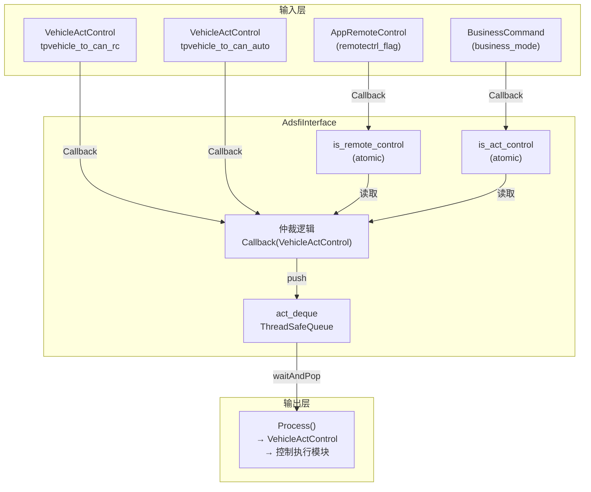
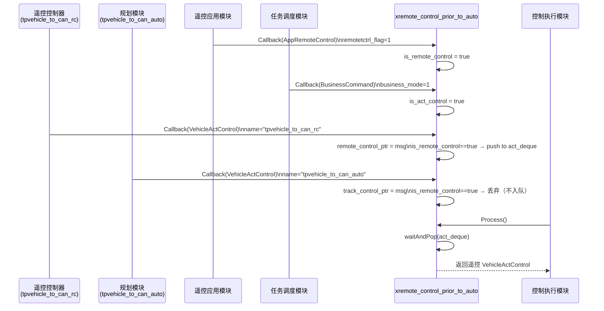
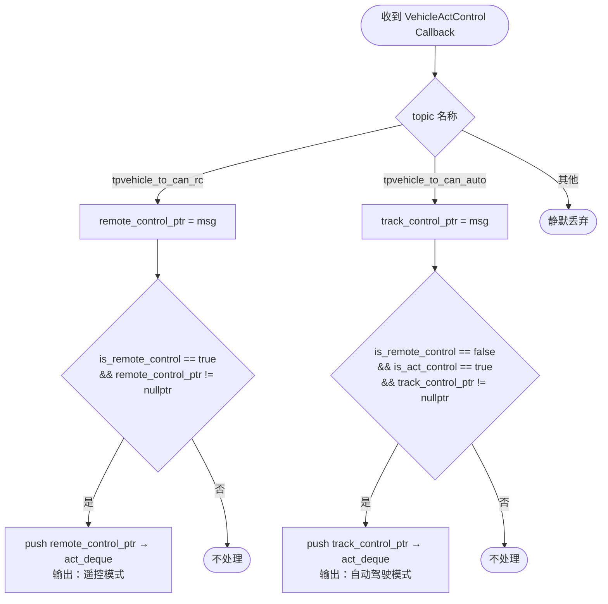
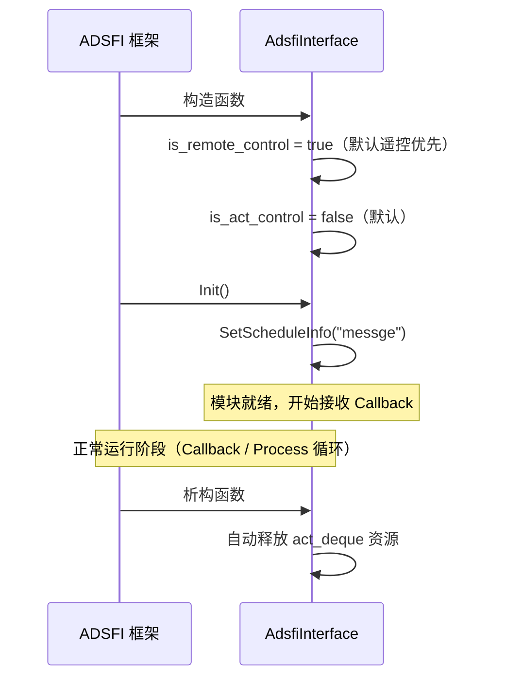
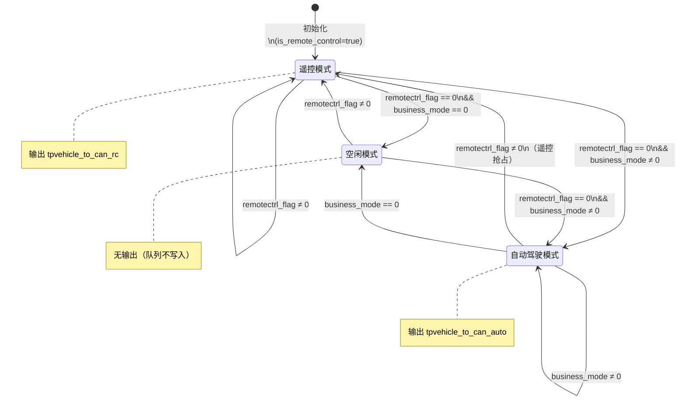

# 1. 文档信息

| 项目 | 内容 |
| :--- | :--- |
| **模块名称** | xremote_control_prior_to_auto |
| **模块编号** | PNC-XRCP-001 |
| **所属系统 / 子系统** | PNC 模型（Planning, Navigation, Control） |
| **模块类型** | 平台模块 |
| **负责人** |  |
| **参与人** |  |
| **当前状态** | 草稿 |
| **版本号** | V1.0 |
| **创建日期** | 2026-03-03 |
| **最近更新** | 2026-03-03 |

---

# 2. 模块概述

## 2.1 模块定位

本模块是 PNC 层的**控制权仲裁模块**，负责在遥控模式与自动驾驶模式之间进行优先级选择，并将最终采纳的车辆执行控制指令（`VehicleActControl`）转发给下游控制执行模块。

- **职责**：依据遥控激活状态（`remotectrl_flag`）与业务任务状态（`business_mode`），从遥控通道和自动驾驶通道中选择一路 `VehicleActControl`，写入线程安全队列供下游消费
- **上游模块**（输入来源）：
  - 遥控应用模块 → `AppRemoteControl`（遥控激活标志）
  - 任务调度模块 → `BusinessCommand`（业务模式标志）
  - 遥控控制器 → `VehicleActControl`（topic: `tpvehicle_to_can_rc`）
  - 自动驾驶规划模块 → `VehicleActControl`（topic: `tpvehicle_to_can_auto`）
- **下游模块**（输出去向）：
  - 车辆控制执行模块（消费 `VehicleActControl`）
- **对外提供能力**：不对外提供 SDK / Service / API；以 ADSFI 框架 Callback / Process 接口对接

## 2.2 设计目标

- **功能目标**：解决遥控模式与自动驾驶模式同时具备执行通道时的优先级冲突问题；确保遥控激活时遥控指令优先送达底层执行器
- **性能目标**：单次仲裁决策无外部 IO，全程无锁原子操作，延迟 < 1ms
- **稳定性目标**：原子标志 + 线程安全队列保证多线程并发安全；队列溢出时丢弃旧帧，不阻塞生产者
- **安全目标**：遥控标志默认初始化为 `true`，确保系统上电后首选遥控通道，防止自动驾驶指令在未确认模式前意外下发
- **可维护性 / 可扩展性目标**：纯头文件实现，逻辑集中，新增控制通道只需扩展 Callback 与仲裁条件

## 2.3 设计约束

- **硬件平台 / OS**：车载 Linux 平台
- **中间件 / 框架**：ADSFI 框架（`BaseAdsfiInterface`），AUTOSAR ara 接口类型
- **依赖库**：pthread、dl、glog、yaml-cpp
- **实现形式**：Header-only，无独立编译单元（`MODULE1_SOURCES` 为空）
- **兼容性**：依赖 `ara::adsfi` 命名空间下的接口类型，需与上游 IDL 版本保持一致

---

# 3. 需求与范围

## 3.1 功能需求（FR）

| 需求ID | 描述 | 优先级 |
| :--- | :--- | :--- |
| FR-01 | 订阅 `AppRemoteControl`，根据 `remotectrl_flag` 更新遥控激活状态 | 高 |
| FR-02 | 订阅 `BusinessCommand`，根据 `business_mode` 更新自动驾驶任务激活状态 | 高 |
| FR-03 | 订阅来自两路的 `VehicleActControl`（遥控通道 / 自动驾驶通道） | 高 |
| FR-04 | 遥控激活时，优先采纳遥控通道的 `VehicleActControl` | 高 |
| FR-05 | 遥控未激活且业务任务激活时，采纳自动驾驶通道的 `VehicleActControl` | 高 |
| FR-06 | 将选中的 `VehicleActControl` 写入线程安全队列，供下游 Process 消费 | 高 |

## 3.2 非功能需求（NFR）

| 需求ID | 类型 | 指标 | 目标值 |
| :--- | :--- | :--- | :--- |
| NFR-01 | 性能 | 仲裁决策延迟 | < 1ms |
| NFR-02 | 并发安全 | 多线程并发读写标志 | 无数据竞争（std::atomic） |
| NFR-03 | 可靠性 | 队列满时处理策略 | 丢弃旧帧，不阻塞生产者 |
| NFR-04 | 安全性 | 系统上电默认控制模式 | 默认遥控优先（is_remote_control 初始化为 true） |

## 3.3 范围界定（必须明确）

### 3.3.1 本模块必须实现：

- 接收并解析三类输入消息（`AppRemoteControl` / `BusinessCommand` / `VehicleActControl`）
- 依据优先级规则选择一路 `VehicleActControl` 写入输出队列
- 通过 `Process()` 接口向下游输出选中的控制指令

### 3.3.2 本模块明确不做：

> （防止范围膨胀）

- 不做轨迹规划、路径计算等 Planning 业务逻辑
- 不做遥控指令的合法性校验（由遥控控制器自身保证）
- 不做底层 CAN 报文解析或执行器驱动
- 不做多路指令融合（仅做单路选择，不做插值或加权混合）
- 不做持久化存储或状态上报

## 3.4 需求-设计-验证映射（评审必查）

| 需求ID | 对应设计章节 | 对应接口 | 验证方式 / 用例 |
| :--- | :--- | :--- | :--- |
| FR-01 | 5.3 核心流程 | `Callback(AppRemoteControl)` | TC-01 |
| FR-02 | 5.3 核心流程 | `Callback(BusinessCommand)` | TC-02 |
| FR-03 | 5.3 核心流程 | `Callback(VehicleActControl)` | TC-03、TC-04 |
| FR-04 | 5.3 核心流程（遥控优先路径） | 仲裁条件 `is_remote_control==true` | TC-05 |
| FR-05 | 5.3 核心流程（自动驾驶路径） | 仲裁条件 `is_remote_control==false && is_act_control==true` | TC-06 |
| FR-06 | 8.1 数据结构 | `act_deque.push()` / `Process()` | TC-07 |

---

# 4. 设计思路

## 4.1 方案概览

系统中存在两路车辆执行控制指令：遥控通道（`tpvehicle_to_can_rc`）和自动驾驶通道（`tpvehicle_to_can_auto`）。在部分运行场景下，两路通道会同时产生输出，必须在进入底层执行器之前完成唯一路径的选择。

本模块的核心方案：
1. 维护两个原子布尔标志 —— 遥控激活标志（`is_remote_control`）与业务任务激活标志（`is_act_control`）
2. 每次收到 `VehicleActControl` 时，依据当前标志做一次仲裁决策
3. 选中的指令写入线程安全队列；`Process()` 阻塞等待并弹出队列头供下游使用

**遥控优先原则**：`is_remote_control` 默认为 `true`，确保系统上电后遥控始终优先，只有当 `remotectrl_flag == 0` 时才退出遥控模式。

## 4.2 关键决策与权衡

| 决策点 | 选择 | 理由 |
| :--- | :--- | :--- |
| 标志同步方式 | `std::atomic<bool>` | 两路 Callback 线程并发写，原子操作无锁，性能优于 mutex |
| 输出缓冲 | `ThreadSafeQueue` | 生产（Callback）与消费（Process）在不同线程，需异步解耦 |
| 默认控制模式 | 遥控优先（初始化 `is_remote_control=true`） | 安全第一，上电未收到遥控帧时也不会自动启动自动驾驶 |
| 实现形式 | Header-only | 逻辑极简，无复杂状态机，头文件即可承载；减少编译单元 |

## 4.3 与现有系统的适配

- 遵循 ADSFI 框架统一接口规范（`BaseAdsfiInterface`），通过 `Callback` / `Process` 模式接入
- 使用 `ara::adsfi` 标准类型，与上游 IDL 定义保持一致
- topic 名称（`tpvehicle_to_can_rc` / `tpvehicle_to_can_auto`）待与 Middleware 配置对齐（代码中标注了 TODO）

## 4.4 失败模式与降级

| 失败场景 | 处理方式 |
| :--- | :--- |
| 遥控信号中断（不再收到 `AppRemoteControl`） | `is_remote_control` 保持上次值；不自动降级（需业务层超时判断） |
| 两路 `VehicleActControl` 均未到达 | `Process()` 阻塞等待，不输出空帧 |
| 队列积压（生产速度 > 消费速度） | `ThreadSafeQueue` 内部丢弃旧帧（队列上限 10 帧），避免内存增长 |
| 无效 topic 名称 | Callback 中 `remote_control_ptr` / `track_control_ptr` 均为 nullptr，不写队列，静默丢弃 |

---

# 5. 架构与技术方案

## 5.1 模块内部架构



- **子模块划分**：单一 `AdsfiInterface` 类，无子模块划分
- **线程模型**：
  - Callback 线程（由框架调度）：接收消息、更新标志、执行仲裁、写队列
  - Process 线程（由框架调度）：阻塞消费队列、向下游输出
- **同步模型**：标志读写使用原子操作；队列读写使用内部 mutex + condition_variable

## 5.2 关键技术选型

| 技术点 | 方案 | 选择原因 | 备选方案 |
| :--- | :--- | :--- | :--- |
| 并发标志同步 | `std::atomic<bool>` | 无锁，性能高，适合简单布尔标志 | `std::mutex` 保护普通 bool |
| 消息缓冲 | `ThreadSafeQueue<shared_ptr<VehicleActControl>>` | 生产/消费解耦，内置阻塞等待 | 无缓冲直传（需调用方同步） |
| 基础框架 | `BaseAdsfiInterface` | 系统统一框架，规范接口 | 无替代 |

## 5.3 核心流程

### 主流程（仲裁决策）



### 仲裁决策逻辑



### 启动 / 退出流程



---

# 6. 界面设计

> 本模块为纯后端仲裁模块，无用户界面，跳过本节。

---

# 7. 接口设计（评审重点）

## 7.1 对外接口

| 接口名 | 类型 | 输入 | 输出 | 频率 | 备注 |
| :--- | :--- | :--- | :--- | :--- | :--- |
| `Callback(AppRemoteControl)` | Topic 订阅 | `AppRemoteControl`（remotectrl_flag） | 更新 `is_remote_control` | 按遥控帧率 | flag≠0 → 遥控激活 |
| `Callback(BusinessCommand)` | Topic 订阅 | `BusinessCommand`（business_mode） | 更新 `is_act_control` | 按任务帧率 | mode≠0 → 业务激活 |
| `Callback(VehicleActControl)` | Topic 订阅 | `VehicleActControl` + topic name | 写入 `act_deque` | 按控制周期 | 两路 topic 共用同一 Callback |
| `Process(VehicleActControl)` | ADSFI Process | — | `VehicleActControl`（引用输出） | 按控制周期 | 阻塞等待队列非空 |

## 7.2 对内接口

| 接口 | 说明 |
| :--- | :--- |
| `act_deque.push(ptr)` | Callback 线程写入选中的控制指令 |
| `act_deque.waitAndPop(ptr)` | Process 线程阻塞弹出 |
| `is_remote_control.load()` / `.store()` | 原子读写遥控激活标志 |
| `is_act_control.load()` / `.store()` | 原子读写业务任务激活标志 |

## 7.3 接口稳定性声明

- **稳定接口**：`Process()` 签名、三类 `Callback` 签名 —— 变更必须评审
- **非稳定接口**：topic 名称字符串（`tpvehicle_to_can_rc` / `tpvehicle_to_can_auto`，代码中标注 TODO，待与 Middleware 配置对齐）

## 7.4 接口行为契约（必须填写）

### `Callback(const std::string& name, const std::shared_ptr<ara::adsfi::VehicleActControl>& msg)`

- **前置条件**：`msg` 非空；`name` 为已注册 topic 名称之一
- **后置条件**：若仲裁通过，`act_deque` 中新增一帧；否则不修改队列状态
- **是否阻塞**：否（push 操作非阻塞）
- **可重入**：是（原子操作 + 队列内部 mutex 保护）
- **幂等**：否（每次调用独立触发仲裁）
- **最大执行时间**：< 1ms（无 IO，无阻塞操作）
- **失败语义**：无返回值；topic 名称不匹配时静默丢弃

### `Process(const std::string& name, std::shared_ptr<ara::adsfi::VehicleActControl>& msg)`

- **前置条件**：调用方持有有效的 `msg` 共享指针容器
- **后置条件**：`*msg` 被赋值为队列头部的控制指令
- **是否阻塞**：**是**（`waitAndPop` 阻塞至队列非空）
- **可重入**：是
- **幂等**：否（每次调用消费一帧）
- **最大执行时间**：无上界（依赖上游 Callback 写入）
- **失败语义**：返回 0 表示成功；当前实现无显式错误处理

---

# 8. 数据设计

## 8.1 数据结构

| 数据结构 | 类型 | 说明 |
| :--- | :--- | :--- |
| `is_remote_control` | `std::atomic<bool>` | 遥控激活标志，初始值 `true`，由 `AppRemoteControl.remotectrl_flag` 驱动 |
| `is_act_control` | `std::atomic<bool>` | 业务任务激活标志，初始值未显式设置（默认 `false`），由 `BusinessCommand.business_mode` 驱动 |
| `act_deque` | `ThreadSafeQueue<shared_ptr<VehicleActControl>>` | 仲裁输出缓冲队列，容量上限 10 帧，先进先出，满时丢弃旧帧 |

**`VehicleActControl` 核心字段**（来自上游 IDL）：

| 字段 | 类型 | 说明 |
| :--- | :--- | :--- |
| `lat_control` | `VehicleLatControl` | 横向控制量（转向） |
| `lon_control` | `VehicleLonControl` | 纵向控制量（速度 / 制动） |
| `lat_control_debug` | — | 横向调试信息 |
| `lon_control_debug` | — | 纵向调试信息 |

## 8.2 状态机



## 8.3 数据生命周期

- **创建**：上游 Callback 调用时，`shared_ptr` 由框架传入，仲裁通过后 push 至队列
- **使用**：`Process()` 调用 `waitAndPop` 弹出后，执行浅拷贝（`*msg = *temp_ptr`）传递给下游
- **销毁**：`temp_ptr` 出栈后引用计数归零，自动释放；队列满时最旧帧被丢弃

---

# 9. 异常与边界处理（评审必查）

| 异常场景 | 检测方式 | 处理策略 | 是否可恢复 | 上报方式 |
| :--- | :--- | :--- | :--- | :--- |
| topic 名称不匹配 | Callback 中 name 字符串比对失败 | `remote_control_ptr` / `track_control_ptr` 均为 nullptr，不写队列 | 是 | 无（静默丢弃） |
| 遥控与自动驾驶同时激活 | `is_remote_control==true && is_act_control==true` | 遥控优先，仅采纳遥控通道 | 是 | cout 日志 |
| 队列积压超限（>10帧） | `ThreadSafeQueue` 内部检测 | 丢弃最旧帧 | 是 | 无 |
| `Process()` 长时间无输出 | 上游未写队列 | 阻塞等待，不超时 | 依赖上游恢复 | 无 |
| `msg` 为空指针 | 当前代码未校验 | 未定义行为（解引用 nullptr） | 否 | 无（**待修复**） |

---

# 10. 性能与资源预算（必须可验收）

## 10.1 性能指标

| 场景 | 指标 | 目标值 | 测试方法 |
| :--- | :--- | :--- | :--- |
| 单次仲裁决策（Callback） | 执行延迟 | < 1ms | 单元测试打点 |
| Process() 出队延迟 | 队列 waitAndPop | < 0.1ms（队列非空时） | 单元测试打点 |

## 10.2 资源预算

| 资源 | 常态 | 峰值 | 上限约束 |
| :--- | :--- | :--- | :--- |
| 内存 | 约 10 × sizeof(VehicleActControl) | 同左 | 队列上限 10 帧 |
| CPU | 极低（仅原子操作 + 指针赋值） | — | — |
| 线程数 | 0（依赖框架线程） | — | Callback 线程 + Process 线程由框架管理 |

---

# 11. 构建与部署

## 11.1 环境依赖

| 依赖项 | 版本要求 | 说明 |
| :--- | :--- | :--- |
| 操作系统 | 车载 Linux | — |
| 编译器 | C++14 及以上 | 使用 `std::atomic`、`std::shared_ptr` |
| pthread | 系统自带 | POSIX 线程 |
| dl | 系统自带 | 动态链接 |
| glog | — | Google 日志库（已声明链接，当前代码实际使用 cout） |
| yaml-cpp | — | YAML 配置解析（已声明链接，当前代码未使用） |
| ADSFI 框架 | 与平台版本一致 | `BaseAdsfiInterface`、`ThreadSafeQueue` |
| ara::adsfi IDL | 与系统版本一致 | `AppRemoteControl`、`BusinessCommand`、`VehicleActControl` |

## 11.2 构建步骤

### 依赖安装

本模块作为 PNC 模型的组成部分，通过 `model.cmake` 注册，随整体工程构建。

### 构建命令

```bash
# 注册于 cmake.opt：
# XRemoteContolPriorToAuto,<path>/model.cmake,<config_path>/
# 随 ap_adsfi 整体构建
colcon build --packages-select ap_adsfi
```

### 构建产物

- 本模块为 Header-only，无独立 `.so` / `.a` 产物
- 头文件路径被注入宿主工程的 `include_directories`

## 11.3 配置项

| 配置项 | 说明 | 默认值 | 是否必须 | 来源 |
| :--- | :--- | :--- | :--- | :--- |
| 无 | 当前版本无外部配置项 | — | — | — |

> 注：配置路径 `/opt/usr/ap_adsfi/node_config/pnc_model/xremote_control_prior_to_auto/` 已在 cmake.opt 中注册，但当前实现未读取任何配置文件。

## 11.4 部署结构与启动

### 部署目录结构

```text
/home/idriver/ap_adsfi/workspace/
└── meta_model/
    └── pnc_model/
        └── xremote_control_prior_to_auto/
            ├── adsfi_interface/
            │   └── adsfi_interface.h      # 模块核心实现
            └── model.cmake                # 构建配置

/opt/usr/ap_adsfi/node_config/pnc_model/xremote_control_prior_to_auto/
└── （配置文件目录，当前为空）
```

### 启动 / 停止

- 本模块由 ADSFI 框架统一管理，随 PNC 节点进程启动和退出，无独立进程
- 停止：框架优雅退出时调用析构函数，`ThreadSafeQueue` 自动释放

## 11.5 健康检查与启动验证

- 启动成功标志：日志输出 `xremote_control_prior_to_auto init`
- 无独立健康检查接口

## 11.6 升级与回滚

- Header-only 实现，升级即替换头文件并重新编译
- 无数据格式变更风险，回滚重编即可
- 接口签名变更需同步更新框架注册配置

---

# 12. 可测试性与验证

## 12.1 单元测试

- **覆盖范围**：
  - `Callback(AppRemoteControl)` 对 `is_remote_control` 的更新逻辑
  - `Callback(BusinessCommand)` 对 `is_act_control` 的更新逻辑
  - `Callback(VehicleActControl)` 的仲裁分支（遥控优先 / 自动驾驶 / 静默丢弃）
  - `Process()` 的阻塞消费行为
- **Mock / Stub 策略**：
  - Mock `BaseAdsfiInterface::SetScheduleInfo`
  - 构造 `ara::adsfi::AppRemoteControl` / `BusinessCommand` / `VehicleActControl` 测试对象
  - 使用独立线程模拟 Process() 消费

## 12.2 集成测试

- 与遥控控制器联调：验证 `tpvehicle_to_can_rc` topic 正确路由
- 与规划模块联调：验证 `tpvehicle_to_can_auto` topic 正确路由
- 模式切换联调：遥控 → 自动驾驶 → 遥控抢占全流程

## 12.3 可观测性

- **日志**：
  - `xremote_control_prior_to_auto init`（初始化）
  - `use remote control1`（遥控模式采纳）
  - `use track act control1`（自动驾驶模式采纳）
- **监控指标**：当前无（建议后续接入 glog 并添加 topic 帧率统计）
- **Trace / Debug**：可通过 `act_deque` 队列深度判断消费是否及时

---

# 13. 测试用例清单

| ID | 对应需求 | 测试项目 | 测试步骤 | 预期结果 | 测试结果 |
| :--- | :--- | :--- | :--- | :--- | :--- |
| TC-01 | FR-01 | remotectrl_flag=1 → 遥控激活 | 发送 `AppRemoteControl{remotectrl_flag=1}`，调用 Callback | `is_remote_control == true` | |
| TC-02 | FR-01 | remotectrl_flag=0 → 遥控关闭 | 发送 `AppRemoteControl{remotectrl_flag=0}`，调用 Callback | `is_remote_control == false` | |
| TC-03 | FR-02 | business_mode=1 → 业务激活 | 发送 `BusinessCommand{business_mode=1}`，调用 Callback | `is_act_control == true` | |
| TC-04 | FR-02 | business_mode=0 → 业务关闭 | 发送 `BusinessCommand{business_mode=0}`，调用 Callback | `is_act_control == false` | |
| TC-05 | FR-04 | 遥控激活时采纳遥控通道 | `is_remote_control=true`，发送 `tpvehicle_to_can_rc` 帧 | act_deque 写入该帧，Process 返回该帧 | |
| TC-06 | FR-05 | 自动驾驶模式采纳自动驾驶通道 | `is_remote_control=false, is_act_control=true`，发送 `tpvehicle_to_can_auto` 帧 | act_deque 写入该帧，Process 返回该帧 | |
| TC-07 | FR-04 | 遥控激活时丢弃自动驾驶通道 | `is_remote_control=true`，发送 `tpvehicle_to_can_auto` 帧 | act_deque 不写入，无输出 | |
| TC-08 | FR-06 | topic 名称不匹配时静默丢弃 | 发送 topic name 为 "unknown" 的 VehicleActControl | act_deque 不写入 | |
| TC-09 | NFR-02 | 并发写标志线程安全 | 两个线程并发调用 `Callback(AppRemoteControl)`，反复切换 flag | 无崩溃，无数据竞争 | |
| TC-10 | NFR-04 | 上电默认遥控优先 | 构造 AdsfiInterface 不发任何消息，直接发 `tpvehicle_to_can_rc` 帧 | act_deque 写入该帧（默认遥控激活） | |

---

# 14. 风险分析（设计评审核心）

| 风险 | 影响 | 可能性 | 应对措施 |
| :--- | :--- | :--- | :--- |
| topic 名称硬编码（TODO 未解决） | 与 Middleware 实际配置不符导致两路通道均无法路由 | 中 | 尽快对齐 Middleware 配置，替换 TODO；或改为从配置文件读取 topic 名称 |
| `msg` 空指针未校验 | 解引用 nullptr 导致进程崩溃 | 低 | 在 Callback 入口增加 `if (!msg) return;` 校验 |
| `Process()` 无超时保护 | 上游异常时 Process 线程永久阻塞，阻断控制链路 | 低 | 为 `waitAndPop` 增加超时参数，超时返回错误码 |
| `is_act_control` 未显式初始化 | 原子变量默认不初始化（C++ 标准），可能读到未定义值 | 中 | 构造函数中显式 `is_act_control.store(false)` |
| cout 日志性能 | 高频 Callback 下 cout 带锁，可能增加延迟 | 低 | 替换为 GLOG 并按需控制日志级别 |

---

# 15. 设计评审

## 15.1 评审 Checklist

- [ ] 需求是否完整覆盖
- [x] 接口是否清晰稳定（Callback / Process 签名稳定）
- [ ] 界面设计是否完整（本模块无 UI，N/A）
- [ ] 异常路径是否完整（msg 空指针未校验，待修复）
- [x] 性能 / 资源是否有上限（队列上限 10 帧）
- [x] 构建与部署步骤是否完整可执行
- [x] 是否存在过度设计（无，实现极简）
- [ ] 测试用例是否覆盖所有功能需求和非功能需求

## 15.2 评审记录

| 日期 | 评审人 | 问题 | 结论 | 备注 |
| :--- | :--- | :--- | :--- | :--- |
| | | | | |

---

# 16. 变更管理（重点）

## 16.1 变更原则

- 不允许口头变更
- 接口 / 行为变更必须记录

## 16.2 变更分级

| 级别 | 示例 | 是否需要评审 |
| :--- | :--- | :--- |
| L1 | 日志文字修改 / 注释完善 | 否 |
| L2 | 仲裁条件调整 / topic 名称更新 | 是 |
| L3 | Callback / Process 接口签名变更 / 新增控制通道 | 是（系统级） |

## 16.3 变更记录

| 版本 | 变更内容 | 影响分析 | 评审人 |
| :--- | :--- | :--- | :--- |
| V1.0 | 初始设计文档创建 | — | — |

---

# 17. 交付与冻结

## 17.1 设计冻结条件

- [ ] 界面设计已评审通过（N/A，无 UI）
- [ ] 所有接口有对应测试用例
- [ ] 所有 NFR 有验证方案
- [ ] 异常路径已覆盖（msg 空指针校验待实现）
- [ ] 构建与部署文档可执行验证通过
- [ ] 变更影响分析完成

## 17.2 设计与交付物映射

- 设计文档 ↔ `adsfi_interface/adsfi_interface.h`
- 接口文档 ↔ `Callback` / `Process` 接口定义
- 测试用例 ↔ 单元测试覆盖 TC-01 ～ TC-10

---

# 18. 附录

## 术语表

| 术语 | 说明 |
| :--- | :--- |
| ADSFI | Autonomous Driving Software Framework Interface，自动驾驶软件框架接口 |
| PNC | Planning, Navigation, Control，规划导航控制 |
| VehicleActControl | 车辆执行控制指令，包含横向（转向）与纵向（速度/制动）控制量 |
| AppRemoteControl | 遥控应用消息，包含遥控激活标志及操控量 |
| BusinessCommand | 业务任务指令，包含当前业务模式（循迹/到达/跟随等） |
| remotectrl_flag | 遥控激活标志：非 0 表示遥控激活，0 表示遥控关闭 |
| business_mode | 业务模式：0 表示无任务，非 0 表示有激活任务 |
| ThreadSafeQueue | 线程安全队列，内部使用 mutex + condition_variable 实现阻塞消费 |

## 参考文档

- ADSFI 框架接口规范（`BaseAdsfiInterface`）
- `ara::adsfi` IDL 接口定义文档
- PNC 模型 cmake.opt 配置说明

## 历史版本记录

| 版本 | 日期 | 说明 |
| :--- | :--- | :--- |
| V1.0 | 2026-03-03 | 初始版本 |
