> 为规范需求分析与设计流程，统一设计文档的表达与管理方式，特制定本 Markdown 设计模板。
>
> 后续所有设计文档原则上均采用 Markdown 编写，并随代码一并提交至 Git 仓库进行版本管理与追溯。飞书文档可直接粘贴 Markdown 内容生成，无需重复维护多份文档。
>
> **所有设计（包括流程图、架构说明等）应以文本化描述为主，绘图使用文本生图，因为飞书文档的原因，统一使用 mermaid。**
> 在线评审过程中，评审人员可在飞书文档中通过评论方式提出意见或建议，请勿直接修改文档正文内容。
>
> 设计文档正文由对应模块负责人统一维护与更新，确保设计结论的完整性与一致性，避免因多人直接编辑造成信息遗漏或版本混乱。

> **定位说明**：
> 本文档用于模块级 / 原子服务级设计阶段，作为 开发、评审、测试、交付、变更管理的统一依据。
> **原则**：一次设计，覆盖全生命周期；一份文档，兜住评审与变更。

---

# 1. 文档信息

| 项目 | 内容 |
| :--- | :--- |
| **模块名称** | 事件触发式录包系统（Event Triggered Recorder） |
| **模块编号** | SYS-ETR-001 |
| **所属系统 / 子系统** | 系统模块 / 数据记录子系统 |
| **模块类型** | 平台模块 |
| **负责人** | - |
| **参与人** | - |
| **当前状态** | 设计中 |
| **版本号** | V1.8 |
| **创建日期** | 2025-02-05 |
| **最近更新** | 2026-03-05 |

# 2. 模块概述

## 2.1 模块定位

### 职责

- 使用 rtfbag --split --duration 进行连续滚动录包，避免进程重启导致的数据丢失
- **rtfbag 写入 tmpfs（RAM）**：将录包数据暂存于内存，避免持续写入 eMMC 损耗存储寿命
- 监听故障事件和手动触发信号，在当前录制窗口内记录触发标志
- **边界触发式同步 copy**：触发信号到来后，等待当前文件录制完成，再将 N（当前）和 N-1（上一个）copy 到 eMMC，未触发文件在新文件检测时立即从 tmpfs 删除
- 监控并重命名 rtfbag 生成的临时文件为序列号格式（trigger_NNNNNNNN_YYYYMMDDHHMMSS.sss.bag）
- 基于配额管理 eMMC 磁盘空间，使用序列号排序（避免时间同步问题）

### 上游模块（输入来源）

- **故障管理系统（Fault Handler）**：提供系统当前故障数据（10Hz）
- **HMI 系统**：提供手动录包触发信号（10Hz）

### 下游模块（输出去向）

- **文件系统（tmpfs）**：rtfbag 写入 tmpfs 缓冲目录（/tmp/trigger_buf/ 或配置路径）
- **文件系统（eMMC）**：触发事件持久化输出目录（/opt/usr/records/trigger/）
- **外部工具**：调用 rtfbag 进行实际录包

### 对外能力

- 提供接口接收故障数据和手动触发信号
- 不对外提供 SDK/Service，作为系统内部模块运行

## 2.2 设计目标

### 功能目标

- 实现基于事件触发的智能录包，避免无效数据占用磁盘空间
- 触发时保留当前文件（N）及上一个文件（N-1），提供触发事件前后的数据上下文
- 触发信号累积至当前录制文件完成后统一处理，同一时间窗口内多个触发信号合并处理
- 使用连续录包模式，避免进程重启导致的数据丢失
- 使用序列号文件命名，避免时间同步问题影响文件排序
- 自动管理磁盘空间，防止存储空间耗尽
- **保护 eMMC 存储寿命**：录包数据全程写入 tmpfs（RAM），仅触发文件持久化到 eMMC

### 性能目标

- **触发响应延迟**：< 100ms（10Hz调用周期内响应）
- **文件检测与重命名延迟**：< 1s（rtfbag 生成文件到重命名完成）
- **CPU 占用**：< 15%（包含 rtfbag 进程）
- **内存占用**：< 100MB（不含 tmpfs 录包缓冲区）
- **eMMC 写入量**：仅触发文件写入 eMMC，非触发文件零 eMMC 写入

### 稳定性目标

- **进程容错**：rtfbag 进程崩溃时自动重启，不影响后续录包
- **连续录包**：使用 --split 模式避免数据丢失
- **时间同步容错**：使用序列号排序，不受系统时间跳变影响
- **磁盘满处理**：优雅降级，自动清理旧文件
- **长时间运行**：支持7x24小时连续运行

### 安全目标

- **数据完整性**：确保被触发的文件不会被意外删除
- **进程隔离**：rtfbag 进程异常不影响主程序
- **权限控制**：输出目录权限检查

### 可维护性目标

- **日志完整**：关键操作均有日志记录
- **配置化**：所有参数通过配置文件管理
- **可测试**：提供完整的测试套件

## 2.3 设计约束

### 硬件平台 / OS / 架构约束

- **操作系统**：Linux (内核 >= 4.15)
- **架构**：x86_64 / ARM64
- **RAM**：>= 3GB（tmpfs 录包缓冲区需占用约 1.5GB）
- **磁盘空间**：至少 10GB 可用空间（eMMC，用于持久化触发文件）
- **tmpfs 挂载**：系统启动脚本负责挂载 tmpfs，本模块在构造函数中主动清空（确保从空目录开始录制，不受上次运行残留影响）

### 中间件 / 框架依赖

- **录包工具**：rtfbag（必须在 PATH 中）
- **配置解析**：yaml-cpp
- **日志系统**：avos log
- **C++ 标准**：C++17（使用 std::filesystem）

### 法规 / 标准

- **MISRA C++**：遵循关键规则（资源管理、异常安全）
- **线程安全**：遵循 POSIX 线程标准

### 兼容性 / 版本约束

- 兼容现有 adsfi_interface 框架
- 配置文件格式向后兼容

# 3. 需求与范围

## 3.1 功能需求（FR）

| 需求ID | 描述 | 优先级 |
| :--- | :--- | :--- |
| FR-01 | 使用 rtfbag --split --duration 进行连续滚动录包，每个文件固定时长（可配置） | P0 |
| FR-02 | 监听配置的故障码，触发时保留相关文件 | P0 |
| FR-03 | 监听手动录包请求，触发时保留相关文件 | P0 |
| FR-04 | 触发时保留当前文件（N）及上一个文件（N-1）：触发信号记录后，等待当前录制文件完成，copy N 和 N-1 到 eMMC | P0 |
| FR-05 | 无触发时，旧文件（N-1）在检测到新文件时立即从 tmpfs 删除（内存直接释放，不写 eMMC） | P0 |
| FR-06 | 目录总大小超过配额时，自动清理最旧的文件（按序列号排序） | P0 |
| FR-07 | 录制的 topics 可配置 | P1 |
| FR-08 | 故障码在60秒内只触发一次（去重） | P1 |
| FR-09 | 手动触发信号进行边沿检测，避免重复触发 | P1 |
| FR-10 | 为每个保留的文件生成元数据文件，记录触发信息 | P0 |
| FR-11 | 元数据文件记录触发类型、故障码、时间戳等信息 | P0 |
| FR-12 | 元数据文件记录同一触发组的相关文件 | P1 |
| FR-13 | 监控 rtfbag 生成的临时文件（写入 tmpfs）并重命名为序列号格式（trigger_NNNNNNNN_YYYYMMDDHHMMSS.sss.bag） | P0 |
| FR-14 | 启动时扫描 eMMC 目录恢复序列号计数器（不扫描 tmpfs；构造函数在扫描 eMMC 前主动清空 tmpfs，确保从空目录开始录制） | P0 |
| FR-15 | 使用 RAII 模式管理生命周期（构造启动，析构停止） | P0 |
| FR-16 | 触发文件通过同步 copy 从 tmpfs 持久化到 eMMC（两阶段原子写入：先写 .tmp 再 rename） | P0 |
| FR-17 | 元数据文件（.meta.json）在 copy 完成后生成并写入 eMMC；N 的元数据包含触发信息，N-1 的元数据引用 N | P0 |

## 3.2 非功能需求（NFR）

| 需求ID | 类型 | 指标 | 目标值 |
| :--- | :--- | :--- | :--- |
| NFR-01 | 性能 | 触发响应延迟 | < 100ms |
| NFR-02 | 性能 | CPU 占用 | < 15% (含 rtfbag) |
| NFR-03 | 性能 | 内存占用 | < 100MB |
| NFR-04 | 可靠性 | 进程崩溃恢复时间 | < 1s |
| NFR-05 | 可靠性 | 连续运行时间 | >= 7天 |
| NFR-06 | 可用性 | 磁盘满时降级能力 | 自动清理 |
| NFR-07 | 可维护性 | 日志覆盖率 | 100%（关键操作） |

## 3.3 范围界定（必须明确）

### 3.3.1 本模块必须实现

- rtfbag 进程的启动、监控、崩溃重启
- 故障码和手动信号的接收与处理
- 监控 rtfbag 生成的临时文件（temp_*.bag）
- 将临时文件重命名为序列号格式（trigger_NNNNNNNN_YYYYMMDDHHMMSS.sss.bag）
- 启动时扫描目录恢复序列号计数器
- 文件保留标记和自动删除
- 基于配额的磁盘空间管理和清理（按序列号排序）
- 触发事件的去重处理
- 配置文件的加载和管理

### 3.3.2 本模块明确不做

- **不实现录包功能本身**（由 rtfbag 实现）
- **不解析 bag 文件内容**
- **不提供 bag 文件回放功能**
- **不实现云端上传功能**（可作为后续扩展）
- **不实现 bag 文件压缩**（rtfbag 自带压缩选项）
- **不提供实时数据流订阅**（只管理文件）

## 3.4 需求-设计-验证映射（评审必查）

| 需求ID | 对应设计章节 | 对应接口 | 验证方式 / 用例 |
| :--- | :--- | :--- | :--- |
| FR-01 | 4.3.1, 5.2.1 | launch_rtfbag() | TC-01: 启动连续录包测试 |
| FR-02 | 4.3.2, 5.1.1 | update_fault_data() | TC-02: 故障触发测试 |
| FR-03 | 4.3.3, 5.1.2 | update_manual_trigger() | TC-03: 手动触发测试 |
| FR-04 | 4.3.2 | on_file_boundary() / perform_trigger_copy() | TC-04: 边界触发 copy 正确性；TC-18: 无 prev_file_；TC-19: 间隔触发；TC-26: 连续触发方案B |
| FR-05 | 4.3.4 | advance_prev_no_trigger() | TC-05: 未触发 tmpfs 删除测试 |
| FR-06 | 4.3.5 | clean_emmc_if_needed() | TC-06: 事件组清理测试；TC-27: 跨引用保护 |
| FR-08 | 4.3.2 | should_trigger_by_fault() | TC-07: 去重机制测试 |
| FR-09 | 4.3.3 | check_manual_trigger_edge() | TC-08: 边沿检测测试 |
| FR-13 | 4.3.1, 5.2.1 | scan_and_process_tmpfs() | TC-09: 文件检测与重命名测试 |
| FR-14 | 4.3.6, 5.2.3 | scan_and_restore_sequence() / 构造函数 | TC-10: 序列号恢复测试；TC-28: 构造函数清空 tmpfs |
| FR-15 | 4.3.7 | 构造/析构函数 | TC-11: RAII 模式测试 |
| FR-16 | 4.3.8 | perform_copy_tasks() | TC-04, TC-26: 两阶段原子 copy 验证 |
| FR-17 | 7.2, 7.3 | generate_metadata_file() | TC-04: meta.json files 字段验证 |
| NFR-01 | 8.1 | - | 性能测试：触发延迟 |
| NFR-02 | 8.2 | - | 性能测试：CPU 占用 |
| NFR-05 | 7 | - | 压力测试：7天运行 |

# 4. 设计思路

## 4.1 系统运行全景图

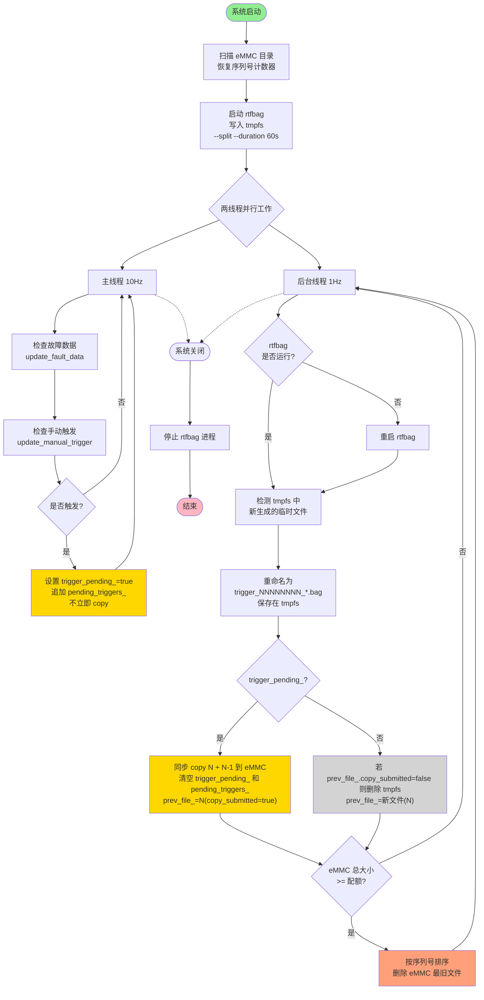

## 4.2 核心设计理念

### 1. 连续录包 + 智能保留

**传统方案问题**：

- 触发时启动录包进程 → 进程启动延迟导致事件前数据丢失
- 进程频繁重启 → 资源开销大，可靠性差

**本设计方案**：

- rtfbag 进程持续运行，使用 `--split --duration 60s` 滚动生成文件
- 默认删除所有文件，仅在触发时标记相关文件为"保留"
- **边界触发**：触发时只记录标志，等到当前录制文件完成（检测到新文件）时，再 copy N（当前）和 N-1（上一个）两个文件到 eMMC

**优势**：

- ✅ 无数据丢失（进程始终运行）
- ✅ 触发响应快（< 100ms，仅需标记操作）
- ✅ 资源稳定（进程不重启，无启动开销）

### 2. tmpfs 双层存储架构

**问题**：eMMC 存储设备寿命有限，连续录包导致大量写入，加速 eMMC 损耗。

**本设计方案**：

```
┌─────────────────────────────────────────────────────┐
│  层一：tmpfs（RAM，易失）                             │
│  - rtfbag 始终写入 tmpfs                             │
│  - 最多保留 2 个完成文件：                            │
│    prev_file_（N-1，已完成）+ .bag.active（N，录制中）│
│  - 触发时两个文件均 copy 到 eMMC；无触发时删除 N-1    │
└─────────────────────┬───────────────────────────────┘
                      │ 仅触发文件（2 个/次：N + N-1）
                      │ 后台线程同步 copy
                      ▼
┌─────────────────────────────────────────────────────┐
│  层二：eMMC（持久化）                                 │
│  - 仅存储触发片段 + 元数据                            │
│  - 配额管理，按序列号清理                             │
└─────────────────────────────────────────────────────┘
```

**tmpfs 容量规划约束**：

```
tmpfs_size_mb ≥ 2 × duration_sec × 录包码率(MB/s)
```

> 建议：设备 RAM 3GB，tmpfs 配置为 1.5GB，能容纳约 2 个文件。部署时需根据实际录包码率验证该约束。

**优势**：

- ✅ eMMC 写入量大幅降低（非触发数据零写入）
- ✅ RAM 写入速度快，录包性能更稳定
- ✅ 录制层与持久化层职责彻底分离

### 3. 序列号文件命名 + 文件系统时间排序

**传统方案问题**：

- 使用系统时间戳命名文件（如 `trigger_20250207_153045.bag`）
- 系统时间跳变（NTP 同步、手动调整）导致文件排序混乱
- 无法可靠地找到"最旧的文件"进行清理

**本设计方案**：

```
文件命名格式：trigger_NNNNNNNN_YYYYMMDDHHMMSS.sss.bag
示例：
  trigger_00000001_20260207104405.000.bag  ← 序列号 1
  trigger_00000002_20260207104505.000.bag  ← 序列号 2
  trigger_00000003_20260207104605.000.bag  ← 序列号 3
```

**排序规则**：

1. **主排序**：序列号（8位零填充，单调递增）
2. **辅助排序**：文件系统修改时间（`std::filesystem::last_write_time`）

**优势**：

- ✅ 序列号不受系统时间影响，绝对可靠
- ✅ 文件系统时间用于计算文件年龄（清理时判断）
- ✅ 启动时扫描目录即可恢复序列号计数器

### 3. RAII 生命周期管理

**设计模式**：

```cpp
EventTriggeredRecorder recorder(config);  // 构造时启动 rtfbag 和后台线程
// ... 使用期间自动运行
// 析构时自动停止所有资源（rtfbag 进程、后台线程）
```

**优势**：

- ✅ 资源泄漏零风险（析构函数保证资源释放）
- ✅ 异常安全（异常发生时自动清理）
- ✅ 使用简洁（无需手动调用 start/stop）

## 4.4 文件生命周期状态机

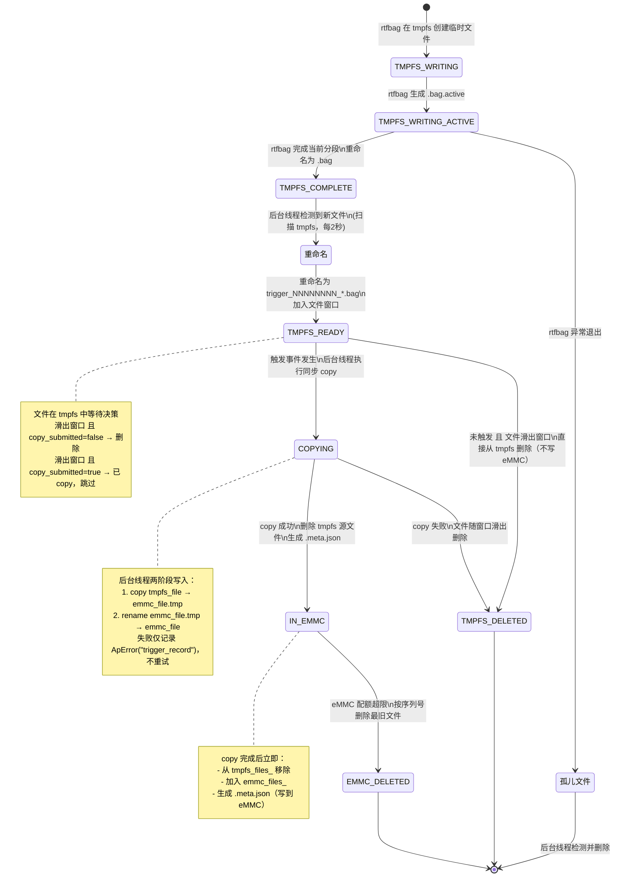

## 4.4 触发与标记机制

### 触发条件

| 触发类型 | 检测频率 | 触发条件 | 去重策略 |
| :--- | :--- | :--- | :--- |
| **故障触发** | 10Hz | 配置的故障码首次出现 | 同一故障码60秒内只触发一次 |
| **手动触发** | 10Hz | HMI 触发信号从 false → true | 边沿检测（上升沿触发一次） |

### 标记范围

```
边界触发示例（触发信号到来时，文件 N 正在录制中）：

  N-1: trigger_00000009_xxx.bag  ← 上一个完成文件（prev_file_）
  N:   trigger_00000010_xxx.bag  ← 正在录制的文件（.bag.active）

触发信号到来 → 设置 trigger_pending_=true，追加 pending_triggers_

当 N 录制完成（检测到 N+1 开始录制时）：
  → 生成一个 meta.json，命名为 N.bag.meta.json，包含：
      - triggers：本次触发信息列表
      - files：[N 的 eMMC 路径, N-1 的 eMMC 路径]
  → 情况A（N-1 首次被保留，prev_file_copied_=false）：
      copy N 和 N-1 到 eMMC；files = [N_dest, N-1_dest]
  → 情况B（N-1 已在 eMMC，prev_file_copied_=true，连续触发）：
      仅 copy N；N-1_emmc 直接写入 meta.json 的 files 列表，不重复 copy
      files = [N_dest, N-1_emmc]  ← N-1.bag 同时出现在两个 meta.json 中（跨引用）
  → 清空 trigger_pending_ 和 pending_triggers_
  → prev_file_ = N（prev_file_copied_=true，保留为下次触发的上下文）

最终保留文件（eMMC）：
  ✅ trigger_00000010_xxx.bag.meta.json  (triggers=[{...}], files=[seq10_path, seq9_path])
  ✅ trigger_00000010_xxx.bag  (触发文件 N)
  ✅ trigger_00000009_xxx.bag  (上下文文件 N-1，可能同时出现在前一个 meta.json 中)
```

**连续触发（方案B）跨引用示意**：

```
第一次触发（文件10完成时）：
  meta_10.json → files: [10.bag, 9.bag]   ← 10 触发, 9 为上下文

第二次触发（文件11完成时，prev_file_=10, prev_file_copied_=true）：
  meta_11.json → files: [11.bag, 10.bag]  ← 11 触发, 10 为上下文（跨引用，10.bag 出现两次）

删除时：先删 meta_10.json → 10.bag 仍被 meta_11.json 引用，保留
         再删 meta_11.json → 10.bag、11.bag 均无引用，一并删除
```

### 元数据生成

每次触发事件生成 **一个** `.meta.json` 文件，命名挂靠在触发文件 N 上（copy 完成后写入 eMMC）：

```json
{
  "triggers": [
    {
      "type": "fault",
      "fault_code": "202",
      "timestamp": "2026-02-07T10:44:00.123Z",
      "timestamp_sec": 1738876440.123
    }
  ],
  "files": [
    "/opt/usr/records/trigger/trigger_00000010_20260207104405.000.bag",
    "/opt/usr/records/trigger/trigger_00000009_20260207104305.000.bag"
  ]
}
```

- `triggers`：本次触发事件列表（故障或手动，可多个）
- `files`：本次触发保留的所有 bag 文件 eMMC 路径；第一项始终是触发文件 N，后续项为上下文文件（N-1）
- **一个触发事件只生成一个 meta.json**，不再为 N-1 单独生成

**元数据用途**：

- 记录触发原因（故障码、时间戳）
- 追溯同一触发组的相关文件（`files` 数组）
- 作为 eMMC 配额清理的事件组单元

## 4.5 同步 copy 设计

### 设计目标

触发事件发生时，后台线程（file_management_loop）在文件边界处直接执行同步 copy，将 N 和 N-1 从 tmpfs 持久化到 eMMC。copy 期间后台线程短暂阻塞，主线程（10Hz）不受影响。

### 工作流程

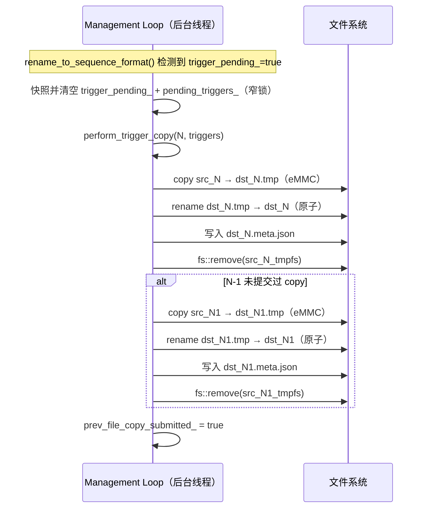

### 两阶段原子写入说明

| 阶段 | 操作 | 断电风险 |
|:---|:---|:---|
| 阶段1 | `copy src → dst.tmp` | 中断留下不完整的 .tmp 文件 |
| 阶段2 | `rename dst.tmp → dst` | 同一文件系统内 rename 是原子操作，安全 |
| 清理 | `remove src_tmpfs` | rename 已成功，tmpfs 文件可安全删除 |

> 启动时若发现 eMMC 中存在 `.tmp` 结尾的文件，为上次异常中断的残留，在 `scan_and_restore_sequence()` 中清理。

## 4.6 数据流与同步

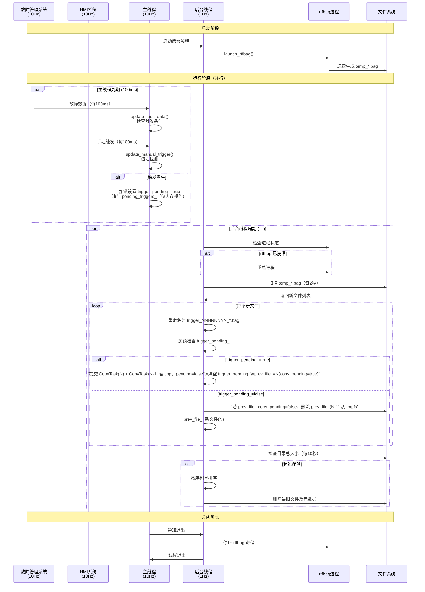

**关键同步点**：

1. **trigger_pending_ / pending_triggers_** 使用 `std::mutex` 保护（主线程写触发标志，后台线程读决策；emmc_files_ / tmpfs_files_ 仅由后台线程访问，无需加锁）
2. **后台线程分级轮询**：
   - 进程检查：每 1s（确保录包连续性）
   - 文件检测：每 2s（降低目录扫描开销）
   - 磁盘清理：每 10s（非实时需求）
3. **主线程无阻塞**：触发响应 < 100ms（仅内存标志操作，不提交 CopyTask）

## 4.6 完整触发周期示例

**场景**：车辆行驶过程中，t=195s 时发生故障 `202`

```
时间轴（每60秒一个文件）：
t=0s    → .bag.active 开始录制（文件 N=1）
t=60s   → 文件1完成，prev_file_=文件1；文件 N=2 开始录制
t=120s  → 文件2完成，prev_file_=文件2（文件1已删除）；文件 N=3 开始录制
t=195s  → 主线程检测到故障 202 → trigger_pending_=true，pending_triggers_=[{fault,202}]
t=180s  → 文件3完成（t=120~180s），后台线程检测到，trigger_pending_=true
          → 提交 CopyTask(文件3, related=文件2_emmc) + CopyTask(文件2, related=文件3_emmc)
          → trigger_pending_=false，prev_file_=nullopt
          → 文件4（t=180~240s）开始录制

t=240s  → 文件4完成，trigger_pending_=false → 删除文件4，prev_file_=文件4
t=300s  → 文件5完成，无触发 → 删除文件4，prev_file_=文件5

最终保留文件（eMMC）：
  ✅ trigger_00000003_*.bag  (t=120~180s，触发时刻所在文件，triggered=true)
  ✅ trigger_00000002_*.bag  (t=60~120s，上下文文件，triggered=false)
  ✅ trigger_00000003_*.bag.meta.json  (triggers=[{fault,202}], related_file=文件2)
  ✅ trigger_00000002_*.bag.meta.json  (triggers=[], related_file=文件3)
```

**关键点**：

- ✅ **触发时仅设 flag**：主线程只写内存，无磁盘操作
- ✅ **边界时决策**：文件录制完成时才 copy，保证 N 是完整文件
- ✅ **N-1 始终可得**：prev_file_ 在 tmpfs 中等待，文件边界时一并 copy
- ⚠️ **时序不确定性**：若触发信号恰好在文件边界处理之后到达，则等到 N+1 完成时再 copy N 和 N+1（均为完整文件，属正常情况）

## 4.7 关键特性总结

| 特性 | 实现方式 | 优势 |
| :--- | :--- | :--- |
| **零数据丢失** | rtfbag 连续录包，进程不重启 | 避免进程启动延迟导致的数据缺失 |
| **快速响应** | 触发时仅标记内存状态，无文件操作 | 触发延迟 < 100ms |
| **可靠排序** | 序列号 + 文件系统时间双重保证 | 不受系统时间跳变影响 |
| **自动恢复** | 启动时扫描目录恢复序列号 | 重启后无缝继续，无文件名冲突 |
| **智能清理** | 按序列号排序，清理最旧文件 | 磁盘空间可控，保留重要数据 |
| **资源安全** | RAII 模式管理所有资源 | 零资源泄漏风险 |
| **性能优化** | 后台线程分级轮询（1s/2s/10s） | 目录扫描减少80%，CPU占用低 |
| **线程安全** | mutex 保护共享状态 | 并发访问无竞态条件 |
| **可追溯性** | 元数据记录触发上下文和相关文件 | 便于后续分析和调试 |

# 5. 架构与技术方案

## 4.1 模块内部架构

### 整体架构图

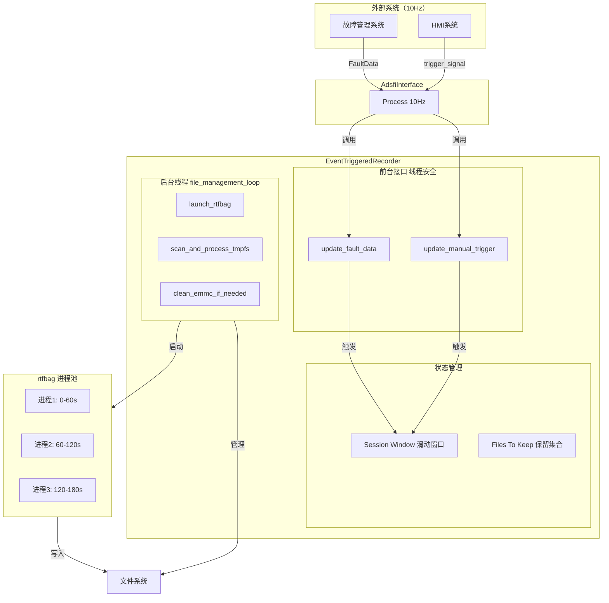

### 线程 / 进程模型

**线程模型**：

- **主线程**：由 adsfi_interface 框架驱动，10Hz 调用 Process()
  - 调用 update_fault_data()
  - 调用 update_manual_trigger()

- **后台线程**：file_management_loop()（在构造函数中启动）
  - 监控 rtfbag 生成的临时文件（temp_*.bag）
  - 检测并重命名文件为序列号格式
  - 处理文件保留/删除
  - 清理磁盘空间
  - 监控 rtfbag 进程状态，崩溃时重启

**进程模型**：

- **主进程**：事件触发式录包系统
- **子进程**：rtfbag 录包进程（fork + exec 启动，使用 --split --duration 参数）
  - 单个持续运行的进程，自动切分文件
  - 进程崩溃时自动重启

### 同步 / 异步模型

**同步点**：

- update_fault_data() / update_manual_trigger()：通过 mutex 同步
- file_management_loop()：通过 mutex 同步访问共享状态

**异步处理**：

- 文件删除：在后台线程异步执行
- rtfbag 进程：独立运行，不阻塞主线程

### 与系统其它模块的部署关系

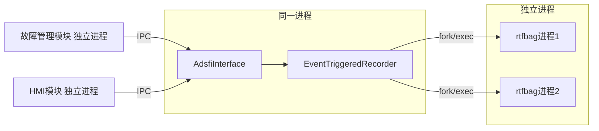

## 4.2 关键技术选型

| 技术点 | 方案 | 选择原因 | 备选方案 |
| :--- | :--- | :--- | :--- |
| 录包工具 | rtfbag | 项目标准工具，支持多种数据源 | rosbag（ROS专用） |
| 进程管理 | fork + exec + waitpid | POSIX 标准，稳定可靠 | system()（不推荐，难以控制） |
| 配置解析 | yaml-cpp | 与项目现有配置格式一致 | JSON（可读性差） |
| 文件系统操作 | std::filesystem | C++17标准，跨平台 | POSIX API（低级） |
| 线程同步 | std::mutex | C++11标准，简单可靠 | 读写锁（不必要） |
| 数据结构 | std::optional + std::vector | prev_file_ 和 pending_triggers_，语义清晰，无额外开销 | std::deque 滑动窗口（已移除） |
| 去重策略 | std::map<code, time> + steady_clock | 单调时钟去重，不受时间跳变影响 | system_clock（受NTP影响） |
| 文件排序 | 序列号排序 | 不受时间同步影响，保证正确顺序 | 时间戳排序（时间同步前后会错乱） |

## 4.2.1 文件命名方案设计

### 设计目标

解决系统时间同步导致的文件排序问题，确保文件按生成顺序正确排列和清理。

### 问题分析

**场景**：系统启动时，时间尚未通过 NTP 同步，可能是"古老"的时间（如 2005-01-01）。

```text
时间线：
T0: 系统启动，时间 = 2005-01-01 00:00:00
T1: 生成文件 trigger_1104537600.bag (2005-01-01 00:00:00)
T2: 生成文件 trigger_1104537660.bag (2005-01-01 00:01:00)
T3: NTP 时间同步完成，时间 = 2026-02-05 10:30:00
T4: 生成文件 trigger_1738876600.bag (2026-02-05 10:30:00)
T5: 生成文件 trigger_1738876660.bag (2026-02-05 10:31:00)

问题：
- 按文件名时间戳排序：1104537600, 1104537660, 1738876600, 1738876660 ✓ (看似正确)
- 但实际生成顺序：T1, T2, T4, T5
- 清理时若按时间戳排序删除"最旧"文件，会错误删除 T1、T2（实际是最早生成的）
- 触发标记"前后各一个文件"时，无法正确找到相邻文件
```

### 解决方案：序列号 + 时间戳混合命名

**文件名格式**：`trigger_NNNNNNNN_YYYYMMDDHHMMSS.sss.bag`

- **NNNNNNNN**：8位序列号（左补零），从0开始递增，用于排序和关联
- **YYYYMMDDHHMMSS.sss**：日期时间字符串（年月日时分秒.毫秒），用于人工可读性
  - **YYYY**：年份（4位）
  - **MM**：月份（2位，01-12）
  - **DD**：日期（2位，01-31）
  - **HH**：小时（2位，00-23，24小时制）
  - **MM**：分钟（2位，00-59）
  - **SS**：秒（2位，00-59）
  - **sss**：毫秒（3位，000-999）

**示例**：

```text
trigger_00000000_20050101000000.000.bag  // 序列号=0, 时间=2005-01-01 00:00:00.000
trigger_00000001_20050101000100.000.bag  // 序列号=1, 时间=2005-01-01 00:01:00.000
trigger_00000002_20260205103000.000.bag  // 序列号=2, 时间=2026-02-05 10:30:00.000
trigger_00000003_20260205103100.000.bag  // 序列号=3, 时间=2026-02-05 10:31:00.000
```

### 核心机制

1. **序列号生成**：
   - 启动时扫描 eMMC 目录，解析所有 `trigger_NNNNNNNN_*.bag` 文件
   - 用循环最大 gap 法恢复 `current_sequence_`：找到相邻序号最大空槽数（含回绕空槽），其左侧序号的 +1（取模）即为下一个序号
   - 若未找到任何合规文件（或扫描异常），`current_sequence_` 置 0
   - 每次重命名文件后 `next_sequence++`

2. **文件检测与重命名**：
   - rtfbag 生成临时文件：`temp_1738876600.123.bag`
   - 后台线程检测到新文件
   - 提取时间戳：`1738876600.123`（Unix秒.毫秒）
   - 转换为日期时间格式：`20260205103000.123`
   - 重命名为：`trigger_00000003_20260205103000.123.bag`
   - 序列号递增

   **中间文件处理（.bag.active）**：
   - rtfbag 录包时生成中间文件：`temp_1738876600.123.bag.active`
   - 如果 rtfbag 正常完成录制，会将其重命名为 `.bag` 文件
   - 如果 rtfbag 异常退出（kill、下电等），`.bag.active` 文件会滞留
   - 后台线程检测到 `.bag.active` 文件时：
     - 检查 rtfbag 进程是否在运行
     - 如果进程不在运行，说明是孤儿文件，直接删除
     - 如果进程在运行，说明正在录制，不处理

3. **排序与清理**：
   - **按序列号排序**（不是时间戳）
   - 清理时删除序列号最小的未标记文件
   - 触发标记时按序列号查找前后文件（seq-1, seq, seq+1）

### 优势

| 优势 | 说明 |
| :--- | :--- |
| **顺序保证** | 序列号严格递增，不受时间跳变影响 |
| **可读性** | 时间戳保留，便于人工识别文件时间 |
| **关联可靠** | 触发标记使用序列号±1，保证找到正确的相邻文件 |
| **清理正确** | 按序列号删除，保证删除真正最旧的文件 |
| **启动恢复** | 扫描目录即可恢复序列号，无需持久化状态 |

### 边界情况处理

| 情况 | 处理方式 |
| :--- | :--- |
| 首次启动（无历史文件） | next_sequence = 1 |
| 序列号冲突（文件已存在） | next_sequence++，跳过该序列号 |
| 序列号溢出（理论上） | size_t 支持数十亿文件，实际不会溢出 |
| 文件名解析失败 | 记录警告，跳过该文件，不影响序列号恢复 |
| 目录中有非标准文件 | 正则匹配过滤，仅处理符合格式的文件 |
| rtfbag 异常退出留下 .bag.active 文件 | 检测到 rtfbag 进程不在运行时，删除孤儿 .bag.active 文件 |

## 4.2.2 文件监控性能优化设计

### 设计目标

在保证文件检测功能正常的前提下，优化 `std::filesystem::directory_iterator` 的调用频率，避免文件数量增多时对性能造成影响。

### 问题分析

**核心问题**：`file_management_loop()` 中每秒调用多次 `directory_iterator` 扫描目录，当文件数量增多时可能产生性能瓶颈。

```cpp
// 原始实现（每秒3次目录扫描）
void file_management_loop() {
    while (running_.load()) {
        {
            std::lock_guard<std::mutex> lock(mutex_);

            // 1. 进程检查 (需要目录扫描)
            if (!is_rtfbag_running()) {
                restart_rtfbag();
            }

            // 2. 文件检测 (需要目录扫描)
            detect_and_rename_files();

            // 3. 磁盘清理 (需要目录扫描)
            clean_old_files_if_needed();
        }
        std::this_thread::sleep_for(std::chrono::seconds(1));
    }
}
```

**性能瓶颈**：

- 每秒执行 3 次目录扫描（进程检查、文件检测、磁盘清理各1次）
- 当文件数量达到100个时，目录扫描开销显著增加
- 不必要的高频扫描浪费 CPU 资源

### 解决方案对比

#### 方案1：使用 inotify 实时监控

**实现方式**：使用 Linux inotify API 监听目录的 `IN_CREATE` 和 `IN_MOVED_TO` 事件。

**优点**：

- 事件驱动，零延迟检测新文件
- 不需要轮询，CPU 占用低
- 扩展性好，文件数量多时无性能影响

**缺点**：

- 实现复杂度高，需要管理 inotify fd、事件队列
- 边界情况处理复杂：
  - 目录重命名、删除、权限变化
  - inotify 队列溢出
  - 启动时已存在的文件需要初始扫描
- 可移植性差（Linux 专有，跨平台需要额外适配）
- 与当前轮询架构不一致，重构成本高

**结论**：收益与成本不成正比，除非文件数量达到数千级别，否则不推荐。

#### 方案2：文件列表缓存

**实现方式**：维护一个内存中的文件列表缓存，每次扫描只检查新增文件。

```cpp
// 伪代码
std::set<std::string> _cached_files;

void detect_and_rename_files() {
    auto current_files = list_directory();
    for (const auto& file : current_files) {
        if (_cached_files.find(file) == _cached_files.end()) {
            // 新文件，处理
            process_new_file(file);
            _cached_files.insert(file);
        }
    }
}
```

**优点**：

- 减少重复处理，提高效率
- 实现相对简单

**缺点**：

- 缓存一致性问题：外部删除文件时缓存未更新
- 内存占用增加（需要维护文件名集合）
- 复杂度增加（需要处理缓存同步）
- 收益有限（目录扫描本身开销仍存在）

**结论**：引入额外复杂度，但性能提升有限，不推荐。

#### 方案3：降低扫描频率 + 合并操作（推荐）

**实现方式**：根据操作的紧急程度，设置不同的轮询频率。

```cpp
void file_management_loop() {
    size_t iteration = 0;
    while (running_.load()) {
        {
            std::lock_guard<std::mutex> lock(mutex_);

            // 进程检查：每 1s（关键，必须高频）
            if (!is_rtfbag_running()) {
                restart_rtfbag();
            }

            // 文件检测：每 2s（可接受的延迟）
            if (iteration % 2 == 0) {
                detect_and_rename_files();
            }

            // 窗口清理：每次（轻量操作，无需目录扫描）
            while (file_window_.size() > 10) {
                file_window_.pop_front();
            }

            // 磁盘清理：每 10s（不紧急）
            if (iteration % 10 == 0) {
                clean_old_files_if_needed();
            }
        }
        ++iteration;
        std::this_thread::sleep_for(std::chrono::seconds(1));
    }
}
```

**优点**：

- 实现简单，代码改动小（仅需添加 iteration 计数器）
- 大幅降低目录扫描频率：从每秒3次降至约0.6次
- 根据业务需求分级处理：
  - 进程检查：1s（防止录包中断）
  - 文件检测：2s（rtfbag duration=60s，2s延迟完全可接受）
  - 磁盘清理：10s（非实时需求）
- 无额外复杂度，易于维护
- 性能提升明显（目录扫描减少约80%）

**缺点**:

- 文件检测延迟增加1秒（从1s变为2s）
- 磁盘清理延迟增加9秒（从1s变为10s）

**结论**：在文件数量 < 100 的场景下，延迟增加完全可接受，是最优解。

#### 方案4：序列号文件缓存（进一步优化）

**实现方式**：在方案3的基础上，增加序列号到文件路径的映射缓存，并在文件添加/删除时主动更新。

```cpp
// 文件缓存：序列号 -> 完整文件路径
std::map<size_t, std::string> _all_sequence_files;

void scan_and_restore_sequence() {
    // 启动时扫描目录，构建缓存
    _all_sequence_files.clear();
    for (const auto& entry : std::filesystem::directory_iterator(config_.output_path)) {
        auto seq_opt = parse_sequence_from_filename(entry.path().filename().string());
        if (seq_opt.has_value()) {
            _all_sequence_files[seq_opt.value()] = entry.path().string();
        }
    }
}

void rename_to_sequence_format(const std::string& temp_file, size_t sequence, double timestamp) {
    std::string new_filename = generate_sequence_filename(sequence, timestamp);
    std::filesystem::rename(temp_file, new_filename);

    // 添加到缓存
    _all_sequence_files[sequence] = new_filename;
}

void clean_old_files_if_needed() {
    // 使用缓存遍历文件，而不是扫描目录
    for (const auto& [seq, filepath] : _all_sequence_files) {
        if (should_delete(seq, filepath)) {
            std::filesystem::remove(filepath);
            // 从缓存移除
            _all_sequence_files.erase(seq);
        }
    }
}

void generate_metadata_file(const FileRecord& file) {
    // 使用缓存查找相关文件，而不是扫描目录
    std::vector<std::string> related_files;

    // 前一个文件
    if (auto it = _all_sequence_files.find(file.sequence - 1); it != _all_sequence_files.end()) {
        related_files.push_back(it->second);
    }

    // 后一个文件
    if (auto it = _all_sequence_files.find(file.sequence + 1); it != _all_sequence_files.end()) {
        related_files.push_back(it->second);
    }
}
```

**优点**：

- 完全避免 `generate_metadata_file()` 和 `clean_old_files_if_needed()` 中的目录扫描
- 查找效率：O(log n) 内存操作 vs O(n) 文件系统操作
- 主动更新缓存，无一致性问题（文件由程序自身管理）
- 实现简单，代码改动小
- 对文件数量 > 100 的场景性能提升显著

**缺点**：

- 内存占用增加：每个文件约 100 字节（序列号 + 路径），100 个文件约 10KB（可忽略）
- 需要维护缓存一致性（但由于文件完全由程序自身管理，无外部干扰）

**适用场景**：

- 文件数量 > 100（测试场景或高频录包场景）
- 单个文件时长较短（如 duration=10s）
- 需要更高的响应性能

**性能分析**：

- `generate_metadata_file()`：
  - 原实现：扫描目录 O(n) + 解析文件名 O(n)
  - 优化后：map 查找 O(log n)
  - 提升：n=100 时，约 50 倍性能提升
- `clean_old_files_if_needed()`：
  - 原实现：扫描目录 O(n) + 排序 O(n log n)
  - 优化后：遍历 map O(n)，已排序
  - 提升：消除目录扫描，减少排序开销

**结论**：在文件数量 > 100 的场景下（测试或生产环境），该优化显著提升性能，推荐启用。

### 方案选择与依据

**最终选择**：方案3（降低扫描频率）+ 方案4（序列号文件缓存）

**选择依据**：

| 评估维度 | 方案1 (inotify) | 方案2 (缓存) | 方案3 (降频) | 方案4 (序列号缓存) | 权重 |
| :--- | :--- | :--- | :--- | :--- | :--- |
| 实现复杂度 | ⭐ | ⭐⭐⭐ | ⭐⭐⭐⭐⭐ | ⭐⭐⭐⭐ | 高 |
| 性能提升 | ⭐⭐⭐⭐⭐ | ⭐⭐⭐ | ⭐⭐⭐⭐ | ⭐⭐⭐⭐⭐ | 中 |
| 可维护性 | ⭐⭐ | ⭐⭐⭐ | ⭐⭐⭐⭐⭐ | ⭐⭐⭐⭐ | 高 |
| 可靠性 | ⭐⭐⭐ | ⭐⭐⭐⭐ | ⭐⭐⭐⭐⭐ | ⭐⭐⭐⭐⭐ | 高 |
| 可移植性 | ⭐⭐ | ⭐⭐⭐⭐ | ⭐⭐⭐⭐⭐ | ⭐⭐⭐⭐⭐ | 低 |
| 延迟影响 | ⭐⭐⭐⭐⭐ | ⭐⭐⭐⭐ | ⭐⭐⭐⭐ | ⭐⭐⭐⭐ | 中 |

**项目约束**：

- 文件数量可能超过 100（测试场景 + 生产环境）
- rtfbag duration = 60s（文件生成频率低，2s 延迟完全可接受）
- 团队偏好简单可靠的方案（避免过度设计）

**性能分析**：

- 原实现：
  - 每秒 3 次目录扫描（进程检查 + 文件检测 + 磁盘清理）
  - `generate_metadata_file()` 和 `clean_old_files_if_needed()` 每次都扫描整个目录
- 方案3优化后：
  - 每秒约 0.6 次目录扫描（进程检查不需要扫描 + 文件检测2s + 清理10s）
  - 性能提升：约 **80% 的目录扫描操作被消除**
- 方案3+4组合优化后：
  - 每秒约 0.5 次目录扫描（仅 `detect_and_rename_files()` 扫描）
  - `generate_metadata_file()` 和 `clean_old_files_if_needed()` 完全避免目录扫描
  - 性能提升：约 **85-90% 的目录扫描操作被消除**

**延迟分析**：

- 文件检测延迟：1s → 2s（增加1秒）
  - 影响：rtfbag 生成文件到重命名的时间从1s变为最多2s
  - 结论：duration=60s 的文件，2s 延迟占比仅 3.3%，完全可接受
- 磁盘清理延迟：1s → 10s（增加9秒）
  - 影响：超过配额后，最多10秒后开始清理
  - 结论：磁盘清理不是实时需求，10秒延迟无影响

### 实现细节

**核心改动**：

```cpp
void file_management_loop() {
    size_t iteration = 0;  // 新增：迭代计数器
    while (running_.load()) {
        {
            std::lock_guard<std::mutex> lock(mutex_);

            // 进程检查：每 1s（关键操作）
            if (!is_rtfbag_running()) {
                ApWarn("trigger_record") << "rtfbag process not running, restarting...";
                restart_rtfbag();
            }

            // 文件检测：每 2s（降低频率）
            if (iteration % 2 == 0) {
                detect_and_rename_files();
            }

            // 窗口清理：每次（内存操作，无开销）
            while (file_window_.size() > 10) {
                file_window_.pop_front();
            }

            // 磁盘清理：每 10s（降低频率）
            if (iteration % 10 == 0) {
                clean_old_files_if_needed();
            }
        }
        ++iteration;
        std::this_thread::sleep_for(std::chrono::seconds(1));
    }

    AINFO << "File management loop exited";
}
```

**关键点**：

1. 使用 `iteration % N` 控制执行频率
2. 进程检查不受限制（每秒执行，确保录包连续性）
3. 文件检测每2秒执行一次（平衡性能与延迟）
4. 磁盘清理每10秒执行一次（非实时需求）

### 后续优化方向

如果未来文件数量超过 100 个，可以考虑：

1. **动态调整频率**：根据文件数量自动调整扫描频率

   ```cpp
   size_t detect_interval = (file_count > 100) ? 5 : 2;
   if (iteration % detect_interval == 0) {
       detect_and_rename_files();
   }
   ```

2. **分批处理**：每次仅处理部分文件，避免单次扫描时间过长

   ```cpp
   void detect_and_rename_files() {
       size_t processed = 0;
       for (const auto& entry : fs::directory_iterator(output_path_)) {
           if (++processed > 10) break;  // 每次最多处理10个
           // ...
       }
   }
   ```

3. **引入 inotify**：当文件数量达到数百级别时，切换到事件驱动模式

### 优势总结

| 优势 | 说明 |
| :--- | :--- |
| **性能显著提升** | 目录扫描减少约 80%，CPU 占用降低 |
| **实现简单** | 仅需添加计数器和条件判断，代码改动 < 10 行 |
| **延迟可控** | 文件检测延迟 2s，磁盘清理延迟 10s，均在可接受范围 |
| **可维护性高** | 逻辑清晰，易于理解和调试 |
| **可靠性不变** | 不引入新的复杂度和潜在 bug |
| **可扩展** | 未来可根据实际需求调整频率或切换方案 |

## 4.3 核心流程

### 4.3.1 主流程：连续录包与文件管理

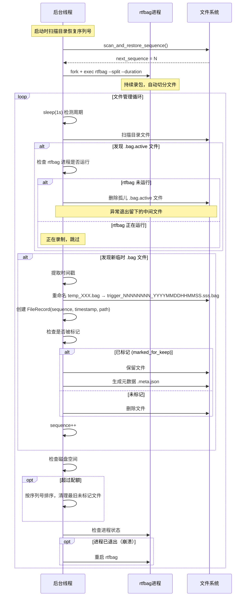

### 4.3.2 触发流程：故障触发

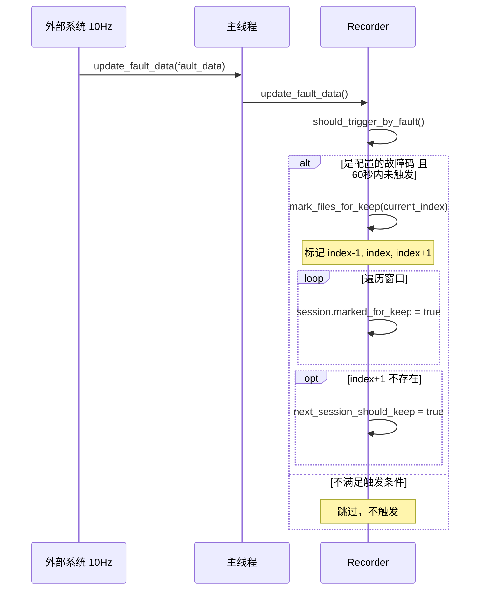

### 4.3.3 触发流程：手动触发

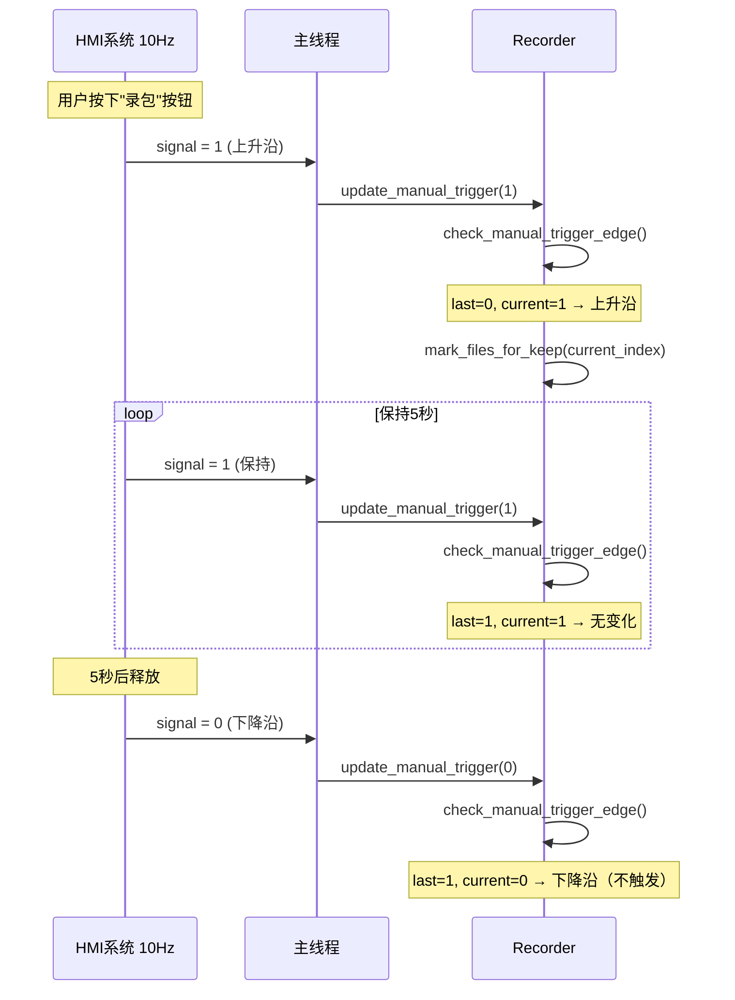

### 4.3.4 异常流程：进程崩溃

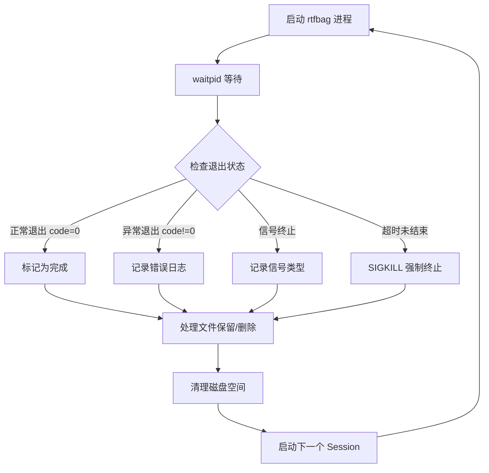

### 4.3.5 启动流程（RAII 构造函数）

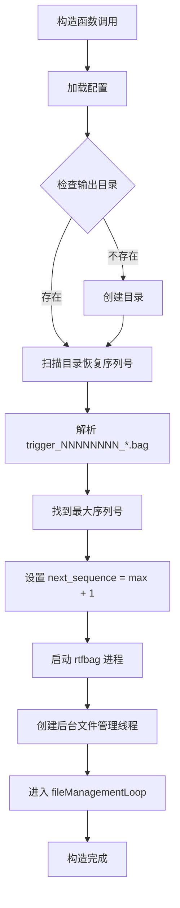

### 4.3.6 序列号恢复流程

```mermaid
flowchart TD
    Start[扫描输出目录] --> ListFiles[列出所有 .bag 文件]
    ListFiles --> Filter[过滤符合格式的文件]
    Filter --> Loop{遍历文件}
    Loop -->|每个文件| Match[正则匹配: trigger_(\\d{8})_.*\\.bag]
    Match -->|匹配成功| Extract[提取序列号]
    Match -->|匹配失败| Loop
    Extract --> UpdateMax[更新 max_sequence]
    UpdateMax --> Loop
    Loop -->|完成| Check{找到序列号?}
    Check -->|是| SetNext[next_sequence = max + 1]
    Check -->|否| SetDefault[next_sequence = 1]
    SetNext --> End[返回]
    SetDefault --> End
```

### 4.3.7 退出流程（RAII 析构函数）

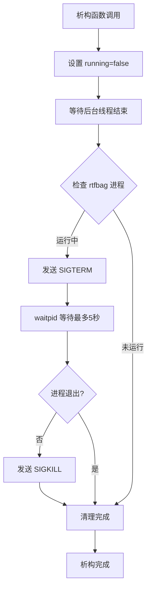

# 6. 接口设计（评审重点）

## 5.1 对外接口

| 接口名 | 类型 | 输入 | 输出 | 频率 | 备注 |
| :--- | :--- | :--- | :--- | :--- | :--- |
| update_fault_data | API | ara::adsfi::FaultData | void | 10Hz | 更新当前故障数据 |
| update_manual_trigger | API | int32_t (0 或 1) | void | 10Hz | 更新手动触发信号 |
| 构造函数 | API | Config | - | 一次 | 自动启动录包器（RAII） |
| 析构函数 | API | void | - | 一次 | 自动停止录包器（RAII） |

### 详细接口说明

#### 5.1.1 update_fault_data

```cpp
void update_fault_data(const ara::adsfi::FaultData& fault_data);
```

**功能**：更新当前系统的故障数据，检查是否触发录包。

**输入参数**：

- `fault_data`：当前系统的故障数据
  - `fault_info`：故障信息列表
    - `code`：故障代码（字符串，如 "202"）
    - `timestamp`：故障发生时间
  - `fault_level`：故障等级

**输出**：无

**行为**：

- 遍历 fault_data.fault_info
- 检查 code 是否在配置的 fault_codes 中
- 检查该故障码在60秒内是否已触发过（去重）
- 如果满足条件，调用 mark_files_for_keep() 标记文件

#### 5.1.2 update_manual_trigger

```cpp
void update_manual_trigger(std::int32_t trigger_signal);
```

**功能**：更新手动触发信号，检测上升沿并触发录包。

**输入参数**：

- `trigger_signal`：手动触发信号
  - `0`：无请求
  - `非0`：有请求（通常为 1）

**输出**：无

**行为**：

- 检测上升沿（last_signal == 0 && current_signal != 0）
- 如果检测到上升沿，调用 mark_files_for_keep() 标记文件
- 更新 last_signal 状态

## 5.2 对内接口

### 5.2.1 录包管理

```cpp
// 启动 rtfbag 进程（连续录包模式）
void launch_rtfbag();

// 重启 rtfbag 进程（崩溃后）
void restart_rtfbag();

// 检查 rtfbag 进程状态
bool is_rtfbag_running();

// 构建 rtfbag 命令（使用 --split --duration）
std::string build_rtfbag_command(const std::string& prefix);
```

### 5.2.2 文件检测与重命名

```cpp
// 检测并处理新生成的文件
void detect_and_rename_files();

// 重命名临时文件为序列号格式
void rename_to_sequence_format(const std::string& temp_file, size_t sequence, double timestamp);

// 从临时文件名提取时间戳
double extract_timestamp_from_temp_file(const std::string& temp_file);

// 生成序列号文件名
std::string generate_sequence_filename(size_t sequence, double timestamp);
```

### 5.2.3 序列号管理

```cpp
// 扫描目录并恢复序列号
void scan_and_restore_sequence();

// 解析文件名获取序列号
std::optional<size_t> parse_sequence_from_filename(const std::string& filename);

// 获取下一个序列号
size_t get_next_sequence();
```

### 5.2.4 触发处理

```cpp
// 检查是否应该触发（故障）
bool should_trigger_by_fault(const ara::adsfi::FaultData& fault_data,
                             std::vector<std::string>& triggered_codes);

// 检查手动触发边沿
bool check_manual_trigger_edge(std::int32_t signal);
```

> 触发时只设置 `trigger_pending_=true` 并追加 `pending_triggers_`，
> copy 操作在 `rename_to_sequence_format()` 检测到文件边界时触发。

### 5.2.5 文件管理

```cpp
// 清理旧文件（基于配额和序列号）
void clean_old_files_if_needed();

// 计算目录大小（仅统计 eMMC）
size_t calculate_directory_size();

// 生成元数据文件（copy 完成后写入 eMMC）
void generate_metadata_file(const FileRecord& file, const std::string& related_emmc_path);

// 构建元数据 JSON
std::string build_metadata_json(const FileRecord& file, const std::string& related_emmc_path);

// 检查文件是否足够旧（可清理）
bool is_file_old_enough(const std::string& filepath, size_t min_age_sec);

// 删除文件及其元数据
bool delete_file_with_metadata(const std::string& filepath, size_t sequence);

// 获取当前时间戳（ISO 8601格式）
std::string get_current_timestamp_iso();

// 获取当前时间戳（Unix秒）
double get_current_timestamp_sec();
```

## 5.3 接口稳定性声明

**稳定接口**（变更必须评审）：

- `update_fault_data()`
- `update_manual_trigger()`
- `EventTriggeredRecorder()` 构造函数
- `~EventTriggeredRecorder()` 析构函数
- `Config` 结构体

**非稳定接口**（允许调整）：

- 内部方法（launch_rtfbag, mark_files_for_keep, detect_and_rename_files 等）
- FileRecord 结构体内部字段

## 5.4 接口行为契约（必须填写）

### update_fault_data()

**前置条件**：

- 录包器已启动（构造函数已完成）
- fault_data 为有效对象

**后置条件**：

- 如果触发，相关文件被标记为保留
- 故障码的最后触发时间被更新

**行为特性**：

- **线程安全**：是（使用 mutex 保护）
- **可重入**：是
- **幂等**：否（多次调用可能触发多次，但有60秒去重）
- **最大执行时间**：< 1ms（仅状态检查和标记）
- **阻塞**：否

**失败语义**：

- 无返回值，失败仅记录日志
- 不抛出异常

### update_manual_trigger()

**前置条件**：

- 录包器已启动
- signal 为 0 或 1

**后置条件**：

- 如果检测到上升沿，相关文件被标记为保留
- last_signal 状态被更新

**行为特性**：

- **线程安全**：是
- **可重入**：是
- **幂等**：否（上升沿只触发一次）
- **最大执行时间**：< 1ms
- **阻塞**：否

**失败语义**：

- 无返回值，失败仅记录日志
- 不抛出异常

### stop()

**已移除**：使用 RAII 模式，析构函数自动停止。

### EventTriggeredRecorder() 构造函数

**前置条件**：

- 配置对象有效
- 输出目录的父目录存在且可写

**后置条件**：

- 后台线程启动
- rtfbag 进程启动
- 序列号已从目录中恢复

**行为特性**：

- **线程安全**：否（不应并发构造）
- **可重入**：否
- **幂等**：否
- **最大执行时间**：< 2s（包括目录扫描）
- **阻塞**：是（等待初始化完成）

**失败语义**：

- 配置错误、目录无权限等失败时抛出异常
- 抛出 std::runtime_error 或 std::system_error

### ~EventTriggeredRecorder() 析构函数

**前置条件**：

- 对象已构造

**后置条件**：

- 后台线程停止
- rtfbag 进程被终止
- 所有资源释放

**行为特性**：

- **线程安全**：是（保证安全析构）
- **可重入**：否
- **幂等**：是
- **最大执行时间**：< 5s（等待线程结束 + 进程终止）
- **阻塞**：是（等待线程 join）

**失败语义**：

- 不抛出异常（noexcept）
- 失败仅记录日志

# 7. 数据设计

## 6.1 数据结构

### 6.1.1 配置结构

```cpp
struct Config {
    std::vector<std::string> topics;       // 录制的 topic 列表
    std::string tmpfs_path;                // 新增：tmpfs 录包缓冲目录（RAM）
    size_t      tmpfs_size_mb;             // 新增：tmpfs 大小（仅供参考，不做运行时强制检查）
    std::string output_path;               // 持久化输出目录（eMMC）
    size_t buffer_size_kb;                 // rtfbag 缓存大小（KB）
    size_t duration_sec;                   // 单个文件时长（秒）
    size_t quota_mb;                       // eMMC 磁盘配额（MB）
    size_t clean_threshold_mb;             // 清理阈值（MB）
    std::vector<std::string> fault_codes;  // 触发的故障码
};
```

> **tmpfs 容量约束**（部署时须人工验证）：
> `tmpfs_size_mb ≥ FILE_WINDOW_SIZE × duration_sec × 录包码率(MB/s)`

### 6.1.2 文件记录结构

```cpp
struct TriggerInfo {
    std::string type;           // "fault" 或 "manual"
    std::string fault_code;     // 故障码（仅用于 fault 类型）
    std::string timestamp;      // ISO 8601 格式时间戳
    double timestamp_sec;       // Unix 时间戳（秒）
};

struct FileRecord {
    std::string filename;                              // bag 文件路径（完整序列号格式，指向 tmpfs）
    size_t sequence;                                   // 序列号（全局递增，用于排序）
    double timestamp;                                  // 文件时间戳（Unix秒，从文件系统时间提取）
    std::chrono::steady_clock::time_point detect_time; // 检测到文件的时间（单调时钟）
};
```

**说明**：

- `FileRecord` 仅描述 tmpfs 中的文件快照；是否已 copy 到 eMMC 由类成员 `prev_file_copied_`（bool）记录，不在 `FileRecord` 中
- 触发信息（`TriggerInfo`）由 `pending_triggers_` 在触发时累积，到文件边界时作为参数传入 copy 流程，不存入 `FileRecord`

### 6.1.3 核心状态

```cpp
// 边界触发式状态（tmpfs 最多保留 2 个完成文件：prev_file_ + 当前 .bag.active）
std::optional<FileRecord> prev_file_;              // N-1：上一个完成文件（在 tmpfs）
bool                      prev_file_copied_{false}; // prev_file_ 是否已 copy 到 eMMC
bool                      trigger_pending_{false};  // 当前录制窗口内是否有待处理的触发
std::vector<TriggerInfo>  pending_triggers_;        // 本窗口内累积的触发信息

// tmpfs 文件缓存：序列号 → tmpfs 路径（文件还在 RAM 中）
// 在 register_tmpfs_file() 中填入，copy 完成后移除
std::map<size_t, std::string> tmpfs_files_;

// eMMC 文件缓存：序列号 → eMMC 路径（已持久化）
// 在 scan_and_restore_sequence() 中从 eMMC 目录初始化
// copy 完成后从 tmpfs_files_ 迁移至此
std::map<size_t, std::string> emmc_files_;

// 故障码的最后触发时间（去重，使用单调时钟）
std::map<std::string, std::chrono::steady_clock::time_point> fault_trigger_times_;

// 当前序列号（从 eMMC 目录扫描恢复，每次重命名后递增）
size_t current_sequence_;

// 上次手动触发信号（边沿检测用）
std::int32_t last_manual_trigger_signal_;

// rtfbag 进程 PID
pid_t rtfbag_pid_;

// 后台线程运行标志
std::atomic<bool> running_;

// 文件名前缀（配置的 tmpfs_path + "/trigger"）
std::string file_prefix_;
```

**`prev_file_copied_` 语义**：

| 值 | 含义 | 窗口滑出时行为 |
|:---|:---|:---|
| `false` | prev_file_ 从未 copy 过（首次作为上下文） | 无触发 → 立即从 tmpfs 删除 |
| `true` | prev_file_ 已在 eMMC（因上次触发被 copy） | 无触发 → 跳过删除（已无 tmpfs 文件），重置为 false |

**文件缓存设计说明**：

原 `all_sequence_files_` 拆分为 `tmpfs_files_` 和 `emmc_files_` 两个独立 map：

| map | 包含文件 | 写入时机 | 删除时机 |
|:---|:---|:---|:---|
| `tmpfs_files_` | tmpfs 中的文件 | `rename_to_sequence_format()` 后 | copy 成功后 |
| `emmc_files_` | eMMC 中的文件 | copy 成功后 | `delete_file_with_metadata()` 时 |

`clean_old_files_if_needed()` 只遍历 `emmc_files_`；`calculate_directory_size()` 只统计 eMMC 目录。

**性能优化说明**：

为避免重复的目录扫描（特别是当文件数量超过100个时），使用 `_all_sequence_files` 缓存所有序列号文件的路径：

- **初始化**：在 `scan_and_restore_sequence()` 启动时扫描目录，构建缓存
- **更新时机**：
  - 文件重命名时（`rename_to_sequence_format()`）：添加到缓存
  - 文件删除时（`clean_old_files_if_needed()`）：从缓存移除
- **使用场景**：
  - `generate_metadata_file()`：使用缓存查找相关文件（前后序列号）
  - `clean_old_files_if_needed()`：使用缓存遍历所有文件，避免目录扫描

相比每次扫描目录（O(n) 文件系统操作），缓存查找为 O(log n) 内存操作，显著提升性能。

### 序列化 / 反序列化

- **配置文件**：使用 yaml-cpp 从 YAML 文件加载
- **运行时状态**：不持久化，仅内存管理

## 6.2 状态机

### 文件生命周期状态机

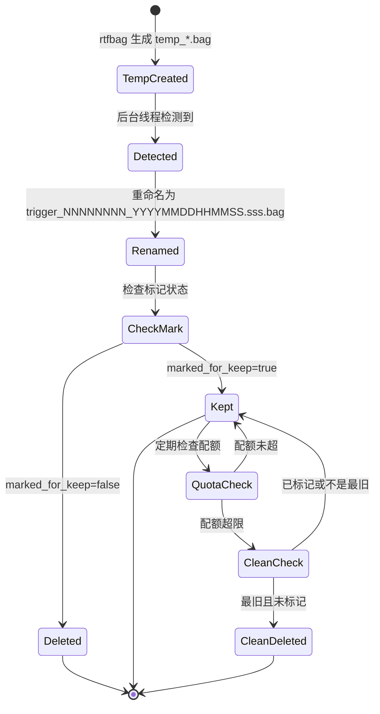

### rtfbag 进程状态机

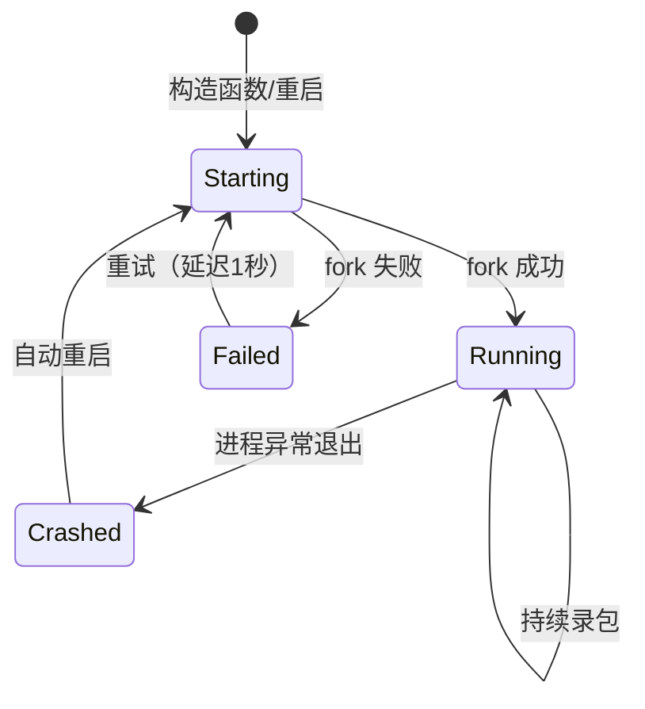

### 状态说明

| 状态 | 含义 | 可转移到 |
| :--- | :--- | :--- |
| TempCreated | rtfbag 生成临时文件 | Detected |
| Detected | 后台线程检测到新文件 | Renamed |
| Renamed | 文件已重命名为序列号格式 | CheckMark |
| CheckMark | 检查是否被触发标记 | Kept, Deleted |
| Kept | 文件被保留 | QuotaCheck, [终止] |
| Deleted | 文件未触发，已删除 | [终止] |
| QuotaCheck | 检查磁盘配额 | Kept, CleanCheck |
| CleanCheck | 检查是否可清理 | Kept, CleanDeleted |
| CleanDeleted | 因配额超限被清理 | [终止] |

### 非法状态处理

- **temp_*.bag 文件格式异常**：无法提取时间戳，记录警告并跳过
- **重命名失败**：记录错误，保留临时文件，继续处理
- **文件不存在但被标记**：记录警告，从标记集合中移除
- **rtfbag 进程反复崩溃**：记录严重错误，继续重启（最多延迟5秒）
- **序列号溢出**：理论上不会发生（size_t 可支持数十亿文件）
- **文件窗口过大**：限制最多保留最近 10 个文件记录，超过则移除最旧

## 6.3 数据生命周期

### FileRecord 生命周期

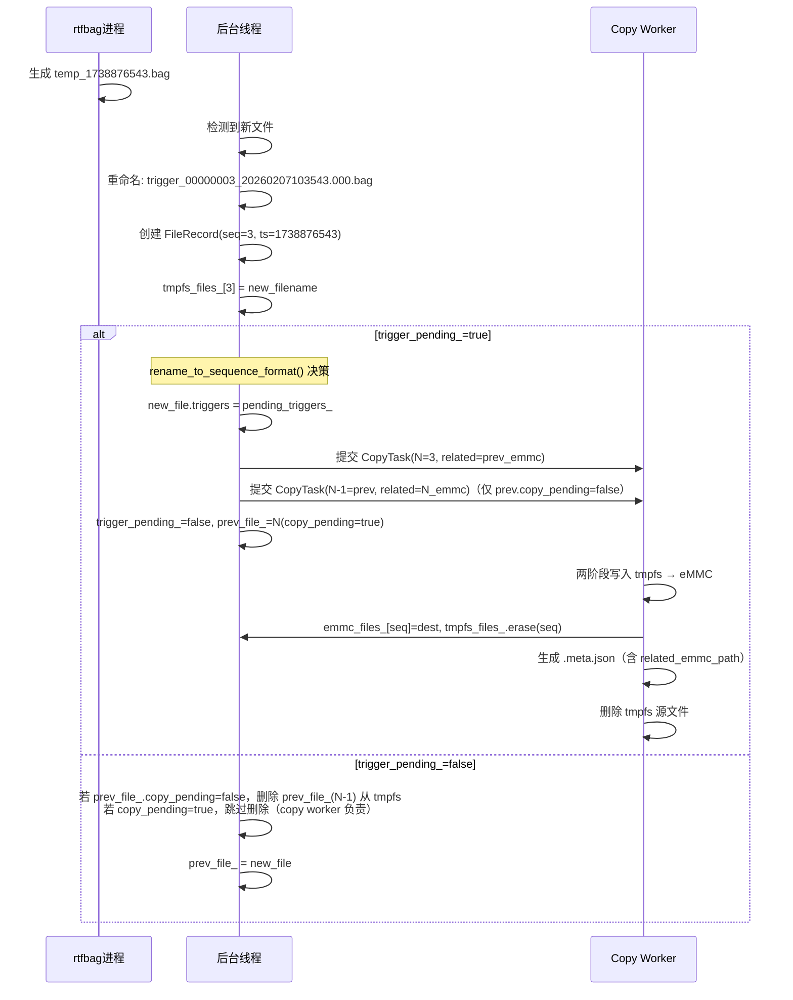

### 文件生命周期（完整流程）

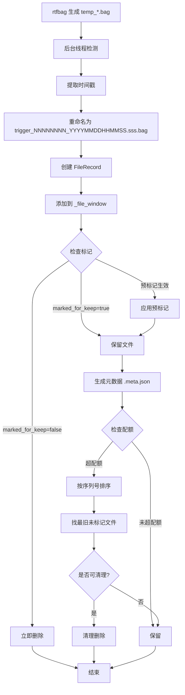

# 8. 元数据文件系统设计

## 7.1 设计目的

为解决用户难以区分录包文件触发源的问题，系统为每个保留的录包文件生成对应的元数据文件。元数据文件记录：

- 触发该文件保留的所有事件（故障或手动）
- 每个触发事件的详细信息（类型、故障码、时间戳）
- 相关的前后文件（三文件组的其他成员）

## 7.2 元数据文件格式

**文件命名规则**：`<触发文件bag_filename>.meta.json`

示例：

- 触发文件：`/opt/usr/records/trigger/trigger_00000123_20260207103543.123.bag`
- 元数据文件：`/opt/usr/records/trigger/trigger_00000123_20260207103543.123.bag.meta.json`

> 每次触发事件仅生成一个 meta.json，命名挂靠在触发文件 N 上。上下文文件（N-1）**不单独生成** meta.json。

**JSON格式定义**：

```json
{
  "triggers": [
    {
      "type": "fault",
      "fault_code": "202",
      "timestamp": "2026-02-07T10:35:15.123Z",
      "timestamp_sec": 1738876515.123
    },
    {
      "type": "manual",
      "timestamp": "2026-02-05T10:30:20.456Z",
      "timestamp_sec": 1738754420.456
    }
  ],
  "files": [
    "/opt/usr/records/trigger/trigger_00000123_20260207103543.123.bag",
    "/opt/usr/records/trigger/trigger_00000122_20260207103503.000.bag"
  ]
}
```

**字段说明**：

| 字段名 | 类型 | 必填 | 说明 |
| :--- | :--- | :--- | :--- |
| triggers | array | 是 | 触发事件列表（至少1个） |
| triggers[].type | string | 是 | 触发类型："fault" 或 "manual" |
| triggers[].fault_code | string | 否 | 故障码（仅当 type="fault" 时存在） |
| triggers[].timestamp | string | 是 | ISO 8601 格式时间戳 |
| triggers[].timestamp_sec | number | 是 | Unix 时间戳（秒，带小数） |
| files | array | 是 | 本次触发保留的所有 bag 文件 eMMC 路径；第一项为触发文件 N，后续项为上下文文件（N-1） |

**重要语义说明**：

- **files[0]**：始终是触发文件 N（事件在其录制期间发生）
- **files[1]**：上下文文件 N-1（前一段录制，提供事件前背景数据）；若系统刚启动无 prev_file_ 则只有 files[0]
- **跨引用（连续触发）**：若连续两次触发，同一个 bag 文件可以同时出现在相邻两个 meta.json 的 `files` 列表中（此为设计意图，不是错误）

## 7.3 生成时机与流程

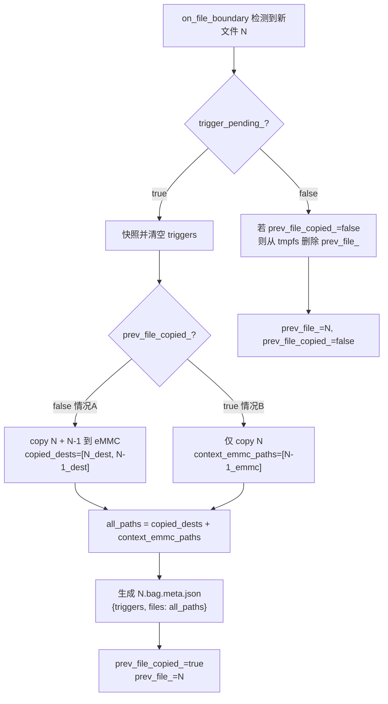

**生成时机**：

- 在 `perform_copy_tasks()` 中，所有 copy 阶段成功后立即生成
- 每次触发事件仅生成一个 meta.json（命名为 N.bag.meta.json）
- `files` 列表 = 实际 copy 的文件路径 + 已在 eMMC 的上下文路径（方案B）

## 7.4 元数据语义说明

### 触发文件 vs 上下文文件

| 角色 | 在 meta.json 中的位置 | 说明 |
| :--- | :--- | :--- |
| N（触发文件） | files[0]，meta.json 命名后缀 | 事件在此文件录制期间发生 |
| N-1（上下文文件） | files[1] | 提供事件前背景数据，不单独生成 meta.json |

**语义**：meta.json 的 `triggers` 记录触发事件；`files` 记录本次事件关联的所有 bag 文件（保存完整上下文）。

**优势**：

| 优势 | 说明 |
| :--- | :--- |
| **语义准确** | 明确区分触发文件和上下文文件 |
| **易于理解** | 用户一眼就能看出事件在哪个文件发生 |
| **数据完整** | 仍然保留两文件组的关联信息（related_file） |
| **支持多触发** | 一个文件内的多次触发仍然全部记录 |

## 7.5 触发信息记录机制

### 7.5.1 故障触发记录

```cpp
void update_fault_data(const ara::adsfi::FaultData& fault_data) {
    std::vector<std::string> triggered_codes;
    if (should_trigger_by_fault(fault_data, triggered_codes)) {
        for (const auto& code : triggered_codes) {
            TriggerInfo trigger;
            trigger.type = "fault";
            trigger.fault_code = code;
            trigger.timestamp = get_current_timestamp_iso();
            trigger.timestamp_sec = get_current_timestamp_sec();

            mark_files_for_keep(current_session_index, trigger);
        }
    }
}
```

### 7.4.2 手动触发记录

```cpp
void update_manual_trigger(std::int32_t trigger_signal) {
    if (check_manual_trigger_edge(trigger_signal)) {
        TriggerInfo trigger;
        trigger.type = "manual";
        trigger.timestamp = get_current_timestamp_iso();
        trigger.timestamp_sec = get_current_timestamp_sec();

        mark_files_for_keep(current_session_index, trigger);
    }
}
```

### 7.4.3 触发信息传递

在 `mark_files_for_keep` 中，触发信息会被添加到前、当前、后三个文件的 `triggers` 列表中：

```cpp
void mark_files_for_keep(size_t current_sequence, const TriggerInfo& trigger) {
    std::vector<size_t> sequences_to_mark = {
        current_sequence - 1,  // 前一个
        current_sequence,      // 当前
        current_sequence + 1   // 后一个
    };

    for (size_t seq : sequences_to_mark) {
        // 在窗口中查找已检测到的文件
        for (auto& file : _file_window) {
            if (file.sequence == seq) {
                if (!file.marked_for_keep) {
                    file.marked_for_keep = true;
                    _sequences_to_keep.insert(seq);
                }
                // 记录触发信息（即使已标记，也要记录新的触发）
                file.triggers.push_back(trigger);
                break;
            }
        }

        // 如果文件尚未生成（序列号 > 当前最大），使用预标记
        if (seq > _current_sequence) {
            _next_file_should_keep = true;
            // 触发信息会在文件生成时添加
        }
    }
}
```

## 7.5 使用场景示例

### 场景1：查看单个文件的触发原因

```bash
# 查看元数据
cat /opt/usr/records/trigger/trigger_00000123_20260207103543.123.bag.meta.json

# 输出：
# {
#   "triggers": [
#     {"type": "fault", "fault_code": "202", "timestamp": "2026-02-07T10:35:15.123Z", "timestamp_sec": 1738924515.123}
#   ],
#   "files": [
#     "/opt/usr/records/trigger/trigger_00000123_20260207103543.123.bag",
#     "/opt/usr/records/trigger/trigger_00000122_20260207103503.000.bag"
#   ]
# }
#
# 结论：seq=123 因故障码 202 被触发保留；seq=122 为上下文文件（N-1）
```

### 场景2：查找完整上下文

```bash
# meta.json 的 files 数组已包含触发文件 N 和上下文文件 N-1
cat trigger_00000123_20260207103543.123.bag.meta.json

# 输出：
# {
#   "triggers": [
#     {"type": "fault", "fault_code": "202", "timestamp": "2026-02-07T10:35:15.123Z", "timestamp_sec": 1738924515.123}
#   ],
#   "files": [
#     "/opt/usr/records/trigger/trigger_00000123_20260207103543.123.bag",
#     "/opt/usr/records/trigger/trigger_00000122_20260207103503.000.bag"
#   ]
# }
#
# files[0] = 触发文件 N（包含触发时刻）
# files[1] = 上下文文件 N-1（触发前一个录制窗口）
# 两个文件合计约 2×duration 秒的数据，覆盖触发前后完整上下文
```

### 场景3：分析多次触发

```bash
# 如果一个文件录制窗口内有多次触发，元数据会记录所有触发：
# {
#   "triggers": [
#     {"type": "fault", "fault_code": "301", "timestamp": "2026-02-05T10:30:10.000Z", "timestamp_sec": 1738749010.0},
#     {"type": "fault", "fault_code": "202", "timestamp": "2026-02-05T10:30:15.123Z", "timestamp_sec": 1738749015.123},
#     {"type": "manual", "fault_code": "", "timestamp": "2026-02-05T10:30:20.456Z", "timestamp_sec": 1738749020.456}
#   ],
#   "files": [
#     "/opt/usr/records/trigger/trigger_00000045_20260205103543.000.bag",
#     "/opt/usr/records/trigger/trigger_00000044_20260205103503.000.bag"
#   ]
# }
#
# 用户可以看到：
# - 10:30:10 发生故障 301
# - 10:30:15 发生故障 202
# - 10:30:20 用户手动请求录包
```

### 场景4：时间同步问题的处理

```bash
# 假设系统启动时时间是 2005-01-01，生成了文件：
# trigger_00000001_20050101000000.000.bag (2005-01-01 00:00:00)
# trigger_00000002_20050101000100.000.bag (2005-01-01 00:01:00)
#
# 时间同步后，生成的文件：
# trigger_00000003_20260207103543.000.bag (2026-02-07 10:35:43)
# trigger_00000004_20260207103643.000.bag (2026-02-07 10:36:43)
#
# 按时间戳字符串排序会导致顺序错误，但按序列号排序始终正确：
# 序列号排序：1, 2, 3, 4 ✓ (正确)
# 时间戳排序：1, 2, 4, 3 ✗ (错误，如果只看时间戳字符串)
#
# 清理时使用 trigger_seq（序列号）排序，确保删除真正最旧的事件组
```

### 场景5：连续触发跨引用

```bash
# 文件N=1 和 N=2 均触发：
#
# meta_1.json：
# {
#   "triggers": [{"type": "fault", "fault_code": "202", ...}],
#   "files": ["trigger_00000001_*.bag", "trigger_00000000_*.bag"]
# }
#
# meta_2.json（方案B：1.bag 已在 eMMC，不重复 copy，但仍引用）：
# {
#   "triggers": [{"type": "fault", "fault_code": "301", ...}],
#   "files": ["trigger_00000002_*.bag", "trigger_00000001_*.bag"]
# }
#
# 1.bag 同时被 meta_1.json 和 meta_2.json 引用。
# 清理时：先删 meta_1.json → 0.bag 被删，1.bag 仍受 meta_2 保护；
#         再删 meta_2.json → 1.bag 和 2.bag 被删。
```

## 7.6 元数据文件管理

### 7.6.1 生成规则

- **仅在触发时生成**：无触发的文件不生成元数据
- **每次触发事件一个**：meta.json 命名挂靠在触发文件 N 上，不为 N-1 单独生成
- **一次性写入**：copy 完成后生成，不再修改

### 7.6.2 eMMC 清理规则（按事件组删除）

清理以 **触发事件组** 为单位，流程：

1. **扫描所有 `.meta.json`**：解析 `files` 字段，构建事件组 `(trigger_seq → meta_path + bag_paths)`
2. **构建反向引用索引**：`bag_path → 引用它的 trigger_seq 集合`（处理跨引用）
3. **按 trigger_seq 从旧到新删除**：
   - 对组内每个 bag：从引用集合移除本组；若引用集合为空 → 删除该 bag；否则保留（跨引用保护）
   - 删除对应 meta.json
   - 重新计算大小，低于阈值则停止
4. **孤立 bag 处理**：若仍超阈值，删除 `emmc_files_` 中不被任何 meta.json 引用的 bag

**跨引用保护示例**：

```
meta_10.json → files: [10.bag, 9.bag]
meta_11.json → files: [11.bag, 10.bag]   ← 连续触发，10.bag 被两个 meta 引用

清理（超阈值，从旧删起）：
  删 meta_10.json → 9.bag 引用清零 → 删 9.bag；10.bag 仍被 meta_11 引用 → 保留 10.bag
  删 meta_11.json → 10.bag 引用清零 → 删 10.bag；11.bag 引用清零 → 删 11.bag
```

### 7.6.3 异常处理

| 异常情况 | 处理策略 |
| :--- | :--- |
| 元数据生成失败 | 记录错误日志，bag 文件已在 eMMC |
| JSON 写入失败 | 记录错误日志，不影响录包流程 |
| meta.json 解析失败 | 跳过该事件组，按孤立 bag 处理 |
| 孤立 meta.json（对应 bag 不存在） | Phase 0 清理时立即删除 |

## 7.7 优势分析

| 优势 | 说明 |
| :--- | :--- |
| **明确触发源** | 用户通过元数据即可知道录包原因 |
| **支持多触发** | 一个文件可被多个事件触发，全部记录在案 |
| **完整上下文** | 记录相关文件序列号，方便用户找到完整数据 |
| **时间精确** | 提供 ISO 8601 和 Unix 时间戳两种格式 |
| **序列号保证顺序** | 使用序列号而非时间戳关联文件，避免时间同步问题 |
| **便于查询** | JSON 格式易于程序解析和人工阅读 |
| **不侵入原始数据** | 元数据文件独立存在，不影响 bag 文件 |

# 9. 异常与边界处理（评审必查）

| 异常场景 | 检测方式 | 处理策略 | 是否可恢复 | 上报方式 |
| :--- | :--- | :--- | :--- | :--- |
| rtfbag 进程启动失败 | fork() 返回 -1 | 记录错误，延迟1秒后重试 | 是 | ERROR |
| rtfbag 进程异常退出 | waitpid 检测到退出 | 记录错误，自动重启 | 是 | ERROR |
| rtfbag 进程被信号终止 | WIFSIGNALED | 记录信号类型，自动重启 | 是 | WARN |
| rtfbag 反复崩溃 | 5秒内崩溃3次 | 延迟5秒后重启，记录严重错误 | 是 | CRITICAL |
| 输出目录不存在 | 启动时检查 | 自动创建，失败则抛异常 | 否 | FATAL |
| 输出目录无写权限 | 文件写入失败 | 记录错误，继续运行 | 是 | ERROR |
| 磁盘空间不足 | 文件写入失败 | 触发清理，记录警告 | 是 | WARN |
| 配置文件格式错误 | yaml-cpp 解析失败 | 抛出异常，拒绝启动 | 否 | FATAL |
| 配置参数非法 | 启动时校验 | 抛出异常，拒绝启动 | 否 | FATAL |
| quota < duration*buffer | 启动时校验 | 抛出异常，拒绝启动 | 否 | FATAL |
| temp_*.bag 格式异常 | 正则匹配失败 | 跳过该文件，记录警告 | 是 | WARN |
| 重命名文件失败 | rename() 失败 | 保留临时文件，记录错误 | 是 | ERROR |
| 文件删除失败 | std::filesystem::remove 异常 | 记录错误，继续运行 | 是 | WARN |
| 磁盘满导致无法清理 | remove 失败 | 记录严重错误，停止录包 | 否 | CRITICAL |
| 序列号恢复失败 | 解析文件名失败 | 使用默认值1，记录警告 | 是 | WARN |
| 序列号冲突 | 文件已存在 | sequence++，跳过该序列号 | 是 | WARN |
| 同一故障码持续存在 | 检查触发时间（单调时钟） | 60秒去重，避免重复触发 | 是 | 无 |
| 高频手动触发 | 边沿检测 | 只响应上升沿 | 是 | 无 |
| 并发调用 update_fault_data | mutex 保护 | 顺序执行，不丢失 | 是 | 无 |
| 后台线程崩溃 | 异常捕获 | 记录日志，整个模块失效 | 否 | FATAL |
| 内存耗尽 | new 失败 | std::bad_alloc 异常 | 否 | FATAL |
| 时间回拨 | - | 使用 steady_clock 单调时钟，不受影响 | 是 | 无 |
| 时间跳变（NTP同步） | - | 使用序列号排序，不受影响 | 是 | 无 |

# 10. 性能与资源预算（必须可验收）

## 8.1 性能指标

| 场景 | 指标 | 目标值 | 测试方法 |
| :--- | :--- | :--- | :--- |
| 故障触发响应 | 延迟（检测到标记） | < 100ms | 注入故障码，记录时间戳 |
| 手动触发响应 | 延迟（上升沿到标记） | < 100ms | 发送信号，记录时间戳 |
| 文件检测与重命名 | 延迟（生成到重命名） | < 1s | 监控文件系统事件 |
| 文件删除 | 延迟（检测到删除） | < 500ms | 监控文件系统事件 |
| 磁盘清理 | 延迟（检测超配额到开始清理） | < 2s | 填满目录，触发清理 |
| 序列号恢复 | 延迟（启动扫描） | < 2s (1000个文件) | 创建测试文件，计时启动 |
| 10Hz 调用开销 | CPU 时间 | < 0.1ms | perf 或 gprof 采样 |

## 8.2 资源预算

| 资源 | 常态 | 峰值 | 上限约束 |
| :--- | :--- | :--- | :--- |
| CPU（主程序） | < 2% | < 5% | < 10% |
| CPU（rtfbag进程） | 5-10% | 15% | < 20% |
| 内存（主程序） | 20MB | 50MB | < 100MB |
| 内存（rtfbag进程） | 50MB | 100MB | < 200MB |
| 磁盘空间 | 动态（0-quota） | quota | quota |
| 磁盘I/O（写入） | 5-10 MB/s | 20 MB/s | 取决于数据源 |
| 线程数 | 2（主+后台） | 2 | 固定2个 |
| 进程数 | 1-2（主+rtfbag） | 2 | 固定1-2个 |
| 文件描述符 | < 20 | < 50 | 无硬限制 |

# 11. 可测试性与验证

## 9.1 单元测试

### 覆盖范围

- `should_trigger_by_fault()`：故障去重逻辑
- `check_manual_trigger_edge()`：边沿检测逻辑
- `on_file_boundary()` / `perform_trigger_copy()`：边界触发 copy 逻辑（含方案B跨引用）
- `advance_prev_no_trigger()`：无触发时 tmpfs 旧文件删除
- `build_rtfbag_command()`：命令生成
- `calculate_directory_size()`：目录大小计算
- `clean_emmc_if_needed()`：事件组删除与跨引用保护

### Mock / Stub 策略

- **Mock rtfbag**：使用 shell 脚本模拟 rtfbag 行为（写入假文件）
- **Mock 文件系统**：使用临时目录（/tmp/test_recorder/）
- **Mock 时间**：使用可控的时间源（测试去重）
- **Stub FaultData**：手动构造测试数据

### 示例测试代码

```cpp
TEST(RecorderTest, FaultDeduplication) {
    Config config = createTestConfig();
    EventTriggeredRecorder recorder(config);

    // 构造故障数据
    FaultData fault;
    FaultInfo info;
    info.code = "202";
    info.timestamp = now();
    fault.fault_info.push_back(info);

    // 第一次触发
    recorder.update_fault_data(fault);
    EXPECT_TRUE(wasTriggered());

    // 立即再次触发（应该被去重）
    recorder.update_fault_data(fault);
    EXPECT_FALSE(wasTriggered());

    // 60秒后触发（应该成功）
    advance_time(60);
    recorder.update_fault_data(fault);
    EXPECT_TRUE(wasTriggered());
}
```

## 9.2 集成测试

### 上下游联调点

- **故障管理系统**：验证 FaultData 的真实数据格式
- **HMI 系统**：验证手动触发信号的时序
- **文件系统**：验证 rtfbag 输出文件的完整性

### 测试场景

1. **端到端测试**：从故障发生到文件保留的完整流程
2. **并发测试**：同时故障触发和手动触发
3. **长时间运行**：7天连续运行，检查资源泄漏
4. **故障注入**：模拟 rtfbag 崩溃、磁盘满等异常

## 9.3 可观测性

### 日志（关键点）

| 级别 | 触发点 | 日志内容 |
| :--- | :--- | :--- |
| INFO | 启动 | "Event triggered recorder initialized (sequence restored: N)" |
| INFO | 启动 rtfbag | "Started rtfbag process (pid=%d, prefix=%s)" |
| INFO | 检测到新文件 | "Detected new file: temp_%lf.bag" |
| INFO | 重命名文件 | "Renamed file: %s -> %s (sequence=%zu)" |
| INFO | 故障触发 | "Fault code %s triggered (sequence=%zu)" |
| INFO | 手动触发 | "Manual trigger detected (rising edge, sequence=%zu)" |
| INFO | 标记文件 | "Marked file for keep: sequence=%zu" |
| INFO | 保留文件 | "Keeping file: %s (sequence=%zu)" |
| INFO | 删除文件 | "Deleted untriggered file: %s" |
| INFO | 清理开始 | "Directory size (%zu MB) exceeds quota (%zu MB)" |
| INFO | 清理文件 | "Deleted old file: %s (sequence=%zu)" |
| INFO | rtfbag 重启 | "Restarting rtfbag process" |
| WARN | 文件不存在 | "Detected file does not exist: %s" |
| WARN | 重命名失败 | "Failed to rename file %s: %s" |
| WARN | 序列号恢复异常 | "Failed to parse sequence from filename: %s" |
| WARN | 进程被终止 | "rtfbag process terminated by signal %d" |
| WARN | 临时文件格式异常 | "Invalid temp file format: %s" |
| ERROR | fork 失败 | "Failed to fork rtfbag process: %s" |
| ERROR | 进程异常退出 | "rtfbag process exited with code %d" |
| ERROR | 删除失败 | "Failed to delete file %s: %s" |
| ERROR | 元数据生成失败 | "Failed to generate metadata for %s: %s" |
| CRITICAL | 反复崩溃 | "rtfbag process crashed %d times in 5 seconds" |
| CRITICAL | 磁盘满无法清理 | "Disk full and cleanup failed" |

### 监控指标

| 指标名 | 类型 | 说明 |
| :--- | :--- | :--- |
| recorder.files.total | Counter | 累计检测并重命名的文件数 |
| recorder.files.triggered | Counter | 被触发保留的文件数 |
| recorder.files.deleted | Counter | 被删除的文件数 |
| recorder.files.current_sequence | Gauge | 当前序列号 |
| recorder.disk.size_mb | Gauge | 当前目录大小（MB） |
| recorder.disk.files_count | Gauge | 当前文件数量 |
| recorder.rtfbag.crashes | Counter | rtfbag 进程崩溃次数 |
| recorder.rtfbag.restarts | Counter | rtfbag 进程重启次数 |
| recorder.triggers.fault_count | Counter | 故障触发次数（按故障码分类） |
| recorder.triggers.manual_count | Counter | 手动触发次数 |
| recorder.cpu.percent | Gauge | CPU 占用百分比 |
| recorder.memory.mb | Gauge | 内存占用（MB） |
| recorder.rename.latency_ms | Histogram | 文件重命名延迟（毫秒） |
| recorder.cleanup.count | Counter | 清理操作次数 |

### Trace / Debug 接口

```cpp
// 获取当前状态（用于调试）
struct Status {
    size_t current_sequence;
    size_t window_size;
    size_t sequences_to_keep_count;
    size_t disk_size_mb;
    bool is_rtfbag_running;
    pid_t rtfbag_pid;
};

Status getStatus() const;

// 强制触发（仅用于测试）
void forceTrigger();

// 强制清理（仅用于测试）
void forceClean();

// 获取文件窗口快照（用于调试）
std::vector<FileRecord> getFileWindow() const;
```

# 12. 测试用例清单

| ID | 对应需求 | 测试项目 | 测试步骤 | 预期结果 | 测试结果 |
| :--- | :--- | :--- | :--- | :--- | :--- |
| TC-01 | FR-01 | 连续录包 | 1. 启动 recorder<br>2. 等待180s | rtfbag 持续运行，tmpfs 中循环生成 trigger_*.bag.active，完成后重命名为 trigger_NNNNNNNN_*.bag | - |
| TC-02 | FR-02 | 故障触发 | 1. 启动 recorder，等待第2个文件完成<br>2. 注入故障码"202"（在第3个文件录制期间）<br>3. 等待第3个文件完成（边界触发） | 文件N（当前）和N-1（上一个）被 copy 到 eMMC；eMMC 无其他文件；生成 meta.json，files=[N, N-1] | - |
| TC-03 | FR-03 | 手动触发 | 1. 启动 recorder，等待第2个文件完成<br>2. 发送 signal=1（在第3个文件录制期间）<br>3. signal=0；等待第3个文件完成 | 文件N（当前）和N-1（上一个）被 copy 到 eMMC；meta.json triggers 包含 type=manual | - |
| TC-04 | FR-04 | 边界触发 copy 正确性 | 1. 等待文件A完成（设为 prev_file_）<br>2. 文件B录制期间注入触发信号<br>3. 等待文件B完成（on_file_boundary 触发） | 文件B（N）和文件A（N-1）被 copy 到 eMMC；文件C 不被 copy；meta_B.json 的 files=[B.bag, A.bag] | - |
| TC-05 | FR-05 | 未触发文件从 tmpfs 删除 | 1. 等待文件生成<br>2. 不触发<br>3. 等待下一个文件到来（边界） | tmpfs 中的 prev_file_ 被立即删除（不写入 eMMC）；eMMC 无新文件 | - |
| TC-06 | FR-06 | 磁盘清理（按事件组） | 1. eMMC 中预置3个触发事件组（各含 meta.json + bags）<br>2. 超过配额阈值<br>3. 触发清理 | 最旧的触发事件组（meta.json + 对应 bag 文件）被整组删除；跨引用 bag 不被提前删除 | - |
| TC-07 | FR-08 | 故障去重 | 1. 连续60s发送故障码"202"<br>2. 检查触发次数 | 只触发一次（60秒内去重） | - |
| TC-08 | FR-09 | 边沿检测 | 1. 发送 0→1→1→1→0<br>2. 检查触发次数 | 只在上升沿触发一次 | - |
| TC-09 | FR-13 | 文件检测与重命名（tmpfs 内） | 1. 启动 recorder<br>2. 观察 tmpfs 文件变化 | tmpfs 中的 trigger_*.bag.active 完成后，被重命名为 trigger_NNNNNNNN_*.bag（仍在 tmpfs）；eMMC 无写入（无触发） | - |
| TC-10 | FR-14 | 序列号恢复 | 1. 在 eMMC 目录预置测试文件（序列号1-10）<br>2. 启动 recorder（构造函数自动清空 tmpfs）<br>3. 检查 next_sequence | next_sequence = 11；tmpfs 为空 | - |
| TC-11 | FR-15 | RAII 模式 | 1. 构造对象<br>2. 检查 rtfbag 启动<br>3. 析构对象<br>4. 检查清理 | 构造启动，析构停止 | - |
| TC-12 | NFR-01 | 触发延迟 | 1. 注入故障码<br>2. 测量从触发到 trigger_pending_=true 的时间 | < 100ms | - |
| TC-13 | NFR-02 | CPU 占用 | 1. 运行1小时<br>2. 使用 top 监控 | < 15% | - |
| TC-14 | NFR-05 | 长时间运行 | 1. 运行7天<br>2. 检查内存泄漏 | 无崩溃，无泄漏 | - |
| TC-15 | 异常 | rtfbag 崩溃恢复 | 1. 杀掉 rtfbag 进程<br>2. 观察恢复 | 自动重启，继续录包 | - |
| TC-16 | 异常 | 磁盘满 | 1. 填满 eMMC 磁盘<br>2. 观察清理 | 自动按事件组清理旧文件，释放空间 | - |
| TC-17 | 边界 | 配置非法 | 1. quota < duration*buffer<br>2. 启动 | 抛出异常，拒绝启动 | - |
| TC-18 | FR-04 | 第一个文件触发（无 prev_file_） | 1. 启动后第1个文件录制期间立即触发<br>2. 等待第1个文件完成 | 只有文件1 被 copy 到 eMMC（prev_file_ 为空，无 N-1）；meta.json files 仅含 [seq=1]；eMMC 无 seq=0 | - |
| TC-19 | FR-04 | 间隔触发（两次触发之间隔一个文件） | 1. 文件1录制期间触发<br>2. 文件2录制期间无触发<br>3. 文件3录制期间触发 | seq=0,1 被第一次触发 copy；seq=2,3 被第二次触发 copy；生成 meta_1.json (files=[1,0]) 和 meta_3.json (files=[3,2])；共4个 bag 在 eMMC | - |
| TC-20 | 边界 | 时间同步问题 | 1. 时间2005生成文件<br>2. 时间同步到2026<br>3. 继续生成文件<br>4. 清理 | 按序列号（事件组 trigger_seq）清理，不受时间戳影响 | - |
| TC-21 | 性能 | 高频触发 | 1. 10Hz持续触发<br>2. 运行10分钟 | CPU < 15%；触发去重生效，不产生异常堆积 | - |
| TC-22 | 性能 | 文件重命名延迟 | 1. 监控 tmpfs 中文件重命名时间 | < 1s | - |
| TC-23 | 集成 | 与故障系统联调 | 1. 接入真实故障数据<br>2. 验证触发 | 正常触发，N 和 N-1 被 copy 到 eMMC | - |
| TC-24 | 集成 | 与HMI联调 | 1. 接入真实手动信号<br>2. 验证触发 | 正常触发，N 和 N-1 被 copy 到 eMMC | - |
| TC-25 | 异常 | .bag.active 文件清理 | 1. 在 tmpfs 创建孤儿 .bag.active 文件<br>2. 确保 rtfbag 未运行<br>3. 等待检测 | 孤儿 .bag.active 文件被删除 | - |
| TC-26 | FR-04 | 连续触发（方案B 跨引用） | 1. 文件1录制期间触发（seq=0,1 被 copy；prev_file_copied_=true）<br>2. 文件2录制期间再次触发<br>3. 等待文件2完成 | seq=2 被单独 copy（seq=1 不重复 copy）；meta_2.json files=[2.bag, 1.bag]；1.bag 同时出现在 meta_1.json 和 meta_2.json 的 files 列表中 | - |
| TC-27 | FR-06 | 事件组删除与跨引用保护 | 1. 预置：meta_10.json→files=[10,9]；meta_11.json→files=[11,10]（10.bag被两个meta引用）<br>2. 超过配额<br>3. 触发清理 | 先删 meta_10.json：9.bag 引用清零→删除；10.bag 仍被 meta_11 引用→保留<br>再删 meta_11.json：10.bag 和 11.bag 引用清零→全删 | - |
| TC-28 | FR-14 | 构造函数清空 tmpfs | 1. 在 tmpfs 目录预置若干文件<br>2. 构造 EventTriggeredRecorder | 构造完成后 tmpfs 目录为空；eMMC 不受影响 | - |

# 13. 风险分析（设计评审核心）

| 风险 | 影响 | 可能性 | 应对措施 |
| :--- | :--- | :--- | :--- |
| rtfbag 工具不兼容 | 录包失败，模块无法使用 | 低 | 在部署前验证 rtfbag 版本和 --split 参数 |
| 磁盘I/O性能不足 | 数据丢帧，录包不完整 | 中 | 使用 SSD，调整 buffer_size |
| 故障码频繁触发 | 磁盘空间快速耗尽 | 中 | 增强去重策略，调整配额大小 |
| HMI 信号异常 | 误触发或漏触发 | 低 | 边沿检测容错，添加日志追踪 |
| 并发竞态 | 数据不一致 | 低 | mutex 保护，code review 重点检查 |
| 文件删除失败 | 磁盘空间持续增长 | 中 | 添加重试机制，监控告警 |
| 时钟回拨 | 时间戳异常 | 低 | 使用 steady_clock（单调时钟）进行去重和年龄计算 |
| 时间跳变（NTP同步） | 文件排序错误 | 中 | 使用序列号排序，不依赖时间戳 |
| 配置错误 | 启动失败或行为异常 | 中 | 启动时严格校验，提供配置示例 |
| 内存泄漏 | 长时间运行后崩溃 | 低 | 使用 RAII，valgrind 检测 |
| tmpfs 空间耗尽 | rtfbag 写入失败 | 中 | 配置合理的 tmpfs_size_mb（至少 3×duration×bitrate），监控告警 |
| copy 线程异常 | 触发文件未持久化 | 低 | copy_worker_thread_ 捕获异常并上报故障码 2042004 |
| 多实例运行 | 文件冲突、序列号冲突 | 低 | 不支持多实例，添加检查（锁文件） |
| rtfbag 反复崩溃 | 无法正常录包 | 中 | 记录崩溃次数，延迟重启，告警 |
| 临时文件格式变化 | 无法解析时间戳 | 低 | 容错处理，记录警告，跳过异常文件 |
| 序列号冲突 | 文件被覆盖 | 低 | 检查文件存在性，sequence++ 跳过 |
| 文件系统inode耗尽 | 无法创建新文件 | 低 | 监控 inode 使用率，及时清理 |
| meta.json 解析失败（清理时） | 孤立 bag 无法按事件组删除 | 低 | 跳过损坏 meta，按孤立 bag 单独处理 |

# 14. 设计评审

## 12.1 评审 Checklist

- [x] 需求是否完整覆盖
  - 所有 FR 和 NFR 均有对应设计
  - 需求-设计-验证映射完整

- [x] 接口是否清晰稳定
  - 对外接口仅4个，语义明确
  - 行为契约完整（前置/后置/失败语义）
  - 稳定性声明清晰

- [x] 异常路径是否完整
  - 20+ 种异常场景均有处理策略
  - 进程崩溃、磁盘满等关键异常已覆盖
  - 边界情况（第一个文件、连续触发）已考虑

- [x] 性能 / 资源是否有上限
  - CPU < 15%，内存 < 100MB
  - 磁盘空间受配额约束
  - 触发延迟 < 100ms

- [x] 是否存在过度设计
  - 无云端上传、压缩等未要求功能
  - 使用标准库，无自定义复杂数据结构
  - 线程模型简单（仅2个线程）

- [x] 测试用例是否覆盖所有功能需求和非功能需求
  - 20个测试用例覆盖所有 FR/NFR
  - 包含单元测试、集成测试、性能测试、异常测试

## 12.2 评审记录

| 日期 | 评审人 | 问题 | 结论 | 备注 |
| :--- | :--- | :--- | :--- | :--- |
| 2025-02-05 | - | 初稿提交 | 待评审 | - |
| | | | | |
| | | | | |

# 15. 变更管理（重点）

## 13.1 变更原则

- 不允许口头变更
- 接口 / 行为变更必须记录
- 配置格式变更必须向后兼容或提供迁移工具

## 13.2 变更分级

| 级别 | 示例 | 是否需要评审 |
| :--- | :--- | :--- |
| L1 | 注释 / 日志文本修改 | 否 |
| L2 | 内部逻辑优化（不影响行为） | 否（代码审查即可） |
| L3 | 接口签名 / 行为变更 | 是（模块级评审） |
| L4 | 配置格式 / 依赖变更 | 是（系统级评审） |

## 13.3 变更记录

| 版本 | 变更内容 | 影响分析 | 评审人 |
| :--- | :--- | :--- | :--- |
| V1.0 | 初始设计 | 新模块，无影响 | - |
| V1.1 | 重大架构变更：<br>1. 采用 rtfbag --split --duration 连续录包模式<br>2. 文件命名改为序列号格式（trigger_NNNNNNNN_timestamp.bag）<br>3. 启动时扫描目录恢复序列号<br>4. 使用序列号排序，避免时间同步问题<br>5. 采用 RAII 模式管理生命周期（移除 start/stop 方法）<br>6. 使用单调时钟（steady_clock）进行去重和年龄计算 | 架构变更，提升可靠性：<br>- 避免进程重启导致的数据丢失<br>- 解决时间同步导致的文件排序问题<br>- 简化生命周期管理 | - |
| V1.2 | 元数据语义优化：<br>1. 仅在触发文件记录触发信息（当前序列号）<br>2. 上下文文件（前后序列号）不记录触发信息<br>3. 添加 triggered 布尔字段明确区分<br>4. 移除 next_file_triggers_ 成员变量<br>5. 简化预标记机制，仅标记保留不记录触发 | 语义优化，提升可读性：<br>- 明确区分触发文件和上下文文件<br>- 元数据语义更准确<br>- 用户更容易理解触发原因 | - |
| V1.3 | 移除冗余的 next_file_should_keep_ 标志：<br>1. 删除 next_file_should_keep_ 成员变量<br>2. 直接使用 sequences_to_keep_集合检查预标记<br>3. 简化 mark_next_file_for_pre_keep() 实现<br>4. 统一预标记逻辑 | 代码简化优化：<br>- 消除冗余状态变量<br>- 降低状态管理复杂度<br>- 提升代码可维护性 | - |
| V1.4 | 基于元数据的文件清理策略：<br>1. 添加 collect_sequences_from_metadata() 函数<br>2. 添加 parse_metadata_sequences() 解析辅助函数<br>3. 在清理时扫描元数据构建保护集合<br>4. 同时检查 sequences_to_keep_ 和元数据保护集合<br>5. 避免删除元数据组中的任何文件 | 清理策略优化：<br>- 防止误删元数据组成员文件<br>- 保证三文件组的完整性<br>- 提升数据可靠性 | - |
| V1.5 | tmpfs 双层存储架构重构：<br>1. rtfbag 写入 tmpfs（RAM），非触发文件零 eMMC 写入<br>2. 新增 AsyncCopyWorker 异步线程，触发文件两阶段原子 copy 到 eMMC<br>3. Config 新增 tmpfs_path / tmpfs_size_mb 字段<br>4. FileRecord 新增 Location 枚举和 copy_pending 标志<br>5. all_sequence_files_拆分为 tmpfs_files_和 emmc_files_<br>6. scan_and_restore_sequence() 只扫 eMMC 目录<br>7. generate_metadata_file() 移至 copy 完成回调中执行<br>8. 清理不符合命名规范的文件立即删除 | 架构优化：<br>- 大幅降低 eMMC 写入量，延长存储寿命<br>- 清晰分离录制缓冲层（tmpfs）和持久化层（eMMC）<br>- 需要启动脚本配合挂载 tmpfs | - |
| V1.7 | 连续触发与事件组删除优化：<br>1. 连续触发方案B：N-1 已在 eMMC 时不重复 copy，改为在 meta.json 的 files 列表中跨引用（N.bag 可出现于多个 meta 的 files 中）<br>2. meta.json 格式变更：ONE per trigger，`files` 数组替代 `related_file` 字段；files[0]=N（触发文件），files[1]=N-1（上下文）<br>3. 按事件组删除：解析 .meta.json 构建 event_groups + bag_refs 反向引用索引，跨引用 bag 延迟删除至最后一个引用 meta 被删<br>4. 移除文件年龄保护（is_file_old_enough / FILE_AGE_MULTIPLIER），超阈值立即清理最旧事件组<br>5. tmpfs 由构造函数主动清空，不再依赖启动脚本<br>6. FileRecord 结构简化：移除 marked_for_keep / triggers / Location / copy_pending 字段；改用类成员 prev_file_copied_ | 可靠性与存储效率提升：<br>- 连续触发场景下不重复写入 eMMC<br>- 跨引用 bag 有完整的引用计数保护，不会误删<br>- tmpfs 生命周期由代码自管理，减少外部依赖 | - |
| V1.8 | 序号管理统一化：<br>1. `scan_and_restore_sequence()` 异常 catch 块中 `current_sequence_` 由 `1` 改为 `0`（与正常路径一致，构造函数已初始化为 0）；<br>2. 文件命名序列号从 0 开始（与 xh265_recorder / xfault_handler / xvehicle_status_recorder 保持一致） | 行为对齐：catch 分支与正常分支序号基准统一，避免异常恢复后首个文件序号偏移 | - |

# 16. 交付与冻结

## 14.1 设计冻结条件

- [ ] 所有接口有对应测试用例
- [ ] 所有 NFR 有验证方案
- [ ] 异常路径已覆盖
- [ ] 变更影响分析完成
- [ ] 评审意见已闭环
- [ ] 关键代码已实现并通过初步验证

## 14.2 设计与交付物映射

| 设计章节 | 交付物 | 路径 |
| :--- | :--- | :--- |
| 4.1 架构 | EventTriggeredRecorder 类 | src/EventTriggeredRecorder.h/cpp |
| 5.1 接口 | AdsfiInterface | adsfi_interface/adsfi_interface.h/cpp |
| 6.1 配置 | ConfigLoader | src/ConfigLoader.h |
| 6.1 配置 | config.yaml | config/config.yaml |
| 9.1 测试 | 测试程序 | test/test_recorder.cpp |
| 9.3 日志 | 日志文件 | /opt/usr/zxz/log/*.log |
| - | 构建脚本 | CMakeLists.txt |
| - | 使用文档 | README.md |
| - | 设计文档 | design_xevent_triggered_recorder.md |

# 17. 附录

## 15.1 术语表

| 术语 | 全称 | 说明 |
| :--- | :--- | :--- |
| ETR | Event Triggered Recorder | 事件触发式录包系统 |
| rtfbag | Real-Time Framework Bag | 录包工具 |
| FR | Functional Requirement | 功能需求 |
| NFR | Non-Functional Requirement | 非功能需求 |
| Session | Recording Session | 录制会话，一个 rtfbag 进程的完整生命周期 |
| 滑动窗口 | Sliding Window | 维护最近 N 个 Session 的数据结构 |
| 上升沿 | Rising Edge | 信号从 0 变成 1 |
| 下降沿 | Falling Edge | 信号从 1 变成 0 |
| 去重 | Deduplication | 避免重复触发的机制 |
| 预标记 | Pre-mark | 对还未创建的 Session 提前标记 |

## 15.2 参考文档

1. **需求文档**：[requirements.md](requirements.md)
2. **rtfbag 使用手册**：（待补充）
3. **adsfi_interface 框架文档**：（待补充）
4. **MISRA C++ 规范**：MISRA C++:2008
5. **C++ 编码规范**：项目内部规范

## 15.3 历史版本记录

| 版本 | 日期 | 修订人 | 修订内容 |
| :--- | :--- | :--- | :--- |
| V1.7 | 2026-03-01 | - | 连续触发与事件组删除优化：<br>1. 连续触发方案B：N-1 已在 eMMC 时不重复 copy，改为在 meta.json 的 files 列表中跨引用<br>2. meta.json 格式变更：ONE per trigger，`files` 数组替代 `related_file`；files[0]=N，files[1]=N-1<br>3. 按事件组删除：解析 .meta.json 构建 event_groups + bag_refs 反向引用索引，跨引用 bag 延迟删除<br>4. 移除文件年龄保护（is_file_old_enough），超阈值立即清理最旧事件组<br>5. tmpfs 由构造函数主动清空<br>6. FileRecord 结构简化：移除 copy_pending / Location 等字段，改用类成员 prev_file_copied_ |
| V1.6 | 2026-02-27 | - | 边界触发式架构重构：<br>1. 移除滑动窗口（file_window_）和保留集合（sequences_to_keep_）<br>2. 新增 prev_file_+ trigger_pending_+ pending_triggers_ 替代<br>3. 触发信号到来时仅记录标志，等当前文件完成后统一 copy N 和 N-1<br>4. tmpfs 最多保留 2 个完成文件，新文件到来时立即删除旧 prev<br>5. 移除预标记机制和元数据解析保护逻辑，大幅简化代码 |
| V1.0 | 2025-02-05 | - | 初始版本，完成全部设计 |
| V1.1 | 2025-02-07 | - | 重大架构更新：采用连续录包模式、序列号文件命名、RAII生命周期管理 |
| V1.2 | 2025-02-08 | - | 元数据语义优化：<br>1. 仅在触发文件记录触发信息<br>2. 上下文文件不记录触发信息<br>3. 添加triggered布尔字段区分触发文件和上下文文件<br>4. 移除next_file_triggers_成员变量<br>5. 简化预标记机制 |
| V1.3 | 2025-02-08 | - | 移除冗余的next_file_should_keep_标志：<br>1. 删除next_file_should_keep_成员变量<br>2. 直接使用sequences_to_keep_集合检查预标记<br>3. 简化mark_next_file_for_pre_keep()实现<br>4. 统一预标记逻辑 |
| V1.4 | 2025-02-08 | - | 基于元数据的文件清理策略：<br>1. 添加collect_sequences_from_metadata()函数<br>2. 添加parse_metadata_sequences()解析辅助函数<br>3. 在清理时扫描元数据构建保护集合<br>4. 同时检查sequences_to_keep_和元数据保护集合<br>5. 防止误删元数据组成员文件 |
| | | | |

---

**文档结束**
