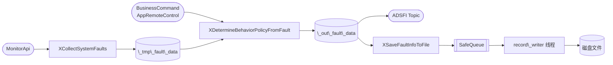
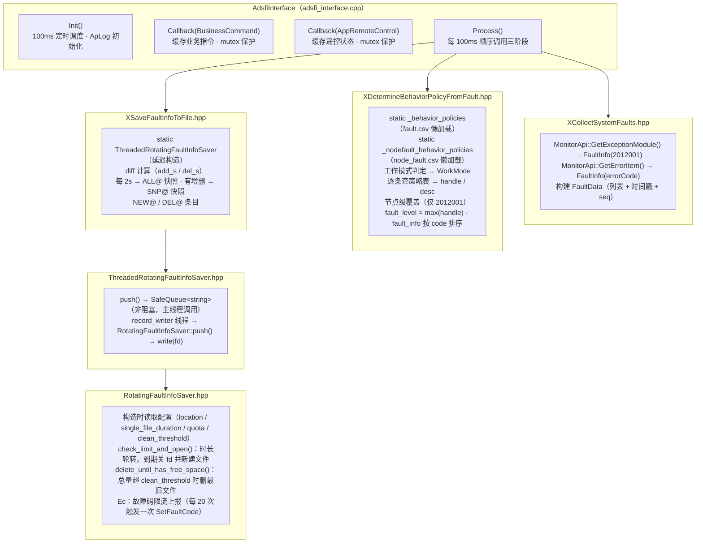
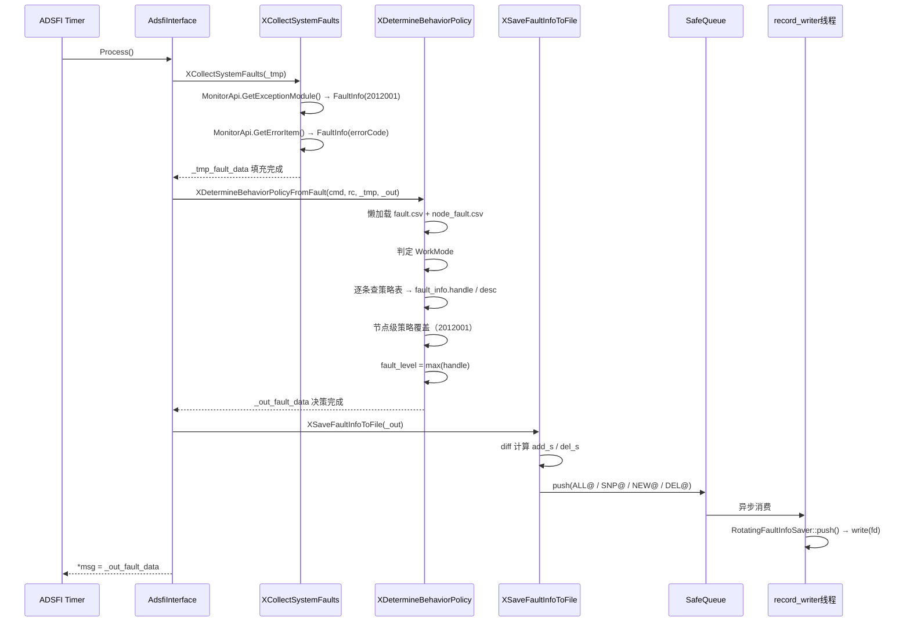
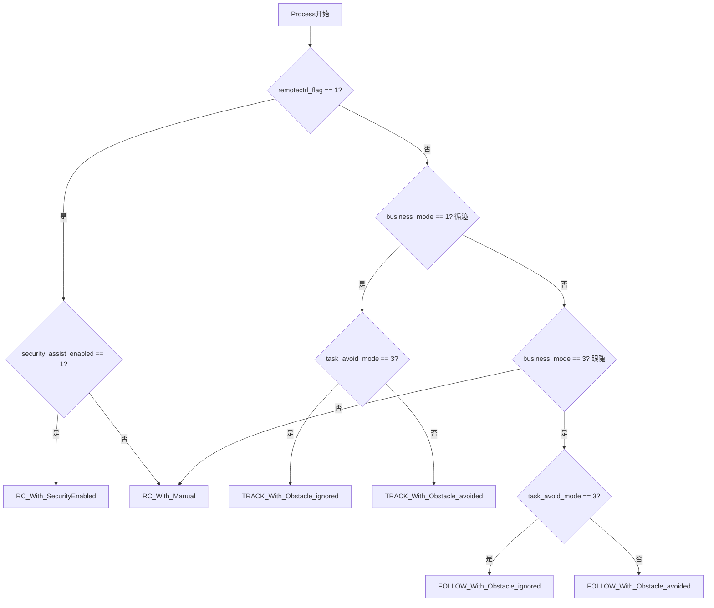
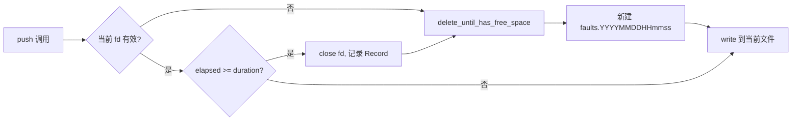
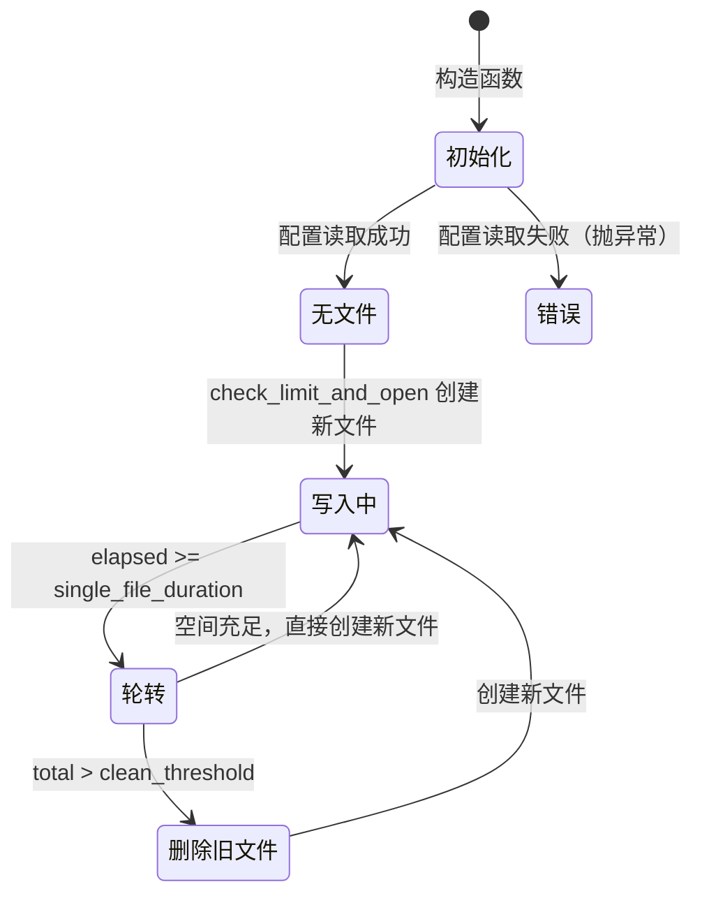

# 1. 文档信息

| 项目 | 内容 |
| :--- | :--- |
| **模块名称** | XFaultHandler（系统故障处理器） |
| **模块编号** | — |
| **所属系统 / 子系统** | 系统层 / 故障管理 |
| **模块类型** | 公共模块 |
| **负责人** | — |
| **参与人** | — |
| **当前状态** | 草稿 |
| **版本号** | V1.1 |
| **创建日期** | 2026-03-01 |
| **最近更新** | 2026-03-05 |

---

# 2. 模块概述

## 2.1 模块定位

XFaultHandler 是自动驾驶系统中的**故障汇聚与决策模块**，以 100 ms 定时周期运行，承担以下职责：

1. **故障采集**：从系统 MonitorApi 拉取所有注册节点的心跳异常和共享内存故障项；
2. **行为策略决策**：根据当前业务模式（循迹 / 跟随 / 遥控）与 CSV 配置表，将每条故障映射为行为处置等级（0‒3）；
3. **故障信息持久化**：以追加写方式将故障快照和增删变化记录到本地轮转日志文件。

- **上游模块（输入来源）**：
  - `BusinessCommand`（业务指令，决定循迹 / 跟随 / 遥控模式）
  - `AppRemoteControl`（遥控器状态，决定是否接管及安全辅助模式）
  - 系统 MonitorApi（心跳异常、SHM 故障项）
- **下游模块（输出去向）**：
  - `FaultData`（Topic 发布，下游规划 / 控制 / HMI 等订阅使用）
  - 本地故障日志文件（持久化记录，供离线分析）
- **对外能力**：通过 ADSFI Topic 发布 `FaultData`；不提供 SDK / Service / API。

## 2.2 设计目标

- **功能目标**：实时汇聚全系统故障，结合当前工作模式输出统一的故障等级供下游决策。
- **性能目标**：定时周期 100 ms，单次 Process 耗时需小于 50 ms；异步文件写入不阻塞主流程。
- **稳定性目标**：CSV 加载失败不崩溃；文件写入失败不影响故障决策输出；故障码按频率限流上报，避免告警风暴。
- **可维护性目标**：故障行为策略通过 CSV 配置表维护，无需修改代码即可调整各故障的处置等级。

## 2.3 设计约束

- 运行于 Linux（华为 MDC 平台），C++17。
- 依赖 ADSFI 中间件框架（`BaseAdsfiInterface`、`MonitorApi`）及 CustomStack 配置框架。
- 依赖第三方库：`fmt`、`glog`、`zmq`、`yaml-cpp`、`pthread`、`dl`。
- CSV 配置文件须遵循固定列格式（fault.csv 8 列，node_fault.csv 7 列）。

---

# 3. 需求与范围

## 3.1 功能需求（FR）

| 需求ID | 描述 | 优先级 |
| :--- | :--- | :--- |
| FR-01 | 每 100 ms 采集系统内所有节点的心跳异常（故障码 2012001） | 高 |
| FR-02 | 每 100 ms 采集共享内存中的故障项（SHM FaultInfo） | 高 |
| FR-03 | 根据当前工作模式（6 种）和 fault.csv 策略表，为每条故障确定行为处置等级 | 高 |
| FR-04 | 对心跳故障（2012001）额外使用 node_fault.csv 进行节点级别策略覆盖（取最大值） | 高 |
| FR-05 | 将最终 FaultData（含故障列表和最高等级）发布为 ADSFI Topic | 高 |
| FR-06 | 将故障事件（新增/删除/全量快照）异步写入本地轮转日志文件 | 中 |
| FR-07 | 日志文件按时长轮转，总量超过配置阈值时自动删除最旧文件 | 中 |
| FR-08 | 文件操作自身故障通过 FaultApi 上报对应故障码 | 中 |

## 3.2 非功能需求（NFR）

| 需求ID | 类型 | 指标 | 目标值 |
| :--- | :--- | :--- | :--- |
| NFR-01 | 性能 | Process 函数单次执行耗时 | < 50 ms |
| NFR-02 | 性能 | 文件写入延迟（异步） | 不阻塞主流程 |
| NFR-03 | 可靠性 | CSV 加载失败时模块不崩溃 | 仅记录 AERROR，跳过当次决策 |
| NFR-04 | 可靠性 | 文件写入失败时故障决策不受影响 | 写入异常仅影响持久化，主流程继续 |
| NFR-05 | 可观测性 | 每 10 个周期输出一次全量节点心跳日志 | 10 × 100 ms = 1 s |

## 3.3 范围界定

### 3.3.1 本模块必须实现：
- 故障采集（心跳 + SHM）
- 故障行为策略查表与等级决策
- FaultData Topic 发布
- 异步轮转日志持久化

### 3.3.2 本模块明确不做：
- 故障恢复控制（停车/刹车动作由规划/控制模块执行）
- 故障告警推送（如短信/远程通知，属于 HMI / 通知模块）
- 运行时动态修改策略表
- 故障聚合去重（相同故障码多次上报直接透传）

## 3.4 需求-设计-验证映射

| 需求ID | 对应设计章节 | 对应接口 | 验证方式 / 用例 |
| :--- | :--- | :--- | :--- |
| FR-01/02 | 5.3 核心流程（采集） | `XCollectSystemFaults()` | TC-01 |
| FR-03/04 | 5.3 核心流程（决策） | `XDetermineBehaviorPolicyFromFault()` | TC-02, TC-03 |
| FR-05 | 7.1 对外接口 | `Process()` → FaultData | TC-04 |
| FR-06/07 | 5.3 核心流程（持久化） | `XSaveFaultInfoToFile()` | TC-05, TC-06 |
| FR-08 | 9. 异常与边界处理 | `Ec::ec_add()` | TC-07 |

---

# 4. 设计思路

## 4.1 方案概览

模块采用**三阶段流水线**设计，每个定时周期顺序执行：



- 三个核心函数各自封装为独立 `.hpp`，单一职责，易于测试替换。
- CSV 策略表在首次调用时懒加载并缓存为 `static` map，后续无 I/O 开销。
- 文件写入通过 `SafeQueue` 解耦主线程与 I/O 线程，主流程不被磁盘 I/O 阻塞。

## 4.2 关键决策与权衡

| 决策点 | 选择 | 理由 |
| :--- | :--- | :--- |
| CSV 懒加载 vs. 构造时加载 | 懒加载（首次 Process 时） | ADSFI Init 阶段 CustomStack 可能未就绪 |
| 同步写文件 vs. 异步队列 | 异步（ThreadedRotatingFaultInfoSaver） | 文件 I/O 不可预测，不应阻塞 100 ms 定时主线程 |
| 节点级策略覆盖取最大值 | `if (r > fault_info.handle) fault_info.handle = r` | 保守原则：同一故障存在多条策略时取最严格处置 |
| 故障码限流上报 | `ec_add()` 每 20 次才调用一次 `SetFaultCode` | 防止文件操作频繁失败时产生告警风暴 |

## 4.3 与现有系统的适配

- 通过 `BaseAdsfiInterface::SetScheduleInfo("timmer", 100)` 接入 ADSFI 定时调度。
- CustomStack 提供项目级和车辆级两级配置覆盖（vehicle 优先于 project）。
- `MonitorApi::Instance()` 为全局单例，由平台初始化，模块直接使用。

## 4.4 失败模式与降级

| 失败场景 | 降级策略 |
| :--- | :--- |
| CSV 文件不存在或格式错误 | `_behavior_policies` 为空，`XDetermineBehaviorPolicyFromFault` 直接 return，本周期不输出 fault_level（保持默认 0） |
| node_fault.csv 加载失败 | 仅记录 AERROR，不影响整体故障决策（不 return） |
| 未知故障码（策略表中找不到） | `fault_info.handle = 0`，desc 设为 "未知故障 xxx 请检查故障表" |
| 文件写入失败 | 异常仅影响持久化，主流程 Process 继续；通过 `Ec::ec_add(_ERRORCODE_WRITE)` 限流上报 2012005 |
| 磁盘超配额 | 上报 2012004，并持续删除最旧文件直至低于 clean_threshold |

---

# 5. 架构与技术方案

## 5.1 模块内部架构



**线程模型**：
- **主定时线程**（ADSFI 框架管理）：执行 Callback + Process，含采集和决策，100 ms 周期。
- **record_writer 线程**（pthread，名 `record_writer`）：阻塞等待队列条目（100 ms 超时），负责文件写入。

**同步机制**：
- `_mtx`：保护 Callback 写入的 `_in_business_command` / `_in_remote_control`，在 `Process` 中读取时加锁。
- `SafeQueue` 内置锁：解耦主线程 push 与 record_writer pop。
- `Ec::_mtx`：保护故障码计数 map。

## 5.2 关键技术选型

| 技术点 | 方案 | 选择原因 | 备选方案 |
| :--- | :--- | :--- | :--- |
| 策略配置 | CSV 文件 | 结构简单，Excel 可直接编辑，支持两级覆盖 | YAML / JSON（格式重，修改不便） |
| 异步写文件 | SafeQueue + 专用线程 | 零依赖，低延迟 push，I/O 不影响主线程 | 日志库（引入额外依赖） |
| 文件命名 | `faults.YYYYMMDDHHmmss` | 按时间自然排序，易于离线分析 | UUID（不可读） |
| 故障码上报限流 | 计数 % 20 == 1 才上报 | 防告警风暴，简单有效 | 令牌桶（复杂度高） |

## 5.3 核心流程

### 主流程（每 100ms）



### 工作模式判定逻辑



### 文件轮转流程



---

# 6. 界面设计

> 本模块为纯后端服务模块，无用户界面，跳过此节。

---

# 7. 接口设计

## 7.1 对外接口

| 接口名 | 类型 | 输入 | 输出 | 频率 | 备注 |
| :--- | :--- | :--- | :--- | :--- | :--- |
| FaultData Topic | ADSFI Topic（发布） | 无（从 MonitorApi 主动拉取） | `ara::adsfi::FaultData` | 10 Hz | 下游规划 / 控制 / HMI 订阅 |
| BusinessCommand | ADSFI Topic（订阅） | `ara::adsfi::BusinessCommand` | — | 按上游频率 | business_mode, task_avoid_mode |
| AppRemoteControl | ADSFI Topic（订阅） | `ara::adsfi::AppRemoteControl` | — | 按上游频率 | remotectrl_flag, security_assist_enabled |

## 7.2 对内接口

| 接口 | 调用方 | 被调方 | 说明 |
| :--- | :--- | :--- | :--- |
| `XCollectSystemFaults(FaultData&)` | `AdsfiInterface::Process` | `XCollectSystemFaults.hpp` | 故障采集，填充 _tmp |
| `XDetermineBehaviorPolicyFromFault(cmd, rc, in, out&)` | `AdsfiInterface::Process` | `XDetermineBehaviorPolicyFromFault.hpp` | 策略决策 |
| `XSaveFaultInfoToFile(FaultData&)` | `AdsfiInterface::Process` | `XSaveFaultInfoToFile.hpp` | 持久化写入 |
| `ThreadedRotatingFaultInfoSaver::push(string)` | `XSaveFaultInfoToFile` | `ThreadedRotatingFaultInfoSaver.hpp` | 非阻塞入队 |

## 7.3 接口稳定性声明

- **稳定接口**：`FaultData` Topic 格式（`fault_info` 列表结构、`fault_level` 字段）；变更需系统级评审。
- **非稳定接口**：CSV 文件列格式（项目内部约定）；三个内部 `.hpp` 函数签名（内部实现细节）。

## 7.4 接口行为契约

**`AdsfiInterface::Process()`**
- 前置条件：ADSFI 框架已初始化，CustomStack 已可用。
- 后置条件：`*msg` 赋值为本周期决策的 `FaultData`；日志条目已入队（非立即写盘）。
- 阻塞：否（Process 本身同步，文件写为异步）；可重入：否（单线程定时调用）；幂等：否。
- 最大执行时间：< 50 ms（MonitorApi 调用 + CSV 查表 + diff 计算）。
- 失败语义：返回 0（当前实现不区分成功/失败，异常仅记录日志）。

---

# 8. 数据设计

## 8.1 数据结构

**`ara::adsfi::FaultInfo`**

| 字段 | 类型 | 说明 |
| :--- | :--- | :--- |
| `code` | string | 故障码（如 "2012001"） |
| `extra_desc` | string | 心跳故障时为 node_name；SHM 故障时为 message |
| `timestamp` | double | 故障发生时间戳（秒，精度 μs） |
| `from` | string | 上报节点名（xfault_handler 本身或 SHM 中的 module_name） |
| `handle` | int32 | 行为处置等级（0‒3，由策略决策填充） |
| `desc` | string | 故障描述文字（由 CSV 第 8 列填充） |

**`ara::adsfi::FaultData`**

| 字段 | 类型 | 说明 |
| :--- | :--- | :--- |
| `header.time` | sec + nsec | gettimeofday 时间戳 |
| `header.seq` | int64 | 递增序列号 |
| `fault_info` | vector\<FaultInfo\> | 所有当前故障（按 code 升序排列） |
| `fault_level` | int32 | 所有 fault_info.handle 的最大值 |

**`FaultBehaviorPolicy`（CSV 策略表行）**

| 字段 | 对应 CSV 列 | 说明 |
| :--- | :--- | :--- |
| `code` | 列 0 | 故障码 |
| `when_track_OBSTACLE_ignore` | 列 1 | 循迹/突击模式处置等级 |
| `when_track_OBSTACLE_avoid` | 列 2 | 循迹/停障避障模式处置等级 |
| `when_rc_MANUAL` | 列 3 | 自主干预模式处置等级 |
| `when_rc_SecurityEnabled` | 列 4 | 应急避险模式处置等级 |
| `when_follow_OBSTACLE_ignore` | 列 5 | 跟随/突击模式处置等级 |
| `when_follow_OBSTACLE_avoid` | 列 6 | 跟随/停障避障模式处置等级 |
| `desc` | 列 7 | 故障描述文字 |

**处置等级定义（行为策略值）**

| 值 | 含义（约定） |
| :--- | :--- |
| 0 | 无影响 / 仅记录 |
| 1 | 轻度：降速 / 告警 |
| 2 | 中度：停障 / 中断任务 |
| 3 | 严重：紧急停止 |

## 8.2 状态机

`RotatingFaultInfoSaver` 文件状态机：



## 8.3 数据生命周期

- **故障信息**：每周期由 MonitorApi 重新拉取，`_tmp_fault_data` 每次覆盖写入，无跨周期累积。
- **策略表**：进程启动后首次 Process 时加载，作为 static 变量存活至进程退出。
- **轮转日志文件**：按 `single_file_duration` 秒轮转；总量超过 `clean_threshold` MB 时自动删除最旧文件，直至低于阈值；最终总量不超 `quota` MB（超出时仍删除，并上报故障码 2012004）。

---

# 9. 异常与边界处理

| 异常场景 | 检测方式 | 处理策略 | 是否可恢复 | 上报方式 |
| :--- | :--- | :--- | :--- | :--- |
| CSV 文件缺失或格式错误 | `load_policies` 抛异常 | catch 后 AERROR + return，策略表为空 | 是（下次进程重启或文件修复） | AERROR 日志 |
| 未知故障码（不在策略表中） | `policies.at()` 抛 `out_of_range` | handle=0，desc 提示"请检查故障表" | 是 | AERROR 日志 |
| 配置项缺失（location 等） | `GetProjectConfigValue` 返回 false | 上报 2012002，抛异常，Saver 初始化失败 | 是（需修复配置） | FaultApi::SetFaultCode(2012002) |
| 存储目录不可访问 | `access()` 返回非 0 | 上报 2012003，抛异常 | 是（需检查目录权限） | FaultApi::SetFaultCode(2012003) |
| 文件写入失败 | `write()` 返回负数 | 上报 2012005（限流），抛异常（Threaded层catch） | 是（下次写入重试） | FaultApi::SetFaultCode(2012005)，限流每20次 |
| 文件删除失败 | `filesystem::remove` 抛异常 | 上报 2012006（限流） | 是（下次清理重试） | FaultApi::SetFaultCode(2012006)，限流每20次 |
| 超过存储配额 | `_total_size > _quota_bytes` | 上报 2012004，继续删除直到低于 clean_threshold | 是（自动恢复） | FaultApi::SetFaultCode(2012004) |
| 打开文件失败 | `open()` 返回 -1 | 上报 2012007（限流），当次不写入 | 是（下次轮转时重试） | FaultApi::SetFaultCode(2012007)，限流每20次 |

---

# 10. 性能与资源预算

## 10.1 性能指标

| 场景 | 指标 | 目标值 | 测试方法 |
| :--- | :--- | :--- | :--- |
| 正常运行（50 条故障） | Process 单次耗时 | < 10 ms | 加时间戳打点 |
| 极端场景（500 条故障） | Process 单次耗时 | < 50 ms | 压测 + 时间戳 |
| 文件轮转时 | 主线程阻塞时长 | 0（异步） | 观测 record_writer 线程负载 |

## 10.2 资源预算

| 资源 | 常态 | 峰值 | 上限约束 |
| :--- | :--- | :--- | :--- |
| CPU（主线程） | < 1% | < 5% | 由平台调度限制 |
| 内存（策略表） | ~1 MB | < 5 MB | 取决于 CSV 条目数 |
| 磁盘（故障日志） | 视 `single_file_duration` | ≤ `quota` MB | 配置项 `quota` 强制限制 |
| SafeQueue 积压 | < 10 条 | < 1000 条 | 取决于 record_writer 响应速度 |

---

# 11. 构建与部署

## 11.1 环境依赖

| 依赖项 | 版本要求 | 说明 |
| :--- | :--- | :--- |
| 操作系统 | Linux（华为 MDC） | — |
| 编译器 | GCC / Clang，支持 C++17 | `std::filesystem` 需 C++17 |
| pthread | 系统库 | 后台写入线程 |
| fmt | — | 格式化字符串 |
| glog | — | 日志宏 AINFO / AERROR |
| zmq | — | ADSFI 中间件依赖 |
| yaml-cpp | — | CustomStack 配置解析 |

## 11.2 构建步骤

### 构建命令

通过上级 CMake 构建系统包含 `model.cmake` 后自动编译：

```cmake
include(${xfault_handler_DIR}/model.cmake)
```

`model.cmake` 定义：
- `MODULE1_SOURCES`：`adsfi_interface/adsfi_interface.cpp`
- `MODULE1_INCLUDE_DIRS`：`adsfi_interface/`，`src/`，模块根目录
- `MODULE1_LIBS`：`pthread dl fmt glog zmq yaml-cpp`

## 11.3 配置项

| 配置项 Key | 说明 | 默认值 | 是否必须 | 来源 |
| :--- | :--- | :--- | :--- | :--- |
| `system/recorder/fault/location` | 故障日志存储目录 | — | 是 | system.proj_cfg |
| `system/recorder/fault/single_file_duration` | 单文件时长（秒） | — | 是 | system.proj_cfg |
| `system/recorder/fault/quota` | 总存储配额（MB） | — | 是 | system.proj_cfg |
| `system/recorder/fault/clean_threshold` | 清理触发阈值（MB，须 ≤ quota） | — | 是 | system.proj_cfg |
| `{project_config_path}/fault.csv` | 故障码行为策略表 | — | 是 | 项目配置目录 |
| `{vehicle_config_path}/fault.csv` | 车辆级策略覆盖（优先） | — | 否 | 车辆配置目录 |
| `{project_config_path}/node_fault.csv` | 节点心跳故障策略表 | — | 是 | 项目配置目录 |
| `{vehicle_config_path}/node_fault.csv` | 车辆级节点策略覆盖 | — | 否 | 车辆配置目录 |

> `fault.csv` 格式：故障码, 循迹/突击, 循迹/停障, 自主干预, 应急避险, 跟随/突击, 跟随/停障, 故障描述（共8列，首行为标题）
>
> `node_fault.csv` 格式：节点ID, 循迹/突击, 循迹/停障, 自主干预, 应急避险, 跟随/突击, 跟随/停障（共7列，首行为标题）

## 11.4 部署结构

```text
/opt/usr/records/faults/         ← location 配置项（示例）
    faults.20260301120000        ← 已轮转的历史日志
    faults.20260301120200        ← 当前写入文件
/opt/usr/zxz/log/               ← AVOS 日志目录（Init 中硬编码）
```

## 11.5 健康检查

- 启动后首次 Process 执行时日志中出现 `"Load fault policies from: ..."` 表示 CSV 加载成功。
- 无 `"Load fault policies failed"` AERROR 日志为正常。
- 故障日志目录下有最新时间戳文件持续更新（每 2s 写一条 ALL@ 记录）。

---

# 12. 可测试性与验证

## 12.1 单元测试

- `XCollectSystemFaults`：Mock `MonitorApi`，注入心跳异常和 SHM 故障，验证 FaultData 字段填充。
- `XDetermineBehaviorPolicyFromFault`：提供预置 CSV 内容，构造不同 business_mode / remotectrl_flag 组合，验证 WorkMode 选择和 fault_level 输出。
- `RotatingFaultInfoSaver`：Mock 文件系统，验证轮转和清理逻辑。

## 12.2 集成测试

- 在运行中的系统上人工触发节点心跳超时（kill 某节点），观测 FaultData Topic 中 code=2012001 出现。
- 验证 fault_level 与 node_fault.csv 中该节点配置一致。

## 12.3 可观测性

- **日志**：AINFO 每 10 周期输出全量节点心跳列表；每次策略决策输出详细 fmt 日志；AERROR 记录所有异常。
- **故障文件**：`ALL@` 每 2s 一条，可直接检视系统故障状态历史。
- **FaultApi**：故障码 2012002‒2012007 可从系统故障链路观测到。

---

# 13. 测试用例清单

| ID | 对应需求 | 测试项目 | 测试步骤 | 预期结果 | 测试结果 |
| :--- | :--- | :--- | :--- | :--- | :--- |
| TC-01 | FR-01/02 | 故障采集正确性 | Mock MonitorApi 返回 2 条心跳异常 + 1 条 SHM 故障，调用 XCollectSystemFaults | FaultData.fault_info 共 3 条，code / extra_desc 字段正确 | |
| TC-02 | FR-03 | 策略查表-循迹模式 | business_mode=1, avoid_mode≠3，注入故障 3072015（循迹策略为 3）| fault_level=3 | |
| TC-03 | FR-04 | 节点级策略覆盖 | 注入 2012001 故障，node 对应 node_fault.csv 值高于 fault.csv | fault_info.handle 取较大值 | |
| TC-04 | FR-05 | FaultData Topic 发布 | 正常运行 1s，订阅 FaultData Topic | 收到 ≥10 条消息，格式正确 | |
| TC-05 | FR-06 | 日志新增条目 | 触发新故障后检查日志文件 | 出现 `NEW@` 条目 | |
| TC-06 | FR-07 | 轮转与清理 | 配置 single_file_duration=5s，quota=1MB，运行至超配额 | 旧文件被删除，总量≤clean_threshold | |
| TC-07 | FR-08 | 文件写入故障上报 | chmod 000 故障日志目录，触发写入失败 | 系统故障列表中出现 2012005 | |
| TC-08 | FR-03 | 未知故障码 | 注入 CSV 中不存在的故障码 | handle=0，desc 包含 "未知故障" | |
| TC-09 | NFR-03 | CSV 缺失降级 | 删除 fault.csv，启动后触发故障 | 模块不崩溃，AERROR 记录，fault_level=0 | |

---

# 14. 风险分析

| 风险 | 影响 | 可能性 | 应对措施 |
| :--- | :--- | :--- | :--- |
| fault.csv 与 node_fault.csv 配置不一致或遗漏故障码 | 未知故障不触发任何处置 | 中 | 上线前 CSV 与故障码枚举全量比对校验 |
| MonitorApi 性能抖动导致 GetExceptionModule 超时 | Process 耗时超 50ms | 低 | 增加耗时监控，考虑 MonitorApi 超时配置 |
| 日志目录磁盘写满 | 历史记录丢失 | 中 | quota / clean_threshold 合理设置；系统监控磁盘告警 |
| 策略表懒加载时 CustomStack 未就绪 | 首次 Process 不输出 fault_level | 低 | 已有 catch + AERROR，下一周期自动重试 |
| SafeQueue 积压过大（record_writer 处理不及） | 内存增长 | 低 | 监控队列大小；必要时增加队列上限或丢弃策略 |

---

# 15. 设计评审

## 15.1 评审 Checklist

- [ ] 需求是否完整覆盖
- [ ] 接口是否清晰稳定
- [ ] 界面设计是否完整（本模块无 UI，跳过）
- [ ] 异常路径是否完整
- [ ] 性能 / 资源是否有上限
- [ ] 构建与部署步骤是否完整可执行
- [ ] 是否存在过度设计
- [ ] 测试用例是否覆盖所有功能需求和非功能需求

## 15.2 评审记录

| 日期 | 评审人 | 问题 | 结论 | 备注 |
| :--- | :--- | :--- | :--- | :--- |
| | | | | |

---

# 16. 变更管理

## 16.1 变更原则
- 不允许口头变更
- 接口 / 行为变更必须记录

## 16.2 变更分级

| 级别 | 示例 | 是否需要评审 |
| :--- | :--- | :--- |
| L1 | 注释 / 日志调整 | 否 |
| L2 | CSV 策略值修改、内部逻辑优化 | 是 |
| L3 | FaultData 结构变更、WorkMode 新增、配置 Key 变更 | 是（系统级） |

## 16.3 变更记录

| 版本 | 变更内容 | 影响分析 | 评审人 |
| :--- | :--- | :--- | :--- |
| V1.0 | 初始版本（从代码逆向生成设计文档） | — | |
| V1.1 | 2026-03-05：`RotatingFaultInfoSaver::enum_exist_files()` 升级为五阶段算法：新增循环最大 gap 法恢复 `_next_seq` 及 `_records` 回绕旋转，消除重启后序号从 `max_seq+1` 线性推导的问题；起始序号从 0 开始；序号回绕后归 0（而非 1）；与 xh265_recorder / xevent_triggered_recorder / xvehicle_status_recorder 保持统一的序号管理策略 | `enum_exist_files()` 内部逻辑变更，外部接口不变；启动后 `_next_seq` 及 `_records` FIFO 顺序更准确，配额清理行为不变 | |

---

# 17. 交付与冻结

## 17.1 设计冻结条件

- [ ] 所有接口有对应测试用例
- [ ] 所有 NFR 有验证方案
- [ ] 异常路径已覆盖
- [ ] 构建与部署文档可执行验证通过
- [ ] 变更影响分析完成

## 17.2 设计与交付物映射

- 本设计文档 ↔ `meta_model/system_model/xfault_handler/`
- 故障策略表 ↔ `config/fault.csv`，`config/node_fault.csv`
- 测试用例 ↔ TC-01 ~ TC-09（待补充测试报告）

---

# 18. 附录

## 术语表

| 术语 | 说明 |
| :--- | :--- |
| FaultData | ADSFI 故障数据 Topic，包含故障列表和最高故障等级 |
| FaultLevel | 故障处置等级，0=无影响，1=告警，2=停障，3=紧急停止 |
| MonitorApi | 系统心跳监控 API，提供节点心跳异常和 SHM 故障查询 |
| WorkMode | 当前业务工作模式，共 6 种（循迹/跟随/遥控各含子模式） |
| RotatingFaultInfoSaver | 按时长轮转、按容量淘汰的本地日志文件管理器 |
| SafeQueue | 线程安全队列，用于主线程与 record_writer 线程之间的故障记录传递 |
| CustomStack | 项目配置框架，提供项目级和车辆级两级配置覆盖 |
| SHM Fault | 通过共享内存上报的故障项（由各业务模块主动写入） |

## 参考文档

- `config/fault.csv`：全系统故障码与行为策略配置表
- `config/node_fault.csv`：节点心跳故障专项策略配置表
- `config/system.proj_cfg`：系统配置，含故障日志存储参数
- `adsfi_interface/adsfi_interface.h`：模块入口类定义
- `src/XCollectSystemFaults.hpp`：故障采集实现
- `src/XDetermineBehaviorPolicyFromFault.hpp`：策略决策实现
- `src/XSaveFaultInfoToFile.hpp`：持久化写入入口
- `src/RotatingFaultInfoSaver.hpp`：轮转文件管理实现
- `src/ThreadedRotatingFaultInfoSaver.hpp`：异步写入封装
