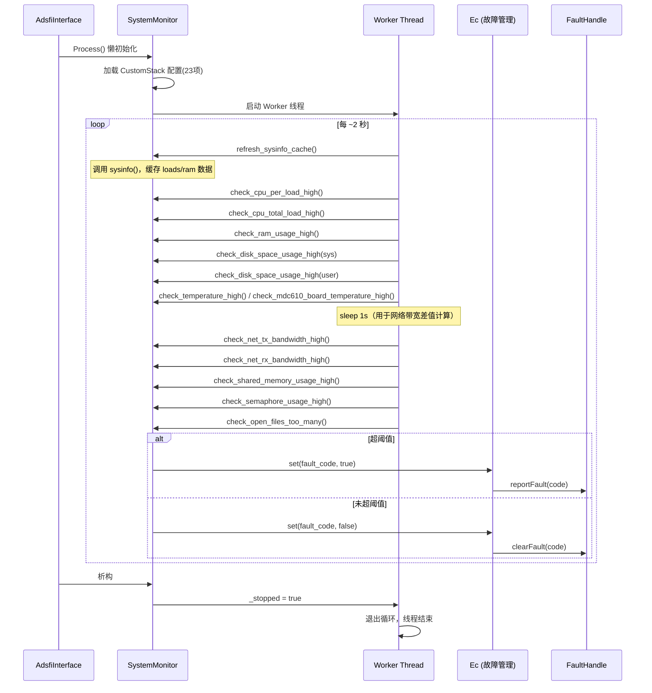
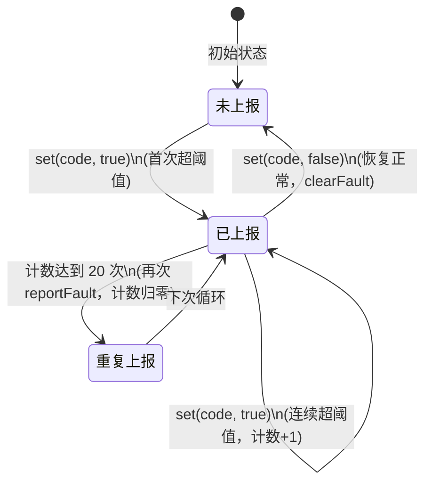
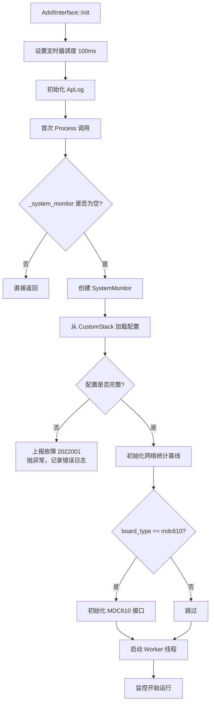

> 本文档为 xsystem_monitor 模块的设计文档，依据统一设计模板编写，随代码一并提交至 Git 仓库。
> 所有设计以文本化描述为主，绘图统一使用 mermaid。

---

# 1. 文档信息

| 项目 | 内容 |
| :--- | :--- |
| **模块名称** | xsystem_monitor |
| **模块编号** | — |
| **所属系统 / 子系统** | ADSFI / 系统监控子系统 |
| **模块类型** | 平台模块 |
| **负责人** | — |
| **参与人** | — |
| **当前状态** | 草稿 |
| **版本号** | V1.0 |
| **创建日期** | 2026-03-03 |
| **最近更新** | 2026-03-03 |

# 2. 模块概述

## 2.1 模块定位

xsystem_monitor 是运行于 ADSFI 框架上的系统资源监控模块，负责周期性地采集本机硬件与操作系统层面的资源使用情况，并在超阈值时向故障管理系统上报故障码、恢复正常时撤销故障码。

- **上游模块（输入来源）**：CustomStack（配置）、Linux 内核（`sysinfo`、`statvfs`、`/proc`、`/sys` 虚拟文件系统）、MDC610 硬件接口（板级温度）
- **下游模块（输出去向）**：FaultHandle（故障上报）、ApLog（日志）
- **对外能力**：无对外服务接口；以 ADSFI 原子服务形式部署，通过 FaultHandle 向系统故障总线输出故障事件

## 2.2 设计目标

- **功能目标**：全面监控 CPU 负载、内存、磁盘、温度、网络带宽、IPC 资源、文件描述符等系统指标，超阈值时自动上报故障，恢复后自动撤销
- **性能目标**：监控周期约 2 秒；温度与网络带宽各有 1 秒内部采样间隔；对宿主业务线程影响可忽略
- **稳定性目标**：Worker 线程捕获所有异常，异常后继续运行；模块初始化失败时打印错误日志，不影响进程其余模块
- **安全目标**：只读访问系统虚拟文件；不修改任何系统状态
- **可维护性 / 可扩展性目标**：监控阈值全部通过 CustomStack 配置，无硬编码阈值；新增监控项只需在 Worker 循环中追加检查函数

## 2.3 设计约束

- 硬件平台：支持通用 Linux（x86/ARM）及 MDC610（华为智能驾驶域控）
- OS：Linux（依赖 `/proc`、`/sys` 虚拟文件系统）
- 中间件：ADSFI 框架（BaseAdsfiInterface、FaultHandle、ApLog、CustomStack）
- 第三方库：pthread、fmt、glog、zmq、yaml-cpp
- MDC610 温度功能依赖 `CUserMdc610FuncInterface::idpGetBoardTemperature()` 接口

# 3. 需求与范围

## 3.1 功能需求（FR）

| 需求ID | 描述 | 优先级 |
| :--- | :--- | :--- |
| FR-01 | 周期性采集 CPU 每核负载并与阈值比较，超阈值上报故障 | 高 |
| FR-02 | 周期性采集 CPU 整体负载并与阈值比较，超阈值上报故障 | 高 |
| FR-03 | 周期性采集内存（RAM）使用率并与阈值比较 | 高 |
| FR-04 | 监控系统盘和用户盘磁盘使用率，超阈值上报故障 | 高 |
| FR-05 | 监控 CPU 温度，支持上下限双阈值 | 高 |
| FR-06 | 监控 GPU 温度，支持上下限双阈值 | 中 |
| FR-07 | 支持 MDC610 专用板级温度监控 | 中 |
| FR-08 | 监控指定网络接口的 TX/RX 带宽（Mbps） | 高 |
| FR-09 | 监控 System V 共享内存使用率 | 中 |
| FR-10 | 监控 System V 信号量使用率 | 中 |
| FR-11 | 监控系统全局文件描述符数量 | 中 |
| FR-12 | 故障恢复时自动撤销已上报的故障码 | 高 |
| FR-13 | 所有监控阈值通过 CustomStack 配置文件加载，支持热配置更新（重启生效） | 高 |

## 3.2 非功能需求（NFR）

| 需求ID | 类型 | 指标 | 目标值 |
| :--- | :--- | :--- | :--- |
| NFR-01 | 性能 | 监控主循环周期 | ~2s |
| NFR-02 | 性能 | 网络带宽采样间隔 | 1s（内嵌于主循环） |
| NFR-03 | 稳定性 | Worker 线程崩溃后行为 | 捕获异常，继续循环，不退出 |
| NFR-04 | 稳定性 | 故障码去重上报 | 同一故障码累计 20 次超阈值后才再次上报 |
| NFR-05 | 资源 | 额外线程数 | 1 个 Worker 线程 |
| NFR-06 | 可观测性 | 关键事件日志 | 配置加载失败、阈值超越、温度异常均有日志 |

## 3.3 范围界定（必须明确）

### 3.3.1 本模块必须实现：

- CPU 负载（单核 + 整体）、RAM、磁盘（系统盘 + 用户盘）、温度（CPU/GPU/MDC610板级）、网络带宽（TX+RX）、IPC（共享内存+信号量）、文件描述符的阈值检测与故障上报/撤销
- 基于 CustomStack 的参数化配置加载
- Worker 后台线程的生命周期管理（启动与优雅退出）

### 3.3.2 本模块明确不做：

> （防止范围膨胀）

- 进程级别的 CPU/内存监控（仅做系统全局）
- 历史数据存储与趋势分析
- 主动告警推送（短信/邮件等），只通过 FaultHandle 上报
- 网络可达性检测（ping 等，配置中有 `ping_ip` 字段但当前未实现）
- 动态阈值调整（运行时不支持重新加载配置）

## 3.4 需求-设计-验证映射（评审必查）

| 需求ID | 对应设计章节 | 对应接口/函数 | 验证方式 / 用例 |
| :--- | :--- | :--- | :--- |
| FR-01 | 5.3 | `check_cpu_per_load_high()` | TC-01 |
| FR-02 | 5.3 | `check_cpu_total_load_high()` | TC-02 |
| FR-03 | 5.3 | `check_ram_usage_high()` | TC-03 |
| FR-04 | 5.3 | `check_disk_space_usage_high()` | TC-04 |
| FR-05/06 | 5.3 | `check_temperature_high()` | TC-05 |
| FR-07 | 5.3 | `check_mdc610_board_temperature_high()` | TC-06 |
| FR-08 | 5.3 | `check_net_tx/rx_bandwidth_high()` | TC-07 |
| FR-09/10 | 5.3 | `check_shared_memory/semaphore_usage_high()` | TC-08 |
| FR-11 | 5.3 | `check_open_files_too_many()` | TC-09 |
| FR-12 | 5.3 | `Ec::set()` 恢复路径 | TC-10 |
| FR-13 | 5.1 | SystemMonitor 构造函数 | TC-11 |

# 4. 设计思路

## 4.1 方案概览

xsystem_monitor 采用"**单线程轮询 + 阈值比较 + 故障码上报**"的直观设计：

1. ADSFI Process() 函数在首次调用时懒初始化 SystemMonitor 实例
2. SystemMonitor 构造函数从 CustomStack 加载所有配置，完成校验后启动 Worker 线程
3. Worker 线程每 2 秒依次执行所有检查函数，通过统一的 `Ec` 辅助类管理故障码生命周期
4. 检查函数从内核虚拟文件系统或专用接口读取最新数据，与配置阈值比较，决定上报或撤销故障

## 4.2 关键决策与权衡

| 决策点 | 选择 | 理由 |
| :--- | :--- | :--- |
| 网络统计来源 | `/proc/net/dev`（ProcNetDevStats）为主，NetlinkIfStats 备用 | procfs 更稳定、兼容性好，无需 root 权限打开 netlink socket |
| 故障去重策略 | `Ec` 类记录上次上报状态，20 次后允许重复上报 | 防止短期抖动导致故障风暴；20 次 × 2s ≈ 40s 一次重复上报 |
| 配置全量加载 | 构造函数一次性加载所有 23 个参数 | 配置读取失败时快速失败，避免运行时部分配置缺失 |
| MDC610 温度 | 独立函数 + board_type 条件分支 | 与通用 thermal_zone 路径解耦，便于维护 |

## 4.3 与现有系统的适配

- 遵循 ADSFI 原子服务规范：继承 BaseAdsfiInterface，实现 Init() 和 Process()
- 通过 FaultHandle 统一故障总线上报，不自行实现上报通道
- 配置命名空间统一使用 `resource/monitor/` 前缀，与其他模块隔离

## 4.4 失败模式与降级

| 失败场景 | 处理方式 |
| :--- | :--- |
| CustomStack 配置读取失败 | 上报 2022001，构造函数抛异常，模块不启动 |
| Worker 线程单次迭代抛异常 | `catch(...)` 捕获，打印日志，继续下次循环 |
| `/proc/net/dev` 读取失败 | 返回空 stats，带宽检查跳过（不误报） |
| MDC610 温度 JSON 解析失败 | 打印错误日志，跳过本次温度检查 |
| `statvfs` 磁盘查询失败 | 磁盘使用率视为 0，不上报故障 |

# 5. 架构与技术方案

## 5.1 模块内部架构

```mermaid
graph TB
    subgraph ADSFI框架
        AF[AdsfiInterface<br/>Init / Process]
    end

    subgraph xsystem_monitor
        SM[SystemMonitor<br/>构造函数：加载配置<br/>启动Worker线程]
        WT[Worker Thread<br/>~2s 周期]
        EC[Ec 故障码管理器<br/>去重 / 上报 / 撤销]

        subgraph 数据采集层
            SI[sysinfo<br/>CPU负载 / RAM]
            SF[statvfs<br/>磁盘空间]
            TZ[/sys/class/thermal<br/>CPU/GPU温度]
            PND[ProcNetDevStats<br/>/proc/net/dev]
            NLS[NetlinkIfStats<br/>netlink socket 备用]
            IPC[IPCStats<br/>/proc/sysvipc]
            FNR[/proc/sys/fs/file-nr<br/>文件描述符]
            MDC[MDC610 BoardTemp<br/>idpGetBoardTemperature]
        end

        subgraph 检查函数层
            C1[check_cpu_per_load_high]
            C2[check_cpu_total_load_high]
            C3[check_ram_usage_high]
            C4[check_disk_space_usage_high]
            C5[check_temperature_high]
            C6[check_mdc610_board_temperature_high]
            C7[check_net_tx/rx_bandwidth_high]
            C8[check_shared_memory_usage_high]
            C9[check_semaphore_usage_high]
            C10[check_open_files_too_many]
        end
    end

    subgraph 外部系统
        CS[CustomStack<br/>配置源]
        FH[FaultHandle<br/>故障总线]
        LOG[ApLog<br/>日志]
    end

    AF -->|首次Process懒初始化| SM
    SM -->|加载配置| CS
    SM -->|启动| WT
    WT --> C1 & C2 & C3 & C4 & C5 & C6 & C7 & C8 & C9 & C10
    C1 & C2 --> SI
    C3 --> SI
    C4 --> SF
    C5 --> TZ
    C6 --> MDC
    C7 --> PND
    PND -.备用.-> NLS
    C8 & C9 --> IPC
    C10 --> FNR
    C1 & C2 & C3 & C4 & C5 & C6 & C7 & C8 & C9 & C10 --> EC
    EC -->|reportFault / clearFault| FH
    EC -->|异常日志| LOG
```

**线程模型：**
- **主线程（ADSFI调度线程）**：执行 Init()、Process()，懒初始化 SystemMonitor
- **Worker 线程**：独立后台线程，每 2 秒运行一轮完整检查，析构时通过 atomic `_stopped` 标志优雅退出

## 5.2 关键技术选型

| 技术点 | 方案 | 选择原因 | 备选方案 |
| :--- | :--- | :--- | :--- |
| CPU/RAM 采集 | `sysinfo()` 系统调用 | 标准 POSIX 接口，无文件 IO 开销 | `/proc/stat` 解析 |
| 磁盘采集 | `statvfs()` 系统调用 | 标准 POSIX 接口 | `df` 命令解析 |
| 网络统计 | `/proc/net/dev` | 无需特殊权限，格式稳定 | netlink socket（已实现为备用） |
| IPC 统计 | `/proc/sysvipc/` | 直接读取内核导出数据 | `ipcs` 命令解析 |
| 故障去重 | `Ec` 内部 `std::map` + 计数器 | 简单高效，满足需求 | 滑动窗口统计 |
| 线程同步 | `std::atomic<bool>` 停止标志 | Worker 只需单向通知，无需复杂同步 | condition_variable |

## 5.3 核心流程

### 主监控循环



### 网络带宽计算流程


### 故障码生命周期（Ec 类）



### 启动流程



# 6. 界面设计

> 本模块为纯后端监控服务，无用户界面，跳过此节。

# 7. 接口设计（评审重点）

## 7.1 对外接口

| 接口名 | 类型 | 输入 | 输出 | 频率 | 备注 |
| :--- | :--- | :--- | :--- | :--- | :--- |
| FaultHandle::reportFault | 内部API | fault_code (uint32) | 无 | 按需（超阈值时） | 向故障总线发布故障 |
| FaultHandle::clearFault | 内部API | fault_code (uint32) | 无 | 按需（恢复时） | 撤销故障 |
| AdsfiInterface::Init | ADSFI框架 | 无 | ErrorCode | 启动时一次 | 初始化调度与日志 |
| AdsfiInterface::Process | ADSFI框架 | 无 | 无 | 100ms | 懒初始化 SystemMonitor |

## 7.2 对内接口

| 接口 | 调用方 | 被调用方 | 说明 |
| :--- | :--- | :--- | :--- |
| `ProcNetDevStats::getStats(ifname)` | SystemMonitor | ProcNetDevStats | 读取 /proc/net/dev 网络统计 |
| `IPCStats::getUsage()` | SystemMonitor | IPCStats | 读取 IPC 资源使用量 |
| `NetlinkIfStats::getStats(ifname)` | SystemMonitor（备用） | NetlinkIfStats | 通过 netlink 读取网络统计 |
| `idpGetBoardTemperature()` | SystemMonitor | MDC610 接口 | 获取板级温度 JSON |

## 7.3 接口稳定性声明

- **稳定接口**：FaultHandle 故障码（2021001–2021013，2022001–2022002），变更必须评审
- **非稳定接口**：内部检查函数签名，允许调整

## 7.4 接口行为契约（必须填写）

**AdsfiInterface::Process()**
- 前置条件：Init() 已调用
- 后置条件：SystemMonitor 已实例化（或已记录错误）
- 阻塞：否（懒初始化后立即返回）
- 可重入：否（单线程 ADSFI 调度）
- 最大执行时间：< 1ms（懒初始化完成后）
- 失败语义：构造 SystemMonitor 失败时记录错误日志，不抛异常给框架

**SystemMonitor Worker Thread 检查函数（通用契约）**
- 前置条件：配置已加载，内核虚拟文件系统可访问
- 后置条件：`Ec::set()` 已被调用（上报或撤销故障）
- 阻塞：网络带宽检查含 1s sleep
- 失败语义：读取失败时打印日志，不触发故障上报（不误报原则）

# 8. 数据设计

## 8.1 数据结构

**IPCUsage（IPCStats.hpp）**
```cpp
struct IPCUsage {
    size_t shm_used;   // 已分配共享内存段数
    size_t shm_limit;  // 系统允许最大共享内存段数 (shmmni)
    size_t sem_used;   // 已使用信号量集数
    size_t sem_limit;  // 系统允许最大信号量集数
    size_t msg_used;   // 已使用消息队列数
    size_t msg_limit;  // 系统允许最大消息队列数 (msgmni)
};
```

**rtnl_link_stats64（内核结构，网络统计）**

| 字段 | 含义 |
| :--- | :--- |
| rx_bytes | 接收字节总数 |
| tx_bytes | 发送字节总数 |
| rx_packets | 接收包总数 |
| tx_packets | 发送包总数 |
| rx_errors / tx_errors | 收发错误数 |
| rx_dropped / tx_dropped | 收发丢包数 |

**sysinfo（内核结构，CPU/RAM）**

| 字段 | 含义 |
| :--- | :--- |
| loads[0/1/2] | 1/5/15min 负载（需除以 65536.0） |
| totalram | 总物理内存（字节）|
| freeram | 空闲物理内存（字节）|
| mem_unit | 内存单元大小（字节）|

## 8.2 状态机（Ec 故障码管理）


**状态说明：**
- `Normal`：`ec_map_[code] = false`，故障未激活
- `Fault`：`ec_map_[code] = true`，故障已激活，`report_count_map_[code]` 记录连续次数

## 8.3 数据生命周期

- **sysinfo 缓存**：每轮循环开始时刷新，生命周期为单次循环
- **网络统计基线**：构造时初始化，每次带宽计算后更新为当前值
- **Ec 状态**：随 SystemMonitor 实例生命周期存在，进程退出时销毁
- **配置参数**：构造时加载，运行期间只读，不持久化

# 9. 异常与边界处理（评审必查）

| 异常场景 | 检测方式 | 处理策略 | 是否可恢复 | 上报方式 |
| :--- | :--- | :--- | :--- | :--- |
| CustomStack 配置项缺失 | 读取返回错误码 | 上报 2022001，构造函数抛异常 | 否（需修复配置重启） | ERROR 日志 + FaultHandle |
| sysinfo() 调用失败 | 返回值 < 0 | 跳过本次检查，不上报 | 是（下次重试） | WARN 日志 |
| /proc/net/dev 读取失败 | 文件打开失败 | 返回空 stats，带宽检查跳过 | 是 | WARN 日志 |
| statvfs 磁盘查询失败 | 返回值 < 0 | 使用率视为 0 | 是 | WARN 日志 |
| /sys/class/thermal 不存在 | 文件打开失败 | 跳过温度检查 | 是 | WARN 日志 |
| MDC610 温度 JSON 解析失败 | JSON 字段缺失 | 跳过，打印错误 | 是 | ERROR 日志 |
| Worker 线程意外异常 | catch(...) | 继续下次循环 | 是 | ERROR 日志 |
| IPC 统计文件不存在 | 文件打开失败 | used = 0，不上报 | 是 | WARN 日志 |
| 温度值 ≤ 0 或格式异常 | 读取后校验 | 跳过本次检查 | 是 | WARN 日志 |

# 10. 性能与资源预算（必须可验收）

## 10.1 性能指标

| 场景 | 指标 | 目标值 | 测试方法 |
| :--- | :--- | :--- | :--- |
| 主循环执行时间 | 单次迭代耗时（含1s sleep） | < 1.5s（不含sleep） | 打点计时 |
| 配置加载时间 | 构造函数耗时 | < 100ms | 构造前后计时 |
| 单次检查耗时 | check_* 函数耗时 | < 10ms/次 | 打点计时 |
| FaultHandle 上报延迟 | 超阈值到故障总线可见 | < 5s（最坏2个周期） | 故障注入测试 |

## 10.2 资源预算

| 资源 | 常态 | 峰值 | 上限约束 |
| :--- | :--- | :--- | :--- |
| CPU | < 0.5% | < 2% | — |
| 内存（堆） | < 1MB | < 2MB | — |
| 线程数 | 1（Worker） | 1 | — |
| 文件描述符 | 3～5（/proc 读取） | 10 | — |
| 磁盘写入 | 0 | 0 | 只读访问 |

# 11. 构建与部署

## 11.1 环境依赖

| 依赖项 | 版本要求 | 说明 |
| :--- | :--- | :--- |
| 操作系统 | Linux (kernel ≥ 3.10) | 依赖 /proc/sysvipc、/sys/class/thermal |
| C++ 标准 | C++14+ | 使用 std::atomic、std::thread 等 |
| pthread | 系统自带 | 线程支持 |
| fmt | — | 格式化字符串 |
| glog | — | 日志库 |
| zmq | — | ZeroMQ（ADSFI 框架依赖） |
| yaml-cpp | — | YAML 配置解析 |
| ADSFI 框架 | 项目内 | BaseAdsfiInterface、FaultHandle、CustomStack |

## 11.2 构建步骤

### 构建命令

由 [model.cmake](../model.cmake) 定义：

```cmake
# 源文件
adsfi_interface/adsfi_interface.cpp
src/SystemMonitor.cpp

# 包含目录
adsfi_interface/  src/  项目根目录

# 链接库
pthread  dl  fmt  glog  zmq  yaml-cpp
```

通过上层 CMake 统一构建，无需单独构建步骤。

### 构建产物

- 静态库或动态库，集成至 ADSFI 原子服务可执行文件

## 11.3 配置项

所有配置项通过 CustomStack 加载，命名空间前缀：`resource/monitor/`

| 配置项 | 说明 | 默认值 | 是否必须 |
| :--- | :--- | :--- | :--- |
| `resource/monitor/board_type` | 硬件板型（mdc610或其他） | — | 是 |
| `resource/monitor/ping_ip` | 网络连通性检测IP（预留） | — | 是 |
| `resource/monitor/threshold_cpu_per_load` | 单核CPU负载阈值（0~1） | — | 是 |
| `resource/monitor/threshold_cpu_total_load` | CPU整体负载阈值（0~1） | — | 是 |
| `resource/monitor/threshold_usage_ram` | RAM使用率阈值（0~1） | — | 是 |
| `resource/monitor/check_disk_sys_path` | 系统盘挂载路径 | — | 是 |
| `resource/monitor/threshold_usage_disk_sys` | 系统盘使用率阈值（0~1） | — | 是 |
| `resource/monitor/check_disk_user_path` | 用户盘挂载路径 | — | 是 |
| `resource/monitor/threshold_usage_disk_user` | 用户盘使用率阈值（0~1） | — | 是 |
| `resource/monitor/threshold_cpu_temp_upper` | CPU温度上限（℃） | — | 是 |
| `resource/monitor/threshold_cpu_temp_lower` | CPU温度下限（℃） | — | 是 |
| `resource/monitor/threshold_gpu_temp_upper` | GPU温度上限（℃） | — | 是 |
| `resource/monitor/threshold_gpu_temp_lower` | GPU温度下限（℃） | — | 是 |
| `resource/monitor/threshold_board_temp_upper` | 板级温度上限（℃，MDC610） | — | 是 |
| `resource/monitor/threshold_board_temp_lower` | 板级温度下限（℃，MDC610） | — | 是 |
| `resource/monitor/ifname` | 监控的网络接口名（如 eth0） | — | 是 |
| `resource/monitor/threshold_tx_bandwidth` | TX带宽阈值（Mbps） | — | 是 |
| `resource/monitor/threshold_rx_bandwidth` | RX带宽阈值（Mbps） | — | 是 |
| `resource/monitor/threshold_usage_shm` | 共享内存使用率阈值（0~1） | — | 是 |
| `resource/monitor/threshold_usage_sem` | 信号量使用率阈值（0~1） | — | 是 |

> 所有配置项均为必填，缺失任一项将导致模块启动失败并上报故障码 2022001。

## 11.4 部署结构与启动

### 部署目录结构

```text
/
├── proc/
│   ├── net/dev                    # 网络统计（只读）
│   ├── sysvipc/{shm,sem,msg}      # IPC 统计（只读）
│   └── sys/
│       ├── fs/file-nr             # 文件描述符统计
│       └── kernel/{shmmni,sem,msgmni}  # IPC 限制参数
└── sys/
    └── class/thermal/thermal_zoneX/temp  # CPU/GPU 温度
```

### 启动 / 停止

- **启动**：由 ADSFI 框架统一启动，无需手动操作
- **停止**：SystemMonitor 析构时设置 `_stopped = true`，Worker 线程在下次循环开始前退出

## 11.5 健康检查与启动验证

- 启动成功标志：日志出现 `"XSystemMonitor process success"`
- 启动失败标志：日志出现 `"XSystemMonitor process failed"` 或故障总线出现 2022001/2022002
- 启动超时：无明确超时，Worker 线程启动后即认为成功

## 11.6 升级与回滚

- 升级无需停服（原子服务热替换由 ADSFI 框架管理）
- 配置变更需重启模块生效
- 故障码定义变更需同步更新故障管理系统映射表

# 12. 可测试性与验证

## 12.1 单元测试

- **覆盖范围**：各 check_* 函数的阈值边界（恰好等于阈值、略超阈值、未达阈值）
- **Mock 策略**：
  - 通过依赖注入或条件编译替换 `sysinfo()`、`statvfs()`、`/proc` 文件读取
  - ProcNetDevStats / IPCStats 可通过构造测试用临时文件进行注入
  - MDC610 接口通过 Mock 对象替换

## 12.2 集成测试

- 在真实硬件或仿真环境中验证：
  - CPU 压力测试下故障码 2021001/2021002 的上报与撤销
  - 磁盘填充测试下故障码 2021004/2021005 的触发
  - 温度模拟（修改 thermal_zone 文件）验证温度故障码

## 12.3 可观测性

- **日志**：
  - 构造成功/失败：`INFO/ERROR` 级别
  - 每次故障上报/撤销：可通过 glog 查看
  - 配置加载：每个参数读取失败时 `ERROR` 日志
- **监控指标**：故障总线上的故障码即为主要监控指标
- **Debug 接口**：`IPCStats::printUsage()` 可在调试时打印 IPC 使用情况

# 13. 测试用例清单

| ID | 对应需求 | 测试项目 | 测试步骤 | 预期结果 | 测试结果 |
| :--- | :--- | :--- | :--- | :--- | :--- |
| TC-01 | FR-01 | CPU单核高负载告警 | 使某核CPU达到阈值以上 | 上报 2021001 | — |
| TC-02 | FR-02 | CPU整体高负载告警 | 整体负载超过阈值 | 上报 2021002 | — |
| TC-03 | FR-03 | RAM高使用率告警 | 填充内存至阈值以上 | 上报 2021003 | — |
| TC-04 | FR-04 | 磁盘高使用率告警 | 填充磁盘至阈值以上 | 上报 2021004/2021005 | — |
| TC-05 | FR-05/06 | CPU/GPU温度告警 | Mock thermal_zone 返回超阈值温度 | 上报 2021006/2021007 | — |
| TC-06 | FR-07 | MDC610板级温度告警 | Mock idpGetBoardTemperature 返回超阈值 | 上报 2021008 | — |
| TC-07 | FR-08 | 网络带宽超限告警 | 产生超过阈值的 TX/RX 流量 | 上报 2021009/2021010 | — |
| TC-08 | FR-09/10 | IPC资源超限告警 | 创建大量共享内存/信号量 | 上报 2021011/2021012 | — |
| TC-09 | FR-11 | 文件描述符超限告警 | 打开大量文件描述符 | 上报 2021013 | — |
| TC-10 | FR-12 | 故障自动撤销 | 超阈值后恢复正常 | clearFault 被调用 | — |
| TC-11 | FR-13 | 配置加载失败处理 | 删除必填配置项 | 上报 2022001，模块不启动 | — |
| TC-12 | NFR-04 | 故障去重机制 | 持续超阈值，统计上报次数 | 约每 40s 重复上报一次 | — |
| TC-13 | NFR-03 | Worker 线程异常恢复 | Mock 某检查函数抛异常 | 异常被捕获，下次循环继续 | — |

# 14. 风险分析（设计评审核心）

| 风险 | 影响 | 可能性 | 应对措施 |
| :--- | :--- | :--- | :--- |
| `/proc` 虚拟文件系统访问受限（容器化部署） | 部分监控指标失效 | 中 | 部署时确保容器挂载 /proc；添加读取失败告警 |
| MDC610 接口不可用导致温度监控失效 | 无法检测硬件过温 | 低 | board_type 非 mdc610 时自动走 thermal_zone 路径 |
| 配置阈值设置不当（过高/过低） | 漏报或误报故障 | 中 | 提供默认配置参考值；文档化各指标建议阈值 |
| Worker 线程死锁 | 监控失效，不上报故障 | 低 | 当前实现无复杂锁，atomic 停止标志足够安全 |
| 带宽计算依赖 1s sleep，影响循环周期 | 实际循环周期 > 2s | 低（可接受） | 当前设计已知此行为，无需修复 |
| 故障码 20 次去重导致告警延迟 | 同一故障 40s 内只告警一次 | 低 | 首次超阈值立即上报；20次窗口仅限重复上报 |

# 15. 设计评审

## 15.1 评审 Checklist

- [ ] 需求是否完整覆盖（FR-01 到 FR-13）
- [ ] 接口是否清晰稳定（故障码定义 2021001–2021013）
- [ ] 界面设计是否完整（本模块无 UI，已跳过）
- [ ] 异常路径是否完整（第9节已覆盖所有已知异常）
- [ ] 性能 / 资源是否有上限（第10节已定义）
- [ ] 构建与部署步骤是否完整可执行
- [ ] 是否存在过度设计
- [ ] 测试用例是否覆盖所有功能需求和非功能需求

## 15.2 评审记录

| 日期 | 评审人 | 问题 | 结论 | 备注 |
| :--- | :--- | :--- | :--- | :--- |
| | | | | |

# 16. 变更管理（重点）

## 16.1 变更原则

- 不允许口头变更
- 接口 / 行为变更必须记录

## 16.2 变更分级

| 级别 | 示例 | 是否需要评审 |
| :--- | :--- | :--- |
| L1 | 注释 / 日志调整 | 否 |
| L2 | 增加新监控指标、调整去重计数阈值 | 是 |
| L3 | 故障码变更、配置项增删、监控周期变更 | 是（系统级） |

## 16.3 变更记录

| 版本 | 变更内容 | 影响分析 | 评审人 |
| :--- | :--- | :--- | :--- |
| V1.0 | 初始设计 | — | — |

# 17. 交付与冻结

## 17.1 设计冻结条件

- [ ] 接口设计已评审通过（故障码、配置项）
- [ ] 所有接口有对应测试用例
- [ ] 所有 NFR 有验证方案
- [ ] 异常路径已覆盖（第9节）
- [ ] 变更影响分析完成

## 17.2 设计与交付物映射

- 设计文档 ↔ `src/SystemMonitor.hpp`、`src/SystemMonitor.cpp`
- 接口文档 ↔ `adsfi_interface/adsfi_interface.h`
- 故障码定义 ↔ 故障管理系统配置表

# 18. 附录

## 18.1 故障码定义

| 故障码 | 含义 | 触发条件 |
| :--- | :--- | :--- |
| 2021001 | CPU 单核负载过高 | 任意一核负载 > threshold_cpu_per_load |
| 2021002 | CPU 整体负载过高 | 整体负载 > threshold_cpu_total_load |
| 2021003 | RAM 使用率过高 | RAM 使用率 > threshold_usage_ram |
| 2021004 | 系统盘使用率过高 | 系统盘使用率 > threshold_usage_disk_sys |
| 2021005 | 用户盘使用率过高 | 用户盘使用率 > threshold_usage_disk_user |
| 2021006 | CPU 温度异常 | CPU 温度超出 [lower, upper] 范围 |
| 2021007 | GPU 温度异常 | GPU 温度超出 [lower, upper] 范围 |
| 2021008 | 板级温度异常（MDC610） | 板级温度超出 [lower, upper] 范围 |
| 2021009 | 网络 TX 带宽过高 | TX 带宽 > threshold_tx_bandwidth (Mbps) |
| 2021010 | 网络 RX 带宽过高 | RX 带宽 > threshold_rx_bandwidth (Mbps) |
| 2021011 | 共享内存使用率过高 | shm_used/shm_limit > threshold_usage_shm |
| 2021012 | 信号量使用率过高 | sem_used/sem_limit > threshold_usage_sem |
| 2021013 | 文件描述符数量过多 | file-nr[0] > 配置阈值 |
| 2022001 | 配置读取失败 | CustomStack 读取任意参数失败 |
| 2022002 | 连接失败（预留） | — |

## 18.2 术语表

| 术语 | 说明 |
| :--- | :--- |
| ADSFI | Autonomous Driving Software Framework Interface，自动驾驶软件框架接口 |
| CustomStack | ADSFI 框架提供的配置管理服务 |
| FaultHandle | ADSFI 框架提供的故障上报服务 |
| MDC610 | 华为智能驾驶域控制器型号 |
| sysinfo | Linux 系统调用，获取系统全局负载、内存等信息 |
| statvfs | POSIX 系统调用，获取文件系统使用情况 |
| thermal_zone | Linux 内核温度监控抽象，路径 /sys/class/thermal/thermal_zoneX/temp |
| IPC | Inter-Process Communication，进程间通信（共享内存、信号量、消息队列） |
| Ec | Error Code 辅助类，管理故障码的上报状态与去重计数 |

## 18.3 参考文档

- ADSFI 框架开发规范
- `design_template.md`（文档模板）
- Linux man pages: `sysinfo(2)`, `statvfs(2)`
- `/proc` 文件系统文档：`Documentation/filesystems/proc.rst`
