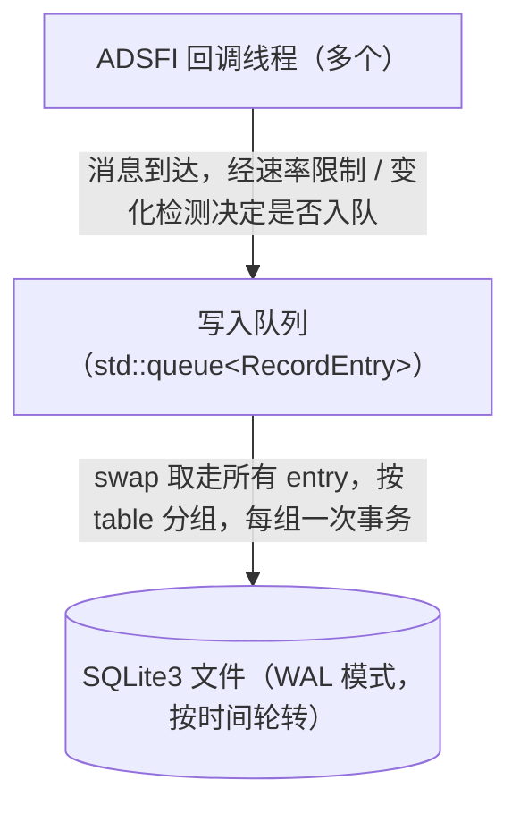
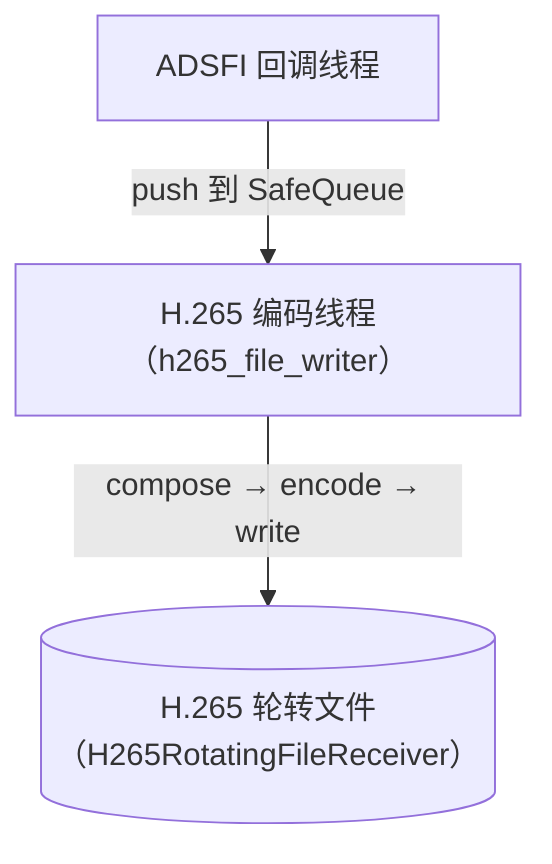
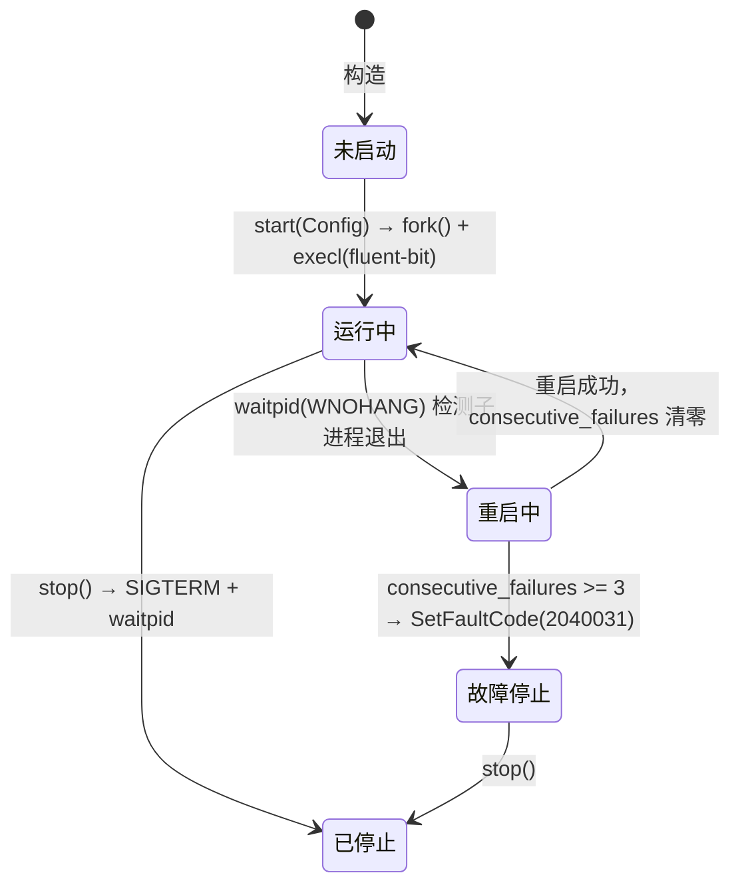
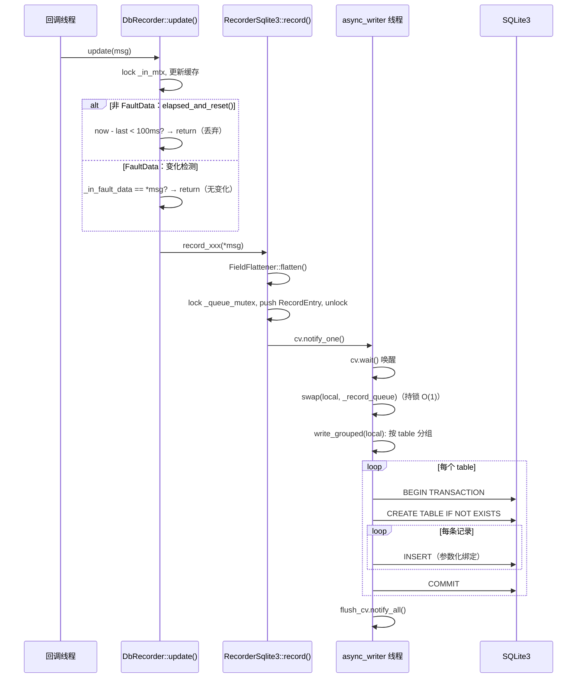
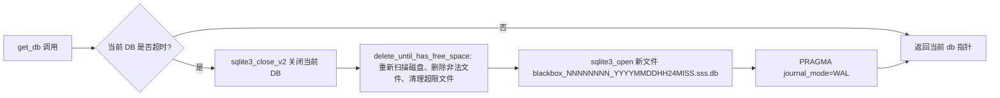
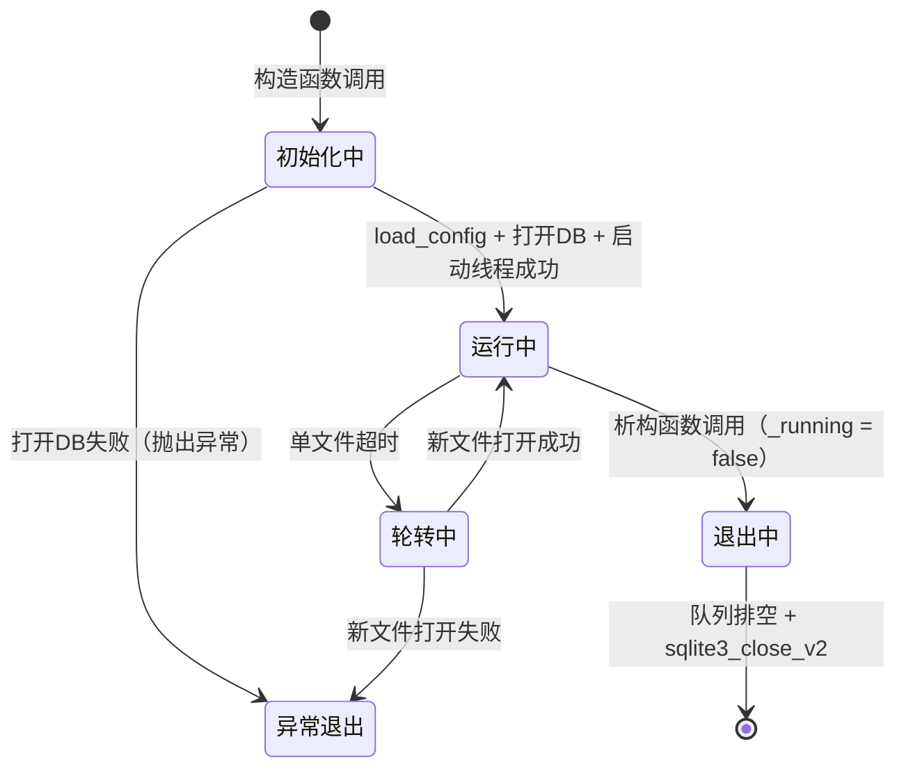

# xvehicle_status_recorder 设计文档

---

# 1. 文档信息

| 项目 | 内容 |
| :--- | :--- |
| **模块名称** | xvehicle_status_recorder |
| **模块编号** | — |
| **所属系统 / 子系统** | 自动驾驶平台 / 数据记录子系统 |
| **模块类型** | 平台模块 |
| **负责人** | — |
| **参与人** | — |
| **当前状态** | 草稿 |
| **版本号** | V0.9 |
| **创建日期** | 2026-02-26 |
| **最近更新** | 2026-03-09 |

---

# 2. 模块概述

## 2.1 模块定位

**职责**：订阅车辆运行状态相关 ADSFI Topic，将结构化状态数据持久化写入 SQLite3 数据库，同时将多路摄像头图像编码为 H.265 视频文件；两类存储均支持基于时间的文件轮转和磁盘配额管理，供事后回溯和故障分析使用。

**上游模块（输入来源）**：

| Topic / 数据 | 类型 | 发布源 |
| :--- | :--- | :--- |
| VehicleInformation | `ara::adsfi::VehicleInformation` | 车辆底盘模块 |
| MsgHafLocation | `ara::adsfi::MsgHafLocation` | 定位模块 |
| FaultData | `ara::adsfi::FaultData` | 故障管理模块 |
| MsgHafGnssInfo | `ara::adsfi::MsgHafGnssInfo` | GNSS 模块 |
| VehicleActControl | `ara::adsfi::VehicleActControl` | 车辆控制模块 |
| BusinessCommand | `ara::adsfi::BusinessCommand` | 业务指令模块 |
| MsgHafEgoTrajectory | `ara::adsfi::MsgHafEgoTrajectory` | 规划模块 |
| PlanningStatus | `ara::adsfi::PlanningStatus` | 规划模块 |
| AppRemoteControl | `ara::adsfi::AppRemoteControl` | 远程控制模块 |
| MsgImageDataList | `ara::adsfi::MsgImageDataList` | 摄像头模块 |

**下游模块（输出去向）**：文件系统（`.db` 文件、`.h265` 文件），供离线分析工具、故障回放工具消费；本模块不向其它运行时模块提供接口。

**对外能力**：不对外提供 SDK / Service / API。

## 2.2 设计目标

- **功能目标**：完整记录车辆运行状态数据，支持故障事后回溯；记录多路摄像头 H.265 视频，与状态数据时间戳对齐。
- **性能目标**：消息回调路径延迟 < 1 ms（仅做速率判断 + 无锁队列入队）；磁盘写入通过异步线程与回调解耦；视频编码耗时需在采样周期内完成（目标 < 采样间隔 / 0.9）。
- **稳定性目标**：数据库写入失败时记录错误日志并继续运行，不影响主流程；模块退出时排空写入队列，确保数据完整性；磁盘超配额时自动删除最旧文件，不抛出异常终止进程。
- **安全目标**：所有 SQL 标识符使用转义函数防止 SQL 注入；绑定参数化查询处理字段值；不存储任何明文密钥或凭据。
- **可维护性 / 可扩展性**：通过模板 + `enumerate_internal` 反射机制自动展平结构体字段，无需为每个消息类型手写列定义；新增消息类型只需在 `RecorderSqlite3` 中增加一个 `record_xxx()` 转发函数。

## 2.3 设计约束

- **硬件平台**：华为 MDC（自动驾驶计算平台），ARM 架构，Linux 系统。
- **中间件 / 框架依赖**：avos 框架（`BaseAdsfiInterface`、`CustomStack` 配置、`log`）；SQLite3 嵌入式数据库；MDC DVPP 硬件加速（H.265 编码）；OpenCV（图像合成）；fmt（日志格式化）。
- **法规 / 标准**：本模块为平台非安全相关模块，不直接承担功能安全（FuSa）职责；遵循项目 C++ 编码规范（C++17）。
- **兼容性约束**：依赖 `ara::adsfi` 生成代码中的 `enumerate_internal` 接口进行字段反射，升级生成代码时需回归测试字段映射。

---

# 3. 需求与范围

## 3.1 功能需求（FR）

| 需求ID | 描述 | 优先级 |
| :--- | :--- | :--- |
| FR-01 | 订阅 9 类车辆状态 Topic，将数据写入 SQLite3 数据库，每类 Topic 对应一张表 | P0 |
| FR-02 | 订阅摄像头图像 Topic，将多路图像拼合后编码为 H.265 视频文件 | P0 |
| FR-03 | SQLite3 数据库文件按时间轮转，单文件持续时长可配置 | P0 |
| FR-04 | 磁盘总配额可配置，超过清理阈值时自动删除最旧数据库文件 | P0 |
| FR-05 | 对高频状态数据（除 FaultData 外）统一降频至 ≤ 10 Hz（100ms 丢弃策略），降低 CPU 占用 | P1 |
| FR-06 | FaultData 采用变化检测策略：内容有变化时立即记录，不受降频限制 | P1 |
| FR-07 | `MsgHafTime` 类型字段在写库时通过 `FieldFlattener` 递归展开为 `_sec`（uint32 十进制字符串）和 `_nsec`（uint32 十进制字符串）两列（`MsgHafTime` 具有 `enumerate_internal`，`has_enumerate_internal<MsgHafTime>::value == true`，走递归分支，`format_msghaftime()` 为死代码不被调用） | P1 |
| FR-08 | `FaultInfoVec` 字段序列化为 JSON 数组字符串后存储 | P1 |
| FR-09 | 其余数组 / 向量类型字段写库时忽略（不写入列） | P2 |
| FR-10 | 模块启动时从 `CustomStack` 加载配置（存储路径、文件时长、配额等），配置缺失时使用默认值并记录警告 | P1 |
| FR-11 | 模块重启时，若最后一个新格式 DB 文件仍在有效期内（`创建时间 + 轮转时长 > 当前时间`），则复用该文件继续写入，而非新建文件 | P1 |
| FR-12 | 启动时及每次文件轮转时扫描存储目录，删除所有不符合命名规范的条目：包括命名不合规的普通文件、非普通文件（目录等）、以及父 `.db` 文件不在追踪列表中的孤儿 `.db-wal`/`.db-shm` 文件；仅保留已追踪 `.db` 文件对应的辅助文件 | P1 |
| FR-13 | 配额设置 < 10 MB 时启动阶段输出 AERROR；清理历史文件时若将所有历史文件全部删除（说明单文件大小已超配额），输出 AERROR 告警 | P1 |
| FR-14 | 删除历史 `.db` 文件时，同步删除对应的 `.db-wal` / `.db-shm` 孤儿文件（突然下电残留）；枚举配额时将残留 WAL 文件大小计入该 `.db` 文件的大小 | P1 |
| FR-15 | 将 Fluent Bit（OTel Collector）作为子进程启动并持续监控存活状态；子进程意外退出时自动重启；连续失败 3 次后上报故障码 2040031 并停止重试，等待人工干预 | P1 |
| FR-16 | 定期清理 Fluent Bit 导出的追踪数据文件（本地 JSON），按文件存活时长和总占用空间执行配额管理，防止追踪数据积压耗尽磁盘 | P2 |

## 3.2 非功能需求（NFR）

| 需求ID | 类型 | 指标 | 目标值 |
| :--- | :--- | :--- | :--- |
| NFR-01 | 性能 | 消息回调（rate-limit 判断 + 入队）延迟 | < 1 ms（p99） |
| NFR-02 | 性能 | 异步写入线程单次 `write_grouped` 耗时 | < 50 ms |
| NFR-03 | 性能 | CPU 占用（稳态，所有 Topic 同时工作） | < 5%（单核等效） |
| NFR-04 | 可靠性 | 模块异常退出时未持久化的数据丢失量 | ≤ 1 个写入周期（约 100ms）的数据 |
| NFR-05 | 存储 | 单次 DB 文件最大磁盘用量 | 由配额参数控制，默认 1 GB 总量上限 |
| NFR-06 | 安全 | SQL 注入防护 | 所有标识符走 `escape_identifier`，所有值走参数化绑定 |
| NFR-07 | 可维护性 | 新增一类消息类型的改动行数 | ≤ 5 行（仅加 `record_xxx()` 转发函数） |

## 3.3 范围界定

### 3.3.1 本模块必须实现

- 上述 10 类 Topic 的订阅与数据持久化（结构化 DB + H.265 视频）。
- SQLite3 文件轮转与磁盘配额清理。
- 异步写入队列（消息回调与磁盘 I/O 解耦）。
- 针对高频数据的降频（100ms drop）和 FaultData 的变化检测。
- 配置加载与默认值兜底。

### 3.3.2 本模块明确不做

- 不对其它模块提供查询接口（只写不读）。
- 不做数据加密或压缩（SQLite3 文件以明文存储）。
- 不做跨设备同步或上传。
- 不做视频帧级别的时间戳对齐（视频与 DB 数据通过各自时间戳离线对齐）。
- 不对写入失败进行重试（失败直接丢弃并告警）。

## 3.4 需求-设计-验证映射

| 需求ID | 对应设计章节 | 对应实现位置 | 验证方式 |
| :--- | :--- | :--- | :--- |
| FR-01 | 5.1, 5.3 | `RecorderSqlite3::record()`、`write_grouped()` | TC-01, TC-02 |
| FR-02 | 5.1, 5.3 | `RecorderH265::loop()` | TC-03 |
| FR-03 | 5.1 | `RotatingDbManager::rotate_if_needed()` | TC-04 |
| FR-04 | 5.1 | `RotatingDbManager::delete_until_has_free_space()` | TC-05 |
| FR-05 | 5.3 | `DbRecorder.hpp::elapsed_and_reset()` | TC-06 |
| FR-06 | 5.3 | `DbRecorder.hpp::update(FaultData)` | TC-07 |
| FR-07 | 7.1 | `FieldFlattener::process_field()`（`has_enumerate_internal<MsgHafTime>` 递归分支） | TC-08 |
| FR-08 | 7.1 | `FieldFlattener::fault_info_vector_to_json()` | TC-09 |
| FR-09 | 7.1 | `FieldFlattener::to_string()` 中 `is_vector_like` 分支 | TC-10 |
| FR-10 | 5.3 | `RecorderSqlite3::load_config()` | TC-11 |
| FR-11 | 5.3, 7.1 | `RotatingDbManager::try_resume_last_file()`, `parse_created_time_from_path()` | TC-14 |
| FR-12 | 5.3 | `RotatingDbManager::enumerate_existing_files()` | TC-15 |
| FR-13 | 5.3 | `RotatingDbManager::delete_until_has_free_space()`, `RecorderSqlite3::load_config()` | TC-16 |
| FR-14 | 5.3, 7.1 | `RotatingDbManager::remove_db_with_aux()`, `enumerate_existing_files()` | TC-17 |
| FR-15 | 5.1 | `OtelCollectorManager::manage_loop()`, `launch()` | TC-18 |
| FR-16 | 5.1 | `OtelCollectorManager::cleanup_loop()` | TC-19 |
| FR-04（外部文件） | 5.3 | `RotatingDbManager::delete_until_has_free_space()` → `enumerate_existing_files()` | TC-20 |
| FR-11（启动顺序） | 5.3 | `RotatingDbManager` 构造函数（`delete_until_has_free_space` 先于 `try_resume_last_file`） | TC-21 |

---

# 4. 设计思路

## 4.1 方案概览

模块整体按三层设计：



视频路径独立：



关键设计要点：

- **结构体字段自动展平**：利用生成代码的 `enumerate_internal` 模板接口递归遍历嵌套结构体，字段名拼接为 `parent_child` 列名，无需手动维护 schema。
- **动态建表**：首次插入某张表时调用 `CREATE TABLE IF NOT EXISTS`，列定义由第一条记录的字段 map 决定。
- **速率限制前置**：在 `DbRecorder::update()` 层（回调线程）完成速率判断，判断为"跳过"时不进入 `RecorderSqlite3`，避免 flatten 和 map 分配的开销。

## 4.2 关键决策与权衡

**决策 1：SQLite3 vs 关系型数据库服务**

- 选择 SQLite3：嵌入式，无需独立进程，轻量，适合车载环境；WAL 模式下并发读写性能满足需求。
- 备选放弃：MySQL/PostgreSQL 需要网络服务，在 MDC 环境不适用。

**决策 2：写入队列元素类型 RecordEntry vs RecordBatch**

- 最终选择 `RecordEntry`（单条入队）+ writer 侧 `swap` 批分组：生产者无需感知当前 batch 状态，持锁时间极短（O(1) swap）；writer 一次性处理所有积压，真正实现跨类型批量提交。
- 放弃的旧方案：生产者侧判断 `back().table_name == table_name` 做批合并，在多类型交替到来时几乎无效。

**决策 3：降频在 DbRecorder 层 vs 在 RecorderSqlite3 内部**

- 选择在 `DbRecorder::update()` 层做：rate-limit 判断时 `RecorderSqlite3::record()` 中的 flatten 还未执行，可避免不必要的 CPU 消耗。
- 每个消息类型有独立的 `time_point`，各类型降频窗口互不干扰。

**决策 4：FaultData 不降频，改用变化检测**

- FaultData 变化频率低，但时效性高（故障发生时必须立即落库）；若用 100ms 窗口可能延误首条故障记录。
- 通过 `operator==` 比较新旧数据，有变化则立即写入。

**决策 5：DB 文件名引入单调序号，防止时钟跳变导致文件名冲突 / 排序错误**

- 纯时间戳命名的问题：若 NTP 时间同步前后时钟跳变（向前或向后），文件名可能重复或顺序倒置，导致配额清理删错文件。
- 新格式 `name_NNNNNNNN_YYYYMMDDHH24MISS.sss.db`：序号（8 位零填充，单调递增，从 **1** 开始）为主排序键，时间戳仅作人工可读标注，不参与排序。
- 启动时扫描目录，解析所有新格式文件的序号取最大值，下一序号 = 最大值 + 1（无合规文件时 `_next_seq` 初始为 0，`rotate_if_needed` 中归 1 再使用）；旧格式文件（无序号）统一赋 seq=0 纳入配额管理，在下次清理时优先删除。`enumerate_existing_files()` 保持 `_next_seq` 单调性：重入时不让序号倒退（`if (derived > _next_seq) _next_seq = derived`）。
- 8 位序号支持最多 99,999,999 次轮转（按每小时轮转估算约 11,400 年），无实际溢出风险。

**决策 6：重启时复用最后一个文件 vs 总是新建**

- 总是新建的问题：若重启前写了 1 分钟数据（轮转周期为 1 小时），重启后新建文件，造成碎片化文件（文件数量增多、单文件数据量不均匀）。
- 采用复用策略：读取最后一个新格式文件名中的时间戳，若 `创建时间 + 轮转周期 > now`，则重新打开并继续写入（`sqlite3_open` + re-enable WAL）。
- 安全性：仅复用新格式文件（seq > 0），旧格式文件统一放弃；`sqlite3_open` 对未正常关闭的 WAL 文件会自动回放日志，无数据损坏风险。
- 若复用失败（`sqlite3_open` 错误、时间戳解析失败），静默降级为新建文件。

**决策 7：启动时删除名称不规范的文件 vs 忽略**

- 忽略的问题：目录中若存在残留的非规范文件（如旧版命名格式、手动误放的文件、目录），会静默占用配额，且枚举逻辑无法将其纳入清理管理。
- 删除策略（扩展为删除所有不合规条目）：①非普通文件（目录等）→ 删除；②普通文件但无法通过 `parse_seq_from_filename` 解析（前缀/格式不匹配）→ 删除；③孤儿 WAL/SHM（父 `.db` 不在 `_db_files` 中）→ 删除；④父 `.db` 已追踪的 WAL/SHM → 保留（SQLite3 启动时自动恢复）。
- 此策略确保目录内容始终与 `_db_files` 一一对应，外部手动放入的文件在下次 `delete_until_has_free_space()` 时被自动清除。

**决策 8：突然下电后 WAL/SHM 孤儿文件的处理**

- 问题背景：进程在 WAL 模式下运行时，SQLite3 会在同目录生成 `.db-wal` 和 `.db-shm` 文件。正常关闭（`sqlite3_close_v2`）时，SQLite3 会执行检查点并删除这两个文件。若突然下电，这两个文件会作为孤儿残留在磁盘上。
- 重新打开是否安全：**安全**。SQLite3 在 `sqlite3_open()` 时检测到残留 WAL 文件会自动执行 WAL 恢复（回放已提交事务，丢弃未提交的），无需调用方额外处理，数据不会损坏。
- 孤儿文件的积压风险：历史文件（在 `_db_files` 中管理）若带有 WAL 孤儿文件，`delete_until_has_free_space()` 删除 `.db` 时不会自动清理对应的 WAL/SHM，导致孤儿文件游离于配额统计之外，长期积累占满磁盘。
- 解决方案：① 枚举时将残留 WAL 文件大小计入对应 `.db` 的配额统计；② 删除历史 `.db` 文件时通过 `remove_db_with_aux()` 同步删除 `.db-wal` 和 `.db-shm`（文件不存在时静默忽略）；③ 当前正在写入的数据库的 WAL 由 SQLite3 自己管理，不主动删除。

**决策 9：`enumerate_existing_files()` 可重入 + 每次轮转重新扫磁盘**

- 旧设计问题：`_total_size` 仅在初始化时一次性计算，后续只通过增量更新（`+= file_size`）维护。若外部手动向目录写入文件，`_total_size` 无法反映真实磁盘占用，配额保护失效。
- 新设计：`enumerate_existing_files()` 被改为可重入（每次进入时清空 `_db_files` 和 `_total_size`，从磁盘重新扫描），并在 `delete_until_has_free_space()` 入口处调用。由于 `rotate_if_needed()` 每次轮转都会调用 `delete_until_has_free_space()`，外部写入的文件最多在下次轮转时被发现并删除。
- `_next_seq` 单调性保证：重入时通过 `if (derived > _next_seq) _next_seq = derived` 确保序号不倒退（`derived = max_seq + 1`，当 `max_seq = 0` 时 `derived = 1`）。

## 4.3 与现有系统的适配

- 继承 `BaseAdsfiInterface`，通过 avos 框架的 `BASE_TEMPLATE_FUNCION` 宏自动注册 Topic 回调，与框架耦合点集中在 `AdsfiInterface`，`RecorderSqlite3` / `RecorderH265` 对框架无依赖。
- 配置通过 `CustomStack::Instance()->GetProjectConfigValue()` 读取，配置 key 前缀为 `system/recorder/`，与其它模块隔离。
- `Process()` 函数在首次调用时懒初始化 `RecorderSqlite3` 和 `RecorderH265`，避免构造期 I/O 失败影响框架启动。

## 4.4 失败模式与降级

| 失败场景 | 降级路径 |
| :--- | :--- |
| SQLite3 打开 / 轮转失败 | 抛出异常，由 `AdsfiInterface::Process()` catch 并记录日志；`_recorder_sqlite3` 保持 nullptr，后续回调提前返回 |
| 单条 INSERT 失败 | AERROR 记录，跳过该条，事务内其它记录继续提交 |
| 事务 BEGIN / COMMIT 失败 | AERROR 记录，ROLLBACK，跳过本次 batch |
| 磁盘配额超限 | 删除最旧文件直到低于清理阈值；若历史文件全被删光则 AERROR 告警；若仍超限则 AWARN 但不停止写入 |
| H.265 编码器初始化失败 | 抛出异常，`_recorder_h265` 保持 nullptr；状态数据记录不受影响 |
| 图像编码耗时超过采样间隔 | AERROR 记录超时，继续处理下一帧；不阻塞回调线程 |

---

# 5. 架构与技术方案

## 5.1 模块内部架构

```mermaid
graph TD
    subgraph ADSFI回调线程（多个）
        CB1[Callback - VehicleInfo/Location/GNSS等]
        CB2[Callback - FaultData]
        CB3[Callback - MsgImageDataList]
    end

    subgraph DbRecorder - VehicleInfoAggregate
        RL[elapsed_and_reset - 100ms 丢弃]
        CD[FaultData 变化检测]
    end

    subgraph RecorderSqlite3
        FLAT[FieldFlattener::flatten - 结构体展平]
        Q[std::queue RecordEntry]
        AW[async_writer 线程]
        FT[flush_timer 线程]
        DB[(SQLite3 WAL - 轮转文件)]
        RM[RotatingDbManager]
    end

    subgraph RecorderH265
        SQ[SafeQueue]
        ENC[H265编码线程 - h265_file_writer]
        VF[(H265 轮转文件)]
    end

    CB1 --> RL --> FLAT --> Q
    CB2 --> CD --> FLAT
    CB3 --> SQ --> ENC --> VF
    Q -- swap O1 --> AW
    AW -- write_grouped 按table分组 --> RM --> DB
    FT -- 定期 flush --> Q
```

**线程模型**（共 4 个线程，不含回调线程）：

| 线程名 | 职责 | 阻塞点 |
| :--- | :--- | :--- |
| `async_writer` | 消费写入队列，按 table 分组提交事务 | `condition_variable::wait`（有数据时唤醒） |
| `flush_writer` | 每隔 `flush_interval`（默认 2s）等待队列排空 | `condition_variable::wait_for` |
| `h265_file_writer` | 从 SafeQueue 取图像帧，compose → encode → write | `try_move_pop` 轮询（10ms sleep） |
| 回调线程（avos） | 执行 `update()`：rate-limit 判断 + flatten + 入队 | `_in_mtx` 短暂持锁 |
| `manage_thread`（OtelCollectorManager） | 每 5s 检测 Fluent Bit 子进程存活；意外退出时重启；连续失败 3 次后 SetFaultCode(2040031) | `waitpid(WNOHANG)` 轮询 |
| `cleanup_thread`（OtelCollectorManager） | 每 1h 扫描追踪数据导出目录，按文件存活时长和总配额清理旧 JSON 文件 | 定时唤醒 |

**OtelCollectorManager 子进程管理（新增组件）：**



- `manage_thread`：每 5s 轮询一次，`waitpid(pid, &status, WNOHANG)` 检测存活；进程退出则调用 `launch()` 重启，计数 `_consecutive_failures`；连续失败 3 次后 `SetFaultCode(2040031)` 并停止重试。
- `cleanup_thread`：每 1h 遍历 `export_dir`，删除超过 `max_file_age_days` 天的 JSON 文件，并在总占用超过 `max_total_mb` 时从旧到新删除直到低于阈值。
- 子进程启动：`fork()` + `execl("/bin/sh", "sh", "-c", "fluent-bit -c <config_path>", nullptr)`，参考 EventTriggeredRecorder 的 rtfbag 管理模式。
- 优雅停止：`kill(pid, SIGTERM)` + 阻塞 `waitpid(pid, nullptr, 0)`。

## 5.2 关键技术选型

| 技术点 | 方案 | 选择原因 | 备选方案 |
| :--- | :--- | :--- | :--- |
| 结构化存储 | SQLite3（WAL 模式） | 嵌入式、轻量、WAL 支持并发读、无需外部服务 | RocksDB（过重）、CSV（查询不便） |
| 字段反射 | `enumerate_internal` 模板递归 + `if constexpr` | 利用现有生成代码接口，零运行时开销，新增类型自动支持 | 手动维护列名映射（维护成本高） |
| 异步写入 | 生产者-消费者队列（`std::queue` + `condition_variable`）+ `std::swap` 批取 | 持锁时间 O(1)，生产者不等待 I/O | 单线程同步写（延迟高）、线程池（过重） |
| 速率限制 | `std::chrono::steady_clock` per-type 时间戳 + drop | 简单、无额外线程、首次消息必然通过（epoch 时间戳） | 令牌桶（复杂）、定时采样线程（引入额外线程） |
| 视频编码 | MDC DVPP 硬件加速（H.265） | 平台原生硬件编码，CPU 占用低 | CPU 软编（x265）（MDC 平台 CPU 资源紧张） |
| 时间格式 | `localtime_r` + `YYYYMMDDHH24MISS.sss` | 线程安全；本地时间（UTC+8）对人工分析友好 | `gmtime_r` UTC（排查时需换算） |

## 5.3 核心流程

### 主流程（状态数据写入）



### 文件轮转流程



### 启动 / 退出流程

- **启动**：`Process()` 首次被调用时（avos 框架调度周期 100ms）懒初始化 `RecorderSqlite3` 和 `RecorderH265`。`RecorderSqlite3` 构造时：加载配置（含配额合法性检查）→ `delete_until_has_free_space()`（内部调用 `enumerate_existing_files()`，删除所有非规范文件并清理超配额旧文件）→ `try_resume_last_file()`（若最后一个文件仍在有效期内则复用）→ 若未复用则 `rotate_if_needed()` 新建 DB → 启动 `async_writer` 和 `flush_timer` 线程。启动顺序保证：先清理 / 配额检查，再复用文件，避免磁盘已超配额时直接复用旧文件。
- **退出**：析构 `RecorderSqlite3` 时设置 `_running = false`，通知两个条件变量；`async_writer` 退出前 swap 排空队列，确保数据落盘；`sqlite3_close_v2` 等待所有 statement 完成后关闭。

---

# 6. 故障码设计

## 6.1 故障码总览

本模块使用统一的故障码管理类 `EC204`（单例，`EC204::Instance()`），所有故障码以 `2040xxx` 编号段标识，共 **30 个**，按功能类型分为 8 组。

**上报机制**：

| 上报方式 | 触发场景 | 行为 |
| :--- | :--- | :--- |
| `EC204::Instance().ec_add(ec)` / `ec_add(ec, detail)` | 运行时可恢复错误 | 内部计数累加；每累计 20 次向 FaultHandle 上报一次（抑制刷屏）；条件消除时调用 `ec_remove` 立即清除 |
| `FaultHandle::FaultApi::Instance()->SetFaultCode(ec, detail)` + `throw` | 初始化阶段不可恢复错误 | 立即上报故障码并抛出异常，由上层 catch 后终止初始化流程；不经过 EC204 计数 |

## 6.2 故障码详细说明

### 6.2.1 配置 / 初始化故障（2040001–2040004）

| 故障码 | 模块类型 | 故障类型 | 故障描述 | 额外描述（ec_detail） | 判断标准描述 | 验证方法 | 恢复条件描述 |
| :--- | :--- | :--- | :--- | :--- | :--- | :--- | :--- |
| 2040001 | 平台模块 | 配置故障 | 必填配置参数读取失败 | 失败的配置 key 名称（如 `system/recorder/video/encoder/constant_bps`） | `CustomStack::GetProjectConfigValue()` 返回 false | 删除配置文件中对应 key 后重启，检查故障上报 | 无法自动恢复；修复配置后重启 |
| 2040002 | 平台模块 | 配置故障 | H.265 编码器构造参数非法 | 非法参数描述（如宽/高/码率/GOP ≤ 0） | 编码器参数合法性校验失败（`if` 判断触发） | 将 `encoder/constant_width` 配置为 0 后重启，检查故障上报 | 无法自动恢复；修复配置后重启 |
| 2040003 | 平台模块 | 初始化故障 | H.265 硬件编码器（DVPP）创建失败 | DVPP `Init()` 返回的错误码 | `CMdcImgDvppInterface::Init()` 返回非零值 | 将 `encoder/so_path` 配置为无效路径后重启，检查故障上报 | 无法自动恢复；修复 DVPP SO 路径或版本兼容性后重启 |
| 2040004 | 平台模块 | 初始化故障 | FreeType 字体文件加载失败 | 字体文件路径 | `loadFontData()` 抛出异常 | 删除配置中指定的字体文件后重启，检查故障上报 | 无法自动恢复；确认字体文件存在且可读后重启 |

### 6.2.2 数据无输入故障（2040005–2040012）

| 故障码 | 模块类型 | 故障类型 | 故障描述 | 额外描述（ec_detail） | 判断标准描述 | 验证方法 | 恢复条件描述 |
| :--- | :--- | :--- | :--- | :--- | :--- | :--- | :--- |
| 2040005 | 平台模块 | 数据故障 | VehicleInformation 数据超时未到达 | — | `check_freq()` 中 10s 滑动窗口内实际频率低于 `frequency/vehicle_information_min_hz` 配置阈值 | 停止 VehicleInformation Topic 发布，等待窗口期（约 10s）后检查故障上报 | Topic 恢复正常频率后 `ec_remove` 自动消除 |
| 2040006 | 平台模块 | 数据故障 | FaultData 数据超时未到达 | — | `check_freq()` 中 10s 滑动窗口内实际频率低于 `frequency/fault_data_min_hz` 配置阈值 | 停止 FaultData Topic 发布，等待窗口期后检查故障上报 | Topic 恢复正常频率后 `ec_remove` 自动消除 |
| 2040007 | 平台模块 | 数据故障 | MsgHafLocation 数据超时未到达 | — | `check_freq()` 中 10s 滑动窗口内实际频率低于 `frequency/location_min_hz` 配置阈值 | 停止 MsgHafLocation Topic 发布，等待窗口期后检查故障上报 | Topic 恢复正常频率后 `ec_remove` 自动消除 |
| 2040008 | 平台模块 | 数据故障 | MsgImageDataList 整包无图像数据 | — | `check_freq()` 中 10s 滑动窗口内实际频率低于 `frequency/image_data_list_min_hz` 配置阈值 | 停止 MsgImageDataList Topic 发布，等待窗口期后检查故障上报 | Topic 恢复正常频率后 `ec_remove` 自动消除 |
| 2040009 | 平台模块 | 数据故障 | 左前摄像头无图像数据 | — | MsgImageDataList 中左前摄像头对应的 rawData 为空 | 构造左前摄像头 rawData 为空的测试数据包 | 对应摄像头恢复正常图像输出后 `ec_remove` 自动消除 |
| 2040010 | 平台模块 | 数据故障 | 右前摄像头无图像数据 | — | MsgImageDataList 中右前摄像头对应的 rawData 为空 | 构造右前摄像头 rawData 为空的测试数据包 | 对应摄像头恢复正常图像输出后 `ec_remove` 自动消除 |
| 2040011 | 平台模块 | 数据故障 | 左后摄像头无图像数据 | — | MsgImageDataList 中左后摄像头对应的 rawData 为空 | 构造左后摄像头 rawData 为空的测试数据包 | 对应摄像头恢复正常图像输出后 `ec_remove` 自动消除 |
| 2040012 | 平台模块 | 数据故障 | 右后摄像头无图像数据 | — | MsgImageDataList 中右后摄像头对应的 rawData 为空 | 构造右后摄像头 rawData 为空的测试数据包 | 对应摄像头恢复正常图像输出后 `ec_remove` 自动消除 |

### 6.2.3 图像格式错误故障（2040013–2040016）

| 故障码 | 模块类型 | 故障类型 | 故障描述 | 额外描述（ec_detail） | 判断标准描述 | 验证方法 | 恢复条件描述 |
| :--- | :--- | :--- | :--- | :--- | :--- | :--- | :--- |
| 2040013 | 平台模块 | 数据故障 | 左前摄像头图像格式错误 | 实际 rawData 字节数及期望字节数（`width × height × 3 / 2`） | 接收到的 rawData 大小与 NV12 格式所需字节数不符 | 构造 rawData 大小异常（偏小或非整数倍）的测试数据包 | 对应摄像头图像格式恢复正常后 `ec_remove` 自动消除 |
| 2040014 | 平台模块 | 数据故障 | 右前摄像头图像格式错误 | 同上，针对右前摄像头 | 同上，针对右前摄像头 | 同上，针对右前摄像头 | 对应摄像头图像格式恢复正常后 `ec_remove` 自动消除 |
| 2040015 | 平台模块 | 数据故障 | 左后摄像头图像格式错误 | 同上，针对左后摄像头 | 同上，针对左后摄像头 | 同上，针对左后摄像头 | 对应摄像头图像格式恢复正常后 `ec_remove` 自动消除 |
| 2040016 | 平台模块 | 数据故障 | 右后摄像头图像格式错误 | 同上，针对右后摄像头 | 同上，针对右后摄像头 | 同上，针对右后摄像头 | 对应摄像头图像格式恢复正常后 `ec_remove` 自动消除 |

### 6.2.4 数据频率异常故障（2040017–2040020）

| 故障码 | 模块类型 | 故障类型 | 故障描述 | 额外描述（ec_detail） | 判断标准描述 | 验证方法 | 恢复条件描述 |
| :--- | :--- | :--- | :--- | :--- | :--- | :--- | :--- |
| 2040017 | 平台模块 | 数据故障 | VehicleInformation 消息频率低于阈值 | 当前测量到的实际频率（Hz，字符串） | `check_freq()` 滑动窗口平均频率 < `frequency/vehicle_information_min_hz` | 将 VehicleInformation 发布频率降至阈值一半，等待 10s 后检查故障上报 | 实际频率高于阈值后 `ec_remove` 自动消除 |
| 2040018 | 平台模块 | 数据故障 | FaultData 消息频率低于阈值 | 当前测量到的实际频率（Hz，字符串） | `check_freq()` 滑动窗口平均频率 < `frequency/fault_data_min_hz` | 将 FaultData 发布频率降至阈值一半，等待 10s 后检查故障上报 | 实际频率高于阈值后 `ec_remove` 自动消除 |
| 2040019 | 平台模块 | 数据故障 | MsgHafLocation 消息频率低于阈值 | 当前测量到的实际频率（Hz，字符串） | `check_freq()` 滑动窗口平均频率 < `frequency/location_min_hz` | 将 MsgHafLocation 发布频率降至阈值一半，等待 10s 后检查故障上报 | 实际频率高于阈值后 `ec_remove` 自动消除 |
| 2040020 | 平台模块 | 数据故障 | MsgImageDataList 消息频率低于阈值 | 当前测量到的实际频率（Hz，字符串） | `check_freq()` 滑动窗口平均频率 < `frequency/image_data_list_min_hz` | 将 MsgImageDataList 发布频率降至阈值一半，等待 10s 后检查故障上报 | 实际频率高于阈值后 `ec_remove` 自动消除 |

### 6.2.5 编码故障（2040021–2040022）

| 故障码 | 模块类型 | 故障类型 | 故障描述 | 额外描述（ec_detail） | 判断标准描述 | 验证方法 | 恢复条件描述 |
| :--- | :--- | :--- | :--- | :--- | :--- | :--- | :--- |
| 2040021 | 平台模块 | 硬件故障 | H.265 编码器返回空码流 | — | DVPP 编码调用后返回的 bitstream 为空（nullptr 或 size == 0） | 注入空图像帧或模拟 DVPP 接口返回空，检查故障上报 | 下次编码成功（输出非空 bitstream）后 `ec_remove` 自动消除 |
| 2040022 | 平台模块 | 性能故障 | H.265 编码耗时持续超过采样间隔 | 当前平均编码耗时（μs）及目标阈值（μs） | `_time_cost_indicator.avg()` > `resample_interval_us × 0.9` | 限制 DVPP 处理资源（如系统负载拉高），观察超时告警 | 平均编码耗时降至阈值以内后 `ec_remove` 自动消除 |

### 6.2.6 资源故障（2040023–2040024）

| 故障码 | 模块类型 | 故障类型 | 故障描述 | 额外描述（ec_detail） | 判断标准描述 | 验证方法 | 恢复条件描述 |
| :--- | :--- | :--- | :--- | :--- | :--- | :--- | :--- |
| 2040023 | 平台模块 | 资源故障 | 共享内存（白色画布）申请失败 | `"create white canvas failed"` | `YUYV420UV12::white_img(CANVAS_WIDTH, CANVAS_HEIGHT)` 返回 nullptr | 在系统内存极度紧张的环境下启动模块，检查故障上报 | 无法自动恢复；初始化阶段触发 throw，需释放系统内存后重启 |
| 2040024 | 平台模块 | 资源故障 | 多路图像合并结果为空 | — | `compose()` 调用返回 nullptr 或空结果 | 注入异常图像数据导致合并流程内部错误 | 下次合并成功（返回有效结果）后 `ec_remove` 自动消除 |

### 6.2.7 文件 I/O 故障（2040025–2040029）

| 故障码 | 模块类型 | 故障类型 | 故障描述 | 额外描述（ec_detail） | 判断标准描述 | 验证方法 | 恢复条件描述 |
| :--- | :--- | :--- | :--- | :--- | :--- | :--- | :--- |
| 2040025 | 平台模块 | I/O 故障 | 数据存储目录无法访问 | 目录路径 | `std::filesystem::is_directory()` 返回 false，或目录缺少读/写/执行权限 | 将存储目录权限设为 `000` 或删除目录后重启，检查故障上报 | 初始化阶段触发 throw，需修复目录权限后重启；运行时发生时，目录恢复可访问后下次检测时 `ec_remove` 自动消除 |
| 2040026 | 平台模块 | I/O 故障 | 数据总量超过磁盘配额上限 | — | `delete_until_has_free_space()` 清理后总量仍超过 `quota_bytes` | 设置极小 quota（如 10 MB），写入超量数据后观察故障上报 | 自动清理后总量降至 `clean_threshold_bytes` 以下时 `ec_remove` 自动消除 |
| 2040027 | 平台模块 | I/O 故障 | 文件写入失败 | 错误原因（SQLite3 错误字符串 或 H.265 文件路径） | `sqlite3_step() != SQLITE_DONE`，或 `sqlite3_exec("COMMIT")` 失败，或 H.265 文件 `write()` 返回字节数不符预期 | 将存储目录挂载为只读后写入数据，检查故障上报 | 下次写入操作成功后 `ec_remove` 自动消除 |
| 2040028 | 平台模块 | I/O 故障 | 历史文件删除失败 | 被删除文件路径及错误信息 | `std::filesystem::remove()` 返回 false 或抛出异常 | 使用 `chattr +i` 将历史文件设为不可删除，触发配额清理后检查故障上报 | 下次删除操作成功后 `ec_remove` 自动消除 |
| 2040029 | 平台模块 | I/O 故障 | 文件打开 / 创建失败 | 文件路径及错误信息 | `sqlite3_open()` 返回非 `SQLITE_OK`，或 H.265 文件 `open()` 系统调用失败 | 将存储目录设为无写权限，触发文件轮转后检查故障上报 | 文件成功打开（轮转或重启时）后 `ec_remove` 自动消除 |

### 6.2.8 码流解析故障（2040030）

| 故障码 | 模块类型 | 故障类型 | 故障描述 | 额外描述（ec_detail） | 判断标准描述 | 验证方法 | 恢复条件描述 |
| :--- | :--- | :--- | :--- | :--- | :--- | :--- | :--- |
| 2040030 | 平台模块 | 数据故障 | H.265 码流 NALU 解析失败 | — | `H265BitstreamParser::ParseBitstream()` 返回 nullptr | 向 `push()` 注入损坏的 H.265 码流数据（截断或随机字节），检查故障上报 | 下次解析成功（返回有效 NALU 结构体）后 `ec_remove` 自动消除 |

### 6.2.9 OTel Collector 故障（2040031）

| 故障码 | 模块类型 | 故障类型 | 故障描述 | 额外描述（ec_detail） | 判断标准描述 | 验证方法 | 恢复条件描述 |
| :--- | :--- | :--- | :--- | :--- | :--- | :--- | :--- |
| 2040031 | 平台模块 | 进程故障 | OTel Collector（Fluent Bit）子进程持续崩溃 | — | `OtelCollectorManager::manage_thread` 检测到子进程连续退出次数 ≥ 3 | 向 Fluent Bit 传入无效配置文件路径使其启动即崩溃，等待连续 3 次失败后检查故障上报 | 无法自动恢复；需人工排查 Fluent Bit 配置文件或二进制后重启模块 |

## 6.3 故障码速查索引

| 故障码 | 常量名 | 故障描述（简） | 上报方式 | 可自动恢复 |
| :--- | :--- | :--- | :--- | :--- |
| 2040001 | `_ERRORCODE_PARAMETER_ERROR` | 配置参数读取失败 | `SetFaultCode` + throw | 否 |
| 2040002 | `_ERRORCODE_ENCODING_PARAM` | 编码器参数非法 | `SetFaultCode` + throw | 否 |
| 2040003 | `_ERRORCODE_CREATE_ENCODER` | DVPP 编码器创建失败 | `SetFaultCode` + throw | 否 |
| 2040004 | `_ERRORCODE_FREETYPE_LOAD_FONT` | 字体文件加载失败 | `SetFaultCode` + throw | 否 |
| 2040005 | `_ERRORCODE_NO_DATA_VEHICLE_INFORMATION` | VehicleInformation 无数据 | `ec_add` / `ec_remove` | 是 |
| 2040006 | `_ERRORCODE_NO_DATA_FAULT_DATA` | FaultData 无数据 | `ec_add` / `ec_remove` | 是 |
| 2040007 | `_ERRORCODE_NO_DATA_LOCATION` | MsgHafLocation 无数据 | `ec_add` / `ec_remove` | 是 |
| 2040008 | `_ERRORCODE_NO_DATA_IMAGE_DATA_LIST` | MsgImageDataList 整包无数据 | `ec_add` / `ec_remove` | 是 |
| 2040009 | `_ERRORCODE_NO_DATA_LEFT_FRONT` | 左前摄像头无数据 | `ec_add` / `ec_remove` | 是 |
| 2040010 | `_ERRORCODE_NO_DATA_RIGHT_FRONT` | 右前摄像头无数据 | `ec_add` / `ec_remove` | 是 |
| 2040011 | `_ERRORCODE_NO_DATA_LEFT_BACK` | 左后摄像头无数据 | `ec_add` / `ec_remove` | 是 |
| 2040012 | `_ERRORCODE_NO_DATA_RIGHT_BACK` | 右后摄像头无数据 | `ec_add` / `ec_remove` | 是 |
| 2040013 | `_ERRORCODE_IMAGE_FORMAT_LEFT_FRONT` | 左前摄像头图像格式错误 | `ec_add` / `ec_remove` | 是 |
| 2040014 | `_ERRORCODE_IMAGE_FORMAT_RIGHT_FRONT` | 右前摄像头图像格式错误 | `ec_add` / `ec_remove` | 是 |
| 2040015 | `_ERRORCODE_IMAGE_FORMAT_LEFT_BACK` | 左后摄像头图像格式错误 | `ec_add` / `ec_remove` | 是 |
| 2040016 | `_ERRORCODE_IMAGE_FORMAT_RIGHT_BACK` | 右后摄像头图像格式错误 | `ec_add` / `ec_remove` | 是 |
| 2040017 | `_ERRORCODE_FREQUENCY_ERROR_VEHICLE_INFORMATION` | VehicleInformation 频率不足 | `ec_add` / `ec_remove` | 是 |
| 2040018 | `_ERRORCODE_FREQUENCY_ERROR_FAULT_DATA` | FaultData 频率不足 | `ec_add` / `ec_remove` | 是 |
| 2040019 | `_ERRORCODE_FREQUENCY_ERROR_LOCATION` | MsgHafLocation 频率不足 | `ec_add` / `ec_remove` | 是 |
| 2040020 | `_ERRORCODE_FREQUENCY_ERROR_IMAGE_DATA_LIST` | MsgImageDataList 频率不足 | `ec_add` / `ec_remove` | 是 |
| 2040021 | `_ERRORCODE_ENCODING_ERROR` | H.265 编码失败（空码流） | `ec_add` / `ec_remove` | 是 |
| 2040022 | `_ERRORCODE_ENCODE_COST` | 编码耗时超限 | `ec_add` / `ec_remove` | 是 |
| 2040023 | `_ERRORCODE_SHM_ALLOC_FAILED` | 共享内存申请失败 | `SetFaultCode` + throw | 否 |
| 2040024 | `_ERRORCODE_DATARESULT_ERROR` | 图像合并结果为空 | `ec_add` / `ec_remove` | 是 |
| 2040025 | `_ERRORCODE_DIRECTORY_ACCESS` | 存储目录无法访问 | `SetFaultCode` + throw（初始化）/ `ec_add`（运行时） | 否（初始化）/ 是（运行时） |
| 2040026 | `_ERRORCODE_OVER_QUOTA` | 超过磁盘配额 | `ec_add` / `ec_remove` | 是 |
| 2040027 | `_ERRORCODE_WRITE` | 文件写入失败 | `ec_add` / `ec_remove` | 是 |
| 2040028 | `_ERRORCODE_DELETE` | 文件删除失败 | `ec_add` / `ec_remove` | 是 |
| 2040029 | `_ERRORCODE_OPEN` | 文件打开失败 | `ec_add` / `ec_remove` | 是 |
| 2040030 | `_ERRORCODE_NALU_PARSE_ERROR` | NALU 码流解析失败 | `ec_add` / `ec_remove` | 是 |
| 2040031 | `_ERRORCODE_OTEL_COLLECTOR_CRASH` | OTel Collector 子进程持续崩溃 | `SetFaultCode` | 否（需人工干预） |

---

# 7. 接口设计

## 7.1 对外接口（ADSFI Topic 订阅）

| 接口名 | 类型 | 输入 | 输出 | 频率（估计） | 备注 |
| :--- | :--- | :--- | :--- | :--- | :--- |
| `Callback(VehicleInformation)` | Topic 回调 | `VehicleInformation` | 无 | ~50 Hz | 降频至 10 Hz 写入 |
| `Callback(MsgHafLocation)` | Topic 回调 | `MsgHafLocation` | 无 | ~50 Hz | 降频至 10 Hz 写入 |
| `Callback(FaultData)` | Topic 回调 | `FaultData` | 无 | 事件驱动 | 变化检测，有变化立即写入 |
| `Callback(MsgHafGnssInfo)` | Topic 回调 | `MsgHafGnssInfo` | 无 | ~10 Hz | 降频至 10 Hz 写入 |
| `Callback(VehicleActControl)` | Topic 回调 | `VehicleActControl` | 无 | ~50 Hz | 降频至 10 Hz 写入 |
| `Callback(BusinessCommand)` | Topic 回调 | `BusinessCommand` | 无 | 事件驱动 | 降频至 10 Hz 写入 |
| `Callback(MsgHafEgoTrajectory)` | Topic 回调 | `MsgHafEgoTrajectory` | 无 | ~10 Hz | 降频至 10 Hz 写入 |
| `Callback(PlanningStatus)` | Topic 回调 | `PlanningStatus` | 无 | ~10 Hz | 降频至 10 Hz 写入 |
| `Callback(AppRemoteControl)` | Topic 回调 | `AppRemoteControl` | 无 | 事件驱动 | 降频至 10 Hz 写入 |
| `Callback(MsgImageDataList)` | Topic 回调 | `MsgImageDataList` | 无 | ~30 Hz | 按 resample_interval 降帧 |

## 7.2 对内接口

| 接口 | 调用方 | 被调方 | 说明 |
| :--- | :--- | :--- | :--- |
| `VehicleInfoAggregate::update()` | `AdsfiInterface::Callback()` | `DbRecorder.hpp` | 速率判断 + 缓存更新 |
| `RecorderSqlite3::record_xxx()` | `VehicleInfoAggregate::update()` | `RecorderSqlite3` | 结构体展平 + 入队 |
| `RotatingDbManager::get_db()` | `RecorderSqlite3::write_batch()` 等 | `RotatingDbManager` | 获取当前 DB 指针，触发轮转 |
| `RecorderH265::add()` | `AdsfiInterface::Callback(MsgImageDataList)` | `RecorderH265` | 推入图像帧队列 |

## 7.3 接口稳定性声明

- **稳定接口**：`AdsfiInterface` 中所有 `Callback()` 签名（由 ADSFI 框架约束，变更必须评审）；`RecorderSqlite3::record_xxx()` 公开函数签名。
- **非稳定接口**：`FieldFlattener` 内部实现、`RotatingDbManager` 内部逻辑（允许调整，无外部调用者）。

## 7.4 接口行为契约

**`RecorderSqlite3::record<T>(table_name, data)`**

- 前置条件：`RecorderSqlite3` 对象已构造成功（DB 已打开，写线程已启动）。
- 后置条件：`data` 展平后的字段 map 已推入写入队列（`async_writer` 将异步提交）。
- 阻塞性：非阻塞（持 `_queue_mutex` 时间 < 1μs）。
- 可重入：是（多线程并发调用安全）。
- 最大执行时间：< 1 ms（展平 + push）。
- 失败语义：不抛异常；若展平后字段为空则推入空 map，INSERT 时跳过。

**`RotatingDbManager::get_db()`**

- 前置条件：对象已构造成功。
- 后置条件：返回当前有效的 `sqlite3*`，必要时完成轮转（新文件已打开、WAL 已启用）。
- 阻塞性：持 `_mutex` 期间阻塞；轮转时含文件 I/O，耗时较长（通常 < 100 ms）。
- 失败语义：轮转失败时抛出 `std::runtime_error`；调用方应 catch 并跳过本次 batch。

---

# 8. 数据设计

## 8.1 数据结构

### SQLite3 表结构（动态 Schema）

每类消息对应一张表，表名为固定字符串（见下表）。列名由 `enumerate_internal` 递归遍历后以 `父字段名_子字段名` 形式拼接。

| 表名 | 对应消息类型 |
| :--- | :--- |
| `vehicle_information` | `ara::adsfi::VehicleInformation` |
| `location` | `ara::adsfi::MsgHafLocation` |
| `fault_data` | `ara::adsfi::FaultData` |
| `gnss_info` | `ara::adsfi::MsgHafGnssInfo` |
| `vehicle_act_control` | `ara::adsfi::VehicleActControl` |
| `business_command` | `ara::adsfi::BusinessCommand` |
| `ego_trajectory` | `ara::adsfi::MsgHafEgoTrajectory` |
| `planning_status` | `ara::adsfi::PlanningStatus` |
| `remote_control` | `ara::adsfi::AppRemoteControl` |

所有列类型为 `TEXT`；主键为 `record_id INTEGER PRIMARY KEY`（SQLite ROWID 自增）。

### DB 文件命名规则

文件名格式：`blackbox_NNNNNNNN_YYYYMMDDHH24MISS.sss.db`

| 字段 | 含义 | 示例 |
| :--- | :--- | :--- |
| `NNNNNNNN` | 8 位零填充单调递增序号，从 **1** 开始 | `00000001` |
| `YYYYMMDDHH24MISS.sss` | 文件创建时刻（本地时间，`localtime_r`），含毫秒 | `20260226143052.123` |

示例文件名：`blackbox_00000001_20260226143052.123.db`

**序号恢复策略**（程序启动时）：

1. 扫描目录，第一趟跳过 `.db-wal` / `.db-shm` 辅助文件；对所有不符合命名规范的文件或目录（`parse_seq_from_filename` 失败、非普通文件等）执行 AWARN + 删除（FR-12）。
2. 用 `parse_seq_from_filename()` 匹配所有合规文件，取所有 seq 的最大值 `max_seq`；下一序号 `_next_seq = max_seq + 1`（保持单调性：重入时通过 `if (derived > _next_seq) _next_seq = derived` 确保不倒退）；无合规文件时 `max_seq = 0`，`_next_seq` 由 `rotate_if_needed()` 中的防护判断 `if (_next_seq == 0 ...) _next_seq = 1` 归一后使用。
3. 旧格式文件（`blackbox_YYYYMMDDHHMISS.db`，无序号字段）赋 seq=0，纳入配额管理，优先于新格式文件被清理删除。
4. 调用 `try_resume_last_file()`：若 `_db_files` 末尾文件为新格式（seq > 0），用 `parse_created_time_from_path()` 解析创建时间；若 `创建时间 + 轮转周期 > now`，则重新打开该文件继续写入（FR-11）；否则新建文件。

**排序与删除顺序**：`DbFile::operator<` 按 seq 升序排列；seq 相同时（多个旧格式文件）按路径名字典序排列。配额清理从 `_db_files` 前端（seq 最小）开始删除，通过 `remove_db_with_aux()` 同时清理对应的 `.db-wal` / `.db-shm` 孤儿文件。

**配额统计规则**：`_total_size` 统计所有已关闭文件的大小；枚举时若某 `.db` 文件存在对应的残留 `.db-wal` 文件（突然下电产生），将其大小一并计入该条目（避免孤儿文件游离于配额之外）。当前正在写入的数据库（`_current_db`）的 WAL 文件大小不计入 `_total_size`（属于正常运行态，无需单独跟踪）。

**特殊字段处理规则**：

| 字段类型 | 处理方式 | 示例 |
| :--- | :--- | :--- |
| `MsgHafTime` | 展开为 `_sec`（uint32 十进制字符串）和 `_nsec`（uint32 十进制字符串）**两列**（因 `MsgHafTime` 具有 `enumerate_internal`，`FieldFlattener` 递归展开而非调用 `format_msghaftime()`） | `header_time_sec="1709902252"`, `header_time_nsec="123000000"` |
| `FaultInfoVec` | JSON 数组字符串 | `[{"code":"F001","handle":1,...}]` |
| `bool` | `"1"` / `"0"` | — |
| 算术类型 | `std::to_string()` | — |
| `enum` | `std::to_string(underlying_type)` | — |
| 其它向量 / 数组 | 忽略（不写入列） | `trajectoryPoints` 等 |

### 配置项

| 配置 Key | 类型 | 默认值 | 说明 |
| :--- | :--- | :--- | :--- |
| `system/recorder/status/location` | string | `/opt/app/vehicle_db` | DB 文件目录（默认值；通常部署时覆盖为专用分区路径） |
| `system/recorder/status/single_file_duration` | uint64 | `3600`（秒） | 单文件轮转时长 |
| `system/recorder/status/quota` | int32 | `1024`（MB） | 总磁盘配额 |
| `system/recorder/status/clean_threshold` | int32 | quota × 80% | 触发清理阈值 |
| `system/recorder/status/flush_interval` | int32 | `2`（秒） | 定时 flush 周期 |
| `system/recorder/video/resample_interval` | uint32 | — | 视频降帧间隔（必填） |
| `system/recorder/video/encoder/so_path` | string | — | DVPP 编码器 SO 路径（必填） |
| `system/recorder/video/encoder/constant_bps` | int32 | — | 编码码率 kbps（必填） |
| `system/recorder/video/encoder/constant_width` | int32 | — | 输出视频宽度（必填） |
| `system/recorder/video/encoder/constant_height` | int32 | — | 输出视频高度（必填） |
| `system/recorder/video/encoder/constant_gop` | int32 | — | GOP 大小（必填） |

### 各表完整列定义（预期 Schema）

> **通用说明**
>
> - 所有数据列均为 `TEXT` 类型（`FieldFlattener` 将所有原始类型转为字符串）。
> - `record_id INTEGER PRIMARY KEY AUTOINCREMENT` 由代码自动添加，不通过 `FieldFlattener` 生成。
> - `MsgHafTime` 展开为 `_sec`（uint32 十进制字符串）和 `_nsec`（uint32 十进制字符串）两列。
> - 向量类型（`*Vec`、`trajectoryPoints`、`wayPoints` 等）不生成列。
> - `FaultInfoVec` 例外：序列化为 JSON 数组字符串，占一列。
> - `std::string`（含 `::String`）字段：值为空字符串时不写入 INSERT / CREATE TABLE（动态 Schema）；下表列出所有 **可能出现** 的列。
> - `bool` → `"1"` / `"0"`；`enum` → 底层整数字符串；算术类型 → `std::to_string()`。
> - **列名构造规则**：`FieldFlattener::flatten("", msg, fields)` 以空前缀启动，递归时以 `父字段名_子字段名` 拼接。

---

#### 表：`vehicle_information`（来源：`ara::adsfi::VehicleInformation`）

```sql
CREATE TABLE IF NOT EXISTS vehicle_information (
    record_id                                        INTEGER PRIMARY KEY AUTOINCREMENT,
    -- CommonHeader
    header_seq                                       TEXT,   -- int64
    header_time_sec                                  TEXT,   -- uint32
    header_time_nsec                                 TEXT,   -- uint32
    header_module_name                               TEXT,   -- string
    header_data_name                                 TEXT,   -- string
    header_frame_id                                  TEXT,   -- string
    -- VehicleSensorState
    vehicle_sensor_state_VCU_fault                   TEXT,   -- uint8
    vehicle_sensor_state_vehicle_total_mile          TEXT,   -- float
    vehicle_sensor_state_vehicle_ready_status        TEXT,   -- uint8
    vehicle_sensor_state_offroad_working_mode        TEXT,   -- uint8
    vehicle_sensor_state_parking_mode                TEXT,   -- uint8
    vehicle_sensor_state_motor_mode                  TEXT,   -- uint8
    vehicle_sensor_state_power_mode                  TEXT,   -- uint8
    vehicle_sensor_state_speed_limit                 TEXT,   -- uint8
    vehicle_sensor_state_power_status                TEXT,   -- uint8
    vehicle_sensor_state_low_beam_status             TEXT,   -- uint8
    vehicle_sensor_state_far_beam_status             TEXT,   -- uint8
    vehicle_sensor_state_turn_left_light_status      TEXT,   -- uint8
    vehicle_sensor_state_turn_right_light_status     TEXT,   -- uint8
    vehicle_sensor_state_lidar_power_status          TEXT,   -- uint8
    vehicle_sensor_state_radar_power_status          TEXT,   -- uint8
    vehicle_sensor_state_night_camera_power_status   TEXT,   -- uint8
    vehicle_sensor_state_horn_status                 TEXT,   -- uint8
    vehicle_sensor_state_fuel_level                  TEXT,   -- float
    vehicle_sensor_state_remaining_mileage           TEXT,   -- float
    vehicle_sensor_state_bms_battery_soc             TEXT,   -- uint8
    vehicle_sensor_state_voltage                     TEXT,   -- float
    -- VehicleActState
    vehicle_act_state_throttle_info                  TEXT,   -- float
    vehicle_act_state_steer_angle                    TEXT,   -- float
    vehicle_act_state_steer_curvature                TEXT,   -- float
    vehicle_act_state_speed                          TEXT,   -- float
    vehicle_act_state_acceleration                   TEXT,   -- float
    vehicle_act_state_shift_position                 TEXT,   -- uint8
    vehicle_act_state_aeb_active                     TEXT,   -- uint8
    vehicle_act_state_parking_mode_status            TEXT,   -- uint8
    vehicle_act_state_epb_status                     TEXT,   -- uint8
    vehicle_act_state_drive_mode                     TEXT,   -- uint8
    vehicle_act_state_steering_mode_status           TEXT,   -- uint8
    -- MsgHafWheelSpeedList.header（MsgHafHeader；wheel_speed_vec 为向量，忽略）
    wheel_speed_header_seq                           TEXT,   -- uint32
    wheel_speed_header_timestamp_sec                 TEXT,   -- uint32
    wheel_speed_header_timestamp_nsec                TEXT,   -- uint32
    wheel_speed_header_frameID                       TEXT    -- string
);
-- 数据列合计：42
```

---

#### 表：`location`（来源：`ara::adsfi::MsgHafLocation`）

```sql
CREATE TABLE IF NOT EXISTS location (
    record_id                        INTEGER PRIMARY KEY AUTOINCREMENT,
    -- MsgHafHeader
    header_seq                       TEXT,   -- uint32
    header_timestamp_sec             TEXT,   -- uint32
    header_timestamp_nsec            TEXT,   -- uint32
    header_frameID                   TEXT,   -- string
    -- llh（MsgPoint3D）
    llh_x                            TEXT,   -- double
    llh_y                            TEXT,   -- double
    llh_z                            TEXT,   -- double
    -- pose（MsgHafPoseWithCovariance → MsgHafPose；covariance 向量忽略）
    pose_pose_position_x             TEXT,   -- double
    pose_pose_position_y             TEXT,   -- double
    pose_pose_position_z             TEXT,   -- double
    pose_pose_orientation_x          TEXT,   -- double
    pose_pose_orientation_y          TEXT,   -- double
    pose_pose_orientation_z          TEXT,   -- double
    -- dr_pose（同上）
    dr_pose_pose_position_x          TEXT,   -- double
    dr_pose_pose_position_y          TEXT,   -- double
    dr_pose_pose_position_z          TEXT,   -- double
    dr_pose_pose_orientation_x       TEXT,   -- double
    dr_pose_pose_orientation_y       TEXT,   -- double
    dr_pose_pose_orientation_z       TEXT,   -- double
    -- velocity（MsgHafTwistWithCovariance → MsgHafTwist；covariance 忽略）
    velocity_twist_linear_x          TEXT,   -- double
    velocity_twist_linear_y          TEXT,   -- double
    velocity_twist_linear_z          TEXT,   -- double
    velocity_twist_angular_x         TEXT,   -- double
    velocity_twist_angular_y         TEXT,   -- double
    velocity_twist_angular_z         TEXT,   -- double
    -- acceleration（MsgHafAccelWithCovariance → MsgHafAccel；covariance 忽略）
    acceleration_accel_linear_x      TEXT,   -- double
    acceleration_accel_linear_y      TEXT,   -- double
    acceleration_accel_linear_z      TEXT,   -- double
    acceleration_accel_angular_x     TEXT,   -- double
    acceleration_accel_angular_y     TEXT,   -- double
    acceleration_accel_angular_z     TEXT,   -- double
    -- 标量
    v                                TEXT,   -- double
    locationState                    TEXT,   -- uint16
    gnssState                        TEXT,   -- uint16
    odomType                         TEXT    -- uint8
);
-- 数据列合计：35
```

---

#### 表：`fault_data`（来源：`ara::adsfi::FaultData`）

```sql
CREATE TABLE IF NOT EXISTS fault_data (
    record_id          INTEGER PRIMARY KEY AUTOINCREMENT,
    -- CommonHeader
    header_seq         TEXT,   -- int64
    header_time_sec    TEXT,   -- uint32
    header_time_nsec   TEXT,   -- uint32
    header_module_name TEXT,   -- string
    header_data_name   TEXT,   -- string
    header_frame_id    TEXT,   -- string
    -- FaultInfoVec → JSON 数组字符串（唯一被序列化的向量类型）
    fault_info         TEXT,   -- JSON: [{"code":"...","handle":"...","desc":"...","extra_desc":"...","timestamp":"...","from":"..."},...]
    -- 标量
    fault_level        TEXT    -- int32
);
-- 数据列合计：8
```

---

#### 表：`gnss_info`（来源：`ara::adsfi::MsgHafGnssInfo`）

```sql
CREATE TABLE IF NOT EXISTS gnss_info (
    record_id                INTEGER PRIMARY KEY AUTOINCREMENT,
    -- MsgHafHeader
    header_seq               TEXT,   -- uint32
    header_timestamp_sec     TEXT,   -- uint32
    header_timestamp_nsec    TEXT,   -- uint32
    header_frameID           TEXT,   -- string
    -- 标量
    latitude                 TEXT,   -- double
    longitude                TEXT,   -- double
    elevation                TEXT,   -- double
    -- utmPosition（MsgPoint3D）
    utmPosition_x            TEXT,   -- double
    utmPosition_y            TEXT,   -- double
    utmPosition_z            TEXT,   -- double
    -- 标量
    utmZoneNum               TEXT,   -- int32
    utmZoneChar              TEXT,   -- uint8
    heading_valid            TEXT,   -- uint8
    pos_valid                TEXT,   -- uint8
    -- attitude（MsgPoint3D）
    attitude_x               TEXT,   -- double
    attitude_y               TEXT,   -- double
    attitude_z               TEXT,   -- double
    -- sdPosition（MsgPoint3D）
    sdPosition_x             TEXT,   -- double
    sdPosition_y             TEXT,   -- double
    sdPosition_z             TEXT,   -- double
    -- sdVelocity（MsgPoint3D）
    sdVelocity_x             TEXT,   -- double
    sdVelocity_y             TEXT,   -- double
    sdVelocity_z             TEXT,   -- double
    -- sdAttitude（MsgPoint3D）
    sdAttitude_x             TEXT,   -- double
    sdAttitude_y             TEXT,   -- double
    sdAttitude_z             TEXT,   -- double
    -- 标量
    second                   TEXT,   -- double
    satUseNum                TEXT,   -- int32
    satInViewNum             TEXT,   -- int32
    solutionStatus           TEXT,   -- uint16
    positionType             TEXT,   -- uint16
    -- linearVelocity（MsgPoint3D）
    linearVelocity_x         TEXT,   -- double
    linearVelocity_y         TEXT,   -- double
    linearVelocity_z         TEXT,   -- double
    -- attitudeDual（MsgPoint3D）
    attitudeDual_x           TEXT,   -- double
    attitudeDual_y           TEXT,   -- double
    attitudeDual_z           TEXT,   -- double
    -- sdAngleDual（MsgPoint3D）
    sdAngleDual_x            TEXT,   -- double
    sdAngleDual_y            TEXT,   -- double
    sdAngleDual_z            TEXT,   -- double
    -- 标量
    baseLineLengthDual       TEXT,   -- double
    solutionStatusDual       TEXT,   -- int32
    positionTypeDual         TEXT,   -- int32
    solutionSourceDual       TEXT,   -- int32
    cep68                    TEXT,   -- double
    cep95                    TEXT,   -- double
    pDop                     TEXT,   -- float
    hDop                     TEXT,   -- float
    vDop                     TEXT    -- float
);
-- 数据列合计：49
```

---

#### 表：`vehicle_act_control`（来源：`ara::adsfi::VehicleActControl`）

```sql
CREATE TABLE IF NOT EXISTS vehicle_act_control (
    record_id                                TEXT,
    -- CommonHeader（VehicleActControl.header）
    header_seq                               TEXT,   -- int64
    header_time_sec                          TEXT,   -- uint32
    header_time_nsec                         TEXT,   -- uint32
    header_module_name                       TEXT,   -- string
    header_data_name                         TEXT,   -- string
    header_frame_id                          TEXT,   -- string
    -- VehicleLatControl
    lat_control_target_angle                 TEXT,   -- float
    lat_control_target_torque                TEXT,   -- float
    lat_control_centor_control_value         TEXT,   -- int8
    lat_control_target_curvature             TEXT,   -- float
    lat_control_steer_control_mode           TEXT,   -- int32
    -- VehicleLonControl
    lon_control_target_speed                 TEXT,   -- float
    lon_control_target_torque                TEXT,   -- float
    lon_control_target_pressure              TEXT,   -- float
    lon_control_actuator_mode                TEXT,   -- uint8
    lon_control_emergency_mode               TEXT,   -- uint8
    lon_control_handbrake                    TEXT,   -- uint8
    lon_control_shift_position               TEXT,   -- uint8
    lon_control_control_mode                 TEXT,   -- uint8
    -- VehicleSensorControl.header（CommonHeader）
    sensor_control_header_seq                TEXT,   -- int64
    sensor_control_header_time_sec           TEXT,   -- uint32
    sensor_control_header_time_nsec          TEXT,   -- uint32
    sensor_control_header_module_name        TEXT,   -- string
    sensor_control_header_data_name         TEXT,   -- string
    sensor_control_header_frame_id          TEXT,   -- string
    -- VehicleSensorControl 标量（30个）
    sensor_control_chassis_enable            TEXT,   -- uint8
    sensor_control_operate_mode              TEXT,   -- uint8
    sensor_control_motor_mode                TEXT,   -- uint8
    sensor_control_motor_power               TEXT,   -- uint8
    sensor_control_limit_speed               TEXT,   -- uint8
    sensor_control_high_pressure             TEXT,   -- uint8
    sensor_control_motor_drive_mode          TEXT,   -- uint8
    sensor_control_offroad_mode              TEXT,   -- uint8
    sensor_control_parking_mode              TEXT,   -- uint8
    sensor_control_pump_control1             TEXT,   -- uint8
    sensor_control_pump_control2             TEXT,   -- uint8
    sensor_control_flann_control             TEXT,   -- uint8
    sensor_control_headlights_low_beam       TEXT,   -- uint8
    sensor_control_headlights_hight_beam     TEXT,   -- uint8
    sensor_control_turnleft_light            TEXT,   -- uint8
    sensor_control_turnright_light           TEXT,   -- uint8
    sensor_control_position_light            TEXT,   -- uint8
    sensor_control_double_floash             TEXT,   -- uint8
    sensor_control_horn                      TEXT,   -- uint8
    sensor_control_drainage_pump             TEXT,   -- uint8
    sensor_control_radar_control             TEXT,   -- uint8
    sensor_control_lidar_control             TEXT,   -- uint8
    sensor_control_night_vision_control      TEXT,   -- uint8
    sensor_control_domain_control            TEXT,   -- uint8
    sensor_control_MDC_temp                  TEXT,   -- uint8
    sensor_control_reserve1                  TEXT,   -- uint8
    sensor_control_reserve2                  TEXT,   -- uint8
    sensor_control_battery_heating           TEXT,   -- uint8
    sensor_control_power_out_control         TEXT,   -- uint8
    sensor_control_battery_warming           TEXT    -- uint8
);
-- 数据列合计：55（record_id 此处保留为 TEXT 占位；实际建表时为 INTEGER PRIMARY KEY AUTOINCREMENT）
```

> **注**：`vehicle_act_control` 的 `record_id` 在上表中写为 TEXT 是笔误；实际同其它表一样为 `INTEGER PRIMARY KEY AUTOINCREMENT`。

---

#### 表：`ego_trajectory`（来源：`ara::adsfi::MsgHafEgoTrajectory`）

> `trajectoryPoints`（`MsgHafTrajectoryPointVec`）和 `wayPoints`（`MsgHafWayPointVec`）均为向量，不生成列。

```sql
CREATE TABLE IF NOT EXISTS ego_trajectory (
    record_id                               INTEGER PRIMARY KEY AUTOINCREMENT,
    -- egoTrajectoryHeader（MsgHafHeader）
    egoTrajectoryHeader_seq                 TEXT,   -- uint32
    egoTrajectoryHeader_timestamp_sec       TEXT,   -- uint32
    egoTrajectoryHeader_timestamp_nsec      TEXT,   -- uint32
    egoTrajectoryHeader_frameID             TEXT,   -- string
    -- 标量
    trajectoryLength                        TEXT,   -- double
    trajectoryPeriod                        TEXT,   -- double
    isReplanning                            TEXT,   -- uint8
    gear                                    TEXT,   -- uint8
    -- estop（MsgHafEstop）
    estop_header_seq                        TEXT,   -- uint32
    estop_header_timestamp_sec              TEXT,   -- uint32
    estop_header_timestamp_nsec             TEXT,   -- uint32
    estop_header_frameID                    TEXT,   -- string
    estop_isEstop                           TEXT,   -- uint8
    estop_description                       TEXT,   -- string
    -- routingHeader（MsgHafHeader）
    routingHeader_seq                       TEXT,   -- uint32
    routingHeader_timestamp_sec             TEXT,   -- uint32
    routingHeader_timestamp_nsec            TEXT,   -- uint32
    routingHeader_frameID                   TEXT,   -- string
    -- 标量 / 字符串
    selfLaneid                              TEXT,   -- string
    trajectoryType                          TEXT,   -- int32
    targetLaneId                            TEXT,   -- string
    turnLight                               TEXT,   -- uint8
    isHeld                                  TEXT    -- uint8
);
-- 数据列合计：23
```

---

#### 表：`business_command`（来源：`ara::adsfi::BusinessCommand`）

> `business_path.points`（`BusinessPointVec`）、`last_path.trajectoryPoints`、`last_path.wayPoints` 均为向量，不生成列。

```sql
CREATE TABLE IF NOT EXISTS business_command (
    record_id                                        INTEGER PRIMARY KEY AUTOINCREMENT,
    -- CommonHeader
    header_seq                                       TEXT,   -- int64
    header_time_sec                                  TEXT,   -- uint32
    header_time_nsec                                 TEXT,   -- uint32
    header_module_name                               TEXT,   -- string
    header_data_name                                 TEXT,   -- string
    header_frame_id                                  TEXT,   -- string
    -- 标量
    business_mode                                    TEXT,   -- int32
    -- BusinessPath（points 向量忽略，只留 length）
    business_path_length                             TEXT,   -- double
    -- last_path（MsgHafEgoTrajectory，与 ego_trajectory 表结构相同，加前缀 last_path）
    last_path_egoTrajectoryHeader_seq                TEXT,   -- uint32
    last_path_egoTrajectoryHeader_timestamp_sec      TEXT,   -- uint32
    last_path_egoTrajectoryHeader_timestamp_nsec     TEXT,   -- uint32
    last_path_egoTrajectoryHeader_frameID            TEXT,   -- string
    last_path_trajectoryLength                       TEXT,   -- double
    last_path_trajectoryPeriod                       TEXT,   -- double
    last_path_isReplanning                           TEXT,   -- uint8
    last_path_gear                                   TEXT,   -- uint8
    last_path_estop_header_seq                       TEXT,   -- uint32
    last_path_estop_header_timestamp_sec             TEXT,   -- uint32
    last_path_estop_header_timestamp_nsec            TEXT,   -- uint32
    last_path_estop_header_frameID                   TEXT,   -- string
    last_path_estop_isEstop                          TEXT,   -- uint8
    last_path_estop_description                      TEXT,   -- string
    last_path_routingHeader_seq                      TEXT,   -- uint32
    last_path_routingHeader_timestamp_sec            TEXT,   -- uint32
    last_path_routingHeader_timestamp_nsec           TEXT,   -- uint32
    last_path_routingHeader_frameID                  TEXT,   -- string
    last_path_selfLaneid                             TEXT,   -- string
    last_path_trajectoryType                         TEXT,   -- int32
    last_path_targetLaneId                           TEXT,   -- string
    last_path_turnLight                              TEXT,   -- uint8
    last_path_isHeld                                 TEXT,   -- uint8
    -- BusniessRemoteControl（注：原始拼写含笔误）
    remote_ctl_steering_wheel                        TEXT,   -- double
    remote_ctl_gear                                  TEXT,   -- int32
    remote_ctl_brake                                 TEXT,   -- double
    remote_ctl_accelerator                           TEXT,   -- double
    remote_ctl_remotectrl_flag                       TEXT,   -- int32
    remote_ctl_estop_flag                            TEXT,   -- int32
    remote_ctl_steer_torque                          TEXT,   -- double
    remote_ctl_eng_status                            TEXT,   -- bool → "1"/"0"
    remote_ctl_ctrl_level                            TEXT,   -- int32
    remote_ctl_tick                                  TEXT,   -- int32
    remote_ctl_in_place                              TEXT,   -- bool → "1"/"0"
    -- BusinessCommandParameter
    param_patrol_name                                TEXT,   -- string
    param_patrol_dest                                TEXT,   -- string
    param_patrol_type                                TEXT,   -- int32
    param_patrol_loop                                TEXT,   -- int32
    param_patrol_roads                               TEXT,   -- string
    param_max_speed                                  TEXT,   -- double
    param_task_avoid_mode                            TEXT,   -- int32
    param_command                                    TEXT,   -- int32
    param_follow_min_dis                             TEXT,   -- double
    param_follow_thw                                 TEXT,   -- double
    param_follow_mode                                TEXT,   -- int32
    param_follow_x                                   TEXT,   -- int32
    param_follow_y                                   TEXT,   -- int32
    param_view_width                                 TEXT,   -- int32
    param_view_height                                TEXT,   -- int32
    param_id                                         TEXT,   -- int32
    param_return_lat                                 TEXT,   -- double
    param_return_lon                                 TEXT,   -- double
    param_fence                                      TEXT,   -- string
    param_pose_position_x                            TEXT,   -- double（MsgHafPose.position.x）
    param_pose_position_y                            TEXT,   -- double
    param_pose_position_z                            TEXT,   -- double
    param_pose_orientation_x                         TEXT,   -- double（MsgHafPose.orientation.x）
    param_pose_orientation_y                         TEXT,   -- double
    param_pose_orientation_z                         TEXT,   -- double
    -- BusinessCommand 顶层标量
    estop_flag                                       TEXT,   -- int32
    record_trigger_flag                              TEXT,   -- int32
    loc_strategy                                     TEXT,   -- int32
    loc_control_mode                                 TEXT    -- int32
);
-- 数据列合计：71
```

---

#### 表：`planning_status`（来源：`ara::adsfi::PlanningStatus`）

> 包含 3 个 `MsgHafEgoTrajectory` 字段，每个展开为 23 列（同 `ego_trajectory` 表，加对应前缀）。

```sql
CREATE TABLE IF NOT EXISTS planning_status (
    record_id                                                    INTEGER PRIMARY KEY AUTOINCREMENT,
    -- CommonHeader
    header_seq                                                   TEXT,   -- int64
    header_time_sec                                              TEXT,   -- uint32
    header_time_nsec                                             TEXT,   -- uint32
    header_module_name                                           TEXT,   -- string
    header_data_name                                             TEXT,   -- string
    header_frame_id                                              TEXT,   -- string
    -- PlanningStatus 标量
    command_status                                               TEXT,   -- uint8
    current_limit_speed                                          TEXT,   -- double
    current_set_speed                                            TEXT,   -- double
    current_set_angle                                            TEXT,   -- double
    decision_info                                                TEXT,   -- int32
    -- driving_center_trajectory（MsgHafEgoTrajectory，23列）
    driving_center_trajectory_egoTrajectoryHeader_seq            TEXT,
    driving_center_trajectory_egoTrajectoryHeader_timestamp_sec  TEXT,
    driving_center_trajectory_egoTrajectoryHeader_timestamp_nsec TEXT,
    driving_center_trajectory_egoTrajectoryHeader_frameID        TEXT,
    driving_center_trajectory_trajectoryLength                   TEXT,
    driving_center_trajectory_trajectoryPeriod                   TEXT,
    driving_center_trajectory_isReplanning                       TEXT,
    driving_center_trajectory_gear                               TEXT,
    driving_center_trajectory_estop_header_seq                   TEXT,
    driving_center_trajectory_estop_header_timestamp_sec         TEXT,
    driving_center_trajectory_estop_header_timestamp_nsec        TEXT,
    driving_center_trajectory_estop_header_frameID               TEXT,
    driving_center_trajectory_estop_isEstop                      TEXT,
    driving_center_trajectory_estop_description                  TEXT,
    driving_center_trajectory_routingHeader_seq                  TEXT,
    driving_center_trajectory_routingHeader_timestamp_sec        TEXT,
    driving_center_trajectory_routingHeader_timestamp_nsec       TEXT,
    driving_center_trajectory_routingHeader_frameID              TEXT,
    driving_center_trajectory_selfLaneid                         TEXT,
    driving_center_trajectory_trajectoryType                     TEXT,
    driving_center_trajectory_targetLaneId                       TEXT,
    driving_center_trajectory_turnLight                          TEXT,
    driving_center_trajectory_isHeld                             TEXT,
    -- driving_left_boundary（MsgHafEgoTrajectory，23列）
    driving_left_boundary_egoTrajectoryHeader_seq                TEXT,
    driving_left_boundary_egoTrajectoryHeader_timestamp_sec      TEXT,
    driving_left_boundary_egoTrajectoryHeader_timestamp_nsec     TEXT,
    driving_left_boundary_egoTrajectoryHeader_frameID            TEXT,
    driving_left_boundary_trajectoryLength                       TEXT,
    driving_left_boundary_trajectoryPeriod                       TEXT,
    driving_left_boundary_isReplanning                           TEXT,
    driving_left_boundary_gear                                   TEXT,
    driving_left_boundary_estop_header_seq                       TEXT,
    driving_left_boundary_estop_header_timestamp_sec             TEXT,
    driving_left_boundary_estop_header_timestamp_nsec            TEXT,
    driving_left_boundary_estop_header_frameID                   TEXT,
    driving_left_boundary_estop_isEstop                          TEXT,
    driving_left_boundary_estop_description                      TEXT,
    driving_left_boundary_routingHeader_seq                      TEXT,
    driving_left_boundary_routingHeader_timestamp_sec            TEXT,
    driving_left_boundary_routingHeader_timestamp_nsec           TEXT,
    driving_left_boundary_routingHeader_frameID                  TEXT,
    driving_left_boundary_selfLaneid                             TEXT,
    driving_left_boundary_trajectoryType                         TEXT,
    driving_left_boundary_targetLaneId                           TEXT,
    driving_left_boundary_turnLight                              TEXT,
    driving_left_boundary_isHeld                                 TEXT,
    -- driving_right_boundary（MsgHafEgoTrajectory，23列）
    driving_right_boundary_egoTrajectoryHeader_seq               TEXT,
    driving_right_boundary_egoTrajectoryHeader_timestamp_sec     TEXT,
    driving_right_boundary_egoTrajectoryHeader_timestamp_nsec    TEXT,
    driving_right_boundary_egoTrajectoryHeader_frameID           TEXT,
    driving_right_boundary_trajectoryLength                      TEXT,
    driving_right_boundary_trajectoryPeriod                      TEXT,
    driving_right_boundary_isReplanning                          TEXT,
    driving_right_boundary_gear                                  TEXT,
    driving_right_boundary_estop_header_seq                      TEXT,
    driving_right_boundary_estop_header_timestamp_sec            TEXT,
    driving_right_boundary_estop_header_timestamp_nsec           TEXT,
    driving_right_boundary_estop_header_frameID                  TEXT,
    driving_right_boundary_estop_isEstop                         TEXT,
    driving_right_boundary_estop_description                     TEXT,
    driving_right_boundary_routingHeader_seq                     TEXT,
    driving_right_boundary_routingHeader_timestamp_sec           TEXT,
    driving_right_boundary_routingHeader_timestamp_nsec          TEXT,
    driving_right_boundary_routingHeader_frameID                 TEXT,
    driving_right_boundary_selfLaneid                            TEXT,
    driving_right_boundary_trajectoryType                        TEXT,
    driving_right_boundary_targetLaneId                          TEXT,
    driving_right_boundary_turnLight                             TEXT,
    driving_right_boundary_isHeld                                TEXT,
    -- 标量
    risk_level                                                   TEXT    -- int32
);
-- 数据列合计：6 + 5 + 23×3 + 1 = 81
```

---

#### 表：`remote_control`（来源：`ara::adsfi::AppRemoteControl`）

```sql
CREATE TABLE IF NOT EXISTS remote_control (
    record_id                  INTEGER PRIMARY KEY AUTOINCREMENT,
    -- CommonHeader
    header_seq                 TEXT,   -- int64
    header_time_sec            TEXT,   -- uint32
    header_time_nsec           TEXT,   -- uint32
    header_module_name         TEXT,   -- string
    header_data_name           TEXT,   -- string
    header_frame_id            TEXT,   -- string
    -- AppRemoteControl 标量
    steering_wheel             TEXT,   -- double
    gear                       TEXT,   -- int32
    brake                      TEXT,   -- double
    accelerator                TEXT,   -- double
    remotectrl_flag            TEXT,   -- int32
    estop_flag                 TEXT,   -- int32
    steer_torque               TEXT,   -- double
    eng_status                 TEXT,   -- bool → "1"/"0"
    ctrl_level                 TEXT,   -- int32
    in_place                   TEXT,   -- bool → "1"/"0"
    tick                       TEXT,   -- int32
    speed_limit                TEXT,   -- int32
    set_speed                  TEXT,   -- int32
    security_assist_enabled    TEXT    -- int32
);
-- 数据列合计：20
```

---

#### 汇总

| 表名 | 数据列数 | 来源类型 |
| :--- | :---: | :--- |
| `vehicle_information` | 42 | `ara::adsfi::VehicleInformation` |
| `location` | 35 | `ara::adsfi::MsgHafLocation` |
| `fault_data` | 8 | `ara::adsfi::FaultData` |
| `gnss_info` | 49 | `ara::adsfi::MsgHafGnssInfo` |
| `vehicle_act_control` | 55 | `ara::adsfi::VehicleActControl` |
| `ego_trajectory` | 23 | `ara::adsfi::MsgHafEgoTrajectory` |
| `business_command` | 71 | `ara::adsfi::BusinessCommand` |
| `planning_status` | 81 | `ara::adsfi::PlanningStatus` |
| `remote_control` | 20 | `ara::adsfi::AppRemoteControl` |

## 8.2 状态机

`RecorderSqlite3` 生命周期状态：



## 8.3 数据生命周期

- **创建**：消息到达 → 展平为 `RecordEntry` → 异步写入 SQLite3 文件。
- **使用**：SQLite3 文件供离线分析工具查询；H.265 视频供回放工具播放。
- **销毁**：`RotatingDbManager` 在文件总大小超过 `clean_threshold_bytes` 时，按创建时间从旧到新删除文件，直到总量低于阈值。

---

# 9. 异常与边界处理

| 异常场景 | 检测方式 | 处理策略 | 是否可恢复 | 上报方式 |
| :--- | :--- | :--- | :--- | :--- |
| 输入 msg 为 nullptr | 回调入口 `if (nullptr == msg)` | 丢弃 + 告警 | 是 | AERROR |
| `_recorder_sqlite3` 未初始化 | `if (nullptr == _recorder_sqlite3)` | 丢弃 + 告警 | 是（下次 Process 重试初始化） | AERROR |
| DB 文件创建失败 | `sqlite3_open` 返回非 SQLITE_OK | 抛出异常，Process() catch | 是（下次调用重新初始化） | AERROR |
| INSERT 执行失败 | `sqlite3_step != SQLITE_DONE` | 跳过该条记录，告警 | 是 | AERROR |
| 事务 COMMIT 失败 | `sqlite3_exec("COMMIT") != SQLITE_OK` | ROLLBACK，丢弃本次 batch | 是 | AERROR |
| 磁盘空间不足导致写失败 | INSERT/COMMIT 失败 | 同上，ROLLBACK；RotatingDbManager 下次轮转时尝试清理 | 部分恢复 | AERROR |
| 磁盘配额超限 | `_total_size > _quota_bytes` | 告警，但继续写入（已尽力清理） | 是 | AWARN |
| 字段名含非法字符 | `is_valid_identifier()` 返回 false | 跳过该字段，告警 | 是 | AWARN |
| H.265 编码器初始化失败 | 构造函数异常 | `_recorder_h265` 保持 nullptr，视频不录制 | 否（需重启模块） | AERROR |
| 视频编码耗时超限 | `avg_time > _resampled_interval_us` | 告警，继续处理下一帧 | 是 | AERROR |
| 配置读取失败 | `GetProjectConfigValue` 返回 false | 使用默认值，告警 | 是 | AWARN |
| 配额设置过小（< 10 MB） | `load_config()` 加载后检查 `_quota_bytes` | 输出 AERROR 告警，仍正常启动（不中止） | 部分（需人工修改配置） | AERROR |
| 启动时发现非规范条目（命名不合规的文件、目录、孤儿 WAL/SHM） | `enumerate_existing_files()` 解析失败、`is_regular_file()` 为 false、或 WAL/SHM 父路径未追踪 | AWARN + 删除该条目（`remove_all`） | 是 | AWARN |
| 外部手动拷贝文件到存储目录 | `enumerate_existing_files()` 在下次 `delete_until_has_free_space()` 时重新扫描，发现命名不合规的外部文件 | AWARN + 删除外部文件；若合法但未追踪的同名文件则纳入 `_db_files`（不会发生，因合法文件由模块自身创建） | 是 | AWARN |
| 清理时历史文件全被删除 | `delete_until_has_free_space()` 检测 `had_files && _db_files.empty()` | AERROR 告警（配额过小），继续写入新文件 | 部分（需增大配额） | AERROR |
| 重启后复用最后文件失败 | `sqlite3_open` 失败 或 时间戳解析失败 | 静默降级，改为新建文件 | 是 | AERROR（open 失败时） |
| 突然下电后 WAL/SHM 孤儿文件积压 | `enumerate_existing_files()` 第三趟检测：WAL/SHM 父 `.db` 不在 `_db_files` 中 → 加入 `to_delete`；有父 `.db` 则将 WAL 大小计入配额；`remove_db_with_aux()` 删除历史 `.db` 时同步清理 | 孤儿文件随配额清理或下次枚举自动删除，不影响运行 | 是 | — |

---

# 10. 性能与资源预算

## 10.1 性能指标

| 场景 | 指标 | 目标值 | 测试方法 |
| :--- | :--- | :--- | :--- |
| 9 类 Topic 同时以 50 Hz 发布 | 回调函数（rate-limit 判断 + 入队）p99 耗时 | < 1 ms | 压测 + perf stat |
| 实际写入频率（降频后 10 Hz × 8 类 + FaultData 事件驱动） | async_writer 单次 write_grouped 耗时 | < 50 ms | 日志打点统计 |
| SQLite3 单表 INSERT（含 BEGIN/COMMIT） | 单条事务耗时 | < 10 ms（WAL 模式） | sqlite3 benchmark |
| 视频编码（30 fps 降帧至 resample_interval） | 单帧 encode 耗时 | < 采样间隔 × 0.9 | `_time_cost_indicator` 监控 |

## 10.2 资源预算

| 资源 | 常态 | 峰值 | 上限约束 |
| :--- | :--- | :--- | :--- |
| CPU（结构化写入，稳态） | < 1%（单核等效） | < 3%（轮转时） | 5% |
| CPU（H.265 编码） | < 10%（DVPP 硬编） | < 15% | 20% |
| 内存（写入队列，100ms 积压） | < 5 MB | < 20 MB（突发） | 50 MB |
| 磁盘（结构化 DB） | 取决于字段数和写入频率，约 10 MB/h（10 Hz × 9 表） | — | 配置 quota（默认 1 GB） |
| 磁盘（H.265 视频） | 取决于码率配置 | — | H265RotatingFileReceiver 内部配额 |

---

# 11. 构建与部署

## 11.1 环境依赖

| 依赖项 | 版本要求 | 说明 |
| :--- | :--- | :--- |
| 构建工具链 | avos 工程编译环境 | ARM 交叉编译，随 avos SDK 提供 |
| CMake | ≥ 3.16 | 构建系统 |
| SQLite3 | 内嵌（avos 基础库） | 静态链接，无需单独安装 |
| MDC DVPP SDK | 与目标平台 MDC 固件版本匹配 | H.265 硬件编码器接口（`CIdpAbstractPlatformInterface`） |
| OpenCV | avos 基础库提供 | 图像合成（`cv::Mat` 拼合多路相机画面） |
| fmt | avos 基础库提供 | 日志格式化 |

## 11.2 构建步骤

### 依赖安装

依赖由 avos 工程统一管理，无需单独安装；确保 avos SDK 及 MDC DVPP SDK 路径已在工程 `CMakeLists.txt` 中正确配置。

### 构建命令

在 avos 工程根目录执行：

```bash
cmake -B build -DCMAKE_TOOLCHAIN_FILE=<avos_toolchain.cmake>
cmake --build build --target xvehicle_status_recorder
```

### 构建产物

| 产物 | 路径 | 说明 |
| :--- | :--- | :--- |
| 可执行文件 | `build/xvehicle_status_recorder` | 部署至目标平台 `/opt/app/bin/` |

## 11.3 配置项

配置项通过 `CustomStack` 从工程 JSON 配置文件读取，完整配置项详见 §7.1 配置表。部署时需确认以下关键项已正确填写：

| 配置 Key | 说明 | 典型值 |
| :--- | :--- | :--- |
| `system/recorder/status/location` | DB 文件存储路径（需可写） | `/opt/app/vehicle_db` |
| `system/recorder/video/encoder/so_path` | DVPP 编码器 SO 路径 | `/usr/lib/libdvpp_encode.so` |
| `system/recorder/video/resample_interval` | 视频降帧间隔（ms，必填） | `100` |
| `system/recorder/otel/enabled` | 是否启动 Fluent Bit OTel Collector 子进程 | `true` |
| `system/recorder/otel/bin_path` | Fluent Bit 可执行文件路径 | `/usr/bin/fluent-bit` |
| `system/recorder/otel/config_path` | Fluent Bit 配置文件路径 | `/opt/app/config/fluent-bit.conf` |
| `system/recorder/otel/export_dir` | 追踪数据本地导出目录（JSON 文件）路径 | `/opt/app/otel_traces` |
| `system/recorder/otel/max_file_age_days` | 追踪数据文件最大保留天数 | `7` |
| `system/recorder/otel/max_total_mb` | 追踪数据总占用上限（MB） | `512` |

## 11.4 部署结构与启动

### 部署目录结构

```text
/opt/app/
├── bin/
│   └── xvehicle_status_recorder      # 可执行文件
└── vehicle_db/                        # DB 存储目录（运行时自动创建）
    ├── blackbox_00000001_*.db
    └── ...
```

### 启动 / 停止命令

模块由 avos 框架统一调度，随 avos 应用进程生命周期启动与退出，无独立启停命令。

## 11.5 健康检查与启动验证

| 判断依据 | 正常标志 |
| :--- | :--- |
| 日志关键词 | `[status_recorder]` 中出现 `Opened database` 或 `Resumed last database file` |
| 文件系统 | `system/recorder/status/location` 目录下出现 `.db` 文件 |
| 进程状态 | avos 框架进程存活，无崩溃重启日志 |

启动超时时间：`Process()` 首次被调用（avos 框架调度，约 100 ms 后）完成初始化；若 DB 打开失败，下次 `Process()` 调用（再 100 ms）自动重试。

## 11.6 升级与回滚

- **升级**：替换 `/opt/app/bin/xvehicle_status_recorder`，重启 avos 应用进程生效；无需停止其它模块。
- **回滚**：替换回旧版本可执行文件并重启；历史 `.db` 文件格式向后兼容（动态 Schema，新旧列均可正常读取）。
- **数据迁移**：无需迁移，新版本启动时 `try_resume_last_file()` 自动识别旧格式文件并纳入配额管理；旧格式文件赋 seq=0，优先被配额清理删除。

---

# 12. 可测试性与验证

## 12.1 单元测试

- **覆盖范围**：
  - `FieldFlattener::flatten()` 对各种字段类型的展平结果（含 MsgHafTime 格式化、FaultInfoVec JSON 序列化、向量字段忽略）。
  - `elapsed_and_reset()` 速率限制逻辑（首次通过、100ms 内丢弃、100ms 后通过）。
  - FaultData 变化检测（相同数据不写入、不同数据写入）。
  - `escape_identifier()` / `is_valid_identifier()` 边界输入。
  - `RotatingDbManager` 文件轮转时序（mock `std::time`）。
  - `RecorderSqlite3::record()` 队列入队、`write_grouped()` 分组逻辑（用 in-memory SQLite3）。
- **Mock / Stub 策略**：使用 SQLite3 `:memory:` 数据库替代文件 DB；mock `CustomStack` 配置读取；mock `std::chrono::steady_clock` 控制时间推进。

## 12.2 集成测试

- 与 avos 框架联调：回调能正确触发、`Process()` 完成初始化。
- 与 MDC DVPP 联调：H.265 编码输出有效码流。
- 长时间运行测试：文件轮转是否按期触发；配额清理是否生效。

## 12.3 可观测性

**关键日志节点**：

| 事件 | 日志级别 | 内容 |
| :--- | :--- | :--- |
| 配置加载（每项） | AINFO / AWARN | 配置 key 和实际值 |
| 新 DB 文件创建 | AINFO | 文件路径 |
| 旧 DB 文件删除 | AINFO | 文件路径 + 大小 |
| 复用最后 DB 文件 | AINFO | 文件路径 |
| 最后 DB 文件已过期，新建文件 | AINFO | 文件路径 |
| 非规范 `.db` 文件删除 | AWARN | 文件路径 |
| 配额设置过小（< 10 MB） | AERROR | 配置值（MB） |
| 历史文件全被删光 | AERROR | 当前配额（MB） |
| 复用最后文件失败（open 错误） | AERROR | 文件路径 + SQLite3 错误信息 |
| INSERT 失败 | AERROR | SQLite3 错误信息 |
| 事务 COMMIT 失败 | AERROR | SQLite3 错误信息 |
| 视频编码耗时超限 | AERROR | 平均耗时 vs 目标值 |
| 磁盘配额告警 | AWARN | 当前总大小 vs 配额 |

**监控指标**（通过日志打点统计）：

- 各 Topic 写入速率（实际落库频率）。
- `write_grouped` 耗时分布。
- 视频编码平均耗时（`_time_cost_indicator.avg()`）。
- 磁盘使用量趋势。

---

# 13. 测试用例清单

| ID | 对应需求 | 测试项目 | 测试步骤 | 预期结果 | 测试结果 |
| :--- | :--- | :--- | :--- | :--- | :--- |
| TC-01 | FR-01 | 结构化数据写入 DB | 发布一条 VehicleInformation，等待 200ms | DB 中 vehicle_information 表有 1 条记录，所有字段非空（数组字段除外） | — |
| TC-02 | FR-01 | 多类型数据分表存储 | 发布 9 类 Topic 各一条，等待 200ms | DB 中对应 9 张表各有 ≥1 条记录 | — |
| TC-03 | FR-02 | H.265 视频录制 | 发布 10 帧 MsgImageDataList，等待编码完成 | H.265 文件存在且大小 > 0，可解码 | — |
| TC-04 | FR-03 | DB 文件轮转 | 设置 `single_file_duration=5`（秒），运行 10 秒 | 目录下存在 ≥2 个 .db 文件，文件名格式为 `blackbox_NNNNNNNN_*.db`，序号从 1 开始单调递增 | — |
| TC-05 | FR-04 | 磁盘配额清理 | 设置 quota=10MB，clean_threshold=8MB，写入至超限 | 最旧 .db 文件被删除，总大小降至 clean_threshold 以下 | — |
| TC-06 | FR-05 | 速率限制 drop 策略 | 以 100 Hz 连续发送 VehicleInformation 1 秒 | DB 中记录数约为 10 条（≤ 12 条），不超过 10 Hz | — |
| TC-07 | FR-06 | FaultData 变化检测 | 连续发送 3 条相同 FaultData，再发 1 条不同的 | DB 中 fault_data 表有 2 条记录（首条 + 变化时 1 条） | — |
| TC-08 | FR-07 | MsgHafTime 字段展开 | 写入含 `MsgHafTime` 字段的消息（如 `VehicleInformation`），查询 DB | DB 中时间字段展开为 `_sec` 和 `_nsec` 两列（例：`header_time_sec="1709902252"`，`header_time_nsec="123000000"`）；不存在格式化时间列（无 `YYYYMMDDHH24MISS.sss` 格式列） | — |
| TC-09 | FR-08 | FaultInfoVec JSON 序列化 | 写入含 3 条 FaultInfo 的 FaultData | DB 中 fault_info 列为有效 JSON 数组，含 3 个 object | — |
| TC-10 | FR-09 | 其它向量字段忽略 | 写入含 trajectoryPoints 的 MsgHafEgoTrajectory | DB 中 ego_trajectory 表无 trajectoryPoints 相关列 | — |
| TC-11 | FR-10 | 配置缺失默认值 | 清空 `system/recorder/status/*` 配置，启动模块 | 模块正常启动，日志中有 AWARN 提示使用默认值 | — |
| TC-12 | NFR-01 | 回调延迟 | perf 测量 10000 次 update() 调用 | p99 耗时 < 1 ms | — |
| TC-13 | NFR-06 | SQL 注入防护 | 使用含 `"` / `'` / `; DROP TABLE` 的字段名 / 值触发写入 | 无 SQL 注入执行，字段名被正确转义或跳过 | — |
| TC-14 | FR-11 | 重启复用最后文件 | 写入数据 5 分钟（轮转周期 1 小时）后重启模块 | 模块启动日志出现"Resumed last database file"；DB 中两段数据在同一文件内，记录连续 | — |
| TC-15 | FR-12 | 非规范文件 / 孤儿辅助文件清理 | 在存储目录手动放置：① `bad_file.db`（前缀不匹配）；② `blackbox_bad.db`（格式不合规）；③ 一个子目录；④ `blackbox_00000099_20260226143052.123.db-wal`（无对应 `.db` 文件的孤儿 WAL）；启动模块 | ① ② ③ ④ 均被删除（AWARN 日志）；合规 `.db-wal`（父 `.db` 已追踪）保留不被删除 | — |
| TC-16 | FR-13 | 配额过小告警 | 设置 `quota=1`（1 MB），启动模块并写入超过 1 MB 数据 | 启动时出现"unreasonably small"AERROR；清理时出现"All history database files deleted"AERROR | — |
| TC-17 | FR-14 | WAL/SHM 孤儿文件清理 | 模拟突然下电：手动在存储目录放置 `blackbox_00000001_20260226143052.123.db`（无对应进程打开）+ 同名 `.db-wal`；启动模块触发配额清理删除该文件 | `.db` 和 `.db-wal` 同时被删除（`remove_db_with_aux()`）；磁盘上无孤儿文件残留；`.db-wal` 大小在枚举时被计入配额统计 | — |
| TC-18 | FR-15 | OtelCollector 子进程持续崩溃上报故障 | 配置无效 Fluent Bit 路径（启动即崩溃），模块运行后等待 3 次失败窗口 | 连续失败 3 次后 `SetFaultCode(2040031)` 被调用；`manage_thread` 停止重试；日志含"OtelCollector consecutive failures"告警 | — |
| TC-19 | FR-16 | OtelCollector 追踪数据清理 | 在 `export_dir` 目录写入若干超过 `max_file_age_days` 天的 JSON 文件，触发 `cleanup_thread` 周期（或手动加速时钟） | 超龄 JSON 文件被删除；总占用超过 `max_total_mb` 时从旧到新额外删除直到低于阈值 | — |
| TC-20 | FR-04（外部文件） | 外部文件在下次轮转时被清除 | 在存储目录手动写入 `external_file.txt`（命名不合规）；等待下次文件轮转触发 | `enumerate_existing_files()` 在 `delete_until_has_free_space()` 中重新扫描，检测到 `external_file.txt` 命名不合规，AWARN + 删除；`_total_size` 恢复正确值 | — |
| TC-21 | FR-11（启动顺序） | 启动时先清理超配额再复用文件 | 预置场景：存储目录已满（超过 `clean_threshold`），且最后一个 `.db` 文件仍在有效期内；重启模块 | 模块构造时先执行 `delete_until_has_free_space()`（日志含"Deleted …"），再执行 `try_resume_last_file()`（日志含"Resumed"）；不出现先复用再发现超配额的情况 | — |

---

# 14. 风险分析

| 风险 | 影响 | 可能性 | 应对措施 |
| :--- | :--- | :--- | :--- |
| `enumerate_internal` 接口变更（生成代码升级） | 字段展平失效，DB 列丢失数据 | 中 | 每次生成代码升级后回归 TC-01/TC-02 |
| MDC DVPP 编码器 SO 版本不兼容 | H.265 录制失败 | 低 | 编码器 SO 路径通过配置管理，确保与平台版本匹配 |
| SQLite3 WAL 文件在进程崩溃时未合并 | 部分最近数据不可读 | 低 | WAL 模式在下次打开时自动恢复；可接受 ≤ 1 个事务的数据丢失 |
| 磁盘 I/O 速率不足导致写入队列积压 | 内存占用升高，可能 OOM | 中 | 监控队列深度；必要时降低写入频率或增加磁盘 I/O 优先级 |
| FieldFlattener flatten 在超大结构体上耗时过长 | 回调线程延迟增加 | 低 | 当前消息类型字段数有限（< 100）；若有大结构体可将 flatten 移入异步线程 |
| FaultData `operator==` 实现不完整 | 部分故障变化未被检测 | 低 | 集成测试 TC-07 覆盖；代码评审时确认生成代码的 == 实现 |

---

# 15. 设计评审

## 15.1 评审 Checklist

- [ ] 需求是否完整覆盖（FR-01 ~ FR-10 均有对应设计）
- [ ] 接口是否清晰稳定（Callback 签名稳定、record_xxx 签名稳定）
- [ ] 异常路径是否完整（第 8 章 10 类异常均有处理策略）
- [ ] 性能 / 资源是否有上限（第 9 章有具体目标值）
- [ ] 是否存在过度设计（队列设计简洁，无额外线程池）
- [ ] 测试用例是否覆盖所有功能需求和非功能需求（TC-01 ~ TC-21）

## 15.2 评审记录

| 日期 | 评审人 | 问题 | 结论 | 备注 |
| :--- | :--- | :--- | :--- | :--- |
| — | — | — | — | — |

---

# 16. 变更管理

## 16.1 变更原则

- 不允许口头变更。
- 接口 / 行为变更必须记录在本文档并评审。

## 16.2 变更分级

| 级别 | 示例 | 是否需要评审 |
| :--- | :--- | :--- |
| L1 | 日志内容调整、注释修改、默认配置值微调 | 否 |
| L2 | 降频时间窗口调整（如从 100ms 改为 200ms）、新增消息类型 | 是 |
| L3 | Callback 签名变更、DB Schema 结构变化、队列/线程模型调整 | 是（系统级评审） |

## 16.3 变更记录

| 版本 | 变更内容 | 影响分析 | 评审人 |
| :--- | :--- | :--- | :--- |
| V0.1 | 初始设计文档 | — | — |
| V0.7 | 2026-03-04：新增 FR-15/FR-16 及 OtelCollectorManager（Fluent Bit 子进程管理 + 存活监控 + 自动重启 + 连续失败 3 次上报故障码 2040031）；新增 §6.2.9（2040031）及 §6.3 索引行；新增 system/recorder/otel/* 配置项；更新 §5.1 线程模型（manage_thread / cleanup_thread） | — | — |
| V0.8 | 2026-03-05：`H265RotatingFileReceiver::enum_exist_files()` 升级为 max-gap 循环算法：序号从 0 开始（`_next_seq` 初始值 0，无合规文件时归 0）；序号回绕后归 0（而非 1）；检测到回绕时旋转 `_records` 使旧文件排前端；§8.1 `NNNNNNNN` 描述从"从 1 开始"改为"从 0 开始"；与 xh265_recorder / xfault_handler / xevent_triggered_recorder 统一序号管理策略 | `enum_exist_files()` 内部逻辑变更，外部接口不变；配额清理 FIFO 顺序更准确 | — |
| V0.9 | 2026-03-09：`RecorderSqlite3` 文件前缀由 `vehicle_data` 改为 `blackbox`；序号从 1 开始（`_next_seq` 初始 0，`rotate_if_needed()` 中归 1 后使用）；`enumerate_existing_files()` 改为可重入（每次清空重建 `_db_files`），`delete_until_has_free_space()` 入口处调用（启动 + 每次轮转均重新扫磁盘，消除外部文件干扰 `_total_size` 的问题）；FR-12 扩展为删除所有不合规条目（不仅限于前缀匹配的 `.db`，包括目录、孤儿 WAL/SHM）；启动顺序调整为 `delete_until_has_free_space` → `try_resume_last_file` → `rotate_if_needed`；新增决策 9；更新 §3.1 FR-12、§3.4 TC-20/TC-21、§4.2、§5.3、§8.1、§9、§13（TC-04/TC-15/TC-17 更新，TC-18~TC-21 新增） | `RotatingDbManager` 内部逻辑变更，外部接口不变；历史文件命名变化（`blackbox_` 前缀），`parse_seq_from_filename` 需匹配新前缀 | — |

---

# 17. 交付与冻结

## 17.1 设计冻结条件

- [ ] 所有接口有对应测试用例（TC-01 ~ TC-21 编写完成）
- [ ] 所有 NFR 有验证方案（NFR-01/02/03/06 有测试方法）
- [ ] 异常路径已覆盖（第 9 章 12 类异常均有处理）
- [ ] 变更影响分析完成

## 17.2 设计与交付物映射

| 设计文档章节 | 对应代码模块 | 对应接口定义 |
| :--- | :--- | :--- |
| 5.1 架构 | `adsfi_interface/adsfi_interface.h/.cpp` | ADSFI Topic 订阅 |
| 5.3 主流程 | `src/DbRecorder.hpp` | `VehicleInfoAggregate::update()` |
| 5.3 写入线程 | `src/RecorderSqlite3.hpp` | `RecorderSqlite3::record_xxx()` |
| 5.3 文件轮转 | `src/RecorderSqlite3.hpp` | `RotatingDbManager` |
| 5.1 视频录制 | `src/RecorderH265.hpp` | `RecorderH265::add()` |

---

# 18. 附录

## 术语表

| 术语 | 说明 |
| :--- | :--- |
| ADSFI | Autonomous Driving Software Framework Interface，自动驾驶软件框架接口 |
| avos | 车载操作系统框架（本项目使用的中间件） |
| MDC | 华为移动数据中心，车载智能计算平台 |
| DVPP | 数字视觉预处理，MDC 平台的硬件加速模块 |
| WAL | Write-Ahead Logging，SQLite3 的一种日志模式，支持更高并发 |
| enumerate_internal | ara::adsfi 生成代码中的模板反射接口，遍历结构体所有字段 |
| drop 策略 | 速率限制策略：窗口期内的消息直接丢弃，不缓存 |
| RotatingDbManager | 模块内部类，负责 SQLite3 文件的创建、轮转、配额清理 |

## 参考文档

- SQLite3 官方文档：WAL Mode、Parameterized Queries
- ara::adsfi 生成代码 `enumerate_internal` 接口规范
- MDC DVPP 编码接口文档（`CIdpAbstractPlatformInterface`）
- avos `BaseAdsfiInterface` 框架使用指南

## 历史版本记录

| 版本 | 日期 | 变更摘要 | 作者 |
| :--- | :--- | :--- | :--- |
| V0.1 | 2026-02-26 | 初稿 | — |
| V0.2 | 2026-02-26 | DB 文件命名加入单调序号（`NNNNNNNN`），防时钟跳变；更新 §4.2 决策 5、§5.3 轮转流程、§7.1 文件命名规则、TC-04 | — |
| V0.3 | 2026-02-26 | 新增 FR-11/12/13：重启复用最后文件（Q1）、启动时清理非规范文件（Q2）、配额过小告警（Q3）；更新 §4.2 决策 6/7、§4.4、§5.3、§7.1、§8、§11.3、TC-14/15/16 | — |
| V0.4 | 2026-02-26 | 新增 FR-14：突然下电后 WAL/SHM 孤儿文件清理（`remove_db_with_aux()`）及配额统计（WAL 大小计入枚举）；更新 §4.2 决策 8、§7.1 配额统计规则、§8 异常表、TC-17 | — |
| V0.5 | 2026-03-03 | 新增 §10 构建与部署（环境依赖、构建步骤、配置项、部署结构、健康检查、升级回滚）；§4.1 两处 ASCII 图转换为 mermaid；原 §10–§16 重编号为 §11–§17 | — |
| V0.6 | 2026-03-04 | 新增 §6 故障码设计：完整记录 30 个 EC204 故障码（2040001–2040030），包含故障码、模块类型、故障类型、故障描述、额外描述、判断标准描述、验证方法、恢复条件描述，及故障码速查索引 | — |
| V0.7 | 2026-03-04 | 新增 FR-15/FR-16：OtelCollectorManager（Fluent Bit 子进程管理 + 存活监控 + 自动重启 + 连续失败 3 次上报 2040031）；故障码 2040031（§6.2.9 + §6.3）；system/recorder/otel/* 配置项（§11.3）；§5.1 线程模型 manage_thread / cleanup_thread | — |
| V0.8 | 2026-03-05 | `H265RotatingFileReceiver` 序号管理升级为 max-gap 循环算法；序号从 0 开始；与其它模块统一策略 | — |
| V0.9 | 2026-03-09 | 文件前缀 `blackbox`；序号从 1 开始；`enumerate_existing_files()` 可重入；轮转时重新扫磁盘（消除外部文件干扰）；FR-12 扩展为删除全部不合规条目（含孤儿 WAL/SHM、目录）；启动顺序优化（`delete_until_has_free_space` → `try_resume_last_file`）；新增决策 9；新增 TC-18 ~ TC-21；FR-07 / TC-08 更正（`MsgHafTime` 实为递归展开为 `_sec`/`_nsec` 两列，`format_msghaftime()` 为死代码）；§8.1 新增各表完整列定义（9 张表 SQL DDL） | — |
