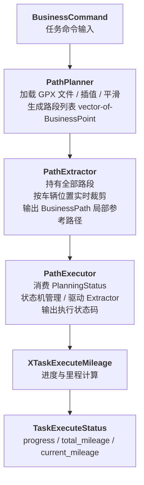
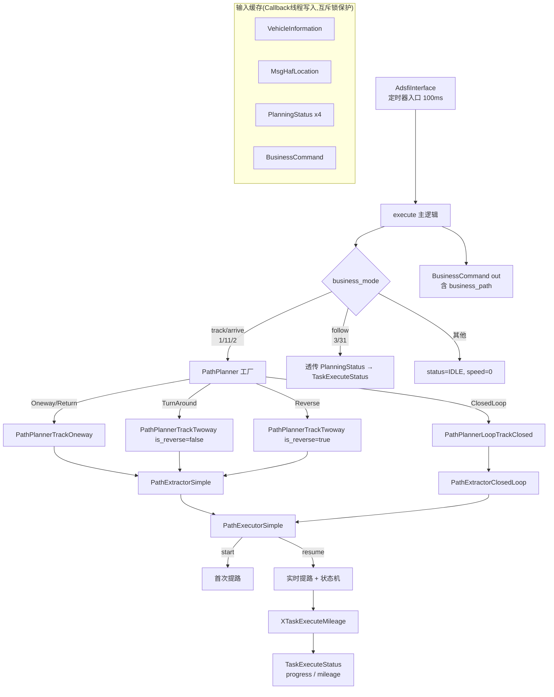
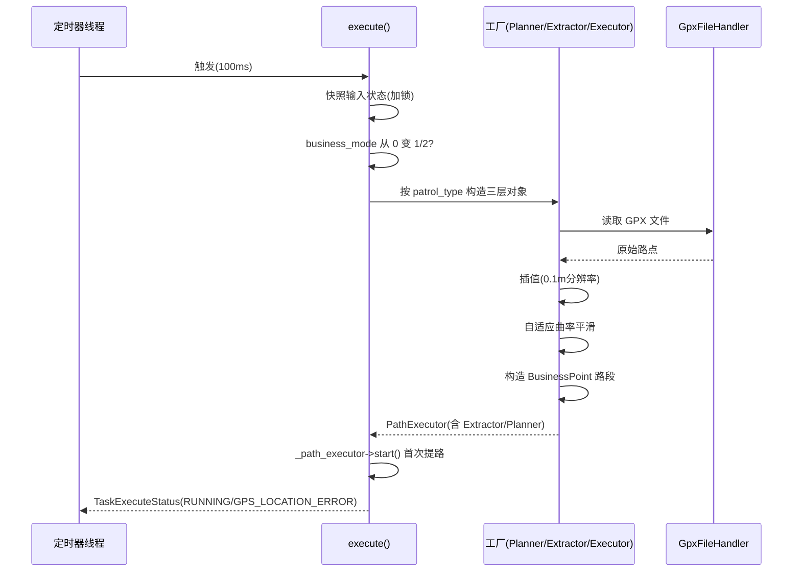
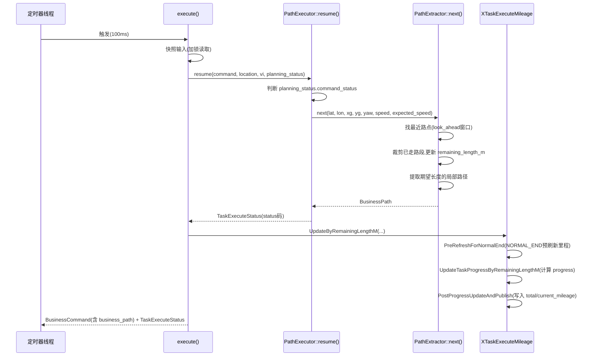
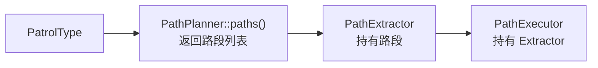
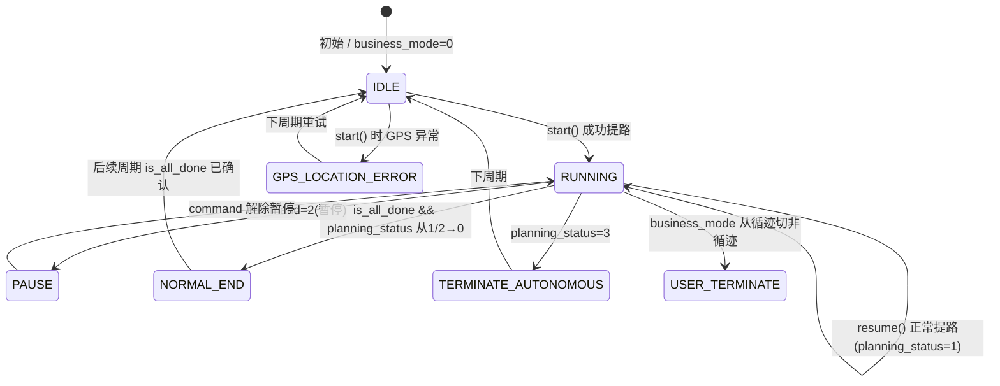

# XTaskExecutor 模块设计文档

# 1. 文档信息

| 项目 | 内容 |
| :--- | :--- |
| **模块名称** | XTaskExecutor（任务执行器） |
| **模块编号** | — |
| **所属系统 / 子系统** | 自动驾驶系统 / 任务调度层 (task_schedule_model) |
| **模块类型** | 平台模块 |
| **负责人** | — |
| **参与人** | — |
| **当前状态** | 草稿 |
| **版本号** | V1.1 |
| **创建日期** | 2026-02-26 |
| **最近更新** | 2026-03-04 |

---

# 2. 模块概述

## 2.1 模块定位

**职责**：XTaskExecutor 是自动驾驶系统任务调度层中负责"任务执行"的核心模块。其核心职责是：
1. 根据业务命令（BusinessCommand）和巡逻类型（PatrolType），将离线轨迹文件转化为实时局部参考路径（business_path），供下游规划层跟踪执行；
2. 跟踪规划层反馈（PlanningStatus），管理执行状态机（IDLE → RUNNING → NORMAL_END 等）；
3. 向上游输出任务执行状态（TaskExecuteStatus），包括执行状态码、进度（0-100%）和里程（total/current）。

**上游模块（输入来源）**：
- 任务调度/业务层：发布 `BusinessCommand`（任务参数、模式、巡逻类型）
- 定位模块：发布 `MsgHafLocation`（GPS/GCCS位置、姿态）
- 车辆状态：发布 `VehicleInformation`（车速等）
- 规划层：发布 `PlanningStatus` × 4（track / follow / arrive / adjust 各一路）

**下游模块（输出去向）**：
- 规划层（track / arrive）：消费 `BusinessCommand`（含 `business_path` 局部参考路径）
- 任务状态消费方（HMI、调度）：消费 `TaskExecuteStatus`（状态码、进度、里程）

**对外能力**：不对外提供 SDK/Service/API；以 Topic 发布方式对接中间件。

## 2.2 设计目标

- **功能目标**：支持单程（Oneway/Return）、往返（TurnAround/Reverse）、闭环绕圈（ClosedLoop）、跟随（Follow）多种任务模式；实时按车辆位置裁剪并提取局部路径；准确跟踪并上报任务完成进度与行驶里程。
- **性能目标**：定时器周期 100ms，每周期内完成路径提取、状态机更新、进度/里程计算并输出；路径提取单次耗时需满足 100ms 时限约束。
- **稳定性目标**：进度/里程数值健壮（NaN/inf/负值兜底处理）；路径文件加载失败通过故障码上报，不引发崩溃；状态机可从异常状态恢复至 IDLE。
- **安全目标**：车辆距路径过远（`4082013`）、闭环路径折返（`4082017`）、路点过少（`4082012`）等异常均通过故障码实时上报；GPS 位置异常时可识别（状态码 `GPS_LOCATION_ERROR`）。
- **可维护性**：三层分层架构（Planner/Extractor/Executor），各层职责单一，可独立替换和测试；进度/里程逻辑封装于独立辅助类（`XTaskExecuteMileage`）。

## 2.3 设计约束

- **硬件平台 / OS**：Linux 车载平台（Linux 5.15），x86_64 / ARM64。
- **中间件 / 框架**：ADSFI 框架（`BaseAdsfiInterface`），使用 `avos::common::AvosNode`；共享内存 Topic 通信（`yf_shm`）。
- **依赖库**：Eigen（线性代数/主成分分析用于航向估算）、yaml-cpp（局部路径策略配置）、fmt（日志格式化）、GpxFileHandler（GPX 轨迹文件解析）。
- **坐标系**：GPS（WGS84，lat/lon）和 GCCS（地心直角坐标，xg/yg）双坐标系并存；路径对齐基于 GCCS。
- **线程安全**：Callback 为多线程写入，以 `_in_mtx` 互斥锁保护；`execute()` 在定时器线程单线程调用，内部无需额外锁。

---

# 3. 需求与范围

## 3.1 功能需求（FR）

| 需求ID | 描述 | 优先级 |
| :--- | :--- | :--- |
| FR-01 | 支持单程循迹（Oneway/Return）：从 GPX 文件加载路径，按目的地方向行驶至终点后结束 | 高 |
| FR-02 | 支持往返循迹（TurnAround/Reverse）：去程 + 返程两段，返程支持掉头（正向）和倒车两种模式 | 高 |
| FR-03 | 支持闭环绕圈（ClosedLoop）：路径首尾相连成环，检查首尾间距与总长度约束，循环执行不结束 | 高 |
| FR-04 | 支持跟随模式（Follow）：不做路径管理，直接透传规划层跟随状态 | 中 |
| FR-05 | 实时按车辆位置裁剪路径，提取速度自适应长度的局部参考路径（`business_path`） | 高 |
| FR-06 | 维护任务执行状态机（IDLE/RUNNING/PAUSE/GPS_LOCATION_ERROR/ARRIVE_DESTINATION/USER_TERMINATE/NORMAL_END/TERMINATE_AUTONOMOUS） | 高 |
| FR-07 | 计算并输出任务进度（progress，0-100%），要求单调不减，NORMAL_END 后锁定 100% | 高 |
| FR-08 | 计算并输出任务里程（total_mileage/current_mileage，单位 m），与进度口径一致 | 高 |
| FR-09 | 任务启动/结束/模式切换时，自动清零/上报故障码（Ec408 错误码集合） | 中 |
| FR-10 | 路径加载时执行平滑处理（自适应曲率平滑，Adaptive Curvature Smoother） | 中 |
| FR-11 | 闭环模式自动检测车辆行驶方向（正向/反向）并重排路径点 | 高 |
| FR-12 | 检测自车与路径最近点距离，超限时上报故障码 `4082013` | 中 |
| FR-13 | 检测自车航向与循迹方向一致性，不一致时上报故障码 `4082017` | 中 |
| FR-14 | 集成 OTel 分布式追踪，消费 BusinessCommand.trace_ctx 创建任务生命周期 Span，仅在状态实际变化时添加 Span Event，实现事件驱动的任务可观测性 | 中 |

## 3.2 非功能需求（NFR）

| 需求ID | 类型 | 指标 | 目标值 |
| :--- | :--- | :--- | :--- |
| NFR-01 | 性能 | 定时器周期 | 100ms |
| NFR-02 | 性能 | 单次 `execute()` 耗时（含路径提取） | < 80ms（留 20ms 余量） |
| NFR-03 | 稳定性 | `remaining_length_m` 异常值（NaN/inf/负值）处理 | 不透出异常，告警节流（每50次打印1次） |
| NFR-04 | 稳定性 | 路径文件加载失败后 | 通过故障码上报，`_path_executor` 置 null，不崩溃 |
| NFR-05 | 稳定性 | progress 单调性 | 当前计算值 < 上次输出值时，维持上次输出 |
| NFR-06 | 可观测性 | 关键状态转换日志 | AINFO 覆盖：基线建立/清除、完成保持进入/退出、里程清零 |
| NFR-07 | 可观测性 | 高频发布日志节流 | 里程发布日志每 20 周期打印 1 次；告警每 50 次打印 1 次 |
| NFR-08 | 可维护性 | 新增 PatrolType | 仅需在 `execute()` switch 中增加分支，Planner/Extractor/Executor 均可独立扩展 |

## 3.3 范围界定（必须明确）

### 3.3.1 本模块必须实现：

- GPX 轨迹文件解析与路径预处理（插值、平滑）
- 多 PatrolType 的路径构造（单程 / 往返 / 闭环）
- 实时局部路径提取（按速度自适应长度）
- 执行状态机管理（Planner → Extractor → Executor）
- 任务进度（progress）和里程（mileage）计算与发布
- 故障码上报与清除（Ec408 错误码）

### 3.3.2 本模块明确不做：

- **路径规划**：不做全局路径规划（GlobalOneway/GlobalRawPlan 相关代码已注释掉）
- **运动控制**：不生成油门/刹车/转向指令，仅输出参考路径
- **定位算法**：不处理 GPS 融合，仅消费定位结果
- **避障**：障碍物感知与避障由规划层处理，执行器透传 `task_avoid_mode`
- **跟随路径生成**：跟随模式（Follow）下无路径管理，完全由规划层处理

## 3.4 需求-设计-验证映射（评审必查）

| 需求ID | 对应设计章节 | 对应接口/实现 | 验证方式 / 用例 |
| :--- | :--- | :--- | :--- |
| FR-01 | 5.3（主流程）| `PathPlannerTrackOneway` + `PathExtractorSimple` | TC-01 |
| FR-02 | 5.3 | `PathPlannerTrackTwoway`（is_reverse=false/true） | TC-02, TC-03 |
| FR-03 | 5.3 | `PathPlannerLoopTrackClosed` + `PathExtractorClosedLoop` | TC-04 |
| FR-04 | 5.3 | `execute()` is_follow 分支 | TC-05 |
| FR-05 | 5.3 | `PathExtractor::next()` / `PathExtractorClosedLoop::erase_passed_points()` | TC-06 |
| FR-06 | 8.2（状态机）| `PathExecutorSimple::resume()` | TC-07 |
| FR-07 | 8.1 | `XTaskExecuteMileage::UpdateByRemainingLengthM()` | TC-08 |
| FR-08 | 8.1 | `XTaskExecuteMileage::PostProgressUpdateAndPublish()` | TC-09 |
| FR-09 | 9（异常处理）| `execute()` 模式切 0 时的故障码清除 | TC-10 |
| FR-10 | 5.2 | `AdaptiveCurvatureSmoother` | TC-11 |
| FR-11 | 5.3 | `PathExtractorClosedLoop::init_vehicle_index_and_direction()` | TC-12 |
| FR-12 | 5.3 | `FaultHandle` 上报 `4082013` | TC-13 |
| FR-13 | 5.3 | `FaultHandle` 上报 `4082017` | TC-14 |
| FR-14 | 5.3, 8.2 状态机 | `AdTracker::Span`, `BusinessCommand.trace_ctx` | TC-17 |

---

# 4. 设计思路

## 4.1 方案概览

本模块采用**三层流水线**设计：



**关键数据流**：
- 输入：`BusinessCommand` → `execute()` → 依据 `patrol_type` 构造 Planner/Extractor/Executor 三元组
- 每周期调用 `resume()` → `next()` → 填充 `business_command.business_path`（下行给规划层）
- 同周期调用 `UpdateByRemainingLengthM()` → 填充 `task_execute_status.progress/total_mileage/current_mileage`（上行给调度/HMI）

## 4.2 关键决策与权衡

| 决策点 | 选择 | 理由 |
| :--- | :--- | :--- |
| 状态保留方式 | `_path_executor`（`shared_ptr`）跨周期持有 | 避免每周期重建，确保路径状态连续；通过 `business_mode` 从 0 切换触发重建 |
| 进度计算基线 | 首次进入循迹分支时建立 `remaining_length_m` 基线 | "以第一次对齐后的起点为 0"，屏蔽启动时的裁剪抖动 |
| 进度单调性 | 软约束：`percent < last_progress_percent` 时沿用上次输出 | 避免路径抖动引起进度回退，用户体验更稳定 |
| 闭环路径管理 | 合并正反两段为单一循环数组，耗尽后追加副本 | 简化闭环无限循环逻辑，避免复杂的索引环绕判断 |
| 路径平滑 | 自适应曲率平滑（高曲率区用低强度，低曲率区用高强度） | 保留弯道精度，对直线段适度光滑，减小追踪误差 |
| 里程与进度共享基线 | `progress_baseline_remaining_m` 同时作为 `total_mileage` 来源 | 保证两者口径一致，避免分子分母不同导致里程/进度矛盾 |

## 4.3 与现有系统的适配

- **中间件适配**：继承 `BaseAdsfiInterface`，通过 `SetScheduleInfo("timmer", 100)` 注册 100ms 定时器；输入通过 `Callback()` 注入，输出通过 `Process()` 拉取，适配 ADSFI 框架的拉模型。
- **Topic 适配**：`global.conf` 定义各 Callback 对应的 Topic 名称（如 `/tpvehicle_to_can`、`/tproute_preview`），与硬件无关，部署时可灵活配置。
- **定位坐标系适配**：`MsgHafLocation` 同时提供 GPS（`llh.y/x`）和 GCCS（`pose.pose.position.x/y`）；路径提取统一换算为 GCCS，避免跨坐标系距离误差。

## 4.4 失败模式与降级

| 失败场景 | 处理策略 | 可恢复性 |
| :--- | :--- | :--- |
| GPX 文件不存在/读取失败 | 捕获 `ExceptionLoadTrackFile`，上报 `4082010`，`_path_executor` 置 null | 下次任务命令下发时重试 |
| 轨迹路点数量不足 | 捕获 `ExceptionTrackPointsTooFew`，上报 `4082012` | 同上 |
| 目的地与轨迹不匹配 | 捕获 `ExceptionInvalidDestination`，上报 `4082011` | 任务重下发可恢复 |
| 配置参数读取失败 | 上报 `4082001`，抛出运行时异常，模块终止并通过故障码告知 | 需修复配置并重启 |
| 闭环路径首尾距离过大 | 上报 `4082015`，继续运行（不强制中止任务） | 可接受降级运行 |
| 闭环路径总长不足 | 上报 `4082014`，继续运行 | 同上 |
| 车辆距路径过远 | 上报 `4082013`，继续提路（不中止执行） | 车辆归位后自动恢复 |
| `remaining_length_m` 异常（NaN/inf） | 进度/里程沿用上次输出，节流告警 | 自动恢复 |
| 业务模式切 0 | 清空 `_path_executor`，清除所有故障码 | 下次任务自动重建 |

---

# 5. 架构与技术方案

## 5.1 模块内部架构



**线程模型**：
- **Callback 线程**（多个）：接收各 Topic 消息，通过 `_in_mtx` 加锁写入共享指针
- **定时器线程**（单一）：每 100ms 触发 `Process()` → `execute()`；先加锁快照所有输入状态，随后单线程执行所有路径计算和状态机逻辑

**同步模型**：输入采用"最新值覆盖"（last-value store），`Process()` 内加锁快照后立即释放，计算过程无锁。

## 5.2 关键技术选型

| 技术点 | 方案 | 选择原因 | 备选方案 |
| :--- | :--- | :--- | :--- |
| 路径平滑 | 自适应曲率迭代平滑（高斯加权窗口 + 曲率自适应 alpha） | 保护弯道精度同时对直道平滑，收敛阈值可调 | 三次样条（计算量大）、固定 alpha 平均（弯道失真） |
| 航向估算 | PCA（主成分分析）+ 最大特征向量方向 | 抗单点噪声，适合密集点云 | 首尾差分（噪声敏感） |
| 近邻搜索 | 顺序扫描 + look_ahead_time 搜索窗口约束 | 路径点已按顺序排列，窗口约束避免跳远点 | KD-Tree（过重） |
| 状态持久化 | 跨周期 `shared_ptr<PathExecutor>` + 成员变量 | 简单高效，符合单线程定时器模型 | 外部状态机框架 |
| 分布式追踪 | xad_tracker（OTel C++ SDK 1.14.2 OTLP/HTTP） | 平台统一追踪库；事件驱动 Span Event 仅在状态变化时记录，100ms 定时器不产生追踪开销 | 直接使用 OTel SDK |
| 进度基线 | `remaining_length_m` 首次进入循迹分支时快照 | 口径与里程统一，实现简单 | 路径总长度（与实际执行不一致） |

## 5.3 核心流程

### 启动流程



### 稳态（每周期）主流程



### 异常流程

- **路径文件加载失败**：`execute()` catch 异常 → 上报对应故障码 → `_path_executor = nullptr` → 本周期输出 `status=0`；下周期若 `business_mode` 仍为循迹且 `_path_executor==null`，则重试构造。
- **GPS 异常**：（当前代码已注释 GPS 校验以规避定位跳变问题，保留代码入口但屏蔽判断。）
- **路点耗尽但未结束**：`PathExtractorSimple::next()` 在当前段点数 ≤ 5 时清空当前段并调用 `done()`，切换到下一段；`PathExecutorSimple::resume()` 检测 `is_all_done()` 触发 `NORMAL_END`。

---

# 6. 界面设计

> 本节适用于含用户界面（Web / 桌面 / 终端 UI）的模块。纯后端或库类模块可跳过此节。

本模块（XTaskExecutor）为纯后端执行模块，不提供任何用户界面，**本节不适用（N/A）**。

---

# 7. 接口设计（评审重点）

## 7.1 对外接口

| 接口名 | 类型 | 输入 | 输出 | 频率 | 备注 |
| :--- | :--- | :--- | :--- | :--- | :--- |
| `Callback(VehicleInformation)` | Topic 订阅 | `/tpvehicle_to_can` | — | 按需 | 存储到 `_vehicle_info_ptr` |
| `Callback(MsgHafLocation)` | Topic 订阅 | GPS/GCCS 定位消息 | — | 按需 | 存储到 `_location_info_ptr` |
| `Callback(PlanningStatus, name)` | Topic 订阅 | `tpplanningstatus_track/follow/arrive/adjust` | — | 按需 | 按 name 分发到对应指针 |
| `Callback(BusinessCommand)` | Topic 订阅 | 任务命令消息 | — | 按需 | 存储到 `_business_command_ptr` |
| `Process(BusinessCommand&)` | 定时器拉取 | — | `BusinessCommand`（含 `business_path`） | 100ms | 输出给规划层 |
| `Process(TaskExecuteStatus&)` | 定时器拉取 | — | `TaskExecuteStatus`（status/progress/mileage） | 100ms | 输出给调度/HMI |

## 7.2 对内接口

**AdsfiInterface → execute()**

```cpp
void execute(
    const MsgHafLocation&     location,
    const PlanningStatus&     planning_status_track,
    const PlanningStatus&     planning_status_arrive,
    const PlanningStatus&     planning_status_follow,
    const PlanningStatus&     planning_status_adjust,
    const VehicleInformation& vehicle_information,
    BusinessCommand&          business_command,       // 读入参数，同时写入 business_path
    TaskExecuteStatus&        task_execute_status     // 写出参数
);
```

**PathPlanner → PathExtractor → PathExecutor 构造链**



**PathExtractor 抽象接口**

| 方法 | 说明 |
| :--- | :--- |
| `next(lat, lon, xg, yg, yaw, speed, expected_speed)` | 按当前位置提取局部路径，同时更新 `remaining_length_m` |
| `done()` | 标记当前段执行完成，切换到下一段 |
| `reset()` | 清空所有路段（用户中止任务时调用） |
| `is_all_done()` | 所有路段均已完成 |
| `remaining_length_m()` | 返回剩余轨迹总长度（m） |

**PathExecutor 抽象接口**

| 方法 | 说明 |
| :--- | :--- |
| `start(business_command, location, vi)` | 首次提路（对齐到最近点） |
| `resume(business_command, location, vi, planning_status)` | 每周期续跑，返回执行状态 |
| `remaining_length_m()` | 委托给 Extractor |

## 7.3 接口稳定性声明

- **稳定接口**（变更必须评审）：
  - `Callback()` / `Process()` 签名及 Topic 名称
  - `TaskExecuteStatus` 中 `status` 枚举值含义
  - `business_path` 字段约定（`points`、`length`）
  - 错误码（Ec408 `4082xxx`）

- **非稳定接口**（允许调整，需标注）：
  - `PathExtractor::next()` 内部实现（仅影响 Extractor 实现类）
  - `XTaskExecuteMileage` 内部方法拆分

## 7.4 接口行为契约（必须填写）

### `Process(BusinessCommand&)`

- **前置条件**：`msg` 非 null；`_business_command_ptr` 已至少初始化一次（构造函数保证）
- **后置条件**：`msg->business_path.points` 包含从当前位置到前方若干米的轨迹点（已转换为车辆局部坐标系）；`msg->header.time` 更新为当前时刻
- **阻塞性**：非阻塞（定时器线程内调用，需在 100ms 内完成）
- **可重入性**：否（非线程安全；仅在单一定时器线程调用）
- **最大执行时间**：< 100ms（含路径提取）
- **失败语义**：返回 -1（`msg` 为 null 时）；路径加载失败时 `business_path.points` 为空，故障码已上报

### `Process(TaskExecuteStatus&)`

- **前置条件**：`msg` 非 null
- **后置条件**：`msg` 包含最新一次 `execute()` 后的状态快照
- **阻塞性**：非阻塞（仅内存拷贝）
- **失败语义**：返回 -1（`msg` 为 null）

---

# 8. 数据设计

## 8.1 数据结构

### 核心数据结构

| 结构体/类 | 描述 | 关键字段 |
| :--- | :--- | :--- |
| `BusinessCommand` | 任务命令（输入 + 输出复用） | `business_mode`（模式）、`param.patrol_type`、`param.patrol_name`（GPX文件路径）、`param.patrol_dest`（目的地）、`param.command`（0停/1运行/2暂停）、`business_path`（输出局部路径）、`trace_ctx`（W3C traceparent，OTel 跨进程追踪上下文，由 xzmq_task 注入，xtask_executor 只读） |
| `TaskExecuteStatus` | 执行状态（输出） | `status`（枚举值）、`progress`（0-100，unsigned char）、`total_mileage`（double，m）、`current_mileage`（double，m）、`distance_to_nearest`（double，m）、`current_limit_speed` |
| `PlanningStatus` | 规划层状态（输入） | `command_status`（0空闲/1执行中/2主动结束/3退自主）、`current_limit_speed` |
| `MsgHafLocation` | 定位消息（输入） | `llh.y`（lat）、`llh.x`（lon）、`pose.pose.position.x/y`（xg/yg GCCS）、`pose.pose.orientation.z`（yaw） |
| `VehicleInformation` | 车辆信息（输入） | `vehicle_act_state.speed`（当前车速 m/s） |
| `BusinessPoint` | 路径点 | `xg/yg`（GCCS全局坐标）、`x/y`（车辆局部相对坐标）、`heading`（航向）、`index`（序号） |
| `BusinessPath` | 局部路径 | `points`（BusinessPoint列表）、`length`（路径长度 m） |
| `LocalPathPolicyItem` | 速度-路径长度映射策略 | `expected_speed_kph`（km/h）、`local_path_length_m`（m） |

### PatrolType 枚举

| 枚举值 | 值 | 含义 |
| :--- | :--- | :--- |
| `Oneway` | — | 单程，从起点到终点 |
| `Return` | — | 单程（返程方向），与 Oneway 实现相同，方向由 dest 决定 |
| `TurnAround` | — | 往返，去程正向 + 返程正向（需掉头） |
| `Reverse` | — | 往返，去程正向 + 返程倒车 |
| `ClosedLoop` | — | 闭环绕圈，首尾相连无限循环 |

## 8.2 状态机（执行状态机）



**补充说明**：
- `ARRIVE_DESTINATION`（4）：仅由 `PathExecutorSimpleTaskPoints` 触发（当前主路径未启用），车辆到达 TaskPoint 阈值距离内时输出
- 状态机非线程安全，仅在定时器线程调用
- `IDLE` 输出时 `_path_executor` 被置为 `nullptr`，等待下次任务重建

## 8.3 数据生命周期

| 数据 | 创建时机 | 使用生命周期 | 销毁时机 |
| :--- | :--- | :--- | :--- |
| `_path_executor` | `business_mode` 从 0→循迹，首次 `execute()` | 循迹执行全程（跨周期） | `business_mode` 切 0，或状态变 `IDLE`，或加载失败 |
| `BusinessPoint` 路段 | PathPlanner 构造时加载 GPX 并插值 | PathExtractor 持有，随路径推进被逐步裁剪 | 全段完成（`is_all_done`）或 `reset()` |
| 进度状态（`_has_progress_baseline` 等） | 首次进入循迹可计算分支 | 跨周期，`AdsfiInterface` 成员变量持有 | 清零触发（新任务/用户结束/退自主/模式切 0） |
| `TaskExecuteStatus` 输出快照 | 每次 `execute()` 后写入 `_out_task_execute_status` | 下次 `Process()` 时拷贝输出 | 下次 `execute()` 覆盖 |
| GPX 文件缓存 | `GpxFileHandler` 内部（默认轨迹文件预加载） | 全进程生命周期 | 进程退出 |

---

# 9. 异常与边界处理（评审必查）

| 异常场景 | 检测方式 | 处理策略 | 是否可恢复 | 上报方式 |
| :--- | :--- | :--- | :--- | :--- |
| GPX 文件不存在/格式错误 | 捕获 `ExceptionLoadTrackFile` | 上报 `4082010`，`_path_executor=null` | 是（下次任务重试） | FaultApi::SetFaultCode |
| 目的地与轨迹端点不匹配 | 捕获 `ExceptionInvalidDestination` | 上报 `4082011`，`_path_executor=null` | 是 | FaultApi::SetFaultCode |
| 路点数量不足（< min_way_points） | 捕获 `ExceptionTrackPointsTooFew` / `ExceptionStartTooFewPoints` | 上报 `4082012`，`_path_executor=null` | 是 | FaultApi::SetFaultCode |
| 配置参数读取失败 | 捕获 `ExceptionLoadPlannerConfig` / `ExceptionLoadExtractorConfig` / `ExceptionLoadExeutorConfig` | 上报 `4082001`，抛出异常 | 否（需修复配置重启） | FaultApi::SetFaultCode |
| 车辆距路径最近点过远（> max_distance） | 实时检测 `gccs_distance > _max_distance_to_nearest_point` | 上报 `4082013`，继续提路不中止 | 是（车辆归位后自动恢复） | FaultApi::SetFaultCode |
| 闭环路径首尾距离过大 | 构造时检测 `dist > _max_distance_between_start_end` | 上报 `4082015`，继续运行（降级） | 是 | FaultApi::SetFaultCode |
| 闭环路径总长不足 | 构造时检测 `distance < _min_total_distance` | 上报 `4082014`，继续运行（降级） | 是 | FaultApi::SetFaultCode |
| 闭环航向初始化失败（无法判断方向） | 捕获 `std::runtime_error("cannot estimate heading")` | 上报 `4082016`，默认采用 begin→end 方向 | 是（降级为默认方向） | FaultApi::SetFaultCode |
| 自车与循迹方向航向差过大 | 实时检测 `heading_diff > _max_heading_diff` | 上报 `4082017`，继续提路 | 是 | FaultApi::SetFaultCode |
| `remaining_length_m` 为 NaN/inf | `std::isfinite()` 检测 | 进度/里程沿用上次输出，节流 AWARN（每50次1次） | 是（自动恢复） | AWARN 日志 |
| `remaining_length_m` 为负值 | `std::max(0.0, raw_remaining_m)` | 按 0 处理 | 是 | 无额外告警 |
| progress 基线过小（≤ 1e-3） | 数值判断 | 沿用上次进度输出，节流 AINFO | 是 | AINFO 日志 |
| 输入消息为 null（Callback） | `__glibc_unlikely(nullptr == msg)` | 丢弃 + AERROR | 是 | AERROR 日志 |
| Eigen 特征值分解失败 | `solver.info() != Eigen::Success` | 返回 `std::nullopt`，调用方上报故障码 | 是 | FaultApi::SetFaultCode |

---

# 10. 性能与资源预算（必须可验收）

## 10.1 性能指标

| 场景 | 指标 | 目标值 | 测试方法 |
| :--- | :--- | :--- | :--- |
| 定时器周期 | 调度周期 | 100ms | 日志打点 + 时间戳统计 |
| 单次 `execute()` 稳态耗时（路径已加载）| 路径提取 + 状态机 + 进度计算 | < 5ms | 函数内打点计时 |
| 单次 `execute()` 首次（含文件加载）| GPX 读取 + 插值 + 平滑 | < 500ms（允许首次超时，不阻塞定时器）| 实测 + 日志打点 |
| 路径平滑 | 收敛迭代次数 | ≤ 20 次 | 代码 max_iterations 参数 |
| `remaining_length_m` 精度 | 相对误差 | < 1%（相对总路径长度） | 模拟路径推进后对比累计距离 |

## 10.2 资源预算

| 资源 | 常态 | 峰值 | 上限约束 |
| :--- | :--- | :--- | :--- |
| CPU（定时器线程） | < 2%（单核） | < 5%（首次加载 + 平滑） | 10%（单核） |
| 内存（路径点缓存） | ~ 路段点数 × 每点约 64B | 闭环 merged_path 约 2× 路段 | 无硬性约束（路径文件通常 < 10MB） |
| 互斥锁争用 | 极低（快照后立即释放） | Callback 并发写时短暂争用 | < 1ms |
| 日志 I/O | 节流后约每 100ms 1-2 条 AINFO | 异常时 AERROR 每周期 1 条 | 不超过 log 子系统上限 |

---

# 11. 构建与部署

## 11.1 环境依赖

| 依赖项 | 版本要求 | 说明 |
| :--- | :--- | :--- |
| 操作系统 | Linux 5.15+ | Ubuntu / 车载 Linux |
| 编译器 | GCC 9+ / Clang 12+ | 支持 C++17 |
| 构建工具 | CMake 3.16+ | 通过 MDS 工具链调用 |
| Eigen | 3.3+ | 线性代数 / PCA 航向估算 |
| yaml-cpp | 0.6+ | YAML 配置解析 |
| fmt | 7.0+ | 日志格式化 |
| ADSFI 框架 | 项目指定版本 | BaseAdsfiInterface / AvosNode |
| CustomStack | 项目指定版本 | project config 配置读取 |
| GpxFileHandler | 项目内部库 | GPX 轨迹文件解析 |
| GeoUtils | 项目内部库 | 地理坐标计算 / 路径长度计算 |
| FaultHandle | 项目内部库 | 故障码上报 |
| xad_tracker | common/xad_tracker（项目内部） | OTel 追踪封装库 |
| opentelemetry C++ SDK | 1.14.2（third_party_arm） | OTLP/HTTP 追踪导出（由 xad_tracker 内部依赖） |

## 11.2 构建步骤

### 依赖安装

本模块作为 AP ADSFI 工程的子模块，所有依赖由工程级 CMakeLists 统一管理，无需单独安装。

### 构建命令

通过 MDS 工具链（CMake 命令行 / Eclipse CDT IDE）构建：

```bash
# 在 MDS 工作空间内针对目标平台（dp_gea）构建
cd build/build-dp_gea
cmake --build . --target XTaskExecutor -j$(nproc)
```

### 构建产物

| 产物 | 路径 | 说明 |
| :--- | :--- | :--- |
| 可执行文件 | `build/build-dp_gea/components/XTaskExecutor/XTaskExecutor` | 主进程可执行文件 |
| 配置文件 | `config/global.conf` | Callback / Process Topic 配置，随可执行文件一同部署 |

## 11.3 配置项

| 配置项 | 说明 | 默认值 | 是否必须 | 来源 |
| :--- | :--- | :--- | :--- | :--- |
| `planner/track/min_way_points` | 循迹最少有效路点数 | 10 | 是 | project config |
| `planner/track/max_distance_to_nearest_point` | 车辆距路径最大允许距离（m） | 20.0 | 是 | project config |
| `planner/track/look_ahead_time` | 近邻搜索时间前瞻窗口（s） | 2.0 | 是 | project config |
| `planner/track/min_look_ahead_distance` | 近邻搜索最小前瞻距离（m） | 2.0 | 是 | project config |
| `planner/track/max_heading_diff` | 循迹方向判断最大允许航向差（°） | — | 是 | project config |
| `planner/track/heading_fit_points` | 航向估算所用路点数 | 10 | 是 | project config |
| `planner/track/local_path_policy` | 速度-路径长度策略表（数组） | — | 是 | project config |
| `planner/track/match_global_nearest_point_when_start` | 启动时对齐全局最近点（bool） | — | 是 | project config |
| `planner/closedloop/constraints/min_total_distance` | 闭环路径最小总长度（m） | — | 是 | project config |
| `planner/closedloop/constraints/max_distance_between_start_end` | 闭环首尾最大允许距离（m） | 3.0 | 是 | project config |
| `/tpvehicle_to_can` Topic | VehicleInformation 订阅 Topic | 见 global.conf | 是 | global.conf |
| `/tpsensorcontrol` Topic | VehicleSensorControl 订阅 Topic | 见 global.conf | 是 | global.conf |
| `/tpfault_data` Topic | Fault_data 订阅 Topic | 见 global.conf | 是 | global.conf |
| `/tproute_preview` Topic | RoutePreview 订阅 Topic | 见 global.conf | 是 | global.conf |

> 所有 project config 项通过 `CustomStack::GetProjectConfigValue()` 在模块初始化时读取；任意项读取失败将上报故障码 `4082001` 并终止初始化流程。

## 11.4 部署结构与启动

### 部署目录结构

```text
/deploy/XTaskExecutor/
├── XTaskExecutor          # 可执行文件
└── config/
    └── global.conf        # Callback/Process Topic 配置
```

### 启动 / 停止命令

- **启动**：由平台 launcher 或 systemd 随整个 AP 自驾栈自动拉起，无需手动干预
- **停止**：随整个 AP 自驾栈优雅退出；launcher 负责进程生命周期管理
- **进程管理**：launcher 统一管理，异常崩溃时自动重启

## 11.5 健康检查与启动验证

| 检查项 | 判断标准 | 说明 |
| :--- | :--- | :--- |
| 进程存活 | PID 存在 | launcher 持续监控 |
| 配置加载成功 | 无故障码 `4082001` | 配置读取失败立即上报并终止 |
| 中间件连接就绪 | ADSFI Topic 连接建立 | 框架层自动完成 |
| 定时器启动 | 日志出现首次 `execute()` 周期 | 100ms 内可见 |

启动超时参考：< 5s（含配置加载；轨迹文件在首次任务下发时按需加载）。

## 11.6 升级与回滚

| 操作 | 步骤 |
| :--- | :--- |
| 升级 | 1. 停止进程；2. 替换可执行文件；3. 如有 global.conf 变更同步替换；4. 重启进程；5. 确认无故障码 `4082001` |
| 回滚 | 1. 停止进程；2. 恢复旧版可执行文件及旧 global.conf；3. 重启进程 |
| 兼容性 | project config 键名变更需同步更新配置文件；`PatrolType` 枚举值变更需评审（L3 变更） |
| 数据兼容 | 无持久化数据，无数据迁移需求；重启后状态自动从 IDLE 重建 |

---

# 12. 可测试性与验证

## 12.1 单元测试

**覆盖范围**：
- `XTaskExecuteMileage`：可完全单测（无外部依赖），覆盖 8 个 progress 分支（强制0、退自主、用户结束、新任务触发、NORMAL_END、非 enable_progress、task_ended、正常计算）
- `PathExtractorSimple::next()`：Mock `BusinessPoint` 数组，验证路点裁剪逻辑和 `remaining_length_m` 递减
- `PathExtractorSimple::done()`：验证段切换和 remaining 更新
- `PathExtractorClosedLoop::init_vehicle_index_and_direction()`：验证正/反方向选择逻辑
- `AdaptiveCurvatureSmoother::smooth()`：验证收敛性和端点保留
- `PathExecutorSimple::resume()`：Mock PlanningStatus + Extractor，验证状态机转换

**Mock / Stub 策略**：
- `PathExtractor` 基类接口 Mock，用于测试 `PathExecutor` 状态机
- `CustomStack`（配置读取）通过测试配置文件或 Stub 注入
- `FaultHandle::FaultApi` Stub（记录调用，不真实上报）

## 12.2 集成测试

**上下游联调点**：
- 与 GpxFileHandler 联调：真实 GPX 文件加载/解析
- 与 PlanningStatus 联调：模拟规划层状态切换（0→1→2→0），验证 NORMAL_END 触发
- 与定位模拟器联调：模拟车辆沿路径行驶，验证路点裁剪和进度递增
- 与 HMI 联调：验证 `TaskExecuteStatus.progress/mileage` 实时性和准确性

## 12.3 可观测性

**关键日志点**（AINFO）：
- `[XTaskExecute][progress] 建立基线`：首次进入循迹分支，记录 baseline_m
- `[XTaskExecute][progress] NORMAL_END锁定100`：任务正常结束
- `[XTaskExecute][progress] 新任务触发清零`：start 命令上升沿或模式切换
- `[XTaskExecute][里程] 建立 progress/里程基线`：progress 基线建立
- `[XTaskExecute][里程] 进入完成保持`：里程进入保持阶段
- `[XTaskExecute][里程] 触发里程清零`：里程被清零（含 old 值）
- `[XTaskExecute][里程] 发布(运行中刷新/完成保持/清零)`：每 20 周期输出里程快照

**关键日志点**（AWARN）：
- `remaining_length_m 异常`：NaN/inf，每 50 次打印 1 次
- `baseline_m 异常`：NaN/inf，每 50 次打印 1 次
- `[里程] xxx 异常`：total/current 异常值，每 50 次打印 1 次

**监控指标**（建议接入）：
- `task_execute_status.progress`：进度值（可在 HMI 侧监控）
- `task_execute_status.status`：状态码（异常码 3/7 触发告警）
- 故障码 `4082013`（车辆偏离路径）：实时监控

---

# 13. 测试用例清单

| ID | 对应需求 | 测试项目 | 测试步骤 | 预期结果 | 测试结果 |
| :--- | :--- | :--- | :--- | :--- | :--- |
| TC-01 | FR-01 | 单程循迹正常完成 | 模拟车辆从起点沿路径行驶到终点，planning_status 从 1→2→0 | status=NORMAL_END，progress=100 | |
| TC-02 | FR-02 | 往返循迹（TurnAround）完成 | 去程完成后 planning_status 切 0，触发下一段；全程完成 | 两段均 NORMAL_END，progress=100 | |
| TC-03 | FR-02 | 往返循迹（Reverse）倒车回程 | 同 TC-02，返程段 is_reverse=true | 返程路段 heading 反向 | |
| TC-04 | FR-03 | 闭环绕圈运行 2 圈 | 路径点循环追加，持续运行 | status 持续 RUNNING，progress 始终 0 | |
| TC-05 | FR-04 | 跟随模式状态透传 | business_mode=3，planning_status_follow.command_status=1/2/3 | TaskExecuteStatus.status 分别为 RUNNING/USER_TERMINATE/TERMINATE_AUTONOMOUS | |
| TC-06 | FR-05 | 局部路径长度自适应速度 | 分别模拟低速（5km/h）和高速（30km/h） | 提取路径长度与 local_path_policy 对应值匹配 | |
| TC-07 | FR-06 | 状态机：退自主 | planning_status.command_status=3 | status=TERMINATE_AUTONOMOUS，path_executor 重置 | |
| TC-08 | FR-07 | progress 单调性 | 模拟 remaining_length_m 抖动（短暂变大） | progress 不回退，维持上次值 | |
| TC-09 | FR-08 | 里程计算准确性 | 总路径长 1000m，车辆行进 500m | total_mileage≈1000，current_mileage≈500 | |
| TC-10 | FR-09 | 模式切 0 时故障码清除 | 循迹中设置故障码，business_mode 切 0 | 所有 Ec408 故障码被 ResetFaultCode | |
| TC-11 | FR-10 | 路径平滑不改变端点 | 直线路径进行平滑 | 首尾两点坐标不变，中间点略有平滑 | |
| TC-12 | FR-11 | 闭环方向自动检测（正向） | 车辆航向与正向路段一致 | rearrange 后路径首点与车辆最近点一致 | |
| TC-13 | FR-12 | 车辆距路径过远上报故障 | 车辆坐标偏离路径 25m | 上报故障码 4082013 | |
| TC-14 | FR-13 | 航向不一致上报故障 | 自车航向与路径方向差 > max_heading_diff | 上报故障码 4082017 | |
| TC-15 | NFR-03 | remaining_length_m = NaN | 模拟 remaining_length_m 返回 NaN | progress 沿用上次值，AWARN 节流打印 | |
| TC-16 | NFR-05 | progress 锁定 100% 后清零 | NORMAL_END 后发送 start 命令 | progress 从 100 清零为 0，hold_completed=false | |

---

# 14. 风险分析（设计评审核心）

| 风险 | 影响 | 可能性 | 应对措施 |
| :--- | :--- | :--- | :--- |
| 定位跳变导致路点大幅裁剪 | 车辆急停（路径被剪空） | 中 | 已屏蔽 GPS 校验（注释掉），通过 look_ahead_time 窗口限制搜索范围；后续可引入定位质量过滤 |
| 首次加载（插值+平滑）耗时过长阻塞定时器 | 定时器本周期延迟 | 低-中（取决于路径长度） | 建议在后台线程预加载，或在 Init() 中预加载默认轨迹；当前实现未异步化 |
| 闭环路径合并后内存占用大 | 内存压力 | 低 | merged_path 为两段拼接，实际大小约 2× 原路径；监控路径文件大小，必要时限制最大点数 |
| PathExecutorSimple 中 `is_all_done` 多周期判断逻辑复杂 | NORMAL_END 误判（过早/过晚） | 中 | 已通过 `_last_is_all_done` 机制避免连续误判；建议增加单测覆盖边界情况 |
| progress 基线在多任务快速切换时状态残留 | 进度显示异常 | 低 | 模式切 0 时清空 `_has_progress_baseline`；start 命令上升沿触发强制清零；已覆盖 |
| 路径平滑引入坐标偏移（GCCS → 局部 → GCCS 转换精度） | 实际路径点略偏 | 低 | 平滑在 GCCS 坐标系执行，精度 < 0.01m（高斯窗口），可接受 |
| GPS_LOCATION_ERROR 状态当前被注释屏蔽 | 定位异常无法检测 | 中 | 待定位跳变问题解决后，恢复 GPS 质量检测逻辑，否则保持屏蔽但需说明原因 |

---

# 15. 设计评审

## 15.1 评审 Checklist

- [ ] 需求是否完整覆盖（FR-01 ~ FR-13 均有对应设计和测试用例）
- [ ] 接口是否清晰稳定（Topic 名称、BusinessCommand/TaskExecuteStatus 字段含义）
- [ ] 异常路径是否完整（第 9 节覆盖所有已知异常场景）
- [ ] 性能 / 资源是否有上限（第 10 节，首次加载耗时风险已标注）
- [ ] 是否存在过度设计（GlobalOneway/GlobalRawPlan 已注释，不在当前范围）
- [ ] 测试用例是否覆盖所有功能需求和非功能需求（TC-01~TC-16）
- [ ] GPS_LOCATION_ERROR 屏蔽原因是否记录（代码注释 `20250822`，需评审确认是否可恢复）
- [ ] `PathExecutorSimpleTaskPoints` 当前是否实际使用（当前注释，需确认是否可移除）

## 15.2 评审记录

| 日期 | 评审人 | 问题 | 结论 | 备注 |
| :--- | :--- | :--- | :--- | :--- |
| | | | | |

---

# 16. 变更管理（重点）

## 16.1 变更原则

- 不允许口头变更
- 接口 / 行为变更必须记录

## 16.2 变更分级

| 级别 | 示例 | 是否需要评审 |
| :--- | :--- | :--- |
| L1 | 注释 / 日志内容调整 / 日志节流参数 | 否 |
| L2 | progress 计算逻辑 / 路径提取策略 / 平滑参数 / 状态机分支 | 是 |
| L3 | Topic 名称 / TaskExecuteStatus 字段含义 / 错误码 / PatrolType 新增 | 是（系统级） |

## 16.3 变更记录

| 版本 | 变更内容 | 影响分析 | 评审人 |
| :--- | :--- | :--- | :--- |
| V1.0 | 初版文档，基于代码逆向分析生成 | — | — |
| V1.1 | 2026-03-04 | 新增 FR-14（OTel 分布式追踪集成）；BusinessCommand 新增 trace_ctx 字段（§8.1）；更新 §5.2 技术选型、§11.1 依赖；任务生命周期 Span 事件驱动设计 | — |

---

# 17. 交付与冻结

## 17.1 设计冻结条件

- [ ] 所有接口有对应测试用例（TC-01~TC-16 覆盖所有 FR）
- [ ] 所有 NFR 有验证方案（NFR-01~NFR-08 均有测试方法）
- [ ] 异常路径已覆盖（第 8 节 13 个异常场景全部覆盖）
- [ ] 变更影响分析完成
- [ ] GPS_LOCATION_ERROR 屏蔽问题已评审决策
- [ ] 首次加载异步化方案已确认（是否需要）

## 17.2 设计与交付物映射

| 设计文档 | 代码模块 | 接口文档 | 测试用例 |
| :--- | :--- | :--- | :--- |
| 第 5.1 节（架构） | `adsfi_interface/adsfi_interface.cpp` | `Process()` 签名 | TC-01~TC-05 |
| 第 5.3 节（Planner 流程） | `src/pathplanner/` | `PathPlanner::paths()` | TC-01~TC-04 |
| 第 5.3 节（Extractor 流程） | `src/pathextractor/` | `PathExtractor::next()` | TC-06, TC-12 |
| 第 8.2 节（状态机） | `src/pathexecutor/PathExecutorSimple.hpp` | `PathExecutor::resume()` | TC-07~TC-09 |
| 第 8.1 节（进度/里程） | `src/XTaskExecuteMileage.hpp` | `UpdateByRemainingLengthM()` | TC-08, TC-09, TC-15, TC-16 |
| 第 9 节（异常处理） | `src/Ec408.hpp` + `adsfi_interface.cpp` | 故障码定义 | TC-10, TC-13, TC-14 |

---

# 18. 附录

## 术语表

| 术语 | 说明 |
| :--- | :--- |
| GCCS | 地心直角坐标系（xg/yg），单位：米 |
| GPS | WGS84 经纬度坐标（lat/lon） |
| remaining_length_m | 当前任务剩余轨迹总长度（米） |
| business_path | 提供给规划层的局部参考路径（相对车辆坐标系） |
| PatrolType | 巡逻/循迹类型（Oneway/Return/TurnAround/Reverse/ClosedLoop） |
| progress | 任务完成进度（0-100，unsigned char，单调不减） |
| total_mileage | 任务总里程基线（首次进入循迹时的 remaining_length_m，单位 m） |
| current_mileage | 当前已行驶里程（total - current_remaining，单位 m） |
| look_ahead_time | 路点近邻搜索的时间前瞻窗口（秒） |
| local_path_policy | 速度-路径长度策略表，决定每次提路的路径长度 |
| NORMAL_END | 正常结束状态（ExecuteStatus=6），所有路段完成后触发 |
| hold_completed_progress | NORMAL_END 后将 progress/里程锁定为最后值的标志 |

## 参考文档

- [PatrolType.h](src/pathplanner/PatrolType.h) — 巡逻类型枚举定义
- [Ec408.hpp](src/Ec408.hpp) — 错误码定义（4082001~4082017）
- [XTaskExecuteMileage.hpp](src/XTaskExecuteMileage.hpp) — 进度/里程计算类（含详细注释）
- [global.conf](config/global.conf) — 模块 Topic 配置

## 历史版本记录

| 版本 | 日期 | 说明 |
| :--- | :--- | :--- |
| V1.0 | 2026-02-26 | 初版，基于代码逆向分析生成 |
| V1.1 | 2026-03-04 | 新增 FR-14：OTel 分布式追踪，任务生命周期 Span（消费 BusinessCommand.trace_ctx）+ 事件驱动 Span Event；BusinessCommand 新增 trace_ctx 字段；新增 xad_tracker / opentelemetry SDK 依赖 |
